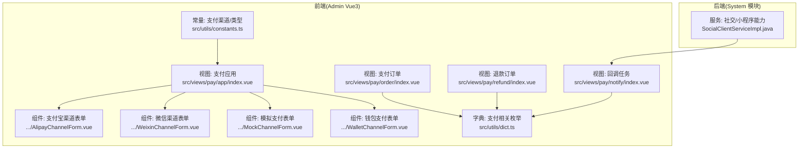
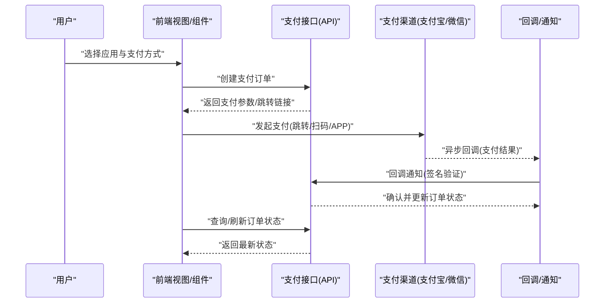
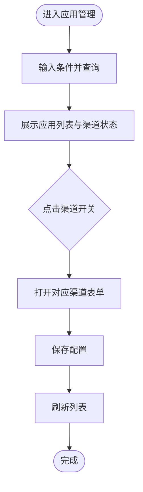
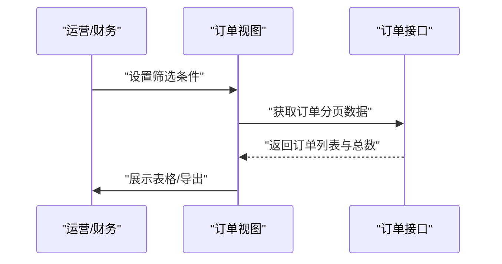
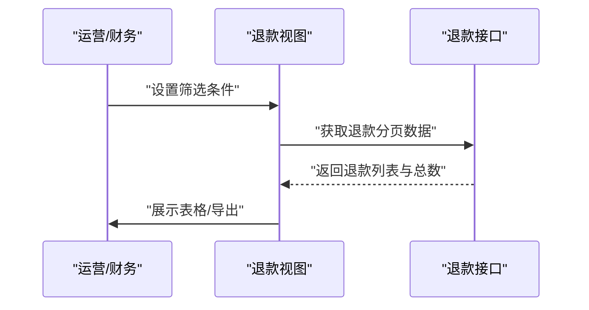
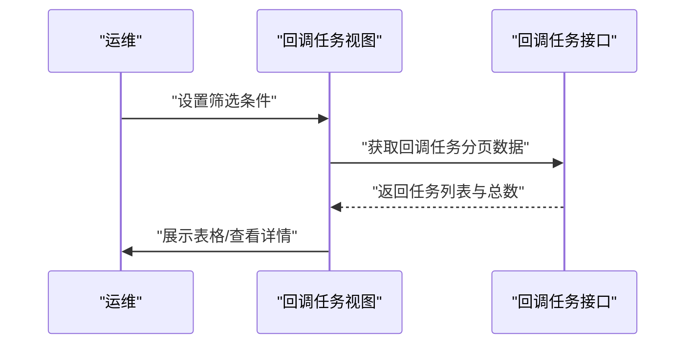
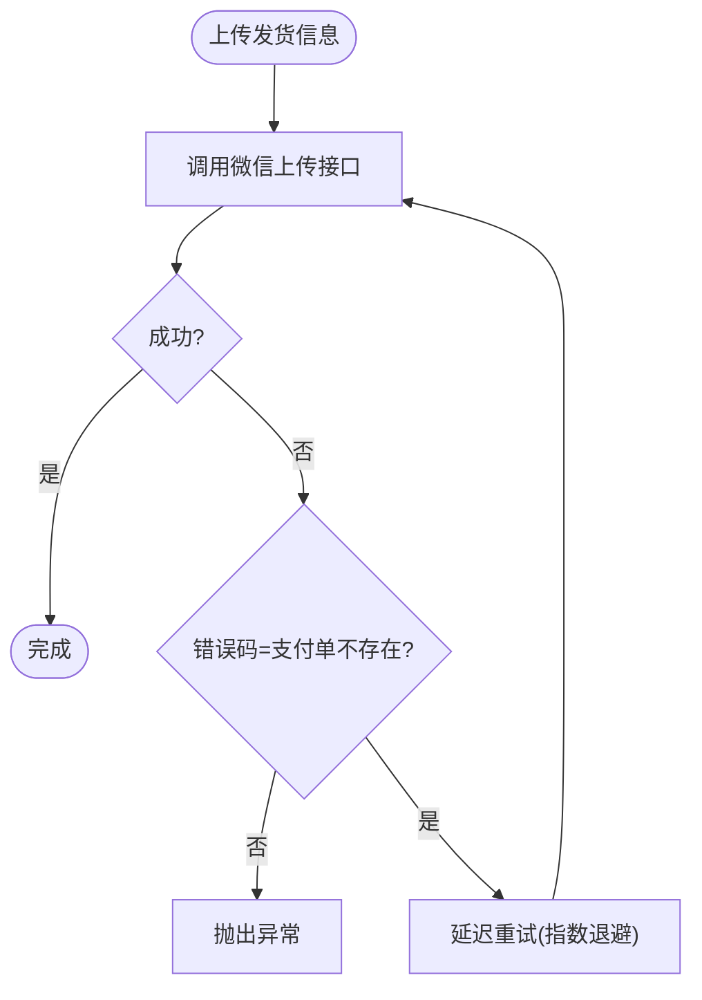
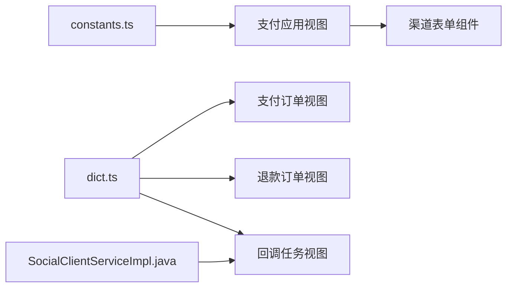
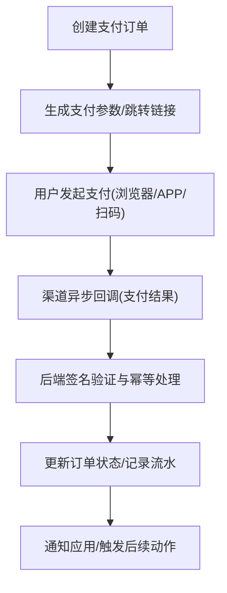

# 支付系统集成

<cite>
**本文引用的文件**
- [constants.ts](file://yudao-ui/yudao-ui-admin-vue3/src/utils/constants.ts)
- [dict.ts](file://yudao-ui/yudao-ui-admin-vue3/src/utils/dict.ts)
- [index.vue](file://yudao-ui/yudao-ui-admin-vue3/src/views/pay/app/index.vue)
- [index.vue](file://yudao-ui/yudao-ui-admin-vue3/src/views/pay/order/index.vue)
- [index.vue](file://yudao-ui/yudao-ui-admin-vue3/src/views/pay/refund/index.vue)
- [index.vue](file://yudao-ui/yudao-ui-admin-vue3/src/views/pay/notify/index.vue)
- [AlipayChannelForm.vue](file://yudao-ui/yudao-ui-admin-vue3/src/views/pay/app/components/channel/AlipayChannelForm.vue)
- [WeixinChannelForm.vue](file://yudao-ui/yudao-ui-admin-vue3/src/views/pay/app/components/channel/WeixinChannelForm.vue)
- [MockChannelForm.vue](file://yudao-ui/yudao-ui-admin-vue3/src/views/pay/app/components/channel/MockChannelForm.vue)
- [WalletChannelForm.vue](file://yudao-ui/yudao-ui-admin-vue3/src/views/pay/app/components/channel/WalletChannelForm.vue)
- [SocialClientServiceImpl.java](file://yudao-module-system/src/main/java/cn/iocoder/yudao/module/system/service/social/SocialClientServiceImpl.java)
</cite>

## 目录
1. [简介](#简介)
2. [项目结构](#项目结构)
3. [核心组件](#核心组件)
4. [架构概览](#架构概览)
5. [详细组件分析](#详细组件分析)
6. [依赖关系分析](#依赖关系分析)
7. [性能考虑](#性能考虑)
8. [故障排查指南](#故障排查指南)
9. [结论](#结论)
10. [附录](#附录)

## 简介
本文件面向“芋道 Ruoyi-Vue-Pro”支付系统的集成与落地，覆盖主流支付渠道（支付宝、微信支付）的接入方式、支付订单管理、回调处理、退款处理、对账管理等核心能力，并给出安全机制、流程实现、配置方法以及可复用的前端页面与组件参考路径，帮助开发者快速完成支付功能的集成与上线。

## 项目结构
支付相关能力在前端以“视图 + 组件 + 工具”的形式组织，后端通过系统模块提供社交/小程序能力（如微信发货信息上传），并与支付模块形成协作。

图表来源
- [index.vue:1-373](file://yudao-ui/yudao-ui-admin-vue3/src/views/pay/app/index.vue#L1-L373)
- [index.vue:1-276](file://yudao-ui/yudao-ui-admin-vue3/src/views/pay/order/index.vue#L1-L276)
- [index.vue:1-299](file://yudao-ui/yudao-ui-admin-vue3/src/views/pay/refund/index.vue#L1-L299)
- [index.vue:1-251](file://yudao-ui/yudao-ui-admin-vue3/src/views/pay/notify/index.vue#L1-L251)
- [constants.ts:104-191](file://yudao-ui/yudao-ui-admin-vue3/src/utils/constants.ts#L104-L191)
- [dict.ts:155-161](file://yudao-ui/yudao-ui-admin-vue3/src/utils/dict.ts#L155-L161)
- [AlipayChannelForm.vue](file://yudao-ui/yudao-ui-admin-vue3/src/views/pay/app/components/channel/AlipayChannelForm.vue)
- [WeixinChannelForm.vue](file://yudao-ui/yudao-ui-admin-vue3/src/views/pay/app/components/channel/WeixinChannelForm.vue)
- [MockChannelForm.vue](file://yudao-ui/yudao-ui-admin-vue3/src/views/pay/app/components/channel/MockChannelForm.vue)
- [WalletChannelForm.vue](file://yudao-ui/yudao-ui-admin-vue3/src/views/pay/app/components/channel/WalletChannelForm.vue)
- [SocialClientServiceImpl.java:376-393](file://yudao-module-system/src/main/java/cn/iocoder/yudao/module/system/service/social/SocialClientServiceImpl.java#L376-L393)

章节来源
- [index.vue:1-373](file://yudao-ui/yudao-ui-admin-vue3/src/views/pay/app/index.vue#L1-L373)
- [index.vue:1-276](file://yudao-ui/yudao-ui-admin-vue3/src/views/pay/order/index.vue#L1-L276)
- [index.vue:1-299](file://yudao-ui/yudao-ui-admin-vue3/src/views/pay/refund/index.vue#L1-L299)
- [index.vue:1-251](file://yudao-ui/yudao-ui-admin-vue3/src/views/pay/notify/index.vue#L1-L251)
- [constants.ts:104-191](file://yudao-ui/yudao-ui-admin-vue3/src/utils/constants.ts#L104-L191)
- [dict.ts:155-161](file://yudao-ui/yudao-ui-admin-vue3/src/utils/dict.ts#L155-L161)
- [AlipayChannelForm.vue](file://yudao-ui/yudao-ui-admin-vue3/src/views/pay/app/components/channel/AlipayChannelForm.vue)
- [WeixinChannelForm.vue](file://yudao-ui/yudao-ui-admin-vue3/src/views/pay/app/components/channel/WeixinChannelForm.vue)
- [MockChannelForm.vue](file://yudao-ui/yudao-ui-admin-vue3/src/views/pay/app/components/channel/MockChannelForm.vue)
- [WalletChannelForm.vue](file://yudao-ui/yudao-ui-admin-vue3/src/views/pay/app/components/channel/WalletChannelForm.vue)
- [SocialClientServiceImpl.java:376-393](file://yudao-module-system/src/main/java/cn/iocoder/yudao/module/system/service/social/SocialClientServiceImpl.java#L376-L393)

## 核心组件
- 支付渠道与类型定义：前端通过常量文件集中定义支付渠道枚举、展示模式与支付类型，便于统一管理与前端渲染。
- 字典体系：后端/前端通过字典键值维护支付状态、回调类型、渠道编码等，确保前后端一致。
- 视图组件：应用管理、订单管理、退款管理、回调任务等视图负责数据检索、分页与导出；各渠道表单组件负责配置参数收集与提交。
- 社交/小程序能力：后端服务提供微信侧能力（如小程序发货信息上传），与支付回调形成联动。

章节来源
- [constants.ts:104-191](file://yudao-ui/yudao-ui-admin-vue3/src/utils/constants.ts#L104-L191)
- [dict.ts:155-161](file://yudao-ui/yudao-ui-admin-vue3/src/utils/dict.ts#L155-L161)
- [index.vue:252-267](file://yudao-ui/yudao-ui-admin-vue3/src/views/pay/app/index.vue#L252-L267)
- [index.vue:32-36](file://yudao-ui/yudao-ui-admin-vue3/src/views/pay/order/index.vue#L32-L36)
- [index.vue:31-35](file://yudao-ui/yudao-ui-admin-vue3/src/views/pay/refund/index.vue#L31-L35)
- [index.vue:32-36](file://yudao-ui/yudao-ui-admin-vue3/src/views/pay/notify/index.vue#L32-L36)
- [SocialClientServiceImpl.java:376-393](file://yudao-module-system/src/main/java/cn/iocoder/yudao/module/system/service/social/SocialClientServiceImpl.java#L376-L393)

## 架构概览
支付系统从前端到后端的关键交互如下：

图表来源
- [index.vue:349-366](file://yudao-ui/yudao-ui-admin-vue3/src/views/pay/app/index.vue#L349-L366)
- [index.vue:226-235](file://yudao-ui/yudao-ui-admin-vue3/src/views/pay/order/index.vue#L226-L235)
- [index.vue:220-230](file://yudao-ui/yudao-ui-admin-vue3/src/views/pay/notify/index.vue#L220-L230)

## 详细组件分析

### 支付应用管理（前端）
- 功能要点
  - 支持按应用名、状态、时间范围检索。
  - 展示支付宝/微信/钱包/模拟支付等渠道开关状态，支持一键开启/关闭。
  - 提供新增/编辑/删除操作入口。
- 关键交互
  - 通过渠道编码判断打开对应渠道表单组件，进行参数配置与保存。
  - 使用字典选项填充渠道与状态，保证一致性。

图表来源
- [index.vue:269-371](file://yudao-ui/yudao-ui-admin-vue3/src/views/pay/app/index.vue#L269-L371)
- [index.vue:349-366](file://yudao-ui/yudao-ui-admin-vue3/src/views/pay/app/index.vue#L349-L366)

章节来源
- [index.vue:1-373](file://yudao-ui/yudao-ui-admin-vue3/src/views/pay/app/index.vue#L1-L373)
- [AlipayChannelForm.vue](file://yudao-ui/yudao-ui-admin-vue3/src/views/pay/app/components/channel/AlipayChannelForm.vue)
- [WeixinChannelForm.vue](file://yudao-ui/yudao-ui-admin-vue3/src/views/pay/app/components/channel/WeixinChannelForm.vue)
- [MockChannelForm.vue](file://yudao-ui/yudao-ui-admin-vue3/src/views/pay/app/components/channel/MockChannelForm.vue)
- [WalletChannelForm.vue](file://yudao-ui/yudao-ui-admin-vue3/src/views/pay/app/components/channel/WalletChannelForm.vue)

### 支付订单管理（前端）
- 功能要点
  - 支持按应用、渠道、商户单号、支付单号、渠道单号、状态、时间范围检索。
  - 展示金额、手续费、退款金额、支付状态、支付渠道、支付时间、应用名、商品标题等字段。
  - 支持导出与查看详情。
- 数据来源
  - 订单状态与渠道编码来自字典键值，确保与后端一致。

图表来源
- [index.vue:226-235](file://yudao-ui/yudao-ui-admin-vue3/src/views/pay/order/index.vue#L226-L235)
- [index.vue:32-36](file://yudao-ui/yudao-ui-admin-vue3/src/views/pay/order/index.vue#L32-L36)

章节来源
- [index.vue:1-276](file://yudao-ui/yudao-ui-admin-vue3/src/views/pay/order/index.vue#L1-L276)
- [dict.ts:155-161](file://yudao-ui/yudao-ui-admin-vue3/src/utils/dict.ts#L155-L161)

### 退款订单管理（前端）
- 功能要点
  - 支持按应用、渠道、商户/渠道支付/退款单号、状态、时间范围检索。
  - 展示支付金额、退款金额、退款状态、退款渠道、成功时间、应用名等。
  - 支持导出与查看详情。
- 数据来源
  - 退款状态与渠道编码来自字典键值。

图表来源
- [index.vue:249-258](file://yudao-ui/yudao-ui-admin-vue3/src/views/pay/refund/index.vue#L249-L258)
- [index.vue:31-35](file://yudao-ui/yudao-ui-admin-vue3/src/views/pay/refund/index.vue#L31-L35)

章节来源
- [index.vue:1-299](file://yudao-ui/yudao-ui-admin-vue3/src/views/pay/refund/index.vue#L1-L299)
- [dict.ts:155-161](file://yudao-ui/yudao-ui-admin-vue3/src/utils/dict.ts#L155-L161)

### 回调任务管理（前端）
- 功能要点
  - 支持按应用、通知类型、关联编号、通知状态、商户订单/退款/转账编号、时间范围检索。
  - 展示任务编号、应用名、商户单信息、通知类型、关联编号、通知状态、最后/下次通知时间、通知次数等。
  - 支持查看详情。
- 数据来源
  - 通知类型与状态来自字典键值。

图表来源
- [index.vue:220-230](file://yudao-ui/yudao-ui-admin-vue3/src/views/pay/notify/index.vue#L220-L230)
- [index.vue:32-36](file://yudao-ui/yudao-ui-admin-vue3/src/views/pay/notify/index.vue#L32-L36)

章节来源
- [index.vue:1-251](file://yudao-ui/yudao-ui-admin-vue3/src/views/pay/notify/index.vue#L1-L251)
- [dict.ts:155-161](file://yudao-ui/yudao-ui-admin-vue3/src/utils/dict.ts#L155-L161)

### 支付渠道表单组件（前端）
- 支付宝渠道表单
  - 路径参考：[AlipayChannelForm.vue](file://yudao-ui/yudao-ui-admin-vue3/src/views/pay/app/components/channel/AlipayChannelForm.vue)
  - 作用：收集并保存支付宝各类场景（APP/PC/WAP/扫码/条码）的配置参数。
- 微信渠道表单
  - 路径参考：[WeixinChannelForm.vue](file://yudao-ui/yudao-ui-admin-vue3/src/views/pay/app/components/channel/WeixinChannelForm.vue)
  - 作用：收集并保存微信各类场景（JSAPI/小程序/APP/Native/WAP/条码）的配置参数。
- 模拟支付表单
  - 路径参考：[MockChannelForm.vue](file://yudao-ui/yudao-ui-admin-vue3/src/views/pay/app/components/channel/MockChannelForm.vue)
  - 作用：用于演示与联调，不走真实渠道。
- 钱包支付表单
  - 路径参考：[WalletChannelForm.vue](file://yudao-ui/yudao-ui-admin-vue3/src/views/pay/app/components/channel/WalletChannelForm.vue)
  - 作用：配置钱包支付相关参数。

章节来源
- [index.vue:349-366](file://yudao-ui/yudao-ui-admin-vue3/src/views/pay/app/index.vue#L349-L366)
- [AlipayChannelForm.vue](file://yudao-ui/yudao-ui-admin-vue3/src/views/pay/app/components/channel/AlipayChannelForm.vue)
- [WeixinChannelForm.vue](file://yudao-ui/yudao-ui-admin-vue3/src/views/pay/app/components/channel/WeixinChannelForm.vue)
- [MockChannelForm.vue](file://yudao-ui/yudao-ui-admin-vue3/src/views/pay/app/components/channel/MockChannelForm.vue)
- [WalletChannelForm.vue](file://yudao-ui/yudao-ui-admin-vue3/src/views/pay/app/components/channel/WalletChannelForm.vue)

### 支付安全机制（后端参考）
- 微信小程序发货信息上传的重试机制
  - 当出现“支付单不存在”错误时，按指数退避策略重试，避免回调与订单信息上传的时间差导致失败。
  - 参考路径：[SocialClientServiceImpl.java:376-393](file://yudao-module-system/src/main/java/cn/iocoder/yudao/module/system/service/social/SocialClientServiceImpl.java#L376-L393)

图表来源
- [SocialClientServiceImpl.java:376-393](file://yudao-module-system/src/main/java/cn/iocoder/yudao/module/system/service/social/SocialClientServiceImpl.java#L376-L393)

章节来源
- [SocialClientServiceImpl.java:376-393](file://yudao-module-system/src/main/java/cn/iocoder/yudao/module/system/service/social/SocialClientServiceImpl.java#L376-L393)

## 依赖关系分析
- 前端依赖
  - 支付渠道与类型：constants.ts
  - 字典键值：dict.ts
  - 视图与组件：views/pay 下各页面与 components/channel 下的表单组件
- 后端依赖
  - 社交/小程序能力：SocialClientServiceImpl.java（与支付回调/发货信息上传相关）

图表来源
- [constants.ts:104-191](file://yudao-ui/yudao-ui-admin-vue3/src/utils/constants.ts#L104-L191)
- [dict.ts:155-161](file://yudao-ui/yudao-ui-admin-vue3/src/utils/dict.ts#L155-L161)
- [index.vue:1-373](file://yudao-ui/yudao-ui-admin-vue3/src/views/pay/app/index.vue#L1-L373)
- [index.vue:1-276](file://yudao-ui/yudao-ui-admin-vue3/src/views/pay/order/index.vue#L1-L276)
- [index.vue:1-299](file://yudao-ui/yudao-ui-admin-vue3/src/views/pay/refund/index.vue#L1-L299)
- [index.vue:1-251](file://yudao-ui/yudao-ui-admin-vue3/src/views/pay/notify/index.vue#L1-L251)
- [SocialClientServiceImpl.java:376-393](file://yudao-module-system/src/main/java/cn/iocoder/yudao/module/system/service/social/SocialClientServiceImpl.java#L376-L393)

章节来源
- [constants.ts:104-191](file://yudao-ui/yudao-ui-admin-vue3/src/utils/constants.ts#L104-L191)
- [dict.ts:155-161](file://yudao-ui/yudao-ui-admin-vue3/src/utils/dict.ts#L155-L161)
- [index.vue:1-373](file://yudao-ui/yudao-ui-admin-vue3/src/views/pay/app/index.vue#L1-L373)
- [index.vue:1-276](file://yudao-ui/yudao-ui-admin-vue3/src/views/pay/order/index.vue#L1-L276)
- [index.vue:1-299](file://yudao-ui/yudao-ui-admin-vue3/src/views/pay/refund/index.vue#L1-L299)
- [index.vue:1-251](file://yudao-ui/yudao-ui-admin-vue3/src/views/pay/notify/index.vue#L1-L251)
- [SocialClientServiceImpl.java:376-393](file://yudao-module-system/src/main/java/cn/iocoder/yudao/module/system/service/social/SocialClientServiceImpl.java#L376-L393)

## 性能考虑
- 前端
  - 列表分页与懒加载：使用分页组件控制请求频率，避免一次性加载大量数据。
  - 导出优化：导出前进行二次确认与加载态提示，减少无效请求。
- 后端
  - 回调重试：针对微信发货信息上传的异常采用指数退避重试，降低瞬时失败率。
- 安全
  - 回调签名验证：建议在后端对接收的回调参数进行签名验证与参数校验，防止伪造请求。

## 故障排查指南
- 回调未到账或状态异常
  - 检查回调地址是否正确配置，网络是否可达。
  - 在回调任务视图中核对通知类型、状态、通知次数与最后/下次通知时间。
- 支付单不存在或发货信息上传失败
  - 若出现“支付单不存在”，可参考后端重试逻辑，确认回调与订单创建顺序。
- 订单/退款查询不到或显示异常
  - 使用订单/退款视图的多维筛选条件精确查找，核对渠道编码与状态字典。

章节来源
- [index.vue:220-230](file://yudao-ui/yudao-ui-admin-vue3/src/views/pay/notify/index.vue#L220-L230)
- [SocialClientServiceImpl.java:376-393](file://yudao-module-system/src/main/java/cn/iocoder/yudao/module/system/service/social/SocialClientServiceImpl.java#L376-L393)
- [index.vue:226-235](file://yudao-ui/yudao-ui-admin-vue3/src/views/pay/order/index.vue#L226-L235)
- [index.vue:249-258](file://yudao-ui/yudao-ui-admin-vue3/src/views/pay/refund/index.vue#L249-L258)

## 结论
本支付系统在前端提供了完善的支付应用、订单、退款与回调管理界面，在后端通过社交/小程序能力保障了关键链路的稳定性。结合渠道表单组件与统一的字典/常量体系，开发者可以快速完成支付宝、微信等主流渠道的接入与配置，并依托回调任务与重试机制提升可靠性。

## 附录

### 支付流程（概念示意）

### 支付配置清单（参考）
- 支付应用
  - 应用名、开启状态、回调地址、退款回调地址
  - 渠道开关：支付宝/微信/钱包/模拟支付
- 支付宝配置
  - 场景：APP/PC/WAP/扫码/条码
  - 参数：应用ID、私钥、公钥、网关地址等
- 微信配置
  - 场景：JSAPI/小程序/APP/Native/WAP/条码
  - 参数：商户号、API密钥、证书、回调域名等
- 安全与合规
  - 回调签名验证、敏感信息加密存储、日志审计

### 测试用例建议
- 正向流程
  - 创建订单 → 选择渠道 → 成功支付 → 回调签名校验 → 状态更新
- 异常流程
  - 回调失败/重复回调 → 幂等处理 → 重试机制生效
  - 订单不存在 → 指数退避重试 → 最终成功
- 导出与查询
  - 订单/退款导出数据正确性校验
  - 回调任务列表筛选与详情查看