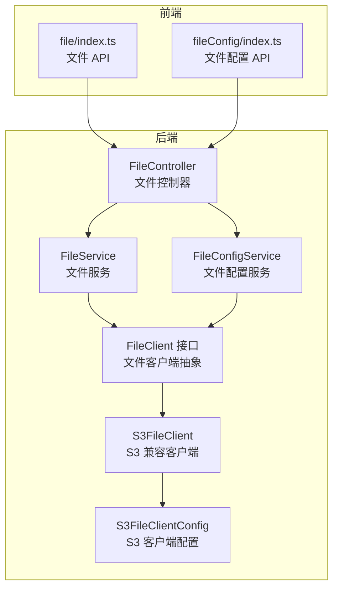
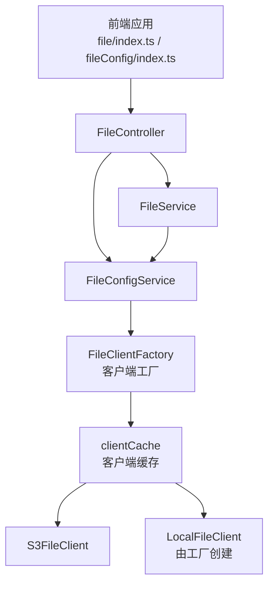
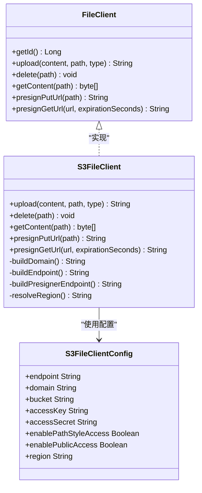
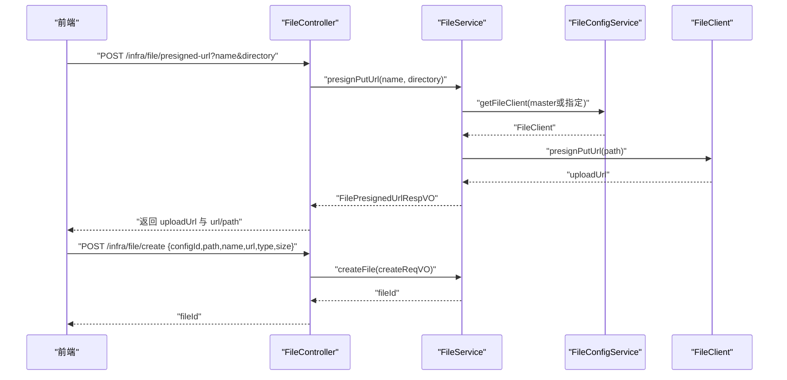
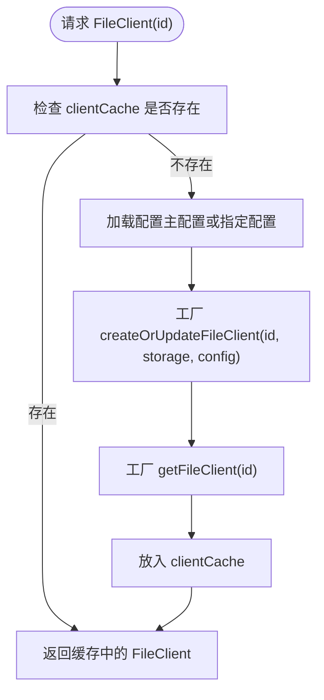
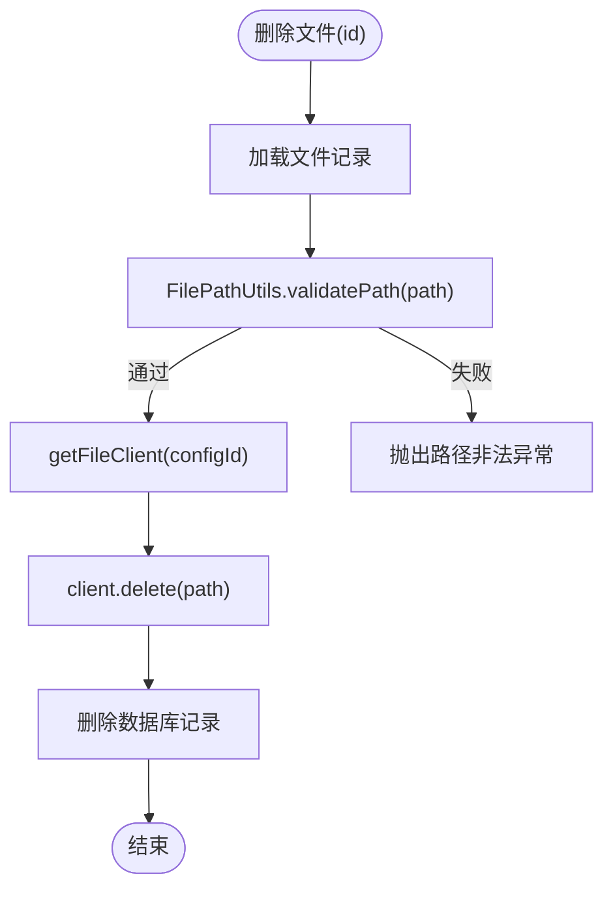
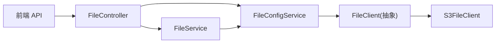
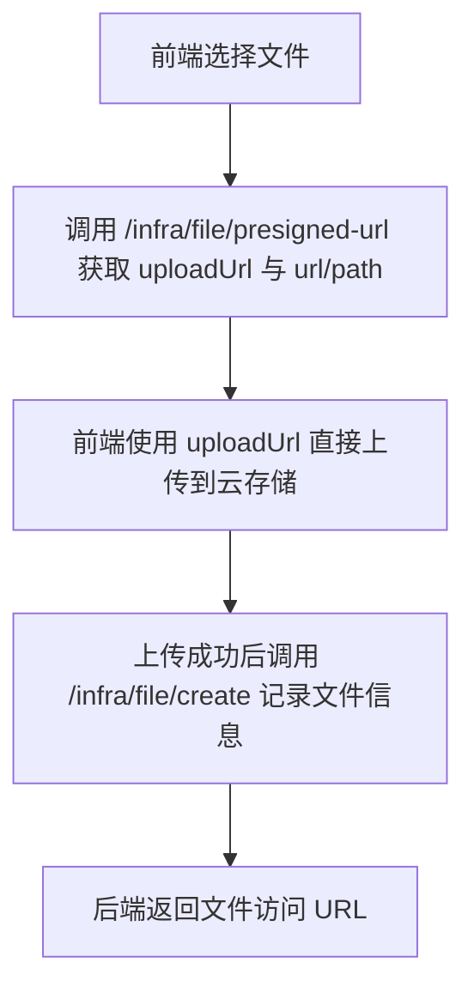

# 文件存储集成

<cite>
**本文引用的文件**
- [FileClient.java](file://yudao-module-infra/src/main/java/cn/iocoder/yudao/module/infra/framework/file/core/client/FileClient.java)
- [S3FileClient.java](file://yudao-module-infra/src/main/java/cn/iocoder/yudao/module/infra/framework/file/core/client/s3/S3FileClient.java)
- [S3FileClientConfig.java](file://yudao-module-infra/src/main/java/cn/iocoder/yudao/module/infra/framework/file/core/client/s3/S3FileClientConfig.java)
- [FileService.java](file://yudao-module-infra/src/main/java/cn/iocoder/yudao/module/infra/service/file/FileService.java)
- [FileServiceImpl.java](file://yudao-module-infra/src/main/java/cn/iocoder/yudao/module/infra/service/file/FileServiceImpl.java)
- [FileConfigService.java](file://yudao-module-infra/src/main/java/cn/iocoder/yudao/module/infra/service/file/FileConfigService.java)
- [FileConfigServiceImpl.java](file://yudao-module-infra/src/main/java/cn/iocoder/yudao/module/infra/service/file/FileConfigServiceImpl.java)
- [FileController.java](file://yudao-module-infra/src/main/java/cn/iocoder/yudao/module/infra/controller/admin/file/FileController.java)
- [FilePresignedUrlRespVO.java](file://yudao-module-infra/src/main/java/cn/iocoder/yudao/module/infra/controller/admin/file/vo/file/FilePresignedUrlRespVO.java)
- [FileCreateReqVO.java](file://yudao-module-infra/src/main/java/cn/iocoder/yudao/module/infra/controller/admin/file/vo/file/FileCreateReqVO.java)
- [file/index.ts](file://yudao-ui/yudao-ui-admin-vue3/src/api/infra/file/index.ts)
- [fileConfig/index.ts](file://yudao-ui/yudao-ui-admin-vue3/src/api/infra/fileConfig/index.ts)
- [FileConfigController.http](file://yudao-module-infra/src/main/java/cn/iocoder/yudao/module/infra/controller/admin/file/FileConfigController.http)
- [存储服务集成.md](file://.qoder/repowiki/zh/content/第三方集成/存储服务集成.md)
</cite>

## 目录
1. [简介](#简介)
2. [项目结构](#项目结构)
3. [核心组件](#核心组件)
4. [架构总览](#架构总览)
5. [详细组件分析](#详细组件分析)
6. [依赖分析](#依赖分析)
7. [性能考虑](#性能考虑)
8. [故障排查指南](#故障排查指南)
9. [结论](#结论)
10. [附录](#附录)

## 简介
本文件存储集成文档面向“芋道 Ruoyi-Vue-Pro”项目，系统性阐述文件存储子系统的扩展实现与集成方法。项目采用“后端统一抽象 + 多存储后端适配”的架构，支持本地存储与多云 S3 兼容存储（如阿里云 OSS、腾讯 COS、七牛云等）。核心能力包括：
- 文件上传、下载、删除
- 预签名 URL 生成（上传/下载）
- 文件记录管理（创建、查询、批量删除）
- 文件配置管理（创建、更新、主配置切换、测试连通性）
- 路径合法性校验与安全策略（路径穿越防护）

## 项目结构
文件存储相关代码主要位于“基础设施模块（infra）”，前端通过 API 调用后端接口完成文件操作。

**图表来源**
- [FileController.java:31-81](file://yudao-module-infra/src/main/java/cn/iocoder/yudao/module/infra/controller/admin/file/FileController.java#L31-L81)
- [FileService.java:39-98](file://yudao-module-infra/src/main/java/cn/iocoder/yudao/module/infra/service/file/FileService.java#L39-L98)
- [FileConfigService.java:17-94](file://yudao-module-infra/src/main/java/cn/iocoder/yudao/module/infra/service/file/FileConfigService.java#L17-L94)
- [FileClient.java:8-66](file://yudao-module-infra/src/main/java/cn/iocoder/yudao/module/infra/framework/file/core/client/FileClient.java#L8-L66)
- [S3FileClient.java:27-257](file://yudao-module-infra/src/main/java/cn/iocoder/yudao/module/infra/framework/file/core/client/s3/S3FileClient.java#L27-L257)
- [S3FileClientConfig.java:17-109](file://yudao-module-infra/src/main/java/cn/iocoder/yudao/module/infra/framework/file/core/client/s3/S3FileClientConfig.java#L17-L109)
- [file/index.ts:1-46](file://yudao-ui/yudao-ui-admin-vue3/src/api/infra/file/index.ts#L1-L46)
- [fileConfig/index.ts:1-59](file://yudao-ui/yudao-ui-admin-vue3/src/api/infra/fileConfig/index.ts#L1-L59)

**章节来源**
- [FileController.java:31-81](file://yudao-module-infra/src/main/java/cn/iocoder/yudao/module/infra/controller/admin/file/FileController.java#L31-L81)
- [file/index.ts:1-46](file://yudao-ui/yudao-ui-admin-vue3/src/api/infra/file/index.ts#L1-L46)
- [fileConfig/index.ts:1-59](file://yudao-ui/yudao-ui-admin-vue3/src/api/infra/fileConfig/index.ts#L1-L59)

## 核心组件
- 文件客户端抽象：定义统一的上传、删除、读取、预签名等能力，便于扩展不同存储后端。
- S3 兼容客户端：基于 AWS SDK 的 S3 客户端封装，适配多种云厂商（阿里云 OSS、腾讯 COS、七牛云等），并支持公开/私有访问、路径风格访问、区域解析、预签名 URL 等。
- 文件服务：负责文件业务逻辑，包括预签名 URL 生成、文件内容读取、路径合法性校验、记录创建与删除等。
- 文件配置服务：负责文件存储配置的增删改查、主配置切换、客户端缓存与工厂创建、连通性测试等。
- 控制器层：对外暴露 REST 接口，包括文件上传、预签名 URL、文件记录创建、文件配置管理等。
- 前端 API：提供文件与文件配置的前端调用封装。

**章节来源**
- [FileClient.java:8-66](file://yudao-module-infra/src/main/java/cn/iocoder/yudao/module/infra/framework/file/core/client/FileClient.java#L8-L66)
- [S3FileClient.java:27-257](file://yudao-module-infra/src/main/java/cn/iocoder/yudao/module/infra/framework/file/core/client/s3/S3FileClient.java#L27-L257)
- [S3FileClientConfig.java:17-109](file://yudao-module-infra/src/main/java/cn/iocoder/yudao/module/infra/framework/file/core/client/s3/S3FileClientConfig.java#L17-L109)
- [FileService.java:39-98](file://yudao-module-infra/src/main/java/cn/iocoder/yudao/module/infra/service/file/FileService.java#L39-L98)
- [FileConfigService.java:17-94](file://yudao-module-infra/src/main/java/cn/iocoder/yudao/module/infra/service/file/FileConfigService.java#L17-L94)
- [FileController.java:31-81](file://yudao-module-infra/src/main/java/cn/iocoder/yudao/module/infra/controller/admin/file/FileController.java#L31-L81)

## 架构总览
文件存储采用“控制器 → 服务 → 客户端”的分层架构，其中客户端通过工厂与缓存管理，支持多配置并存与主配置切换。

**图表来源**
- [FileController.java:31-81](file://yudao-module-infra/src/main/java/cn/iocoder/yudao/module/infra/controller/admin/file/FileController.java#L31-L81)
- [FileService.java:39-98](file://yudao-module-infra/src/main/java/cn/iocoder/yudao/module/infra/service/file/FileService.java#L39-L98)
- [FileConfigService.java:17-94](file://yudao-module-infra/src/main/java/cn/iocoder/yudao/module/infra/service/file/FileConfigService.java#L17-L94)
- [FileConfigServiceImpl.java:54-67](file://yudao-module-infra/src/main/java/cn/iocoder/yudao/module/infra/service/file/FileConfigServiceImpl.java#L54-L67)
- [S3FileClient.java:27-257](file://yudao-module-infra/src/main/java/cn/iocoder/yudao/module/infra/framework/file/core/client/s3/S3FileClient.java#L27-L257)

## 详细组件分析

### 文件客户端抽象与 S3 兼容实现
- 抽象接口定义了上传、删除、读取、预签名等通用能力，默认实现抛出“不支持的操作”，具体后端按需覆盖。
- S3 客户端实现：
  - 初始化阶段补全域名、端点、区域解析、凭据与路径风格访问配置。
  - 提供上传、删除、读取、上传/下载预签名 URL 生成。
  - 公开/私有访问策略：公开访问直接返回带域名的 URL；私有访问生成带签名的有效期 URL。
  - 域名与端点构建：支持裸域名、带协议、MinIO、七牛等差异化处理。
  - 区域解析：优先使用配置 region，其次从 endpoint 解析，最后回退默认值。

**图表来源**
- [FileClient.java:8-66](file://yudao-module-infra/src/main/java/cn/iocoder/yudao/module/infra/framework/file/core/client/FileClient.java#L8-L66)
- [S3FileClient.java:27-257](file://yudao-module-infra/src/main/java/cn/iocoder/yudao/module/infra/framework/file/core/client/s3/S3FileClient.java#L27-L257)
- [S3FileClientConfig.java:17-109](file://yudao-module-infra/src/main/java/cn/iocoder/yudao/module/infra/framework/file/core/client/s3/S3FileClientConfig.java#L17-L109)

**章节来源**
- [FileClient.java:8-66](file://yudao-module-infra/src/main/java/cn/iocoder/yudao/module/infra/framework/file/core/client/FileClient.java#L8-L66)
- [S3FileClient.java:27-257](file://yudao-module-infra/src/main/java/cn/iocoder/yudao/module/infra/framework/file/core/client/s3/S3FileClient.java#L27-L257)
- [S3FileClientConfig.java:17-109](file://yudao-module-infra/src/main/java/cn/iocoder/yudao/module/infra/framework/file/core/client/s3/S3FileClientConfig.java#L17-L109)

### 文件服务与控制器流程
- 文件上传（后端直传模式）：后端接收文件流，调用文件服务生成文件记录并返回访问 URL。
- 预签名 URL（前端直传模式）：后端返回上传预签名 URL 与文件访问 URL，前端直接上传至云存储，完成后调用后端创建文件记录。
- 文件删除：支持单个与批量删除，删除前进行路径合法性校验，再调用对应客户端删除并清理数据库记录。
- 文件内容读取：对路径进行校验后，通过客户端读取字节流返回给上层。

**图表来源**
- [FileController.java:57-73](file://yudao-module-infra/src/main/java/cn/iocoder/yudao/module/infra/controller/admin/file/FileController.java#L57-L73)
- [FileService.java:39-98](file://yudao-module-infra/src/main/java/cn/iocoder/yudao/module/infra/service/file/FileService.java#L39-L98)
- [FileConfigService.java:79-92](file://yudao-module-infra/src/main/java/cn/iocoder/yudao/module/infra/service/file/FileConfigService.java#L79-L92)
- [FilePresignedUrlRespVO.java:1-38](file://yudao-module-infra/src/main/java/cn/iocoder/yudao/module/infra/controller/admin/file/vo/file/FilePresignedUrlRespVO.java#L1-L38)
- [FileCreateReqVO.java:1-33](file://yudao-module-infra/src/main/java/cn/iocoder/yudao/module/infra/controller/admin/file/vo/file/FileCreateReqVO.java#L1-L33)

**章节来源**
- [FileController.java:31-81](file://yudao-module-infra/src/main/java/cn/iocoder/yudao/module/infra/controller/admin/file/FileController.java#L31-L81)
- [FileService.java:39-98](file://yudao-module-infra/src/main/java/cn/iocoder/yudao/module/infra/service/file/FileService.java#L39-L98)
- [FileConfigService.java:79-92](file://yudao-module-infra/src/main/java/cn/iocoder/yudao/module/infra/service/file/FileConfigService.java#L79-L92)
- [FilePresignedUrlRespVO.java:1-38](file://yudao-module-infra/src/main/java/cn/iocoder/yudao/module/infra/controller/admin/file/vo/file/FilePresignedUrlRespVO.java#L1-L38)
- [FileCreateReqVO.java:1-33](file://yudao-module-infra/src/main/java/cn/iocoder/yudao/module/infra/controller/admin/file/vo/file/FileCreateReqVO.java#L1-L33)

### 文件配置服务与客户端缓存
- 文件配置服务负责：
  - 创建/更新/删除/分页查询文件配置
  - 主配置切换（master 标记）
  - 客户端缓存（LoadingCache），异步刷新工厂创建的 FileClient
  - 连通性测试（通过上传测试文件）
- 客户端缓存键：主配置使用固定键，普通配置使用配置 ID；加载时调用工厂创建/更新客户端实例。

**图表来源**
- [FileConfigServiceImpl.java:54-67](file://yudao-module-infra/src/main/java/cn/iocoder/yudao/module/infra/service/file/FileConfigServiceImpl.java#L54-L67)
- [FileConfigService.java:79-92](file://yudao-module-infra/src/main/java/cn/iocoder/yudao/module/infra/service/file/FileConfigService.java#L79-L92)

**章节来源**
- [FileConfigServiceImpl.java:54-67](file://yudao-module-infra/src/main/java/cn/iocoder/yudao/module/infra/service/file/FileConfigServiceImpl.java#L54-L67)
- [FileConfigService.java:79-92](file://yudao-module-infra/src/main/java/cn/iocoder/yudao/module/infra/service/file/FileConfigService.java#L79-L92)

### 文件删除与路径校验
- 删除流程：先对路径进行合法性校验，再调用客户端删除，最后删除数据库记录。
- 路径校验：防止路径穿越攻击，确保路径只在允许范围内。

**图表来源**
- [FileServiceImpl.java:194-219](file://yudao-module-infra/src/main/java/cn/iocoder/yudao/module/infra/service/file/FileServiceImpl.java#L194-L219)

**章节来源**
- [FileServiceImpl.java:194-219](file://yudao-module-infra/src/main/java/cn/iocoder/yudao/module/infra/service/file/FileServiceImpl.java#L194-L219)

## 依赖分析
- 控制器依赖服务层，服务层依赖配置服务与客户端抽象。
- 客户端抽象通过工厂与缓存被配置服务统一管理。
- 前端通过 API 层对接控制器，实现文件上传、预签名、记录创建与配置管理。

**图表来源**
- [FileController.java:31-81](file://yudao-module-infra/src/main/java/cn/iocoder/yudao/module/infra/controller/admin/file/FileController.java#L31-L81)
- [FileService.java:39-98](file://yudao-module-infra/src/main/java/cn/iocoder/yudao/module/infra/service/file/FileService.java#L39-L98)
- [FileConfigService.java:79-92](file://yudao-module-infra/src/main/java/cn/iocoder/yudao/module/infra/service/file/FileConfigService.java#L79-L92)
- [FileClient.java:8-66](file://yudao-module-infra/src/main/java/cn/iocoder/yudao/module/infra/framework/file/core/client/FileClient.java#L8-L66)
- [S3FileClient.java:27-257](file://yudao-module-infra/src/main/java/cn/iocoder/yudao/module/infra/framework/file/core/client/s3/S3FileClient.java#L27-L257)

**章节来源**
- [FileController.java:31-81](file://yudao-module-infra/src/main/java/cn/iocoder/yudao/module/infra/controller/admin/file/FileController.java#L31-L81)
- [FileService.java:39-98](file://yudao-module-infra/src/main/java/cn/iocoder/yudao/module/infra/service/file/FileService.java#L39-L98)
- [FileConfigService.java:79-92](file://yudao-module-infra/src/main/java/cn/iocoder/yudao/module/infra/service/file/FileConfigService.java#L79-L92)
- [FileClient.java:8-66](file://yudao-module-infra/src/main/java/cn/iocoder/yudao/module/infra/framework/file/core/client/FileClient.java#L8-L66)
- [S3FileClient.java:27-257](file://yudao-module-infra/src/main/java/cn/iocoder/yudao/module/infra/framework/file/core/client/s3/S3FileClient.java#L27-L257)

## 性能考虑
- 客户端缓存：通过异步重载缓存降低频繁创建客户端的成本，提升高并发下的响应速度。
- 预签名上传：前端直传减少后端带宽压力，提高吞吐量。
- 区域与端点解析：避免每次请求重复计算，提升初始化效率。
- 路径校验前置：尽早发现非法路径，减少无效 IO。

## 故障排查指南
- 预签名 URL 返回失败
  - 检查配置是否启用公开访问或私有访问策略是否正确。
  - 确认签名有效期与客户端时间同步。
- 文件删除报路径非法
  - 确认路径未包含上层目录跳转字符。
- 上传后无法访问
  - 核对域名、Bucket、区域与端点配置是否匹配目标云厂商。
  - 若为私有访问，确认签名 URL 有效期内。
- 配置测试失败
  - 使用配置测试接口上传测试文件，定位网络、鉴权或域名问题。

**章节来源**
- [FileServiceImpl.java:194-219](file://yudao-module-infra/src/main/java/cn/iocoder/yudao/module/infra/service/file/FileServiceImpl.java#L194-L219)
- [S3FileClient.java:117-141](file://yudao-module-infra/src/main/java/cn/iocoder/yudao/module/infra/framework/file/core/client/s3/S3FileClient.java#L117-L141)

## 结论
本项目通过抽象的文件客户端与统一的服务层，实现了对本地与多云 S3 兼容存储的无缝集成。结合预签名直传、路径校验与客户端缓存等机制，既保证了易用性与扩展性，也兼顾了安全性与性能。开发者可基于现有框架快速接入新的存储后端或调整现有配置以满足不同业务场景。

## 附录

### 文件上传与预签名直传流程（概念示意）

[此图为概念流程，不直接映射具体源码文件]

### 存储集成示例与配置要点
- S3 统一客户端能力要点
  - 初始化与端点构建：自动补全 domain 与 endpoint，支持路径风格访问与公开/私有访问。
  - 上传/删除/下载：上传返回可访问 URL；删除构造删除请求；下载读取字节数组。
  - 预签名 URL：上传预签名用于前端直传；下载预签名根据公开/私有限制决定是否签名。
  - 域名与区域解析：自动识别 AWS、阿里云、腾讯云等 endpoint 并提取 region；支持自定义域名与路径风格访问。

**章节来源**
- [存储服务集成.md:123-171](file://.qoder/repowiki/zh/content/第三方集成/存储服务集成.md#L123-L171)

### 前端调用参考
- 文件 API
  - 查询文件列表、删除文件、批量删除、获取预签名地址、创建文件、上传文件
  - 参考路径：[file/index.ts:1-46](file://yudao-ui/yudao-ui-admin-vue3/src/api/infra/file/index.ts#L1-L46)
- 文件配置 API
  - 查询配置列表/详情、更新主配置、创建/更新/删除配置、测试配置
  - 参考路径：[fileConfig/index.ts:1-59](file://yudao-ui/yudao-ui-admin-vue3/src/api/infra/fileConfig/index.ts#L1-L59)

**章节来源**
- [file/index.ts:1-46](file://yudao-ui/yudao-ui-admin-vue3/src/api/infra/file/index.ts#L1-L46)
- [fileConfig/index.ts:1-59](file://yudao-ui/yudao-ui-admin-vue3/src/api/infra/fileConfig/index.ts#L1-L59)

### 文件配置 HTTP 示例
- 创建/更新/测试文件配置的示例请求
  - 参考路径：[FileConfigController.http:1-45](file://yudao-module-infra/src/main/java/cn/iocoder/yudao/module/infra/controller/admin/file/FileConfigController.http#L1-L45)

**章节来源**
- [FileConfigController.http:1-45](file://yudao-module-infra/src/main/java/cn/iocoder/yudao/module/infra/controller/admin/file/FileConfigController.http#L1-L45)