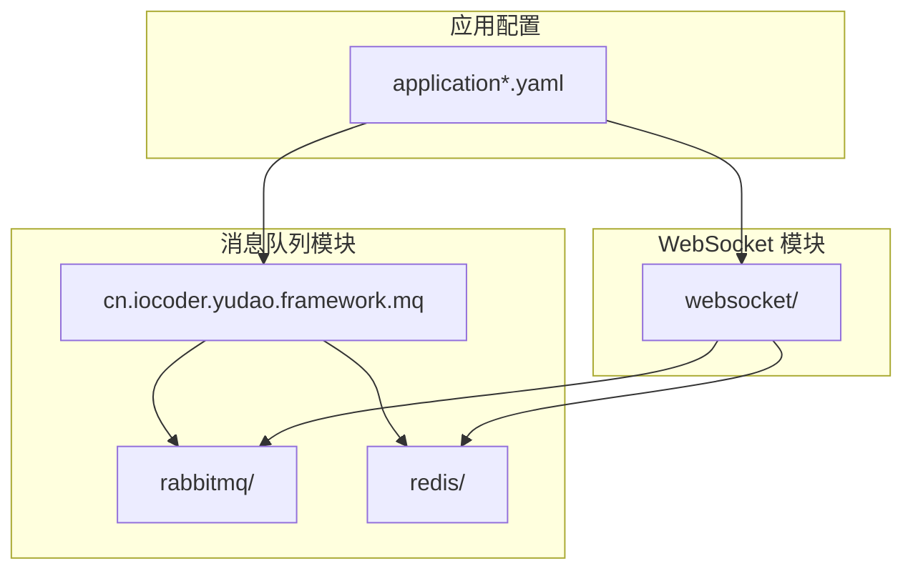
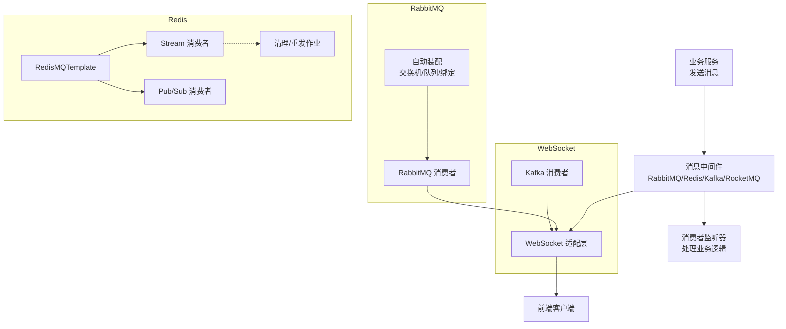
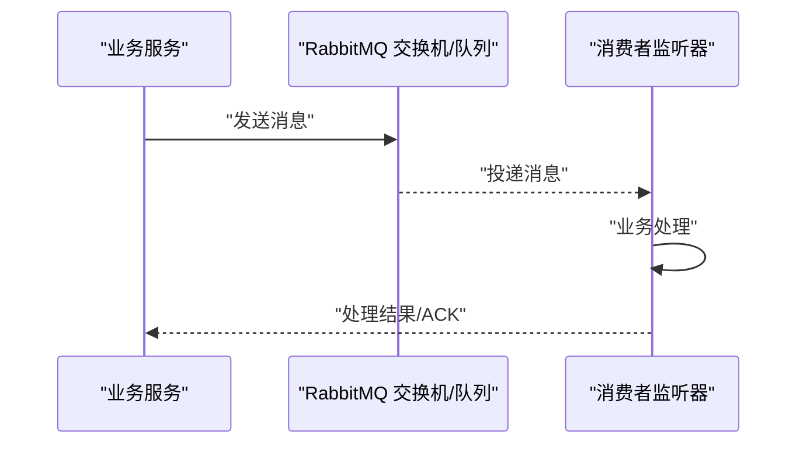
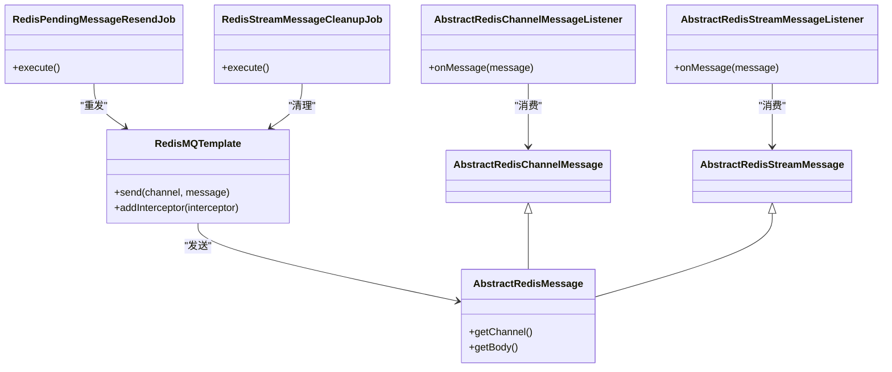
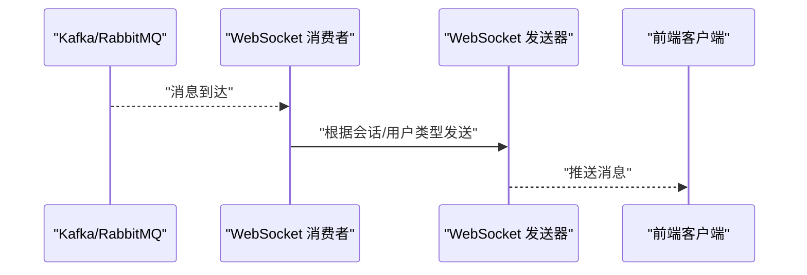
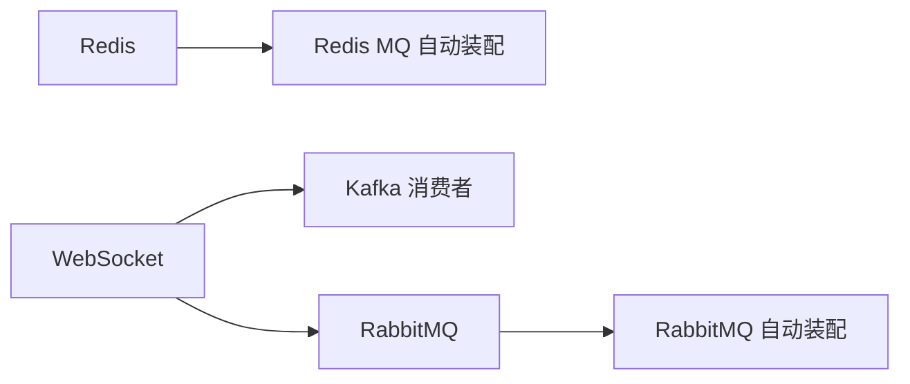

# 消息队列集成

<cite>
**本文引用的文件**
- [YudaoRabbitMQAutoConfiguration.java](file://yudao-framework/yudao-spring-boot-starter-mq/src/main/java/cn/iocoder/yudao/framework/mq/rabbitmq/config/YudaoRabbitMQAutoConfiguration.java)
- [YudaoRedisMQProducerAutoConfiguration.java](file://yudao-framework/yudao-spring-boot-starter-mq/src/main/java/cn/iocoder/yudao/framework/mq/redis/config/YudaoRedisMQProducerAutoConfiguration.java)
- [YudaoRedisMQConsumerAutoConfiguration.java](file://yudao-framework/yudao-spring-boot-starter-mq/src/main/java/cn/iocoder/yudao/framework/mq/redis/config/YudaoRedisMQConsumerAutoConfiguration.java)
- [RedisMQTemplate.java](file://yudao-framework/yudao-spring-boot-starter-mq/src/main/java/cn/iocoder/yudao/framework/mq/redis/core/RedisMQTemplate.java)
- [AbstractRedisMessage.java](file://yudao-framework/yudao-spring-boot-starter-mq/src/main/java/cn/iocoder/yudao/framework/mq/redis/core/message/AbstractRedisMessage.java)
- [AbstractRedisChannelMessage.java](file://yudao-framework/yudao-spring-boot-starter-mq/src/main/java/cn/iocoder/yudao/framework/mq/redis/core/pubsub/AbstractRedisChannelMessage.java)
- [AbstractRedisChannelMessageListener.java](file://yudao-framework/yudao-spring-boot-starter-mq/src/main/java/cn/iocoder/yudao/framework/mq/redis/core/pubsub/AbstractRedisChannelMessageListener.java)
- [AbstractRedisStreamMessage.java](file://yudao-framework/yudao-spring-boot-starter-mq/src/main/java/cn/iocoder/yudao/framework/mq/redis/core/stream/AbstractRedisStreamMessage.java)
- [AbstractRedisStreamMessageListener.java](file://yudao-framework/yudao-spring-boot-starter-mq/src/main/java/cn/iocoder/yudao/framework/mq/redis/core/stream/AbstractRedisStreamMessageListener.java)
- [RedisPendingMessageResendJob.java](file://yudao-framework/yudao-spring-boot-starter-mq/src/main/java/cn/iocoder/yudao/framework/mq/redis/core/job/RedisPendingMessageResendJob.java)
- [RedisStreamMessageCleanupJob.java](file://yudao-framework/yudao-spring-boot-starter-mq/src/main/java/cn/iocoder/yudao/framework/mq/redis/core/job/RedisStreamMessageCleanupJob.java)
- [RedisMessageInterceptor.java](file://yudao-framework/yudao-spring-boot-starter-mq/src/main/java/cn/iocoder/yudao/framework/mq/redis/core/interceptor/RedisMessageInterceptor.java)
- [YudaoWebSocketAutoConfiguration.java](file://yudao-framework/yudao-spring-boot-starter-websocket/src/main/java/cn/iocoder/yudao/framework/websocket/config/YudaoWebSocketAutoConfiguration.java)
- [KafkaWebSocketMessageConsumer.java](file://yudao-framework/yudao-spring-boot-starter-websocket/src/main/java/cn/iocoder/yudao/framework/websocket/core/sender/kafka/KafkaWebSocketMessageConsumer.java)
- [package-info.java](file://yudao-framework/yudao-spring-boot-starter-mq/src/main/java/cn/iocoder/yudao/framework/mq/package-info.java)
- [application.yaml](file://yudao-server/src/main/resources/application.yaml)
- [application-dev.yaml](file://yudao-server/src/main/resources/application-dev.yaml)
- [application-local.yaml](file://yudao-server/src/main/resources/application-local.yaml)
</cite>

## 目录
1. [简介](#简介)
2. [项目结构](#项目结构)
3. [核心组件](#核心组件)
4. [架构总览](#架构总览)
5. [详细组件分析](#详细组件分析)
6. [依赖关系分析](#依赖关系分析)
7. [性能与可靠性](#性能与可靠性)
8. [故障排查指南](#故障排查指南)
9. [结论](#结论)
10. [附录：配置与示例模板](#附录配置与示例模板)

## 简介
本文件面向“芋道 Ruoyi-Vue-Pro”项目，系统性梳理并扩展消息队列集成方案，覆盖 RabbitMQ、Redis Streams/PubSub、以及通过 WebSocket 层对 Kafka/RocketMQ 的间接集成能力。文档从架构、组件、数据流、处理逻辑、配置项到监控与故障排查进行完整说明，并提供可直接落地的配置模板与示例路径，帮助开发者快速完成消息队列功能的集成与上线。

## 项目结构
消息队列相关能力主要集中在 yudao-spring-boot-starter-mq 模块中，采用按协议分层的包组织方式：
- rabbitmq：RabbitMQ 自动装配与配置
- redis：Redis 消息队列实现（Streams/PubSub），含模板、监听器、作业与拦截器
- 文档：配套的入门文档（Kafka/RabbitMQ/RocketMQ）

同时，yudao-spring-boot-starter-websocket 提供了基于 Kafka/RabbitMQ 的 WebSocket 消息转发能力，形成“MQ -> WebSocket -> 前端”的链路。

图示来源
- [package-info.java:1-4](file://yudao-framework/yudao-spring-boot-starter-mq/src/main/java/cn/iocoder/yudao/framework/mq/package-info.java#L1-L4)
- [YudaoWebSocketAutoConfiguration.java:127-162](file://yudao-framework/yudao-spring-boot-starter-websocket/src/main/java/cn/iocoder/yudao/framework/websocket/config/YudaoWebSocketAutoConfiguration.java#L127-L162)

章节来源
- [package-info.java:1-4](file://yudao-framework/yudao-spring-boot-starter-mq/src/main/java/cn/iocoder/yudao/framework/mq/package-info.java#L1-L4)

## 核心组件
- RabbitMQ 自动装配：负责声明交换机、队列、绑定及消费者注册，简化生产/消费接入。
- Redis MQ 模板与监听器：提供统一的发送接口与多种消费模式（Pub/Sub、Stream），内置重试与清理作业。
- WebSocket MQ 适配：通过 Kafka 或 RabbitMQ 消费端将消息广播至 WebSocket 会话，实现前端实时推送。

章节来源
- [YudaoRabbitMQAutoConfiguration.java](file://yudao-framework/yudao-spring-boot-starter-mq/src/main/java/cn/iocoder/yudao/framework/mq/rabbitmq/config/YudaoRabbitMQAutoConfiguration.java)
- [YudaoRedisMQProducerAutoConfiguration.java:1-31](file://yudao-framework/yudao-spring-boot-starter-mq/src/main/java/cn/iocoder/yudao/framework/mq/redis/config/YudaoRedisMQProducerAutoConfiguration.java#L1-L31)
- [YudaoRedisMQConsumerAutoConfiguration.java](file://yudao-framework/yudao-spring-boot-starter-mq/src/main/java/cn/iocoder/yudao/framework/mq/redis/config/YudaoRedisMQConsumerAutoConfiguration.java)
- [RedisMQTemplate.java](file://yudao-framework/yudao-spring-boot-starter-mq/src/main/java/cn/iocoder/yudao/framework/mq/redis/core/RedisMQTemplate.java)
- [AbstractRedisChannelMessage.java](file://yudao-framework/yudao-spring-boot-starter-mq/src/main/java/cn/iocoder/yudao/framework/mq/redis/core/pubsub/AbstractRedisChannelMessage.java)
- [AbstractRedisChannelMessageListener.java](file://yudao-framework/yudao-spring-boot-starter-mq/src/main/java/cn/iocoder/yudao/framework/mq/redis/core/pubsub/AbstractRedisChannelMessageListener.java)
- [AbstractRedisStreamMessage.java](file://yudao-framework/yudao-spring-boot-starter-mq/src/main/java/cn/iocoder/yudao/framework/mq/redis/core/stream/AbstractRedisStreamMessage.java)
- [AbstractRedisStreamMessageListener.java](file://yudao-framework/yudao-spring-boot-starter-mq/src/main/java/cn/iocoder/yudao/framework/mq/redis/core/stream/AbstractRedisStreamMessageListener.java)
- [RedisPendingMessageResendJob.java](file://yudao-framework/yudao-spring-boot-starter-mq/src/main/java/cn/iocoder/yudao/framework/mq/redis/core/job/RedisPendingMessageResendJob.java)
- [RedisStreamMessageCleanupJob.java](file://yudao-framework/yudao-spring-boot-starter-mq/src/main/java/cn/iocoder/yudao/framework/mq/redis/core/job/RedisStreamMessageCleanupJob.java)
- [RedisMessageInterceptor.java](file://yudao-framework/yudao-spring-boot-starter-mq/src/main/java/cn/iocoder/yudao/framework/mq/redis/core/interceptor/RedisMessageInterceptor.java)
- [YudaoWebSocketAutoConfiguration.java:127-162](file://yudao-framework/yudao-spring-boot-starter-websocket/src/main/java/cn/iocoder/yudao/framework/websocket/config/YudaoWebSocketAutoConfiguration.java#L127-L162)
- [KafkaWebSocketMessageConsumer.java:1-28](file://yudao-framework/yudao-spring-boot-starter-websocket/src/main/java/cn/iocoder/yudao/framework/websocket/core/sender/kafka/KafkaWebSocketMessageConsumer.java#L1-L28)

## 架构总览
下图展示了消息从生产到消费的关键路径，以及与 WebSocket 的联动：

图示来源
- [YudaoRabbitMQAutoConfiguration.java](file://yudao-framework/yudao-spring-boot-starter-mq/src/main/java/cn/iocoder/yudao/framework/mq/rabbitmq/config/YudaoRabbitMQAutoConfiguration.java)
- [YudaoRedisMQProducerAutoConfiguration.java:1-31](file://yudao-framework/yudao-spring-boot-starter-mq/src/main/java/cn/iocoder/yudao/framework/mq/redis/config/YudaoRedisMQProducerAutoConfiguration.java#L1-L31)
- [YudaoRedisMQConsumerAutoConfiguration.java](file://yudao-framework/yudao-spring-boot-starter-mq/src/main/java/cn/iocoder/yudao/framework/mq/redis/config/YudaoRedisMQConsumerAutoConfiguration.java)
- [YudaoWebSocketAutoConfiguration.java:127-162](file://yudao-framework/yudao-spring-boot-starter-websocket/src/main/java/cn/iocoder/yudao/framework/websocket/config/YudaoWebSocketAutoConfiguration.java#L127-L162)
- [KafkaWebSocketMessageConsumer.java:1-28](file://yudao-framework/yudao-spring-boot-starter-websocket/src/main/java/cn/iocoder/yudao/framework/websocket/core/sender/kafka/KafkaWebSocketMessageConsumer.java#L1-L28)

## 详细组件分析

### RabbitMQ 集成
- 自动装配：在启用 RabbitMQ 时，自动注册交换机、队列、绑定规则，确保消费者能正确订阅。
- 生产者：通过 Spring AMQP 的 RabbitTemplate 发送消息到指定交换机/路由键。
- 消费者：基于注解声明监听器，自动反序列化并调用业务处理器。
- 死信队列：可通过路由参数或队列参数配置死信交换机/死信路由键，实现失败消息隔离与重试策略。

图示来源
- [YudaoRabbitMQAutoConfiguration.java](file://yudao-framework/yudao-spring-boot-starter-mq/src/main/java/cn/iocoder/yudao/framework/mq/rabbitmq/config/YudaoRabbitMQAutoConfiguration.java)

章节来源
- [YudaoRabbitMQAutoConfiguration.java](file://yudao-framework/yudao-spring-boot-starter-mq/src/main/java/cn/iocoder/yudao/framework/mq/rabbitmq/config/YudaoRabbitMQAutoConfiguration.java)

### Redis 消息队列（Streams/Pub/Sub）
- 生产者模板：RedisMQTemplate 封装发送流程，支持拦截器扩展（如埋点、脱敏、路由）。
- Pub/Sub 模式：适合轻量广播场景；消息不落盘，丢失风险较高。
- Stream 模式：具备持久化、多消费者组、ACK/重试等能力，适合高可靠场景。
- 监听器：抽象类封装通用逻辑，子类聚焦业务处理。
- 作业：RedisPendingMessageResendJob 负责重发待确认消息；RedisStreamMessageCleanupJob 清理过期消息，避免堆积。

图示来源
- [RedisMQTemplate.java](file://yudao-framework/yudao-spring-boot-starter-mq/src/main/java/cn/iocoder/yudao/framework/mq/redis/core/RedisMQTemplate.java)
- [AbstractRedisMessage.java](file://yudao-framework/yudao-spring-boot-starter-mq/src/main/java/cn/iocoder/yudao/framework/mq/redis/core/message/AbstractRedisMessage.java)
- [AbstractRedisChannelMessage.java](file://yudao-framework/yudao-spring-boot-starter-mq/src/main/java/cn/iocoder/yudao/framework/mq/redis/core/pubsub/AbstractRedisChannelMessage.java)
- [AbstractRedisChannelMessageListener.java](file://yudao-framework/yudao-spring-boot-starter-mq/src/main/java/cn/iocoder/yudao/framework/mq/redis/core/pubsub/AbstractRedisChannelMessageListener.java)
- [AbstractRedisStreamMessage.java](file://yudao-framework/yudao-spring-boot-starter-mq/src/main/java/cn/iocoder/yudao/framework/mq/redis/core/stream/AbstractRedisStreamMessage.java)
- [AbstractRedisStreamMessageListener.java](file://yudao-framework/yudao-spring-boot-starter-mq/src/main/java/cn/iocoder/yudao/framework/mq/redis/core/stream/AbstractRedisStreamMessageListener.java)
- [RedisPendingMessageResendJob.java](file://yudao-framework/yudao-spring-boot-starter-mq/src/main/java/cn/iocoder/yudao/framework/mq/redis/core/job/RedisPendingMessageResendJob.java)
- [RedisStreamMessageCleanupJob.java](file://yudao-framework/yudao-spring-boot-starter-mq/src/main/java/cn/iocoder/yudao/framework/mq/redis/core/job/RedisStreamMessageCleanupJob.java)

章节来源
- [YudaoRedisMQProducerAutoConfiguration.java:1-31](file://yudao-framework/yudao-spring-boot-starter-mq/src/main/java/cn/iocoder/yudao/framework/mq/redis/config/YudaoRedisMQProducerAutoConfiguration.java#L1-L31)
- [YudaoRedisMQConsumerAutoConfiguration.java](file://yudao-framework/yudao-spring-boot-starter-mq/src/main/java/cn/iocoder/yudao/framework/mq/redis/config/YudaoRedisMQConsumerAutoConfiguration.java)
- [RedisMQTemplate.java](file://yudao-framework/yudao-spring-boot-starter-mq/src/main/java/cn/iocoder/yudao/framework/mq/redis/core/RedisMQTemplate.java)
- [AbstractRedisMessage.java](file://yudao-framework/yudao-spring-boot-starter-mq/src/main/java/cn/iocoder/yudao/framework/mq/redis/core/message/AbstractRedisMessage.java)
- [AbstractRedisChannelMessage.java](file://yudao-framework/yudao-spring-boot-starter-mq/src/main/java/cn/iocoder/yudao/framework/mq/redis/core/pubsub/AbstractRedisChannelMessage.java)
- [AbstractRedisChannelMessageListener.java](file://yudao-framework/yudao-spring-boot-starter-mq/src/main/java/cn/iocoder/yudao/framework/mq/redis/core/pubsub/AbstractRedisChannelMessageListener.java)
- [AbstractRedisStreamMessage.java](file://yudao-framework/yudao-spring-boot-starter-mq/src/main/java/cn/iocoder/yudao/framework/mq/redis/core/stream/AbstractRedisStreamMessage.java)
- [AbstractRedisStreamMessageListener.java](file://yudao-framework/yudao-spring-boot-starter-mq/src/main/java/cn/iocoder/yudao/framework/mq/redis/core/stream/AbstractRedisStreamMessageListener.java)
- [RedisPendingMessageResendJob.java](file://yudao-framework/yudao-spring-boot-starter-mq/src/main/java/cn/iocoder/yudao/framework/mq/redis/core/job/RedisPendingMessageResendJob.java)
- [RedisStreamMessageCleanupJob.java](file://yudao-framework/yudao-spring-boot-starter-mq/src/main/java/cn/iocoder/yudao/framework/mq/redis/core/job/RedisStreamMessageCleanupJob.java)

### WebSocket 与 MQ 的联动
- Kafka/RabbitMQ 消费端：从对应 MQ 拉取消息，解析后调用 WebSocket 发送器。
- 广播策略：Kafka 消费者通过动态 groupId 实现广播消费，确保每台实例都能收到消息。
- 交换机/主题：RabbitMQ 使用 Topic Exchange 进行路由；Kafka 使用主题名配置。

图示来源
- [YudaoWebSocketAutoConfiguration.java:127-162](file://yudao-framework/yudao-spring-boot-starter-websocket/src/main/java/cn/iocoder/yudao/framework/websocket/config/YudaoWebSocketAutoConfiguration.java#L127-L162)
- [KafkaWebSocketMessageConsumer.java:1-28](file://yudao-framework/yudao-spring-boot-starter-websocket/src/main/java/cn/iocoder/yudao/framework/websocket/core/sender/kafka/KafkaWebSocketMessageConsumer.java#L1-L28)

章节来源
- [YudaoWebSocketAutoConfiguration.java:127-162](file://yudao-framework/yudao-spring-boot-starter-websocket/src/main/java/cn/iocoder/yudao/framework/websocket/config/YudaoWebSocketAutoConfiguration.java#L127-L162)
- [KafkaWebSocketMessageConsumer.java:1-28](file://yudao-framework/yudao-spring-boot-starter-websocket/src/main/java/cn/iocoder/yudao/framework/websocket/core/sender/kafka/KafkaWebSocketMessageConsumer.java#L1-L28)

## 依赖关系分析
- 组件内聚：各协议实现相对独立，通过统一的 RedisMQTemplate 与抽象消息模型降低耦合。
- 外部依赖：RabbitMQ 依赖 Spring AMQP；Redis 依赖 Spring Data Redis；WebSocket 依赖对应的 MQ 客户端。
- 条件装配：WebSocket 模块按 sender-type 条件加载不同 MQ 的发送器与消费者。

图示来源
- [YudaoRabbitMQAutoConfiguration.java](file://yudao-framework/yudao-spring-boot-starter-mq/src/main/java/cn/iocoder/yudao/framework/mq/rabbitmq/config/YudaoRabbitMQAutoConfiguration.java)
- [YudaoWebSocketAutoConfiguration.java:127-162](file://yudao-framework/yudao-spring-boot-starter-websocket/src/main/java/cn/iocoder/yudao/framework/websocket/config/YudaoWebSocketAutoConfiguration.java#L127-L162)

章节来源
- [YudaoRabbitMQAutoConfiguration.java](file://yudao-framework/yudao-spring-boot-starter-mq/src/main/java/cn/iocoder/yudao/framework/mq/rabbitmq/config/YudaoRabbitMQAutoConfiguration.java)
- [YudaoWebSocketAutoConfiguration.java:127-162](file://yudao-framework/yudao-spring-boot-starter-websocket/src/main/java/cn/iocoder/yudao/framework/websocket/config/YudaoWebSocketAutoConfiguration.java#L127-L162)

## 性能与可靠性
- Redis Stream：适合高吞吐、强一致需求；建议合理设置消费者组与 ACK 策略，避免重复消费与堆积。
- Pub/Sub：低延迟广播首选，但无持久化，需结合业务容忍度评估。
- RabbitMQ：通过死信队列与重试策略提升可靠性；注意队列/交换机持久化与镜像队列配置。
- 重试与清理：利用内置作业定期重发待确认消息与清理过期消息，降低人工干预成本。

章节来源
- [RedisPendingMessageResendJob.java](file://yudao-framework/yudao-spring-boot-starter-mq/src/main/java/cn/iocoder/yudao/framework/mq/redis/core/job/RedisPendingMessageResendJob.java)
- [RedisStreamMessageCleanupJob.java](file://yudao-framework/yudao-spring-boot-starter-mq/src/main/java/cn/iocoder/yudao/framework/mq/redis/core/job/RedisStreamMessageCleanupJob.java)

## 故障排查指南
- 消费堆积：优先检查消费者处理耗时、并发度与是否出现异常中断；Redis 场景可观察 Stream 长度与 Pending 列表。
- 重复消费：确认消息幂等处理与去重策略；RabbitMQ 检查手动 ACK 与重入队行为。
- 死信流转：核对死信交换机/路由键配置，验证失败消息是否进入死信队列。
- WebSocket 推送失败：检查 MQ 消费端是否正常拉取消息，以及发送器的会话管理状态。
- 日志与指标：结合应用日志与 Actuator/监控平台定位延迟与错误率异常。

章节来源
- [YudaoWebSocketAutoConfiguration.java:127-162](file://yudao-framework/yudao-spring-boot-starter-websocket/src/main/java/cn/iocoder/yudao/framework/websocket/config/YudaoWebSocketAutoConfiguration.java#L127-L162)
- [KafkaWebSocketMessageConsumer.java:1-28](file://yudao-framework/yudao-spring-boot-starter-websocket/src/main/java/cn/iocoder/yudao/framework/websocket/core/sender/kafka/KafkaWebSocketMessageConsumer.java#L1-L28)

## 结论
本项目提供了开箱即用的消息队列能力，覆盖 RabbitMQ、Redis（Stream/Pub/Sub）与通过 WebSocket 的 MQ 适配层。开发者可根据业务特性选择合适协议与模式，并借助拦截器、作业与自动装配快速落地。建议在生产环境完善监控与告警策略，持续优化消费性能与可靠性。

## 附录：配置与示例模板

### 应用配置要点（示例路径）
- 全局配置文件：application.yaml
- 开发环境配置：application-dev.yaml
- 本地开发配置：application-local.yaml

章节来源
- [application.yaml](file://yudao-server/src/main/resources/application.yaml)
- [application-dev.yaml](file://yudao-server/src/main/resources/application-dev.yaml)
- [application-local.yaml](file://yudao-server/src/main/resources/application-local.yaml)

### RabbitMQ 配置要点（示例路径）
- 自动装配类：YudaoRabbitMQAutoConfiguration.java
- 常见配置项
  - 交换机/队列/绑定声明
  - 路由键与主题
  - 手动 ACK 与重试策略
  - 死信交换机/路由键

章节来源
- [YudaoRabbitMQAutoConfiguration.java](file://yudao-framework/yudao-spring-boot-starter-mq/src/main/java/cn/iocoder/yudao/framework/mq/rabbitmq/config/YudaoRabbitMQAutoConfiguration.java)

### Redis 消息队列配置要点（示例路径）
- 生产者模板：YudaoRedisMQProducerAutoConfiguration.java
- 消费者模板：YudaoRedisMQConsumerAutoConfiguration.java
- 常见配置项
  - Channel/Stream 名称
  - 消费者组名称
  - 拦截器注册
  - 重发/清理作业调度

章节来源
- [YudaoRedisMQProducerAutoConfiguration.java:1-31](file://yudao-framework/yudao-spring-boot-starter-mq/src/main/java/cn/iocoder/yudao/framework/mq/redis/config/YudaoRedisMQProducerAutoConfiguration.java#L1-L31)
- [YudaoRedisMQConsumerAutoConfiguration.java](file://yudao-framework/yudao-spring-boot-starter-mq/src/main/java/cn/iocoder/yudao/framework/mq/redis/config/YudaoRedisMQConsumerAutoConfiguration.java)

### WebSocket 与 MQ 集成配置要点（示例路径）
- 自动装配：YudaoWebSocketAutoConfiguration.java
- Kafka 消费者：KafkaWebSocketMessageConsumer.java
- 常见配置项
  - sender-type（rabbitmq/kafka）
  - 交换机/主题名称
  - 消费者组（Kafka）
  - 广播策略（动态 groupId）

章节来源
- [YudaoWebSocketAutoConfiguration.java:127-162](file://yudao-framework/yudao-spring-boot-starter-websocket/src/main/java/cn/iocoder/yudao/framework/websocket/config/YudaoWebSocketAutoConfiguration.java#L127-L162)
- [KafkaWebSocketMessageConsumer.java:1-28](file://yudao-framework/yudao-spring-boot-starter-websocket/src/main/java/cn/iocoder/yudao/framework/websocket/core/sender/kafka/KafkaWebSocketMessageConsumer.java#L1-L28)