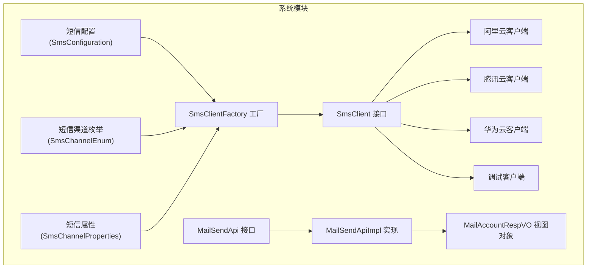
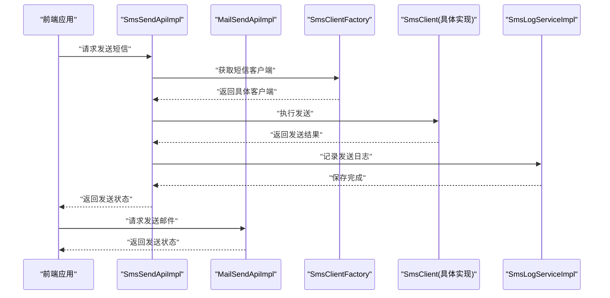
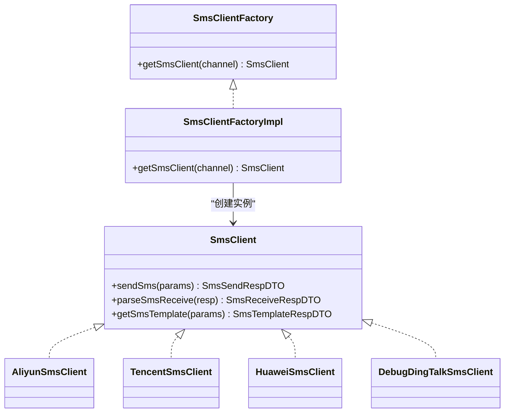
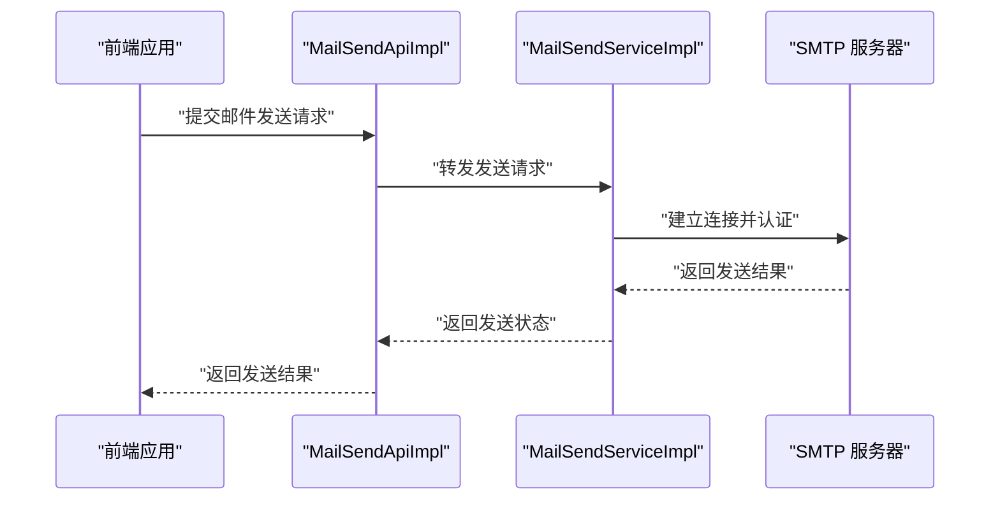
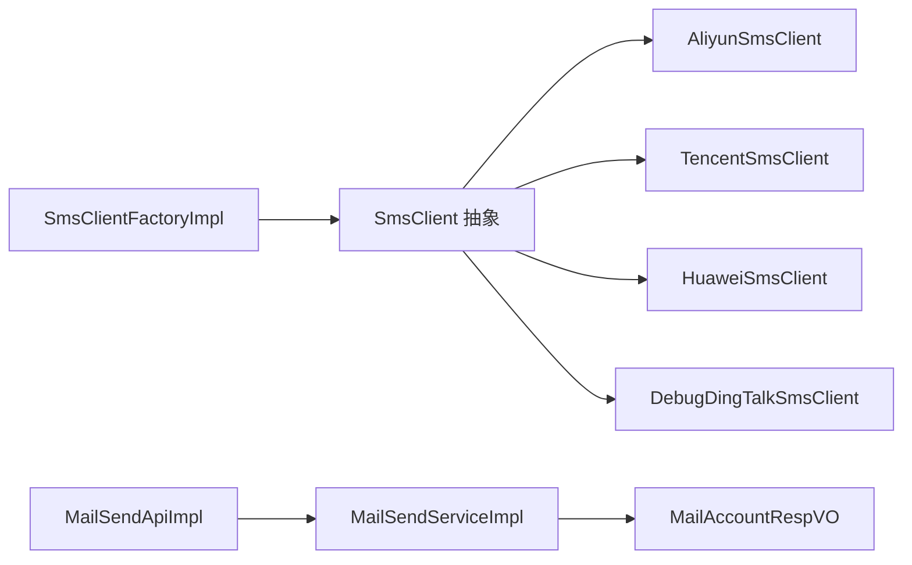

# 短信邮件集成

<cite>
**本文引用的文件**
- [SmsChannelService.java](file://yudao-module-system/src/main/java/cn/iocoder/yudao/module/system/service/sms/SmsChannelService.java)
- [SmsChannelServiceImpl.java](file://yudao-module-system/src/main/java/cn/iocoder/yudao/module/system/service/sms/SmsChannelServiceImpl.java)
- [SmsLogService.java](file://yudao-module-system/src/main/java/cn/iocoder/yudao/module/system/service/sms/SmsLogService.java)
- [SmsLogServiceImpl.java](file://yudao-module-system/src/main/java/cn/iocoder/yudao/module/system/service/sms/SmsLogServiceImpl.java)
- [SmsClient.java](file://yudao-module-system/src/main/java/cn/iocoder/yudao/module/system/framework/sms/core/client/SmsClient.java)
- [SmsClientFactory.java](file://yudao-module-system/src/main/java/cn/iocoder/yudao/module/system/framework/sms/core/client/SmsClientFactory.java)
- [SmsClientFactoryImpl.java](file://yudao-module-system/src/main/java/cn/iocoder/yudao/module/system/framework/sms/core/client/impl/SmsClientFactoryImpl.java)
- [AliyunSmsClient.java](file://yudao-module-system/src/main/java/cn/iocoder/yudao/module/system/framework/sms/core/client/impl/AliyunSmsClient.java)
- [TencentSmsClient.java](file://yudao-module-system/src/main/java/cn/iocoder/yudao/module/system/framework/sms/core/client/impl/TencentSmsClient.java)
- [HuaweiSmsClient.java](file://yudao-module-system/src/main/java/cn/iocoder/yudao/module/system/framework/sms/core/client/impl/HuaweiSmsClient.java)
- [DebugDingTalkSmsClient.java](file://yudao-module-system/src/main/java/cn/iocoder/yudao/module/system/framework/sms/core/client/impl/DebugDingTalkSmsClient.java)
- [SmsChannelProperties.java](file://yudao-module-system/src/main/java/cn/iocoder/yudao/module/system/framework/sms/core/property/SmsChannelProperties.java)
- [SmsChannelEnum.java](file://yudao-module-system/src/main/java/cn/iocoder/yudao/module/system/framework/sms/core/enums/SmsChannelEnum.java)
- [SmsConfiguration.java](file://yudao-module-system/src/main/java/cn/iocoder/yudao/module/system/framework/sms/config/SmsConfiguration.java)
- [SmsSendApi.java](file://yudao-module-system/src/main/java/cn/iocoder/yudao/module/system/api/sms/SmsSendApi.java)
- [SmsSendApiImpl.java](file://yudao-module-system/src/main/java/cn/iocoder/yudao/module/system/api/sms/SmsSendApiImpl.java)
- [MailSendApi.java](file://yudao-module-system/src/main/java/cn/iocoder/yudao/module/system/api/mail/MailSendApi.java)
- [MailSendApiImpl.java](file://yudao-module-system/src/main/java/cn/iocoder/yudao/module/system/api/mail/MailSendApiImpl.java)
- [MailAccountRespVO.java](file://yudao-module-system/src/main/java/cn/iocoder/yudao/module/system/controller/admin/mail/vo/account/MailAccountRespVO.java)
- [MailSendServiceImpl.java](file://yudao-module-system/src/main/java/cn/iocoder/yudao/module/system/service/mail/MailSendServiceImpl.java)
- [MailSendServiceImplTest.java](file://yudao-module-system/src/test/java/cn/iocoder/yudao/module/system/service/mail/MailSendServiceImplTest.java)
- [NotifySendServiceImplTest.java](file://yudao-module-system/src/test/java/cn/iocoder/yudao/module/system/service/notify/NotifySendServiceImplTest.java)
</cite>

## 目录
1. [简介](#简介)
2. [项目结构](#项目结构)
3. [核心组件](#核心组件)
4. [架构总览](#架构总览)
5. [详细组件分析](#详细组件分析)
6. [依赖关系分析](#依赖关系分析)
7. [性能考量](#性能考量)
8. [故障排查指南](#故障排查指南)
9. [结论](#结论)
10. [附录](#附录)

## 简介
本文件面向“芋道 Ruoyi-Vue-Pro”项目的短信与邮件能力集成，系统性说明短信服务（支持阿里云、腾讯云、华为云等）与邮件服务（基于 SMTP）的接入方式、配置要点、模板与签名管理、发送记录查询、以及前端调用与后端实现的衔接。文档以代码为依据，配合图示与分层讲解，帮助开发者快速完成短信邮件功能的集成与扩展。

## 项目结构
短信与邮件能力集中在 system 模块中，采用“接口 + 工厂 + 多实现 + 配置”的分层设计：
- 短信：通过 SmsClient 抽象与 SmsClientFactory 工厂，按渠道动态装配具体客户端（如阿里云、腾讯云、华为云），并提供渠道与日志服务。
- 邮件：通过 MailSendApi/MailSendApiImpl 提供对外发送接口，底层使用 SMTP 进行发送，并提供账号与模板相关 VO。

图表来源
- [SmsClient.java:1-200](file://yudao-module-system/src/main/java/cn/iocoder/yudao/module/system/framework/sms/core/client/SmsClient.java#L1-L200)
- [SmsClientFactory.java:1-200](file://yudao-module-system/src/main/java/cn/iocoder/yudao/module/system/framework/sms/core/client/SmsClientFactory.java#L1-L200)
- [SmsClientFactoryImpl.java:1-200](file://yudao-module-system/src/main/java/cn/iocoder/yudao/module/system/framework/sms/core/client/impl/SmsClientFactoryImpl.java#L1-L200)
- [AliyunSmsClient.java:1-200](file://yudao-module-system/src/main/java/cn/iocoder/yudao/module/system/framework/sms/core/client/impl/AliyunSmsClient.java#L1-L200)
- [TencentSmsClient.java:1-200](file://yudao-module-system/src/main/java/cn/iocoder/yudao/module/system/framework/sms/core/client/impl/TencentSmsClient.java#L1-L200)
- [HuaweiSmsClient.java:1-200](file://yudao-module-system/src/main/java/cn/iocoder/yudao/module/system/framework/sms/core/client/impl/HuaweiSmsClient.java#L1-L200)
- [DebugDingTalkSmsClient.java:1-200](file://yudao-module-system/src/main/java/cn/iocoder/yudao/module/system/framework/sms/core/client/impl/DebugDingTalkSmsClient.java#L1-L200)
- [SmsConfiguration.java:1-200](file://yudao-module-system/src/main/java/cn/iocoder/yudao/module/system/framework/sms/config/SmsConfiguration.java#L1-L200)
- [SmsChannelProperties.java:1-200](file://yudao-module-system/src/main/java/cn/iocoder/yudao/module/system/framework/sms/core/property/SmsChannelProperties.java#L1-L200)
- [SmsChannelEnum.java:1-200](file://yudao-module-system/src/main/java/cn/iocoder/yudao/module/system/framework/sms/core/enums/SmsChannelEnum.java#L1-L200)
- [MailSendApi.java:1-200](file://yudao-module-system/src/main/java/cn/iocoder/yudao/module/system/api/mail/MailSendApi.java#L1-L200)
- [MailSendApiImpl.java:1-200](file://yudao-module-system/src/main/java/cn/iocoder/yudao/module/system/api/mail/MailSendApiImpl.java#L1-L200)
- [MailAccountRespVO.java:1-39](file://yudao-module-system/src/main/java/cn/iocoder/yudao/module/system/controller/admin/mail/vo/account/MailAccountRespVO.java#L1-L39)

章节来源
- [SmsChannelService.java:1-62](file://yudao-module-system/src/main/java/cn/iocoder/yudao/module/system/service/sms/SmsChannelService.java#L1-L62)
- [SmsChannelServiceImpl.java:1-200](file://yudao-module-system/src/main/java/cn/iocoder/yudao/module/system/service/sms/SmsChannelServiceImpl.java#L1-L200)
- [SmsLogService.java:1-29](file://yudao-module-system/src/main/java/cn/iocoder/yudao/module/system/service/sms/SmsLogService.java#L1-L29)
- [SmsLogServiceImpl.java:1-200](file://yudao-module-system/src/main/java/cn/iocoder/yudao/module/system/service/sms/SmsLogServiceImpl.java#L1-L200)
- [MailSendApiImpl.java:1-200](file://yudao-module-system/src/main/java/cn/iocoder/yudao/module/system/api/mail/MailSendApiImpl.java#L1-L200)

## 核心组件
- 短信客户端抽象与工厂
  - SmsClient：定义短信发送、模板查询等统一接口。
  - SmsClientFactory：根据渠道类型与配置动态创建具体客户端实例。
  - SmsClientFactoryImpl：工厂实现，负责从配置加载渠道属性并实例化对应客户端。
- 短信渠道与日志
  - SmsChannelService/SmsChannelServiceImpl：管理短信渠道（创建、更新、删除、查询）。
  - SmsLogService/SmsLogServiceImpl：短信发送日志记录与分页查询。
- 短信配置与属性
  - SmsConfiguration：短信模块自动装配入口。
  - SmsChannelProperties：渠道通用属性模型。
  - SmsChannelEnum：渠道类型枚举。
- 邮件发送
  - MailSendApi/MailSendApiImpl：对外提供邮件发送能力。
  - MailAccountRespVO：邮件账号响应视图对象，包含 SMTP 主机、端口、SSL、STARTTLS 等关键字段。

章节来源
- [SmsClient.java:1-200](file://yudao-module-system/src/main/java/cn/iocoder/yudao/module/system/framework/sms/core/client/SmsClient.java#L1-L200)
- [SmsClientFactory.java:1-200](file://yudao-module-system/src/main/java/cn/iocoder/yudao/module/system/framework/sms/core/client/SmsClientFactory.java#L1-L200)
- [SmsClientFactoryImpl.java:1-200](file://yudao-module-system/src/main/java/cn/iocoder/yudao/module/system/framework/sms/core/client/impl/SmsClientFactoryImpl.java#L1-L200)
- [SmsChannelService.java:1-62](file://yudao-module-system/src/main/java/cn/iocoder/yudao/module/system/service/sms/SmsChannelService.java#L1-L62)
- [SmsChannelServiceImpl.java:1-200](file://yudao-module-system/src/main/java/cn/iocoder/yudao/module/system/service/sms/SmsChannelServiceImpl.java#L1-L200)
- [SmsLogService.java:1-29](file://yudao-module-system/src/main/java/cn/iocoder/yudao/module/system/service/sms/SmsLogService.java#L1-L29)
- [SmsLogServiceImpl.java:1-200](file://yudao-module-system/src/main/java/cn/iocoder/yudao/module/system/service/sms/SmsLogServiceImpl.java#L1-L200)
- [SmsConfiguration.java:1-200](file://yudao-module-system/src/main/java/cn/iocoder/yudao/module/system/framework/sms/config/SmsConfiguration.java#L1-L200)
- [SmsChannelProperties.java:1-200](file://yudao-module-system/src/main/java/cn/iocoder/yudao/module/system/framework/sms/core/property/SmsChannelProperties.java#L1-L200)
- [SmsChannelEnum.java:1-200](file://yudao-module-system/src/main/java/cn/iocoder/yudao/module/system/framework/sms/core/enums/SmsChannelEnum.java#L1-L200)
- [MailSendApi.java:1-200](file://yudao-module-system/src/main/java/cn/iocoder/yudao/module/system/api/mail/MailSendApi.java#L1-L200)
- [MailSendApiImpl.java:1-200](file://yudao-module-system/src/main/java/cn/iocoder/yudao/module/system/api/mail/MailSendApiImpl.java#L1-L200)
- [MailAccountRespVO.java:1-39](file://yudao-module-system/src/main/java/cn/iocoder/yudao/module/system/controller/admin/mail/vo/account/MailAccountRespVO.java#L1-L39)

## 架构总览
短信与邮件在系统中的交互流程如下：

图表来源
- [SmsSendApiImpl.java:1-200](file://yudao-module-system/src/main/java/cn/iocoder/yudao/module/system/api/sms/SmsSendApiImpl.java#L1-L200)
- [MailSendApiImpl.java:1-200](file://yudao-module-system/src/main/java/cn/iocoder/yudao/module/system/api/mail/MailSendApiImpl.java#L1-L200)
- [SmsClientFactoryImpl.java:1-200](file://yudao-module-system/src/main/java/cn/iocoder/yudao/module/system/framework/sms/core/client/impl/SmsClientFactoryImpl.java#L1-L200)
- [SmsClient.java:1-200](file://yudao-module-system/src/main/java/cn/iocoder/yudao/module/system/framework/sms/core/client/SmsClient.java#L1-L200)
- [SmsLogServiceImpl.java:1-200](file://yudao-module-system/src/main/java/cn/iocoder/yudao/module/system/service/sms/SmsLogServiceImpl.java#L1-L200)

## 详细组件分析

### 短信服务集成
- 支持的短信提供商
  - 阿里云：AliyunSmsClient
  - 腾讯云：TencentSmsClient
  - 华为云：HuaweiSmsClient
  - 调试/钉钉：DebugDingTalkSmsClient
- 工厂与客户端
  - SmsClientFactory 根据渠道类型与配置创建具体客户端。
  - SmsClient 定义统一的发送、模板查询等接口。
- 渠道与日志
  - SmsChannelService 提供渠道的增删改查。
  - SmsLogService 提供发送日志的分页查询与状态统计。

图表来源
- [SmsClient.java:1-200](file://yudao-module-system/src/main/java/cn/iocoder/yudao/module/system/framework/sms/core/client/SmsClient.java#L1-L200)
- [SmsClientFactory.java:1-200](file://yudao-module-system/src/main/java/cn/iocoder/yudao/module/system/framework/sms/core/client/SmsClientFactory.java#L1-L200)
- [SmsClientFactoryImpl.java:1-200](file://yudao-module-system/src/main/java/cn/iocoder/yudao/module/system/framework/sms/core/client/impl/SmsClientFactoryImpl.java#L1-L200)
- [AliyunSmsClient.java:1-200](file://yudao-module-system/src/main/java/cn/iocoder/yudao/module/system/framework/sms/core/client/impl/AliyunSmsClient.java#L1-L200)
- [TencentSmsClient.java:1-200](file://yudao-module-system/src/main/java/cn/iocoder/yudao/module/system/framework/sms/core/client/impl/TencentSmsClient.java#L1-L200)
- [HuaweiSmsClient.java:1-200](file://yudao-module-system/src/main/java/cn/iocoder/yudao/module/system/framework/sms/core/client/impl/HuaweiSmsClient.java#L1-L200)
- [DebugDingTalkSmsClient.java:1-200](file://yudao-module-system/src/main/java/cn/iocoder/yudao/module/system/framework/sms/core/client/impl/DebugDingTalkSmsClient.java#L1-L200)

章节来源
- [SmsClient.java:1-200](file://yudao-module-system/src/main/java/cn/iocoder/yudao/module/system/framework/sms/core/client/SmsClient.java#L1-L200)
- [SmsClientFactoryImpl.java:1-200](file://yudao-module-system/src/main/java/cn/iocoder/yudao/module/system/framework/sms/core/client/impl/SmsClientFactoryImpl.java#L1-L200)
- [SmsChannelService.java:1-62](file://yudao-module-system/src/main/java/cn/iocoder/yudao/module/system/service/sms/SmsChannelService.java#L1-L62)
- [SmsChannelServiceImpl.java:1-200](file://yudao-module-system/src/main/java/cn/iocoder/yudao/module/system/service/sms/SmsChannelServiceImpl.java#L1-L200)
- [SmsLogService.java:1-29](file://yudao-module-system/src/main/java/cn/iocoder/yudao/module/system/service/sms/SmsLogService.java#L1-L29)
- [SmsLogServiceImpl.java:1-200](file://yudao-module-system/src/main/java/cn/iocoder/yudao/module/system/service/sms/SmsLogServiceImpl.java#L1-L200)

### 邮件服务集成
- 对外接口
  - MailSendApi/MailSendApiImpl：封装邮件发送逻辑，供前端调用。
- 账号配置
  - MailAccountRespVO：包含邮箱、主机、端口、SSL、STARTTLS 等字段，便于后台维护与展示。
- 测试验证
  - MailSendServiceImplTest 中包含示例，演示如何使用 SMTP 发送邮件（含主题、正文、抄送、密送等）。

图表来源
- [MailSendApiImpl.java:1-200](file://yudao-module-system/src/main/java/cn/iocoder/yudao/module/system/api/mail/MailSendApiImpl.java#L1-L200)
- [MailSendServiceImpl.java:1-200](file://yudao-module-system/src/main/java/cn/iocoder/yudao/module/system/service/mail/MailSendServiceImpl.java#L1-L200)
- [MailAccountRespVO.java:1-39](file://yudao-module-system/src/main/java/cn/iocoder/yudao/module/system/controller/admin/mail/vo/account/MailAccountRespVO.java#L1-L39)
- [MailSendServiceImplTest.java:1-200](file://yudao-module-system/src/test/java/cn/iocoder/yudao/module/system/service/mail/MailSendServiceImplTest.java#L1-L200)

章节来源
- [MailSendApiImpl.java:1-200](file://yudao-module-system/src/main/java/cn/iocoder/yudao/module/system/api/mail/MailSendApiImpl.java#L1-L200)
- [MailSendServiceImpl.java:1-200](file://yudao-module-system/src/main/java/cn/iocoder/yudao/module/system/service/mail/MailSendServiceImpl.java#L1-L200)
- [MailAccountRespVO.java:1-39](file://yudao-module-system/src/main/java/cn/iocoder/yudao/module/system/controller/admin/mail/vo/account/MailAccountRespVO.java#L1-L39)
- [MailSendServiceImplTest.java:1-200](file://yudao-module-system/src/test/java/cn/iocoder/yudao/module/system/service/mail/MailSendServiceImplTest.java#L1-L200)

### 短信模板与签名管理
- 模板与签名
  - SmsClient 抽象中定义了模板查询与短信发送接口，具体实现由各厂商客户端完成。
  - SmsChannelEnum 提供渠道类型枚举，便于区分不同厂商的模板与签名规则。
- 管理入口
  - SmsChannelService 提供渠道的增删改查，作为模板与签名配置的载体。

章节来源
- [SmsClient.java:1-200](file://yudao-module-system/src/main/java/cn/iocoder/yudao/module/system/framework/sms/core/client/SmsClient.java#L1-L200)
- [SmsChannelEnum.java:1-200](file://yudao-module-system/src/main/java/cn/iocoder/yudao/module/system/framework/sms/core/enums/SmsChannelEnum.java#L1-L200)
- [SmsChannelService.java:1-62](file://yudao-module-system/src/main/java/cn/iocoder/yudao/module/system/service/sms/SmsChannelService.java#L1-L62)

### 短信发送记录查询
- 日志服务
  - SmsLogService 提供分页查询与状态统计，便于审计与问题定位。
- 记录内容
  - 包括发送状态、接收状态、模板编码、手机号、发送时间等维度。

章节来源
- [SmsLogService.java:1-29](file://yudao-module-system/src/main/java/cn/iocoder/yudao/module/system/service/sms/SmsLogService.java#L1-L29)
- [SmsLogServiceImpl.java:1-200](file://yudao-module-system/src/main/java/cn/iocoder/yudao/module/system/service/sms/SmsLogServiceImpl.java#L1-L200)

### 邮件模板与变量替换
- 模板与变量
  - 通过模板占位符进行变量替换，结合 Notify 模块的模板格式化能力，可实现邮件内容的动态生成。
- 抄送与密送
  - MailSendServiceImplTest 展示了抄送与密送的使用方式，便于批量发送场景。

章节来源
- [NotifySendServiceImplTest.java:1-200](file://yudao-module-system/src/test/java/cn/iocoder/yudao/module/system/service/notify/NotifySendServiceImplTest.java#L1-L200)
- [MailSendServiceImplTest.java:1-200](file://yudao-module-system/src/test/java/cn/iocoder/yudao/module/system/service/mail/MailSendServiceImplTest.java#L1-L200)

## 依赖关系分析
- 组件耦合
  - SmsClientFactory 与 SmsClient 抽象解耦具体厂商实现；SmsChannelServiceImpl 仅依赖 SmsClientFactory 与 SmsChannelMapper，职责清晰。
  - MailSendApiImpl 依赖 MailSendServiceImpl，后者封装 SMTP 发送细节。
- 外部依赖
  - 短信：通过 SmsChannelProperties 与 SmsConfiguration 注入渠道配置，避免硬编码。
  - 邮件：通过 MailAccountRespVO 统一账号配置，便于切换与迁移。

图表来源
- [SmsClientFactoryImpl.java:1-200](file://yudao-module-system/src/main/java/cn/iocoder/yudao/module/system/framework/sms/core/client/impl/SmsClientFactoryImpl.java#L1-L200)
- [SmsClient.java:1-200](file://yudao-module-system/src/main/java/cn/iocoder/yudao/module/system/framework/sms/core/client/SmsClient.java#L1-L200)
- [AliyunSmsClient.java:1-200](file://yudao-module-system/src/main/java/cn/iocoder/yudao/module/system/framework/sms/core/client/impl/AliyunSmsClient.java#L1-L200)
- [TencentSmsClient.java:1-200](file://yudao-module-system/src/main/java/cn/iocoder/yudao/module/system/framework/sms/core/client/impl/TencentSmsClient.java#L1-L200)
- [HuaweiSmsClient.java:1-200](file://yudao-module-system/src/main/java/cn/iocoder/yudao/module/system/framework/sms/core/client/impl/HuaweiSmsClient.java#L1-L200)
- [DebugDingTalkSmsClient.java:1-200](file://yudao-module-system/src/main/java/cn/iocoder/yudao/module/system/framework/sms/core/client/impl/DebugDingTalkSmsClient.java#L1-L200)
- [MailSendApiImpl.java:1-200](file://yudao-module-system/src/main/java/cn/iocoder/yudao/module/system/api/mail/MailSendApiImpl.java#L1-L200)
- [MailSendServiceImpl.java:1-200](file://yudao-module-system/src/main/java/cn/iocoder/yudao/module/system/service/mail/MailSendServiceImpl.java#L1-L200)
- [MailAccountRespVO.java:1-39](file://yudao-module-system/src/main/java/cn/iocoder/yudao/module/system/controller/admin/mail/vo/account/MailAccountRespVO.java#L1-L39)

章节来源
- [SmsClientFactoryImpl.java:1-200](file://yudao-module-system/src/main/java/cn/iocoder/yudao/module/system/framework/sms/core/client/impl/SmsClientFactoryImpl.java#L1-L200)
- [MailSendApiImpl.java:1-200](file://yudao-module-system/src/main/java/cn/iocoder/yudao/module/system/api/mail/MailSendApiImpl.java#L1-L200)

## 性能考量
- 异步发送建议
  - 短信与邮件发送建议通过消息队列异步化，降低接口延迟与外部依赖抖动影响。
- 批量发送
  - 邮件侧可利用抄送/密送字段进行批量投递，减少重复连接开销。
- 缓存与重试
  - 渠道配置与模板内容可引入缓存；对失败发送进行指数退避重试，提升成功率。

## 故障排查指南
- 短信发送失败
  - 检查 SmsClientFactory 是否正确创建对应厂商客户端；核对 SmsChannelProperties 配置是否完整。
  - 通过 SmsLogServiceImpl 查询发送日志，定位失败原因（状态码、错误信息）。
- 邮件发送异常
  - 核对 MailAccountRespVO 中的 SMTP 主机、端口、SSL/STARTTLS 开关与认证信息。
  - 参考 MailSendServiceImplTest 的示例，逐步验证连接与认证流程。

章节来源
- [SmsLogServiceImpl.java:1-200](file://yudao-module-system/src/main/java/cn/iocoder/yudao/module/system/service/sms/SmsLogServiceImpl.java#L1-L200)
- [MailSendServiceImplTest.java:1-200](file://yudao-module-system/src/test/java/cn/iocoder/yudao/module/system/service/mail/MailSendServiceImplTest.java#L1-L200)

## 结论
本项目通过“抽象 + 工厂 + 多实现”的架构，实现了短信服务对多家厂商的无缝接入，同时提供了邮件服务的 SMTP 基础能力与账号配置视图。结合渠道与日志服务，开发者可以快速完成短信模板与签名管理、批量邮件发送、以及发送记录查询等核心功能。

## 附录

### 配置清单与说明
- 短信渠道配置
  - 渠道类型：参考 SmsChannelEnum
  - 关键属性：AppKey、AppSecret、签名、模板 ID 等（由具体厂商客户端消费）
  - 配置来源：SmsChannelProperties 与 SmsConfiguration
- 邮件账号配置
  - 字段：邮箱、主机、端口、SSL、STARTTLS、用户名、密码
  - 视图对象：MailAccountRespVO

章节来源
- [SmsChannelEnum.java:1-200](file://yudao-module-system/src/main/java/cn/iocoder/yudao/module/system/framework/sms/core/enums/SmsChannelEnum.java#L1-L200)
- [SmsChannelProperties.java:1-200](file://yudao-module-system/src/main/java/cn/iocoder/yudao/module/system/framework/sms/core/property/SmsChannelProperties.java#L1-L200)
- [SmsConfiguration.java:1-200](file://yudao-module-system/src/main/java/cn/iocoder/yudao/module/system/framework/sms/config/SmsConfiguration.java#L1-L200)
- [MailAccountRespVO.java:1-39](file://yudao-module-system/src/main/java/cn/iocoder/yudao/module/system/controller/admin/mail/vo/account/MailAccountRespVO.java#L1-L39)