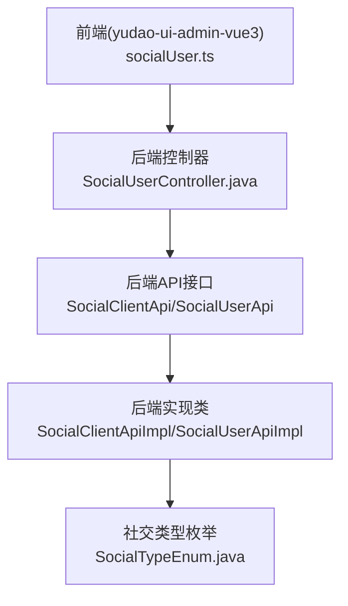
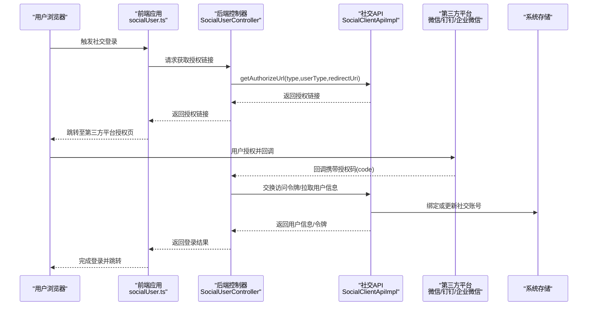
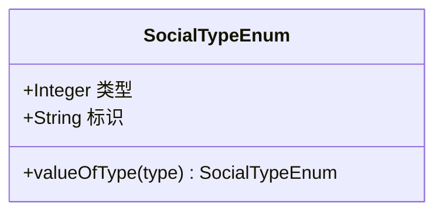
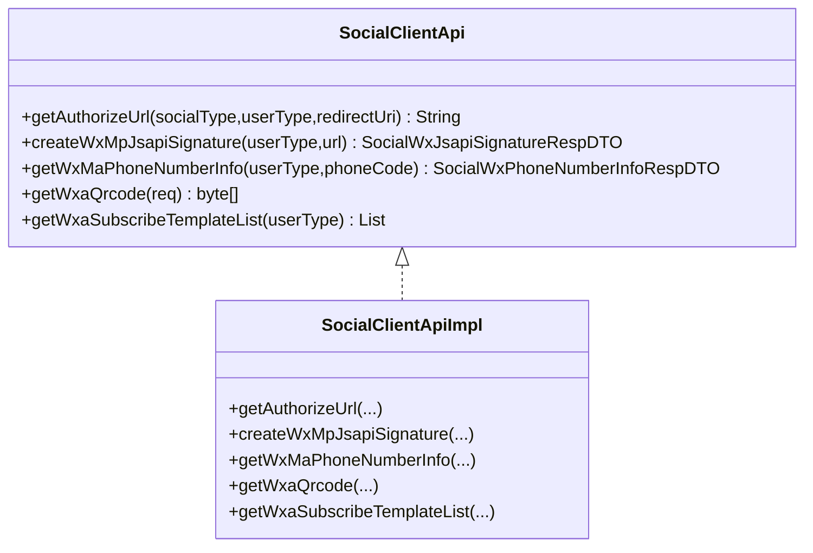
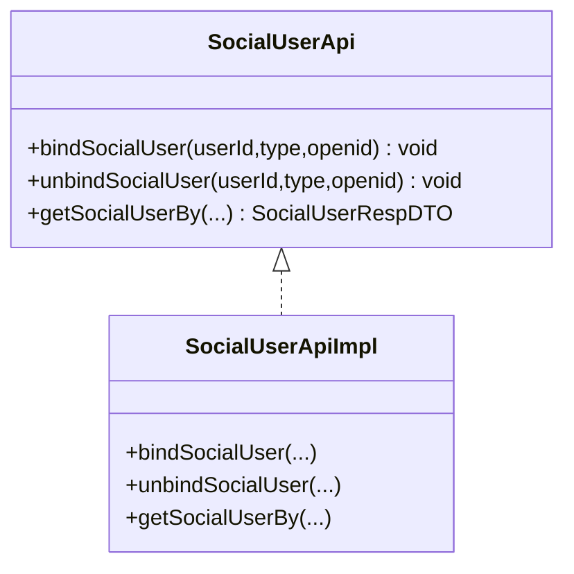
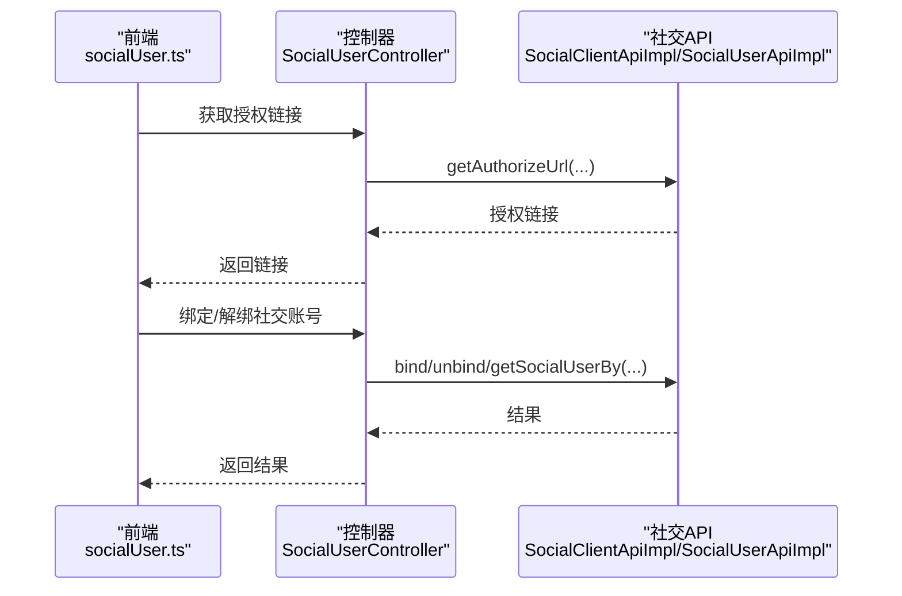
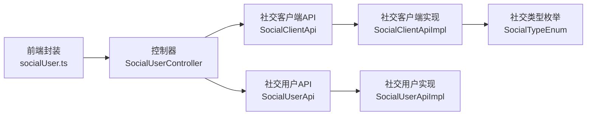
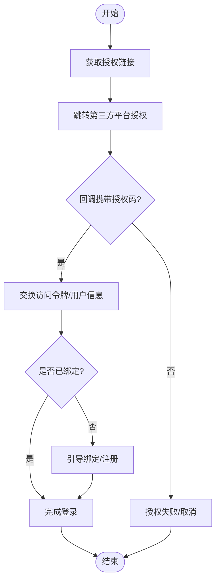

# 社交登录集成

<cite>
**本文引用的文件**
- [SocialTypeEnum.java](file://yudao-module-system/src/main/java/cn/iocoder/yudao/module/system/enums/social/SocialTypeEnum.java)
- [SocialClientApi.java](file://yudao-module-system/src/main/java/cn/iocoder/yudao/module/system/api/social/SocialClientApi.java)
- [SocialClientApiImpl.java](file://yudao-module-system/src/main/java/cn/iocoder/yudao/module/system/api/social/SocialClientApiImpl.java)
- [SocialUserApi.java](file://yudao-module-system/src/main/java/cn/iocoder/yudao/module/system/api/social/SocialUserApi.java)
- [SocialUserApiImpl.java](file://yudao-module-system/src/main/java/cn/iocoder/yudao/module/system/api/social/SocialUserApiImpl.java)
- [SocialUserController.java](file://yudao-module-system/src/main/java/cn/iocoder/yudao/module/system/controller/admin/socail/SocialUserController.java)
- [socialUser.ts](file://yudao-ui/yudao-ui-admin-vue3/src/api/system/user/socialUser.ts)
- [application.yaml](file://yudao-server/src/main/resources/application.yaml)
</cite>

## 目录
1. [简介](#简介)
2. [项目结构](#项目结构)
3. [核心组件](#核心组件)
4. [架构总览](#架构总览)
5. [详细组件分析](#详细组件分析)
6. [依赖关系分析](#依赖关系分析)
7. [性能考虑](#性能考虑)
8. [故障排查指南](#故障排查指南)
9. [结论](#结论)
10. [附录](#附录)

## 简介
本文件面向“芋道 Ruoyi-Vue-Pro”项目，系统化梳理并输出社交登录（第三方授权登录）的集成方案。内容覆盖微信公众号、微信小程序、钉钉、企业微信等主流社交平台的接入方式；阐述 OAuth2 授权流程（授权码获取、用户信息获取、token 刷新等）在本项目的实现形态；说明社交账号绑定与解绑的业务逻辑；总结安全机制（授权验证、用户信息校验、防重放等）；并给出配置项清单与前后端集成示例路径，帮助开发者快速落地。

## 项目结构
社交登录能力主要位于后端 yudao-module-system 模块与前端 yudao-ui-admin-vue3 中，核心目录如下：
- 后端
  - 枚举定义：cn.iocoder.yudao.module.system.enums.social.SocialTypeEnum
  - API 层：cn.iocoder.yudao.module.system.api.social.*
  - 控制器层：cn.iocoder.yudao.module.system.controller.admin.socail.SocialUserController
- 前端
  - API 封装：src/api/system/user/socialUser.ts

图表来源
- [SocialUserController.java](file://yudao-module-system/src/main/java/cn/iocoder/yudao/module/system/controller/admin/socail/SocialUserController.java)
- [SocialClientApi.java](file://yudao-module-system/src/main/java/cn/iocoder/yudao/module/system/api/social/SocialClientApi.java)
- [SocialClientApiImpl.java](file://yudao-module-system/src/main/java/cn/iocoder/yudao/module/system/api/social/SocialClientApiImpl.java)
- [SocialUserApi.java](file://yudao-module-system/src/main/java/cn/iocoder/yudao/module/system/api/social/SocialUserApi.java)
- [SocialUserApiImpl.java](file://yudao-module-system/src/main/java/cn/iocoder/yudao/module/system/api/social/SocialUserApiImpl.java)
- [SocialTypeEnum.java](file://yudao-module-system/src/main/java/cn/iocoder/yudao/module/system/enums/social/SocialTypeEnum.java)
- [socialUser.ts](file://yudao-ui/yudao-ui-admin-vue3/src/api/system/user/socialUser.ts)

章节来源
- [SocialTypeEnum.java:1-84](file://yudao-module-system/src/main/java/cn/iocoder/yudao/module/system/enums/social/SocialTypeEnum.java#L1-L84)
- [SocialClientApi.java](file://yudao-module-system/src/main/java/cn/iocoder/yudao/module/system/api/social/SocialClientApi.java)
- [SocialClientApiImpl.java:34-67](file://yudao-module-system/src/main/java/cn/iocoder/yudao/module/system/api/social/SocialClientApiImpl.java#L34-L67)
- [SocialUserApi.java](file://yudao-module-system/src/main/java/cn/iocoder/yudao/module/system/api/social/SocialUserApi.java)
- [SocialUserApiImpl.java](file://yudao-module-system/src/main/java/cn/iocoder/yudao/module/system/api/social/SocialUserApiImpl.java)
- [SocialUserController.java](file://yudao-module-system/src/main/java/cn/iocoder/yudao/module/system/controller/admin/socail/SocialUserController.java)
- [socialUser.ts](file://yudao-ui/yudao-ui-admin-vue3/src/api/system/user/socialUser.ts)

## 核心组件
- 社交类型枚举：定义支持的社交平台类型（如微信公众号、微信小程序、钉钉、企业微信等），用于区分不同平台的授权参数与处理逻辑。
- 社交客户端 API：对外暴露获取授权链接、生成微信 JS-SDK 签名、获取手机号信息、二维码与订阅模板等能力。
- 社交用户 API：对外暴露社交账号绑定、解绑、查询等接口。
- 控制器：Admin 端控制器负责接收前端请求，调用上述 API 并返回结果。
- 前端封装：对社交登录相关接口进行统一封装，便于页面调用。

章节来源
- [SocialTypeEnum.java:17-62](file://yudao-module-system/src/main/java/cn/iocoder/yudao/module/system/enums/social/SocialTypeEnum.java#L17-L62)
- [SocialClientApiImpl.java:34-67](file://yudao-module-system/src/main/java/cn/iocoder/yudao/module/system/api/social/SocialClientApiImpl.java#L34-L67)
- [SocialUserApiImpl.java](file://yudao-module-system/src/main/java/cn/iocoder/yudao/module/system/api/social/SocialUserApiImpl.java)
- [SocialUserController.java](file://yudao-module-system/src/main/java/cn/iocoder/yudao/module/system/controller/admin/socail/SocialUserController.java)
- [socialUser.ts](file://yudao-ui/yudao-ui-admin-vue3/src/api/system/user/socialUser.ts)

## 架构总览
社交登录在本项目中的整体交互链路如下：

图表来源
- [SocialClientApiImpl.java:34-48](file://yudao-module-system/src/main/java/cn/iocoder/yudao/module/system/api/social/SocialClientApiImpl.java#L34-L48)
- [SocialUserController.java](file://yudao-module-system/src/main/java/cn/iocoder/yudao/module/system/controller/admin/socail/SocialUserController.java)
- [socialUser.ts](file://yudao-ui/yudao-ui-admin-vue3/src/api/system/user/socialUser.ts)

## 详细组件分析

### 社交类型枚举（SocialTypeEnum）
- 能力概述：集中定义所有受支持的社交平台类型，包括微信公众号、微信小程序、钉钉、企业微信等，并提供类型值与标识字符串映射。
- 关键点：
  - 类型值（type）作为平台唯一标识，用于路由到对应平台的授权参数与处理逻辑。
  - 标识字符串（source）用于平台对接时的识别与配置匹配。
- 扩展建议：新增平台时，需在此处补充类型值与标识，并在后端适配层增加相应处理分支。

图表来源
- [SocialTypeEnum.java:17-82](file://yudao-module-system/src/main/java/cn/iocoder/yudao/module/system/enums/social/SocialTypeEnum.java#L17-L82)

章节来源
- [SocialTypeEnum.java:17-82](file://yudao-module-system/src/main/java/cn/iocoder/yudao/module/system/enums/social/SocialTypeEnum.java#L17-L82)

### 社交客户端 API（SocialClientApi/SocialClientApiImpl）
- 能力概述：对外提供获取授权链接、生成微信 JS-SDK 签名、获取微信小程序手机号信息、生成二维码与订阅模板列表等能力。
- 关键接口与职责：
  - 获取授权链接：根据平台类型、用户类型与回调地址，生成对应的授权跳转链接。
  - 微信 JS-SDK 签名：为微信公众号 JS-SDK 使用场景生成签名。
  - 微信小程序手机号：通过临时凭证换取用户手机号信息。
  - 二维码与订阅模板：提供小程序侧的二维码与订阅消息模板能力。
- 实现要点：
  - 授权链接生成与后续的授权码换取令牌、用户信息拉取等流程由实现类完成。
  - 微信相关能力（JS-SDK、手机号、二维码、订阅模板）在实现类中分别提供独立方法。

图表来源
- [SocialClientApi.java](file://yudao-module-system/src/main/java/cn/iocoder/yudao/module/system/api/social/SocialClientApi.java)
- [SocialClientApiImpl.java:34-67](file://yudao-module-system/src/main/java/cn/iocoder/yudao/module/system/api/social/SocialClientApiImpl.java#L34-L67)

章节来源
- [SocialClientApiImpl.java:34-67](file://yudao-module-system/src/main/java/cn/iocoder/yudao/module/system/api/social/SocialClientApiImpl.java#L34-L67)

### 社交用户 API（SocialUserApi/SocialUserApiImpl）
- 能力概述：提供社交账号绑定、解绑、查询等能力，支撑“用户账号与社交账号”的关联管理。
- 关键点：
  - 绑定：将当前登录用户与某个社交账号建立关联。
  - 解绑：解除用户与社交账号的关联。
  - 查询：按条件查询社交账号信息，用于登录态判断与后续流程。
- 与控制器配合：控制器接收前端请求，调用该 API 完成业务操作。

图表来源
- [SocialUserApi.java](file://yudao-module-system/src/main/java/cn/iocoder/yudao/module/system/api/social/SocialUserApi.java)
- [SocialUserApiImpl.java](file://yudao-module-system/src/main/java/cn/iocoder/yudao/module/system/api/social/SocialUserApiImpl.java)

章节来源
- [SocialUserApiImpl.java](file://yudao-module-system/src/main/java/cn/iocoder/yudao/module/system/api/social/SocialUserApiImpl.java)

### 控制器（SocialUserController）
- 能力概述：Admin 端控制器，负责接收前端请求，调用社交客户端与社交用户 API，返回结果给前端。
- 关键点：
  - 授权链接获取：转发前端请求到客户端 API 的授权链接生成方法。
  - 绑定/解绑：调用社交用户 API 完成社交账号与用户账号的关联变更。
  - 微信能力：转发微信 JS-SDK 签名、手机号、二维码、订阅模板等请求。

图表来源
- [SocialUserController.java](file://yudao-module-system/src/main/java/cn/iocoder/yudao/module/system/controller/admin/socail/SocialUserController.java)
- [SocialClientApiImpl.java:34-48](file://yudao-module-system/src/main/java/cn/iocoder/yudao/module/system/api/social/SocialClientApiImpl.java#L34-L48)
- [SocialUserApiImpl.java](file://yudao-module-system/src/main/java/cn/iocoder/yudao/module/system/api/social/SocialUserApiImpl.java)
- [socialUser.ts](file://yudao-ui/yudao-ui-admin-vue3/src/api/system/user/socialUser.ts)

章节来源
- [SocialUserController.java](file://yudao-module-system/src/main/java/cn/iocoder/yudao/module/system/controller/admin/socail/SocialUserController.java)

### 前端封装（socialUser.ts）
- 能力概述：对社交登录相关接口进行统一封装，提供便捷的调用入口，屏蔽具体 URL 与参数细节。
- 关键点：
  - 获取授权链接：调用后端接口，拿到授权链接后触发跳转。
  - 绑定/解绑：封装绑定与解绑请求，处理返回结果。
  - 微信能力：封装微信 JS-SDK 签名、手机号、二维码、订阅模板等请求。

章节来源
- [socialUser.ts](file://yudao-ui/yudao-ui-admin-vue3/src/api/system/user/socialUser.ts)

## 依赖关系分析
- 组件耦合：
  - 控制器依赖社交客户端与社交用户 API 接口。
  - 实现类依赖社交类型枚举与平台对接能力（如 JustAuth 等）。
  - 前端封装依赖控制器提供的接口。
- 可能的循环依赖：当前结构清晰，未见循环依赖迹象。
- 外部依赖：社交平台 SDK 或服务（如微信、钉钉、企业微信）由实现层对接。

图表来源
- [SocialUserController.java](file://yudao-module-system/src/main/java/cn/iocoder/yudao/module/system/controller/admin/socail/SocialUserController.java)
- [SocialClientApi.java](file://yudao-module-system/src/main/java/cn/iocoder/yudao/module/system/api/social/SocialClientApi.java)
- [SocialClientApiImpl.java:34-67](file://yudao-module-system/src/main/java/cn/iocoder/yudao/module/system/api/social/SocialClientApiImpl.java#L34-L67)
- [SocialUserApi.java](file://yudao-module-system/src/main/java/cn/iocoder/yudao/module/system/api/social/SocialUserApi.java)
- [SocialUserApiImpl.java](file://yudao-module-system/src/main/java/cn/iocoder/yudao/module/system/api/social/SocialUserApiImpl.java)
- [SocialTypeEnum.java:17-82](file://yudao-module-system/src/main/java/cn/iocoder/yudao/module/system/enums/social/SocialTypeEnum.java#L17-L82)
- [socialUser.ts](file://yudao-ui/yudao-ui-admin-vue3/src/api/system/user/socialUser.ts)

## 性能考虑
- 缓存策略：对微信 JS-SDK 签名、二维码等高频但不频繁变化的数据可引入缓存，降低重复计算与网络请求。
- 异步处理：绑定/解绑等非强一致需求可异步化，提升接口响应速度。
- 幂等性：确保授权回调、绑定/解绑等关键流程具备幂等保障，避免重复处理导致的状态异常。
- 超时控制：第三方平台接口调用应设置合理超时与重试策略，避免阻塞主流程。

## 故障排查指南
- 授权链接为空或无法跳转
  - 检查平台类型与回调地址是否正确配置。
  - 确认后端已注入对应平台的配置（应用 ID、应用密钥等）。
- 授权回调失败或无用户信息
  - 核对回调地址与平台侧配置一致。
  - 检查授权码是否被正确交换为访问令牌与用户信息。
- 绑定/解绑失败
  - 确认当前登录用户与目标社交账号未发生冲突。
  - 查看实现层日志，定位数据库约束或业务规则问题。
- 微信 JS-SDK 签名无效
  - 校验签名算法与参数顺序。
  - 确认域名白名单与页面 URL 已在平台侧配置。

## 结论
本项目以清晰的分层架构实现了社交登录能力，覆盖多平台接入、授权流程、用户信息获取与绑定管理，并提供了前端封装与后端控制器对接。通过扩展社交类型枚举与实现类，可快速接入新的社交平台；结合缓存、异步与幂等设计，可在保证安全性的同时提升性能与稳定性。

## 附录

### OAuth2 授权流程（在本项目的实现形态）
- 授权码获取
  - 前端调用后端接口获取授权链接。
  - 用户在第三方平台完成授权后，回调至指定地址并携带授权码。
- 用户信息获取
  - 后端使用授权码交换访问令牌，并拉取用户信息。
  - 若存在社交账号绑定记录，则直接关联用户；否则引导注册或绑定。
- token 刷新
  - 当访问令牌过期时，使用刷新令牌换取新令牌，保持长期可用。
- 绑定与解绑
  - 绑定：将社交账号与当前登录用户建立关联。
  - 解绑：解除关联，防止重复绑定与冲突。

图表来源
- [SocialClientApiImpl.java:34-48](file://yudao-module-system/src/main/java/cn/iocoder/yudao/module/system/api/social/SocialClientApiImpl.java#L34-L48)
- [SocialUserApiImpl.java](file://yudao-module-system/src/main/java/cn/iocoder/yudao/module/system/api/social/SocialUserApiImpl.java)

### 社交登录安全机制
- 授权验证
  - 校验回调参数签名与来源域名，防止伪造回调。
- 用户信息校验
  - 对第三方返回的用户标识进行去重与一致性校验。
- 防重放攻击
  - 授权码一次性使用，使用后立即作废。
  - 引入一次性随机数与时间戳，限制有效期。
- 会话与令牌
  - 访问令牌与刷新令牌严格区分，仅在安全通道传输。
  - 绑定关系持久化，防止跨账户冒用。

### 配置项清单（示例）
- 应用 ID（App ID）
  - 用于标识应用身份，不同平台需分别配置。
- 应用密钥（App Secret）
  - 用于加密与签名，务必妥善保管。
- 回调地址（Redirect URI）
  - 必须与平台侧配置一致，且与后端实现的回调路由匹配。
- 微信 JS-SDK
  - 公众号域名白名单、JSSDK 授权目录等。
- 微信小程序
  - 登录凭证校验、手机号获取等接口的权限配置。

章节来源
- [application.yaml](file://yudao-server/src/main/resources/application.yaml)

### 前后端集成示例路径
- 前端调用授权链接
  - 示例路径：[socialUser.ts](file://yudao-ui/yudao-ui-admin-vue3/src/api/system/user/socialUser.ts)
- 后端获取授权链接
  - 示例路径：[SocialClientApiImpl.java:34-48](file://yudao-module-system/src/main/java/cn/iocoder/yudao/module/system/api/social/SocialClientApiImpl.java#L34-L48)
- 控制器对接
  - 示例路径：[SocialUserController.java](file://yudao-module-system/src/main/java/cn/iocoder/yudao/module/system/controller/admin/socail/SocialUserController.java)
- 社交账号绑定/解绑
  - 示例路径：[SocialUserApiImpl.java](file://yudao-module-system/src/main/java/cn/iocoder/yudao/module/system/api/social/SocialUserApiImpl.java)