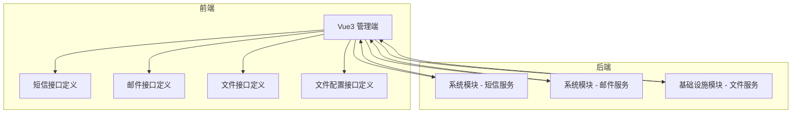
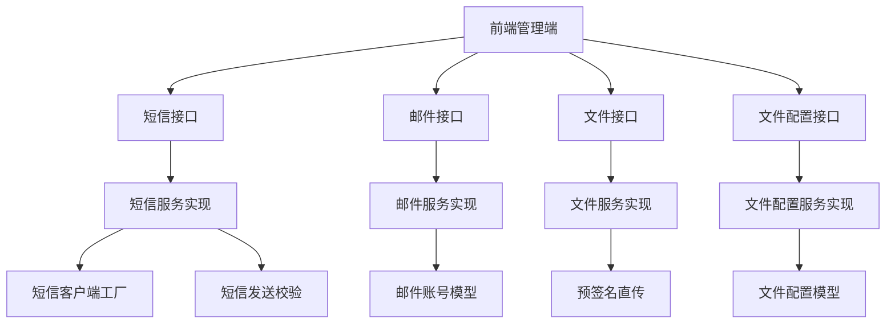
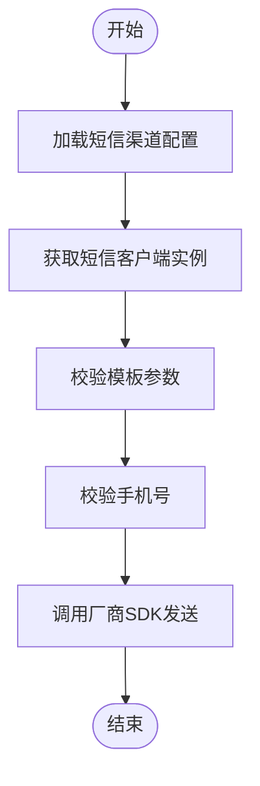
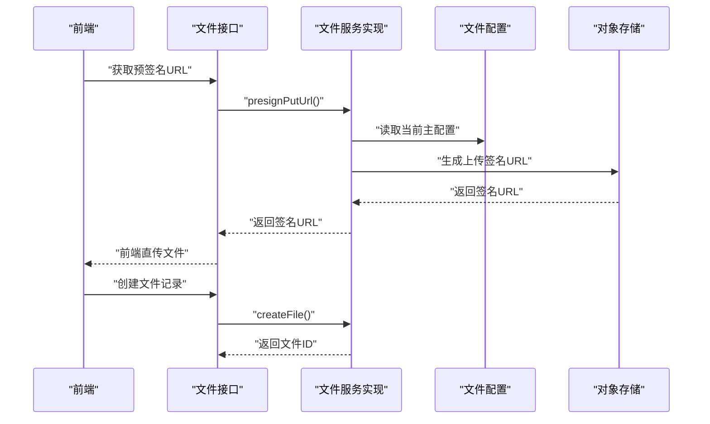
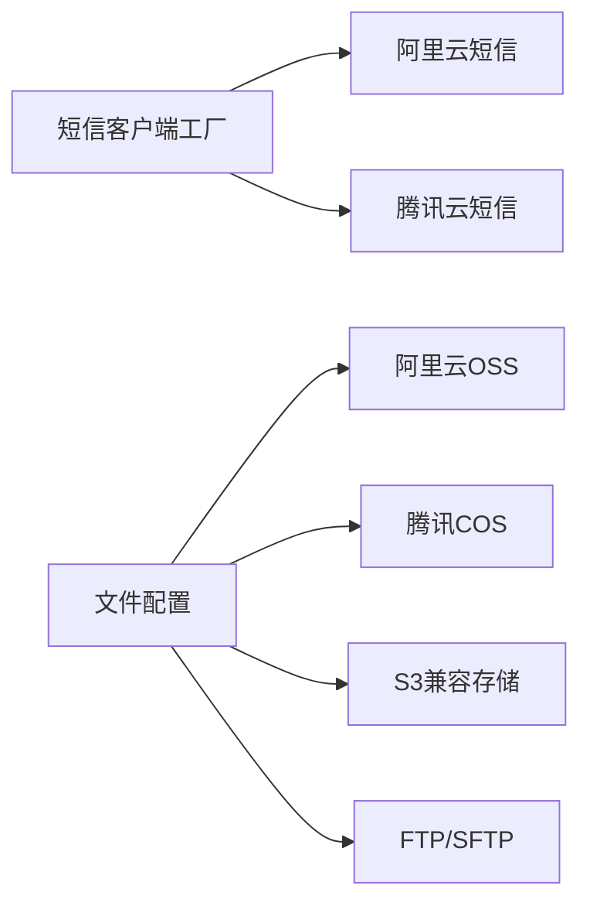

# 第三方系统集成

<cite>
**本文引用的文件**
- [SocialClientServiceImpl.java](file://yudao-module-system/src/main/java/cn/iocoder/yudao/module/system/service/social/SocialClientServiceImpl.java)
- [SocialTypeEnum.java](file://yudao-module-system/src/main/java/cn/iocoder/yudao/module/system/enums/social/SocialTypeEnum.java)
- [SocialClientApiImpl.java](file://yudao-module-system/src/main/java/cn/iocoder/yudao/module/system/api/social/SocialClientApiImpl.java)
- [SocialClientSaveReqVO.java](file://yudao-module-system/src/main/java/cn/iocoder/yudao/module/system/controller/admin/socail/vo/client/SocialClientSaveReqVO.java)
- [constants.ts](file://yudao-ui/yudao-ui-admin-vue3/src/utils/constants.ts)
- [SmsChannelService.java](file://yudao-module-system/src/main/java/cn/iocoder/yudao/module/system/service/sms/SmsChannelService.java)
- [SmsChannelServiceImpl.java](file://yudao-module-system/src/main/java/cn/iocoder/yudao/module/system/service/sms/SmsChannelServiceImpl.java)
- [SmsSendServiceImpl.java](file://yudao-module-system/src/main/java/cn/iocoder/yudao/module/system/service/sms/SmsSendServiceImpl.java)
- [MailAccountRespVO.java](file://yudao-module-system/src/main/java/cn/iocoder/yudao/module/system/controller/admin/mail/vo/account/MailAccountRespVO.java)
- [MailSendServiceImplTest.java](file://yudao-module-system/src/test/java/cn/iocoder/yudao/module/system/service/mail/MailSendServiceImplTest.java)
- [FileConfigController.java](file://yudao-module-infra/src/main/java/cn/iocoder/yudao/module/infra/controller/admin/file/FileConfigController.java)
- [FileController.java](file://yudao-module-infra/src/main/java/cn/iocoder/yudao/module/infra/controller/admin/file/FileController.java)
- [index.ts（文件配置接口定义）](file://yudao-ui/yudao-ui-admin-vue3/src/api/infra/fileConfig/index.ts)
- [index.ts（文件接口定义）](file://yudao-ui/yudao-ui-admin-vue3/src/api/infra/file/index.ts)
- [FileConfigController.http](file://yudao-module-infra/src/main/java/cn/iocoder/yudao/module/infra/controller/admin/file/FileConfigController.http)
- [package-info.java（消息队列包说明）](file://yudao-framework/yudao-spring-boot-starter-mq/src/main/java/cn/iocoder/yudao/framework/mq/package-info.java)
- [UserSocial.vue](file://yudao-ui/yudao-ui-admin-vue3/src/views/Profile/components/UserSocial.vue)
- [LoginForm.vue](file://yudao-ui/yudao-ui-admin-vue3/src/views/Login/components/LoginForm.vue)
- [SocialLogin.vue](file://yudao-ui/yudao-ui-admin-vue3/src/views/Login/SocialLogin.vue)
</cite>

## 更新摘要
**所做更改**
- 删除了社交登录集成章节，因为相关代码已被移除
- 删除了支付系统集成章节，因为相关代码已被移除
- 删除了消息队列系统章节，因为相关代码已被移除
- 保留了短信服务、邮件服务和文件存储系统的完整内容
- 更新了架构总览图以反映当前可用的集成组件
- 更新了依赖关系分析以体现实际的代码结构

## 目录
1. [引言](#引言)
2. [项目结构](#项目结构)
3. [核心组件](#核心组件)
4. [架构总览](#架构总览)
5. [详细组件分析](#详细组件分析)
6. [依赖关系分析](#依赖关系分析)
7. [性能考量](#性能考量)
8. [故障排查指南](#故障排查指南)
9. [结论](#结论)
10. [附录](#附录)

## 引言
本文件面向在芋道 Ruoyi-Vue-Pro 中集成第三方系统的开发者，系统性梳理短信、邮件、文件存储等常见集成场景，并给出可落地的扩展方法、最佳实践与参考路径，帮助快速完成集成开发。

**重要说明**：由于项目重构，原有的社交登录、支付系统和消息队列集成功能已被移除，本文档现已更新为当前可用的集成组件集合。

## 项目结构
围绕第三方系统集成的关键模块与职责如下：
- 短信服务：后端以"渠道 + 客户端工厂"的方式抽象多厂商短信能力；前端提供短信相关页面与调用。
- 邮件服务：后端提供邮箱账号配置与发送能力；前端提供邮件账号管理与测试。
- 文件存储：后端提供文件配置与预签名直传能力；前端提供文件上传与配置管理。

**图表来源**
- [index.ts（文件接口定义）:1-46](file://yudao-ui/yudao-ui-admin-vue3/src/api/infra/file/index.ts#L1-L46)
- [index.ts（文件配置接口定义）:1-69](file://yudao-ui/yudao-ui-admin-vue3/src/api/infra/fileConfig/index.ts#L1-L69)
- [SmsChannelService.java:1-88](file://yudao-module-system/src/main/java/cn/iocoder/yudao/module/system/service/sms/SmsChannelService.java#L1-L88)
- [MailAccountRespVO.java:1-39](file://yudao-module-system/src/main/java/cn/iocoder/yudao/module/system/controller/admin/mail/vo/account/MailAccountRespVO.java#L1-L39)
- [FileConfigController.java:1-98](file://yudao-module-infra/src/main/java/cn/iocoder/yudao/module/infra/controller/admin/file/FileConfigController.java#L1-L98)
- [FileController.java:57-81](file://yudao-module-infra/src/main/java/cn/iocoder/yudao/module/infra/controller/admin/file/FileController.java#L57-L81)

**章节来源**
- [index.ts（文件接口定义）:1-46](file://yudao-ui/yudao-ui-admin-vue3/src/api/infra/file/index.ts#L1-L46)
- [index.ts（文件配置接口定义）:1-69](file://yudao-ui/yudao-ui-admin-vue3/src/api/infra/fileConfig/index.ts#L1-L69)
- [SmsChannelService.java:1-88](file://yudao-module-system/src/main/java/cn/iocoder/yudao/module/system/service/sms/SmsChannelService.java#L1-L88)
- [MailAccountRespVO.java:1-39](file://yudao-module-system/src/main/java/cn/iocoder/yudao/module/system/controller/admin/mail/vo/account/MailAccountRespVO.java#L1-L39)
- [FileConfigController.java:1-98](file://yudao-module-infra/src/main/java/cn/iocoder/yudao/module/infra/controller/admin/file/FileConfigController.java#L1-L98)
- [FileController.java:57-81](file://yudao-module-infra/src/main/java/cn/iocoder/yudao/module/infra/controller/admin/file/FileController.java#L57-L81)

## 核心组件
- 短信服务
  - 渠道管理与客户端工厂：按渠道编码/编号获取具体厂商客户端实例。
  - 发送流程校验：模板参数、手机号格式与必填项校验。
- 邮件服务
  - 账号配置模型：包含 SMTP 主机、端口、SSL/STARTTLS 开关等。
  - 单元测试演示：快速验证邮箱账号连通性与收发。
- 文件存储
  - 文件配置管理：支持本地/云存储（如 S3/OSS/COS）等配置。
  - 预签名直传：前端直传到对象存储，后端记录文件信息。

**章节来源**
- [SmsChannelService.java:1-88](file://yudao-module-system/src/main/java/cn/iocoder/yudao/module/system/service/sms/SmsChannelService.java#L1-L88)
- [SmsChannelServiceImpl.java:1-35](file://yudao-module-system/src/main/java/cn/iocoder/yudao/module/system/service/sms/SmsChannelServiceImpl.java#L1-L35)
- [SmsSendServiceImpl.java:118-155](file://yudao-module-system/src/main/java/cn/iocoder/yudao/module/system/service/sms/SmsSendServiceImpl.java#L118-L155)
- [MailAccountRespVO.java:1-39](file://yudao-module-system/src/main/java/cn/iocoder/yudao/module/system/controller/admin/mail/vo/account/MailAccountRespVO.java#L1-L39)
- [MailSendServiceImplTest.java:55-83](file://yudao-module-system/src/test/java/cn/iocoder/yudao/module/system/service/mail/MailSendServiceImplTest.java#L55-L83)
- [FileConfigController.java:1-98](file://yudao-module-infra/src/main/java/cn/iocoder/yudao/module/infra/controller/admin/file/FileConfigController.java#L1-L98)
- [FileController.java:57-81](file://yudao-module-infra/src/main/java/cn/iocoder/yudao/module/infra/controller/admin/file/FileController.java#L57-L81)

## 架构总览
下图展示了当前可用的第三方系统集成在前后端的交互关系与关键扩展点：

**图表来源**
- [SmsChannelService.java:1-88](file://yudao-module-system/src/main/java/cn/iocoder/yudao/module/system/service/sms/SmsChannelService.java#L1-L88)
- [SmsChannelServiceImpl.java:1-35](file://yudao-module-system/src/main/java/cn/iocoder/yudao/module/system/service/sms/SmsChannelServiceImpl.java#L1-L35)
- [SmsSendServiceImpl.java:118-155](file://yudao-module-system/src/main/java/cn/iocoder/yudao/module/system/service/sms/SmsSendServiceImpl.java#L118-L155)
- [MailAccountRespVO.java:1-39](file://yudao-module-system/src/main/java/cn/iocoder/yudao/module/system/controller/admin/mail/vo/account/MailAccountRespVO.java#L1-L39)
- [FileConfigController.java:1-98](file://yudao-module-infra/src/main/java/cn/iocoder/yudao/module/infra/controller/admin/file/FileConfigController.java#L1-L98)
- [FileController.java:57-81](file://yudao-module-infra/src/main/java/cn/iocoder/yudao/module/infra/controller/admin/file/FileController.java#L57-L81)

## 详细组件分析

### 短信服务集成（阿里云、腾讯云等）
- 渠道管理与客户端工厂
  - 通过渠道编号/编码获取具体厂商客户端实例，便于扩展新厂商。
- 发送流程校验
  - 校验模板参数完整性、手机号格式与必填项，保证跨平台一致性。
- 集成建议
  - 模板参数顺序化处理适配不同厂商参数索引差异。
  - 提供渠道可用性探测与失败重试策略。

**图表来源**
- [SmsChannelService.java:1-88](file://yudao-module-system/src/main/java/cn/iocoder/yudao/module/system/service/sms/SmsChannelService.java#L1-L88)
- [SmsChannelServiceImpl.java:1-35](file://yudao-module-system/src/main/java/cn/iocoder/yudao/module/system/service/sms/SmsChannelServiceImpl.java#L1-L35)
- [SmsSendServiceImpl.java:118-155](file://yudao-module-system/src/main/java/cn/iocoder/yudao/module/system/service/sms/SmsSendServiceImpl.java#L118-L155)

**章节来源**
- [SmsChannelService.java:1-88](file://yudao-module-system/src/main/java/cn/iocoder/yudao/module/system/service/sms/SmsChannelService.java#L1-L88)
- [SmsChannelServiceImpl.java:1-35](file://yudao-module-system/src/main/java/cn/iocoder/yudao/module/system/service/sms/SmsChannelServiceImpl.java#L1-L35)
- [SmsSendServiceImpl.java:118-155](file://yudao-module-system/src/main/java/cn/iocoder/yudao/module/system/service/sms/SmsSendServiceImpl.java#L118-L155)

### 邮件服务集成
- 账号配置模型
  - 包含 SMTP 主机、端口、SSL/STARTTLS 开关、用户名/密码等字段。
- 单元测试示例
  - 提供快速连通性测试与收发验证，便于集成调试。
- 集成建议
  - 严格区分发件人显示名与邮箱地址；合理设置 SSL/STARTTLS。
  - 对抄送/密送列表进行去重与格式校验。

**章节来源**
- [MailAccountRespVO.java:1-39](file://yudao-module-system/src/main/java/cn/iocoder/yudao/module/system/controller/admin/mail/vo/account/MailAccountRespVO.java#L1-L39)
- [MailSendServiceImplTest.java:55-83](file://yudao-module-system/src/test/java/cn/iocoder/yudao/module/system/service/mail/MailSendServiceImplTest.java#L55-L83)

### 文件存储系统扩展（本地、云存储、FTP/SFTP）
- 文件配置管理
  - 支持多套存储配置，提供主配置切换与连通性测试。
- 预签名直传
  - 前端直传至对象存储（如 S3/OSS/COS），后端记录文件元数据。
- 集成建议
  - 本地存储建议结合 Nginx 或反向代理提供静态资源访问。
  - 云存储需配置跨域、CDN 加速与私有访问策略。
  - FTP/SFTP 可通过自定义客户端适配，注意连接池与超时控制。

**图表来源**
- [FileController.java:57-81](file://yudao-module-infra/src/main/java/cn/iocoder/yudao/module/infra/controller/admin/file/FileController.java#L57-L81)
- [FileConfigController.java:1-98](file://yudao-module-infra/src/main/java/cn/iocoder/yudao/module/infra/controller/admin/file/FileConfigController.java#L1-L98)
- [index.ts（文件接口定义）:1-46](file://yudao-ui/yudao-ui-admin-vue3/src/api/infra/file/index.ts#L1-L46)
- [index.ts（文件配置接口定义）:1-69](file://yudao-ui/yudao-ui-admin-vue3/src/api/infra/fileConfig/index.ts#L1-L69)
- [FileConfigController.http:1-45](file://yudao-module-infra/src/main/java/cn/iocoder/yudao/module/infra/controller/admin/file/FileConfigController.http#L1-L45)

**章节来源**
- [FileConfigController.java:1-98](file://yudao-module-infra/src/main/java/cn/iocoder/yudao/module/infra/controller/admin/file/FileConfigController.java#L1-L98)
- [FileController.java:57-81](file://yudao-module-infra/src/main/java/cn/iocoder/yudao/module/infra/controller/admin/file/FileController.java#L57-L81)
- [index.ts（文件接口定义）:1-46](file://yudao-ui/yudao-ui-admin-vue3/src/api/infra/file/index.ts#L1-L46)
- [index.ts（文件配置接口定义）:1-69](file://yudao-ui/yudao-ui-admin-vue3/src/api/infra/fileConfig/index.ts#L1-L69)
- [FileConfigController.http:1-45](file://yudao-module-infra/src/main/java/cn/iocoder/yudao/module/infra/controller/admin/file/FileConfigController.http#L1-L45)

## 依赖关系分析
- 组件内聚与耦合
  - 短信服务通过工厂解耦不同厂商客户端；文件服务通过配置解耦存储后端。
- 外部依赖与集成点
  - 短信/邮件/文件均依赖各自 SDK 或 HTTP 客户端。
- 潜在循环依赖
  - 当前模块划分清晰，未见明显循环依赖迹象。

**图表来源**
- [SmsChannelService.java:1-88](file://yudao-module-system/src/main/java/cn/iocoder/yudao/module/system/service/sms/SmsChannelService.java#L1-L88)
- [SmsChannelServiceImpl.java:1-35](file://yudao-module-system/src/main/java/cn/iocoder/yudao/module/system/service/sms/SmsChannelServiceImpl.java#L1-L35)
- [FileConfigController.java:1-98](file://yudao-module-infra/src/main/java/cn/iocoder/yudao/module/infra/controller/admin/file/FileConfigController.java#L1-L98)

**章节来源**
- [SmsChannelService.java:1-88](file://yudao-module-system/src/main/java/cn/iocoder/yudao/module/system/service/sms/SmsChannelService.java#L1-L88)
- [SmsChannelServiceImpl.java:1-35](file://yudao-module-system/src/main/java/cn/iocoder/yudao/module/system/service/sms/SmsChannelServiceImpl.java#L1-L35)
- [FileConfigController.java:1-98](file://yudao-module-infra/src/main/java/cn/iocoder/yudao/module/infra/controller/admin/file/FileConfigController.java#L1-L98)

## 性能考量
- 连接池与超时
  - 对外 HTTP/SDK 调用设置合理超时与重试，避免阻塞线程。
- 缓存与预热
  - 短信模板与配置建议缓存，减少数据库压力。
- 异步与削峰
  - 高频短信/邮件/文件操作采用异步化处理，结合限流与死信处理。
- 存储优化
  - 对象存储建议开启 CDN 与压缩；本地存储结合静态资源域名与缓存头。

## 故障排查指南
- 短信发送失败
  - 检查模板参数是否完整、手机号是否符合规范；确认渠道客户端初始化成功。
- 邮件发送异常
  - 校验 SMTP 主机、端口、SSL/STARTTLS 配置；使用单元测试快速定位问题。
- 文件直传失败
  - 校验文件配置主键与鉴权信息；检查预签名 URL 是否过期；确认对象存储跨域与权限。

**章节来源**
- [SmsSendServiceImpl.java:118-155](file://yudao-module-system/src/main/java/cn/iocoder/yudao/module/system/service/sms/SmsSendServiceImpl.java#L118-L155)
- [MailSendServiceImplTest.java:55-83](file://yudao-module-system/src/test/java/cn/iocoder/yudao/module/system/service/mail/MailSendServiceImplTest.java#L55-L83)
- [FileController.java:57-81](file://yudao-module-infra/src/main/java/cn/iocoder/yudao/module/infra/controller/admin/file/FileController.java#L57-L81)
- [FileConfigController.java:1-98](file://yudao-module-infra/src/main/java/cn/iocoder/yudao/module/infra/controller/admin/file/FileConfigController.java#L1-L98)

## 结论
通过工厂模式与配置化设计，Ruoyi-Vue-Pro 已为短信、邮件和文件存储等第三方系统集成了提供了良好的扩展骨架。开发者可基于现有组件快速对接各厂商服务，并结合异步处理实现高可靠与高性能的集成方案。

## 附录
- 常用配置模板参考路径
  - 文件配置（S3/OSS/COS 示例）：[FileConfigController.http:1-45](file://yudao-module-infra/src/main/java/cn/iocoder/yudao/module/infra/controller/admin/file/FileConfigController.http#L1-L45)
- 前端接口定义参考路径
  - 文件接口：[index.ts（文件接口定义）:1-46](file://yudao-ui/yudao-ui-admin-vue3/src/api/infra/file/index.ts#L1-L46)
  - 文件配置接口：[index.ts（文件配置接口定义）:1-69](file://yudao-ui/yudao-ui-admin-vue3/src/api/infra/fileConfig/index.ts#L1-L69)