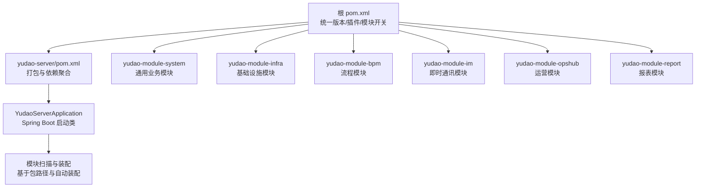
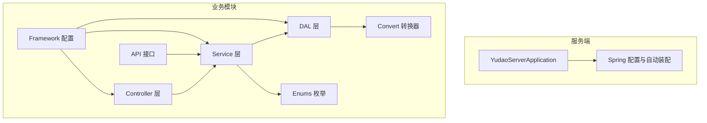
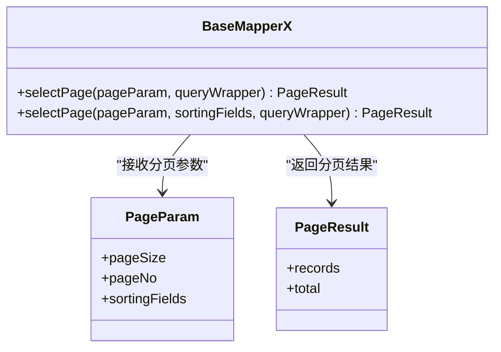
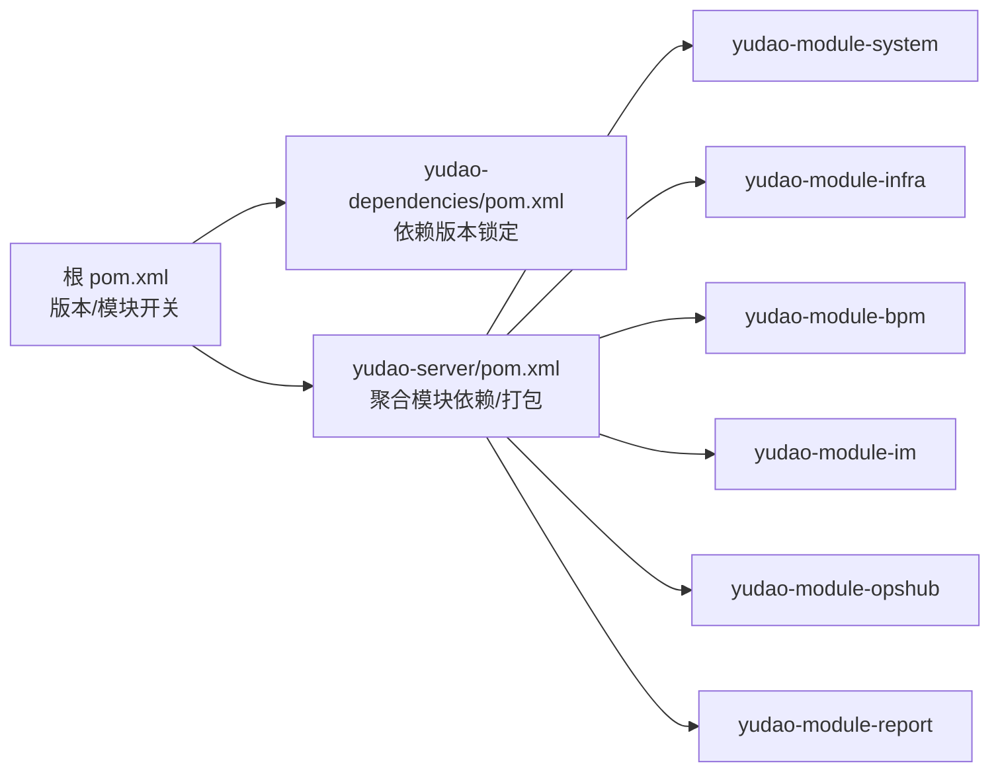

# 自定义模块开发

<cite>
**本文档引用的文件**
- [pom.xml](file://pom.xml)
- [DEVELOPMENT-GUIDE.md](file://DEVELOPMENT-GUIDE.md)
- [AGENTS.md](file://AGENTS.md)
- [yudao-server/pom.xml](file://yudao-server/pom.xml)
- [yudao-framework/yudao-spring-boot-starter-mybatis/src/main/java/cn/iocoder/yudao/framework/mybatis/core/mapper/BaseMapperX.java](file://yudao-framework/yudao-spring-boot-starter-mybatis/src/main/java/cn/iocoder/yudao/framework/mybatis/core/mapper/BaseMapperX.java)
- [yudao-module-system/src/main/java/cn/iocoder/yudao/module/system/package-info.java](file://yudao-module-system/src/main/java/cn/iocoder/yudao/module/system/package-info.java)
- [yudao-module-system/src/main/java/cn/iocoder/yudao/module/system/dal/mysql/package-info.java](file://yudao-module-system/src/main/java/cn/iocoder/yudao/module/system/dal/mysql/package-info.java)
- [yudao-module-infra/src/main/java/cn/iocoder/yudao/module/infra/package-info.java](file://yudao-module-infra/src/main/java/cn/iocoder/yudao/module/infra/package-info.java)
- [yudao-module-bpm/src/test/resources/logback.xml](file://yudao-module-bpm/src/test/resources/logback.xml)
- [yudao-module-report/src/test/resources/logback.xml](file://yudao-module-report/src/test/resources/logback.xml)
- [yudao-module-system/src/test/resources/logback.xml](file://yudao-module-system/src/test/resources/logback.xml)
- [yudao-module-infra/src/test/resources/logback.xml](file://yudao-module-infra/src/test/resources/logback.xml)
</cite>

## 目录
1. [简介](#简介)
2. [项目结构](#项目结构)
3. [核心组件](#核心组件)
4. [架构总览](#架构总览)
5. [详细组件分析](#详细组件分析)
6. [依赖分析](#依赖分析)
7. [性能考虑](#性能考虑)
8. [故障排查指南](#故障排查指南)
9. [结论](#结论)
10. [附录](#附录)

## 简介
本文件面向希望基于芋道 Ruoyi-Vue-Pro 开发“自定义模块”的工程师，系统讲解如何在现有工程骨架上新增业务模块，覆盖模块目录结构设计、Maven 依赖与打包配置、Spring Boot 自动装配与模块扫描、模块间依赖与接口设计、配置文件与数据库初始化、国际化资源、以及开发最佳实践（代码规范、异常处理、日志、单元测试）。文档同时给出从简单 CRUD 到复杂业务流程的模块开发示例步骤，帮助快速掌握完整技能。

## 项目结构
- 采用多模块 Maven 结构，根 pom.xml 统一版本与插件配置；各业务模块位于 yudao-module-xxx 下，服务端入口在 yudao-server。
- 模块启用需“双配置”：根 pom.xml 的 <modules> 与 yudao-server/pom.xml 的 <dependencies> 同步开启，否则构建会因依赖缺失而失败。
- 业务模块遵循统一包结构：controller/admin、service、dal/dataobject、dal/mysql、convert、enums、api、framework 等，严格按“上层调用下层”的依赖方向组织。

图表来源
- [pom.xml:1-120](file://pom.xml#L1-L120)
- [yudao-server/pom.xml:1-200](file://yudao-server/pom.xml#L1-L200)

章节来源
- [pom.xml:1-120](file://pom.xml#L1-L120)
- [AGENTS.md:77-106](file://AGENTS.md#L77-L106)
- [DEVELOPMENT-GUIDE.md:47-126](file://DEVELOPMENT-GUIDE.md#L47-L126)

## 核心组件
- 基类与约定
  - BaseDO：所有实体基类，统一字段（创建/更新时间、创建人/更新人、逻辑删除），自动填充。
  - BaseMapperX：MyBatis Plus 增强 Mapper，提供分页查询、排序、批量插入等便捷能力。
  - CommonResult/PageParam/PageResult：统一返回格式与分页参数/结果模型。
  - ErrorCode：模块内错误码常量集合，便于统一管理与前端提示。
- 包命名与层职责
  - controller/admin：后台接口控制器，按领域划分子包，输出 VO（保存/分页/列表/响应）。
  - service：业务接口与实现，封装领域规则与事务边界。
  - dal：数据访问层，dataobject 存放 DO，mysql 放置 Mapper 接口，redis 可选。
  - convert：MapStruct 转换器，DO↔VO 转换。
  - enums：枚举常量。
  - api：模块对外暴露的接口契约（供其他模块调用）。
  - framework：模块级配置类、Web 配置、安全配置等。

章节来源
- [DEVELOPMENT-GUIDE.md:72-126](file://DEVELOPMENT-GUIDE.md#L72-L126)
- [yudao-framework/yudao-spring-boot-starter-mybatis/src/main/java/cn/iocoder/yudao/framework/mybatis/core/mapper/BaseMapperX.java:23-55](file://yudao-framework/yudao-spring-boot-starter-mybatis/src/main/java/cn/iocoder/yudao/framework/mybatis/core/mapper/BaseMapperX.java#L23-L55)

## 架构总览
模块化架构遵循“上层调用下层”的依赖方向，Controller → Service → DAL。模块之间通过 api 接口进行有限耦合，避免循环依赖。Spring Boot 通过自动装配与包扫描加载模块组件，服务端入口聚合模块依赖并打包为可执行应用。

图表来源
- [DEVELOPMENT-GUIDE.md:64-83](file://DEVELOPMENT-GUIDE.md#L64-L83)
- [yudao-module-system/src/main/java/cn/iocoder/yudao/module/system/package-info.java:1-8](file://yudao-module-system/src/main/java/cn/iocoder/yudao/module/system/package-info.java#L1-L8)
- [yudao-module-system/src/main/java/cn/iocoder/yudao/module/system/dal/mysql/package-info.java:1-9](file://yudao-module-system/src/main/java/cn/iocoder/yudao/module/system/dal/mysql/package-info.java#L1-L9)
- [yudao-module-infra/src/main/java/cn/iocoder/yudao/module/infra/package-info.java:1-9](file://yudao-module-infra/src/main/java/cn/iocoder/yudao/module/infra/package-info.java#L1-L9)

## 详细组件分析

### 目录结构与包设计
- 统一包结构：controller/admin、service、dal/dataobject、dal/mysql、convert、enums、api、framework。
- URL 与表名前缀：模块内 Controller URL 以模块名开头，DO 表名以模块名前缀，便于隔离与识别。
- 依赖方向：严格禁止反向依赖，确保清晰的单向依赖链。

章节来源
- [DEVELOPMENT-GUIDE.md:47-83](file://DEVELOPMENT-GUIDE.md#L47-L83)
- [yudao-module-system/src/main/java/cn/iocoder/yudao/module/system/package-info.java:1-8](file://yudao-module-system/src/main/java/cn/iocoder/yudao/module/system/package-info.java#L1-L8)
- [yudao-module-system/src/main/java/cn/iocoder/yudao/module/system/dal/mysql/package-info.java:1-9](file://yudao-module-system/src/main/java/cn/iocoder/yudao/module/system/dal/mysql/package-info.java#L1-L9)
- [yudao-module-infra/src/main/java/cn/iocoder/yudao/module/infra/package-info.java:1-9](file://yudao-module-infra/src/main/java/cn/iocoder/yudao/module/infra/package-info.java#L1-L9)

### 数据访问层（DAL）与分页查询
- Mapper 基类：BaseMapperX 提供分页查询、排序、Wrapper 条件拼装等能力，简化分页与排序逻辑。
- DO 基类：BaseDO 统一字段与自动填充，减少重复代码。
- 使用建议：优先使用 BaseMapperX 的 selectPage 重载方法，传入 PageParam 与排序字段，自动完成分页与排序。

图表来源
- [yudao-framework/yudao-spring-boot-starter-mybatis/src/main/java/cn/iocoder/yudao/framework/mybatis/core/mapper/BaseMapperX.java:23-55](file://yudao-framework/yudao-spring-boot-starter-mybatis/src/main/java/cn/iocoder/yudao/framework/mybatis/core/mapper/BaseMapperX.java#L23-L55)

章节来源
- [yudao-framework/yudao-spring-boot-starter-mybatis/src/main/java/cn/iocoder/yudao/framework/mybatis/core/mapper/BaseMapperX.java:23-55](file://yudao-framework/yudao-spring-boot-starter-mybatis/src/main/java/cn/iocoder/yudao/framework/mybatis/core/mapper/BaseMapperX.java#L23-L55)

### 控制器（Controller）与 VO 设计
- 控制器命名：{Domain}Controller，如 DeptController。
- VO 命名：保存请求 VO {Domain}SaveReqVO、分页请求 {Domain}PageReqVO、列表请求 {Domain}ListReqVO、响应 {Domain}RespVO、精简响应 {Domain}SimpleRespVO。
- 控制器职责：接收请求、参数校验、调用 Service、组装统一返回格式。

章节来源
- [DEVELOPMENT-GUIDE.md:86-126](file://DEVELOPMENT-GUIDE.md#L86-L126)

### Service 层封装与事务边界
- 接口命名：{Domain}Service；实现命名：{Domain}ServiceImpl。
- 方法命名：create{Domain}/update{Domain}/delete{Domain}/get{Domain}…，遵循统一规范。
- 事务边界：在 Service 层声明事务，封装领域规则与一致性。

章节来源
- [DEVELOPMENT-GUIDE.md:86-126](file://DEVELOPMENT-GUIDE.md#L86-L126)

### 模块间接口设计（API）
- 模块通过 api 包导出接口契约，供其他模块调用，避免直接依赖实现细节。
- 接口设计原则：稳定、高内聚、低耦合；错误码与返回格式统一。

章节来源
- [DEVELOPMENT-GUIDE.md:47-83](file://DEVELOPMENT-GUIDE.md#L47-L83)

### Spring Boot 自动装配与模块扫描
- 包扫描：模块组件位于统一包结构下，Spring Boot 通过包路径与自动装配机制加载。
- 模块启用：根 pom.xml 的 <modules> 与 yudao-server/pom.xml 的 <dependencies> 必须同步启用，否则构建失败。

章节来源
- [AGENTS.md:77-106](file://AGENTS.md#L77-L106)
- [pom.xml:1-120](file://pom.xml#L1-L120)
- [yudao-server/pom.xml:165-187](file://yudao-server/pom.xml#L165-L187)

### 配置文件与国际化
- application.yaml：模块内可按需新增配置项；服务端入口提供多环境配置文件。
- 国际化资源：前端侧在 yudao-ui/yudao-ui-admin-vue3/src/locales 下维护多语言资源；后端可通过 Spring MessageSource 扩展（若模块需要）。

章节来源
- [yudao-server/pom.xml:165-187](file://yudao-server/pom.xml#L165-L187)

### 数据库初始化脚本
- 模块可在 test/resources/sql 或模块自身 resources/sql 下提供初始化 SQL，配合单元测试或本地开发环境初始化。
- 建议：脚本以模块名前缀命名，便于识别与清理。

章节来源
- [yudao-module-bpm/src/test/resources/logback.xml:1-4](file://yudao-module-bpm/src/test/resources/logback.xml#L1-L4)
- [yudao-module-report/src/test/resources/logback.xml:1-4](file://yudao-module-report/src/test/resources/logback.xml#L1-L4)
- [yudao-module-system/src/test/resources/logback.xml:1-4](file://yudao-module-system/src/test/resources/logback.xml#L1-L4)
- [yudao-module-infra/src/test/resources/logback.xml:1-4](file://yudao-module-infra/src/test/resources/logback.xml#L1-L4)

## 依赖分析
- 模块启用与依赖聚合：根 pom.xml 管理版本与模块开关；yudao-server/pom.xml 聚合模块依赖并负责打包。
- 版本管理：根 pom.xml 的 <revision> 统一版本号；第三方依赖在 yudao-dependencies/pom.xml 锁定。
- 模块间依赖：通过 api 接口与公共框架（如 yudao-framework）耦合，避免直接依赖实现。

图表来源
- [pom.xml:1-120](file://pom.xml#L1-L120)
- [yudao-server/pom.xml:165-187](file://yudao-server/pom.xml#L165-L187)

章节来源
- [pom.xml:1-120](file://pom.xml#L1-L120)
- [AGENTS.md:77-106](file://AGENTS.md#L77-L106)

## 性能考虑
- 分页查询：优先使用 BaseMapperX 的分页能力，合理设置排序字段与过滤条件，避免 N+1 查询。
- 缓存策略：结合 yudao-spring-boot-starter-redis 与业务场景，对热点数据进行缓存。
- 并发控制：在 Service 层通过幂等与锁机制保障并发一致性。
- 日志与监控：使用统一日志与链路追踪，定位性能瓶颈。

## 故障排查指南
- 模块无法启动/构建失败
  - 检查根 pom.xml 的 <modules> 是否已启用该模块。
  - 检查 yudao-server/pom.xml 的 <dependencies> 是否添加了该模块依赖。
- 单元测试日志配置
  - 各模块 test/resources 下的 logback.xml 引用 Spring Boot 默认配置，确保测试日志输出正常。
- 数据访问问题
  - 确认 Mapper 继承 BaseMapperX，分页参数与排序字段正确传递。
- 国际化与配置
  - application.yaml 中的配置项需与模块约定一致；前端多语言资源需与后端返回键匹配。

章节来源
- [AGENTS.md:77-106](file://AGENTS.md#L77-L106)
- [yudao-module-bpm/src/test/resources/logback.xml:1-4](file://yudao-module-bpm/src/test/resources/logback.xml#L1-L4)
- [yudao-module-report/src/test/resources/logback.xml:1-4](file://yudao-module-report/src/test/resources/logback.xml#L1-L4)
- [yudao-module-system/src/test/resources/logback.xml:1-4](file://yudao-module-system/src/test/resources/logback.xml#L1-L4)
- [yudao-module-infra/src/test/resources/logback.xml:1-4](file://yudao-module-infra/src/test/resources/logback.xml#L1-L4)

## 结论
通过遵循统一的模块目录结构、命名规范与依赖方向，结合 Spring Boot 自动装配与模块扫描机制，开发者可以高效地在 Ruoyi-Vue-Pro 上扩展新模块。配合统一的基类、分页查询能力、VO 设计与 API 接口契约，能够快速实现从简单 CRUD 到复杂业务流程的模块开发，并确保代码质量与可维护性。

## 附录

### 开发步骤示例：从零到一创建一个自定义模块
- 步骤 1：在根 pom.xml 的 <modules> 中新增模块占位，并在 yudao-server/pom.xml 的 <dependencies> 中添加依赖占位。
- 步骤 2：创建模块目录结构（controller/admin、service、dal/dataobject、dal/mysql、convert、enums、api、framework）。
- 步骤 3：定义领域实体 DO（继承 BaseDO）、Mapper（继承 BaseMapperX）与 Service 接口/实现。
- 步骤 4：定义 VO（保存/分页/列表/响应），在 Controller 中编写接口，调用 Service 并返回统一格式。
- 步骤 5：在 convert 中编写 MapStruct 转换器，完成 DO 与 VO 的映射。
- 步骤 6：在 enums 中定义枚举常量，在 api 中定义模块对外接口契约。
- 步骤 7：在 framework 中补充模块级配置（如 Web、安全、消息队列等）。
- 步骤 8：编写 application.yaml 配置与数据库初始化脚本，准备单元测试与日志配置。
- 步骤 9：启动服务端验证模块可用性，逐步完善异常处理、日志与监控。

章节来源
- [DEVELOPMENT-GUIDE.md:47-126](file://DEVELOPMENT-GUIDE.md#L47-L126)
- [AGENTS.md:77-106](file://AGENTS.md#L77-L106)