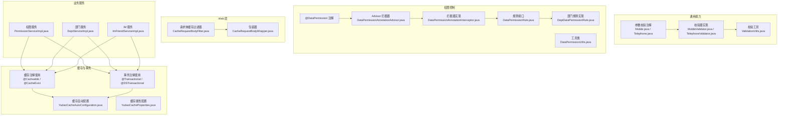
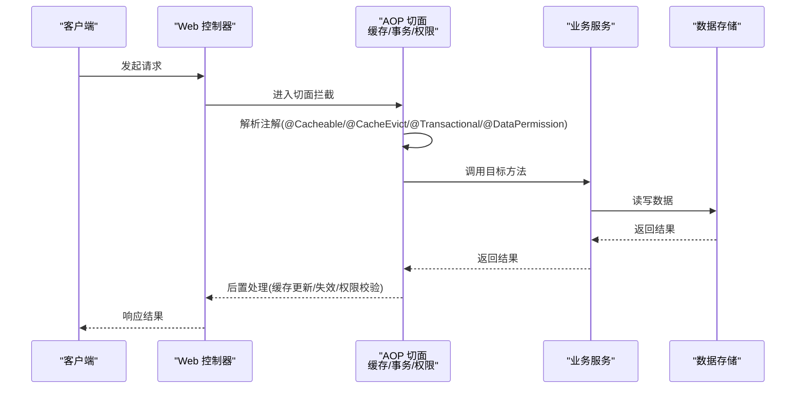
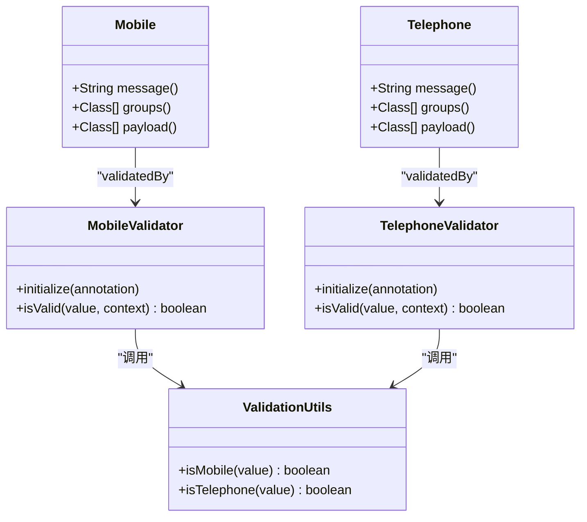
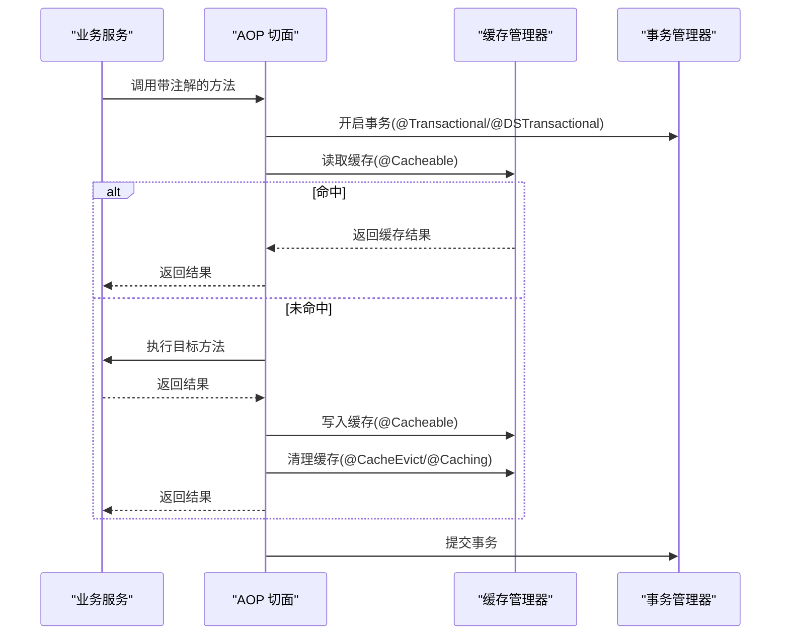
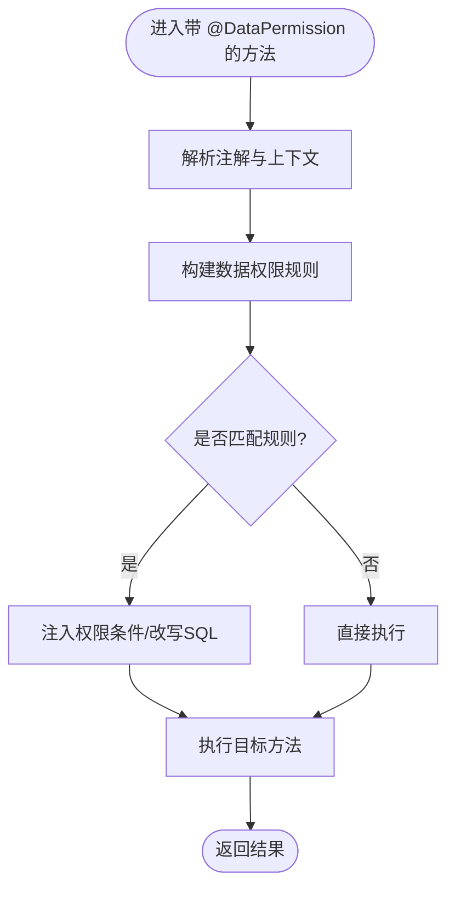
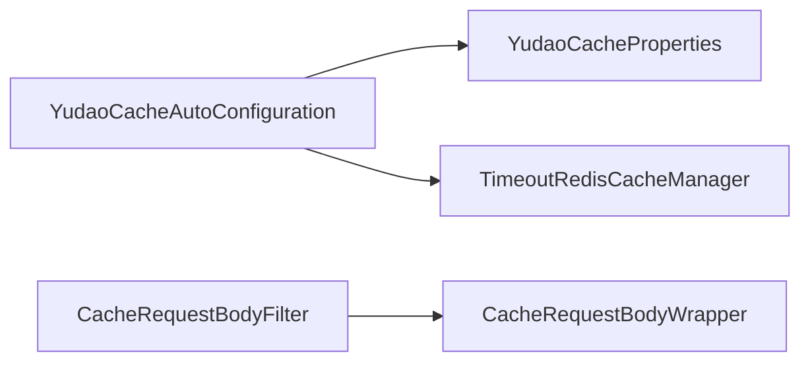
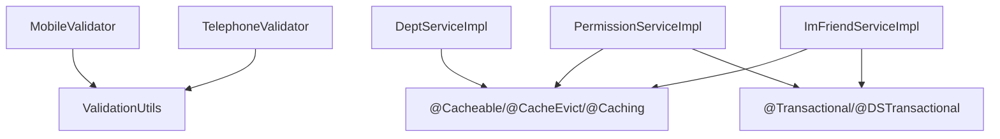

# 自定义注解开发

<cite>
**本文引用的文件**
- [yudao-common/src/main/java/cn/iocoder/yudao/framework/common/validation/Mobile.java](file://yudao-framework/yudao-common/src/main/java/cn/iocoder/yudao/framework/common/validation/Mobile.java)
- [yudao-common/src/main/java/cn/iocoder/yudao/framework/common/validation/Telephone.java](file://yudao-framework/yudao-common/src/main/java/cn/iocoder/yudao/framework/common/validation/Telephone.java)
- [yudao-common/src/main/java/cn/iocoder/yudao/framework/common/validation/MobileValidator.java](file://yudao-framework/yudao-common/src/main/java/cn/iocoder/yudao/framework/common/validation/MobileValidator.java)
- [yudao-common/src/main/java/cn/iocoder/yudao/framework/common/validation/TelephoneValidator.java](file://yudao-framework/yudao-common/src/main/java/cn/iocoder/yudao/framework/common/validation/TelephoneValidator.java)
- [yudao-common/src/main/java/cn/iocoder/yudao/framework/common/util/validation/ValidationUtils.java](file://yudao-framework/yudao-common/src/main/java/cn/iocoder/yudao/framework/common/util/validation/ValidationUtils.java)
- [yudao-module-system/src/main/java/cn/iocoder/yudao/module/system/service/permission/PermissionServiceImpl.java](file://yudao-module-system/src/main/java/cn/iocoder/yudao/module/system/service/permission/PermissionServiceImpl.java)
- [yudao-module-system/src/main/java/cn/iocoder/yudao/module/system/service/dept/DeptServiceImpl.java](file://yudao-module-system/src/main/java/cn/iocoder/yudao/module/system/service/dept/DeptServiceImpl.java)
- [yudao-module-im/src/main/java/cn/iocoder/yudao/module/im/service/friend/ImFriendServiceImpl.java](file://yudao-module-im/src/main/java/cn/iocoder/yudao/module/im/service/friend/ImFriendServiceImpl.java)
- [yudao-framework/yudao-spring-boot-starter-biz-data-permission/src/main/java/cn/iocoder/yudao/framework/datapermission/core/annotation/DataPermission.java](file://yudao-framework/yudao-spring-boot-starter-biz-data-permission/src/main/java/cn/iocoder/yudao/framework/datapermission/core/annotation/DataPermission.java)
- [yudao-framework/yudao-spring-boot-starter-biz-data-permission/src/main/java/cn/iocoder/yudao/framework/datapermission/core/aop/DataPermissionAnnotationAdvisor.java](file://yudao-framework/yudao-spring-boot-starter-biz-data-permission/src/main/java/cn/iocoder/yudao/framework/datapermission/core/aop/DataPermissionAnnotationAdvisor.java)
- [yudao-framework/yudao-spring-boot-starter-biz-data-permission/src/main/java/cn/iocoder/yudao/framework/datapermission/core/aop/DataPermissionAnnotationInterceptor.java](file://yudao-framework/yudao-spring-boot-starter-biz-data-permission/src/main/java/cn/iocoder/yudao/framework/datapermission/core/aop/DataPermissionAnnotationInterceptor.java)
- [yudao-framework/yudao-spring-boot-starter-biz-data-permission/src/main/java/cn/iocoder/yudao/framework/datapermission/core/rule/DataPermissionRule.java](file://yudao-framework/yudao-spring-boot-starter-biz-data-permission/src/main/java/cn/iocoder/yudao/framework/datapermission/core/rule/DataPermissionRule.java)
- [yudao-framework/yudao-spring-boot-starter-biz-data-permission/src/main/java/cn/iocoder/yudao/framework/datapermission/core/rule/dept/DeptDataPermissionRule.java](file://yudao-framework/yudao-spring-boot-starter-biz-data-permission/src/main/java/cn/iocoder/yudao/framework/datapermission/core/rule/dept/DeptDataPermissionRule.java)
- [yudao-framework/yudao-spring-boot-starter-biz-data-permission/src/main/java/cn/iocoder/yudao/framework/datapermission/core/util/DataPermissionUtils.java](file://yudao-framework/yudao-spring-boot-starter-biz-data-permission/src/main/java/cn/iocoder/yudao/framework/datapermission/core/util/DataPermissionUtils.java)
- [yudao-framework/yudao-spring-boot-starter-redis/src/main/java/cn/iocoder/yudao/framework/redis/config/YudaoCacheAutoConfiguration.java](file://yudao-framework/yudao-spring-boot-starter-redis/src/main/java/cn/iocoder/yudao/framework/redis/config/YudaoCacheAutoConfiguration.java)
- [yudao-framework/yudao-spring-boot-starter-redis/src/main/java/cn/iocoder/yudao/framework/redis/config/YudaoCacheProperties.java](file://yudao-framework/yudao-spring-boot-starter-redis/src/main/java/cn/iocoder/yudao/framework/redis/config/YudaoCacheProperties.java)
- [yudao-framework/yudao-spring-boot-starter-redis/src/main/java/cn/iocoder/yudao/framework/redis/core/TimeoutRedisCacheManager.java](file://yudao-framework/yudao-spring-boot-starter-redis/src/main/java/cn/iocoder/yudao/framework/redis/core/TimeoutRedisCacheManager.java)
- [yudao-framework/yudao-spring-boot-starter-web/src/main/java/cn/iocoder/yudao/framework/web/core/filter/CacheRequestBodyFilter.java](file://yudao-framework/yudao-spring-boot-starter-web/src/main/java/cn/iocoder/yudao/framework/web/core/filter/CacheRequestBodyFilter.java)
- [yudao-framework/yudao-spring-boot-starter-web/src/main/java/cn/iocoder/yudao/framework/web/core/filter/CacheRequestBodyWrapper.java](file://yudao-framework/yudao-spring-boot-starter-web/src/main/java/cn/iocoder/yudao/framework/web/core/filter/CacheRequestBodyWrapper.java)
</cite>

## 目录
1. [引言](#引言)
2. [项目结构](#项目结构)
3. [核心组件](#核心组件)
4. [架构总览](#架构总览)
5. [详细组件分析](#详细组件分析)
6. [依赖分析](#依赖分析)
7. [性能考量](#性能考量)
8. [故障排查指南](#故障排查指南)
9. [结论](#结论)
10. [附录](#附录)

## 引言
本指南面向“芋道 ruoyi-vue-pro”项目的开发者，系统讲解如何在现有基础设施上开发与集成各类自定义注解，包括：
- 基础注解与元注解设计
- 参数校验注解（如 @Mobile、@Telephone）的实现与校验器编写
- AOP 切面注解（如 @Cacheable、@CacheEvict、@Transactional、@DataPermission）的使用与扩展
- 权限控制注解的开发思路与拦截器实现
- 缓存注解的注册与配置
- 事务管理注解的扩展使用
- 注解处理器与自动装配的注册与配置方法

本指南以仓库中的实际实现为依据，提供可直接参考的文件路径与图示，帮助开发者快速掌握注解开发技能。

## 项目结构
围绕注解开发的关键模块与文件分布如下：
- 参数校验注解与校验器：位于 yudao-common/validation 下
- 缓存注解使用与自动配置：位于 yudao-spring-boot-starter-redis 下
- 权限控制注解与 AOP 拦截：位于 yudao-spring-boot-starter-biz-data-permission 下
- Web 层对请求体的缓存过滤器：位于 yudao-spring-boot-starter-web 下
- 业务服务层对缓存与事务的注解使用：位于各 module 的 service 实现类中

图表来源
- [yudao-common/src/main/java/cn/iocoder/yudao/framework/common/validation/Mobile.java:1-28](file://yudao-framework/yudao-common/src/main/java/cn/iocoder/yudao/framework/common/validation/Mobile.java#L1-L28)
- [yudao-common/src/main/java/cn/iocoder/yudao/framework/common/validation/Telephone.java:1-28](file://yudao-framework/yudao-common/src/main/java/cn/iocoder/yudao/framework/common/validation/Telephone.java#L1-L28)
- [yudao-common/src/main/java/cn/iocoder/yudao/framework/common/validation/MobileValidator.java:1-25](file://yudao-framework/yudao-common/src/main/java/cn/iocoder/yudao/framework/common/validation/MobileValidator.java#L1-L25)
- [yudao-common/src/main/java/cn/iocoder/yudao/framework/common/validation/TelephoneValidator.java](file://yudao-framework/yudao-common/src/main/java/cn/iocoder/yudao/framework/common/validation/TelephoneValidator.java)
- [yudao-common/src/main/java/cn/iocoder/yudao/framework/common/util/validation/ValidationUtils.java](file://yudao-framework/yudao-common/src/main/java/cn/iocoder/yudao/framework/common/util/validation/ValidationUtils.java)
- [yudao-module-system/src/main/java/cn/iocoder/yudao/module/system/service/permission/PermissionServiceImpl.java:162-175](file://yudao-module-system/src/main/java/cn/iocoder/yudao/module/system/service/permission/PermissionServiceImpl.java#L162-L175)
- [yudao-module-system/src/main/java/cn/iocoder/yudao/module/system/service/dept/DeptServiceImpl.java:58-89](file://yudao-module-system/src/main/java/cn/iocoder/yudao/module/system/service/dept/DeptServiceImpl.java#L58-L89)
- [yudao-module-im/src/main/java/cn/iocoder/yudao/module/im/service/friend/ImFriendServiceImpl.java:162-174](file://yudao-module-im/src/main/java/cn/iocoder/yudao/module/im/service/friend/ImFriendServiceImpl.java#L162-L174)
- [yudao-framework/yudao-spring-boot-starter-biz-data-permission/src/main/java/cn/iocoder/yudao/framework/datapermission/core/annotation/DataPermission.java](file://yudao-framework/yudao-spring-boot-starter-biz-data-permission/src/main/java/cn/iocoder/yudao/framework/datapermission/core/annotation/DataPermission.java)
- [yudao-framework/yudao-spring-boot-starter-biz-data-permission/src/main/java/cn/iocoder/yudao/framework/datapermission/core/aop/DataPermissionAnnotationAdvisor.java](file://yudao-framework/yudao-spring-boot-starter-biz-data-permission/src/main/java/cn/iocoder/yudao/framework/datapermission/core/aop/DataPermissionAnnotationAdvisor.java)
- [yudao-framework/yudao-spring-boot-starter-biz-data-permission/src/main/java/cn/iocoder/yudao/framework/datapermission/core/aop/DataPermissionAnnotationInterceptor.java](file://yudao-framework/yudao-spring-boot-starter-biz-data-permission/src/main/java/cn/iocoder/yudao/framework/datapermission/core/aop/DataPermissionAnnotationInterceptor.java)
- [yudao-framework/yudao-spring-boot-starter-biz-data-permission/src/main/java/cn/iocoder/yudao/framework/datapermission/core/rule/DataPermissionRule.java](file://yudao-framework/yudao-spring-boot-starter-biz-data-permission/src/main/java/cn/iocoder/yudao/framework/datapermission/core/rule/DataPermissionRule.java)
- [yudao-framework/yudao-spring-boot-starter-biz-data-permission/src/main/java/cn/iocoder/yudao/framework/datapermission/core/rule/dept/DeptDataPermissionRule.java](file://yudao-framework/yudao-spring-boot-starter-biz-data-permission/src/main/java/cn/iocoder/yudao/framework/datapermission/core/rule/dept/DeptDataPermissionRule.java)
- [yudao-framework/yudao-spring-boot-starter-biz-data-permission/src/main/java/cn/iocoder/yudao/framework/datapermission/core/util/DataPermissionUtils.java](file://yudao-framework/yudao-spring-boot-starter-biz-data-permission/src/main/java/cn/iocoder/yudao/framework/datapermission/core/util/DataPermissionUtils.java)
- [yudao-framework/yudao-spring-boot-starter-redis/src/main/java/cn/iocoder/yudao/framework/redis/config/YudaoCacheAutoConfiguration.java](file://yudao-framework/yudao-spring-boot-starter-redis/src/main/java/cn/iocoder/yudao/framework/redis/config/YudaoCacheAutoConfiguration.java)
- [yudao-framework/yudao-spring-boot-starter-redis/src/main/java/cn/iocoder/yudao/framework/redis/config/YudaoCacheProperties.java](file://yudao-framework/yudao-spring-boot-starter-redis/src/main/java/cn/iocoder/yudao/framework/redis/config/YudaoCacheProperties.java)
- [yudao-framework/yudao-spring-boot-starter-web/src/main/java/cn/iocoder/yudao/framework/web/core/filter/CacheRequestBodyFilter.java](file://yudao-framework/yudao-spring-boot-starter-web/src/main/java/cn/iocoder/yudao/framework/web/core/filter/CacheRequestBodyFilter.java)
- [yudao-framework/yudao-spring-boot-starter-web/src/main/java/cn/iocoder/yudao/framework/web/core/filter/CacheRequestBodyWrapper.java](file://yudao-framework/yudao-spring-boot-starter-web/src/main/java/cn/iocoder/yudao/framework/web/core/filter/CacheRequestBodyWrapper.java)

章节来源
- [yudao-common/src/main/java/cn/iocoder/yudao/framework/common/validation/Mobile.java:1-28](file://yudao-framework/yudao-common/src/main/java/cn/iocoder/yudao/framework/common/validation/Mobile.java#L1-L28)
- [yudao-common/src/main/java/cn/iocoder/yudao/framework/common/validation/Telephone.java:1-28](file://yudao-framework/yudao-common/src/main/java/cn/iocoder/yudao/framework/common/validation/Telephone.java#L1-L28)
- [yudao-module-system/src/main/java/cn/iocoder/yudao/module/system/service/permission/PermissionServiceImpl.java:162-175](file://yudao-module-system/src/main/java/cn/iocoder/yudao/module/system/service/permission/PermissionServiceImpl.java#L162-L175)

## 核心组件
- 参数校验注解与校验器
  - @Mobile 与 @Telephone 注解定义，声明 message、groups、payload 等标准属性
  - 对应的校验器实现，基于工具类进行正则或格式判断
- 缓存注解与自动配置
  - @Cacheable、@CacheEvict、@Caching 在业务层广泛使用
  - 缓存自动配置类负责启用缓存与管理器装配
- 权限控制注解与 AOP
  - @DataPermission 注解用于标注需要数据权限控制的方法
  - Advisor 与拦截器负责解析注解并应用规则
- Web 请求体缓存过滤器
  - 提供请求体缓存能力，便于重复读取请求内容

章节来源
- [yudao-common/src/main/java/cn/iocoder/yudao/framework/common/validation/Mobile.java:1-28](file://yudao-framework/yudao-common/src/main/java/cn/iocoder/yudao/framework/common/validation/Mobile.java#L1-L28)
- [yudao-common/src/main/java/cn/iocoder/yudao/framework/common/validation/Telephone.java:1-28](file://yudao-framework/yudao-common/src/main/java/cn/iocoder/yudao/framework/common/validation/Telephone.java#L1-L28)
- [yudao-common/src/main/java/cn/iocoder/yudao/framework/common/validation/MobileValidator.java:1-25](file://yudao-framework/yudao-common/src/main/java/cn/iocoder/yudao/framework/common/validation/MobileValidator.java#L1-L25)
- [yudao-framework/yudao-spring-boot-starter-biz-data-permission/src/main/java/cn/iocoder/yudao/framework/datapermission/core/annotation/DataPermission.java](file://yudao-framework/yudao-spring-boot-starter-biz-data-permission/src/main/java/cn/iocoder/yudao/framework/datapermission/core/annotation/DataPermission.java)
- [yudao-framework/yudao-spring-boot-starter-biz-data-permission/src/main/java/cn/iocoder/yudao/framework/datapermission/core/aop/DataPermissionAnnotationAdvisor.java](file://yudao-framework/yudao-spring-boot-starter-biz-data-permission/src/main/java/cn/iocoder/yudao/framework/datapermission/core/aop/DataPermissionAnnotationAdvisor.java)
- [yudao-framework/yudao-spring-boot-starter-biz-data-permission/src/main/java/cn/iocoder/yudao/framework/datapermission/core/aop/DataPermissionAnnotationInterceptor.java](file://yudao-framework/yudao-spring-boot-starter-biz-data-permission/src/main/java/cn/iocoder/yudao/framework/datapermission/core/aop/DataPermissionAnnotationInterceptor.java)
- [yudao-framework/yudao-spring-boot-starter-redis/src/main/java/cn/iocoder/yudao/framework/redis/config/YudaoCacheAutoConfiguration.java](file://yudao-framework/yudao-spring-boot-starter-redis/src/main/java/cn/iocoder/yudao/framework/redis/config/YudaoCacheAutoConfiguration.java)
- [yudao-framework/yudao-spring-boot-starter-web/src/main/java/cn/iocoder/yudao/framework/web/core/filter/CacheRequestBodyFilter.java](file://yudao-framework/yudao-spring-boot-starter-web/src/main/java/cn/iocoder/yudao/framework/web/core/filter/CacheRequestBodyFilter.java)

## 架构总览
下图展示了注解驱动的典型调用链：客户端请求进入 Web 层，经由 AOP 切面（缓存、事务、权限等）后到达业务服务，最终访问数据库或外部资源。

图表来源
- [yudao-module-system/src/main/java/cn/iocoder/yudao/module/system/service/permission/PermissionServiceImpl.java:162-175](file://yudao-module-system/src/main/java/cn/iocoder/yudao/module/system/service/permission/PermissionServiceImpl.java#L162-L175)
- [yudao-module-system/src/main/java/cn/iocoder/yudao/module/system/service/dept/DeptServiceImpl.java:58-89](file://yudao-module-system/src/main/java/cn/iocoder/yudao/module/system/service/dept/DeptServiceImpl.java#L58-L89)
- [yudao-module-im/src/main/java/cn/iocoder/yudao/module/im/service/friend/ImFriendServiceImpl.java:162-174](file://yudao-module-im/src/main/java/cn/iocoder/yudao/module/im/service/friend/ImFriendServiceImpl.java#L162-L174)
- [yudao-framework/yudao-spring-boot-starter-biz-data-permission/src/main/java/cn/iocoder/yudao/framework/datapermission/core/aop/DataPermissionAnnotationAdvisor.java](file://yudao-framework/yudao-spring-boot-starter-biz-data-permission/src/main/java/cn/iocoder/yudao/framework/datapermission/core/aop/DataPermissionAnnotationAdvisor.java)
- [yudao-framework/yudao-spring-boot-starter-biz-data-permission/src/main/java/cn/iocoder/yudao/framework/datapermission/core/aop/DataPermissionAnnotationInterceptor.java](file://yudao-framework/yudao-spring-boot-starter-biz-data-permission/src/main/java/cn/iocoder/yudao/framework/datapermission/core/aop/DataPermissionAnnotationInterceptor.java)

## 详细组件分析

### 参数校验注解：@Mobile 与 @Telephone
- 设计要点
  - 使用标准元注解 @Constraint 指定校验器类型
  - 支持多种目标类型（方法、字段、参数等）
  - 提供默认错误消息、分组与负载
- 校验器实现
  - 校验器实现 ConstraintValidator 接口
  - 空值默认放行，非空时委托工具类进行格式校验
- 工具类
  - 提供统一的格式校验逻辑，便于复用与扩展

图表来源
- [yudao-common/src/main/java/cn/iocoder/yudao/framework/common/validation/Mobile.java:1-28](file://yudao-framework/yudao-common/src/main/java/cn/iocoder/yudao/framework/common/validation/Mobile.java#L1-L28)
- [yudao-common/src/main/java/cn/iocoder/yudao/framework/common/validation/Telephone.java:1-28](file://yudao-framework/yudao-common/src/main/java/cn/iocoder/yudao/framework/common/validation/Telephone.java#L1-L28)
- [yudao-common/src/main/java/cn/iocoder/yudao/framework/common/validation/MobileValidator.java:1-25](file://yudao-framework/yudao-common/src/main/java/cn/iocoder/yudao/framework/common/validation/MobileValidator.java#L1-L25)
- [yudao-common/src/main/java/cn/iocoder/yudao/framework/common/validation/TelephoneValidator.java](file://yudao-framework/yudao-common/src/main/java/cn/iocoder/yudao/framework/common/validation/TelephoneValidator.java)
- [yudao-common/src/main/java/cn/iocoder/yudao/framework/common/util/validation/ValidationUtils.java](file://yudao-framework/yudao-common/src/main/java/cn/iocoder/yudao/framework/common/util/validation/ValidationUtils.java)

章节来源
- [yudao-common/src/main/java/cn/iocoder/yudao/framework/common/validation/Mobile.java:1-28](file://yudao-framework/yudao-common/src/main/java/cn/iocoder/yudao/framework/common/validation/Mobile.java#L1-L28)
- [yudao-common/src/main/java/cn/iocoder/yudao/framework/common/validation/Telephone.java:1-28](file://yudao-framework/yudao-common/src/main/java/cn/iocoder/yudao/framework/common/validation/Telephone.java#L1-L28)
- [yudao-common/src/main/java/cn/iocoder/yudao/framework/common/validation/MobileValidator.java:1-25](file://yudao-framework/yudao-common/src/main/java/cn/iocoder/yudao/framework/common/validation/MobileValidator.java#L1-L25)
- [yudao-common/src/main/java/cn/iocoder/yudao/framework/common/util/validation/ValidationUtils.java](file://yudao-framework/yudao-common/src/main/java/cn/iocoder/yudao/framework/common/util/validation/ValidationUtils.java)

### AOP 切面编程：缓存与事务
- 缓存注解使用
  - @Cacheable：按键从缓存读取，未命中则执行方法并将结果写回
  - @CacheEvict：按键或全量清空缓存
  - @Caching：组合多个缓存操作
- 事务注解使用
  - @Transactional：声明式事务
  - @DSTransactional：多数据源场景下的本地事务与数据源切换
- 业务实践
  - 权限服务：角色删除后清空相关菜单与用户角色缓存
  - 部门服务：更新/删除部门后清空部门树缓存
  - IM 服务：好友关系变更后双向失效对应缓存，并在事务提交后生效

图表来源
- [yudao-module-system/src/main/java/cn/iocoder/yudao/module/system/service/permission/PermissionServiceImpl.java:162-175](file://yudao-module-system/src/main/java/cn/iocoder/yudao/module/system/service/permission/PermissionServiceImpl.java#L162-L175)
- [yudao-module-system/src/main/java/cn/iocoder/yudao/module/system/service/dept/DeptServiceImpl.java:58-89](file://yudao-module-system/src/main/java/cn/iocoder/yudao/module/system/service/dept/DeptServiceImpl.java#L58-L89)
- [yudao-module-im/src/main/java/cn/iocoder/yudao/module/im/service/friend/ImFriendServiceImpl.java:162-174](file://yudao-module-im/src/main/java/cn/iocoder/yudao/module/im/service/friend/ImFriendServiceImpl.java#L162-L174)

章节来源
- [yudao-module-system/src/main/java/cn/iocoder/yudao/module/system/service/permission/PermissionServiceImpl.java:162-175](file://yudao-module-system/src/main/java/cn/iocoder/yudao/module/system/service/permission/PermissionServiceImpl.java#L162-L175)
- [yudao-module-system/src/main/java/cn/iocoder/yudao/module/system/service/dept/DeptServiceImpl.java:58-89](file://yudao-module-system/src/main/java/cn/iocoder/yudao/module/system/service/dept/DeptServiceImpl.java#L58-L89)
- [yudao-module-im/src/main/java/cn/iocoder/yudao/module/im/service/friend/ImFriendServiceImpl.java:162-174](file://yudao-module-im/src/main/java/cn/iocoder/yudao/module/im/service/friend/ImFriendServiceImpl.java#L162-L174)

### 权限控制注解：@DataPermission
- 注解与拦截器
  - @DataPermission 用于标注需要数据权限控制的方法
  - Advisor 将注解解析为拦截器，拦截器根据规则动态改写 SQL 或限制数据范围
- 规则体系
  - Rule 接口定义规则抽象
  - DeptDataPermissionRule 提供部门维度的数据权限规则
  - DataPermissionUtils 提供工具方法辅助解析与应用规则
- 应用流程
  - 方法执行前解析注解
  - 根据当前用户与规则生成数据权限条件
  - 将条件注入到查询上下文或改写 SQL

图表来源
- [yudao-framework/yudao-spring-boot-starter-biz-data-permission/src/main/java/cn/iocoder/yudao/framework/datapermission/core/annotation/DataPermission.java](file://yudao-framework/yudao-spring-boot-starter-biz-data-permission/src/main/java/cn/iocoder/yudao/framework/datapermission/core/annotation/DataPermission.java)
- [yudao-framework/yudao-spring-boot-starter-biz-data-permission/src/main/java/cn/iocoder/yudao/framework/datapermission/core/aop/DataPermissionAnnotationAdvisor.java](file://yudao-framework/yudao-spring-boot-starter-biz-data-permission/src/main/java/cn/iocoder/yudao/framework/datapermission/core/aop/DataPermissionAnnotationAdvisor.java)
- [yudao-framework/yudao-spring-boot-starter-biz-data-permission/src/main/java/cn/iocoder/yudao/framework/datapermission/core/aop/DataPermissionAnnotationInterceptor.java](file://yudao-framework/yudao-spring-boot-starter-biz-data-permission/src/main/java/cn/iocoder/yudao/framework/datapermission/core/aop/DataPermissionAnnotationInterceptor.java)
- [yudao-framework/yudao-spring-boot-starter-biz-data-permission/src/main/java/cn/iocoder/yudao/framework/datapermission/core/rule/DataPermissionRule.java](file://yudao-framework/yudao-spring-boot-starter-biz-data-permission/src/main/java/cn/iocoder/yudao/framework/datapermission/core/rule/DataPermissionRule.java)
- [yudao-framework/yudao-spring-boot-starter-biz-data-permission/src/main/java/cn/iocoder/yudao/framework/datapermission/core/rule/dept/DeptDataPermissionRule.java](file://yudao-framework/yudao-spring-boot-starter-biz-data-permission/src/main/java/cn/iocoder/yudao/framework/datapermission/core/rule/dept/DeptDataPermissionRule.java)
- [yudao-framework/yudao-spring-boot-starter-biz-data-permission/src/main/java/cn/iocoder/yudao/framework/datapermission/core/util/DataPermissionUtils.java](file://yudao-framework/yudao-spring-boot-starter-biz-data-permission/src/main/java/cn/iocoder/yudao/framework/datapermission/core/util/DataPermissionUtils.java)

章节来源
- [yudao-framework/yudao-spring-boot-starter-biz-data-permission/src/main/java/cn/iocoder/yudao/framework/datapermission/core/annotation/DataPermission.java](file://yudao-framework/yudao-spring-boot-starter-biz-data-permission/src/main/java/cn/iocoder/yudao/framework/datapermission/core/annotation/DataPermission.java)
- [yudao-framework/yudao-spring-boot-starter-biz-data-permission/src/main/java/cn/iocoder/yudao/framework/datapermission/core/aop/DataPermissionAnnotationAdvisor.java](file://yudao-framework/yudao-spring-boot-starter-biz-data-permission/src/main/java/cn/iocoder/yudao/framework/datapermission/core/aop/DataPermissionAnnotationAdvisor.java)
- [yudao-framework/yudao-spring-boot-starter-biz-data-permission/src/main/java/cn/iocoder/yudao/framework/datapermission/core/aop/DataPermissionAnnotationInterceptor.java](file://yudao-framework/yudao-spring-boot-starter-biz-data-permission/src/main/java/cn/iocoder/yudao/framework/datapermission/core/aop/DataPermissionAnnotationInterceptor.java)
- [yudao-framework/yudao-spring-boot-starter-biz-data-permission/src/main/java/cn/iocoder/yudao/framework/datapermission/core/rule/DataPermissionRule.java](file://yudao-framework/yudao-spring-boot-starter-biz-data-permission/src/main/java/cn/iocoder/yudao/framework/datapermission/core/rule/DataPermissionRule.java)
- [yudao-framework/yudao-spring-boot-starter-biz-data-permission/src/main/java/cn/iocoder/yudao/framework/datapermission/core/rule/dept/DeptDataPermissionRule.java](file://yudao-framework/yudao-spring-boot-starter-biz-data-permission/src/main/java/cn/iocoder/yudao/framework/datapermission/core/rule/dept/DeptDataPermissionRule.java)
- [yudao-framework/yudao-spring-boot-starter-biz-data-permission/src/main/java/cn/iocoder/yudao/framework/datapermission/core/util/DataPermissionUtils.java](file://yudao-framework/yudao-spring-boot-starter-biz-data-permission/src/main/java/cn/iocoder/yudao/framework/datapermission/core/util/DataPermissionUtils.java)

### 缓存注解的注册与配置
- 自动配置
  - YudaoCacheAutoConfiguration 负责启用缓存与装配缓存管理器
  - YudaoCacheProperties 提供缓存相关属性配置入口
- 管理器实现
  - TimeoutRedisCacheManager 提供超时缓存管理器实现
- Web 层支持
  - CacheRequestBodyFilter 与 CacheRequestBodyWrapper 提供请求体缓存能力

图表来源
- [yudao-framework/yudao-spring-boot-starter-redis/src/main/java/cn/iocoder/yudao/framework/redis/config/YudaoCacheAutoConfiguration.java](file://yudao-framework/yudao-spring-boot-starter-redis/src/main/java/cn/iocoder/yudao/framework/redis/config/YudaoCacheAutoConfiguration.java)
- [yudao-framework/yudao-spring-boot-starter-redis/src/main/java/cn/iocoder/yudao/framework/redis/config/YudaoCacheProperties.java](file://yudao-framework/yudao-spring-boot-starter-redis/src/main/java/cn/iocoder/yudao/framework/redis/config/YudaoCacheProperties.java)
- [yudao-framework/yudao-spring-boot-starter-redis/src/main/java/cn/iocoder/yudao/framework/redis/core/TimeoutRedisCacheManager.java](file://yudao-framework/yudao-spring-boot-starter-redis/src/main/java/cn/iocoder/yudao/framework/redis/core/TimeoutRedisCacheManager.java)
- [yudao-framework/yudao-spring-boot-starter-web/src/main/java/cn/iocoder/yudao/framework/web/core/filter/CacheRequestBodyFilter.java](file://yudao-framework/yudao-spring-boot-starter-web/src/main/java/cn/iocoder/yudao/framework/web/core/filter/CacheRequestBodyFilter.java)
- [yudao-framework/yudao-spring-boot-starter-web/src/main/java/cn/iocoder/yudao/framework/web/core/filter/CacheRequestBodyWrapper.java](file://yudao-framework/yudao-spring-boot-starter-web/src/main/java/cn/iocoder/yudao/framework/web/core/filter/CacheRequestBodyWrapper.java)

章节来源
- [yudao-framework/yudao-spring-boot-starter-redis/src/main/java/cn/iocoder/yudao/framework/redis/config/YudaoCacheAutoConfiguration.java](file://yudao-framework/yudao-spring-boot-starter-redis/src/main/java/cn/iocoder/yudao/framework/redis/config/YudaoCacheAutoConfiguration.java)
- [yudao-framework/yudao-spring-boot-starter-redis/src/main/java/cn/iocoder/yudao/framework/redis/config/YudaoCacheProperties.java](file://yudao-framework/yudao-spring-boot-starter-redis/src/main/java/cn/iocoder/yudao/framework/redis/config/YudaoCacheProperties.java)
- [yudao-framework/yudao-spring-boot-starter-redis/src/main/java/cn/iocoder/yudao/framework/redis/core/TimeoutRedisCacheManager.java](file://yudao-framework/yudao-spring-boot-starter-redis/src/main/java/cn/iocoder/yudao/framework/redis/core/TimeoutRedisCacheManager.java)
- [yudao-framework/yudao-spring-boot-starter-web/src/main/java/cn/iocoder/yudao/framework/web/core/filter/CacheRequestBodyFilter.java](file://yudao-framework/yudao-spring-boot-starter-web/src/main/java/cn/iocoder/yudao/framework/web/core/filter/CacheRequestBodyFilter.java)
- [yudao-framework/yudao-spring-boot-starter-web/src/main/java/cn/iocoder/yudao/framework/web/core/filter/CacheRequestBodyWrapper.java](file://yudao-framework/yudao-spring-boot-starter-web/src/main/java/cn/iocoder/yudao/framework/web/core/filter/CacheRequestBodyWrapper.java)

### 事务管理注解的扩展使用
- @Transactional：标准声明式事务
- @DSTransactional：多数据源场景下的本地事务与数据源切换
- 实践建议
  - 在跨库/多数据源操作时优先使用 @DSTransactional
  - 结合 @CacheEvict/@Caching 在事务提交后清理缓存，确保一致性

章节来源
- [yudao-module-system/src/main/java/cn/iocoder/yudao/module/system/service/permission/PermissionServiceImpl.java:133-133](file://yudao-module-system/src/main/java/cn/iocoder/yudao/module/system/service/permission/PermissionServiceImpl.java#L133-L133)
- [yudao-module-system/src/main/java/cn/iocoder/yudao/module/system/service/permission/PermissionServiceImpl.java:205-205](file://yudao-module-system/src/main/java/cn/iocoder/yudao/module/system/service/permission/PermissionServiceImpl.java#L205-L205)

## 依赖分析
- 组件耦合
  - 参数校验注解与校验器低耦合，通过 @Constraint 关联
  - 缓存与事务注解在业务服务层集中使用，形成横切关注点
  - 权限注解通过 AOP 与规则体系解耦，便于扩展新规则
- 外部依赖
  - Spring Cache、Spring Transaction、MyBatis Plus、Hutool 等

图表来源
- [yudao-common/src/main/java/cn/iocoder/yudao/framework/common/validation/MobileValidator.java:1-25](file://yudao-common/src/main/java/cn/iocoder/yudao/framework/common/validation/MobileValidator.java#L1-L25)
- [yudao-common/src/main/java/cn/iocoder/yudao/framework/common/util/validation/ValidationUtils.java](file://yudao-framework/yudao-common/src/main/java/cn/iocoder/yudao/framework/common/util/validation/ValidationUtils.java)
- [yudao-module-system/src/main/java/cn/iocoder/yudao/module/system/service/permission/PermissionServiceImpl.java:162-175](file://yudao-module-system/src/main/java/cn/iocoder/yudao/module/system/service/permission/PermissionServiceImpl.java#L162-L175)
- [yudao-module-system/src/main/java/cn/iocoder/yudao/module/system/service/dept/DeptServiceImpl.java:58-89](file://yudao-module-system/src/main/java/cn/iocoder/yudao/module/system/service/dept/DeptServiceImpl.java#L58-L89)
- [yudao-module-im/src/main/java/cn/iocoder/yudao/module/im/service/friend/ImFriendServiceImpl.java:162-174](file://yudao-module-im/src/main/java/cn/iocoder/yudao/module/im/service/friend/ImFriendServiceImpl.java#L162-L174)

章节来源
- [yudao-common/src/main/java/cn/iocoder/yudao/framework/common/validation/MobileValidator.java:1-25](file://yudao-common/src/main/java/cn/iocoder/yudao/framework/common/validation/MobileValidator.java#L1-L25)
- [yudao-common/src/main/java/cn/iocoder/yudao/framework/common/util/validation/ValidationUtils.java](file://yudao-framework/yudao-common/src/main/java/cn/iocoder/yudao/framework/common/util/validation/ValidationUtils.java)
- [yudao-module-system/src/main/java/cn/iocoder/yudao/module/system/service/permission/PermissionServiceImpl.java:162-175](file://yudao-module-system/src/main/java/cn/iocoder/yudao/module/system/service/permission/PermissionServiceImpl.java#L162-L175)
- [yudao-module-system/src/main/java/cn/iocoder/yudao/module/system/service/dept/DeptServiceImpl.java:58-89](file://yudao-module-system/src/main/java/cn/iocoder/yudao/module/system/service/dept/DeptServiceImpl.java#L58-L89)
- [yudao-module-im/src/main/java/cn/iocoder/yudao/module/im/service/friend/ImFriendServiceImpl.java:162-174](file://yudao-module-im/src/main/java/cn/iocoder/yudao/module/im/service/friend/ImFriendServiceImpl.java#L162-L174)

## 性能考量
- 缓存策略
  - 合理使用 @Cacheable 与 @CacheEvict，避免过度缓存导致内存压力
  - 对热点数据设置合适过期时间，结合 @Caching 批量失效
- 事务边界
  - 将耗时操作移出事务，减少锁持有时间
  - 多数据源场景使用 @DSTransactional，避免分布式事务复杂度
- 校验性能
  - 校验器尽量轻量，避免重复计算与 IO
  - 对空值放行可减少无效校验开销

## 故障排查指南
- 参数校验不生效
  - 检查注解是否标注在可验证的目标上
  - 确认校验器实现与 @Constraint 关联正确
- 缓存未命中或失效异常
  - 核对缓存键是否一致，确认 @CacheEvict 的 key 表达式
  - 检查事务提交时机，确保缓存更新在 afterCommit 生效
- 权限控制未生效
  - 确认方法被 AOP 代理，避免同类内调用绕过拦截
  - 检查规则实现与上下文解析逻辑
- 事务异常
  - 检查异常是否被吞没或未抛出受检异常
  - 多数据源场景确认 @DSTransactional 是否正确标注

章节来源
- [yudao-common/src/main/java/cn/iocoder/yudao/framework/common/validation/Mobile.java:1-28](file://yudao-framework/yudao-common/src/main/java/cn/iocoder/yudao/framework/common/validation/Mobile.java#L1-L28)
- [yudao-common/src/main/java/cn/iocoder/yudao/framework/common/validation/Telephone.java:1-28](file://yudao-framework/yudao-common/src/main/java/cn/iocoder/yudao/framework/common/validation/Telephone.java#L1-L28)
- [yudao-module-system/src/main/java/cn/iocoder/yudao/module/system/service/permission/PermissionServiceImpl.java:162-175](file://yudao-module-system/src/main/java/cn/iocoder/yudao/module/system/service/permission/PermissionServiceImpl.java#L162-L175)
- [yudao-framework/yudao-spring-boot-starter-biz-data-permission/src/main/java/cn/iocoder/yudao/framework/datapermission/core/aop/DataPermissionAnnotationInterceptor.java](file://yudao-framework/yudao-spring-boot-starter-biz-data-permission/src/main/java/cn/iocoder/yudao/framework/datapermission/core/aop/DataPermissionAnnotationInterceptor.java)

## 结论
通过参数校验注解、缓存与事务注解、权限控制注解以及 Web 层的请求体缓存能力，ruoyi-vue-pro 形成了完善的横切能力体系。开发者可在现有实现基础上，遵循“低耦合、高内聚”的原则，快速扩展新的注解与拦截器，提升系统的可维护性与可扩展性。

## 附录
- 开发步骤建议
  - 明确定义注解与元注解，声明标准属性
  - 实现对应的校验器或拦截器
  - 在业务层合理使用注解，注意事务与缓存的一致性
  - 通过自动配置类或 Spring Factories 注册扩展组件
- 测试建议
  - 为校验器编写边界值与异常场景测试
  - 为缓存注解编写命中率与失效策略测试
  - 为权限注解编写多用户、多规则场景测试
  - 为事务注解编写回滚与提交场景测试