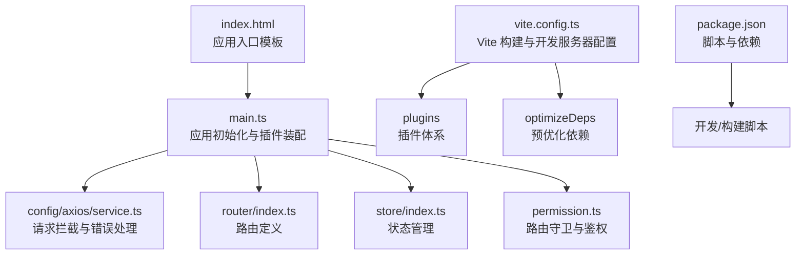
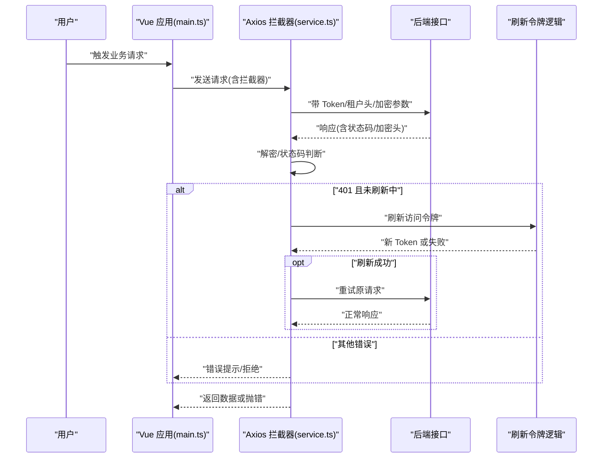
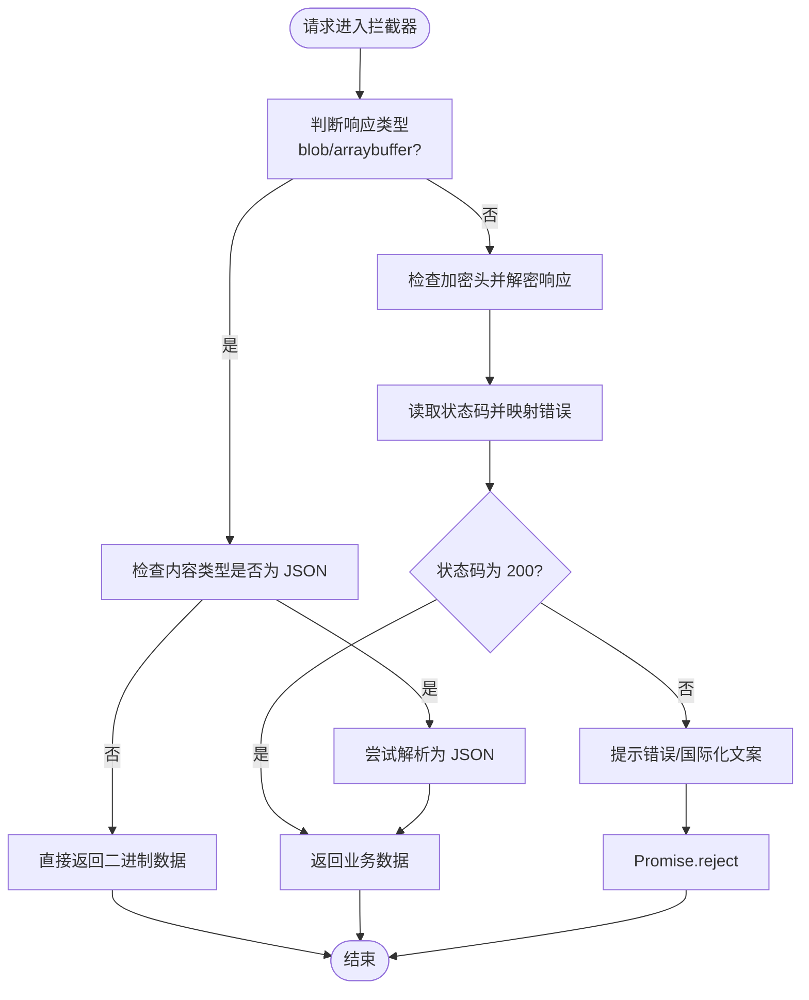
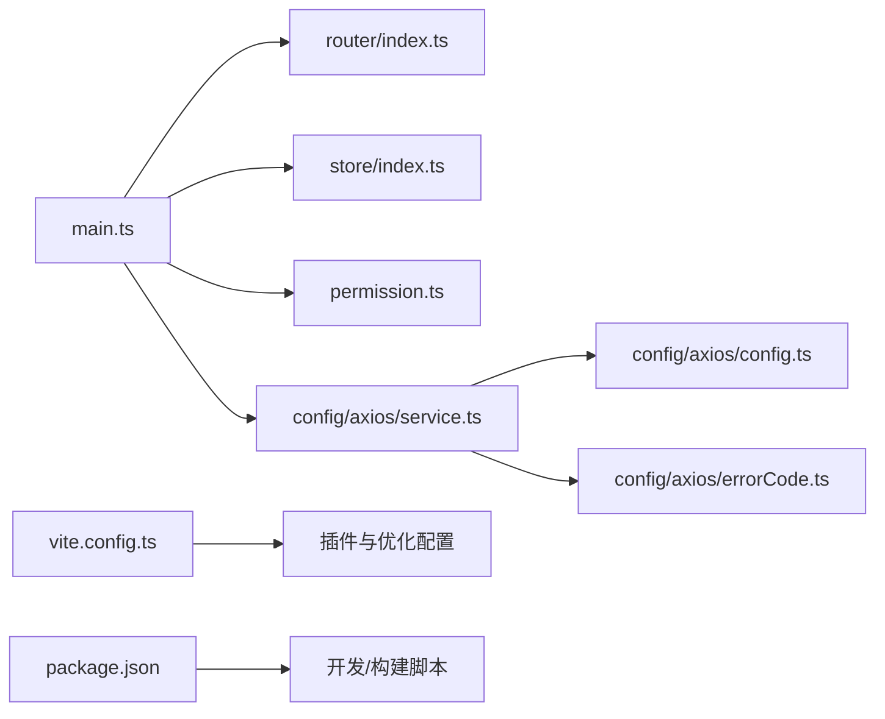

# 前端问题排查

<cite>
**本文引用的文件**
- [package.json](file://yudao-ui/yudao-ui-admin-vue3/package.json)
- [vite.config.ts](file://yudao-ui/yudao-ui-admin-vue3/vite.config.ts)
- [index.html](file://yudao-ui/yudao-ui-admin-vue3/index.html)
- [main.ts](file://yudao-ui/yudao-ui-admin-vue3/src/main.ts)
- [config.ts](file://yudao-ui/yudao-ui-admin-vue3/src/config/axios/config.ts)
- [service.ts](file://yudao-ui/yudao-ui-admin-vue3/src/config/axios/service.ts)
- [errorCode.ts](file://yudao-ui/yudao-ui-admin-vue3/src/config/axios/errorCode.ts)
- [permission.ts](file://yudao-ui/yudao-ui-admin-vue3/src/permission.ts)
- [Logger.ts](file://yudao-ui/yudao-ui-admin-vue3/src/utils/Logger.ts)
- [env.d.ts](file://yudao-ui/yudao-ui-admin-vue3/types/env.d.ts)
</cite>

## 目录
1. [简介](#简介)
2. [项目结构](#项目结构)
3. [核心组件](#核心组件)
4. [架构总览](#架构总览)
5. [详细组件分析](#详细组件分析)
6. [依赖关系分析](#依赖关系分析)
7. [性能考量](#性能考量)
8. [故障排查指南](#故障排查指南)
9. [结论](#结论)
10. [附录](#附录)

## 简介
本指南面向前端开发与运维人员，聚焦于在浏览器端运行与开发过程中常见的问题定位与解决方法，涵盖以下主题：
- 浏览器兼容性问题（不同浏览器的差异处理）
- 网络请求错误（CORS 跨域、请求超时、响应格式错误）
- 组件渲染问题（组件加载失败、样式冲突、事件绑定异常）
- 使用浏览器开发者工具进行调试（网络面板分析、控制台错误查看、元素检查、性能分析）
- Vite 构建问题排查（依赖安装失败、热更新异常、打包错误）

同时结合本仓库的配置与实现，给出可操作的定位步骤与修复建议。

## 项目结构
该前端工程采用 Vue 3 + Vite 8 + TypeScript 技术栈，核心入口为 HTML 模板与应用挂载点，Axios 封装统一处理请求与鉴权，路由守卫负责鉴权与动态路由注入，构建配置集中于 Vite，脚本通过包管理器统一管理。

图表来源
- [index.html:1-152](file://yudao-ui/yudao-ui-admin-vue3/index.html#L1-L152)
- [main.ts:1-92](file://yudao-ui/yudao-ui-admin-vue3/src/main.ts#L1-L92)
- [service.ts:1-272](file://yudao-ui/yudao-ui-admin-vue3/src/config/axios/service.ts#L1-L272)
- [permission.ts:1-79](file://yudao-ui/yudao-ui-admin-vue3/src/permission.ts#L1-L79)
- [vite.config.ts:1-102](file://yudao-ui/yudao-ui-admin-vue3/vite.config.ts#L1-L102)
- [package.json:1-158](file://yudao-ui/yudao-ui-admin-vue3/package.json#L1-L158)

章节来源
- [package.json:1-158](file://yudao-ui/yudao-ui-admin-vue3/package.json#L1-L158)
- [vite.config.ts:1-102](file://yudao-ui/yudao-ui-admin-vue3/vite.config.ts#L1-L102)
- [index.html:1-152](file://yudao-ui/yudao-ui-admin-vue3/index.html#L1-L152)
- [main.ts:1-92](file://yudao-ui/yudao-ui-admin-vue3/src/main.ts#L1-L92)

## 核心组件
- 应用入口与初始化
  - HTML 模板包含应用挂载点与加载动画，确保首屏体验与加载状态可见。
  - main.ts 中完成 i18n、状态管理、全局组件、UI 组件库、指令、路由、打印插件等初始化，并监听 Vite 预加载错误自动刷新。
- Axios 请求封装
  - 统一设置基础 URL、超时、默认头、参数序列化。
  - 请求拦截器处理 Token 注入、租户头、GET 缓存禁用、请求体加密。
  - 响应拦截器处理二进制数据、解密、状态码判断、401 刷新令牌、错误消息提示与国际化文案。
- 路由守卫与权限
  - beforeEach 校验 Token，拉取用户信息与动态路由，白名单放行，未登录重定向至登录页。
  - afterEach 更新页面标题、结束进度条与页面加载状态。
- 构建与开发服务器
  - Vite 配置包含开发服务器端口、自动打开、别名、CSS 预处理器注入、代码分割策略、依赖预优化等。
  - package.json 提供开发、构建、预览、清理、格式化、Lint 等脚本。

章节来源
- [index.html:1-152](file://yudao-ui/yudao-ui-admin-vue3/index.html#L1-L152)
- [main.ts:1-92](file://yudao-ui/yudao-ui-admin-vue3/src/main.ts#L1-L92)
- [config.ts:1-29](file://yudao-ui/yudao-ui-admin-vue3/src/config/axios/config.ts#L1-L29)
- [service.ts:1-272](file://yudao-ui/yudao-ui-admin-vue3/src/config/axios/service.ts#L1-L272)
- [permission.ts:1-79](file://yudao-ui/yudao-ui-admin-vue3/src/permission.ts#L1-L79)
- [vite.config.ts:1-102](file://yudao-ui/yudao-ui-admin-vue3/vite.config.ts#L1-L102)
- [package.json:1-158](file://yudao-ui/yudao-ui-admin-vue3/package.json#L1-L158)

## 架构总览
下图展示从浏览器发起请求到后端接口的整体流程，以及错误处理与刷新令牌的关键节点。

图表来源
- [main.ts:1-92](file://yudao-ui/yudao-ui-admin-vue3/src/main.ts#L1-L92)
- [service.ts:1-272](file://yudao-ui/yudao-ui-admin-vue3/src/config/axios/service.ts#L1-L272)
- [config.ts:1-29](file://yudao-ui/yudao-ui-admin-vue3/src/config/axios/config.ts#L1-L29)

## 详细组件分析

### 浏览器兼容性问题排查
- 关键点
  - 开发服务器配置允许通过 host 0.0.0.0 访问，便于多设备联调。
  - HTML 中包含 IE 兼容声明，有助于在旧版 IE 上避免非标准行为。
  - Vite 已默认面向现代浏览器，若需兼容旧版浏览器，可启用 Legacy 插件（已在 devDependencies 中提供）。
- 常见症状与定位
  - 页面空白或功能异常：检查控制台是否存在语法/API 不支持错误。
  - 样式错位：确认 SCSS 变量注入与 CSS Modules 使用是否正确。
- 修复建议
  - 在 Vite 配置中按需启用 Legacy 插件与 polyfill。
  - 使用 Babel/ESLint/Stylelint 确保目标浏览器兼容。
  - 对实验性 API 提供降级方案或条件加载。

章节来源
- [vite.config.ts:28-41](file://yudao-ui/yudao-ui-admin-vue3/vite.config.ts#L28-L41)
- [index.html:6-6](file://yudao-ui/yudao-ui-admin-vue3/index.html#L6-L6)

### 网络请求错误排查（CORS、超时、响应格式）
- 关键点
  - Axios 基础配置包含基础 URL、超时时间、默认 JSON 头、GET 缓存禁用、参数序列化。
  - 响应拦截器对二进制数据与加密响应进行特殊处理，状态码非 200 时统一提示。
  - 错误码映射集中管理，便于国际化提示。
- 常见症状与定位
  - CORS 跨域：浏览器 Network 面板查看预检请求与响应头，确认后端是否允许来源、方法、头字段。
  - 请求超时：检查请求拦截器中的超时配置与实际网络状况。
  - 响应格式错误：关注响应拦截器对 blob/arraybuffer 的处理与 JSON 解析分支。
- 修复建议
  - 后端开启对应来源的 CORS 放行，或在开发阶段通过反向代理统一处理。
  - 调整超时阈值以适配网络环境。
  - 明确接口返回类型，避免将 JSON 当下载入流处理。

图表来源
- [service.ts:108-239](file://yudao-ui/yudao-ui-admin-vue3/src/config/axios/service.ts#L108-L239)
- [config.ts:1-29](file://yudao-ui/yudao-ui-admin-vue3/src/config/axios/config.ts#L1-L29)
- [errorCode.ts:1-7](file://yudao-ui/yudao-ui-admin-vue3/src/config/axios/errorCode.ts#L1-L7)

章节来源
- [config.ts:1-29](file://yudao-ui/yudao-ui-admin-vue3/src/config/axios/config.ts#L1-L29)
- [service.ts:1-272](file://yudao-ui/yudao-ui-admin-vue3/src/config/axios/service.ts#L1-L272)
- [errorCode.ts:1-7](file://yudao-ui/yudao-ui-admin-vue3/src/config/axios/errorCode.ts#L1-L7)

### 组件渲染问题排查（加载失败、样式冲突、事件绑定）
- 关键点
  - main.ts 中统一注册全局组件、指令、插件与路由，确保组件可用性。
  - Vite 别名与扩展解析简化导入路径，减少相对路径导致的加载失败。
  - 预加载错误自动刷新，缓解构建产物变更后的缓存问题。
- 常见症状与定位
  - 组件加载失败：检查控制台是否有模块解析错误或 404。
  - 样式冲突：检查 SCSS 变量注入顺序与作用域，避免全局污染。
  - 事件绑定异常：确认事件修饰符、作用域与生命周期钩子使用是否正确。
- 修复建议
  - 使用别名导入，避免深层相对路径。
  - 优先使用 CSS Modules 或命名空间隔离样式。
  - 在组件生命周期内注册事件，避免重复绑定。

章节来源
- [main.ts:1-92](file://yudao-ui/yudao-ui-admin-vue3/src/main.ts#L1-L92)
- [vite.config.ts:67-75](file://yudao-ui/yudao-ui-admin-vue3/vite.config.ts#L67-L75)
- [index.html:136-149](file://yudao-ui/yudao-ui-admin-vue3/index.html#L136-L149)

### Vite 构建问题排查（依赖安装、热更新、打包）
- 关键点
  - package.json 提供多环境构建脚本与预览命令。
  - Vite 配置包含依赖预优化、代码分割策略、压缩选项与 sourcemap 控制。
  - main.ts 监听 Vite 预加载错误事件，自动刷新页面。
- 常见症状与定位
  - 依赖安装失败：检查 Node/PNPM 版本要求与网络环境。
  - 热更新异常：检查端口占用、host 配置与浏览器缓存。
  - 打包错误：关注依赖预优化失败、代码分割分组与压缩日志。
- 修复建议
  - 按 engines 要求升级 Node/PNPM，清理缓存后重装依赖。
  - 更换端口或关闭占用进程，禁用浏览器缓存再测试。
  - 分析打包体积与分组策略，必要时调整 optimizeDeps.include/exclude。

章节来源
- [package.json:1-158](file://yudao-ui/yudao-ui-admin-vue3/package.json#L1-L158)
- [vite.config.ts:1-102](file://yudao-ui/yudao-ui-admin-vue3/vite.config.ts#L1-L102)
- [main.ts:50-54](file://yudao-ui/yudao-ui-admin-vue3/src/main.ts#L50-L54)

## 依赖关系分析
- 应用层依赖
  - main.ts 依赖路由、状态管理、指令、插件与国际化等模块。
  - permission.ts 依赖路由、用户与权限 Store，用于动态注入路由。
- 网络层依赖
  - service.ts 依赖 config.ts、errorCode.ts、工具类与 Element Plus 提示组件。
- 构建层依赖
  - vite.config.ts 依赖插件工厂与优化分组配置。
  - package.json 依赖脚本与开发/生产依赖集合。

图表来源
- [main.ts:1-92](file://yudao-ui/yudao-ui-admin-vue3/src/main.ts#L1-L92)
- [permission.ts:1-79](file://yudao-ui/yudao-ui-admin-vue3/src/permission.ts#L1-L79)
- [service.ts:1-272](file://yudao-ui/yudao-ui-admin-vue3/src/config/axios/service.ts#L1-L272)
- [config.ts:1-29](file://yudao-ui/yudao-ui-admin-vue3/src/config/axios/config.ts#L1-L29)
- [errorCode.ts:1-7](file://yudao-ui/yudao-ui-admin-vue3/src/config/axios/errorCode.ts#L1-L7)
- [vite.config.ts:1-102](file://yudao-ui/yudao-ui-admin-vue3/vite.config.ts#L1-L102)
- [package.json:1-158](file://yudao-ui/yudao-ui-admin-vue3/package.json#L1-L158)

章节来源
- [main.ts:1-92](file://yudao-ui/yudao-ui-admin-vue3/src/main.ts#L1-L92)
- [permission.ts:1-79](file://yudao-ui/yudao-ui-admin-vue3/src/permission.ts#L1-L79)
- [service.ts:1-272](file://yudao-ui/yudao-ui-admin-vue3/src/config/axios/service.ts#L1-L272)
- [config.ts:1-29](file://yudao-ui/yudao-ui-admin-vue3/src/config/axios/config.ts#L1-L29)
- [errorCode.ts:1-7](file://yudao-ui/yudao-ui-admin-vue3/src/config/axios/errorCode.ts#L1-L7)
- [vite.config.ts:1-102](file://yudao-ui/yudao-ui-admin-vue3/vite.config.ts#L1-L102)
- [package.json:1-158](file://yudao-ui/yudao-ui-admin-vue3/package.json#L1-L158)

## 性能考量
- 代码分割与懒加载
  - Vite Rollup 输出分组策略将大依赖拆分为独立块，降低首屏体积。
- 依赖预优化
  - optimizeDeps.include/exclude 减少冷启动时间，提升开发体验。
- 压缩与 SourceMap
  - Terser 压缩与可选的内联 SourceMap 便于调试与体积控制。
- 进度与加载状态
  - 路由守卫集成 NProgress 与页面加载状态，改善感知性能。

章节来源
- [vite.config.ts:76-98](file://yudao-ui/yudao-ui-admin-vue3/vite.config.ts#L76-L98)
- [permission.ts:13-15](file://yudao-ui/yudao-ui-admin-vue3/src/permission.ts#L13-L15)

## 故障排查指南

### 一、浏览器兼容性问题
- 症状
  - 控制台报语法错误或 API 不存在。
  - 页面布局异常或交互失效。
- 步骤
  - 打开开发者工具，切换到 Console 查看具体错误堆栈。
  - 在 Network 面板确认资源加载是否完整。
  - 检查 HTML 的兼容性声明与 Vite 的目标浏览器范围。
- 修复
  - 在 Vite 配置中启用 Legacy 插件与 polyfill。
  - 使用 ESLint/Stylelint/Babel 保证目标兼容。

章节来源
- [vite.config.ts:28-41](file://yudao-ui/yudao-ui-admin-vue3/vite.config.ts#L28-L41)
- [index.html:6-6](file://yudao-ui/yudao-ui-admin-vue3/index.html#L6-L6)

### 二、网络请求错误（CORS、超时、响应格式）
- 症状
  - 预检失败、跨域被拒；请求超时；响应不是期望的数据结构。
- 步骤
  - 打开 Network 面板，筛选 XHR/Fetch，查看请求头与响应头。
  - 在 Console 查看错误信息，定位是超时还是状态码异常。
  - 检查 Axios 配置与拦截器逻辑。
- 修复
  - 后端开启 CORS 放行或通过代理统一处理。
  - 调整超时阈值，确保网络波动下的稳定性。
  - 明确接口返回类型，避免将 JSON 当作下载流处理。

章节来源
- [service.ts:225-239](file://yudao-ui/yudao-ui-admin-vue3/src/config/axios/service.ts#L225-L239)
- [config.ts:17-25](file://yudao-ui/yudao-ui-admin-vue3/src/config/axios/config.ts#L17-L25)

### 三、组件渲染问题（加载失败、样式冲突、事件绑定）
- 症状
  - 组件不显示或报模块解析错误；样式覆盖或闪烁；事件不触发。
- 步骤
  - 打开 Elements 面板检查 DOM 结构与样式来源。
  - 在 Console 查看模块加载错误与生命周期日志。
  - 检查 main.ts 中的全局注册顺序与别名导入。
- 修复
  - 使用别名导入，避免深层相对路径。
  - 使用 CSS Modules 或命名空间隔离样式。
  - 在正确的生命周期内注册事件，避免重复绑定。

章节来源
- [main.ts:1-92](file://yudao-ui/yudao-ui-admin-vue3/src/main.ts#L1-L92)
- [vite.config.ts:67-75](file://yudao-ui/yudao-ui-admin-vue3/vite.config.ts#L67-L75)

### 四、Vite 构建问题（依赖安装、热更新、打包）
- 症状
  - 安装失败、端口占用、热更新不生效、打包报错。
- 步骤
  - 检查 engines 要求与 Node/PNPM 版本。
  - 查看终端输出与 Vite 日志，定位预优化与压缩阶段错误。
  - 清理 node_modules/.vite 缓存后重试。
- 修复
  - 升级 Node/PNPM 至满足要求版本。
  - 更改端口或关闭占用进程，禁用浏览器缓存。
  - 调整 optimizeDeps.include/exclude 与 Rollup 分组策略。

章节来源
- [package.json:153-156](file://yudao-ui/yudao-ui-admin-vue3/package.json#L153-L156)
- [vite.config.ts:15-22](file://yudao-ui/yudao-ui-admin-vue3/vite.config.ts#L15-L22)
- [main.ts:50-54](file://yudao-ui/yudao-ui-admin-vue3/src/main.ts#L50-L54)

### 五、使用浏览器开发者工具进行调试
- 网络面板
  - 查看请求/响应头、状态码、耗时与资源大小。
  - 关注预检请求与跨域头是否正确。
- 控制台
  - 查看错误堆栈、警告与日志输出。
  - 使用 Logger 工具输出结构化日志，便于定位。
- 元素检查
  - 检查 DOM 结构、计算样式与伪元素。
  - 定位样式冲突与层级问题。
- 性能分析
  - 使用 Performance 面板记录首屏渲染与交互卡顿。
  - 结合 NProgress 与路由守卫观察页面切换耗时。

章节来源
- [Logger.ts:1-101](file://yudao-ui/yudao-ui-admin-vue3/src/utils/Logger.ts#L1-L101)
- [permission.ts:13-15](file://yudao-ui/yudao-ui-admin-vue3/src/permission.ts#L13-L15)

## 结论
本指南围绕浏览器兼容性、网络请求、组件渲染与 Vite 构建四类高频问题，提供了可落地的排查步骤与修复建议。结合项目中的 Axios 统一封装、路由守卫与 Vite 配置，能够快速定位并解决问题。建议在日常开发中：
- 建立统一的环境变量与配置规范；
- 使用标准化的错误处理与日志输出；
- 在 CI 中加入 Lint 与构建检查，降低回归风险。

## 附录
- 环境变量与脚本
  - 通过 env.d.ts 与 Vite 环境加载机制，确保运行时变量正确注入。
  - 使用 package.json 中的脚本进行开发、构建与预览，避免手工配置偏差。

章节来源
- [env.d.ts](file://yudao-ui/yudao-ui-admin-vue3/types/env.d.ts)
- [package.json:7-26](file://yudao-ui/yudao-ui-admin-vue3/package.json#L7-L26)
- [vite.config.ts:15-22](file://yudao-ui/yudao-ui-admin-vue3/vite.config.ts#L15-L22)