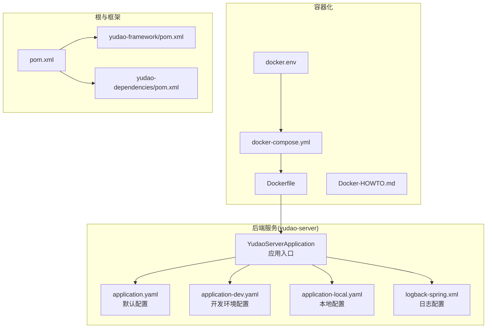
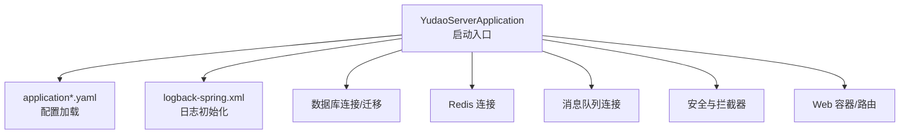
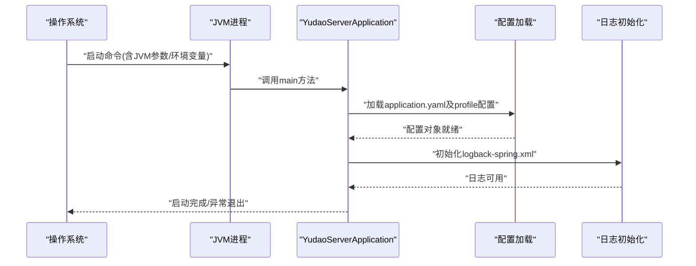
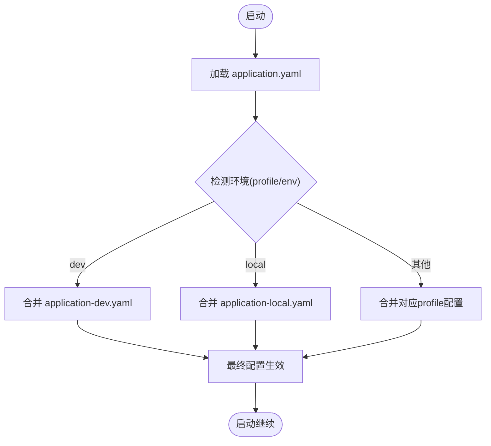
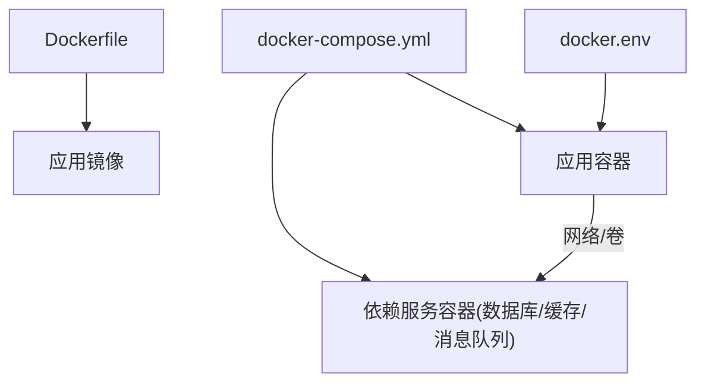
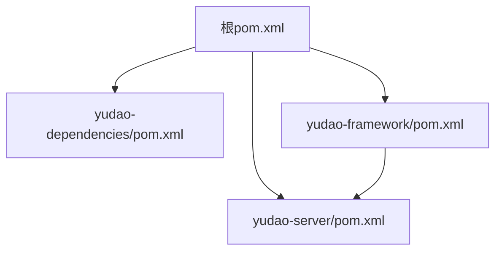

# 启动问题排查

<cite>
**本文引用的文件**
- [YudaoServerApplication.java](file://yudao-server/src/main/java/cn/iocoder/yudao/server/YudaoServerApplication.java)
- [application.yaml](file://yudao-server/src/main/resources/application.yaml)
- [application-dev.yaml](file://yudao-server/src/main/resources/application-dev.yaml)
- [application-local.yaml](file://yudao-server/src/main/resources/application-local.yaml)
- [logback-spring.xml](file://yudao-server/src/main/resources/logback-spring.xml)
- [Dockerfile](file://yudao-server/Dockerfile)
- [docker-compose.yml](file://script/docker/docker-compose.yml)
- [docker.env](file://script/docker/docker.env)
- [Docker-HOWTO.md](file://script/docker/Docker-HOWTO.md)
- [pom.xml](file://pom.xml)
- [yudao-server/pom.xml](file://yudao-server/pom.xml)
- [yudao-framework/pom.xml](file://yudao-framework/pom.xml)
- [yudao-dependencies/pom.xml](file://yudao-dependencies/pom.xml)
- [STARTUP.md](file://STARTUP.md)
- [README.md](file://README.md)
</cite>

## 目录
1. [简介](#简介)
2. [项目结构](#项目结构)
3. [核心组件](#核心组件)
4. [架构总览](#架构总览)
5. [详细组件分析](#详细组件分析)
6. [依赖分析](#依赖分析)
7. [性能考虑](#性能考虑)
8. [故障排查指南](#故障排查指南)
9. [结论](#结论)
10. [附录](#附录)

## 简介
本文件面向运维与开发人员，系统性梳理 Ruoyi-Vue-Pro 在不同环境下的启动问题排查方法，覆盖端口冲突、JVM 内存不足、配置文件错误、依赖缺失、Docker 容器启动异常等常见问题，并提供启动日志分析要点、关键日志节点解读、依赖加载顺序排查技巧以及各环境配置差异与注意事项。

## 项目结构
后端采用多模块 Maven 结构，核心服务位于 yudao-server 模块，包含 Spring Boot 应用入口类、默认配置与日志配置；前端为独立 Vue3 工程；脚本目录提供 Docker 编排与环境变量示例。

图示来源
- [YudaoServerApplication.java:1-200](file://yudao-server/src/main/java/cn/iocoder/yudao/server/YudaoServerApplication.java#L1-L200)
- [application.yaml:1-200](file://yudao-server/src/main/resources/application.yaml#L1-L200)
- [application-dev.yaml:1-200](file://yudao-server/src/main/resources/application-dev.yaml#L1-L200)
- [application-local.yaml:1-200](file://yudao-server/src/main/resources/application-local.yaml#L1-L200)
- [logback-spring.xml:1-200](file://yudao-server/src/main/resources/logback-spring.xml#L1-L200)
- [Dockerfile:1-200](file://yudao-server/Dockerfile#L1-L200)
- [docker-compose.yml:1-200](file://script/docker/docker-compose.yml#L1-L200)
- [docker.env:1-200](file://script/docker/docker.env#L1-L200)
- [Docker-HOWTO.md:1-200](file://script/docker/Docker-HOWTO.md#L1-L200)
- [pom.xml:1-200](file://pom.xml#L1-L200)
- [yudao-framework/pom.xml:1-200](file://yudao-framework/pom.xml#L1-L200)
- [yudao-dependencies/pom.xml:1-200](file://yudao-dependencies/pom.xml#L1-L200)

章节来源
- [YudaoServerApplication.java:1-200](file://yudao-server/src/main/java/cn/iocoder/yudao/server/YudaoServerApplication.java#L1-L200)
- [application.yaml:1-200](file://yudao-server/src/main/resources/application.yaml#L1-L200)
- [application-dev.yaml:1-200](file://yudao-server/src/main/resources/application-dev.yaml#L1-L200)
- [application-local.yaml:1-200](file://yudao-server/src/main/resources/application-local.yaml#L1-L200)
- [logback-spring.xml:1-200](file://yudao-server/src/main/resources/logback-spring.xml#L1-L200)
- [Dockerfile:1-200](file://yudao-server/Dockerfile#L1-L200)
- [docker-compose.yml:1-200](file://script/docker/docker-compose.yml#L1-L200)
- [docker.env:1-200](file://script/docker/docker.env#L1-L200)
- [Docker-HOWTO.md:1-200](file://script/docker/Docker-HOWTO.md#L1-L200)
- [pom.xml:1-200](file://pom.xml#L1-L200)
- [yudao-framework/pom.xml:1-200](file://yudao-framework/pom.xml#L1-L200)
- [yudao-dependencies/pom.xml:1-200](file://yudao-dependencies/pom.xml#L1-L200)

## 核心组件
- 应用入口：负责加载 Spring Boot 上下文、扫描组件与自动配置。
- 配置体系：application.yaml 提供通用默认值；application-dev.yaml 与 application-local.yaml 覆盖开发/本地环境差异化参数。
- 日志体系：logback-spring.xml 控制日志级别、输出格式与文件滚动策略。
- 容器化：Dockerfile 定义镜像构建步骤；docker-compose.yml 与 docker.env 组合定义服务编排与环境变量。

章节来源
- [YudaoServerApplication.java:1-200](file://yudao-server/src/main/java/cn/iocoder/yudao/server/YudaoServerApplication.java#L1-L200)
- [application.yaml:1-200](file://yudao-server/src/main/resources/application.yaml#L1-L200)
- [application-dev.yaml:1-200](file://yudao-server/src/main/resources/application-dev.yaml#L1-L200)
- [application-local.yaml:1-200](file://yudao-server/src/main/resources/application-local.yaml#L1-L200)
- [logback-spring.xml:1-200](file://yudao-server/src/main/resources/logback-spring.xml#L1-L200)
- [Dockerfile:1-200](file://yudao-server/Dockerfile#L1-L200)
- [docker-compose.yml:1-200](file://script/docker/docker-compose.yml#L1-L200)
- [docker.env:1-200](file://script/docker/docker.env#L1-L200)

## 架构总览
下图展示启动阶段的关键交互：应用入口加载配置与日志，随后初始化数据库连接、缓存、消息队列、安全与 Web 层等组件；容器化部署通过 Compose 将应用与依赖服务解耦并统一管理。

图示来源
- [YudaoServerApplication.java:1-200](file://yudao-server/src/main/java/cn/iocoder/yudao/server/YudaoServerApplication.java#L1-L200)
- [application.yaml:1-200](file://yudao-server/src/main/resources/application.yaml#L1-L200)
- [logback-spring.xml:1-200](file://yudao-server/src/main/resources/logback-spring.xml#L1-L200)

## 详细组件分析

### 应用入口与启动流程
- 入口类负责引导 Spring Boot 应用上下文，触发自动配置与组件扫描。
- 建议在启动前检查：JVM 参数、配置文件路径、环境变量是否正确注入。

图示来源
- [YudaoServerApplication.java:1-200](file://yudao-server/src/main/java/cn/iocoder/yudao/server/YudaoServerApplication.java#L1-L200)
- [application.yaml:1-200](file://yudao-server/src/main/resources/application.yaml#L1-L200)
- [logback-spring.xml:1-200](file://yudao-server/src/main/resources/logback-spring.xml#L1-L200)

章节来源
- [YudaoServerApplication.java:1-200](file://yudao-server/src/main/java/cn/iocoder/yudao/server/YudaoServerApplication.java#L1-L200)

### 配置文件与环境差异
- application.yaml：通用默认配置，建议仅保留不变或低风险项。
- application-dev.yaml：开发环境常用端口、数据库、Redis、消息队列等地址与凭据。
- application-local.yaml：本地开发可覆盖端口、日志级别、调试开关等。
- 环境选择：通过 Spring profiles 或环境变量指定 profile，确保与实际运行环境一致。

图示来源
- [application.yaml:1-200](file://yudao-server/src/main/resources/application.yaml#L1-L200)
- [application-dev.yaml:1-200](file://yudao-server/src/main/resources/application-dev.yaml#L1-L200)
- [application-local.yaml:1-200](file://yudao-server/src/main/resources/application-local.yaml#L1-L200)

章节来源
- [application.yaml:1-200](file://yudao-server/src/main/resources/application.yaml#L1-L200)
- [application-dev.yaml:1-200](file://yudao-server/src/main/resources/application-dev.yaml#L1-L200)
- [application-local.yaml:1-200](file://yudao-server/src/main/resources/application-local.yaml#L1-L200)

### 日志配置与关键节点
- logback-spring.xml 控制日志级别、输出目标与滚动策略。
- 关键日志节点：应用启动开始、Banner 输出、配置加载完成、数据库连接建立、缓存/消息队列连接、Web 容器启动完成、异常堆栈。
- 建议：在开发环境提高日志级别以快速定位问题，在生产环境保持合理级别避免日志风暴。

章节来源
- [logback-spring.xml:1-200](file://yudao-server/src/main/resources/logback-spring.xml#L1-L200)

### 容器化启动
- Dockerfile：定义基础镜像、工作目录、复制产物、暴露端口、健康检查与启动命令。
- docker-compose.yml：组合应用与依赖服务（如数据库、缓存、消息队列），统一网络与卷。
- docker.env：集中管理环境变量，避免硬编码。

图示来源
- [Dockerfile:1-200](file://yudao-server/Dockerfile#L1-L200)
- [docker-compose.yml:1-200](file://script/docker/docker-compose.yml#L1-L200)
- [docker.env:1-200](file://script/docker/docker.env#L1-L200)

章节来源
- [Dockerfile:1-200](file://yudao-server/Dockerfile#L1-L200)
- [docker-compose.yml:1-200](file://script/docker/docker-compose.yml#L1-L200)
- [docker.env:1-200](file://script/docker/docker.env#L1-L200)
- [Docker-HOWTO.md:1-200](file://script/docker/Docker-HOWTO.md#L1-L200)

## 依赖分析
- 根 pom.xml 管理聚合与版本控制。
- yudao-framework/pom.xml 定义框架模块集合与公共依赖。
- yudao-dependencies/pom.xml 使用 <dependencyManagement> 统一版本。
- yudao-server/pom.xml 作为具体应用模块，继承版本并引入所需 starter 与业务模块。

图示来源
- [pom.xml:1-200](file://pom.xml#L1-L200)
- [yudao-dependencies/pom.xml:1-200](file://yudao-dependencies/pom.xml#L1-L200)
- [yudao-framework/pom.xml:1-200](file://yudao-framework/pom.xml#L1-L200)
- [yudao-server/pom.xml:1-200](file://yudao-server/pom.xml#L1-L200)

章节来源
- [pom.xml:1-200](file://pom.xml#L1-L200)
- [yudao-dependencies/pom.xml:1-200](file://yudao-dependencies/pom.xml#L1-L200)
- [yudao-framework/pom.xml:1-200](file://yudao-framework/pom.xml#L1-L200)
- [yudao-server/pom.xml:1-200](file://yudao-server/pom.xml#L1-L200)

## 性能考虑
- JVM 内存：根据业务规模设置初始堆与最大堆，预留 GC 与线程栈空间。
- 并发与连接池：数据库连接池、Redis 连接池、线程池大小应结合压测结果调整。
- 启动优化：延迟初始化非关键 Bean、按需加载自动配置、减少冷启动 IO。

## 故障排查指南

### 1. 端口占用
- 现象：启动时报端口被占用或无法绑定。
- 排查步骤：
  - 确认 application.yaml 中 server.port 设置是否与其他进程冲突。
  - 使用系统工具检查端口占用并释放。
  - 如为容器部署，确认 docker-compose.yml 的端口映射未重复。
- 修复建议：
  - 修改端口或停止占用进程；容器场景调整映射端口。

章节来源
- [application.yaml:1-200](file://yudao-server/src/main/resources/application.yaml#L1-L200)
- [docker-compose.yml:1-200](file://script/docker/docker-compose.yml#L1-L200)

### 2. JVM 内存不足
- 现象：启动阶段 OOM 或启动缓慢。
- 排查步骤：
  - 检查 JVM 启动参数是否设置过小。
  - 查看容器资源限制是否过低。
- 修复建议：
  - 适当提高 Xms/Xmx；容器场景增加 memory limit。

章节来源
- [Dockerfile:1-200](file://yudao-server/Dockerfile#L1-L200)
- [docker-compose.yml:1-200](file://script/docker/docker-compose.yml#L1-L200)

### 3. 配置文件错误
- 现象：启动报配置解析错误、字段不存在或类型不匹配。
- 排查步骤：
  - 核对 application.yaml 及 profile 配置文件语法与缩进。
  - 确认敏感信息已通过环境变量或外部挂载正确注入。
  - 检查配置覆盖顺序是否符合预期。
- 修复建议：
  - 使用 IDE 或 YAML 校验工具修正；确保 profile 正确激活。

章节来源
- [application.yaml:1-200](file://yudao-server/src/main/resources/application.yaml#L1-L200)
- [application-dev.yaml:1-200](file://yudao-server/src/main/resources/application-dev.yaml#L1-L200)
- [application-local.yaml:1-200](file://yudao-server/src/main/resources/application-local.yaml#L1-L200)
- [docker.env:1-200](file://script/docker/docker.env#L1-L200)

### 4. 依赖缺失/版本冲突
- 现象：启动时报类找不到、方法签名不匹配或自动配置失败。
- 排查步骤：
  - 检查 yudao-server/pom.xml 是否引入必要 starter。
  - 使用 mvn dependency:tree 分析依赖树，排除冲突传递依赖。
  - 确认 yudao-dependencies 版本管理生效。
- 修复建议：
  - 显式声明兼容版本或排除冲突传递依赖；统一升级到受支持版本。

章节来源
- [yudao-server/pom.xml:1-200](file://yudao-server/pom.xml#L1-L200)
- [yudao-framework/pom.xml:1-200](file://yudao-framework/pom.xml#L1-L200)
- [yudao-dependencies/pom.xml:1-200](file://yudao-dependencies/pom.xml#L1-L200)
- [pom.xml:1-200](file://pom.xml#L1-L200)

### 5. 数据库连接失败
- 现象：启动报数据库连接超时、认证失败或驱动缺失。
- 排查步骤：
  - 核对 application.yaml 中数据库连接地址、端口、库名、用户名、密码。
  - 确认数据库服务可达且防火墙放行。
  - 检查驱动依赖是否齐全。
- 修复建议：
  - 修正连接参数；确保网络连通；补齐驱动依赖。

章节来源
- [application.yaml:1-200](file://yudao-server/src/main/resources/application.yaml#L1-L200)

### 6. 缓存/消息队列连接异常
- 现象：Redis/RabbitMQ/Kafka 连接失败或认证错误。
- 排查步骤：
  - 校验 application.yaml 中对应连接参数。
  - 确认依赖服务容器已随应用启动。
- 修复建议：
  - 修正连接参数；先启动依赖服务再启动应用。

章节来源
- [application.yaml:1-200](file://yudao-server/src/main/resources/application.yaml#L1-L200)
- [docker-compose.yml:1-200](file://script/docker/docker-compose.yml#L1-L200)

### 7. 启动日志分析方法
- 关键日志节点：
  - 应用启动开始与 Banner 输出
  - 配置文件加载与激活的 profile
  - 自动配置报告（包含启用/禁用的条件）
  - 数据源、缓存、消息队列连接建立
  - Web 容器启动完成
  - 异常堆栈与致命错误
- 分析技巧：
  - 开启 DEBUG/TRACE 以获取更细粒度日志
  - 使用日志切分与归档，避免磁盘压力
  - 生产环境优先关注 ERROR 级别

章节来源
- [logback-spring.xml:1-200](file://yudao-server/src/main/resources/logback-spring.xml#L1-L200)

### 8. 不同环境下的启动差异
- 开发环境（dev）：
  - 使用 application-dev.yaml，连接开发数据库与缓存。
  - 可开启调试与热重载相关配置。
- 本地环境（local）：
  - 使用 application-local.yaml，适合本机离线调试。
- 生产环境：
  - 通过环境变量注入敏感配置，避免硬编码。
  - 严格控制日志级别与监控指标。

章节来源
- [application-dev.yaml:1-200](file://yudao-server/src/main/resources/application-dev.yaml#L1-L200)
- [application-local.yaml:1-200](file://yudao-server/src/main/resources/application-local.yaml#L1-L200)
- [docker.env:1-200](file://script/docker/docker.env#L1-L200)

### 9. Docker 容器启动问题
- 镜像构建失败：
  - 检查 Dockerfile 语法与依赖下载网络。
  - 确认构建上下文中文件完整。
- 容器启动异常：
  - 查看容器日志；确认端口映射与主机冲突。
  - 校验 docker-compose.yml 服务依赖顺序与健康检查。
- 网络连接问题：
  - 确认容器间网络互通；检查防火墙与安全组。
  - 使用 docker inspect 查看网络配置。

章节来源
- [Dockerfile:1-200](file://yudao-server/Dockerfile#L1-L200)
- [docker-compose.yml:1-200](file://script/docker/docker-compose.yml#L1-L200)
- [docker.env:1-200](file://script/docker/docker.env#L1-L200)
- [Docker-HOWTO.md:1-200](file://script/docker/Docker-HOWTO.md#L1-L200)

## 结论
启动问题通常由配置、依赖、资源与网络四类因素导致。建议以“配置优先、依赖其次、资源保障、网络畅通”为排查主线，结合日志关键节点与容器编排工具进行定位与修复。生产环境务必通过环境变量与最小权限原则管理敏感配置，确保可观测与可恢复。

## 附录
- 快速检查清单：
  - 确认端口未被占用
  - 确认 JVM 内存参数合理
  - 确认配置文件语法与覆盖顺序正确
  - 确认依赖版本与传递依赖无冲突
  - 确认数据库/缓存/消息队列可达
  - 确认容器镜像构建成功、网络连通、健康检查通过
  - 确认日志级别与输出位置满足排查需求