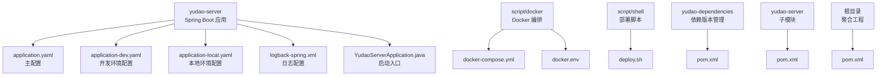
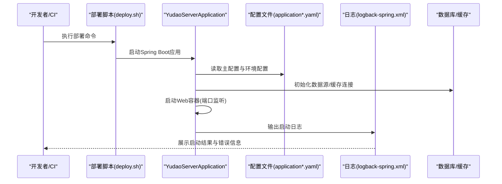
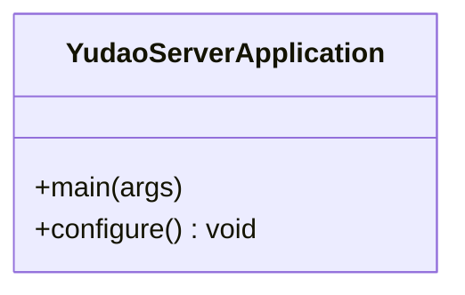
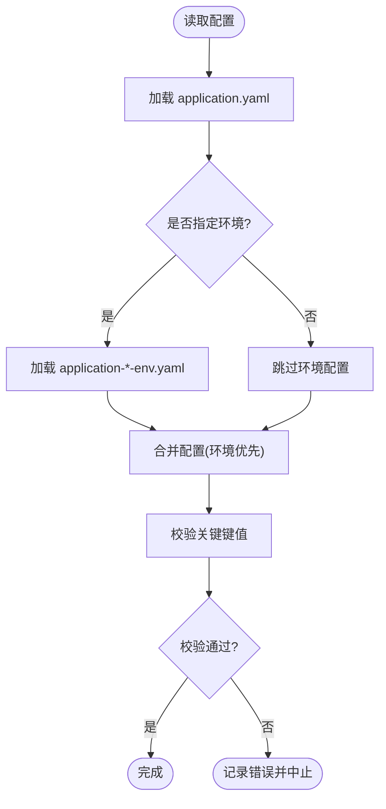
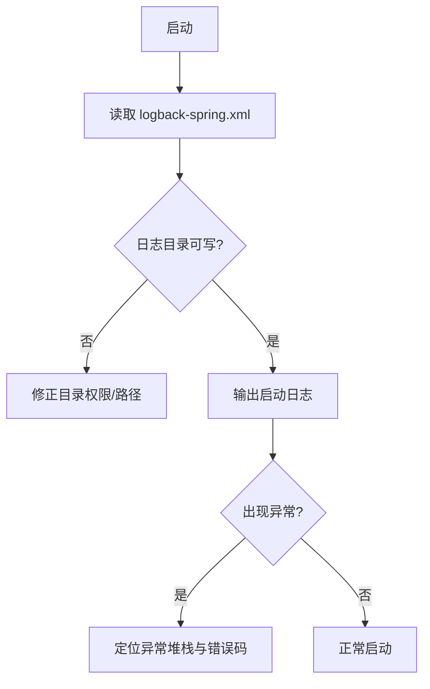
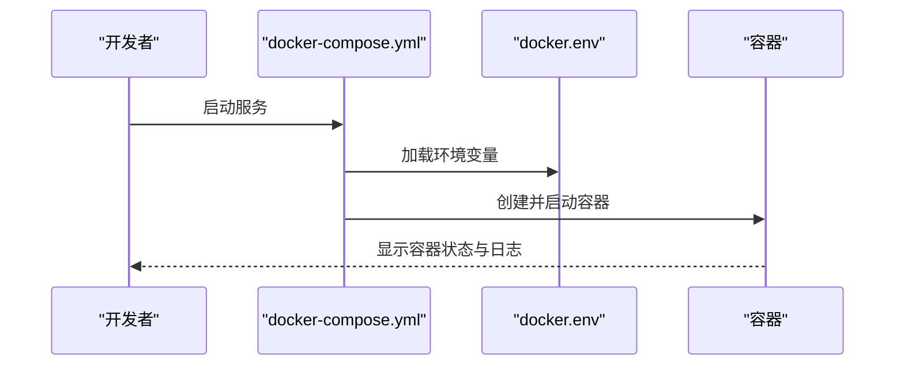
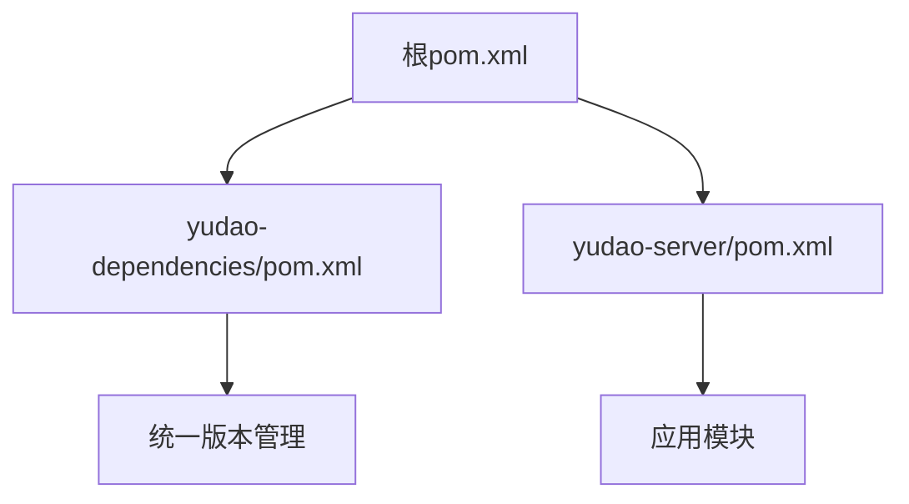

# 启动问题排查

<cite>
**本文引用的文件**
- [application.yaml](file://yudao-server/src/main/resources/application.yaml)
- [application-dev.yaml](file://yudao-server/src/main/resources/application-dev.yaml)
- [application-local.yaml](file://yudao-server/src/main/resources/application-local.yaml)
- [logback-spring.xml](file://yudao-server/src/main/resources/logback-spring.xml)
- [YudaoServerApplication.java](file://yudao-server/src/main/java/cn/iocoder/yudao/server/YudaoServerApplication.java)
- [docker-compose.yml](file://script/docker/docker-compose.yml)
- [docker.env](file://script/docker/docker.env)
- [Dockerfile](file://yudao-server/Dockerfile)
- [deploy.sh](file://script/shell/deploy.sh)
- [pom.xml](file://pom.xml)
- [yudao-server/pom.xml](file://yudao-server/pom.xml)
- [yudao-dependencies/pom.xml](file://yudao-dependencies/pom.xml)
</cite>

## 目录
1. [简介](#简介)
2. [项目结构](#项目结构)
3. [核心组件](#核心组件)
4. [架构总览](#架构总览)
5. [详细组件分析](#详细组件分析)
6. [依赖关系分析](#依赖关系分析)
7. [性能考虑](#性能考虑)
8. [故障排查指南](#故障排查指南)
9. [结论](#结论)
10. [附录](#附录)

## 简介
本指南面向RuoYi-Vue-Pro后端服务的启动问题排查，聚焦于常见的启动失败场景：端口占用（如8080）、数据库连接配置错误、JVM内存不足、依赖缺失、配置文件语法错误、环境变量设置不当、Docker容器启动异常等。文档提供系统化的诊断步骤、日志定位方法、启动参数调试技巧以及依赖版本兼容性检查建议，并通过图示帮助快速定位根因。

## 项目结构
后端采用多模块Maven工程，核心启动模块为yudao-server，包含Spring Boot入口类、配置文件与日志配置；脚本目录提供Docker编排与部署脚本；顶层pom统一管理依赖版本。

图表来源
- [YudaoServerApplication.java:1-200](file://yudao-server/src/main/java/cn/iocoder/yudao/server/YudaoServerApplication.java#L1-L200)
- [application.yaml:1-200](file://yudao-server/src/main/resources/application.yaml#L1-L200)
- [application-dev.yaml:1-200](file://yudao-server/src/main/resources/application-dev.yaml#L1-L200)
- [application-local.yaml:1-200](file://yudao-server/src/main/resources/application-local.yaml#L1-L200)
- [logback-spring.xml:1-200](file://yudao-server/src/main/resources/logback-spring.xml#L1-L200)
- [docker-compose.yml:1-200](file://script/docker/docker-compose.yml#L1-L200)
- [docker.env:1-200](file://script/docker/docker.env#L1-L200)
- [deploy.sh:1-200](file://script/shell/deploy.sh#L1-L200)
- [pom.xml:1-200](file://pom.xml#L1-L200)
- [yudao-dependencies/pom.xml:1-200](file://yudao-dependencies/pom.xml#L1-L200)
- [yudao-server/pom.xml:1-200](file://yudao-server/pom.xml#L1-L200)

章节来源
- [YudaoServerApplication.java:1-200](file://yudao-server/src/main/java/cn/iocoder/yudao/server/YudaoServerApplication.java#L1-L200)
- [application.yaml:1-200](file://yudao-server/src/main/resources/application.yaml#L1-L200)
- [pom.xml:1-200](file://pom.xml#L1-L200)

## 核心组件
- 启动入口类：负责加载Spring Boot上下文与自动配置，通常在启动阶段会读取配置文件并初始化数据库连接池、Web服务器等。
- 配置文件：application.yaml为主配置，application-dev.yaml与application-local.yaml用于不同环境覆盖；包含端口、数据库连接、Redis、日志级别等关键项。
- 日志配置：logback-spring.xml定义日志输出位置、格式与级别，便于定位启动异常。
- Docker编排：docker-compose.yml与docker.env定义容器网络、端口映射、环境变量与服务依赖。
- 部署脚本：deploy.sh提供一键构建与部署流程，便于复现与自动化排查。

章节来源
- [YudaoServerApplication.java:1-200](file://yudao-server/src/main/java/cn/iocoder/yudao/server/YudaoServerApplication.java#L1-L200)
- [application.yaml:1-200](file://yudao-server/src/main/resources/application.yaml#L1-L200)
- [application-dev.yaml:1-200](file://yudao-server/src/main/resources/application-dev.yaml#L1-L200)
- [application-local.yaml:1-200](file://yudao-server/src/main/resources/application-local.yaml#L1-L200)
- [logback-spring.xml:1-200](file://yudao-server/src/main/resources/logback-spring.xml#L1-L200)
- [docker-compose.yml:1-200](file://script/docker/docker-compose.yml#L1-L200)
- [docker.env:1-200](file://script/docker/docker.env#L1-L200)
- [deploy.sh:1-200](file://script/shell/deploy.sh#L1-L200)

## 架构总览
下图展示启动阶段的关键交互：客户端/脚本触发启动，Spring Boot加载配置与自动配置，初始化数据库与缓存，最后启动Web容器对外提供服务。

图表来源
- [YudaoServerApplication.java:1-200](file://yudao-server/src/main/java/cn/iocoder/yudao/server/YudaoServerApplication.java#L1-L200)
- [application.yaml:1-200](file://yudao-server/src/main/resources/application.yaml#L1-L200)
- [logback-spring.xml:1-200](file://yudao-server/src/main/resources/logback-spring.xml#L1-L200)

## 详细组件分析

### 启动入口类分析
- 职责：作为Spring Boot应用的启动入口，负责加载配置、扫描组件与启动Web容器。
- 关注点：启动异常通常由配置加载失败、Bean初始化失败或端口占用导致。
- 建议：开启详细日志，优先查看启动阶段的异常堆栈与致命错误。

图表来源
- [YudaoServerApplication.java:1-200](file://yudao-server/src/main/java/cn/iocoder/yudao/server/YudaoServerApplication.java#L1-L200)

章节来源
- [YudaoServerApplication.java:1-200](file://yudao-server/src/main/java/cn/iocoder/yudao/server/YudaoServerApplication.java#L1-L200)

### 配置文件分析
- application.yaml：主配置，包含端口、数据库连接、Redis、日志级别等。
- application-dev.yaml / application-local.yaml：环境覆盖配置，优先级高于主配置。
- 常见问题：端口重复、数据库URL/凭据错误、Redis地址不可达、日志路径无权限。

图表来源
- [application.yaml:1-200](file://yudao-server/src/main/resources/application.yaml#L1-L200)
- [application-dev.yaml:1-200](file://yudao-server/src/main/resources/application-dev.yaml#L1-L200)
- [application-local.yaml:1-200](file://yudao-server/src/main/resources/application-local.yaml#L1-L200)

章节来源
- [application.yaml:1-200](file://yudao-server/src/main/resources/application.yaml#L1-L200)
- [application-dev.yaml:1-200](file://yudao-server/src/main/resources/application-dev.yaml#L1-L200)
- [application-local.yaml:1-200](file://yudao-server/src/main/resources/application-local.yaml#L1-L200)

### 日志配置分析
- logback-spring.xml：定义日志输出位置、滚动策略与级别，启动异常日志通常在此可见。
- 建议：在启动失败时优先查看该文件配置的日志目录与文件名，确认权限与磁盘空间。

图表来源
- [logback-spring.xml:1-200](file://yudao-server/src/main/resources/logback-spring.xml#L1-L200)

章节来源
- [logback-spring.xml:1-200](file://yudao-server/src/main/resources/logback-spring.xml#L1-L200)

### Docker编排分析
- docker-compose.yml：定义服务、端口映射、卷挂载与环境变量。
- docker.env：集中存放环境变量，避免硬编码。
- 常见问题：端口冲突、镜像拉取失败、网络不通、卷权限不足。

图表来源
- [docker-compose.yml:1-200](file://script/docker/docker-compose.yml#L1-L200)
- [docker.env:1-200](file://script/docker/docker.env#L1-L200)

章节来源
- [docker-compose.yml:1-200](file://script/docker/docker-compose.yml#L1-L200)
- [docker.env:1-200](file://script/docker/docker.env#L1-L200)

## 依赖关系分析
- 顶层pom聚合所有模块，yudao-dependencies统一管理依赖版本，yudao-server为具体应用模块。
- 启动失败可能由传递依赖缺失或版本冲突引起，需结合Maven仓库与依赖树进行排查。

图表来源
- [pom.xml:1-200](file://pom.xml#L1-L200)
- [yudao-dependencies/pom.xml:1-200](file://yudao-dependencies/pom.xml#L1-L200)
- [yudao-server/pom.xml:1-200](file://yudao-server/pom.xml#L1-L200)

章节来源
- [pom.xml:1-200](file://pom.xml#L1-L200)
- [yudao-dependencies/pom.xml:1-200](file://yudao-dependencies/pom.xml#L1-L200)
- [yudao-server/pom.xml:1-200](file://yudao-server/pom.xml#L1-L200)

## 性能考虑
- JVM内存：启动阶段需要充足堆内存以完成类加载与初始化，可通过JVM参数调优。
- 并发与线程：数据库连接池大小、Web线程数应与硬件资源匹配，避免启动后OOM或连接超时。
- 依赖加载：排除不必要的传递依赖，减少启动时间与内存占用。

## 故障排查指南

### 一、端口占用冲突（8080）
- 现象
  - 启动时报端口被占用或无法绑定到8080。
- 诊断步骤
  - 查看配置文件中的server.port设置，确认是否为8080。
  - 使用系统命令查询占用8080的进程并终止。
  - 如需修改端口，在配置文件中调整server.port或通过环境变量覆盖。
- 解决方案
  - 修改配置文件中的端口号。
  - 在Docker环境中通过docker-compose.yml调整端口映射。
- 相关文件
  - [application.yaml:1-200](file://yudao-server/src/main/resources/application.yaml#L1-L200)
  - [application-dev.yaml:1-200](file://yudao-server/src/main/resources/application-dev.yaml#L1-L200)
  - [application-local.yaml:1-200](file://yudao-server/src/main/resources/application-local.yaml#L1-L200)
  - [docker-compose.yml:1-200](file://script/docker/docker-compose.yml#L1-L200)

章节来源
- [application.yaml:1-200](file://yudao-server/src/main/resources/application.yaml#L1-L200)
- [application-dev.yaml:1-200](file://yudao-server/src/main/resources/application-dev.yaml#L1-L200)
- [application-local.yaml:1-200](file://yudao-server/src/main/resources/application-local.yaml#L1-L200)
- [docker-compose.yml:1-200](file://script/docker/docker-compose.yml#L1-L200)

### 二、数据库连接配置错误
- 现象
  - 启动阶段报数据库连接失败、驱动找不到或认证失败。
- 诊断步骤
  - 检查数据库URL、用户名、密码是否正确。
  - 确认数据库服务可达且防火墙放行。
  - 校验数据库驱动依赖是否存在。
- 解决方案
  - 修正application.yaml中的数据库配置。
  - 在yudao-dependencies中确保驱动版本兼容。
- 相关文件
  - [application.yaml:1-200](file://yudao-server/src/main/resources/application.yaml#L1-L200)
  - [yudao-dependencies/pom.xml:1-200](file://yudao-dependencies/pom.xml#L1-L200)
  - [pom.xml:1-200](file://pom.xml#L1-L200)

章节来源
- [application.yaml:1-200](file://yudao-server/src/main/resources/application.yaml#L1-L200)
- [yudao-dependencies/pom.xml:1-200](file://yudao-dependencies/pom.xml#L1-L200)
- [pom.xml:1-200](file://pom.xml#L1-L200)

### 三、JVM内存不足
- 现象
  - 启动过程中出现内存溢出或初始化失败。
- 诊断步骤
  - 查看启动日志中的内存相关错误。
  - 检查JVM启动参数是否合理。
- 解决方案
  - 调整JVM堆大小参数。
  - 减少不必要的依赖或优化类加载。
- 相关文件
  - [YudaoServerApplication.java:1-200](file://yudao-server/src/main/java/cn/iocoder/yudao/server/YudaoServerApplication.java#L1-L200)

章节来源
- [YudaoServerApplication.java:1-200](file://yudao-server/src/main/java/cn/iocoder/yudao/server/YudaoServerApplication.java#L1-L200)

### 四、依赖包缺失
- 现象
  - 启动时报类找不到或依赖解析失败。
- 诊断步骤
  - 清理本地Maven仓库缓存，重新下载依赖。
  - 检查yudao-dependencies与yudao-server的pom依赖声明。
- 解决方案
  - 执行Maven清理与重新构建。
  - 确保yudao-dependencies版本管理生效。
- 相关文件
  - [pom.xml:1-200](file://pom.xml#L1-L200)
  - [yudao-dependencies/pom.xml:1-200](file://yudao-dependencies/pom.xml#L1-L200)
  - [yudao-server/pom.xml:1-200](file://yudao-server/pom.xml#L1-L200)

章节来源
- [pom.xml:1-200](file://pom.xml#L1-L200)
- [yudao-dependencies/pom.xml:1-200](file://yudao-dependencies/pom.xml#L1-L200)
- [yudao-server/pom.xml:1-200](file://yudao-server/pom.xml#L1-L200)

### 五、配置文件语法错误
- 现象
  - 启动阶段直接退出或抛出配置解析异常。
- 诊断步骤
  - 使用YAML校验工具检查application*.yaml语法。
  - 逐段注释定位问题段落。
- 解决方案
  - 修复缩进、特殊字符与类型不匹配问题。
- 相关文件
  - [application.yaml:1-200](file://yudao-server/src/main/resources/application.yaml#L1-L200)
  - [application-dev.yaml:1-200](file://yudao-server/src/main/resources/application-dev.yaml#L1-L200)
  - [application-local.yaml:1-200](file://yudao-server/src/main/resources/application-local.yaml#L1-L200)

章节来源
- [application.yaml:1-200](file://yudao-server/src/main/resources/application.yaml#L1-L200)
- [application-dev.yaml:1-200](file://yudao-server/src/main/resources/application-dev.yaml#L1-L200)
- [application-local.yaml:1-200](file://yudao-server/src/main/resources/application-local.yaml#L1-L200)

### 六、环境变量设置
- 现象
  - Docker容器内无法读取期望的环境变量，导致连接串或端口错误。
- 诊断步骤
  - 检查docker.env中的变量是否完整。
  - 在容器内执行命令查看实际注入的变量。
- 解决方案
  - 补充缺失变量或修正拼写。
- 相关文件
  - [docker.env:1-200](file://script/docker/docker.env#L1-L200)
  - [docker-compose.yml:1-200](file://script/docker/docker-compose.yml#L1-L200)

章节来源
- [docker.env:1-200](file://script/docker/docker.env#L1-L200)
- [docker-compose.yml:1-200](file://script/docker/docker-compose.yml#L1-L200)

### 七、Docker容器启动异常
- 现象
  - 容器启动即退出或健康检查失败。
- 诊断步骤
  - 查看容器日志，定位启动阶段的致命错误。
  - 检查端口映射、卷挂载与网络配置。
- 解决方案
  - 修正端口冲突与卷权限。
  - 确保依赖服务（数据库、缓存）已就绪。
- 相关文件
  - [docker-compose.yml:1-200](file://script/docker/docker-compose.yml#L1-L200)
  - [docker.env:1-200](file://script/docker/docker.env#L1-L200)
  - [Dockerfile:1-200](file://yudao-server/Dockerfile#L1-L200)

章节来源
- [docker-compose.yml:1-200](file://script/docker/docker-compose.yml#L1-L200)
- [docker.env:1-200](file://script/docker/docker.env#L1-L200)
- [Dockerfile:1-200](file://yudao-server/Dockerfile#L1-L200)

### 八、日志文件位置查找与启动参数调试
- 日志位置
  - 参考logback-spring.xml中定义的日志目录与文件名。
- 启动参数
  - 在启动脚本或Docker中追加调试参数，如详细日志级别与JVM参数。
- 相关文件
  - [logback-spring.xml:1-200](file://yudao-server/src/main/resources/logback-spring.xml#L1-L200)
  - [deploy.sh:1-200](file://script/shell/deploy.sh#L1-L200)

章节来源
- [logback-spring.xml:1-200](file://yudao-server/src/main/resources/logback-spring.xml#L1-L200)
- [deploy.sh:1-200](file://script/shell/deploy.sh#L1-L200)

### 九、依赖版本兼容性检查
- 方法
  - 使用Maven命令生成依赖树，检查冲突与缺失。
  - 在yudao-dependencies中核对关键组件版本。
- 相关文件
  - [pom.xml:1-200](file://pom.xml#L1-L200)
  - [yudao-dependencies/pom.xml:1-200](file://yudao-dependencies/pom.xml#L1-L200)

章节来源
- [pom.xml:1-200](file://pom.xml#L1-L200)
- [yudao-dependencies/pom.xml:1-200](file://yudao-dependencies/pom.xml#L1-L200)

## 结论
启动问题通常集中在配置、端口、数据库与依赖四个方面。建议按“配置→端口→数据库→依赖”的顺序逐项验证，并结合日志与Docker容器状态进行定位。通过规范的环境变量管理与版本控制，可显著降低启动失败概率。

## 附录
- 快速检查清单
  - 确认server.port未被占用
  - 校验application*.yaml语法与键值
  - 检查数据库连通性与凭据
  - 确认Maven依赖完整与版本兼容
  - 查看logback日志输出位置与权限
  - 在Docker中核对端口映射与卷权限