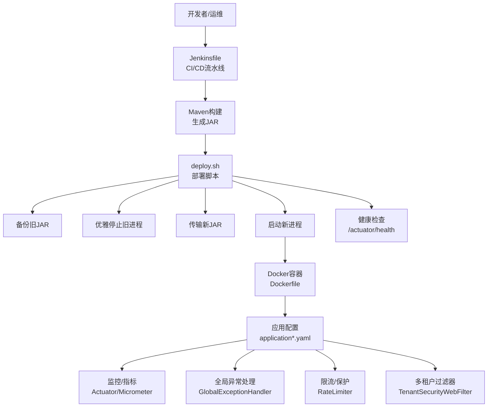
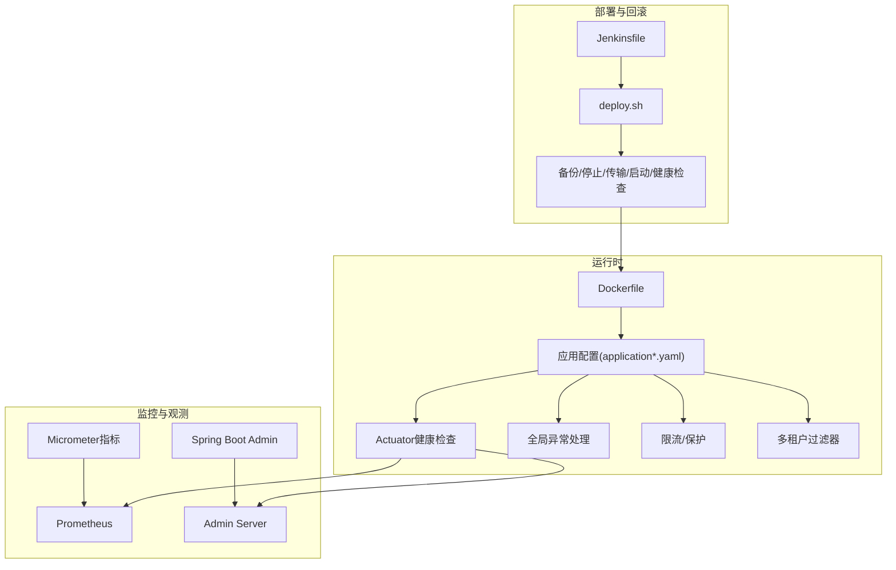
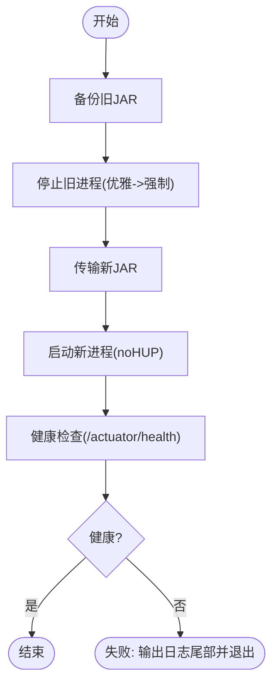
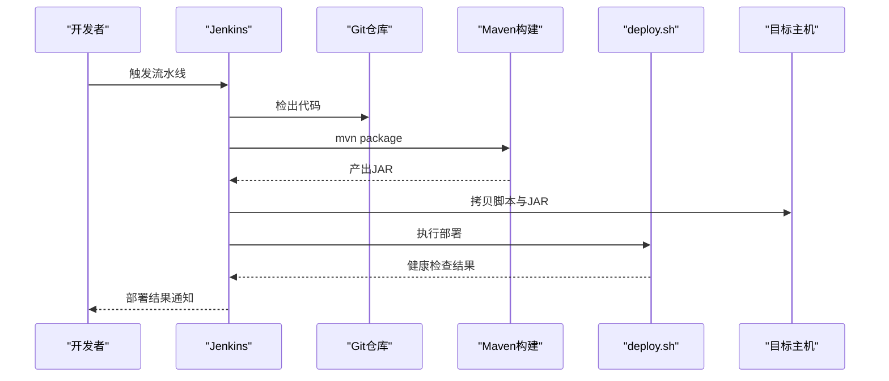
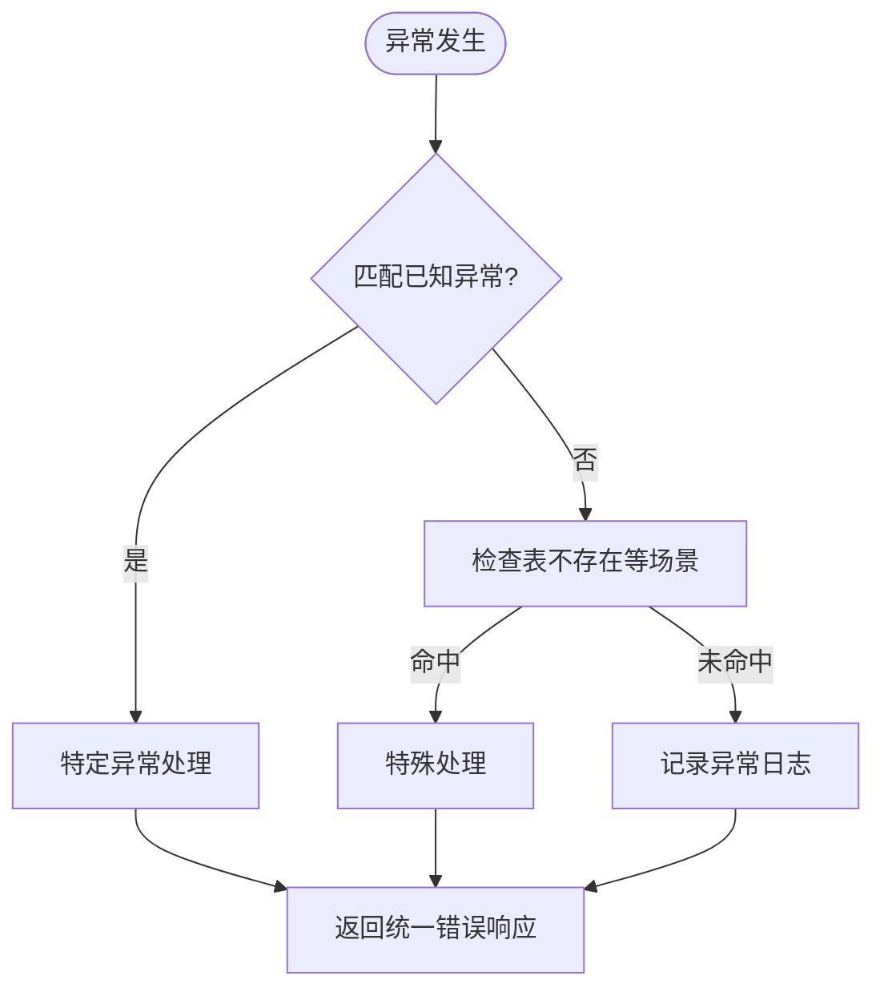
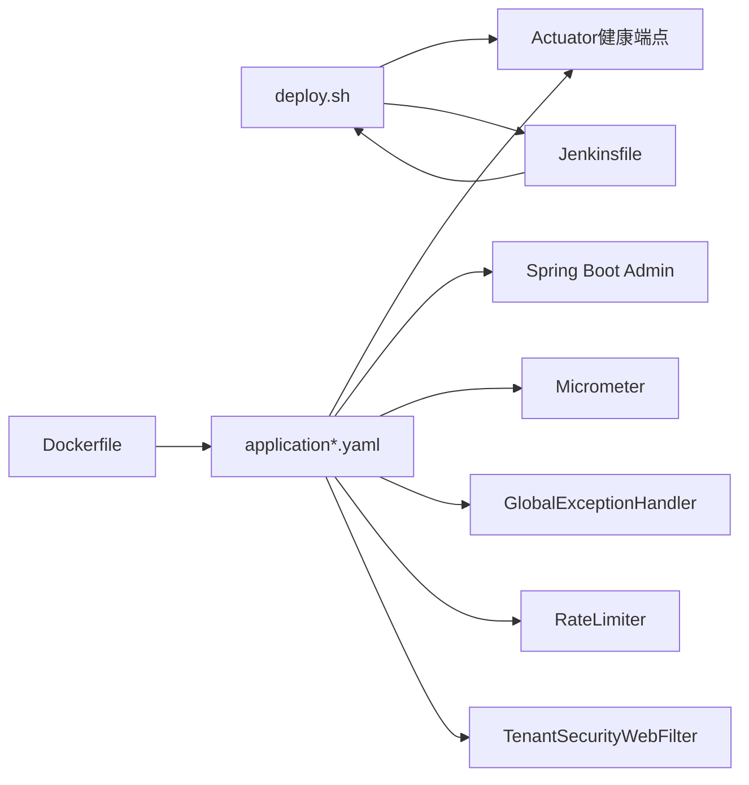

# 应急响应处理

<cite>
**本文引用的文件**   
- [deploy.sh](file://script/shell/deploy.sh)
- [Jenkinsfile](file://script/jenkins/Jenkinsfile)
- [Dockerfile](file://yudao-server/Dockerfile)
- [application.yaml](file://yudao-server/src/main/resources/application.yaml)
- [application-dev.yaml](file://yudao-server/src/main/resources/application-dev.yaml)
- [GlobalExceptionHandler.java](file://yudao-framework/yudao-spring-boot-starter-web/src/main/java/cn/iocoder/yudao/framework/web/core/handler/GlobalExceptionHandler.java)
- [YudaoMetricsAutoConfiguration.java](file://yudao-framework/yudao-spring-boot-starter-monitor/src/main/java/cn/iocoder/yudao/framework/tracer/config/YudaoMetricsAutoConfiguration.java)
- [YudaoRateLimiterConfiguration.java](file://yudao-framework/yudao-spring-boot-starter-protection/src/main/java/cn/iocoder/yudao/framework/ratelimiter/config/YudaoRateLimiterConfiguration.java)
- [YudaoTenantAutoConfiguration.java](file://yudao-framework/yudao-spring-boot-starter-biz-tenant/src/main/java/cn/iocoder/yudao/framework/tenant/config/YudaoTenantAutoConfiguration.java)
- [WebFilterOrderEnum.java](file://yudao-framework/yudao-common/src/main/java/cn/iocoder/yudao/framework/common/enums/WebFilterOrderEnum.java)
- [README.md](file://README.md)
- [README.md](file://yudao-ui/yudao-ui-admin-vue3/README.md)
- [README.md](file://sql/tools/README.md)
</cite>

## 目录
1. [简介](#简介)
2. [项目结构](#项目结构)
3. [核心组件](#核心组件)
4. [架构总览](#架构总览)
5. [详细组件分析](#详细组件分析)
6. [依赖分析](#依赖分析)
7. [性能考虑](#性能考虑)
8. [故障排查指南](#故障排查指南)
9. [结论](#结论)
10. [附录](#附录)

## 简介
本文件面向生产环境的应急响应与运维保障，结合仓库中的部署脚本、容器化配置、监控与健康检查、全局异常处理、限流与多租户过滤器等能力，制定标准化的应急处理预案，覆盖紧急回滚、流量降级、服务重启、数据恢复等关键动作，并明确不同故障类型的优先级与处置策略，配套自动化工具与流程规范，确保在系统崩溃、数据库宕机、网络中断、安全攻击等紧急情况下能够快速、有序地恢复业务。

## 项目结构
围绕应急响应的关键文件与职责划分如下：
- 部署与回滚自动化：shell 部署脚本负责备份、停止、传输、启动与健康检查
- CI/CD 集成：Jenkinsfile 定义构建与部署流水线
- 容器化运行：Dockerfile 定义镜像与启动参数
- 配置与健康检查：application.yaml 与 application-dev.yaml 提供 Actuator 健康端点与监控配置
- 运行时保障：全局异常处理器、指标与限流、多租户过滤器等
- 灾备与数据库工具：sql/tools 提供多数据库快速启动与初始化指引

**图表来源**
- [Jenkinsfile:29-59](file://script/jenkins/Jenkinsfile#L29-L59)
- [deploy.sh:146-158](file://script/shell/deploy.sh#L146-L158)
- [Dockerfile:1-24](file://yudao-server/Dockerfile#L1-L24)
- [application.yaml:124-145](file://yudao-server/src/main/resources/application.yaml#L124-L145)
- [application-dev.yaml:124-145](file://yudao-server/src/main/resources/application-dev.yaml#L124-L145)
- [GlobalExceptionHandler.java:317-353](file://yudao-framework/yudao-spring-boot-starter-web/src/main/java/cn/iocoder/yudao/framework/web/core/handler/GlobalExceptionHandler.java#L317-L353)
- [YudaoRateLimiterConfiguration.java:30-55](file://yudao-framework/yudao-spring-boot-starter-protection/src/main/java/cn/iocoder/yudao/framework/ratelimiter/config/YudaoRateLimiterConfiguration.java#L30-L55)
- [YudaoTenantAutoConfiguration.java:112-124](file://yudao-framework/yudao-spring-boot-starter-biz-tenant/src/main/java/cn/iocoder/yudao/framework/tenant/config/YudaoTenantAutoConfiguration.java#L112-L124)

**章节来源**
- [Jenkinsfile:29-59](file://script/jenkins/Jenkinsfile#L29-L59)
- [deploy.sh:146-158](file://script/shell/deploy.sh#L146-L158)
- [Dockerfile:1-24](file://yudao-server/Dockerfile#L1-L24)
- [application.yaml:124-145](file://yudao-server/src/main/resources/application.yaml#L124-L145)
- [application-dev.yaml:124-145](file://yudao-server/src/main/resources/application-dev.yaml#L124-L145)

## 核心组件
- 部署与回滚自动化
  - 备份：保留旧版本 JAR，便于一键回滚
  - 停止：优雅关闭（15信号）并等待，超时强制终止（9信号）
  - 传输：将新 JAR 拷贝到目标路径
  - 启动：设置 JVM 参数与环境变量，nohup 后台启动
  - 健康检查：轮询 Actuator 健康端点，超时失败并输出日志尾部
- CI/CD 集成
  - Jenkinsfile 定义检出、构建、部署阶段，自动拷贝脚本与 JAR 并执行部署
- 容器化运行
  - Dockerfile 固定 JRE 基础镜像、设置时区与 JAVA_OPTS、暴露端口并 CMD 启动
- 运行时保障
  - 全局异常处理：统一捕获并记录异常，插入错误日志，返回标准错误响应
  - 指标与监控：Micrometer + Actuator 暴露指标，Spring Boot Admin 客户端注册
  - 限流与保护：多种 KeyResolver 支持按用户、客户端 IP、表达式等维度限流
  - 多租户过滤器：在安全过滤器之后执行，保证租户上下文与访问控制
- 灾备与数据库工具
  - sql/tools 提供多数据库快速启动与初始化脚本，便于灾备演练与恢复验证

**章节来源**
- [deploy.sh:28-158](file://script/shell/deploy.sh#L28-L158)
- [Jenkinsfile:29-59](file://script/jenkins/Jenkinsfile#L29-L59)
- [Dockerfile:1-24](file://yudao-server/Dockerfile#L1-L24)
- [application.yaml:124-145](file://yudao-server/src/main/resources/application.yaml#L124-L145)
- [application-dev.yaml:124-145](file://yudao-server/src/main/resources/application-dev.yaml#L124-L145)
- [GlobalExceptionHandler.java:317-353](file://yudao-framework/yudao-spring-boot-starter-web/src/main/java/cn/iocoder/yudao/framework/web/core/handler/GlobalExceptionHandler.java#L317-L353)
- [YudaoRateLimiterConfiguration.java:30-55](file://yudao-framework/yudao-spring-boot-starter-protection/src/main/java/cn/iocoder/yudao/framework/ratelimiter/config/YudaoRateLimiterConfiguration.java#L30-L55)
- [YudaoTenantAutoConfiguration.java:112-124](file://yudao-framework/yudao-spring-boot-starter-biz-tenant/src/main/java/cn/iocoder/yudao/framework/tenant/config/YudaoTenantAutoConfiguration.java#L112-L124)
- [README.md:1-62](file://sql/tools/README.md#L1-L62)

## 架构总览
应急响应体系以“自动化部署脚本 + CI/CD + 容器化 + 健康检查 + 监控告警 + 全局异常处理 + 限流保护 + 多租户隔离”为核心，形成闭环的生产级应急处置能力。

**图表来源**
- [Jenkinsfile:29-59](file://script/jenkins/Jenkinsfile#L29-L59)
- [deploy.sh:146-158](file://script/shell/deploy.sh#L146-L158)
- [Dockerfile:1-24](file://yudao-server/Dockerfile#L1-L24)
- [application.yaml:124-145](file://yudao-server/src/main/resources/application.yaml#L124-L145)
- [application-dev.yaml:124-145](file://yudao-server/src/main/resources/application-dev.yaml#L124-L145)
- [YudaoMetricsAutoConfiguration.java:16-27](file://yudao-framework/yudao-spring-boot-starter-monitor/src/main/java/cn/iocoder/yudao/framework/tracer/config/YudaoMetricsAutoConfiguration.java#L16-L27)

## 详细组件分析

### 部署与回滚自动化（deploy.sh）
- 备份：若存在旧 JAR，复制到 backup 目录并以时间戳命名
- 停止：查找 PID，先优雅关闭（15），等待最多 120 秒；仍存活则强制终止（9）
- 传输：删除旧 JAR，复制新 JAR 至目标路径
- 启动：设置 JVM 参数与 JAVA_AGENT，nohup 后台启动
- 健康检查：轮询 /actuator/health，超时失败并输出日志尾部；未配置健康检查则等待固定时间并输出日志

**图表来源**
- [deploy.sh:28-158](file://script/shell/deploy.sh#L28-L158)

**章节来源**
- [deploy.sh:28-158](file://script/shell/deploy.sh#L28-L158)

### CI/CD 集成（Jenkinsfile）
- 阶段：检出 → 构建 → 部署
- 部署步骤：复制脚本与 JAR，赋予执行权限，执行部署脚本
- 环境变量：包含镜像仓库、凭证 ID、部署路径等

**图表来源**
- [Jenkinsfile:29-59](file://script/jenkins/Jenkinsfile#L29-L59)
- [deploy.sh:146-158](file://script/shell/deploy.sh#L146-L158)

**章节来源**
- [Jenkinsfile:29-59](file://script/jenkins/Jenkinsfile#L29-L59)

### 容器化运行（Dockerfile）
- 基础镜像：Eclipse Temurin 21 JRE
- 工作目录与 JAR：复制 JAR 到 /yudao-server/app.jar
- 环境变量：时区、JAVA_OPTS、ARGS
- 端口：暴露 48080
- CMD：启动 Java 应用

**章节来源**
- [Dockerfile:1-24](file://yudao-server/Dockerfile#L1-L24)

### 健康检查与监控（application.yaml 与 application-dev.yaml）
- Actuator：开放所有端点，根路径 /actuator
- Spring Boot Admin：客户端注册到 Admin Server
- Micrometer：公共标签 application=应用名
- 开发环境：Actuator 暴露范围更广，便于调试

**章节来源**
- [application.yaml:124-145](file://yudao-server/src/main/resources/application.yaml#L124-L145)
- [application-dev.yaml:124-145](file://yudao-server/src/main/resources/application-dev.yaml#L124-L145)
- [YudaoMetricsAutoConfiguration.java:16-27](file://yudao-framework/yudao-spring-boot-starter-monitor/src/main/java/cn/iocoder/yudao/framework/tracer/config/YudaoMetricsAutoConfiguration.java#L16-L27)

### 全局异常处理（GlobalExceptionHandler）
- 统一捕获各类异常，记录异常日志并插入 API 错误日志
- 对特定异常（如表不存在）做特殊处理
- 默认异常返回统一错误响应

**图表来源**
- [GlobalExceptionHandler.java:95-118](file://yudao-framework/yudao-spring-boot-starter-web/src/main/java/cn/iocoder/yudao/framework/web/core/handler/GlobalExceptionHandler.java#L95-L118)
- [GlobalExceptionHandler.java:317-353](file://yudao-framework/yudao-spring-boot-starter-web/src/main/java/cn/iocoder/yudao/framework/web/core/handler/GlobalExceptionHandler.java#L317-L353)

**章节来源**
- [GlobalExceptionHandler.java:95-118](file://yudao-framework/yudao-spring-boot-starter-web/src/main/java/cn/iocoder/yudao/framework/web/core/handler/GlobalExceptionHandler.java#L95-L118)
- [GlobalExceptionHandler.java:317-353](file://yudao-framework/yudao-spring-boot-starter-web/src/main/java/cn/iocoder/yudao/framework/web/core/handler/GlobalExceptionHandler.java#L317-L353)

### 限流与保护（YudaoRateLimiterConfiguration）
- 提供多种 KeyResolver，支持按用户、客户端 IP、表达式等维度进行限流
- 与 Redis 或注解配合，实现细粒度的流量治理

**章节来源**
- [YudaoRateLimiterConfiguration.java:30-55](file://yudao-framework/yudao-spring-boot-starter-protection/src/main/java/cn/iocoder/yudao/framework/ratelimiter/config/YudaoRateLimiterConfiguration.java#L30-L55)

### 多租户过滤器（YudaoTenantAutoConfiguration）
- 在安全过滤器之后执行，保证租户上下文与访问控制
- 通过过滤器注册与顺序枚举，确保执行顺序符合预期

**章节来源**
- [YudaoTenantAutoConfiguration.java:112-124](file://yudao-framework/yudao-spring-boot-starter-biz-tenant/src/main/java/cn/iocoder/yudao/framework/tenant/config/YudaoTenantAutoConfiguration.java#L112-L124)
- [WebFilterOrderEnum.java:10-36](file://yudao-framework/yudao-common/src/main/java/cn/iocoder/yudao/framework/common/enums/WebFilterOrderEnum.java#L10-L36)

### 灾备与数据库工具（sql/tools）
- 基于 Docker Compose 快速启动 MySQL、Oracle、PostgreSQL、SQL Server、达梦等数据库
- 部分数据库需手动执行初始化脚本，便于灾备演练与恢复验证

**章节来源**
- [README.md:1-62](file://sql/tools/README.md#L1-L62)

## 依赖分析
- 组件耦合
  - deploy.sh 依赖 application-dev.yaml 的 Actuator 配置与端口
  - Jenkinsfile 依赖 deploy.sh 的执行与目标主机路径
  - Dockerfile 与 application.yaml 共同决定容器运行时行为
  - 全局异常处理与健康检查共同构成可观测性闭环
- 外部依赖
  - Actuator、Micrometer、Spring Boot Admin、Redis、数据库、消息中间件等

**图表来源**
- [deploy.sh:146-158](file://script/shell/deploy.sh#L146-L158)
- [Jenkinsfile:29-59](file://script/jenkins/Jenkinsfile#L29-L59)
- [Dockerfile:1-24](file://yudao-server/Dockerfile#L1-L24)
- [application.yaml:124-145](file://yudao-server/src/main/resources/application.yaml#L124-L145)
- [application-dev.yaml:124-145](file://yudao-server/src/main/resources/application-dev.yaml#L124-L145)
- [GlobalExceptionHandler.java:317-353](file://yudao-framework/yudao-spring-boot-starter-web/src/main/java/cn/iocoder/yudao/framework/web/core/handler/GlobalExceptionHandler.java#L317-L353)
- [YudaoRateLimiterConfiguration.java:30-55](file://yudao-framework/yudao-spring-boot-starter-protection/src/main/java/cn/iocoder/yudao/framework/ratelimiter/config/YudaoRateLimiterConfiguration.java#L30-L55)
- [YudaoTenantAutoConfiguration.java:112-124](file://yudao-framework/yudao-spring-boot-starter-biz-tenant/src/main/java/cn/iocoder/yudao/framework/tenant/config/YudaoTenantAutoConfiguration.java#L112-L124)

## 性能考虑
- 健康检查轮询间隔与超时时间应根据实例规模与网络状况调整，避免误判
- JVM 参数与容器资源限制需与实际负载匹配，防止 OOM 与 GC 抖动
- 限流策略应覆盖热点接口与来源，避免雪崩效应
- 多租户过滤器与全局异常处理的顺序与开销需关注，避免影响请求延迟

## 故障排查指南

### 系统崩溃（进程无法启动/频繁重启）
- 检查健康检查失败原因：查看日志尾部与 Actuator 健康状态
- 核对 JVM 参数与容器资源限制
- 使用一键回滚：恢复上一个可用版本 JAR

**章节来源**
- [deploy.sh:106-143](file://script/shell/deploy.sh#L106-L143)
- [Dockerfile:13-14](file://yudao-server/Dockerfile#L13-L14)

### 数据库宕机（连接池耗尽/慢查询）
- 查看 Druid 监控页面与慢 SQL 记录
- 检查数据库连接参数与连接池配置
- 评估读写分离与从库切换策略

**章节来源**
- [application-dev.yaml:14-57](file://yudao-server/src/main/resources/application-dev.yaml#L14-L57)

### 网络中断（外部依赖不可达）
- 检查消息队列、缓存、第三方 API 的连通性
- 启用降级策略：短路、熔断、本地缓存兜底
- 使用限流保护，避免级联故障

**章节来源**
- [YudaoRateLimiterConfiguration.java:30-55](file://yudao-framework/yudao-spring-boot-starter-protection/src/main/java/cn/iocoder/yudao/framework/ratelimiter/config/YudaoRateLimiterConfiguration.java#L30-L55)

### 安全攻击（DDoS、暴力破解、SQL 注入）
- 启用限流与黑白名单
- 多租户过滤器与安全过滤器顺序正确
- 全局异常处理记录并上报异常日志

**章节来源**
- [YudaoTenantAutoConfiguration.java:112-124](file://yudao-framework/yudao-spring-boot-starter-biz-tenant/src/main/java/cn/iocoder/yudao/framework/tenant/config/YudaoTenantAutoConfiguration.java#L112-L124)
- [WebFilterOrderEnum.java:10-36](file://yudao-framework/yudao-common/src/main/java/cn/iocoder/yudao/framework/common/enums/WebFilterOrderEnum.java#L10-L36)
- [GlobalExceptionHandler.java:317-353](file://yudao-framework/yudao-spring-boot-starter-web/src/main/java/cn/iocoder/yudao/framework/web/core/handler/GlobalExceptionHandler.java#L317-L353)

### 一键回滚与自动重启
- 一键回滚：利用备份目录中的旧版本 JAR，执行停止与传输后启动
- 自动重启：健康检查失败时，脚本输出日志尾部并退出，便于人工介入或进一步自动化

**章节来源**
- [deploy.sh:28-58](file://script/shell/deploy.sh#L28-L58)
- [deploy.sh:146-158](file://script/shell/deploy.sh#L146-L158)

### 问题上报与跟踪流程
- 发现：通过健康检查、监控告警、日志分析定位
- 报告：记录异常类型、影响范围、时间线与处理人
- 处理：按优先级执行回滚、降级、扩容或修复
- 验证：确认健康检查通过、指标恢复正常
- 总结：沉淀经验，完善应急预案与演练

## 结论
通过将部署脚本、CI/CD、容器化、健康检查、监控、全局异常处理、限流与多租户过滤器整合为统一的应急响应体系，能够在生产环境中实现快速、可控、可追溯的故障处置。建议定期演练不同故障场景，持续优化健康检查与限流策略，确保业务连续性与用户体验。

## 附录

### 应急处置优先级与策略
- P0（业务完全不可用）：立即回滚至上一个稳定版本，启用降级与限流，排查数据库/网络/安全
- P1（部分功能异常）：隔离受影响模块，启用降级与限流，修复后验证
- P2（性能退化）：优化慢查询与连接池，增加资源或限流
- P3（轻微异常）：观察与记录，必要时优化

### 自动化工具与脚本清单
- 部署与回滚：deploy.sh
- CI/CD：Jenkinsfile
- 容器化：Dockerfile
- 健康检查：/actuator/health
- 监控：Micrometer + Actuator + Spring Boot Admin
- 全局异常处理：GlobalExceptionHandler
- 限流保护：YudaoRateLimiterConfiguration
- 多租户过滤器：YudaoTenantAutoConfiguration

**章节来源**
- [deploy.sh:106-143](file://script/shell/deploy.sh#L106-L143)
- [application.yaml:124-145](file://yudao-server/src/main/resources/application.yaml#L124-L145)
- [application-dev.yaml:124-145](file://yudao-server/src/main/resources/application-dev.yaml#L124-L145)
- [README.md:203-222](file://README.md#L203-L222)
- [README.md:171-190](file://yudao-ui/yudao-ui-admin-vue3/README.md#L171-L190)