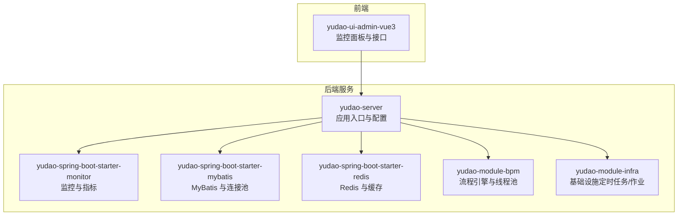
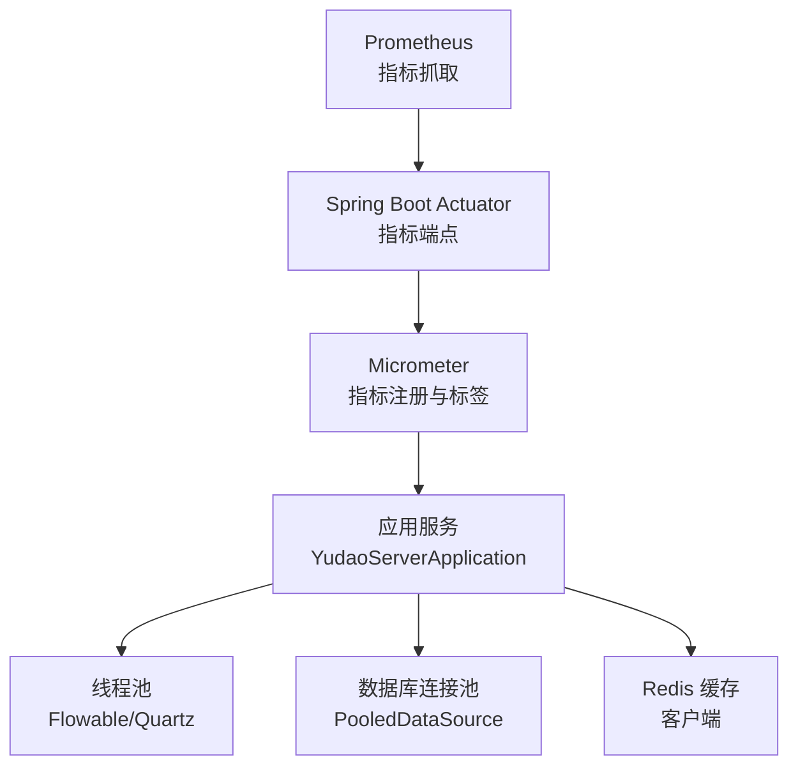
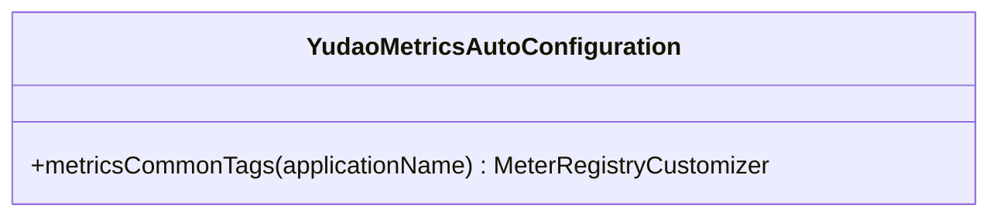
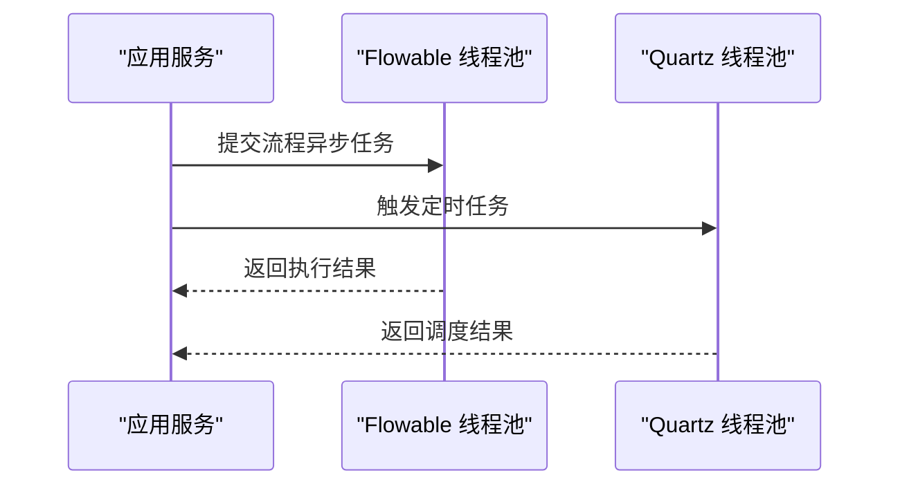
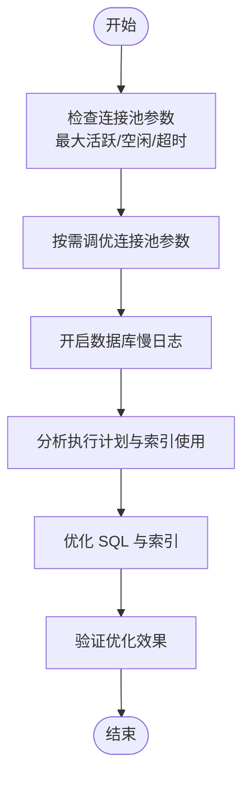
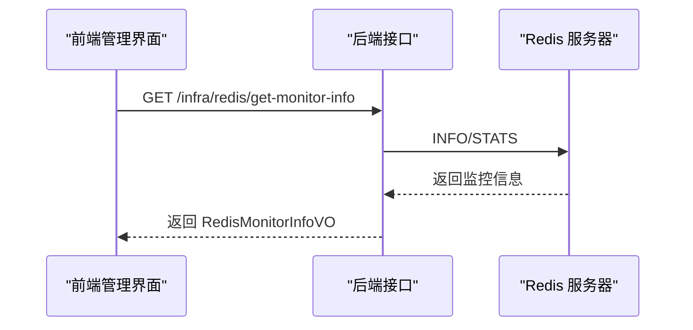
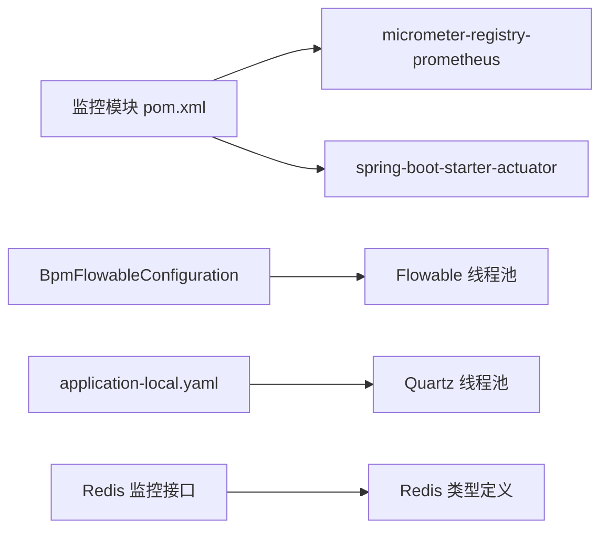

# 性能问题排查

<cite>
**本文引用的文件**
- [YudaoMetricsAutoConfiguration.java](file://yudao-framework/yudao-spring-boot-starter-monitor/src/main/java/cn/iocoder/yudao/framework/tracer/config/YudaoMetricsAutoConfiguration.java)
- [pom.xml（监控模块）](file://yudao-framework/yudao-spring-boot-starter-monitor/pom.xml)
- [BpmFlowableConfiguration.java](file://yudao-module-bpm/src/main/java/cn/iocoder/yudao/module/bpm/framework/flowable/config/BpmFlowableConfiguration.java)
- [application-local.yaml](file://yudao-server/src/main/resources/application-local.yaml)
- [AbstractEngineConfiguration.java](file://sql/dm/flowable-patch/src/main/java/org/flowable/common/engine/impl/AbstractEngineConfiguration.java)
- [DmDatabase.java](file://sql/dm/flowable-patch/src/main/java/liquibase/database/core/DmDatabase.java)
- [index.ts（Redis 监控接口）](file://yudao-ui/yudao-ui-admin-vue3/src/api/infra/redis/index.ts)
- [types.ts（Redis 监控类型定义）](file://yudao-ui/yudao-ui-admin-vue3/src/api/infra/redis/types.ts)
- [《芋道 Spring Boot 监控端点 Actuator 入门》.md](file://yudao-framework/yudao-spring-boot-starter-monitor/《芋道 Spring Boot 监控端点 Actuator 入门》.md)
- [《芋道 Spring Boot 数据库连接池入门》.md](file://yudao-framework/yudao-spring-boot-starter-mybatis/《芋道 Spring Boot 数据库连接池入门》.md)
- [《芋道 Spring Boot Cache 入门》.md](file://yudao-framework/yudao-spring-boot-starter-redis/《芋道 Spring Boot Cache 入门》.md)
</cite>

## 目录
1. [简介](#简介)
2. [项目结构](#项目结构)
3. [核心组件](#核心组件)
4. [架构总览](#架构总览)
5. [详细组件分析](#详细组件分析)
6. [依赖关系分析](#依赖关系分析)
7. [性能考量与优化建议](#性能考量与优化建议)
8. [故障排查指南](#故障排查指南)
9. [结论](#结论)
10. [附录](#附录)

## 简介
本指南聚焦于应用在生产环境中的性能问题排查与优化，围绕以下目标展开：
- 内存泄漏检测：结合 JVM 监控工具对堆内存使用进行分析与定位
- CPU 占用过高：通过线程分析与热点方法识别定位瓶颈
- 数据库慢查询：基于 SQL 执行计划与索引策略进行优化
- 指标采集与分析：利用 Micrometer 与 Prometheus 收集响应时间、吞吐量、并发数等关键指标
- 缓存命中率优化、连接池与线程池参数调优：给出可落地的实践案例

## 项目结构
本项目采用多模块分层设计，监控与性能相关能力主要分布在如下模块：
- yudao-framework：通用框架与基础设施，包含监控、链路追踪、消息队列、Redis、MyBatis 等
- yudao-module-*：业务模块（如 BPM、系统、基础设施等），承载具体业务逻辑
- yudao-server：后端服务入口，负责应用启动与配置加载
- yudao-ui：前端管理界面，提供监控数据展示与操作入口

图示来源
- [application-local.yaml:92-115](file://yudao-server/src/main/resources/application-local.yaml#L92-L115)
- [BpmFlowableConfiguration.java:28-49](file://yudao-module-bpm/src/main/java/cn/iocoder/yudao/module/bpm/framework/flowable/config/BpmFlowableConfiguration.java#L28-L49)

章节来源
- [application-local.yaml:92-115](file://yudao-server/src/main/resources/application-local.yaml#L92-L115)

## 核心组件
- 指标与监控
  - Micrometer 与 Prometheus 集成，通过自动配置注入公共标签，便于多实例聚合分析
  - Actuator 提供健康检查与指标暴露端点，便于 Prometheus 抓取
- 线程池与异步任务
  - BPM 模块为 Flowable 引擎提供专用线程池，避免与应用主线程争抢资源
  - Quartz 在本地配置中启用 JDBC JobStore 并设置线程池大小，适合生产级任务调度
- 连接池与数据库
  - Flowable 配置中提供连接池参数（最大活跃连接、空闲连接、checkout 超时、ping 策略等），用于优化数据库连接生命周期
  - MyBatis 启动文档提供连接池入门指导
- 缓存与 Redis
  - 前端提供 Redis 监控接口与类型定义，可用于观察内存使用、命令统计等关键指标
  - 缓存入门文档提供缓存使用最佳实践

章节来源
- [YudaoMetricsAutoConfiguration.java:11-27](file://yudao-framework/yudao-spring-boot-starter-monitor/src/main/java/cn/iocoder/yudao/framework/tracer/config/YudaoMetricsAutoConfiguration.java#L11-L27)
- [pom.xml（监控模块）:65-70](file://yudao-framework/yudao-spring-boot-starter-monitor/pom.xml#L65-L70)
- [BpmFlowableConfiguration.java:36-49](file://yudao-module-bpm/src/main/java/cn/iocoder/yudao/module/bpm/framework/flowable/config/BpmFlowableConfiguration.java#L36-L49)
- [application-local.yaml:92-115](file://yudao-server/src/main/resources/application-local.yaml#L92-L115)
- [AbstractEngineConfiguration.java:465-488](file://sql/dm/flowable-patch/src/main/java/org/flowable/common/engine/impl/AbstractEngineConfiguration.java#L465-L488)
- [index.ts（Redis 监控接口）:6-8](file://yudao-ui/yudao-ui-admin-vue3/src/api/infra/redis/index.ts#L6-L8)
- [types.ts（Redis 监控类型定义）:1-57](file://yudao-ui/yudao-ui-admin-vue3/src/api/infra/redis/types.ts#L1-L57)

## 架构总览
下图展示了性能相关组件在系统中的交互关系，以及指标采集与展示路径。

图示来源
- [YudaoMetricsAutoConfiguration.java:21-25](file://yudao-framework/yudao-spring-boot-starter-monitor/src/main/java/cn/iocoder/yudao/framework/tracer/config/YudaoMetricsAutoConfiguration.java#L21-L25)
- [pom.xml（监控模块）:65-70](file://yudao-framework/yudao-spring-boot-starter-monitor/pom.xml#L65-L70)
- [BpmFlowableConfiguration.java:36-49](file://yudao-module-bpm/src/main/java/cn/iocoder/yudao/module/bpm/framework/flowable/config/BpmFlowableConfiguration.java#L36-L49)
- [application-local.yaml:92-115](file://yudao-server/src/main/resources/application-local.yaml#L92-L115)
- [AbstractEngineConfiguration.java:465-488](file://sql/dm/flowable-patch/src/main/java/org/flowable/common/engine/impl/AbstractEngineConfiguration.java#L465-L488)

## 详细组件分析

### 指标与监控组件
- 自动配置注入公共标签，统一 application 名称，便于跨实例聚合
- Prometheus 注册器可选启用，结合 Actuator 暴露指标端点
- 建议在生产环境开启 Micrometer 与 Prometheus，并配置合适的 scrape interval

图示来源
- [YudaoMetricsAutoConfiguration.java:21-25](file://yudao-framework/yudao-spring-boot-starter-monitor/src/main/java/cn/iocoder/yudao/framework/tracer/config/YudaoMetricsAutoConfiguration.java#L21-L25)

章节来源
- [YudaoMetricsAutoConfiguration.java:11-27](file://yudao-framework/yudao-spring-boot-starter-monitor/src/main/java/cn/iocoder/yudao/framework/tracer/config/YudaoMetricsAutoConfiguration.java#L11-L27)
- [pom.xml（监控模块）:65-70](file://yudao-framework/yudao-spring-boot-starter-monitor/pom.xml#L65-L70)
- [《芋道 Spring Boot 监控端点 Actuator 入门》.md](file://yudao-framework/yudao-spring-boot-starter-monitor/《芋道 Spring Boot 监控端点 Actuator 入门》.md)

### 线程池与异步任务
- BPM 模块为 Flowable 提供独立线程池，隔离业务线程与流程引擎线程
- Quartz 在本地配置中启用 JDBC JobStore 并设置线程池大小，适合高并发定时任务场景

图示来源
- [BpmFlowableConfiguration.java:36-49](file://yudao-module-bpm/src/main/java/cn/iocoder/yudao/module/bpm/framework/flowable/config/BpmFlowableConfiguration.java#L36-L49)
- [application-local.yaml:92-115](file://yudao-server/src/main/resources/application-local.yaml#L92-L115)

章节来源
- [BpmFlowableConfiguration.java:28-49](file://yudao-module-bpm/src/main/java/cn/iocoder/yudao/module/bpm/framework/flowable/config/BpmFlowableConfiguration.java#L28-L49)
- [application-local.yaml:92-115](file://yudao-server/src/main/resources/application-local.yaml#L92-L115)

### 数据库连接池与慢查询定位
- Flowable 配置中提供连接池关键参数：最大活跃连接、最大空闲连接、checkout 超时、等待时间、ping 策略与事务隔离级别
- 建议结合数据库慢日志与执行计划分析，配合索引优化与 SQL 改写

图示来源
- [AbstractEngineConfiguration.java:465-488](file://sql/dm/flowable-patch/src/main/java/org/flowable/common/engine/impl/AbstractEngineConfiguration.java#L465-L488)
- [DmDatabase.java:41-110](file://sql/dm/flowable-patch/src/main/java/liquibase/database/core/DmDatabase.java#L41-L110)

章节来源
- [AbstractEngineConfiguration.java:465-488](file://sql/dm/flowable-patch/src/main/java/org/flowable/common/engine/impl/AbstractEngineConfiguration.java#L465-L488)
- [DmDatabase.java:41-110](file://sql/dm/flowable-patch/src/main/java/liquibase/database/core/DmDatabase.java#L41-L110)
- [《芋道 Spring Boot 数据库连接池入门》.md](file://yudao-framework/yudao-spring-boot-starter-mybatis/《芋道 Spring Boot 数据库连接池入门》.md)

### 缓存与 Redis 监控
- 前端提供 Redis 监控接口与类型定义，可用于观察内存使用、命令统计等关键指标
- 建议关注内存使用率、过期键比例、慢查询命令等指标，结合缓存淘汰策略优化命中率

图示来源
- [index.ts（Redis 监控接口）:6-8](file://yudao-ui/yudao-ui-admin-vue3/src/api/infra/redis/index.ts#L6-L8)
- [types.ts（Redis 监控类型定义）:1-57](file://yudao-ui/yudao-ui-admin-vue3/src/api/infra/redis/types.ts#L1-L57)

章节来源
- [index.ts（Redis 监控接口）:6-8](file://yudao-ui/yudao-ui-admin-vue3/src/api/infra/redis/index.ts#L6-L8)
- [types.ts（Redis 监控类型定义）:1-57](file://yudao-ui/yudao-ui-admin-vue3/src/api/infra/redis/types.ts#L1-L57)
- [《芋道 Spring Boot Cache 入门》.md](file://yudao-framework/yudao-spring-boot-starter-redis/《芋道 Spring Boot Cache 入门》.md)

## 依赖关系分析
- 监控模块依赖 Micrometer 与 Prometheus 注册器，Actuator 提供指标端点
- BPM 模块依赖 Flowable 并自定义线程池
- Quartz 依赖 JDBC JobStore，适合分布式与持久化场景
- Redis 作为缓存与会话存储，前端提供监控接口

图示来源
- [pom.xml（监控模块）:65-70](file://yudao-framework/yudao-spring-boot-starter-monitor/pom.xml#L65-L70)
- [BpmFlowableConfiguration.java:36-49](file://yudao-module-bpm/src/main/java/cn/iocoder/yudao/module/bpm/framework/flowable/config/BpmFlowableConfiguration.java#L36-L49)
- [application-local.yaml:92-115](file://yudao-server/src/main/resources/application-local.yaml#L92-L115)
- [index.ts（Redis 监控接口）:6-8](file://yudao-ui/yudao-ui-admin-vue3/src/api/infra/redis/index.ts#L6-L8)
- [types.ts（Redis 监控类型定义）:1-57](file://yudao-ui/yudao-ui-admin-vue3/src/api/infra/redis/types.ts#L1-L57)

章节来源
- [pom.xml（监控模块）:65-70](file://yudao-framework/yudao-spring-boot-starter-monitor/pom.xml#L65-L70)
- [BpmFlowableConfiguration.java:28-49](file://yudao-module-bpm/src/main/java/cn/iocoder/yudao/module/bpm/framework/flowable/config/BpmFlowableConfiguration.java#L28-L49)
- [application-local.yaml:92-115](file://yudao-server/src/main/resources/application-local.yaml#L92-L115)
- [index.ts（Redis 监控接口）:6-8](file://yudao-ui/yudao-ui-admin-vue3/src/api/infra/redis/index.ts#L6-L8)
- [types.ts（Redis 监控类型定义）:1-57](file://yudao-ui/yudao-ui-admin-vue3/src/api/infra/redis/types.ts#L1-L57)

## 性能考量与优化建议

- 指标采集与分析
  - 开启 Micrometer 与 Prometheus，配置 common tags（如 application 名称）以便多实例聚合
  - 结合 Actuator 暴露的指标端点，定期抓取响应时间、吞吐量、并发请求数、错误率等关键指标
  - 建议在生产环境设置合理的 scrape interval 与 retention，避免指标风暴

- 内存泄漏检测
  - 使用 JVM 监控工具（如 JFR、GC 日志、Heap Dump）分析堆内存使用趋势
  - 关注长时间存活的大对象、线程池未回收的任务、静态集合未清理等问题
  - 建议在生产环境开启 GC 日志与堆转储，配合 APM 工具定位泄漏根因

- CPU 占用过高
  - 通过线程分析工具（如 async-profiler、JStack）导出线程快照，识别热点方法与阻塞点
  - 结合 Micrometer 的线程池指标与业务指标，判断是 CPU 密集还是 IO 密集瓶颈
  - 优化热点算法、减少锁竞争、拆分长任务为短任务

- 数据库慢查询
  - 开启数据库慢日志，结合执行计划分析索引使用情况
  - 优化 SQL：避免 N+1 查询、减少不必要的排序与大表扫描、合理使用覆盖索引
  - 调整连接池参数：根据业务峰值并发与平均响应时间，动态调整最大活跃连接、空闲连接与 checkout 超时

- 缓存命中率优化
  - 通过 Redis 监控接口观察命中率、内存使用、过期键比例等指标
  - 优化缓存策略：合理设置 TTL、热点数据预热、多级缓存（本地缓存+Redis）
  - 避免缓存雪崩与穿透：使用互斥锁与布隆过滤器

- 连接池与线程池参数调优
  - 连接池：根据数据库最大连接数、业务并发与平均请求处理时间，设置最大活跃连接、空闲连接与 checkout 超时
  - 线程池：根据任务类型（IO 密集/计算密集）与 SLA，设置核心线程数、最大线程数、队列容量与拒绝策略
  - 建议以压测数据为依据，逐步逼近最优参数组合

章节来源
- [YudaoMetricsAutoConfiguration.java:21-25](file://yudao-framework/yudao-spring-boot-starter-monitor/src/main/java/cn/iocoder/yudao/framework/tracer/config/YudaoMetricsAutoConfiguration.java#L21-L25)
- [pom.xml（监控模块）:65-70](file://yudao-framework/yudao-spring-boot-starter-monitor/pom.xml#L65-L70)
- [AbstractEngineConfiguration.java:465-488](file://sql/dm/flowable-patch/src/main/java/org/flowable/common/engine/impl/AbstractEngineConfiguration.java#L465-L488)
- [BpmFlowableConfiguration.java:36-49](file://yudao-module-bpm/src/main/java/cn/iocoder/yudao/module/bpm/framework/flowable/config/BpmFlowableConfiguration.java#L36-L49)
- [application-local.yaml:92-115](file://yudao-server/src/main/resources/application-local.yaml#L92-L115)
- [index.ts（Redis 监控接口）:6-8](file://yudao-ui/yudao-ui-admin-vue3/src/api/infra/redis/index.ts#L6-L8)
- [types.ts（Redis 监控类型定义）:1-57](file://yudao-ui/yudao-ui-admin-vue3/src/api/infra/redis/types.ts#L1-L57)

## 故障排查指南

- 指标异常
  - 现象：响应时间飙升、吞吐量骤降、错误率上升
  - 排查步骤：
    - 检查 Micrometer 指标与 Actuator 端点可用性
    - 分析线程池饱和度与排队长度
    - 查看数据库连接池状态与慢查询日志
    - 观察 Redis 命令统计与内存使用

- 内存问题
  - 现象：GC 频繁、Full GC 时间过长、堆内存持续上涨
  - 排查步骤：
    - 采集 Heap Dump，分析对象保留集
    - 检查线程池任务堆积与未完成任务
    - 审视静态集合与缓存策略

- CPU 瓶颈
  - 现象：CPU 使用率长期偏高
  - 排查步骤：
    - 导出线程快照，识别热点方法
    - 检查是否存在死循环或阻塞操作
    - 评估线程池配置与任务拆分

- 数据库慢查询
  - 现象：慢查询日志增多、RT 上升
  - 排查步骤：
    - 分析执行计划，确认索引使用
    - 优化 SQL 与索引，必要时拆分复杂查询
    - 调整连接池参数与数据库连接上限

- 缓存命中率低
  - 现象：Redis 命中率低、内存压力大
  - 排查步骤：
    - 检查缓存键设计与 TTL 设置
    - 评估热点数据预热与多级缓存策略
    - 关注过期键比例与慢查询命令

章节来源
- [YudaoMetricsAutoConfiguration.java:21-25](file://yudao-framework/yudao-spring-boot-starter-monitor/src/main/java/cn/iocoder/yudao/framework/tracer/config/YudaoMetricsAutoConfiguration.java#L21-L25)
- [pom.xml（监控模块）:65-70](file://yudao-framework/yudao-spring-boot-starter-monitor/pom.xml#L65-L70)
- [AbstractEngineConfiguration.java:465-488](file://sql/dm/flowable-patch/src/main/java/org/flowable/common/engine/impl/AbstractEngineConfiguration.java#L465-L488)
- [BpmFlowableConfiguration.java:36-49](file://yudao-module-bpm/src/main/java/cn/iocoder/yudao/module/bpm/framework/flowable/config/BpmFlowableConfiguration.java#L36-L49)
- [application-local.yaml:92-115](file://yudao-server/src/main/resources/application-local.yaml#L92-L115)
- [index.ts（Redis 监控接口）:6-8](file://yudao-ui/yudao-ui-admin-vue3/src/api/infra/redis/index.ts#L6-L8)
- [types.ts（Redis 监控类型定义）:1-57](file://yudao-ui/yudao-ui-admin-vue3/src/api/infra/redis/types.ts#L1-L57)

## 结论
通过建立完善的指标体系、规范的线程池与连接池配置、以及持续的数据库与缓存优化，可以有效识别并解决性能瓶颈。建议在生产环境中：
- 开启 Micrometer 与 Prometheus，统一指标口径
- 基于压测与线上观测数据，迭代调优线程池与连接池参数
- 持续监控数据库慢查询与 Redis 命中率，及时优化 SQL 与缓存策略
- 将性能问题排查流程化、自动化，形成闭环

## 附录
- 参考文档
  - 《芋道 Spring Boot 监控端点 Actuator 入门》.md
  - 《芋道 Spring Boot 数据库连接池入门》.md
  - 《芋道 Spring Boot Cache 入门》.md

章节来源
- [《芋道 Spring Boot 监控端点 Actuator 入门》.md](file://yudao-framework/yudao-spring-boot-starter-monitor/《芋道 Spring Boot 监控端点 Actuator 入门》.md)
- [《芋道 Spring Boot 数据库连接池入门》.md](file://yudao-framework/yudao-spring-boot-starter-mybatis/《芋道 Spring Boot 数据库连接池入门》.md)
- [《芋道 Spring Boot Cache 入门》.md](file://yudao-framework/yudao-spring-boot-starter-redis/《芋道 Spring Boot Cache 入门》.md)