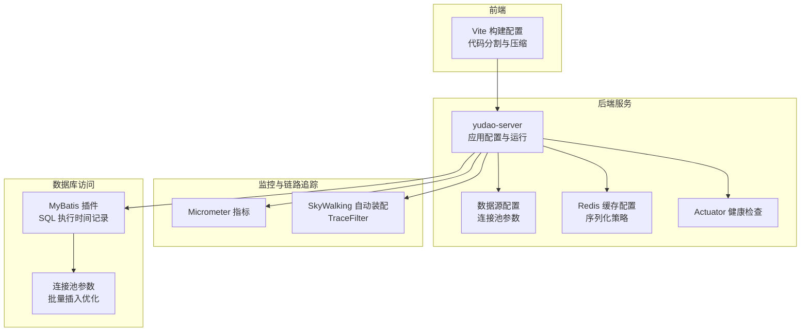
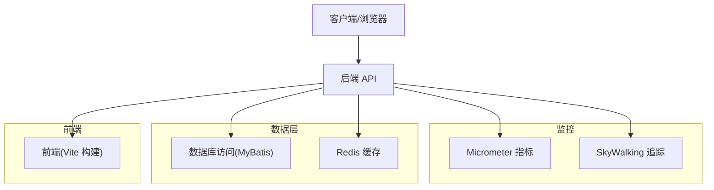
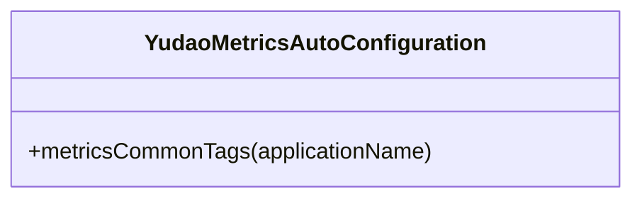
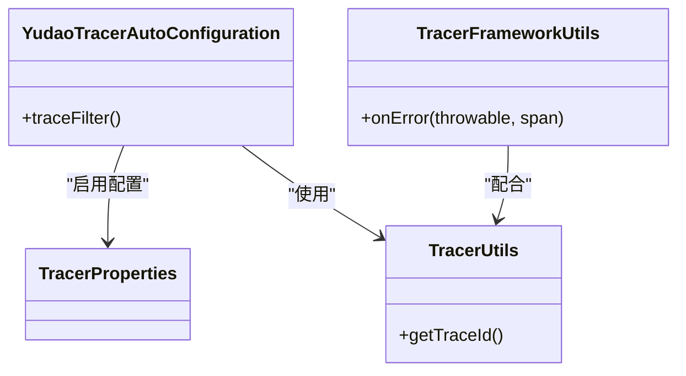
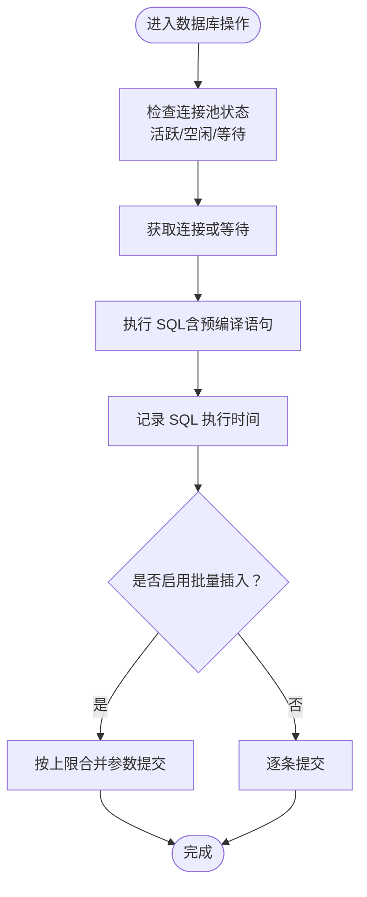
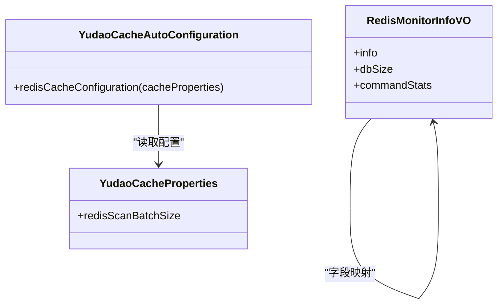
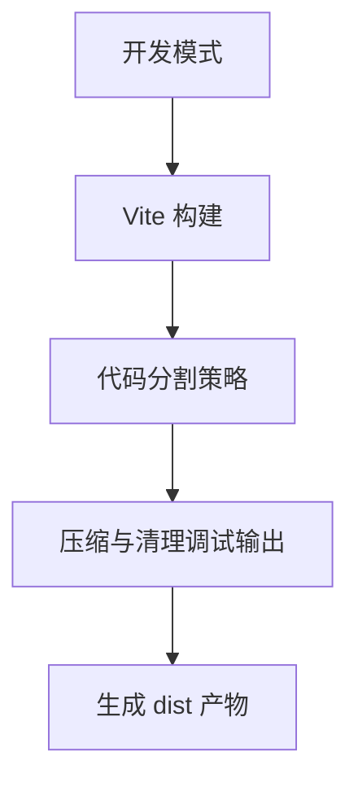
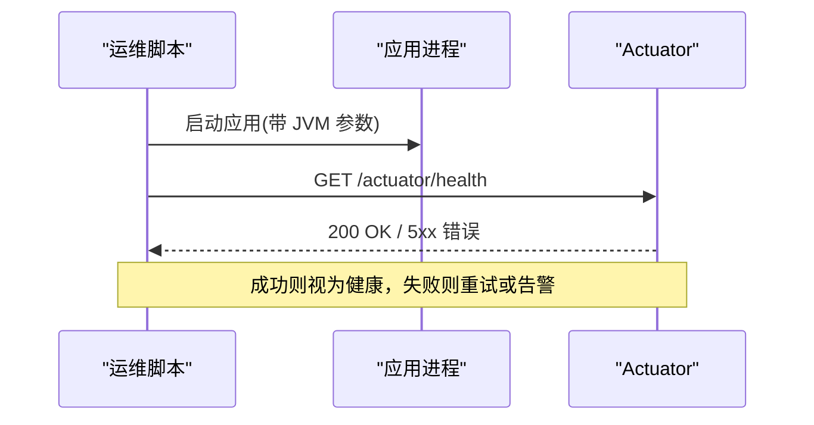
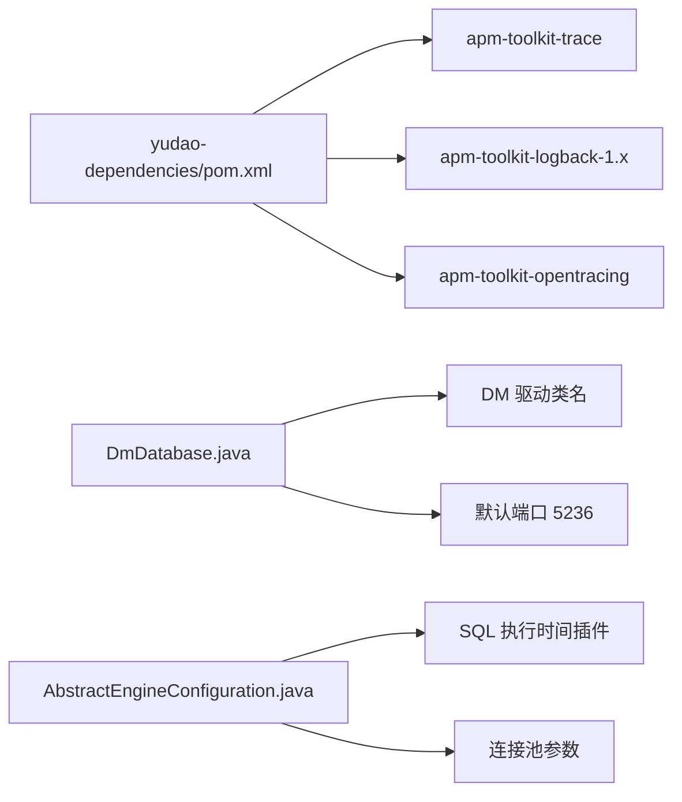

# 性能问题诊断

<cite>
**本文引用的文件**
- [application-dev.yaml](file://yudao-server/src/main/resources/application-dev.yaml)
- [application-local.yaml](file://yudao-server/src/main/resources/application-local.yaml)
- [deploy.sh](file://script/shell/deploy.sh)
- [YudaoMetricsAutoConfiguration.java](file://yudao-framework/yudao-spring-boot-starter-monitor/src/main/java/cn/iocoder/yudao/framework/tracer/config/YudaoMetricsAutoConfiguration.java)
- [YudaoTracerAutoConfiguration.java](file://yudao-framework/yudao-spring-boot-starter-monitor/src/main/java/cn/iocoder/yudao/framework/tracer/config/YudaoTracerAutoConfiguration.java)
- [TracerProperties.java](file://yudao-framework/yudao-spring-boot-starter-monitor/src/main/java/cn/iocoder/yudao/framework/tracer/config/TracerProperties.java)
- [TracerUtils.java](file://yudao-framework/yudao-common/src/main/java/cn/iocoder/yudao/framework/common/util/monitor/TracerUtils.java)
- [TracerFrameworkUtils.java](file://yudao-framework/yudao-spring-boot-starter-monitor/src/main/java/cn/iocoder/yudao/framework/tracer/core/util/TracerFrameworkUtils.java)
- [YudaoCacheAutoConfiguration.java](file://yudao-framework/yudao-spring-boot-starter-redis/src/main/java/cn/iocoder/yudao/framework/redis/config/YudaoCacheAutoConfiguration.java)
- [YudaoCacheProperties.java](file://yudao-framework/yudao-spring-boot-starter-redis/src/main/java/cn/iocoder/yudao/framework/redis/config/YudaoCacheProperties.java)
- [vite.config.ts](file://yudao-ui/yudao-ui-admin-vue3/vite.config.ts)
- [types.ts](file://yudao-ui/yudao-ui-admin-vue3/src/api/infra/redis/types.ts)
- [AbstractEngineConfiguration.java](file://sql/dm/flowable-patch/src/main/java/org/flowable/common/engine/impl/AbstractEngineConfiguration.java)
- [DmDatabase.java](file://sql/dm/flowable-patch/src/main/java/liquibase/database/core/DmDatabase.java)
- [pom.xml](file://yudao-dependencies/pom.xml)
</cite>

## 目录
1. [简介](#简介)
2. [项目结构](#项目结构)
3. [核心组件](#核心组件)
4. [架构总览](#架构总览)
5. [详细组件分析](#详细组件分析)
6. [依赖关系分析](#依赖关系分析)
7. [性能考量与优化建议](#性能考量与优化建议)
8. [故障排查指南](#故障排查指南)
9. [结论](#结论)
10. [附录](#附录)

## 简介
本文件面向系统运维与开发工程师，提供一套完整的性能问题诊断方法论与实操指南。内容覆盖：
- 后端性能：CPU、内存、磁盘 IO、网络延迟的识别与定位
- JVM 性能分析工具：JProfiler、VisualVM、Arthas 的使用要点与问题定位技巧
- 数据库性能：慢查询、连接池、索引使用与优化
- 前端性能：页面加载、资源压缩、渲染性能的诊断与优化
- 分布式链路追踪：SkyWalking 在微服务中的应用与实践

## 项目结构
本项目采用多模块分层架构，包含后端服务、前端界面、基础设施与监控链路。与性能诊断密切相关的模块与文件如下：
- 后端服务配置：数据库连接池、缓存序列化策略、Actuator 健康检查
- 监控与链路追踪：Micrometer 指标、SkyWalking 自动装配与过滤器
- 前端构建：Vite 打包策略、代码分割与压缩开关
- 数据访问层：MyBatis SQL 执行时间插件与批量插入优化

图示来源
- [application-dev.yaml:36-57](file://yudao-server/src/main/resources/application-dev.yaml#L36-L57)
- [application-local.yaml:34-50](file://yudao-server/src/main/resources/application-local.yaml#L34-L50)
- [YudaoMetricsAutoConfiguration.java:16-27](file://yudao-framework/yudao-spring-boot-starter-monitor/src/main/java/cn/iocoder/yudao/framework/tracer/config/YudaoMetricsAutoConfiguration.java#L16-L27)
- [YudaoTracerAutoConfiguration.java:17-53](file://yudao-framework/yudao-spring-boot-starter-monitor/src/main/java/cn/iocoder/yudao/framework/tracer/config/YudaoTracerAutoConfiguration.java#L17-L53)
- [YudaoCacheAutoConfiguration.java:32-54](file://yudao-framework/yudao-spring-boot-starter-redis/src/main/java/cn/iocoder/yudao/framework/redis/config/YudaoCacheAutoConfiguration.java#L32-L54)
- [vite.config.ts:78-101](file://yudao-ui/yudao-ui-admin-vue3/vite.config.ts#L78-L101)
- [AbstractEngineConfiguration.java:215-978](file://sql/dm/flowable-patch/src/main/java/org/flowable/common/engine/impl/AbstractEngineConfiguration.java#L215-L978)

章节来源
- [application-dev.yaml:36-57](file://yudao-server/src/main/resources/application-dev.yaml#L36-L57)
- [application-local.yaml:34-50](file://yudao-server/src/main/resources/application-local.yaml#L34-L50)
- [YudaoMetricsAutoConfiguration.java:16-27](file://yudao-framework/yudao-spring-boot-starter-monitor/src/main/java/cn/iocoder/yudao/framework/tracer/config/YudaoMetricsAutoConfiguration.java#L16-L27)
- [YudaoTracerAutoConfiguration.java:17-53](file://yudao-framework/yudao-spring-boot-starter-monitor/src/main/java/cn/iocoder/yudao/framework/tracer/config/YudaoTracerAutoConfiguration.java#L17-L53)
- [YudaoCacheAutoConfiguration.java:32-54](file://yudao-framework/yudao-spring-boot-starter-redis/src/main/java/cn/iocoder/yudao/framework/redis/config/YudaoCacheAutoConfiguration.java#L32-L54)
- [vite.config.ts:78-101](file://yudao-ui/yudao-ui-admin-vue3/vite.config.ts#L78-L101)
- [AbstractEngineConfiguration.java:215-978](file://sql/dm/flowable-patch/src/main/java/org/flowable/common/engine/impl/AbstractEngineConfiguration.java#L215-L978)

## 核心组件
- 指标与监控
  - Micrometer 指标自动装配，统一添加 common tags，便于集中采集与展示
- 链路追踪
  - SkyWalking 自动装配与 TraceFilter 注册，确保请求头携带 traceId
  - 提供 TracerUtils 获取链路 ID，TracerFrameworkUtils 记录异常到 Span
- 数据库连接池
  - application-dev.yaml 与 application-local.yaml 中定义连接池大小、等待时间、空闲回收策略、预编译语句缓存等
- 缓存配置
  - Redis 缓存前缀计算与 JSON 序列化策略，提升缓存命中与传输效率
- 前端构建
  - Vite 配置代码分割与压缩选项，控制产物体积与加载性能
- 数据访问层
  - MyBatis 插件记录 SQL 执行时间；批量插入开关与参数上限优化

章节来源
- [YudaoMetricsAutoConfiguration.java:16-27](file://yudao-framework/yudao-spring-boot-starter-monitor/src/main/java/cn/iocoder/yudao/framework/tracer/config/YudaoMetricsAutoConfiguration.java#L16-L27)
- [YudaoTracerAutoConfiguration.java:17-53](file://yudao-framework/yudao-spring-boot-starter-monitor/src/main/java/cn/iocoder/yudao/framework/tracer/config/YudaoTracerAutoConfiguration.java#L17-L53)
- [TracerUtils.java:20-30](file://yudao-framework/yudao-common/src/main/java/cn/iocoder/yudao/framework/common/util/monitor/TracerUtils.java#L20-L30)
- [TracerFrameworkUtils.java:18-46](file://yudao-framework/yudao-spring-boot-starter-monitor/src/main/java/cn/iocoder/yudao/framework/tracer/core/util/TracerFrameworkUtils.java#L18-L46)
- [application-dev.yaml:36-57](file://yudao-server/src/main/resources/application-dev.yaml#L36-L57)
- [application-local.yaml:34-50](file://yudao-server/src/main/resources/application-local.yaml#L34-L50)
- [YudaoCacheAutoConfiguration.java:32-54](file://yudao-framework/yudao-spring-boot-starter-redis/src/main/java/cn/iocoder/yudao/framework/redis/config/YudaoCacheAutoConfiguration.java#L32-L54)
- [vite.config.ts:78-101](file://yudao-ui/yudao-ui-admin-vue3/vite.config.ts#L78-L101)
- [AbstractEngineConfiguration.java:966-968](file://sql/dm/flowable-patch/src/main/java/org/flowable/common/engine/impl/AbstractEngineConfiguration.java#L966-L968)

## 架构总览
下图展示了性能诊断的关键路径：指标采集、链路追踪、数据库访问与前端构建。

图示来源
- [YudaoMetricsAutoConfiguration.java:16-27](file://yudao-framework/yudao-spring-boot-starter-monitor/src/main/java/cn/iocoder/yudao/framework/tracer/config/YudaoMetricsAutoConfiguration.java#L16-L27)
- [YudaoTracerAutoConfiguration.java:17-53](file://yudao-framework/yudao-spring-boot-starter-monitor/src/main/java/cn/iocoder/yudao/framework/tracer/config/YudaoTracerAutoConfiguration.java#L17-L53)
- [AbstractEngineConfiguration.java:966-968](file://sql/dm/flowable-patch/src/main/java/org/flowable/common/engine/impl/AbstractEngineConfiguration.java#L966-L968)
- [YudaoCacheAutoConfiguration.java:32-54](file://yudao-framework/yudao-spring-boot-starter-redis/src/main/java/cn/iocoder/yudao/framework/redis/config/YudaoCacheAutoConfiguration.java#L32-L54)
- [vite.config.ts:78-101](file://yudao-ui/yudao-ui-admin-vue3/vite.config.ts#L78-L101)

## 详细组件分析

### 指标与监控组件
- 统一标签注入：通过 MeterRegistryCustomizer 添加 common tags，便于跨实例聚合
- 指标启用开关：可通过 yudao.metrics.enable 控制是否启用 Micrometer

图示来源
- [YudaoMetricsAutoConfiguration.java:16-27](file://yudao-framework/yudao-spring-boot-starter-monitor/src/main/java/cn/iocoder/yudao/framework/tracer/config/YudaoMetricsAutoConfiguration.java#L16-L27)

章节来源
- [YudaoMetricsAutoConfiguration.java:16-27](file://yudao-framework/yudao-spring-boot-starter-monitor/src/main/java/cn/iocoder/yudao/framework/tracer/config/YudaoMetricsAutoConfiguration.java#L16-L27)

### 链路追踪组件
- 自动装配：条件化启用 SkyWalking 相关组件与 TraceFilter
- 工具类：TracerUtils 获取 traceId；TracerFrameworkUtils 将异常记录到 Span

图示来源
- [YudaoTracerAutoConfiguration.java:17-53](file://yudao-framework/yudao-spring-boot-starter-monitor/src/main/java/cn/iocoder/yudao/framework/tracer/config/YudaoTracerAutoConfiguration.java#L17-L53)
- [TracerProperties.java:11-14](file://yudao-framework/yudao-spring-boot-starter-monitor/src/main/java/cn/iocoder/yudao/framework/tracer/config/TracerProperties.java#L11-L14)
- [TracerUtils.java:20-30](file://yudao-framework/yudao-common/src/main/java/cn/iocoder/yudao/framework/common/util/monitor/TracerUtils.java#L20-L30)
- [TracerFrameworkUtils.java:18-46](file://yudao-framework/yudao-spring-boot-starter-monitor/src/main/java/cn/iocoder/yudao/framework/tracer/core/util/TracerFrameworkUtils.java#L18-L46)

章节来源
- [YudaoTracerAutoConfiguration.java:17-53](file://yudao-framework/yudao-spring-boot-starter-monitor/src/main/java/cn/iocoder/yudao/framework/tracer/config/YudaoTracerAutoConfiguration.java#L17-L53)
- [TracerProperties.java:11-14](file://yudao-framework/yudao-spring-boot-starter-monitor/src/main/java/cn/iocoder/yudao/framework/tracer/config/TracerProperties.java#L11-L14)
- [TracerUtils.java:20-30](file://yudao-framework/yudao-common/src/main/java/cn/iocoder/yudao/framework/common/util/monitor/TracerUtils.java#L20-L30)
- [TracerFrameworkUtils.java:18-46](file://yudao-framework/yudao-spring-boot-starter-monitor/src/main/java/cn/iocoder/yudao/framework/tracer/core/util/TracerFrameworkUtils.java#L18-L46)

### 数据库连接池与访问层
- 连接池参数：最大活跃连接、空闲回收、等待超时、预编译语句缓存等
- MyBatis 插件：记录 SQL 执行时间，辅助慢查询定位
- 批量插入优化：bulk insert 开关与参数上限，针对不同数据库类型调整

图示来源
- [application-dev.yaml:36-57](file://yudao-server/src/main/resources/application-dev.yaml#L36-L57)
- [application-local.yaml:34-50](file://yudao-server/src/main/resources/application-local.yaml#L34-L50)
- [AbstractEngineConfiguration.java:966-968](file://sql/dm/flowable-patch/src/main/java/org/flowable/common/engine/impl/AbstractEngineConfiguration.java#L966-L968)
- [AbstractEngineConfiguration.java:224-237](file://sql/dm/flowable-patch/src/main/java/org/flowable/common/engine/impl/AbstractEngineConfiguration.java#L224-L237)

章节来源
- [application-dev.yaml:36-57](file://yudao-server/src/main/resources/application-dev.yaml#L36-L57)
- [application-local.yaml:34-50](file://yudao-server/src/main/resources/application-local.yaml#L34-L50)
- [AbstractEngineConfiguration.java:224-237](file://sql/dm/flowable-patch/src/main/java/org/flowable/common/engine/impl/AbstractEngineConfiguration.java#L224-L237)
- [AbstractEngineConfiguration.java:966-968](file://sql/dm/flowable-patch/src/main/java/org/flowable/common/engine/impl/AbstractEngineConfiguration.java#L966-L968)

### 缓存配置与序列化
- 缓存前缀：统一以冒号结尾，避免可视化工具显示异常
- 序列化：使用 JSON 序列化策略，提升跨语言与调试友好性
- Redis 监控：命令统计、dbSize、内存与 CPU 指标等

图示来源
- [YudaoCacheAutoConfiguration.java:32-54](file://yudao-framework/yudao-spring-boot-starter-redis/src/main/java/cn/iocoder/yudao/framework/redis/config/YudaoCacheAutoConfiguration.java#L32-L54)
- [YudaoCacheProperties.java:12-27](file://yudao-framework/yudao-spring-boot-starter-redis/src/main/java/cn/iocoder/yudao/framework/redis/config/YudaoCacheProperties.java#L12-L27)
- [types.ts:1-57](file://yudao-ui/yudao-ui-admin-vue3/src/api/infra/redis/types.ts#L1-L57)

章节来源
- [YudaoCacheAutoConfiguration.java:32-54](file://yudao-framework/yudao-spring-boot-starter-redis/src/main/java/cn/iocoder/yudao/framework/redis/config/YudaoCacheAutoConfiguration.java#L32-L54)
- [YudaoCacheProperties.java:12-27](file://yudao-framework/yudao-spring-boot-starter-redis/src/main/java/cn/iocoder/yudao/framework/redis/config/YudaoCacheProperties.java#L12-L27)
- [types.ts:1-57](file://yudao-ui/yudao-ui-admin-vue3/src/api/infra/redis/types.ts#L1-L57)

### 前端性能与构建
- 代码分割：对第三方大包（如 echarts、form-create）单独分组，减少首屏依赖
- 压缩与调试：支持移除 debugger 与 console，按需开启 sourcemap
- 依赖优化：optimizeDeps 配置用于加速首次构建

图示来源
- [vite.config.ts:78-101](file://yudao-ui/yudao-ui-admin-vue3/vite.config.ts#L78-L101)

章节来源
- [vite.config.ts:78-101](file://yudao-ui/yudao-ui-admin-vue3/vite.config.ts#L78-L101)

### 部署与 JVM 参数
- 健康检查：通过 /actuator/health 对服务可用性进行探测
- JVM 堆转储：OOM 时自动 dump 至指定目录，便于离线分析

图示来源
- [deploy.sh:14-19](file://script/shell/deploy.sh#L14-L19)

章节来源
- [deploy.sh:14-19](file://script/shell/deploy.sh#L14-L19)

## 依赖关系分析
- SkyWalking 依赖：apm-toolkit-trace、apm-toolkit-logback-1.x、apm-toolkit-opentracing
- 数据库方言与驱动：DM DBMS 支持与默认端口、驱动类名映射
- 连接池与 MyBatis：连接池参数与 SQL 执行时间插件

图示来源
- [pom.xml:335-361](file://yudao-dependencies/pom.xml#L335-L361)
- [DmDatabase.java:41-93](file://sql/dm/flowable-patch/src/main/java/liquibase/database/core/DmDatabase.java#L41-L93)
- [DmDatabase.java:77-85](file://sql/dm/flowable-patch/src/main/java/liquibase/database/core/DmDatabase.java#L77-L85)
- [AbstractEngineConfiguration.java:966-968](file://sql/dm/flowable-patch/src/main/java/org/flowable/common/engine/impl/AbstractEngineConfiguration.java#L966-L968)

章节来源
- [pom.xml:335-361](file://yudao-dependencies/pom.xml#L335-L361)
- [DmDatabase.java:41-93](file://sql/dm/flowable-patch/src/main/java/liquibase/database/core/DmDatabase.java#L41-L93)
- [DmDatabase.java:77-85](file://sql/dm/flowable-patch/src/main/java/liquibase/database/core/DmDatabase.java#L77-L85)
- [AbstractEngineConfiguration.java:966-968](file://sql/dm/flowable-patch/src/main/java/org/flowable/common/engine/impl/AbstractEngineConfiguration.java#L966-L968)

## 性能考量与优化建议
- CPU 使用率过高
  - 通过 Micrometer 指标观察线程池、GC、HTTP 请求速率；结合 TraceFilter 的 traceId 定位热点接口
  - 前端侧检查是否存在高频轮询、未取消的订阅或重复渲染
- 内存泄漏
  - 配置 JVM 堆转储并在部署脚本中启用 OOM dump；结合 GC 日志与堆快照分析
  - 关注长生命周期对象持有短生命周期上下文，避免静态集合无限增长
- 磁盘 IO 瓶颈
  - 数据库连接池参数：合理设置 max-active、min-idle、max-wait，避免连接争用
  - Redis：关注 used_memory、fragmentation ratio、instantaneous_ops_per_sec
- 网络延迟
  - SkyWalking 链路追踪查看跨服务调用耗时；结合 Nginx/网关限流与熔断策略
  - 前端资源：开启 Gzip/Brotli 压缩，利用 CDN 与缓存头
- 数据库慢查询
  - 启用 SQL 执行时间插件，结合连接池参数与批量插入策略
  - 检查索引使用情况与查询计划，避免全表扫描
- 前端性能
  - 代码分割与懒加载；移除 console 与 debugger；合理设置缓存头

## 故障排查指南
- 服务不可用
  - 使用 /actuator/health 快速判断；若失败，检查数据库连接池参数与 Redis 连通性
- 链路中断
  - 确认 TraceFilter 生效，请求头包含 traceId；异常通过 TracerFrameworkUtils 记录到 Span
- 指标缺失
  - 检查 yudao.metrics.enable 与 common tags 注入是否生效
- 前端白屏或卡顿
  - 查看构建日志与产物体积；确认代码分割策略与压缩开关

章节来源
- [deploy.sh:14-19](file://script/shell/deploy.sh#L14-L19)
- [YudaoTracerAutoConfiguration.java:42-51](file://yudao-framework/yudao-spring-boot-starter-monitor/src/main/java/cn/iocoder/yudao/framework/tracer/config/YudaoTracerAutoConfiguration.java#L42-L51)
- [TracerFrameworkUtils.java:18-46](file://yudao-framework/yudao-spring-boot-starter-monitor/src/main/java/cn/iocoder/yudao/framework/tracer/core/util/TracerFrameworkUtils.java#L18-L46)
- [YudaoMetricsAutoConfiguration.java:16-27](file://yudao-framework/yudao-spring-boot-starter-monitor/src/main/java/cn/iocoder/yudao/framework/tracer/config/YudaoMetricsAutoConfiguration.java#L16-L27)
- [vite.config.ts:78-101](file://yudao-ui/yudao-ui-admin-vue3/vite.config.ts#L78-L101)

## 结论
通过统一的指标体系、链路追踪与完善的数据库/缓存/前端配置，本项目具备了系统化的性能问题诊断能力。建议在生产环境持续启用 Micrometer 与 SkyWalking，并结合 JVM 堆转储与数据库慢查询分析，形成“观测—定位—优化”的闭环。

## 附录
- JVM 性能分析工具使用要点
  - JProfiler：关注 CPU 占用、线程状态、GC 次数与停顿时间；结合 traceId 定位热点方法
  - VisualVM：采集堆与线程快照，结合 OOM dump 分析内存占用
  - Arthas：在线诊断、动态替换与热更新，适合生产环境快速定位
- 数据库性能优化清单
  - 慢查询日志与执行计划分析
  - 连接池参数与预编译语句缓存
  - 索引覆盖与复合索引设计
- 前端性能优化清单
  - 代码分割与按需加载
  - 资源压缩与缓存策略
  - 渲染性能：减少重排重绘、虚拟列表、防抖节流
- 分布式链路追踪最佳实践
  - 统一 traceId 传播，异常与错误栈记录到 Span
  - 服务间调用延迟阈值报警，结合仪表盘可视化