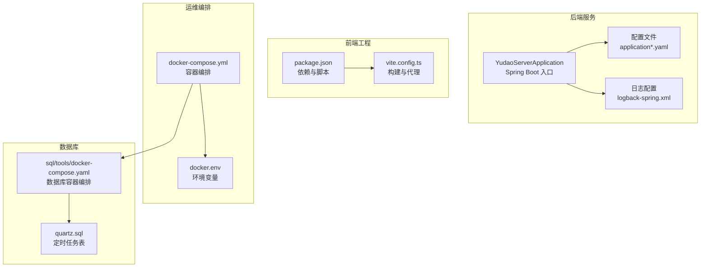
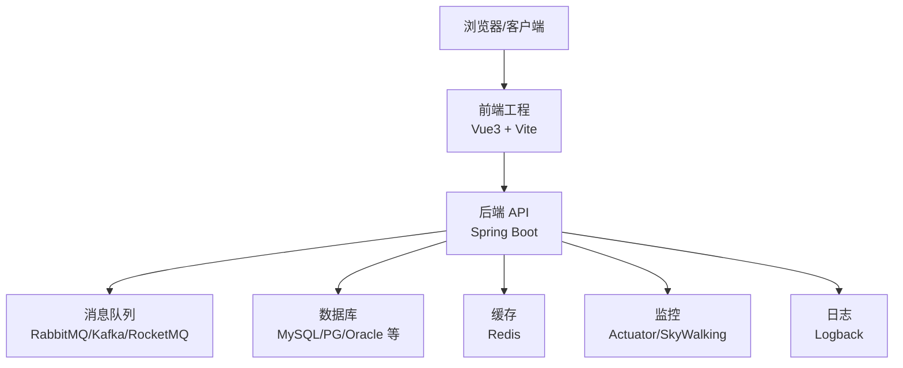
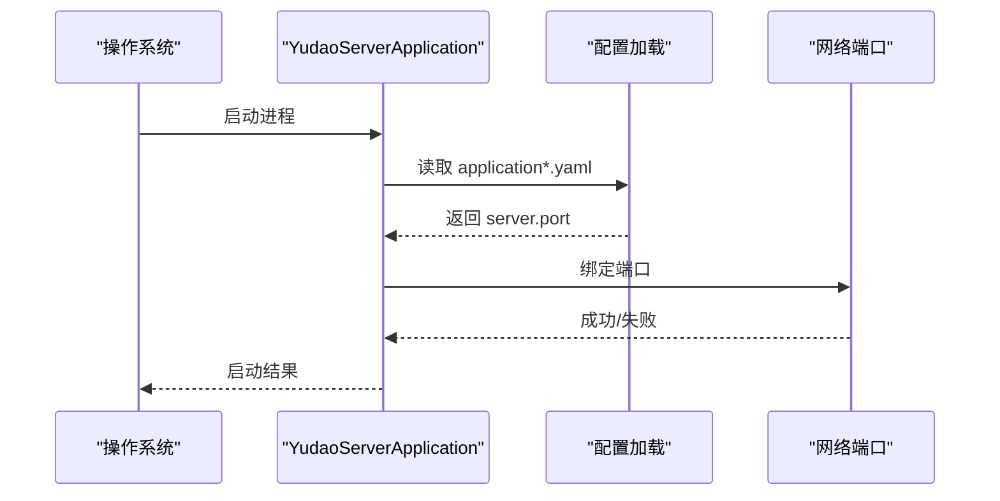
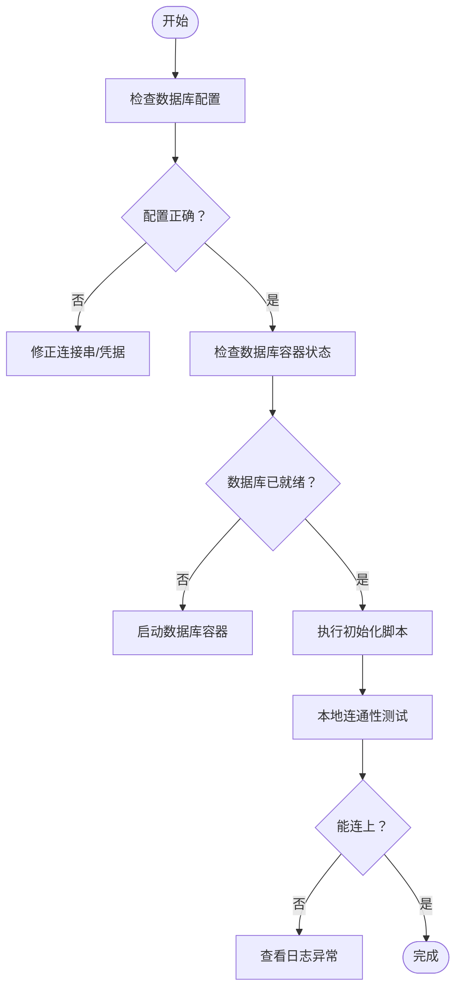
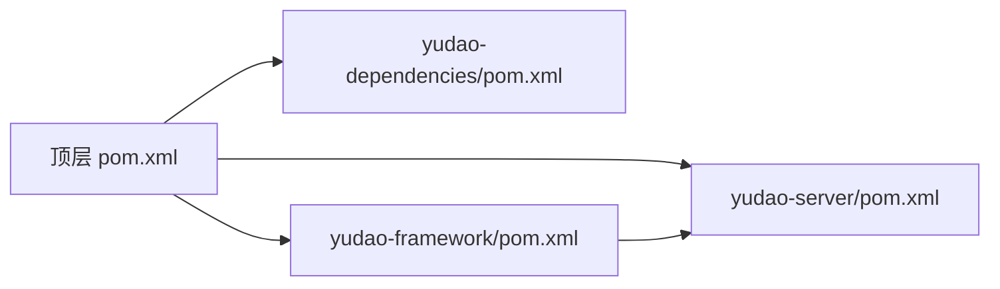

# 故障排查

<cite>
**本文引用的文件**
- [YudaoServerApplication.java](file://yudao-server/src/main/java/cn/iocoder/yudao/server/YudaoServerApplication.java)
- [application.yaml](file://yudao-server/src/main/resources/application.yaml)
- [application-dev.yaml](file://yudao-server/src/main/resources/application-dev.yaml)
- [application-local.yaml](file://yudao-server/src/main/resources/application-local.yaml)
- [logback-spring.xml](file://yudao-server/src/main/resources/logback-spring.xml)
- [pom.xml](file://pom.xml)
- [yudao-dependencies/pom.xml](file://yudao-dependencies/pom.xml)
- [yudao-framework/pom.xml](file://yudao-framework/pom.xml)
- [yudao-server/pom.xml](file://yudao-server/pom.xml)
- [yudao-ui-admin-vue3/package.json](file://yudao-ui/yudao-ui-admin-vue3/package.json)
- [yudao-ui-admin-vue3/vite.config.ts](file://yudao-ui/yudao-ui-admin-vue3/vite.config.ts)
- [docker-compose.yml](file://script/docker/docker-compose.yml)
- [docker.env](file://script/docker/docker.env)
- [sql/mysql/quartz.sql](file://sql/mysql/quartz.sql)
- [sql/tools/docker-compose.yaml](file://sql/tools/docker-compose.yaml)
</cite>

## 目录
1. [简介](#简介)
2. [项目结构](#项目结构)
3. [核心组件](#核心组件)
4. [架构总览](#架构总览)
5. [详细组件分析](#详细组件分析)
6. [依赖关系分析](#依赖关系分析)
7. [性能考虑](#性能考虑)
8. [故障排查指南](#故障排查指南)
9. [结论](#结论)
10. [附录](#附录)

## 简介
本指南面向 ruoyi-vue-pro 的运维与开发人员，聚焦于启动类问题、端口冲突、数据库连接失败、依赖缺失、性能问题（内存泄漏、CPU 占高、慢查询、网络延迟）、日志分析、监控指标解读、数据库问题（连接池、死锁、索引失效、查询优化）、前端问题（浏览器兼容、网络请求、组件渲染）、第三方服务问题（API 失败、认证、配额）、分布式问题（服务发现、消息丢失、数据不一致），以及预防与最佳实践。内容基于仓库中的实际配置与模块组织，提供可操作的排查步骤与可视化图示。

## 项目结构
ruoyi-vue-pro 采用多模块 Maven 架构，后端以 Spring Boot 应用为核心，前端为 Vue3 工程，配合 Docker 编排与 SQL 初始化脚本。关键位置如下：
- 后端入口：YudaoServerApplication.java
- 配置文件：application.yaml 及环境覆盖文件 application-dev.yaml、application-local.yaml
- 日志配置：logback-spring.xml
- 前端工程：yudao-ui-admin-vue3（package.json、vite.config.ts）
- 运维编排：script/docker/docker-compose.yml、docker.env
- 数据库初始化：sql/mysql/quartz.sql、sql/tools/docker-compose.yaml
- 顶层与框架聚合：pom.xml、yudao-dependencies/pom.xml、yudao-framework/pom.xml、yudao-server/pom.xml

图表来源
- [YudaoServerApplication.java](file://yudao-server/src/main/java/cn/iocoder/yudao/server/YudaoServerApplication.java)
- [application.yaml](file://yudao-server/src/main/resources/application.yaml)
- [application-dev.yaml](file://yudao-server/src/main/resources/application-dev.yaml)
- [application-local.yaml](file://yudao-server/src/main/resources/application-local.yaml)
- [logback-spring.xml](file://yudao-server/src/main/resources/logback-spring.xml)
- [yudao-ui-admin-vue3/package.json](file://yudao-ui/yudao-ui-admin-vue3/package.json)
- [yudao-ui-admin-vue3/vite.config.ts](file://yudao-ui/yudao-ui-admin-vue3/vite.config.ts)
- [docker-compose.yml](file://script/docker/docker-compose.yml)
- [docker.env](file://script/docker/docker.env)
- [sql/mysql/quartz.sql](file://sql/mysql/quartz.sql)
- [sql/tools/docker-compose.yaml](file://sql/tools/docker-compose.yaml)

章节来源
- [YudaoServerApplication.java](file://yudao-server/src/main/java/cn/iocoder/yudao/server/YudaoServerApplication.java)
- [application.yaml](file://yudao-server/src/main/resources/application.yaml)
- [application-dev.yaml](file://yudao-server/src/main/resources/application-dev.yaml)
- [application-local.yaml](file://yudao-server/src/main/resources/application-local.yaml)
- [logback-spring.xml](file://yudao-server/src/main/resources/logback-spring.xml)
- [yudao-ui-admin-vue3/package.json](file://yudao-ui/yudao-ui-admin-vue3/package.json)
- [yudao-ui-admin-vue3/vite.config.ts](file://yudao-ui/yudao-ui-admin-vue3/vite.config.ts)
- [docker-compose.yml](file://script/docker/docker-compose.yml)
- [docker.env](file://script/docker/docker.env)
- [sql/mysql/quartz.sql](file://sql/mysql/quartz.sql)
- [sql/tools/docker-compose.yaml](file://sql/tools/docker-compose.yaml)

## 核心组件
- 后端启动器：负责加载 Spring Boot 上下文、扫描组件、初始化 Bean，并绑定服务器端口。
- 配置体系：application.yaml 为主配置，application-dev.yaml 与 application-local.yaml 提供开发/本地覆盖；支持通过环境变量或命令行参数覆盖。
- 日志系统：logback-spring.xml 定义日志级别、输出格式与路由，便于问题定位。
- 前端构建：package.json 管理依赖与脚本，vite.config.ts 提供开发服务器与代理规则。
- 运维编排：docker-compose.yml 统一拉起后端、数据库等服务；docker.env 提供默认环境变量。
- 数据库初始化：quartz.sql 初始化定时任务相关表；sql/tools/docker-compose.yaml 提供数据库容器编排与初始化。

章节来源
- [YudaoServerApplication.java](file://yudao-server/src/main/java/cn/iocoder/yudao/server/YudaoServerApplication.java)
- [application.yaml](file://yudao-server/src/main/resources/application.yaml)
- [application-dev.yaml](file://yudao-server/src/main/resources/application-dev.yaml)
- [application-local.yaml](file://yudao-server/src/main/resources/application-local.yaml)
- [logback-spring.xml](file://yudao-server/src/main/resources/logback-spring.xml)
- [yudao-ui-admin-vue3/package.json](file://yudao-ui/yudao-ui-admin-vue3/package.json)
- [yudao-ui-admin-vue3/vite.config.ts](file://yudao-ui/yudao-ui-admin-vue3/vite.config.ts)
- [docker-compose.yml](file://script/docker/docker-compose.yml)
- [docker.env](file://script/docker/docker.env)
- [sql/mysql/quartz.sql](file://sql/mysql/quartz.sql)
- [sql/tools/docker-compose.yaml](file://sql/tools/docker-compose.yaml)

## 架构总览
后端采用 Spring Boot 自动装配与 Starter 机制，结合 yudao-framework 中的各类 Starter（如安全、监控、消息队列、Redis、MyBatis 等）实现功能扩展。前端通过 Vite 构建，开发时通过代理访问后端接口。Docker 编排用于本地与生产环境的一致化部署。

图表来源
- [YudaoServerApplication.java](file://yudao-server/src/main/java/cn/iocoder/yudao/server/YudaoServerApplication.java)
- [application.yaml](file://yudao-server/src/main/resources/application.yaml)
- [logback-spring.xml](file://yudao-server/src/main/resources/logback-spring.xml)
- [yudao-ui-admin-vue3/vite.config.ts](file://yudao-ui/yudao-ui-admin-vue3/vite.config.ts)

## 详细组件分析

### 启动流程与端口冲突排查
- 启动顺序要点
  - Spring Boot 通过入口类加载配置与自动装配，随后启动 Web 服务器。
  - 若端口被占用，应用会启动失败或抛出端口绑定异常。
- 端口冲突排查步骤
  - 确认 application.yaml 中 server.port 设置是否与其他进程冲突。
  - 使用系统工具检查占用端口的进程并释放。
  - 如需临时切换端口，可通过 JVM 参数或环境变量覆盖。
- 关键配置参考路径
  - [application.yaml](file://yudao-server/src/main/resources/application.yaml)
  - [application-dev.yaml](file://yudao-server/src/main/resources/application-dev.yaml)
  - [application-local.yaml](file://yudao-server/src/main/resources/application-local.yaml)

图表来源
- [YudaoServerApplication.java](file://yudao-server/src/main/java/cn/iocoder/yudao/server/YudaoServerApplication.java)
- [application.yaml](file://yudao-server/src/main/resources/application.yaml)

章节来源
- [YudaoServerApplication.java](file://yudao-server/src/main/java/cn/iocoder/yudao/server/YudaoServerApplication.java)
- [application.yaml](file://yudao-server/src/main/resources/application.yaml)
- [application-dev.yaml](file://yudao-server/src/main/resources/application-dev.yaml)
- [application-local.yaml](file://yudao-server/src/main/resources/application-local.yaml)

### 数据库连接失败排查
- 常见原因
  - 连接串、用户名、密码错误；数据库未启动；网络不可达；驱动缺失；初始化脚本未执行。
- 排查步骤
  - 检查 application.yaml 中数据库连接配置。
  - 使用 docker-compose 启动数据库容器并确认初始化脚本已执行。
  - 在本地验证数据库连通性与权限。
  - 查看日志中数据库连接异常堆栈。
- 关键配置参考路径
  - [application.yaml](file://yudao-server/src/main/resources/application.yaml)
  - [sql/mysql/quartz.sql](file://sql/mysql/quartz.sql)
  - [sql/tools/docker-compose.yaml](file://sql/tools/docker-compose.yaml)

图表来源
- [application.yaml](file://yudao-server/src/main/resources/application.yaml)
- [sql/mysql/quartz.sql](file://sql/mysql/quartz.sql)
- [sql/tools/docker-compose.yaml](file://sql/tools/docker-compose.yaml)

章节来源
- [application.yaml](file://yudao-server/src/main/resources/application.yaml)
- [sql/mysql/quartz.sql](file://sql/mysql/quartz.sql)
- [sql/tools/docker-compose.yaml](file://sql/tools/docker-compose.yaml)

### 依赖缺失与版本冲突排查
- Maven 聚合结构
  - 顶层 pom.xml 聚合 yudao-dependencies、yudao-framework、yudao-server 等模块。
  - yudao-dependencies/pom.xml 统一管理版本与依赖范围。
  - yudao-framework/pom.xml 提供各类 Starter 与通用能力。
- 排查步骤
  - 清理并重新安装依赖：mvn clean install -DskipTests。
  - 检查 yudao-dependencies/pom.xml 中版本一致性。
  - 排查 yudao-framework 与 yudao-server 的依赖传递与冲突。
- 关键文件参考路径
  - [pom.xml](file://pom.xml)
  - [yudao-dependencies/pom.xml](file://yudao-dependencies/pom.xml)
  - [yudao-framework/pom.xml](file://yudao-framework/pom.xml)
  - [yudao-server/pom.xml](file://yudao-server/pom.xml)

章节来源
- [pom.xml](file://pom.xml)
- [yudao-dependencies/pom.xml](file://yudao-dependencies/pom.xml)
- [yudao-framework/pom.xml](file://yudao-framework/pom.xml)
- [yudao-server/pom.xml](file://yudao-server/pom.xml)

### 前端问题诊断
- 浏览器兼容性
  - 检查 package.json 中目标环境与 polyfill 配置。
- 网络请求错误
  - 查看 vite.config.ts 中代理配置，确保后端接口可达。
- 组件渲染问题
  - 结合浏览器开发者工具 Network/Console 定位静态资源与接口异常。
- 关键文件参考路径
  - [yudao-ui-admin-vue3/package.json](file://yudao-ui/yudao-ui-admin-vue3/package.json)
  - [yudao-ui-admin-vue3/vite.config.ts](file://yudao-ui/yudao-ui-admin-vue3/vite.config.ts)

章节来源
- [yudao-ui-admin-vue3/package.json](file://yudao-ui/yudao-ui-admin-vue3/package.json)
- [yudao-ui-admin-vue3/vite.config.ts](file://yudao-ui/yudao-ui-admin-vue3/vite.config.ts)

### 日志分析技巧
- 日志级别与输出
  - logback-spring.xml 控制根日志级别、包级别、控制台与文件输出格式。
- 关键日志定位
  - 启动异常：关注启动阶段的异常堆栈与依赖注入失败信息。
  - 运行期异常：按包名过滤，定位到具体控制器/服务层。
  - 数据库与缓存：开启对应包的日志级别以捕获连接、SQL、慢查询等。
- 错误堆栈分析
  - 从异常类型与消息入手，结合调用链定位到业务方法与 DAO 层。
- 关键文件参考路径
  - [logback-spring.xml](file://yudao-server/src/main/resources/logback-spring.xml)

章节来源
- [logback-spring.xml](file://yudao-server/src/main/resources/logback-spring.xml)

### 监控指标解读
- 应用性能指标
  - Actuator 暴露运行时指标，如 CPU、内存、线程、HTTP 请求统计。
- 系统资源监控
  - 结合宿主机监控（CPU、内存、磁盘、网络）与容器监控（Docker/Prometheus）。
- 业务指标监控
  - 通过埋点与链路追踪（SkyWalking）观测关键业务路径耗时与成功率。
- 建议
  - 将关键指标接入统一监控平台，设置阈值告警。

### 数据库问题排查
- 连接池问题
  - 观察连接池大小、活跃连接数、等待时间；排查超时与泄露。
- 死锁检测
  - 分析事务隔离级别与锁等待；必要时回滚长事务。
- 索引失效
  - 使用 EXPLAIN 分析 SQL 执行计划，避免函数作用在列上、类型不匹配等。
- 查询优化
  - 基于慢查询日志与执行计划，补充索引、重写 SQL、拆分复杂查询。
- 初始化脚本
  - 确保定时任务等表已初始化，避免功能异常。

章节来源
- [application.yaml](file://yudao-server/src/main/resources/application.yaml)
- [sql/mysql/quartz.sql](file://sql/mysql/quartz.sql)
- [sql/tools/docker-compose.yaml](file://sql/tools/docker-compose.yaml)

### 第三方服务问题排查
- API 调用失败
  - 检查超时、重试策略、限流与熔断配置；核对鉴权头与签名。
- 认证问题
  - 校验 Token 有效期、作用域与签发方；确认网关/拦截器放行规则。
- 配额限制
  - 监控调用量与配额使用率，设置预警与降级策略。

### 分布式系统问题排查
- 服务发现异常
  - 核对注册中心地址、实例健康检查与权重配置。
- 消息丢失
  - 校验消息持久化、ACK 机制与消费者幂等处理。
- 数据不一致
  - 基于最终一致性设计，引入补偿与对账机制。

## 依赖关系分析
- 模块耦合
  - yudao-server 依赖 yudao-framework 与各模块（system、infra、bpm、report 等）。
  - yudao-framework 通过 Starter 提供通用能力，降低重复实现。
- 外部依赖
  - 数据库驱动、消息队列客户端、Redis 客户端、安全框架等由 yudao-dependencies 统一版本管理。
- 循环依赖
  - 通过模块拆分与接口抽象避免循环依赖。

图表来源
- [pom.xml](file://pom.xml)
- [yudao-dependencies/pom.xml](file://yudao-dependencies/pom.xml)
- [yudao-framework/pom.xml](file://yudao-framework/pom.xml)
- [yudao-server/pom.xml](file://yudao-server/pom.xml)

章节来源
- [pom.xml](file://pom.xml)
- [yudao-dependencies/pom.xml](file://yudao-dependencies/pom.xml)
- [yudao-framework/pom.xml](file://yudao-framework/pom.xml)
- [yudao-server/pom.xml](file://yudao-server/pom.xml)

## 性能考虑
- 内存泄漏检测
  - 使用堆转储与 GC 日志分析，定位长时间存活对象与大对象集合。
- CPU 占用过高
  - 采样线程堆栈，识别热点方法与阻塞点；优化算法与减少同步开销。
- 数据库慢查询
  - 开启慢查询日志，结合执行计划与索引策略优化。
- 网络延迟排查
  - 使用 PING/TCPING/Traceroute 定位网络瓶颈；检查 DNS、防火墙与代理。

## 故障排查指南

### 启动类问题
- 症状：启动失败、端口占用、配置未生效
- 步骤
  - 检查 application.yaml 与环境覆盖文件的 server.port。
  - 释放占用端口或修改端口。
  - 通过 JVM 参数或环境变量覆盖配置项。
- 参考
  - [YudaoServerApplication.java](file://yudao-server/src/main/java/cn/iocoder/yudao/server/YudaoServerApplication.java)
  - [application.yaml](file://yudao-server/src/main/resources/application.yaml)

章节来源
- [YudaoServerApplication.java](file://yudao-server/src/main/java/cn/iocoder/yudao/server/YudaoServerApplication.java)
- [application.yaml](file://yudao-server/src/main/resources/application.yaml)

### 端口冲突
- 症状：启动时报端口绑定失败
- 步骤
  - 使用 netstat/lsof 查找占用进程并终止。
  - 修改 application.yaml 的 server.port 或通过 -Dserver.port=xxx 传参。
- 参考
  - [application.yaml](file://yudao-server/src/main/resources/application.yaml)

章节来源
- [application.yaml](file://yudao-server/src/main/resources/application.yaml)

### 数据库连接失败
- 症状：启动时报数据库连接异常、SQL 执行失败
- 步骤
  - 校验 application.yaml 中数据库连接配置。
  - 使用 docker-compose 启动数据库并执行初始化脚本。
  - 本地 telnet/nc 验证端口连通性。
- 参考
  - [application.yaml](file://yudao-server/src/main/resources/application.yaml)
  - [sql/tools/docker-compose.yaml](file://sql/tools/docker-compose.yaml)
  - [sql/mysql/quartz.sql](file://sql/mysql/quartz.sql)

章节来源
- [application.yaml](file://yudao-server/src/main/resources/application.yaml)
- [sql/tools/docker-compose.yaml](file://sql/tools/docker-compose.yaml)
- [sql/mysql/quartz.sql](file://sql/mysql/quartz.sql)

### 依赖缺失与版本冲突
- 症状：编译失败、类找不到、运行时报错
- 步骤
  - mvn clean install -DskipTests 重新安装。
  - 检查 yudao-dependencies/pom.xml 版本一致性。
  - 排查 yudao-framework 与 yudao-server 的依赖传递。
- 参考
  - [pom.xml](file://pom.xml)
  - [yudao-dependencies/pom.xml](file://yudao-dependencies/pom.xml)
  - [yudao-framework/pom.xml](file://yudao-framework/pom.xml)
  - [yudao-server/pom.xml](file://yudao-server/pom.xml)

章节来源
- [pom.xml](file://pom.xml)
- [yudao-dependencies/pom.xml](file://yudao-dependencies/pom.xml)
- [yudao-framework/pom.xml](file://yudao-framework/pom.xml)
- [yudao-server/pom.xml](file://yudao-server/pom.xml)

### 前端问题
- 浏览器兼容性
  - 检查 package.json 的目标环境与 polyfill。
- 网络请求错误
  - 校验 vite.config.ts 代理与 CORS 设置。
- 组件渲染问题
  - 使用浏览器开发者工具定位静态资源与接口异常。
- 参考
  - [yudao-ui-admin-vue3/package.json](file://yudao-ui/yudao-ui-admin-vue3/package.json)
  - [yudao-ui-admin-vue3/vite.config.ts](file://yudao-ui/yudao-ui-admin-vue3/vite.config.ts)

章节来源
- [yudao-ui-admin-vue3/package.json](file://yudao-ui/yudao-ui-admin-vue3/package.json)
- [yudao-ui-admin-vue3/vite.config.ts](file://yudao-ui/yudao-ui-admin-vue3/vite.config.ts)

### 日志分析
- 步骤
  - 在 logback-spring.xml 中调整根与包的日志级别。
  - 通过关键字过滤与堆栈定位异常来源。
- 参考
  - [logback-spring.xml](file://yudao-server/src/main/resources/logback-spring.xml)

章节来源
- [logback-spring.xml](file://yudao-server/src/main/resources/logback-spring.xml)

### 监控与指标
- 建议
  - 集成 Actuator 与 SkyWalking，建立统一监控面板与告警。
  - 关注 CPU、内存、GC、数据库连接池、消息队列积压等关键指标。

### 数据库问题
- 连接池问题
  - 观察连接池指标，排查超时与泄露。
- 死锁检测
  - 回滚长事务，优化锁顺序。
- 索引失效与查询优化
  - 使用 EXPLAIN 分析执行计划，补充索引与重写 SQL。
- 参考
  - [application.yaml](file://yudao-server/src/main/resources/application.yaml)
  - [sql/mysql/quartz.sql](file://sql/mysql/quartz.sql)

章节来源
- [application.yaml](file://yudao-server/src/main/resources/application.yaml)
- [sql/mysql/quartz.sql](file://sql/mysql/quartz.sql)

### 第三方服务问题
- API 调用失败
  - 校验超时、重试、限流与鉴权。
- 认证问题
  - 校验 Token 有效期与作用域。
- 配额限制
  - 设置预警与降级策略。

### 分布式问题
- 服务发现异常
  - 校验注册中心与健康检查。
- 消息丢失
  - 校验持久化与 ACK。
- 数据不一致
  - 设计补偿与对账。

## 结论
本指南提供了从启动、配置、日志、监控到数据库与前端的全链路故障排查方法。建议在日常运维中建立标准化的检查清单与应急预案，结合监控与日志自动化分析，提升问题定位效率与系统稳定性。

## 附录
- 快速检查清单
  - 端口：确认 server.port 未被占用。
  - 数据库：容器已启动、初始化脚本执行、连通性正常。
  - 配置：application*.yaml 加载顺序与覆盖关系正确。
  - 依赖：mvn clean install -DskipTests 成功。
  - 日志：logback 级别与输出路径正确。
  - 前端：代理配置正确、静态资源可访问。
  - 监控：Actuator/SkyWalking 可用，关键指标正常。