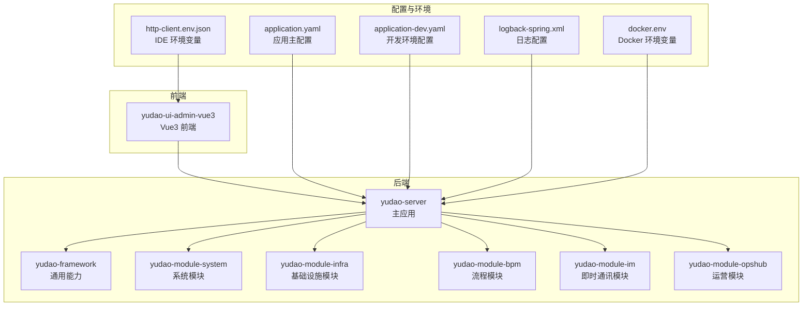
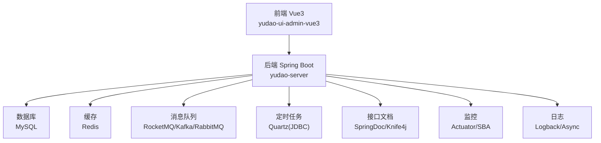
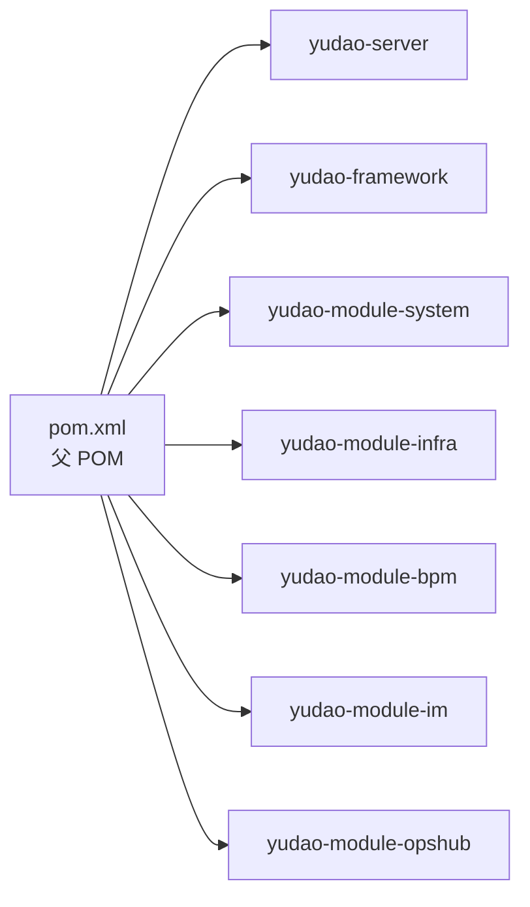

# 故障排查

<cite>
**本文引用的文件**
- [application.yaml](file://yudao-server/src/main/resources/application.yaml)
- [application-dev.yaml](file://yudao-server/src/main/resources/application-dev.yaml)
- [logback-spring.xml](file://yudao-server/src/main/resources/logback-spring.xml)
- [package.json](file://yudao-ui/yudao-ui-admin-vue3/package.json)
- [docker.env](file://script/docker/docker.env)
- [http-client.env.json](file://script/idea/http-client.env.json)
- [pom.xml](file://pom.xml)
</cite>

## 目录
1. [简介](#简介)
2. [项目结构](#项目结构)
3. [核心组件](#核心组件)
4. [架构总览](#架构总览)
5. [详细组件分析](#详细组件分析)
6. [依赖分析](#依赖分析)
7. [性能考虑](#性能考虑)
8. [故障排查指南](#故障排查指南)
9. [结论](#结论)
10. [附录](#附录)

## 简介
本故障排查文档面向芋道 Ruoyi-Vue-Pro 的运维与开发人员，聚焦于常见问题的诊断与解决，涵盖启动失败、数据库连接异常、权限认证问题、前端页面空白等典型故障；同时提供日志分析技巧（后端日志结构、前端错误定位、数据库慢查询、Redis 连接问题）、性能诊断工具与方法（JVM 内存分析、数据库性能监控、前端性能分析、网络延迟检测）、系统监控指标的含义与异常判断（CPU、内存、数据库连接数、请求响应时间），以及生产环境应急处理方案（紧急回滚、流量降级、服务重启、数据恢复）。最后给出开发与生产环境差异排查要点及问题上报与跟踪流程。

## 项目结构
- 后端采用多模块 Maven 结构，核心模块包括 yudao-server（主应用）、yudao-framework（通用能力）、各业务模块（如 system、infra、bpm、im、opshub 等）。
- 前端为 Vue3 + Vite 工程，位于 yudao-ui/yudao-ui-admin-vue3。
- 配置文件集中在 yudao-server 的 resources 下，包含 application.yaml、application-dev.yaml、logback-spring.xml 等。
- Docker 环境变量集中于 script/docker/docker.env，便于容器化部署与调试。

图表来源
- [pom.xml:10-32](file://pom.xml#L10-L32)
- [application.yaml:1-354](file://yudao-server/src/main/resources/application.yaml#L1-L354)
- [application-dev.yaml:1-212](file://yudao-server/src/main/resources/application-dev.yaml#L1-L212)
- [logback-spring.xml:1-57](file://yudao-server/src/main/resources/logback-spring.xml#L1-L57)
- [docker.env:1-26](file://script/docker/docker.env#L1-L26)
- [http-client.env.json:1-21](file://script/idea/http-client.env.json#L1-L21)

章节来源
- [pom.xml:10-32](file://pom.xml#L10-L32)
- [application.yaml:1-354](file://yudao-server/src/main/resources/application.yaml#L1-L354)
- [application-dev.yaml:1-212](file://yudao-server/src/main/resources/application-dev.yaml#L1-L212)
- [logback-spring.xml:1-57](file://yudao-server/src/main/resources/logback-spring.xml#L1-L57)
- [docker.env:1-26](file://script/docker/docker.env#L1-L26)
- [http-client.env.json:1-21](file://script/idea/http-client.env.json#L1-L21)

## 核心组件
- 应用配置与环境
  - application.yaml：定义应用名称、编码、缓存、接口文档、工作流、MyBatis、Spring Data Redis、验证码、消息队列、AI、业务配置等。
  - application-dev.yaml：开发环境数据库、Redis、Quartz、消息队列、监控、日志、微信公众号等配置。
  - logback-spring.xml：控制台与文件异步日志输出、滚动策略、SkyWalking 日志采集占位。
- 前端工程
  - package.json：脚本命令、依赖版本、引擎要求（Node >= 20.19.0，pnpm >= 8.6.0）。
- Docker 环境
  - docker.env：MySQL、Redis、JVM 内存、Admin 前端构建参数等。
- IDE 环境
  - http-client.env.json：本地与网关两种环境的 baseUrl、token、租户等。

章节来源
- [application.yaml:1-354](file://yudao-server/src/main/resources/application.yaml#L1-L354)
- [application-dev.yaml:1-212](file://yudao-server/src/main/resources/application-dev.yaml#L1-L212)
- [logback-spring.xml:1-57](file://yudao-server/src/main/resources/logback-spring.xml#L1-L57)
- [package.json:1-158](file://yudao-ui/yudao-ui-admin-vue3/package.json#L1-L158)
- [docker.env:1-26](file://script/docker/docker.env#L1-L26)
- [http-client.env.json:1-21](file://script/idea/http-client.env.json#L1-L21)

## 架构总览
后端通过 Spring Boot 启动，集成多数据源（Druid 连接池）、Redis 缓存、消息队列（RocketMQ/Kafka/RabbitMQ）、定时任务（Quartz JDBC）、接口文档（SpringDoc/Knife4j）、监控（Actuator/Spring Boot Admin）等。前端通过 Vite 构建，按环境变量切换后端 API 域名，与后端交互。

图表来源
- [application.yaml:1-354](file://yudao-server/src/main/resources/application.yaml#L1-L354)
- [application-dev.yaml:1-212](file://yudao-server/src/main/resources/application-dev.yaml#L1-L212)
- [logback-spring.xml:1-57](file://yudao-server/src/main/resources/logback-spring.xml#L1-L57)

## 详细组件分析

### 启动失败排查
- 症状
  - 服务无法启动、端口占用、配置加载失败、依赖注入异常。
- 排查步骤
  - 检查 application.yaml 与 application-dev.yaml 的激活 profile 与关键配置项是否存在语法错误。
  - 查看 logback-spring.xml 输出，确认是否在控制台与文件中均正常落盘。
  - 核对数据库连接串、用户名、密码是否正确，Redis 地址与端口可达性。
  - 确认消息队列（RocketMQ/Kafka/RabbitMQ）地址连通性。
  - 检查 JVM 内存参数（-Xms/-Xmx）与容器资源限制是否匹配。
- 关键配置定位
  - 端口与编码：[application-dev.yaml:1-10](file://yudao-server/src/main/resources/application-dev.yaml#L1-L10)
  - 数据源与连接池：[application-dev.yaml:13-57](file://yudao-server/src/main/resources/application-dev.yaml#L13-L57)
  - Redis：[application-dev.yaml:60-66](file://yudao-server/src/main/resources/application-dev.yaml#L60-L66)
  - 消息队列：[application-dev.yaml:100-114](file://yudao-server/src/main/resources/application-dev.yaml#L100-L114)
  - Actuator/SBA：[application-dev.yaml:124-145](file://yudao-server/src/main/resources/application-dev.yaml#L124-L145)
  - 日志文件：[application-dev.yaml:146-150](file://yudao-server/src/main/resources/application-dev.yaml#L146-L150)
  - Docker 内存：[docker.env](file://script/docker/docker.env#L6)

章节来源
- [application-dev.yaml:1-150](file://yudao-server/src/main/resources/application-dev.yaml#L1-L150)
- [logback-spring.xml:1-57](file://yudao-server/src/main/resources/logback-spring.xml#L1-L57)
- [docker.env:1-26](file://script/docker/docker.env#L1-L26)

### 数据库连接异常排查
- 症状
  - 启动时报数据库连接失败、SQL 执行超时、连接池耗尽。
- 排查步骤
  - 核对主从库 URL、用户名、密码是否一致且正确。
  - 检查连接池初始大小、最大活跃数、最大等待时间、空闲检测周期等参数是否合理。
  - 使用 Druid 监控页（若开启）观察连接数、慢 SQL、错误统计。
  - 确认数据库服务器网络连通性与防火墙策略。
- 关键配置定位
  - 数据源与连接池：[application-dev.yaml:13-57](file://yudao-server/src/main/resources/application-dev.yaml#L13-L57)
  - Druid 监控：[application-dev.yaml:14-28](file://yudao-server/src/main/resources/application-dev.yaml#L14-L28)

章节来源
- [application-dev.yaml:13-57](file://yudao-server/src/main/resources/application-dev.yaml#L13-L57)

### 权限认证问题排查
- 症状
  - 登录成功但接口 403/401、菜单权限不生效、租户隔离异常。
- 排查步骤
  - 检查 yudao.security.permit-all_urls 与 yudao.tenant.ignore-urls 配置是否覆盖了必要路径。
  - 确认 API 加密开关与算法配置（如 AES）是否与前端一致。
  - 核对 WebSocket 路径与消息发送类型（local/redis/rocketmq/kafka/rabbitmq）。
  - 检查 Actuator/SBA 是否正确暴露，便于远程诊断。
- 关键配置定位
  - 安全与放行路径：[application.yaml:272-271](file://yudao-server/src/main/resources/application.yaml#L272-L271)
  - API 加密：[application.yaml:275-281](file://yudao-server/src/main/resources/application.yaml#L275-L281)
  - WebSocket：[application.yaml:282-294](file://yudao-server/src/main/resources/application.yaml#L282-L294)
  - Actuator/SBA：[application-dev.yaml:124-145](file://yudao-server/src/main/resources/application-dev.yaml#L124-L145)

章节来源
- [application.yaml:272-294](file://yudao-server/src/main/resources/application.yaml#L272-L294)
- [application-dev.yaml:124-145](file://yudao-server/src/main/resources/application-dev.yaml#L124-L145)

### 前端页面空白排查
- 症状
  - 页面白屏、路由跳转失败、静态资源 404。
- 排查步骤
  - 确认 package.json 中 Node 与 pnpm 版本满足要求。
  - 检查 http-client.env.json 中 baseUrl 与 token 是否正确，区分 local 与 gateway。
  - 确认 Vite 构建模式与预览命令，检查浏览器 Network 面板的跨域与 404。
  - 若使用代理，请核对代理规则与后端 CORS 配置。
- 关键配置定位
  - Node/pnpm 要求：[package.json:153-156](file://yudao-ui/yudao-ui-admin-vue3/package.json#L153-L156)
  - IDE 环境变量：[http-client.env.json:1-21](file://script/idea/http-client.env.json#L1-L21)

章节来源
- [package.json:153-156](file://yudao-ui/yudao-ui-admin-vue3/package.json#L153-L156)
- [http-client.env.json:1-21](file://script/idea/http-client.env.json#L1-L21)

### 日志分析技巧
- 后端日志结构解读
  - 时间戳、线程名、级别、Logger 位置与行号、消息体。
  - 控制台高亮、文件滚动策略、异步写入提升吞吐。
- 前端错误信息定位
  - 浏览器 Network 面板查看失败请求、状态码、响应体。
  - Console 面板查看 JS 报错堆栈、资源加载失败。
- 数据库慢查询分析
  - Druid 慢 SQL 记录与阈值配置，结合数据库 EXPLAIN 分析。
- Redis 连接问题诊断
  - 校验 host/port/database，确认网络连通与鉴权设置。
- 关键配置定位
  - 日志模式与异步：[logback-spring.xml:1-57](file://yudao-server/src/main/resources/logback-spring.xml#L1-L57)
  - Druid 慢 SQL：[application-dev.yaml:24-27](file://yudao-server/src/main/resources/application-dev.yaml#L24-L27)

章节来源
- [logback-spring.xml:1-57](file://yudao-server/src/main/resources/logback-spring.xml#L1-L57)
- [application-dev.yaml:24-27](file://yudao-server/src/main/resources/application-dev.yaml#L24-L27)

### 性能诊断工具与方法
- JVM 内存分析
  - 使用 -Xms/-Xmx 设置堆大小，结合容器资源限制，避免 OOM。
  - Docker 内存参数参考：[docker.env](file://script/docker/docker.env#L6)
- 数据库性能监控
  - Druid 监控页（若开启）观察连接数、慢 SQL、错误率。
  - 结合数据库慢查询日志与 EXPLAIN 分析。
- 前端性能分析
  - Chrome DevTools Performance 面板记录渲染、JS 执行、网络请求。
- 网络延迟检测
  - 使用 ping/tracepath/traceroute 检测链路延迟与丢包。
  - 前端 Network 面板观察 TTFB、DNS 解析、TLS 建立时间。

章节来源
- [docker.env](file://script/docker/docker.env#L6)
- [application-dev.yaml:14-28](file://yudao-server/src/main/resources/application-dev.yaml#L14-L28)

### 系统监控指标与异常判断
- CPU 使用率
  - 异常：持续 > 80%，需检查热点线程、GC 频繁、死循环。
- 内存占用
  - 异常：频繁 Full GC、堆外异常增长，检查对象泄漏与线程池配置。
- 数据库连接数
  - 异常：接近连接池上限、排队等待超时，检查 SQL 优化与连接池参数。
- 请求响应时间
  - 异常：P95/P99 显著升高，结合链路追踪与慢 SQL 定位瓶颈。

（本节为通用指导，无需具体文件引用）

### 生产环境应急处理方案
- 紧急回滚
  - 回退至上一个稳定镜像/版本，确保配置回滚与数据库迁移回滚。
- 流量降级
  - 通过网关或 Nginx 将非核心接口切换至降级策略，保护核心链路。
- 服务重启
  - 有序重启，先停止接收新请求，等待存量任务完成后重启。
- 数据恢复
  - 基于备份进行数据恢复，验证一致性与完整性。

（本节为通用指导，无需具体文件引用）

### 开发与生产环境差异排查
- 配置文件差异
  - application-dev.yaml 与 application.yaml 的差异项逐条核对。
- 依赖版本冲突
  - Maven 依赖树检查，排除重复与冲突版本。
- 环境变量设置
  - Docker 环境变量与 IDE 环境变量不一致导致的行为差异。

章节来源
- [application.yaml:1-354](file://yudao-server/src/main/resources/application.yaml#L1-L354)
- [application-dev.yaml:1-212](file://yudao-server/src/main/resources/application-dev.yaml#L1-L212)
- [docker.env:1-26](file://script/docker/docker.env#L1-L26)
- [http-client.env.json:1-21](file://script/idea/http-client.env.json#L1-L21)

### 问题上报与跟踪流程
- 问题分类与严重等级划分
- 信息收集清单（日志、配置、依赖、环境变量、复现步骤）
- 跟踪与升级机制（责任人、时限、升级路径）
- 复盘与改进（根因分析、预防措施）

（本节为通用指导，无需具体文件引用）

## 依赖分析
- 模块依赖
  - yudao-server 依赖 yudao-framework 与各业务模块。
- 外部依赖
  - Spring Boot 3.5.9、Java 17、Vue3、Element Plus、Axios 等。
- 关键配置映射
  - Maven 属性与插件版本统一管理，确保编译与打包一致性。

图表来源
- [pom.xml:10-32](file://pom.xml#L10-L32)

章节来源
- [pom.xml:10-32](file://pom.xml#L10-L32)

## 性能考虑
- 启动阶段
  - 合理设置 JVM 堆大小，避免过小导致频繁 GC，过大导致分配延迟。
  - 关闭不必要的自动配置（如 AI 的 Qdrant/Milvus 自动装配）以缩短启动时间。
- 运行阶段
  - 连接池参数与 SQL 优化，减少慢查询与阻塞。
  - 日志异步写入与滚动策略，避免 IO 抖动。
  - 前端资源压缩与缓存策略，降低带宽与首屏时间。

章节来源
- [application-dev.yaml:14-28](file://yudao-server/src/main/resources/application-dev.yaml#L14-L28)
- [logback-spring.xml:30-35](file://yudao-server/src/main/resources/logback-spring.xml#L30-L35)

## 故障排查指南

### 启动失败
- 检查端口占用与绑定
  - 端口配置与占用情况：[application-dev.yaml:1-10](file://yudao-server/src/main/resources/application-dev.yaml#L1-L10)
- 校验数据库连接
  - 主从库 URL、用户名、密码：[application-dev.yaml:48-57](file://yudao-server/src/main/resources/application-dev.yaml#L48-L57)
- 校验 Redis 连接
  - host/port/database：[application-dev.yaml:60-66](file://yudao-server/src/main/resources/application-dev.yaml#L60-L66)
- 校验消息队列连通性
  - RocketMQ/Kafka/RabbitMQ 地址：[application-dev.yaml:100-114](file://yudao-server/src/main/resources/application-dev.yaml#L100-L114)
- 查看日志
  - 控制台与文件日志输出：[logback-spring.xml:1-57](file://yudao-server/src/main/resources/logback-spring.xml#L1-L57)

章节来源
- [application-dev.yaml:1-114](file://yudao-server/src/main/resources/application-dev.yaml#L1-L114)
- [logback-spring.xml:1-57](file://yudao-server/src/main/resources/logback-spring.xml#L1-L57)

### 数据库连接异常
- 参数核对
  - 连接池初始大小、最大活跃数、等待时间、空闲检测周期：[application-dev.yaml:33-46](file://yudao-server/src/main/resources/application-dev.yaml#L33-L46)
- 慢 SQL 与错误统计
  - Druid 慢 SQL 配置：[application-dev.yaml:24-27](file://yudao-server/src/main/resources/application-dev.yaml#L24-L27)

章节来源
- [application-dev.yaml:24-46](file://yudao-server/src/main/resources/application-dev.yaml#L24-L46)

### 权限认证问题
- 放行路径与安全配置
  - permit-all_urls 与 tenant 忽略路径：[application.yaml:272-321](file://yudao-server/src/main/resources/application.yaml#L272-L321)
- API 加密与算法
  - 加密开关与算法配置：[application.yaml:275-281](file://yudao-server/src/main/resources/application.yaml#L275-L281)
- WebSocket 配置
  - 路径与消息发送类型：[application.yaml:282-294](file://yudao-server/src/main/resources/application.yaml#L282-L294)

章节来源
- [application.yaml:272-294](file://yudao-server/src/main/resources/application.yaml#L272-L294)

### 前端页面空白
- Node/pnpm 版本要求
  - Node >= 20.19.0，pnpm >= 8.6.0：[package.json:153-156](file://yudao-ui/yudao-ui-admin-vue3/package.json#L153-L156)
- 环境变量与 API 域名
  - baseUrl/token/租户：[http-client.env.json:1-21](file://script/idea/http-client.env.json#L1-L21)

章节来源
- [package.json:153-156](file://yudao-ui/yudao-ui-admin-vue3/package.json#L153-L156)
- [http-client.env.json:1-21](file://script/idea/http-client.env.json#L1-L21)

### 日志分析
- 日志格式与输出
  - 控制台高亮、文件滚动、异步写入：[logback-spring.xml:1-57](file://yudao-server/src/main/resources/logback-spring.xml#L1-L57)
- Druid 慢 SQL
  - 慢 SQL 阈值与记录：[application-dev.yaml:24-27](file://yudao-server/src/main/resources/application-dev.yaml#L24-L27)

章节来源
- [logback-spring.xml:1-57](file://yudao-server/src/main/resources/logback-spring.xml#L1-L57)
- [application-dev.yaml:24-27](file://yudao-server/src/main/resources/application-dev.yaml#L24-L27)

### 性能诊断
- JVM 内存
  - 容器内存参数：[docker.env](file://script/docker/docker.env#L6)
- 数据库监控
  - Druid 监控页与慢 SQL：[application-dev.yaml:14-28](file://yudao-server/src/main/resources/application-dev.yaml#L14-L28)

章节来源
- [docker.env](file://script/docker/docker.env#L6)
- [application-dev.yaml:14-28](file://yudao-server/src/main/resources/application-dev.yaml#L14-L28)

## 结论
通过系统化的配置核对、日志分析与性能诊断，可快速定位并解决启动失败、数据库连接异常、权限认证问题与前端页面空白等常见故障。建议在生产环境中完善监控与告警、制定应急响应预案，并建立标准化的问题上报与跟踪流程，持续提升系统的稳定性与可维护性。

## 附录
- Docker 环境变量参考：[docker.env:1-26](file://script/docker/docker.env#L1-L26)
- IDE 环境变量参考：[http-client.env.json:1-21](file://script/idea/http-client.env.json#L1-L21)
- 前端脚本与依赖参考：[package.json:1-158](file://yudao-ui/yudao-ui-admin-vue3/package.json#L1-L158)
- 应用配置参考：[application.yaml:1-354](file://yudao-server/src/main/resources/application.yaml#L1-L354)
- 开发环境配置参考：[application-dev.yaml:1-212](file://yudao-server/src/main/resources/application-dev.yaml#L1-L212)
- 日志配置参考：[logback-spring.xml:1-57](file://yudao-server/src/main/resources/logback-spring.xml#L1-L57)