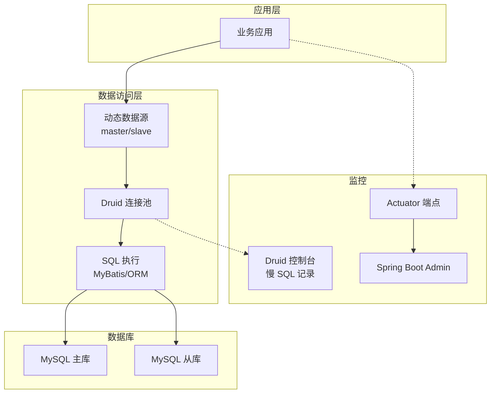
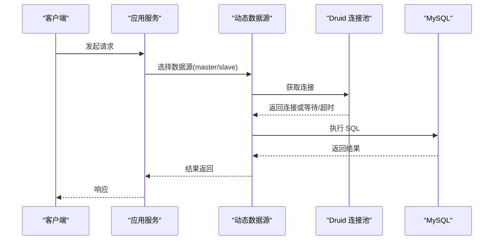
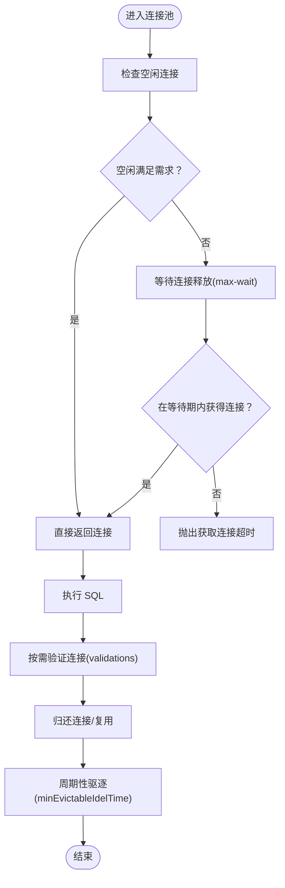
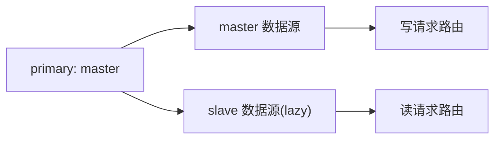
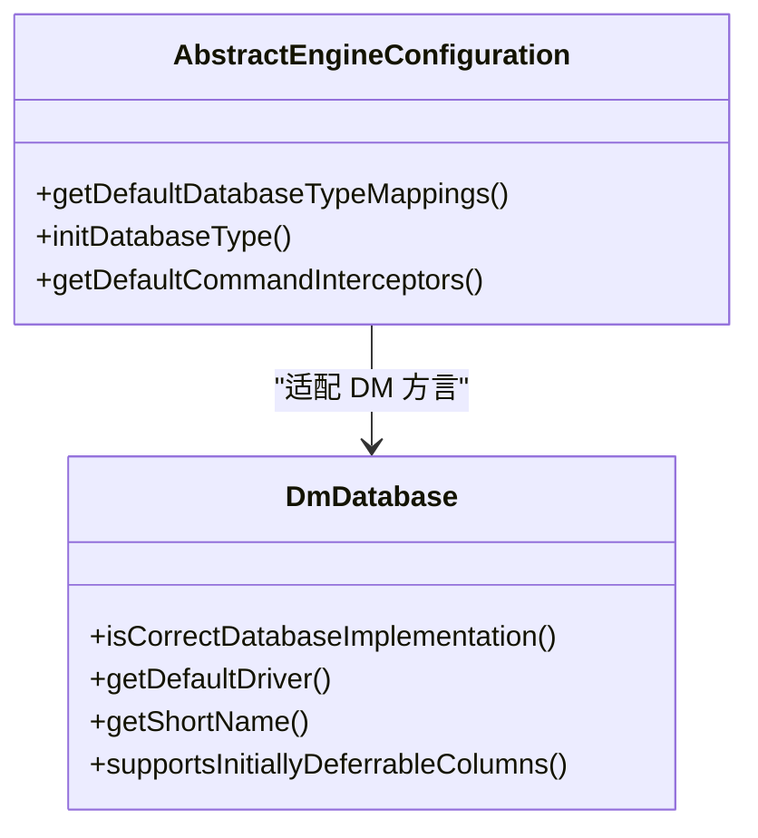
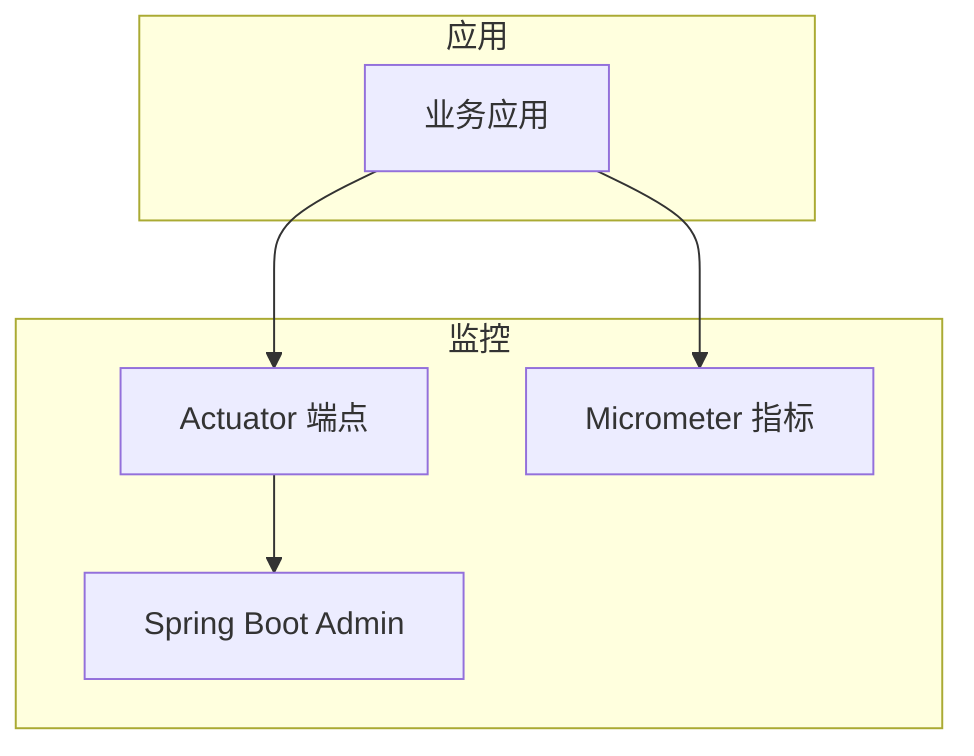
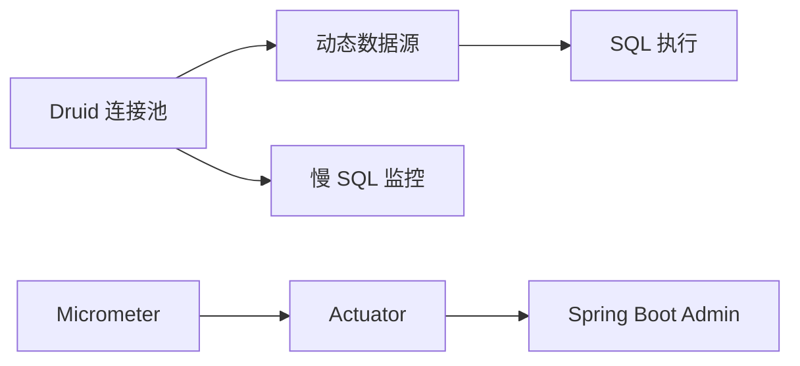
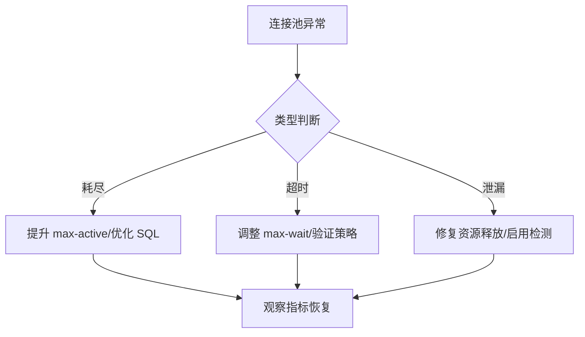

# 数据库问题排查

<cite>
**本文引用的文件**
- [application-dev.yaml](file://yudao-server/src/main/resources/application-dev.yaml)
- [AbstractEngineConfiguration.java](file://sql/dm/flowable-patch/src/main/java/org/flowable/common/engine/impl/AbstractEngineConfiguration.java)
- [DmDatabase.java](file://sql/dm/flowable-patch/src/main/java/liquibase/database/core/DmDatabase.java)
- [YudaoMetricsAutoConfiguration.java](file://yudao-framework/yudao-spring-boot-starter-monitor/src/main/java/cn/iocoder/yudao/framework/tracer/config/YudaoMetricsAutoConfiguration.java)
- [types.ts](file://yudao-ui/yudao-ui-admin-vue3/src/api/infra/redis/types.ts)
</cite>

## 目录
1. [简介](#简介)
2. [项目结构](#项目结构)
3. [核心组件](#核心组件)
4. [架构总览](#架构总览)
5. [详细组件分析](#详细组件分析)
6. [依赖关系分析](#依赖关系分析)
7. [性能考量](#性能考量)
8. [故障排查指南](#故障排查指南)
9. [结论](#结论)
10. [附录](#附录)

## 简介
本指南聚焦于数据库问题的系统化排查与解决，覆盖以下主题：
- 连接池问题：连接数耗尽、连接超时、连接泄漏的识别与处理
- 死锁检测与分析：日志解析、事务冲突定位、锁等待超时处置
- 慢查询分析：执行计划与索引使用检查、查询优化建议
- 多数据源配置问题：动态数据源切换、读写分离配置验证
- 性能监控指标与常见数据库错误的解决方案

本指南结合项目中的实际配置与实现，提供可操作的诊断步骤与可视化流程。

## 项目结构
本项目基于 Spring Boot，数据库层主要由以下部分组成：
- 连接池与监控：Druid 连接池配置与慢 SQL 监控
- 多数据源与读写分离：dynamic-datasource 配置
- 数据库方言与适配：Flowable/Liquibase 对多种数据库的支持
- 监控与指标：Micrometer + Actuator + Spring Boot Admin

图表来源
- [application-dev.yaml:32-57](file://yudao-server/src/main/resources/application-dev.yaml#L32-L57)
- [application-dev.yaml:14-28](file://yudao-server/src/main/resources/application-dev.yaml#L14-L28)

章节来源
- [application-dev.yaml:1-212](file://yudao-server/src/main/resources/application-dev.yaml#L1-L212)

## 核心组件
- 连接池与慢 SQL 监控
  - Druid 全局配置：初始连接、最小空闲、最大活跃、获取连接超时、空闲回收策略、验证查询、预编译语句缓存等
  - 慢 SQL 记录：阈值、慢 SQL 输出、SQL 合并统计
- 动态数据源与读写分离
  - primary 指定主库，master/slave 定义数据源，支持懒加载
- 数据库适配
  - Flowable/Liquibase 支持多种数据库类型映射与方言特性
- 监控与指标
  - Actuator 暴露端点，Spring Boot Admin 展示应用状态；Micrometer 统一指标标签

章节来源
- [application-dev.yaml:14-46](file://yudao-server/src/main/resources/application-dev.yaml#L14-L46)
- [application-dev.yaml:32-57](file://yudao-server/src/main/resources/application-dev.yaml#L32-L57)
- [AbstractEngineConfiguration.java:379-413](file://sql/dm/flowable-patch/src/main/java/org/flowable/common/engine/impl/AbstractEngineConfiguration.java#L379-L413)
- [YudaoMetricsAutoConfiguration.java:16-27](file://yudao-framework/yudao-spring-boot-starter-monitor/src/main/java/cn/iocoder/yudao/framework/tracer/config/YudaoMetricsAutoConfiguration.java#L16-L27)

## 架构总览
下图展示数据库访问链路与关键控制点，便于定位连接池、多数据源与监控问题。

图表来源
- [application-dev.yaml:32-57](file://yudao-server/src/main/resources/application-dev.yaml#L32-L57)
- [application-dev.yaml:14-46](file://yudao-server/src/main/resources/application-dev.yaml#L14-L46)

## 详细组件分析

### 连接池组件分析
- 关键参数与含义
  - 初始连接数：影响启动后可用连接数量
  - 最小空闲连接：维持的空闲连接数，避免频繁创建销毁
  - 最大活跃连接：并发上限，超过将触发等待或超时
  - 获取连接超时：max-wait，决定等待队列压力
  - 空闲回收策略：time-between-eviction-runs-millis、min/max-evictable-idle-time-millis
  - 验证查询：validation-query，确保连接有效性
  - 预编译语句缓存：pool-prepared-statements、max-pool-prepared-statement-per-connection-size
- 慢 SQL 监控
  - 开启 log-slow-sql，设置阈值 slow-sql-millis
  - 合并统计 merge-sql，便于发现重复慢查询

图表来源
- [application-dev.yaml:34-46](file://yudao-server/src/main/resources/application-dev.yaml#L34-L46)

章节来源
- [application-dev.yaml:14-46](file://yudao-server/src/main/resources/application-dev.yaml#L14-L46)

### 多数据源与读写分离分析
- 配置要点
  - primary: 指定默认数据源
  - datasource.master/slave: 定义主从库连接信息
  - slave.lazy: 启动时延迟加载从库，降低启动时间
- 故障排查
  - 确认主从库连通性与权限
  - 校验读写路由规则与注解/开关配置
  - 观察从库延迟与一致性

图表来源
- [application-dev.yaml:47-57](file://yudao-server/src/main/resources/application-dev.yaml#L47-L57)

章节来源
- [application-dev.yaml:32-57](file://yudao-server/src/main/resources/application-dev.yaml#L32-L57)

### 数据库适配与方言
- Flowable/Liquibase 支持多种数据库类型映射，包含 MySQL、Oracle、PostgreSQL、DB2、DM 等
- 通过数据库产品名推断类型，并针对特定数据库启用相应拦截器或功能

图表来源
- [AbstractEngineConfiguration.java:379-413](file://sql/dm/flowable-patch/src/main/java/org/flowable/common/engine/impl/AbstractEngineConfiguration.java#L379-L413)
- [DmDatabase.java:41-85](file://sql/dm/flowable-patch/src/main/java/liquibase/database/core/DmDatabase.java#L41-L85)

章节来源
- [AbstractEngineConfiguration.java:379-413](file://sql/dm/flowable-patch/src/main/java/org/flowable/common/engine/impl/AbstractEngineConfiguration.java#L379-L413)
- [DmDatabase.java:41-85](file://sql/dm/flowable-patch/src/main/java/liquibase/database/core/DmDatabase.java#L41-L85)

### 监控与指标
- Actuator 暴露端点，开放全部端点便于统一采集
- Spring Boot Admin 作为可视化界面展示应用状态
- Micrometer 自动注入 common tags，统一 application 标签

图表来源
- [application-dev.yaml:125-131](file://yudao-server/src/main/resources/application-dev.yaml#L125-L131)
- [YudaoMetricsAutoConfiguration.java:21-25](file://yudao-framework/yudao-spring-boot-starter-monitor/src/main/java/cn/iocoder/yudao/framework/tracer/config/YudaoMetricsAutoConfiguration.java#L21-L25)

章节来源
- [application-dev.yaml:125-131](file://yudao-server/src/main/resources/application-dev.yaml#L125-L131)
- [YudaoMetricsAutoConfiguration.java:16-27](file://yudao-framework/yudao-spring-boot-starter-monitor/src/main/java/cn/iocoder/yudao/framework/tracer/config/YudaoMetricsAutoConfiguration.java#L16-L27)

## 依赖关系分析
- 连接池依赖
  - Druid 连接池参数直接影响并发能力与资源占用
  - 慢 SQL 记录依赖 Druid 过滤器配置
- 多数据源依赖
  - dynamic-datasource 依赖 Druid 连接池与数据源配置
  - 读写分离依赖路由规则与注解
- 监控依赖
  - Actuator 依赖暴露端点配置
  - Micrometer 依赖 common tags 配置

图表来源
- [application-dev.yaml:14-46](file://yudao-server/src/main/resources/application-dev.yaml#L14-L46)
- [application-dev.yaml:32-57](file://yudao-server/src/main/resources/application-dev.yaml#L32-L57)
- [application-dev.yaml:125-131](file://yudao-server/src/main/resources/application-dev.yaml#L125-L131)
- [YudaoMetricsAutoConfiguration.java:21-25](file://yudao-framework/yudao-spring-boot-starter-monitor/src/main/java/cn/iocoder/yudao/framework/tracer/config/YudaoMetricsAutoConfiguration.java#L21-L25)

章节来源
- [application-dev.yaml:14-46](file://yudao-server/src/main/resources/application-dev.yaml#L14-L46)
- [application-dev.yaml:32-57](file://yudao-server/src/main/resources/application-dev.yaml#L32-L57)
- [application-dev.yaml:125-131](file://yudao-server/src/main/resources/application-dev.yaml#L125-L131)
- [YudaoMetricsAutoConfiguration.java:16-27](file://yudao-framework/yudao-spring-boot-starter-monitor/src/main/java/cn/iocoder/yudao/framework/tracer/config/YudaoMetricsAutoConfiguration.java#L16-L27)

## 性能考量
- 连接池参数调优
  - 根据 QPS 与 RT 设定 max-active 与 max-wait，避免过度扩容导致 GC 压力
  - 合理设置空闲回收参数，平衡连接复用与资源占用
- 慢 SQL 优化
  - 基于慢 SQL 记录定位热点 SQL，结合执行计划与索引使用情况优化
  - 控制预编译语句缓存规模，避免内存压力
- 监控与告警
  - 通过 Actuator 与 Spring Boot Admin 持续观察连接池健康度与应用状态
  - Micrometer 指标统一标签，便于跨服务对比

## 故障排查指南

### 连接池问题
- 连接数耗尽
  - 现象：大量请求等待获取连接，出现超时
  - 排查步骤：
    - 检查 max-active 与当前活跃连接数
    - 查看获取连接超时配置与等待队列长度
    - 分析慢 SQL，减少长事务与阻塞
  - 处置建议：
    - 适度提升 max-active，同时优化 SQL 与事务
    - 调整 max-wait，避免无限等待
- 连接超时
  - 现象：获取连接在 max-wait 内未成功
  - 排查步骤：
    - 检查数据库负载与网络延迟
    - 核对 validation-query 与连接验证策略
  - 处置建议：
    - 优化数据库性能，缩短事务时间
    - 调整验证策略与超时阈值
- 连接泄漏
  - 现象：活跃连接持续增长，最终耗尽
  - 排查步骤：
    - 确认业务代码正确关闭 Statement/ResultSet/Connection
    - 检查 Druid 连接池的 leak 监控与回收策略
  - 处置建议：
    - 使用 try-with-resources 或统一资源管理
    - 启用连接泄漏检测与报警

图表来源
- [application-dev.yaml:34-46](file://yudao-server/src/main/resources/application-dev.yaml#L34-L46)

章节来源
- [application-dev.yaml:14-46](file://yudao-server/src/main/resources/application-dev.yaml#L14-L46)

### 死锁检测与分析
- 死锁日志分析
  - 在数据库侧启用死锁日志记录（如 MySQL 的 innodb_print_all_deadlocks）
  - 结合业务事务边界，定位循环等待链路
- 事务冲突排查
  - 检查事务隔离级别与锁粒度
  - 排查相同资源的并发更新顺序差异
- 锁等待超时处理
  - 降低事务粒度与持续时间
  - 重试策略与幂等设计
  - 必要时调整锁策略或拆分热点资源

### 慢查询分析
- 执行计划分析
  - 使用 EXPLAIN/ANALYZE 分析 SQL 访问路径
  - 关注全表扫描、回表次数、临时表与排序
- 索引使用情况检查
  - 检查覆盖索引、最左前缀原则、索引选择性
  - 清理失效或冗余索引
- 查询优化建议
  - 减少不必要的 JOIN 与子查询
  - 使用分页与延迟关联
  - 控制参数化查询的复杂度

### 多数据源配置问题
- 动态数据源切换
  - 确认 primary 与数据源列表配置
  - 校验读写路由规则与注解开关
- 读写分离配置验证
  - 验证主从库连通性与权限
  - 观察从库延迟与一致性
  - 使用慢 SQL 与监控确认读写分离生效

章节来源
- [application-dev.yaml:32-57](file://yudao-server/src/main/resources/application-dev.yaml#L32-L57)

### 数据库性能监控指标与常见错误
- 连接池指标
  - 活跃连接数、空闲连接数、等待计数、超时计数
- 应用监控
  - Actuator 端点开放与 Spring Boot Admin 可视化
  - Micrometer 指标统一标签
- 常见错误与处理
  - 连接超时：调整超时与验证策略
  - 连接泄漏：完善资源释放与检测
  - 死锁：优化事务与锁顺序，引入重试

章节来源
- [application-dev.yaml:125-131](file://yudao-server/src/main/resources/application-dev.yaml#L125-L131)
- [YudaoMetricsAutoConfiguration.java:16-27](file://yudao-framework/yudao-spring-boot-starter-monitor/src/main/java/cn/iocoder/yudao/framework/tracer/config/YudaoMetricsAutoConfiguration.java#L16-L27)

## 结论
通过合理的连接池参数、完善的监控体系与规范的事务设计，可显著降低数据库层面的问题发生率。建议在生产环境中持续关注连接池健康度、慢 SQL 与死锁日志，并结合多数据源配置与监控指标进行闭环治理。

## 附录
- 相关配置参考路径
  - [application-dev.yaml:14-46](file://yudao-server/src/main/resources/application-dev.yaml#L14-L46)
  - [application-dev.yaml:32-57](file://yudao-server/src/main/resources/application-dev.yaml#L32-L57)
  - [application-dev.yaml:125-131](file://yudao-server/src/main/resources/application-dev.yaml#L125-L131)
  - [YudaoMetricsAutoConfiguration.java:16-27](file://yudao-framework/yudao-spring-boot-starter-monitor/src/main/java/cn/iocoder/yudao/framework/tracer/config/YudaoMetricsAutoConfiguration.java#L16-L27)
  - [AbstractEngineConfiguration.java:379-413](file://sql/dm/flowable-patch/src/main/java/org/flowable/common/engine/impl/AbstractEngineConfiguration.java#L379-L413)
  - [DmDatabase.java:41-85](file://sql/dm/flowable-patch/src/main/java/liquibase/database/core/DmDatabase.java#L41-L85)