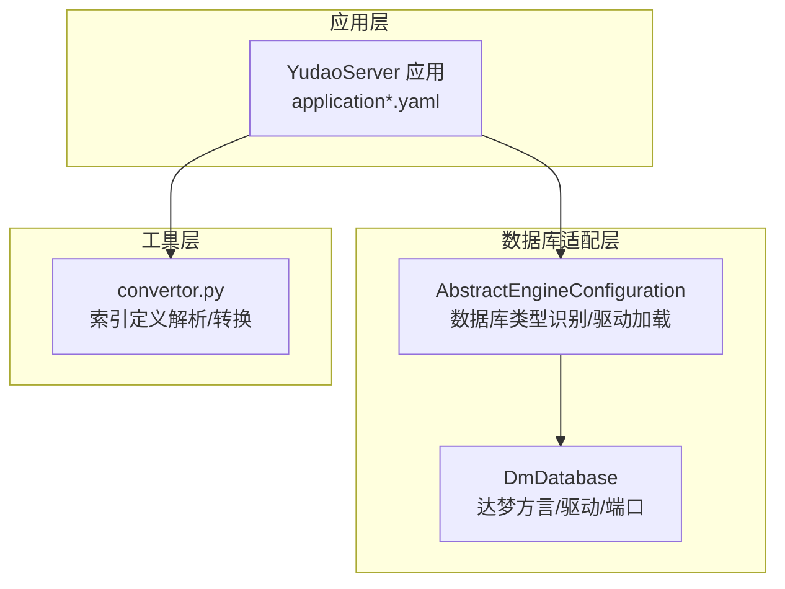
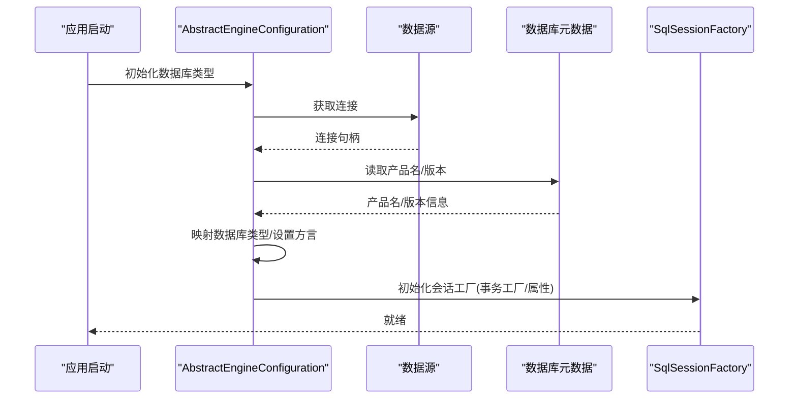
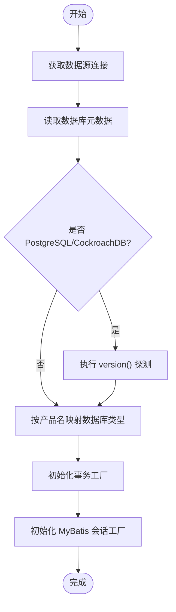
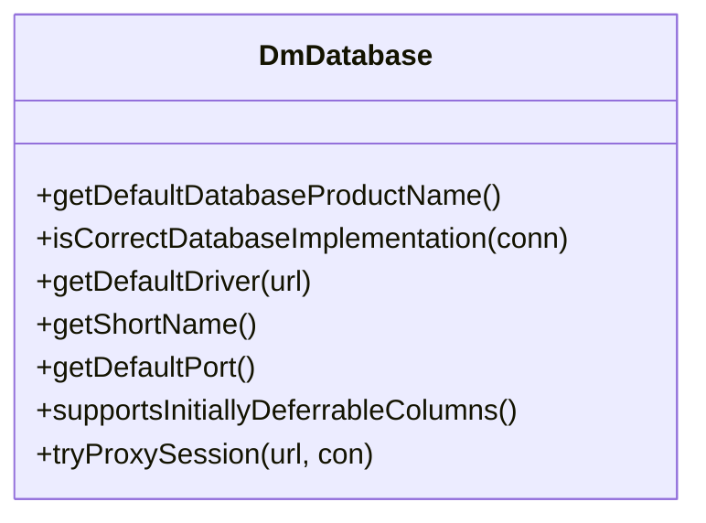
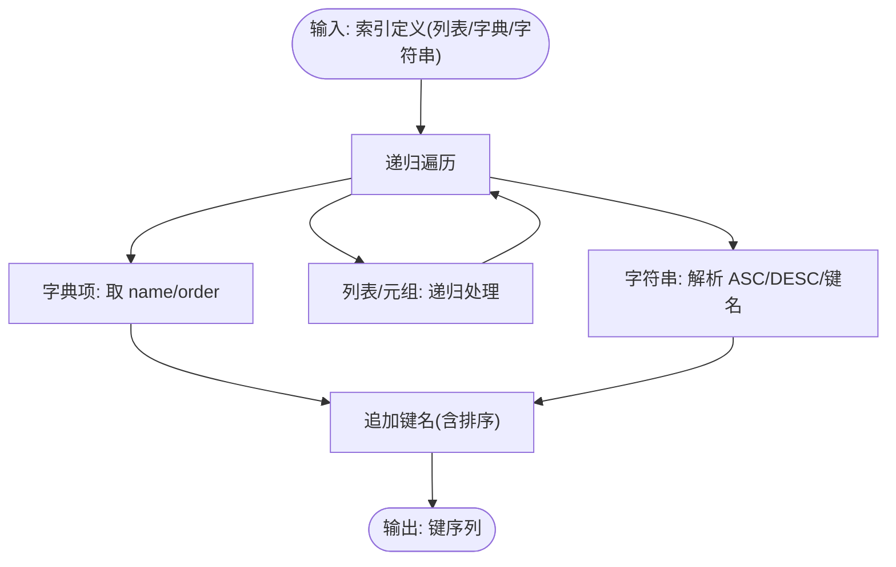
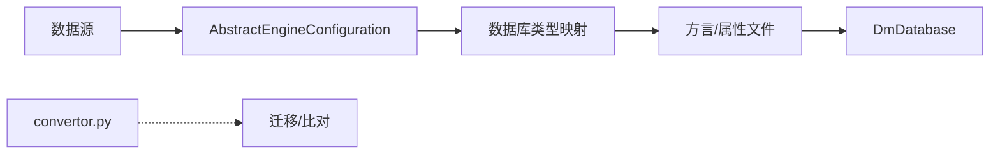

# 数据库问题排查

<cite>
**本文引用的文件**
- [AbstractEngineConfiguration.java](file://sql/dm/flowable-patch/src/main/java/org/flowable/common/engine/impl/AbstractEngineConfiguration.java)
- [DmDatabase.java](file://sql/dm/flowable-patch/src/main/java/liquibase/database/core/DmDatabase.java)
- [convertor.py](file://sql/tools/convertor.py)
- [application.yaml](file://yudao-server/src/main/resources/application.yaml)
- [application-dev.yaml](file://yudao-server/src/main/resources/application-dev.yaml)
- [application-local.yaml](file://yudao-server/src/main/resources/application-local.yaml)
</cite>

## 目录
1. [简介](#简介)
2. [项目结构](#项目结构)
3. [核心组件](#核心组件)
4. [架构总览](#架构总览)
5. [详细组件分析](#详细组件分析)
6. [依赖关系分析](#依赖关系分析)
7. [性能考量](#性能考量)
8. [故障排查指南](#故障排查指南)
9. [结论](#结论)
10. [附录](#附录)

## 简介
本文件面向数据库运维与开发人员，系统化梳理数据库问题排查方法，覆盖连接异常、SQL 执行失败、连接池耗尽、死锁等常见故障；针对 MySQL、PostgreSQL、DM 等数据库类型给出差异化配置与优化建议；提供慢查询分析、索引优化、查询计划分析等性能调优思路；并总结备份恢复与数据迁移中的应急处理策略及监控指标的异常判断方法。

## 项目结构
围绕数据库相关的关键位置与文件如下：
- 数据库类型识别与驱动选择：通过引擎配置类自动识别数据库类型，并加载对应驱动与属性。
- DM 数据库适配：自定义数据库方言以支持达梦数据库的特性。
- SQL 工具：索引定义解析与转换工具，辅助索引一致性检查与迁移。
- 应用配置：后端服务的环境配置文件，包含数据库连接参数示例与默认值。

**图表来源**
- [AbstractEngineConfiguration.java:496-543](file://sql/dm/flowable-patch/src/main/java/org/flowable/common/engine/impl/AbstractEngineConfiguration.java#L496-L543)
- [DmDatabase.java:41-93](file://sql/dm/flowable-patch/src/main/java/liquibase/database/core/DmDatabase.java#L41-L93)
- [convertor.py:246-282](file://sql/tools/convertor.py#L246-L282)
- [application.yaml](file://yudao-server/src/main/resources/application.yaml)

**章节来源**
- [AbstractEngineConfiguration.java:496-543](file://sql/dm/flowable-patch/src/main/java/org/flowable/common/engine/impl/AbstractEngineConfiguration.java#L496-L543)
- [DmDatabase.java:41-93](file://sql/dm/flowable-patch/src/main/java/liquibase/database/core/DmDatabase.java#L41-L93)
- [convertor.py:246-282](file://sql/tools/convertor.py#L246-L282)
- [application.yaml](file://yudao-server/src/main/resources/application.yaml)

## 核心组件
- 数据库类型识别与驱动加载
  - 自动根据 JDBC 元数据推断数据库类型，并映射到具体方言与属性文件。
  - 支持 CockroachDB 版本探测，特殊拦截器启用。
- 达梦数据库适配
  - 提供达梦数据库的产品名、默认驱动、短名、默认端口、特性开关等。
- SQL 工具
  - 将不同来源的索引定义统一为标准键序列，便于比对与迁移。

**章节来源**
- [AbstractEngineConfiguration.java:367-543](file://sql/dm/flowable-patch/src/main/java/org/flowable/common/engine/impl/AbstractEngineConfiguration.java#L367-L543)
- [DmDatabase.java:41-93](file://sql/dm/flowable-patch/src/main/java/liquibase/database/core/DmDatabase.java#L41-L93)
- [convertor.py:246-282](file://sql/tools/convertor.py#L246-L282)

## 架构总览
数据库侧关键流程：应用启动时加载数据源，引擎配置类识别数据库类型，选择驱动与属性，初始化 MyBatis 会话工厂与事务工厂，随后执行 SQL。

**图表来源**
- [AbstractEngineConfiguration.java:496-543](file://sql/dm/flowable-patch/src/main/java/org/flowable/common/engine/impl/AbstractEngineConfiguration.java#L496-L543)
- [AbstractEngineConfiguration.java:833-876](file://sql/dm/flowable-patch/src/main/java/org/flowable/common/engine/impl/AbstractEngineConfiguration.java#L833-L876)

## 详细组件分析

### 组件A：数据库类型识别与驱动加载
- 关键职责
  - 从数据源获取连接，读取数据库产品名与版本，进行类型映射。
  - 特殊处理 PostgreSQL/CockroachDB 的版本探测。
  - 初始化事务工厂、MyBatis 会话工厂与属性（如表前缀、转义字符等）。
- 异常风险
  - 无法获取连接或元数据异常会导致类型识别失败。
  - 不匹配的驱动或方言可能导致 SQL 方言错误。
- 优化建议
  - 在配置中显式指定数据库类型，避免运行时探测失败。
  - 使用与驱动版本匹配的方言属性文件，确保分页、函数等语法正确。

**图表来源**
- [AbstractEngineConfiguration.java:496-543](file://sql/dm/flowable-patch/src/main/java/org/flowable/common/engine/impl/AbstractEngineConfiguration.java#L496-L543)
- [AbstractEngineConfiguration.java:833-876](file://sql/dm/flowable-patch/src/main/java/org/flowable/common/engine/impl/AbstractEngineConfiguration.java#L833-L876)

**章节来源**
- [AbstractEngineConfiguration.java:496-543](file://sql/dm/flowable-patch/src/main/java/org/flowable/common/engine/impl/AbstractEngineConfiguration.java#L496-L543)
- [AbstractEngineConfiguration.java:833-876](file://sql/dm/flowable-patch/src/main/java/org/flowable/common/engine/impl/AbstractEngineConfiguration.java#L833-L876)

### 组件B：达梦数据库适配
- 关键职责
  - 提供达梦数据库的产品名、默认驱动类、短名、默认端口。
  - 支持初始可延迟约束等特性。
- 适用场景
  - 在达梦数据库上部署时，确保驱动与端口正确，避免连接失败。
- 注意事项
  - 若使用代理用户，需确保代理会话打开逻辑可用。

**图表来源**
- [DmDatabase.java:41-93](file://sql/dm/flowable-patch/src/main/java/liquibase/database/core/DmDatabase.java#L41-L93)
- [DmDatabase.java:139-152](file://sql/dm/flowable-patch/src/main/java/liquibase/database/core/DmDatabase.java#L139-L152)

**章节来源**
- [DmDatabase.java:41-93](file://sql/dm/flowable-patch/src/main/java/liquibase/database/core/DmDatabase.java#L41-L93)
- [DmDatabase.java:139-152](file://sql/dm/flowable-patch/src/main/java/liquibase/database/core/DmDatabase.java#L139-L152)

### 组件C：索引定义解析与转换
- 关键职责
  - 将不同格式的索引定义（普通索引、唯一索引）统一解析为标准键序列，便于比较与迁移。
- 使用建议
  - 在迁移前后对比解析结果，快速定位索引差异。
  - 对于 DESC 排序键，确保解析输出包含排序标记。

**图表来源**
- [convertor.py:246-282](file://sql/tools/convertor.py#L246-L282)

**章节来源**
- [convertor.py:246-282](file://sql/tools/convertor.py#L246-L282)

## 依赖关系分析
- 引擎配置依赖数据源与数据库元数据，用于动态识别数据库类型与方言。
- 达梦方言作为数据库方言实现之一，参与类型识别与驱动选择。
- SQL 工具独立于运行时配置，用于离线或迁移阶段的索引一致性检查。

**图表来源**
- [AbstractEngineConfiguration.java:367-543](file://sql/dm/flowable-patch/src/main/java/org/flowable/common/engine/impl/AbstractEngineConfiguration.java#L367-L543)
- [DmDatabase.java:41-93](file://sql/dm/flowable-patch/src/main/java/liquibase/database/core/DmDatabase.java#L41-L93)
- [convertor.py:246-282](file://sql/tools/convertor.py#L246-L282)

**章节来源**
- [AbstractEngineConfiguration.java:367-543](file://sql/dm/flowable-patch/src/main/java/org/flowable/common/engine/impl/AbstractEngineConfiguration.java#L367-L543)
- [DmDatabase.java:41-93](file://sql/dm/flowable-patch/src/main/java/liquibase/database/core/DmDatabase.java#L41-L93)
- [convertor.py:246-282](file://sql/tools/convertor.py#L246-L282)

## 性能考量
- 慢查询分析
  - 启用 SQL 执行时间日志插件，定位耗时语句。
  - 结合数据库 EXPLAIN/ANALYZE 输出，查看执行计划与索引使用情况。
- 索引优化
  - 使用索引定义解析工具生成标准键序列，对比迁移前后索引差异。
  - 避免冗余索引与重复前缀，减少维护成本。
- 查询计划分析
  - 关注全表扫描、回表次数、排序/临时表使用。
  - 针对高并发场景，评估覆盖索引与过滤条件的选择性。

[本节为通用指导，无需列出“章节来源”]

## 故障排查指南

### 1. 数据库连接异常
- 现象
  - 应用启动时报连接失败、驱动找不到、端口不可达。
- 诊断步骤
  - 检查数据源配置（URL、用户名、密码、驱动类）。
  - 确认数据库类型识别是否成功，必要时显式指定数据库类型。
  - 对达梦数据库，确认驱动类与默认端口。
- 解决方案
  - 补充正确的 JDBC 驱动与依赖。
  - 调整连接参数与网络访问策略。
  - 如使用代理用户，确保代理会话可用。

**章节来源**
- [AbstractEngineConfiguration.java:496-543](file://sql/dm/flowable-patch/src/main/java/org/flowable/common/engine/impl/AbstractEngineConfiguration.java#L496-L543)
- [DmDatabase.java:41-93](file://sql/dm/flowable-patch/src/main/java/liquibase/database/core/DmDatabase.java#L41-L93)

### 2. SQL 执行失败
- 现象
  - 语法错误、方言不兼容、参数过多限制。
- 诊断步骤
  - 核对数据库类型映射与方言属性文件。
  - 检查 SQL 方言（如分页、函数、转义字符）。
  - 对 SQL Server 类型，关注参数上限限制。
- 解决方案
  - 切换到兼容的方言或调整 SQL。
  - 分批提交或拆分批量插入，规避参数上限。

**章节来源**
- [AbstractEngineConfiguration.java:538-543](file://sql/dm/flowable-patch/src/main/java/org/flowable/common/engine/impl/AbstractEngineConfiguration.java#L538-L543)
- [AbstractEngineConfiguration.java:833-876](file://sql/dm/flowable-patch/src/main/java/org/flowable/common/engine/impl/AbstractEngineConfiguration.java#L833-L876)

### 3. 连接池耗尽
- 现象
  - 请求堆积、超时、连接获取失败。
- 诊断步骤
  - 观察连接池指标（活跃连接、空闲连接、等待时间）。
  - 检查事务未提交、长事务、未关闭资源。
- 解决方案
  - 调整连接池大小与超时阈值。
  - 优化业务逻辑，缩短事务时长。
  - 启用连接泄漏检测与健康检查。

[本节为通用指导，无需列出“章节来源”]

### 4. 死锁问题
- 现象
  - 事务相互等待，数据库返回死锁错误。
- 诊断步骤
  - 查看数据库死锁日志与锁等待链。
  - 分析热点表与高并发更新路径。
- 解决方案
  - 统一更新顺序，减少交叉锁竞争。
  - 缩小事务范围，降低锁持有时间。
  - 必要时引入重试与幂等控制。

[本节为通用指导，无需列出“章节来源”]

### 5. 不同数据库类型的连接配置与优化
- MySQL
  - 使用标准驱动与端口，注意字符集与时区配置。
  - 合理设置连接池大小与超时，开启连接复用。
- PostgreSQL
  - 注意版本差异与扩展支持，必要时启用额外插件。
  - 使用 EXPLAIN/EXPLAIN ANALYZE 分析计划。
- DM（达梦）
  - 使用达梦驱动与默认端口，确认代理用户会话。
  - 开启必要的特性开关以匹配业务需求。

**章节来源**
- [DmDatabase.java:41-93](file://sql/dm/flowable-patch/src/main/java/liquibase/database/core/DmDatabase.java#L41-L93)
- [AbstractEngineConfiguration.java:496-543](file://sql/dm/flowable-patch/src/main/java/org/flowable/common/engine/impl/AbstractEngineConfiguration.java#L496-L543)

### 6. 备份恢复与数据迁移应急处理
- 备份失败
  - 检查存储空间、权限与备份工具参数。
  - 优先尝试增量备份或分段备份。
- 恢复异常
  - 校验备份完整性与版本兼容性。
  - 逐步恢复并验证关键表数据一致性。
- 数据不一致
  - 使用索引定义解析工具生成标准键序列，快速比对差异。
  - 对比主从复制位点或变更日志，定位缺失记录。

**章节来源**
- [convertor.py:246-282](file://sql/tools/convertor.py#L246-L282)

### 7. 监控指标与异常判断
- 连接数
  - 关注活跃连接与最大连接数阈值，防止连接池耗尽。
- 查询响应时间
  - 通过 SQL 执行时间日志定位慢查询。
- 锁等待时间
  - 监控锁等待与死锁计数，及时发现并发瓶颈。

**章节来源**
- [AbstractEngineConfiguration.java:894-896](file://sql/dm/flowable-patch/src/main/java/org/flowable/common/engine/impl/AbstractEngineConfiguration.java#L894-L896)

## 结论
通过自动化的数据库类型识别、方言与驱动适配、以及索引定义解析工具，可以显著提升数据库问题的诊断效率与迁移准确性。结合连接池与锁监控指标，能够快速定位并缓解连接异常、SQL 执行失败、连接池耗尽与死锁等常见问题。针对不同数据库类型（MySQL、PostgreSQL、DM），应采用相应的配置与优化策略，确保系统稳定与性能达标。

## 附录
- 配置参考
  - 应用配置文件包含数据库连接参数示例，建议结合实际环境调整。
- 工具使用
  - 在迁移前后使用索引解析工具生成键序列，进行一致性比对。

**章节来源**
- [application.yaml](file://yudao-server/src/main/resources/application.yaml)
- [application-dev.yaml](file://yudao-server/src/main/resources/application-dev.yaml)
- [application-local.yaml](file://yudao-server/src/main/resources/application-local.yaml)