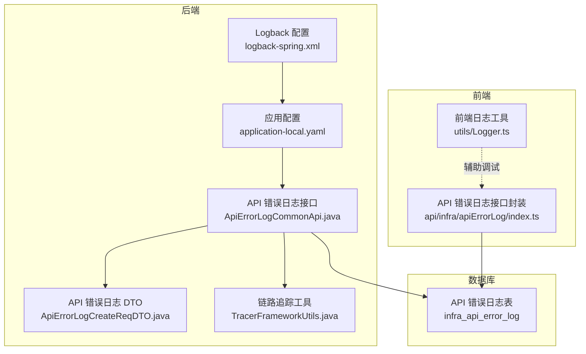
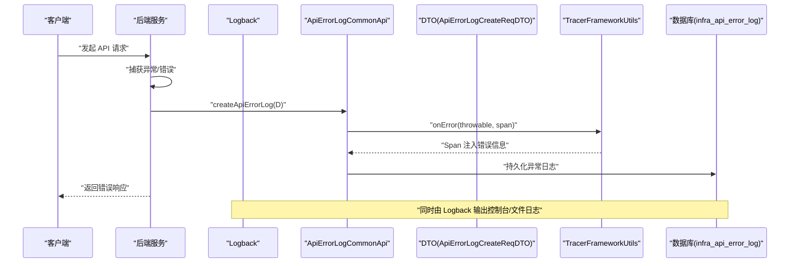
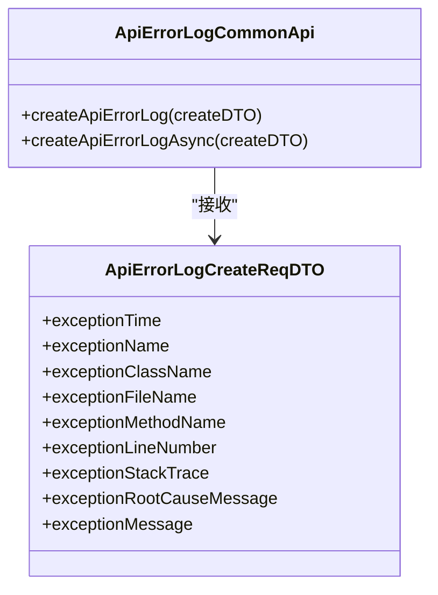
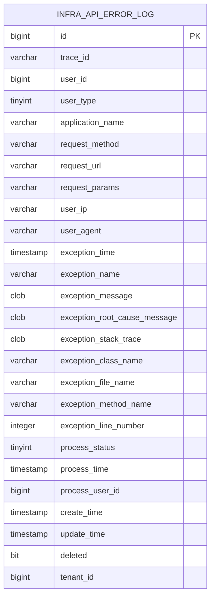
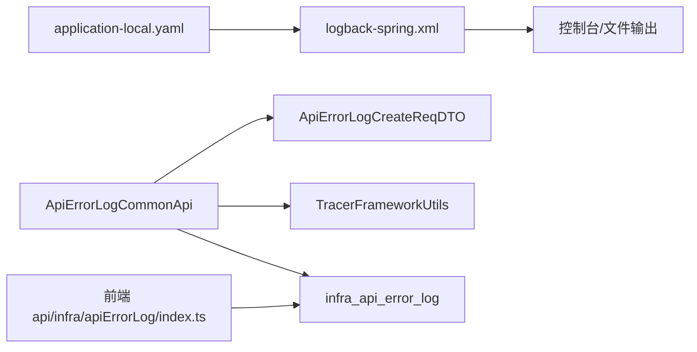

# 日志分析

<cite>
**本文引用的文件**
- [yudao-server/src/main/resources/logback-spring.xml](file://yudao-server/src/main/resources/logback-spring.xml)
- [yudao-server/src/main/resources/application-local.yaml](file://yudao-server/src/main/resources/application-local.yaml)
- [yudao-module-infra/src/test/resources/sql/create_tables.sql](file://yudao-module-infra/src/test/resources/sql/create_tables.sql)
- [yudao-ui/yudao-ui-admin-vue3/src/api/infra/apiErrorLog/index.ts](file://yudao-ui/yudao-ui-admin-vue3/src/api/infra/apiErrorLog/index.ts)
- [yudao-framework/yudao-common/src/main/java/cn/iocoder/yudao/framework/common/biz/infra/logger/ApiErrorLogCommonApi.java](file://yudao-framework/yudao-common/src/main/java/cn/iocoder/yudao/framework/common/biz/infra/logger/ApiErrorLogCommonApi.java)
- [yudao-framework/yudao-common/src/main/java/cn/iocoder/yudao/framework/common/biz/infra/logger/dto/ApiErrorLogCreateReqDTO.java](file://yudao-framework/yudao-common/src/main/java/cn/iocoder/yudao/framework/common/biz/infra/logger/dto/ApiErrorLogCreateReqDTO.java)
- [yudao-framework/yudao-spring-boot-starter-monitor/src/main/java/cn/iocoder/yudao/framework/tracer/core/util/TracerFrameworkUtils.java](file://yudao-framework/yudao-spring-boot-starter-monitor/src/main/java/cn/iocoder/yudao/framework/tracer/core/util/TracerFrameworkUtils.java)
- [yudao-ui/yudao-ui-admin-vue3/src/utils/Logger.ts](file://yudao-ui/yudao-ui-admin-vue3/src/utils/Logger.ts)
</cite>

## 目录
1. [简介](#简介)
2. [项目结构](#项目结构)
3. [核心组件](#核心组件)
4. [架构总览](#架构总览)
5. [详细组件分析](#详细组件分析)
6. [依赖关系分析](#依赖关系分析)
7. [性能考量](#性能考量)
8. [故障排查指南](#故障排查指南)
9. [结论](#结论)
10. [附录](#附录)

## 简介
本指南面向开发者与运维人员，系统讲解本项目的日志体系与分析方法，覆盖以下主题：
- Logback 配置文件结构与参数设置
- 日志级别与适用场景
- 关键错误日志定位与异常堆栈分析
- API 错误日志的字段含义与查询方法
- 日志聚合与分析技巧（含 ELK Stack 思路）
- API 错误日志表结构与常用查询语句

## 项目结构
本项目采用 Spring Boot + Logback 的标准日志方案，并通过统一的基础设施模块提供 API 错误日志采集与管理能力。前端提供 API 错误日志的分页查询、导出与处理状态更新能力。

图表来源
- [yudao-server/src/main/resources/logback-spring.xml:1-56](file://yudao-server/src/main/resources/logback-spring.xml#L1-L56)
- [yudao-server/src/main/resources/application-local.yaml:171-202](file://yudao-server/src/main/resources/application-local.yaml#L171-L202)
- [yudao-framework/yudao-common/src/main/java/cn/iocoder/yudao/framework/common/biz/infra/logger/ApiErrorLogCommonApi.java:1-32](file://yudao-framework/yudao-common/src/main/java/cn/iocoder/yudao/framework/common/biz/infra/logger/ApiErrorLogCommonApi.java#L1-L32)
- [yudao-framework/yudao-common/src/main/java/cn/iocoder/yudao/framework/common/biz/infra/logger/dto/ApiErrorLogCreateReqDTO.java:60-107](file://yudao-framework/yudao-common/src/main/java/cn/iocoder/yudao/framework/common/biz/infra/logger/dto/ApiErrorLogCreateReqDTO.java#L60-L107)
- [yudao-framework/yudao-spring-boot-starter-monitor/src/main/java/cn/iocoder/yudao/framework/tracer/core/util/TracerFrameworkUtils.java:1-46](file://yudao-framework/yudao-spring-boot-starter-monitor/src/main/java/cn/iocoder/yudao/framework/tracer/core/util/TracerFrameworkUtils.java#L1-L46)
- [yudao-module-infra/src/test/resources/sql/create_tables.sql:117-147](file://yudao-module-infra/src/test/resources/sql/create_tables.sql#L117-L147)
- [yudao-ui/yudao-ui-admin-vue3/src/api/infra/apiErrorLog/index.ts:1-48](file://yudao-ui/yudao-ui-admin-vue3/src/api/infra/apiErrorLog/index.ts#L1-L48)
- [yudao-ui/yudao-ui-admin-vue3/src/utils/Logger.ts:1-100](file://yudao-ui/yudao-ui-admin-vue3/src/utils/Logger.ts#L1-L100)

章节来源
- [yudao-server/src/main/resources/logback-spring.xml:1-56](file://yudao-server/src/main/resources/logback-spring.xml#L1-L56)
- [yudao-server/src/main/resources/application-local.yaml:171-202](file://yudao-server/src/main/resources/application-local.yaml#L171-L202)

## 核心组件
- Logback 配置：控制台与滚动文件输出、异步写入、可选 SkyWalking 日志采集。
- 应用日志级别：按模块精细控制 SQL 与业务日志输出，避免重复与噪声。
- API 错误日志接口：统一创建 API 异常日志，支持同步与异步两种调用方式。
- API 错误日志 DTO：标准化异常信息结构，便于入库与检索。
- 链路追踪工具：将异常信息注入 Span，便于集中观测。
- 前端 API 错误日志接口封装：提供分页查询、导出与处理状态更新。
- 数据库表：infra_api_error_log 存储 API 异常日志，包含堆栈与处理状态。

章节来源
- [yudao-framework/yudao-common/src/main/java/cn/iocoder/yudao/framework/common/biz/infra/logger/ApiErrorLogCommonApi.java:1-32](file://yudao-framework/yudao-common/src/main/java/cn/iocoder/yudao/framework/common/biz/infra/logger/ApiErrorLogCommonApi.java#L1-L32)
- [yudao-framework/yudao-common/src/main/java/cn/iocoder/yudao/framework/common/biz/infra/logger/dto/ApiErrorLogCreateReqDTO.java:60-107](file://yudao-framework/yudao-common/src/main/java/cn/iocoder/yudao/framework/common/biz/infra/logger/dto/ApiErrorLogCreateReqDTO.java#L60-L107)
- [yudao-framework/yudao-spring-boot-starter-monitor/src/main/java/cn/iocoder/yudao/framework/tracer/core/util/TracerFrameworkUtils.java:1-46](file://yudao-framework/yudao-spring-boot-starter-monitor/src/main/java/cn/iocoder/yudao/framework/tracer/core/util/TracerFrameworkUtils.java#L1-L46)
- [yudao-module-infra/src/test/resources/sql/create_tables.sql:117-147](file://yudao-module-infra/src/test/resources/sql/create_tables.sql#L117-L147)
- [yudao-ui/yudao-ui-admin-vue3/src/api/infra/apiErrorLog/index.ts:1-48](file://yudao-ui/yudao-ui-admin-vue3/src/api/infra/apiErrorLog/index.ts#L1-L48)

## 架构总览
下图展示从请求到日志落库的关键流程，包括日志采集、异步写入与前端查询。

图表来源
- [yudao-framework/yudao-common/src/main/java/cn/iocoder/yudao/framework/common/biz/infra/logger/ApiErrorLogCommonApi.java:1-32](file://yudao-framework/yudao-common/src/main/java/cn/iocoder/yudao/framework/common/biz/infra/logger/ApiErrorLogCommonApi.java#L1-L32)
- [yudao-framework/yudao-common/src/main/java/cn/iocoder/yudao/framework/common/biz/infra/logger/dto/ApiErrorLogCreateReqDTO.java:60-107](file://yudao-framework/yudao-common/src/main/java/cn/iocoder/yudao/framework/common/biz/infra/logger/dto/ApiErrorLogCreateReqDTO.java#L60-L107)
- [yudao-framework/yudao-spring-boot-starter-monitor/src/main/java/cn/iocoder/yudao/framework/tracer/core/util/TracerFrameworkUtils.java:1-46](file://yudao-framework/yudao-spring-boot-starter-monitor/src/main/java/cn/iocoder/yudao/framework/tracer/core/util/TracerFrameworkUtils.java#L1-L46)
- [yudao-module-infra/src/test/resources/sql/create_tables.sql:117-147](file://yudao-module-infra/src/test/resources/sql/create_tables.sql#L117-L147)

## 详细组件分析

### Logback 配置与参数详解
- 控制台输出：使用 PatternLayoutEncoder，控制台模式对级别与类名进行高亮，便于快速识别。
- 文件输出：RollingFileAppender，按日期与大小滚动，保留最近 30 天日志，单文件最大 10MB。
- 异步写入：AsyncAppender，开启不丢日志模式，队列深度 512，显著提升吞吐。
- 可选 SkyWalking：GRPC 日志采集器，用于对接链路追踪平台实现日志中心。
- 根日志级别：默认 INFO；开发环境可同时输出到控制台与异步文件。

章节来源
- [yudao-server/src/main/resources/logback-spring.xml:1-56](file://yudao-server/src/main/resources/logback-spring.xml#L1-L56)

### 日志级别与适用场景
- TRACE：极细粒度诊断，适合排查复杂链路问题。
- DEBUG：业务与 SQL 调试，建议仅在开发或特定模块启用。
- INFO：常规运行信息，生产环境主级别。
- WARN：潜在问题但不影响功能，需关注。
- ERROR：错误事件，必须处理与告警。

章节来源
- [yudao-server/src/main/resources/application-local.yaml:171-202](file://yudao-server/src/main/resources/application-local.yaml#L171-L202)

### API 错误日志接口与 DTO
- 接口职责：提供同步与异步创建 API 错误日志的能力，默认异步实现直接委托同步实现，确保可靠性。
- DTO 字段：包含异常时间、异常名、类名、文件名、方法名、行号、完整堆栈、根因消息、普通消息等，满足定位与归档需求。

图表来源
- [yudao-framework/yudao-common/src/main/java/cn/iocoder/yudao/framework/common/biz/infra/logger/ApiErrorLogCommonApi.java:1-32](file://yudao-framework/yudao-common/src/main/java/cn/iocoder/yudao/framework/common/biz/infra/logger/ApiErrorLogCommonApi.java#L1-L32)
- [yudao-framework/yudao-common/src/main/java/cn/iocoder/yudao/framework/common/biz/infra/logger/dto/ApiErrorLogCreateReqDTO.java:60-107](file://yudao-framework/yudao-common/src/main/java/cn/iocoder/yudao/framework/common/biz/infra/logger/dto/ApiErrorLogCreateReqDTO.java#L60-L107)

章节来源
- [yudao-framework/yudao-common/src/main/java/cn/iocoder/yudao/framework/common/biz/infra/logger/ApiErrorLogCommonApi.java:1-32](file://yudao-framework/yudao-common/src/main/java/cn/iocoder/yudao/framework/common/biz/infra/logger/ApiErrorLogCommonApi.java#L1-L32)
- [yudao-framework/yudao-common/src/main/java/cn/iocoder/yudao/framework/common/biz/infra/logger/dto/ApiErrorLogCreateReqDTO.java:60-107](file://yudao-framework/yudao-common/src/main/java/cn/iocoder/yudao/framework/common/biz/infra/logger/dto/ApiErrorLogCreateReqDTO.java#L60-L107)

### 链路追踪与异常记录
- 将异常对象、类型、消息与堆栈写入 Span，便于统一观测与关联。
- 通过 onError 方法自动标记错误标签，简化埋点成本。

章节来源
- [yudao-framework/yudao-spring-boot-starter-monitor/src/main/java/cn/iocoder/yudao/framework/tracer/core/util/TracerFrameworkUtils.java:1-46](file://yudao-framework/yudao-spring-boot-starter-monitor/src/main/java/cn/iocoder/yudao/framework/tracer/core/util/TracerFrameworkUtils.java#L1-L46)

### 前端 API 错误日志管理
- 分页查询：支持按条件筛选与排序。
- 导出 Excel：便于离线分析与归档。
- 更新处理状态：支持将异常日志标记为已处理，配合后续治理。

章节来源
- [yudao-ui/yudao-ui-admin-vue3/src/api/infra/apiErrorLog/index.ts:1-48](file://yudao-ui/yudao-ui-admin-vue3/src/api/infra/apiErrorLog/index.ts#L1-L48)

### API 错误日志表结构与字段说明
- 主要字段：trace_id、user_id、user_type、application_name、request_method、request_url、request_params、user_ip、user_agent、exception_*（时间、名称、消息、根因、堆栈、类名、文件、方法、行号）、process_status、process_time、process_user_id、tenant_id 等。
- 用途：统一存储 API 异常，支撑查询、导出、统计与趋势分析。

图表来源
- [yudao-module-infra/src/test/resources/sql/create_tables.sql:117-147](file://yudao-module-infra/src/test/resources/sql/create_tables.sql#L117-L147)

## 依赖关系分析
- Logback 与应用配置：Logback 负责输出格式与落盘策略，application-local.yaml 控制日志级别与输出位置。
- API 错误日志：ApiErrorLogCommonApi 作为统一入口，依赖 DTO 结构化异常信息，并可通过 TracerFrameworkUtils 注入链路信息。
- 前端：通过封装的 API 进行查询、导出与状态更新，最终落到 infra_api_error_log 表。

图表来源
- [yudao-server/src/main/resources/logback-spring.xml:1-56](file://yudao-server/src/main/resources/logback-spring.xml#L1-L56)
- [yudao-server/src/main/resources/application-local.yaml:171-202](file://yudao-server/src/main/resources/application-local.yaml#L171-L202)
- [yudao-framework/yudao-common/src/main/java/cn/iocoder/yudao/framework/common/biz/infra/logger/ApiErrorLogCommonApi.java:1-32](file://yudao-framework/yudao-common/src/main/java/cn/iocoder/yudao/framework/common/biz/infra/logger/ApiErrorLogCommonApi.java#L1-L32)
- [yudao-framework/yudao-common/src/main/java/cn/iocoder/yudao/framework/common/biz/infra/logger/dto/ApiErrorLogCreateReqDTO.java:60-107](file://yudao-framework/yudao-common/src/main/java/cn/iocoder/yudao/framework/common/biz/infra/logger/dto/ApiErrorLogCreateReqDTO.java#L60-L107)
- [yudao-framework/yudao-spring-boot-starter-monitor/src/main/java/cn/iocoder/yudao/framework/tracer/core/util/TracerFrameworkUtils.java:1-46](file://yudao-framework/yudao-spring-boot-starter-monitor/src/main/java/cn/iocoder/yudao/framework/tracer/core/util/TracerFrameworkUtils.java#L1-L46)
- [yudao-module-infra/src/test/resources/sql/create_tables.sql:117-147](file://yudao-module-infra/src/test/resources/sql/create_tables.sql#L117-L147)
- [yudao-ui/yudao-ui-admin-vue3/src/api/infra/apiErrorLog/index.ts:1-48](file://yudao-ui/yudao-ui-admin-vue3/src/api/infra/apiErrorLog/index.ts#L1-L48)

## 性能考量
- 异步日志：AsyncAppender 在高并发下显著降低 I/O 阻塞，建议生产环境开启。
- 滚动策略：按大小与时间滚动，避免单文件过大影响读取与传输。
- 日志级别：避免全局 DEBUG，按模块精细化控制，减少冗余日志。
- 前端日志：utils/Logger.ts 仅用于浏览器控制台调试，不替代后端日志。

章节来源
- [yudao-server/src/main/resources/logback-spring.xml:30-35](file://yudao-server/src/main/resources/logback-spring.xml#L30-L35)
- [yudao-ui/yudao-ui-admin-vue3/src/utils/Logger.ts:1-100](file://yudao-ui/yudao-ui-admin-vue3/src/utils/Logger.ts#L1-L100)

## 故障排查指南

### 快速定位关键错误日志
- 查看控制台输出：确认异常是否被 Logback 正常输出。
- 检查文件日志：确认 RollingFileAppender 是否正常滚动与落盘。
- 定位异常堆栈：优先查看 exception_stack_trace 字段，结合 exception_class_name、exception_method_name、exception_line_number 精确定位代码位置。
- 关联链路：若启用链路追踪，可在 Span 中查看错误标签与堆栈。

章节来源
- [yudao-server/src/main/resources/logback-spring.xml:1-56](file://yudao-server/src/main/resources/logback-spring.xml#L1-L56)
- [yudao-framework/yudao-spring-boot-starter-monitor/src/main/java/cn/iocoder/yudao/framework/tracer/core/util/TracerFrameworkUtils.java:1-46](file://yudao-framework/yudao-spring-boot-starter-monitor/src/main/java/cn/iocoder/yudao/framework/tracer/core/util/TracerFrameworkUtils.java#L1-L46)

### API 错误日志字段含义与查询方法
- 字段含义：异常时间、异常名、异常消息、根因消息、堆栈、类名、文件、方法、行号、处理状态与时间等。
- 查询方法：前端提供分页查询接口，支持按用户、应用、URL、时间范围等条件筛选。
- 导出与处理：支持导出 Excel 并更新处理状态，便于闭环管理。

章节来源
- [yudao-ui/yudao-ui-admin-vue3/src/api/infra/apiErrorLog/index.ts:1-48](file://yudao-ui/yudao-ui-admin-vue3/src/api/infra/apiErrorLog/index.ts#L1-L48)
- [yudao-module-infra/src/test/resources/sql/create_tables.sql:117-147](file://yudao-module-infra/src/test/resources/sql/create_tables.sql#L117-L147)

### 日志过滤与搜索技巧
- 使用日志级别过滤：ERROR/WARN/INFO/DEBUG/TRACE。
- 使用关键字过滤：异常类名、方法名、URL、trace_id。
- 时间范围：结合 exception_time 或日志文件名中的日期进行筛选。
- 前端辅助：utils/Logger.ts 可在浏览器控制台以彩色方式输出对象与表格，便于快速对比。

章节来源
- [yudao-ui/yudao-ui-admin-vue3/src/utils/Logger.ts:1-100](file://yudao-ui/yudao-ui-admin-vue3/src/utils/Logger.ts#L1-L100)

### 错误趋势分析与 ELK Stack 使用思路
- 结合日志内容与异常类型进行分类统计，识别高频异常与热点接口。
- 若接入 ELK Stack，可将 Logback 输出重定向至 Filebeat，再由 Logstash 解析，最后存入 Elasticsearch，Kibana 可视化。
- 建议在日志中保留 trace_id，便于跨系统串联定位。

[本节为通用实践建议，不直接分析具体文件]

### API 错误日志表常用查询语句
- 按异常名与时间范围统计
- 按应用与 URL 聚合错误次数
- 按 trace_id 关联链路信息
- 导出近 N 天的异常明细

[本节为通用实践建议，不直接分析具体文件]

## 结论
本项目通过规范的 Logback 配置与精细化的日志级别控制，结合统一的 API 错误日志接口与前端管理能力，形成了“可观测、可追溯、可治理”的日志体系。建议在生产环境中：
- 默认使用 AsyncAppender 与合理的滚动策略
- 按模块控制日志级别，避免噪声
- 利用前端分页查询与导出能力进行日常治理
- 在需要时接入链路追踪与 ELK Stack，实现统一分析与可视化

[本节为总结性内容，不直接分析具体文件]

## 附录

### 日志级别与适用场景对照
- TRACE：排查复杂链路与第三方交互
- DEBUG：SQL 与业务逻辑调试
- INFO：常规运行信息
- WARN：潜在风险
- ERROR：错误事件，必须处理

章节来源
- [yudao-server/src/main/resources/application-local.yaml:171-202](file://yudao-server/src/main/resources/application-local.yaml#L171-L202)

### 前端日志工具使用提示
- 支持彩色输出与对象/表格展示，便于在浏览器控制台快速核对数据结构。
- 仅用于本地调试，不替代后端日志。

章节来源
- [yudao-ui/yudao-ui-admin-vue3/src/utils/Logger.ts:1-100](file://yudao-ui/yudao-ui-admin-vue3/src/utils/Logger.ts#L1-L100)