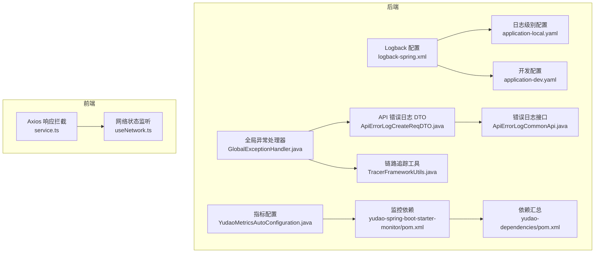
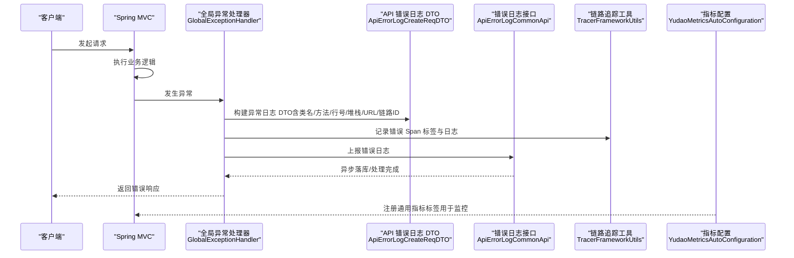
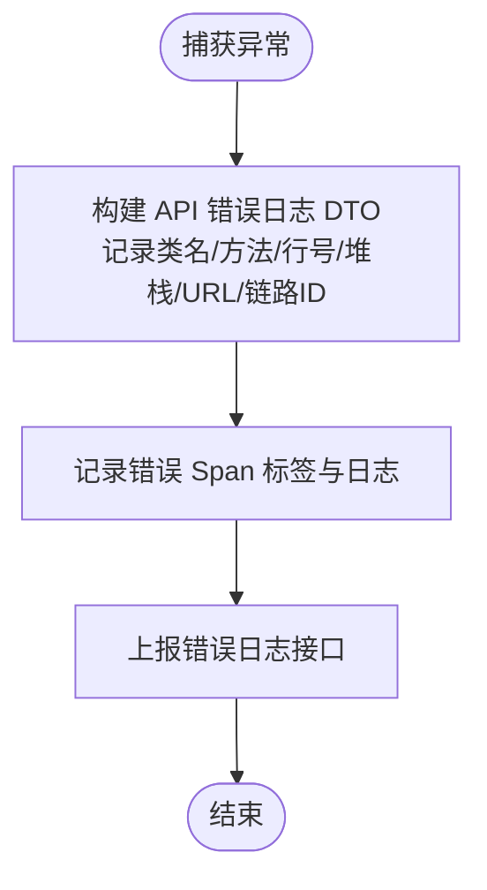
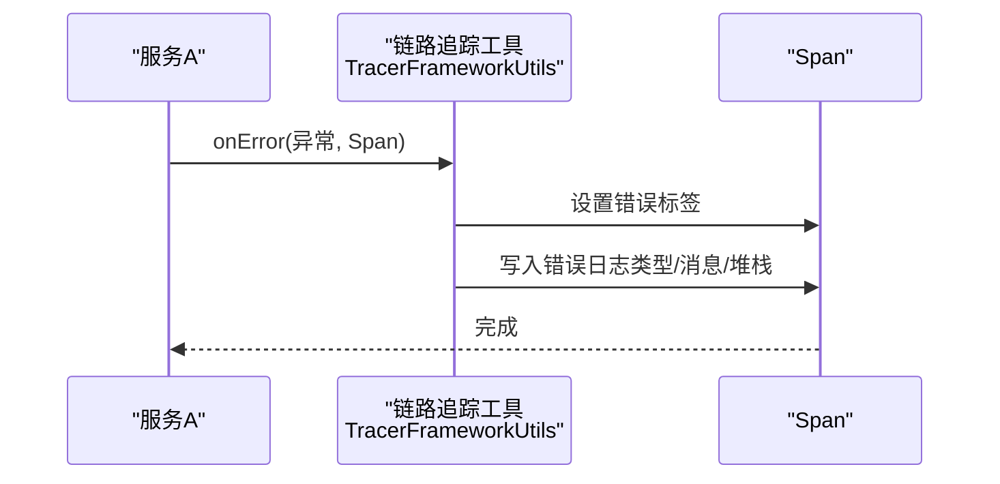
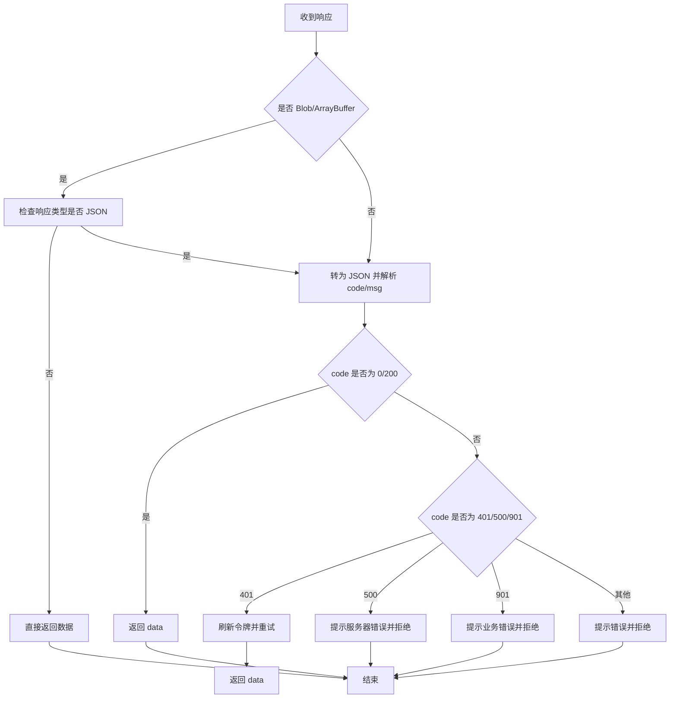
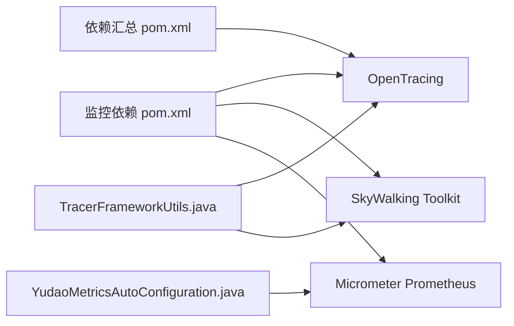

# 日志分析

<cite>
**本文引用的文件**
- [logback-spring.xml](file://yudao-server/src/main/resources/logback-spring.xml)
- [application-dev.yaml](file://yudao-server/src/main/resources/application-dev.yaml)
- [application-local.yaml](file://yudao-server/src/main/resources/application-local.yaml)
- [GlobalExceptionHandler.java](file://yudao-framework/yudao-spring-boot-starter-web/src/main/java/cn/iocoder/yudao/framework/web/core/handler/GlobalExceptionHandler.java)
- [ApiErrorLogCreateReqDTO.java](file://yudao-framework/yudao-common/src/main/java/cn/iocoder/yudao/framework/common/biz/infra/logger/dto/ApiErrorLogCreateReqDTO.java)
- [ApiErrorLogCommonApi.java](file://yudao-framework/yudao-common/src/main/java/cn/iocoder/yudao/framework/common/biz/infra/logger/ApiErrorLogCommonApi.java)
- [TracerFrameworkUtils.java](file://yudao-framework/yudao-spring-boot-starter-monitor/src/main/java/cn/iocoder/yudao/framework/tracer/core/util/TracerFrameworkUtils.java)
- [YudaoMetricsAutoConfiguration.java](file://yudao-framework/yudao-spring-boot-starter-monitor/src/main/java/cn/iocoder/yudao/framework/tracer/config/YudaoMetricsAutoConfiguration.java)
- [pom.xml（监控依赖）](file://yudao-framework/yudao-spring-boot-starter-monitor/pom.xml)
- [pom.xml（依赖汇总）](file://yudao-dependencies/pom.xml)
- [service.ts（Axios 响应处理）](file://yudao-ui/yudao-ui-admin-vue3/src/config/axios/service.ts)
- [useNetwork.ts（网络状态监听）](file://yudao-ui/yudao-ui-admin-vue3/src/hooks/web/useNetwork.ts)
</cite>

## 目录
1. [简介](#简介)
2. [项目结构](#项目结构)
3. [核心组件](#核心组件)
4. [架构总览](#架构总览)
5. [详细组件分析](#详细组件分析)
6. [依赖分析](#依赖分析)
7. [性能考虑](#性能考虑)
8. [故障排查指南](#故障排查指南)
9. [结论](#结论)
10. [附录](#附录)

## 简介
本文件面向后端与前端工程师，系统性梳理本项目的日志体系与分析方法，涵盖日志结构与级别、异常堆栈分析、请求链路追踪、业务日志解读、前端错误定位、日志聚合与分析平台对接、以及关键指标监控与告警实践。读者可据此快速定位线上问题、建立标准化的日志采集与分析流程。

## 项目结构
- 后端采用 Spring Boot + Logback，通过 logback-spring.xml 配置控制台与文件输出格式、滚动策略与异步落盘；通过 application-local.yaml 与 application-dev.yaml 精细控制日志级别与输出位置。
- 全局异常处理器将异常信息结构化为 API 错误日志 DTO，并携带链路 ID、应用名、请求地址与堆栈等关键信息，便于统一存储与检索。
- 前端通过 Axios 拦截器统一处理响应与错误，结合浏览器控制台与网络面板进行前端问题定位。
- 监控侧引入 Micrometer 与 SkyWalking 相关依赖，支持指标打点与日志中心对接（按需启用）。

图表来源
- [logback-spring.xml:1-56](file://yudao-server/src/main/resources/logback-spring.xml#L1-L56)
- [application-local.yaml:171-202](file://yudao-server/src/main/resources/application-local.yaml#L171-L202)
- [application-dev.yaml:146-149](file://yudao-server/src/main/resources/application-dev.yaml#L146-L149)
- [GlobalExceptionHandler.java:355-375](file://yudao-framework/yudao-spring-boot-starter-web/src/main/java/cn/iocoder/yudao/framework/web/core/handler/GlobalExceptionHandler.java#L355-L375)
- [ApiErrorLogCreateReqDTO.java:60-107](file://yudao-framework/yudao-common/src/main/java/cn/iocoder/yudao/framework/common/biz/infra/logger/dto/ApiErrorLogCreateReqDTO.java#L60-L107)
- [ApiErrorLogCommonApi.java:1-32](file://yudao-framework/yudao-common/src/main/java/cn/iocoder/yudao/framework/common/biz/infra/logger/ApiErrorLogCommonApi.java#L1-L32)
- [TracerFrameworkUtils.java:1-46](file://yudao-framework/yudao-spring-boot-starter-monitor/src/main/java/cn/iocoder/yudao/framework/tracer/core/util/TracerFrameworkUtils.java#L1-L46)
- [YudaoMetricsAutoConfiguration.java:1-27](file://yudao-framework/yudao-spring-boot-starter-monitor/src/main/java/cn/iocoder/yudao/framework/tracer/config/YudaoMetricsAutoConfiguration.java#L1-L27)
- [pom.xml（监控依赖）:37-79](file://yudao-framework/yudao-spring-boot-starter-monitor/pom.xml#L37-L79)
- [pom.xml（依赖汇总）:359-374](file://yudao-dependencies/pom.xml#L359-L374)
- [service.ts:133-239](file://yudao-ui/yudao-ui-admin-vue3/src/config/axios/service.ts#L133-L239)
- [useNetwork.ts:1-21](file://yudao-ui/yudao-ui-admin-vue3/src/hooks/web/useNetwork.ts#L1-L21)

章节来源
- [logback-spring.xml:1-56](file://yudao-server/src/main/resources/logback-spring.xml#L1-L56)
- [application-local.yaml:171-202](file://yudao-server/src/main/resources/application-local.yaml#L171-L202)
- [application-dev.yaml:146-149](file://yudao-server/src/main/resources/application-dev.yaml#L146-L149)

## 核心组件
- 日志格式与输出
  - 控制台与文件输出模式、高亮样式、线程与行号信息均在 Logback 配置中定义，便于快速识别异常与定位调用栈。
  - 文件滚动策略按“大小+时间”滚动，保留历史天数与单文件上限，兼顾磁盘占用与查询效率。
  - 异步 Appender 提升写入性能，避免阻塞业务线程。
- 日志级别与配置
  - application-local.yaml 与 application-dev.yaml 提供细粒度日志级别配置，针对特定包或 Mapper 输出 debug/INFO 等级日志，避免重复打印与噪声。
  - logging.file.name 指定日志文件路径，便于集中采集与归档。
- 全局异常日志
  - GlobalExceptionHandler 构建 ApiErrorLogCreateReqDTO，包含异常类名、方法、行号、根因消息、完整堆栈、请求地址、链路 ID、应用名等，统一上报至后端日志系统。
- 链路追踪与指标
  - TracerFrameworkUtils 将异常写入 Span 并标记错误标签，便于链路追踪平台关联错误上下文。
  - YudaoMetricsAutoConfiguration 为 Micrometer 注册通用标签，便于 Prometheus 抓取与告警。
- 前端错误处理
  - Axios 响应拦截器统一解析 code、msg、超时与网络错误，结合浏览器控制台与网络面板进行前端问题定位。
  - useNetwork.ts 监听在线/离线事件，辅助判断前端网络相关问题。

章节来源
- [logback-spring.xml:1-56](file://yudao-server/src/main/resources/logback-spring.xml#L1-L56)
- [application-local.yaml:171-202](file://yudao-server/src/main/resources/application-local.yaml#L171-L202)
- [application-dev.yaml:146-149](file://yudao-server/src/main/resources/application-dev.yaml#L146-L149)
- [GlobalExceptionHandler.java:355-375](file://yudao-framework/yudao-spring-boot-starter-web/src/main/java/cn/iocoder/yudao/framework/web/core/handler/GlobalExceptionHandler.java#L355-L375)
- [ApiErrorLogCreateReqDTO.java:60-107](file://yudao-framework/yudao-common/src/main/java/cn/iocoder/yudao/framework/common/biz/infra/logger/dto/ApiErrorLogCreateReqDTO.java#L60-L107)
- [ApiErrorLogCommonApi.java:1-32](file://yudao-framework/yudao-common/src/main/java/cn/iocoder/yudao/framework/common/biz/infra/logger/ApiErrorLogCommonApi.java#L1-L32)
- [TracerFrameworkUtils.java:1-46](file://yudao-framework/yudao-spring-boot-starter-monitor/src/main/java/cn/iocoder/yudao/framework/tracer/core/util/TracerFrameworkUtils.java#L1-L46)
- [YudaoMetricsAutoConfiguration.java:1-27](file://yudao-framework/yudao-spring-boot-starter-monitor/src/main/java/cn/iocoder/yudao/framework/tracer/config/YudaoMetricsAutoConfiguration.java#L1-L27)
- [service.ts:133-239](file://yudao-ui/yudao-ui-admin-vue3/src/config/axios/service.ts#L133-L239)
- [useNetwork.ts:1-21](file://yudao-ui/yudao-ui-admin-vue3/src/hooks/web/useNetwork.ts#L1-L21)

## 架构总览
下图展示了从请求进入后端，到异常被捕获、结构化记录、链路追踪与指标打点的整体流程。

图表来源
- [GlobalExceptionHandler.java:355-375](file://yudao-framework/yudao-spring-boot-starter-web/src/main/java/cn/iocoder/yudao/framework/web/core/handler/GlobalExceptionHandler.java#L355-L375)
- [ApiErrorLogCreateReqDTO.java:60-107](file://yudao-framework/yudao-common/src/main/java/cn/iocoder/yudao/framework/common/biz/infra/logger/dto/ApiErrorLogCreateReqDTO.java#L60-L107)
- [ApiErrorLogCommonApi.java:1-32](file://yudao-framework/yudao-common/src/main/java/cn/iocoder/yudao/framework/common/biz/infra/logger/ApiErrorLogCommonApi.java#L1-L32)
- [TracerFrameworkUtils.java:1-46](file://yudao-framework/yudao-spring-boot-starter-monitor/src/main/java/cn/iocoder/yudao/framework/tracer/core/util/TracerFrameworkUtils.java#L1-L46)
- [YudaoMetricsAutoConfiguration.java:1-27](file://yudao-framework/yudao-spring-boot-starter-monitor/src/main/java/cn/iocoder/yudao/framework/tracer/config/YudaoMetricsAutoConfiguration.java#L1-L27)

## 详细组件分析

### 日志结构与级别
- 结构组成
  - 时间戳、线程名、日志级别、Logger 名称与行号、消息正文。
  - 控制台输出额外高亮，便于快速识别 ERROR/WARN/INFO/DEBUG 等级别。
- 级别建议与使用场景
  - ERROR：严重错误、异常根因、不可恢复问题。用于触发告警与根因分析。
  - WARN：潜在风险、边界条件、非致命异常。用于观察趋势与阈值预警。
  - INFO：常规业务事件、关键流程节点、对外接口调用结果。用于审计与业务核对。
  - DEBUG：调试细节、SQL 语句、参数与返回值。仅在问题定位阶段开启，避免生产噪声。
- 级别配置要点
  - application-local.yaml 针对各模块 Mapper 与业务包设置合适级别，避免重复打印与噪声。
  - application-dev.yaml 指定日志文件输出路径，便于本地开发与联调。

章节来源
- [logback-spring.xml:1-56](file://yudao-server/src/main/resources/logback-spring.xml#L1-L56)
- [application-local.yaml:171-202](file://yudao-server/src/main/resources/application-local.yaml#L171-L202)
- [application-dev.yaml:146-149](file://yudao-server/src/main/resources/application-dev.yaml#L146-L149)

### 异常堆栈分析
- 全局异常日志
  - 构建 ApiErrorLogCreateReqDTO，包含异常类名、方法、行号、根因消息、完整堆栈、请求地址、链路 ID、应用名等。
  - 通过 TracerFrameworkUtils 将异常写入 Span，便于在链路追踪平台查看错误上下文。
- 分析步骤
  - 依据异常类名与根因消息快速定位模块与职责范围。
  - 查看堆栈中首个 StackTraceElement 的类/方法/行号，结合业务代码定位问题入口。
  - 若涉及数据库/缓存/第三方接口，结合对应日志级别与 SQL/命令输出进行交叉验证。

图表来源
- [GlobalExceptionHandler.java:355-375](file://yudao-framework/yudao-spring-boot-starter-web/src/main/java/cn/iocoder/yudao/framework/web/core/handler/GlobalExceptionHandler.java#L355-L375)
- [ApiErrorLogCreateReqDTO.java:60-107](file://yudao-framework/yudao-common/src/main/java/cn/iocoder/yudao/framework/common/biz/infra/logger/dto/ApiErrorLogCreateReqDTO.java#L60-L107)
- [TracerFrameworkUtils.java:1-46](file://yudao-framework/yudao-spring-boot-starter-monitor/src/main/java/cn/iocoder/yudao/framework/tracer/core/util/TracerFrameworkUtils.java#L1-L46)

章节来源
- [GlobalExceptionHandler.java:355-375](file://yudao-framework/yudao-spring-boot-starter-web/src/main/java/cn/iocoder/yudao/framework/web/core/handler/GlobalExceptionHandler.java#L355-L375)
- [ApiErrorLogCreateReqDTO.java:60-107](file://yudao-framework/yudao-common/src/main/java/cn/iocoder/yudao/framework/common/biz/infra/logger/dto/ApiErrorLogCreateReqDTO.java#L60-L107)
- [TracerFrameworkUtils.java:1-46](file://yudao-framework/yudao-spring-boot-starter-monitor/src/main/java/cn/iocoder/yudao/framework/tracer/core/util/TracerFrameworkUtils.java#L1-L46)

### 请求链路追踪
- 错误标注
  - TracerFrameworkUtils 在异常发生时设置 Span 的错误标签，并记录异常对象、类型、消息与堆栈，便于在链路追踪平台（如 SkyWalking）中串联错误上下文。
- 实践建议
  - 在关键业务入口/出口埋点，确保 traceId 贯穿整个调用链。
  - 结合后端日志中的 traceId 字段，跨服务定位问题。

图表来源
- [TracerFrameworkUtils.java:1-46](file://yudao-framework/yudao-spring-boot-starter-monitor/src/main/java/cn/iocoder/yudao/framework/tracer/core/util/TracerFrameworkUtils.java#L1-L46)

章节来源
- [TracerFrameworkUtils.java:1-46](file://yudao-framework/yudao-spring-boot-starter-monitor/src/main/java/cn/iocoder/yudao/framework/tracer/core/util/TracerFrameworkUtils.java#L1-L46)

### 业务日志解读
- 日志级别与业务核对
  - INFO 级别用于记录关键业务事件与对外接口调用结果，便于审计与核对。
  - DEBUG 级别用于 SQL 语句与参数输出，定位参数绑定与返回值问题。
- 配置策略
  - application-local.yaml 针对各模块 Mapper 与业务包设置合适级别，避免重复打印与噪声。
  - application-dev.yaml 指定日志文件输出路径，便于本地开发与联调。

章节来源
- [application-local.yaml:171-202](file://yudao-server/src/main/resources/application-local.yaml#L171-L202)
- [application-dev.yaml:146-149](file://yudao-server/src/main/resources/application-dev.yaml#L146-L149)

### 前端错误信息定位
- Axios 响应处理
  - 统一解析 code、msg，区分 401 刷新令牌、500 服务器错误、901 业务错误等场景，结合国际化文案与通知组件反馈给用户。
  - 对网络错误、超时、状态码失败进行分类提示，便于前端快速定位问题类型。
- 浏览器控制台与网络面板
  - 结合控制台错误、网络面板请求失败/超时、资源加载错误，定位前端脚本、接口调用与静态资源问题。
- 网络状态监听
  - useNetwork.ts 监听在线/离线事件，辅助判断前端网络相关问题。

图表来源
- [service.ts:133-239](file://yudao-ui/yudao-ui-admin-vue3/src/config/axios/service.ts#L133-L239)

章节来源
- [service.ts:133-239](file://yudao-ui/yudao-ui-admin-vue3/src/config/axios/service.ts#L133-L239)
- [useNetwork.ts:1-21](file://yudao-ui/yudao-ui-admin-vue3/src/hooks/web/useNetwork.ts#L1-L21)

### 日志聚合与分析平台
- Logback 与文件输出
  - logback-spring.xml 定义控制台与文件输出格式、滚动策略与异步 Appender，便于对接 ELK/Splunk 等日志平台。
- SkyWalking 日志中心（可选）
  - logback-spring.xml 中提供 SkyWalking GRPC 日志收集 Appender 注释示例，按需启用以接入日志中心。
- Micrometer 与 Prometheus
  - YudaoMetricsAutoConfiguration 为 Micrometer 注册通用标签，便于 Prometheus 抓取指标并配置告警规则。

章节来源
- [logback-spring.xml:37-56](file://yudao-server/src/main/resources/logback-spring.xml#L37-L56)
- [YudaoMetricsAutoConfiguration.java:1-27](file://yudao-framework/yudao-spring-boot-starter-monitor/src/main/java/cn/iocoder/yudao/framework/tracer/config/YudaoMetricsAutoConfiguration.java#L1-L27)
- [pom.xml（监控依赖）:37-79](file://yudao-framework/yudao-spring-boot-starter-monitor/pom.xml#L37-L79)
- [pom.xml（依赖汇总）:359-374](file://yudao-dependencies/pom.xml#L359-L374)

### 关键日志指标监控与告警
- 指标来源
  - 通过 Micrometer 暴露指标，结合通用标签（如 application），在 Prometheus 中抓取错误率、响应时间、吞吐量等核心指标。
- 告警策略
  - 错误率：单位时间内 ERROR/WARN 级别日志占比超过阈值触发告警。
  - 响应时间：接口 P95/P99 延迟超过阈值触发告警。
  - 吞吐量：QPS/TPS 异常波动触发告警。
- 建议
  - 将 traceId 与指标关联，实现“指标异常—链路追踪—日志定位”的闭环。

章节来源
- [YudaoMetricsAutoConfiguration.java:1-27](file://yudao-framework/yudao-spring-boot-starter-monitor/src/main/java/cn/iocoder/yudao/framework/tracer/config/YudaoMetricsAutoConfiguration.java#L1-L27)
- [pom.xml（监控依赖）:37-79](file://yudao-framework/yudao-spring-boot-starter-monitor/pom.xml#L37-L79)
- [pom.xml（依赖汇总）:359-374](file://yudao-dependencies/pom.xml#L359-L374)

## 依赖分析
- 监控与链路追踪依赖
  - yudao-spring-boot-starter-monitor/pom.xml 引入 OpenTracing、SkyWalking Toolkit 与 Micrometer Prometheus 支持。
  - yudao-dependencies/pom.xml 统一管理 OpenTracing 版本，保证依赖一致性。
- 耦合关系
  - TracerFrameworkUtils 与 OpenTracing/SkyWalking Toolkit 解耦，便于按需启用。
  - YudaoMetricsAutoConfiguration 仅注册通用标签，不直接耦合具体业务。

图表来源
- [pom.xml（监控依赖）:37-79](file://yudao-framework/yudao-spring-boot-starter-monitor/pom.xml#L37-L79)
- [pom.xml（依赖汇总）:359-374](file://yudao-dependencies/pom.xml#L359-L374)
- [TracerFrameworkUtils.java:1-46](file://yudao-framework/yudao-spring-boot-starter-monitor/src/main/java/cn/iocoder/yudao/framework/tracer/core/util/TracerFrameworkUtils.java#L1-L46)
- [YudaoMetricsAutoConfiguration.java:1-27](file://yudao-framework/yudao-spring-boot-starter-monitor/src/main/java/cn/iocoder/yudao/framework/tracer/config/YudaoMetricsAutoConfiguration.java#L1-L27)

章节来源
- [pom.xml（监控依赖）:37-79](file://yudao-framework/yudao-spring-boot-starter-monitor/pom.xml#L37-L79)
- [pom.xml（依赖汇总）:359-374](file://yudao-dependencies/pom.xml#L359-L374)
- [TracerFrameworkUtils.java:1-46](file://yudao-framework/yudao-spring-boot-starter-monitor/src/main/java/cn/iocoder/yudao/framework/tracer/core/util/TracerFrameworkUtils.java#L1-L46)
- [YudaoMetricsAutoConfiguration.java:1-27](file://yudao-framework/yudao-spring-boot-starter-monitor/src/main/java/cn/iocoder/yudao/framework/tracer/config/YudaoMetricsAutoConfiguration.java#L1-L27)

## 性能考虑
- 异步日志写入
  - 通过 AsyncAppender 提升日志写入性能，避免阻塞业务线程。
- 滚动策略
  - SizeAndTimeBasedRollingPolicy 在控制日志文件大小的同时保留历史天数，平衡磁盘占用与查询效率。
- 日志级别控制
  - 在生产环境尽量避免 DEBUG 级别大范围开启，减少 IO 压力与噪声。

章节来源
- [logback-spring.xml:1-56](file://yudao-server/src/main/resources/logback-spring.xml#L1-L56)
- [application-local.yaml:171-202](file://yudao-server/src/main/resources/application-local.yaml#L171-L202)

## 故障排查指南
- 后端异常排查
  - 依据 ApiErrorLogCreateReqDTO 中的异常类名、方法、行号与根因消息快速定位模块。
  - 结合 TracerFrameworkUtils 写入的 Span 日志，查看错误标签与堆栈，串联链路上下文。
  - 检查 application-local.yaml 中对应包的日志级别，确认是否需要临时提升以获取更多信息。
- 前端错误排查
  - 通过 Axios 响应拦截器的错误分支判断错误类型（网络、超时、状态码、业务错误），结合浏览器控制台与网络面板定位问题。
  - 使用 useNetwork.ts 监听在线/离线事件，辅助判断网络相关问题。
- 日志平台接入
  - 若启用 SkyWalking 日志中心，确认 logback-spring.xml 中 Appender 配置已启用并正确输出 traceId。
  - 若使用 Micrometer + Prometheus，确认 YudaoMetricsAutoConfiguration 已生效并注册通用标签。

章节来源
- [GlobalExceptionHandler.java:355-375](file://yudao-framework/yudao-spring-boot-starter-web/src/main/java/cn/iocoder/yudao/framework/web/core/handler/GlobalExceptionHandler.java#L355-L375)
- [ApiErrorLogCreateReqDTO.java:60-107](file://yudao-framework/yudao-common/src/main/java/cn/iocoder/yudao/framework/common/biz/infra/logger/dto/ApiErrorLogCreateReqDTO.java#L60-L107)
- [TracerFrameworkUtils.java:1-46](file://yudao-framework/yudao-spring-boot-starter-monitor/src/main/java/cn/iocoder/yudao/framework/tracer/core/util/TracerFrameworkUtils.java#L1-L46)
- [service.ts:133-239](file://yudao-ui/yudao-ui-admin-vue3/src/config/axios/service.ts#L133-L239)
- [useNetwork.ts:1-21](file://yudao-ui/yudao-ui-admin-vue3/src/hooks/web/useNetwork.ts#L1-L21)
- [logback-spring.xml:37-56](file://yudao-server/src/main/resources/logback-spring.xml#L37-L56)
- [YudaoMetricsAutoConfiguration.java:1-27](file://yudao-framework/yudao-spring-boot-starter-monitor/src/main/java/cn/iocoder/yudao/framework/tracer/config/YudaoMetricsAutoConfiguration.java#L1-L27)

## 结论
本项目通过规范化的日志配置、结构化的异常日志 DTO、完善的链路追踪与指标打点，以及前端统一的错误处理与网络状态监听，形成了从前端到后端、从应用到平台的完整日志分析闭环。建议在生产环境中严格控制日志级别与输出，结合日志平台与监控告警，持续优化问题定位效率与系统稳定性。

## 附录
- 常用排查清单
  - 后端：确认日志级别配置、异常 DTO 字段完整性、链路 ID 与错误标签、异步 Appender 与滚动策略。
  - 前端：确认 Axios 响应拦截器分支、浏览器控制台与网络面板、在线/离线事件。
  - 平台：确认日志采集配置（ELK/Splunk）、SkyWalking 日志中心（可选）、Prometheus 抓取与告警规则。