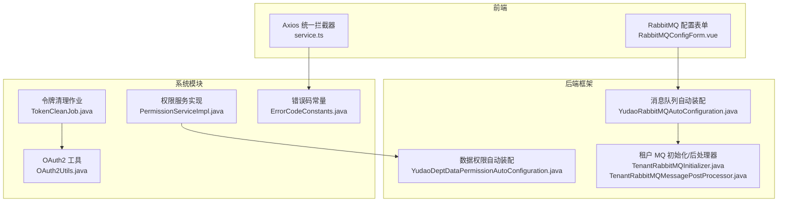
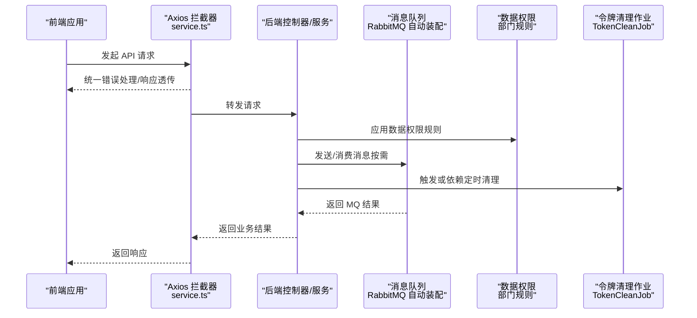
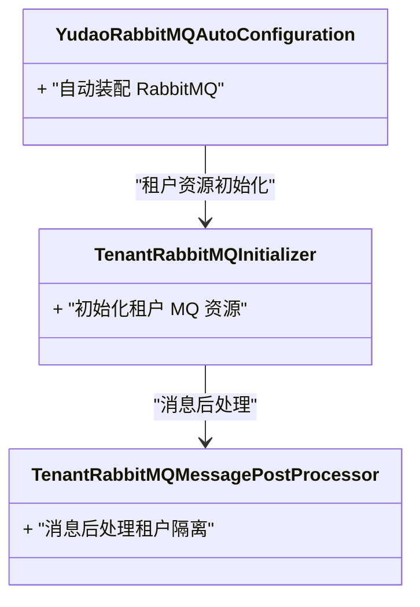
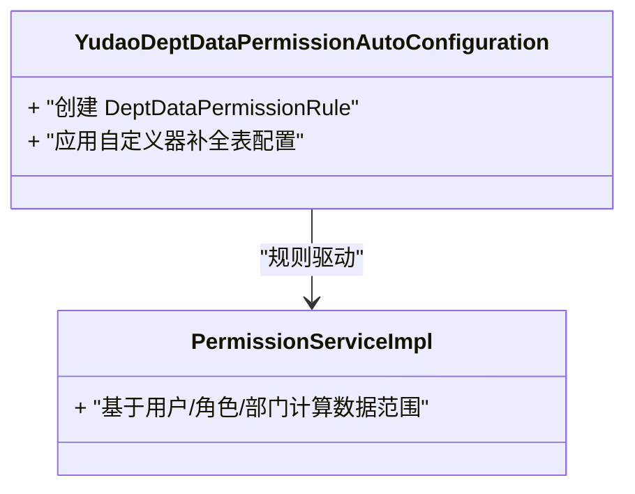
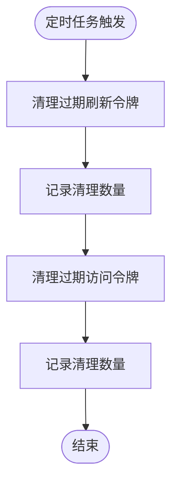
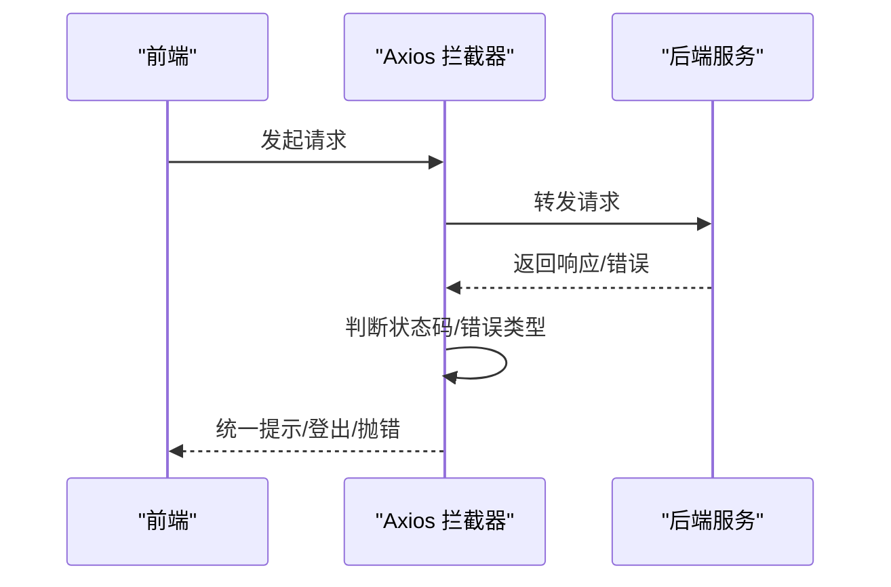
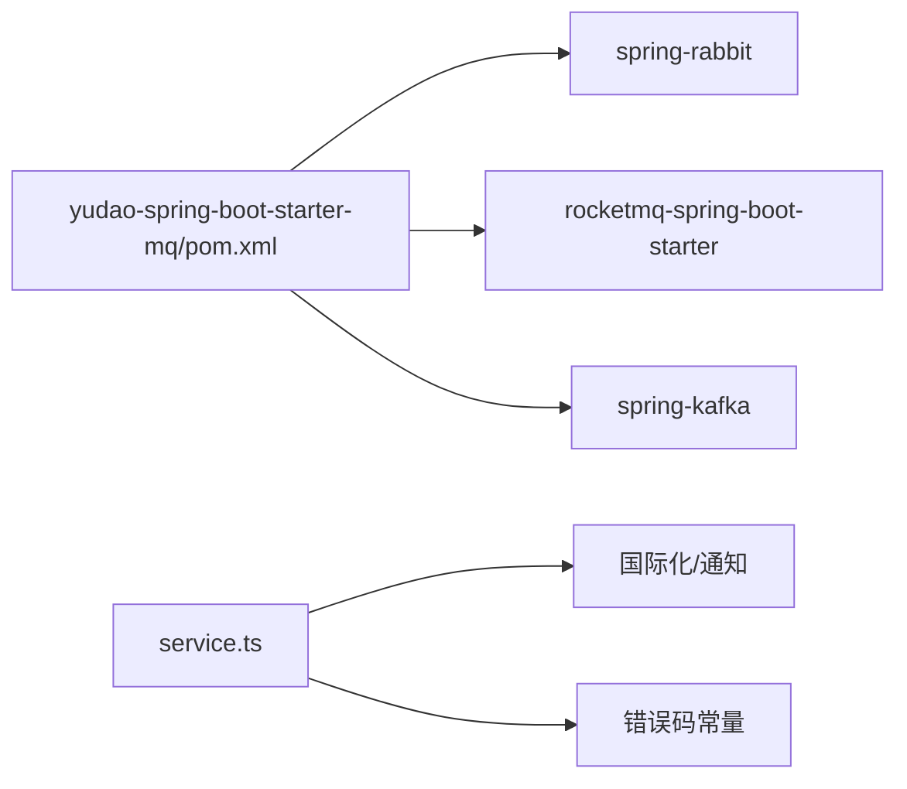

# 第三方服务问题排查

<cite>
**本文引用的文件**
- [TokenCleanJob.java](file://yudao-module-system/src/main/java/cn/iocoder/yudao/module/system/job/token/TokenCleanJob.java)
- [YudaoRabbitMQAutoConfiguration.java](file://yudao-framework/yudao-spring-boot-starter-mq/src/main/java/cn/iocoder/yudao/framework/mq/rabbitmq/config/YudaoRabbitMQAutoConfiguration.java)
- [TenantRabbitMQInitializer.java](file://yudao-framework/yudao-spring-boot-starter-biz-tenant/src/main/java/cn/iocoder/yudao/framework/tenant/core/mq/rabbitmq/TenantRabbitMQInitializer.java)
- [TenantRabbitMQMessagePostProcessor.java](file://yudao-framework/yudao-spring-boot-starter-biz-tenant/src/main/java/cn/iocoder/yudao/framework/tenant/core/mq/rabbitmq/TenantRabbitMQMessagePostProcessor.java)
- [YudaoDeptDataPermissionAutoConfiguration.java](file://yudao-framework/yudao-spring-boot-starter-biz-data-permission/src/main/java/cn/iocoder/yudao/framework/datapermission/config/YudaoDeptDataPermissionAutoConfiguration.java)
- [PermissionServiceImpl.java](file://yudao-module-system/src/main/java/cn/iocoder/yudao/module/system/service/permission/PermissionServiceImpl.java)
- [ErrorCodeConstants.java](file://yudao-module-system/src/main/java/cn/iocoder/yudao/module/system/enums/ErrorCodeConstants.java)
- [OAuth2Utils.java](file://yudao-module-system/src/main/java/cn/iocoder/yudao/module/system/util/oauth2/OAuth2Utils.java)
- [service.ts](file://yudao-ui/yudao-ui-admin-vue3/src/config/axios/service.ts)
- [RabbitMQConfigForm.vue](file://yudao-ui/yudao-ui-admin-vue3/src/views/iot/rule/data/sink/config/RabbitMQConfigForm.vue)
- [pom.xml](file://yudao-framework/yudao-spring-boot-starter-mq/pom.xml)
</cite>

## 目录
1. [简介](#简介)
2. [项目结构](#项目结构)
3. [核心组件](#核心组件)
4. [架构总览](#架构总览)
5. [详细组件分析](#详细组件分析)
6. [依赖关系分析](#依赖关系分析)
7. [性能考虑](#性能考虑)
8. [故障排查指南](#故障排查指南)
9. [结论](#结论)
10. [附录](#附录)

## 简介
本指南聚焦于第三方服务集成中的常见问题与排障方法，覆盖以下主题：
- API 调用失败：网络异常、认证失败、接口变更
- 认证问题：Token 过期、签名验证失败、权限不足
- 配额限制：请求频率限制、使用量超限
- 消息队列集成：RabbitMQ 连接失败、消息丢失、消费异常
- 数据权限配置：权限规则生效异常、数据隔离失败
- 健康检查与监控：如何通过系统内置能力进行健康检查与告警

## 项目结构
围绕第三方服务集成，本项目在以下模块中提供了支撑能力：
- 框架层（yudao-framework）
  - 消息队列（RabbitMQ、RocketMQ、Kafka、Redis）适配与自动装配
  - 数据权限（基于部门）规则与自动装配
  - 租户多租场景下的消息队列初始化与消息后处理器
- 业务模块（yudao-module-system）
  - OAuth2 令牌清理作业（定时任务）
  - 权限服务（用户、角色、菜单、数据范围）
  - 错误码常量定义（OAuth2、社交授权等）
- 前端（yudao-ui）
  - Axios 统一拦截器与错误处理
  - RabbitMQ 配置表单（IoT 规则 sink）

图表来源
- [YudaoRabbitMQAutoConfiguration.java](file://yudao-framework/yudao-spring-boot-starter-mq/src/main/java/cn/iocoder/yudao/framework/mq/rabbitmq/config/YudaoRabbitMQAutoConfiguration.java)
- [YudaoDeptDataPermissionAutoConfiguration.java](file://yudao-framework/yudao-spring-boot-starter-biz-data-permission/src/main/java/cn/iocoder/yudao/framework/datapermission/config/YudaoDeptDataPermissionAutoConfiguration.java)
- [TenantRabbitMQInitializer.java](file://yudao-framework/yudao-spring-boot-starter-biz-tenant/src/main/java/cn/iocoder/yudao/framework/tenant/core/mq/rabbitmq/TenantRabbitMQInitializer.java)
- [TenantRabbitMQMessagePostProcessor.java](file://yudao-framework/yudao-spring-boot-starter-biz-tenant/src/main/java/cn/iocoder/yudao/framework/tenant/core/mq/rabbitmq/TenantRabbitMQMessagePostProcessor.java)
- [TokenCleanJob.java](file://yudao-module-system/src/main/java/cn/iocoder/yudao/module/system/job/token/TokenCleanJob.java)
- [PermissionServiceImpl.java](file://yudao-module-system/src/main/java/cn/iocoder/yudao/module/system/service/permission/PermissionServiceImpl.java)
- [ErrorCodeConstants.java](file://yudao-module-system/src/main/java/cn/iocoder/yudao/module/system/enums/ErrorCodeConstants.java)
- [OAuth2Utils.java](file://yudao-module-system/src/main/java/cn/iocoder/yudao/module/system/util/oauth2/OAuth2Utils.java)
- [service.ts](file://yudao-ui/yudao-ui-admin-vue3/src/config/axios/service.ts)
- [RabbitMQConfigForm.vue](file://yudao-ui/yudao-ui-admin-vue3/src/views/iot/rule/data/sink/config/RabbitMQConfigForm.vue)

章节来源
- [YudaoRabbitMQAutoConfiguration.java](file://yudao-framework/yudao-spring-boot-starter-mq/src/main/java/cn/iocoder/yudao/framework/mq/rabbitmq/config/YudaoRabbitMQAutoConfiguration.java)
- [YudaoDeptDataPermissionAutoConfiguration.java](file://yudao-framework/yudao-spring-boot-starter-biz-data-permission/src/main/java/cn/iocoder/yudao/framework/datapermission/config/YudaoDeptDataPermissionAutoConfiguration.java)
- [TokenCleanJob.java](file://yudao-module-system/src/main/java/cn/iocoder/yudao/module/system/job/token/TokenCleanJob.java)
- [service.ts](file://yudao-ui/yudao-ui-admin-vue3/src/config/axios/service.ts)

## 核心组件
- 消息队列自动装配与租户适配
  - 提供 RabbitMQ、RocketMQ、Kafka、Redis 的统一抽象与自动装配入口，便于在多租户场景下对交换机、路由键、队列进行初始化与消息后处理。
- 数据权限（部门维度）自动装配
  - 基于登录用户上下文构建部门数据权限规则，结合自定义器完成表级规则补全，确保查询自动带入数据范围。
- OAuth2 令牌清理作业
  - 定时清理过期的刷新令牌与访问令牌，避免数据库膨胀与安全风险。
- 前端 Axios 统一拦截器
  - 统一处理 4xx/5xx、网络错误、超时等错误，并对特定错误（如“无效的刷新令牌”）触发登出流程。

章节来源
- [YudaoRabbitMQAutoConfiguration.java](file://yudao-framework/yudao-spring-boot-starter-mq/src/main/java/cn/iocoder/yudao/framework/mq/rabbitmq/config/YudaoRabbitMQAutoConfiguration.java)
- [YudaoDeptDataPermissionAutoConfiguration.java](file://yudao-framework/yudao-spring-boot-starter-biz-data-permission/src/main/java/cn/iocoder/yudao/framework/datapermission/config/YudaoDeptDataPermissionAutoConfiguration.java)
- [TokenCleanJob.java](file://yudao-module-system/src/main/java/cn/iocoder/yudao/module/system/job/token/TokenCleanJob.java)
- [service.ts](file://yudao-ui/yudao-ui-admin-vue3/src/config/axios/service.ts)

## 架构总览
下图展示了第三方服务集成的关键交互路径：前端通过 Axios 发起请求，后端经由消息队列与数据权限规则处理，同时在多租户场景下进行 MQ 初始化与消息后处理；认证方面通过 OAuth2 工具与令牌清理作业保障安全与性能。

图表来源
- [service.ts](file://yudao-ui/yudao-ui-admin-vue3/src/config/axios/service.ts)
- [YudaoRabbitMQAutoConfiguration.java](file://yudao-framework/yudao-spring-boot-starter-mq/src/main/java/cn/iocoder/yudao/framework/mq/rabbitmq/config/YudaoRabbitMQAutoConfiguration.java)
- [YudaoDeptDataPermissionAutoConfiguration.java](file://yudao-framework/yudao-spring-boot-starter-biz-data-permission/src/main/java/cn/iocoder/yudao/framework/datapermission/config/YudaoDeptDataPermissionAutoConfiguration.java)
- [TokenCleanJob.java](file://yudao-module-system/src/main/java/cn/iocoder/yudao/module/system/job/token/TokenCleanJob.java)

## 详细组件分析

### 组件A：消息队列（RabbitMQ）集成与租户适配
- 自动装配
  - 通过自动装配类加载 RabbitMQ 相关配置，为后续业务模块提供统一的消息发送/接收能力。
- 租户适配
  - 在多租户场景下，初始化租户专属的交换机、路由键、队列，并在消息发送前进行后处理，确保消息隔离与正确投递。

图表来源
- [YudaoRabbitMQAutoConfiguration.java](file://yudao-framework/yudao-spring-boot-starter-mq/src/main/java/cn/iocoder/yudao/framework/mq/rabbitmq/config/YudaoRabbitMQAutoConfiguration.java)
- [TenantRabbitMQInitializer.java](file://yudao-framework/yudao-spring-boot-starter-biz-tenant/src/main/java/cn/iocoder/yudao/framework/tenant/core/mq/rabbitmq/TenantRabbitMQInitializer.java)
- [TenantRabbitMQMessagePostProcessor.java](file://yudao-framework/yudao-spring-boot-starter-biz-tenant/src/main/java/cn/iocoder/yudao/framework/tenant/core/mq/rabbitmq/TenantRabbitMQMessagePostProcessor.java)

章节来源
- [YudaoRabbitMQAutoConfiguration.java](file://yudao-framework/yudao-spring-boot-starter-mq/src/main/java/cn/iocoder/yudao/framework/mq/rabbitmq/config/YudaoRabbitMQAutoConfiguration.java)
- [TenantRabbitMQInitializer.java](file://yudao-framework/yudao-spring-boot-starter-biz-tenant/src/main/java/cn/iocoder/yudao/framework/tenant/core/mq/rabbitmq/TenantRabbitMQInitializer.java)
- [TenantRabbitMQMessagePostProcessor.java](file://yudao-framework/yudao-spring-boot-starter-biz-tenant/src/main/java/cn/iocoder/yudao/framework/tenant/core/mq/rabbitmq/TenantRabbitMQMessagePostProcessor.java)

### 组件B：数据权限（部门维度）规则
- 自动装配
  - 基于登录用户上下文与自定义器，动态构建部门数据权限规则，注入到规则工厂中。
- 规则应用
  - 在查询阶段自动拼接数据范围条件，确保用户仅能看到其权限范围内的数据。

图表来源
- [YudaoDeptDataPermissionAutoConfiguration.java](file://yudao-framework/yudao-spring-boot-starter-biz-data-permission/src/main/java/cn/iocoder/yudao/framework/datapermission/config/YudaoDeptDataPermissionAutoConfiguration.java)
- [PermissionServiceImpl.java](file://yudao-module-system/src/main/java/cn/iocoder/yudao/module/system/service/permission/PermissionServiceImpl.java)

章节来源
- [YudaoDeptDataPermissionAutoConfiguration.java](file://yudao-framework/yudao-spring-boot-starter-biz-data-permission/src/main/java/cn/iocoder/yudao/framework/datapermission/config/YudaoDeptDataPermissionAutoConfiguration.java)
- [PermissionServiceImpl.java](file://yudao-module-system/src/main/java/cn/iocoder/yudao/module/system/service/permission/PermissionServiceImpl.java)

### 组件C：OAuth2 令牌清理作业
- 作用
  - 定时清理过期的刷新令牌与访问令牌，控制数据库规模并降低安全风险。
- 关键参数
  - 保留天数与每次删除条数，避免一次性操作对数据库造成压力。

图表来源
- [TokenCleanJob.java](file://yudao-module-system/src/main/java/cn/iocoder/yudao/module/system/job/token/TokenCleanJob.java)

章节来源
- [TokenCleanJob.java](file://yudao-module-system/src/main/java/cn/iocoder/yudao/module/system/job/token/TokenCleanJob.java)

### 组件D：前端 Axios 统一拦截器与错误处理
- 统一处理
  - 对 500、非 0/200 状态码、网络错误、超时等进行统一提示与错误抛出。
  - 对特定错误（如“无效的刷新令牌”）触发登出流程，避免状态不一致。
- 与后端配合
  - 后端通过错误码常量返回明确语义，前端据此进行用户提示与兜底处理。

图表来源
- [service.ts](file://yudao-ui/yudao-ui-admin-vue3/src/config/axios/service.ts)
- [ErrorCodeConstants.java](file://yudao-module-system/src/main/java/cn/iocoder/yudao/module/system/enums/ErrorCodeConstants.java)

章节来源
- [service.ts](file://yudao-ui/yudao-ui-admin-vue3/src/config/axios/service.ts)
- [ErrorCodeConstants.java](file://yudao-module-system/src/main/java/cn/iocoder/yudao/module/system/enums/ErrorCodeConstants.java)

## 依赖关系分析
- 消息队列依赖
  - 模块通过 Maven 依赖引入 RabbitMQ、RocketMQ、Kafka 等可选组件，按需启用。
- 数据权限依赖
  - 依赖登录用户上下文与权限 API，结合自定义器完成规则扩展。
- 前端依赖
  - Axios 拦截器依赖国际化文案与通知组件，保证错误提示一致性。

图表来源
- [pom.xml](file://yudao-framework/yudao-spring-boot-starter-mq/pom.xml)
- [service.ts](file://yudao-ui/yudao-ui-admin-vue3/src/config/axios/service.ts)
- [ErrorCodeConstants.java](file://yudao-module-system/src/main/java/cn/iocoder/yudao/module/system/enums/ErrorCodeConstants.java)

章节来源
- [pom.xml](file://yudao-framework/yudao-spring-boot-starter-mq/pom.xml)
- [service.ts](file://yudao-ui/yudao-ui-admin-vue3/src/config/axios/service.ts)

## 性能考虑
- 消息队列
  - 合理设置并发消费者与批量确认，避免消息堆积；在多租户场景下按租户拆分资源，减少跨租户干扰。
- 数据权限
  - 将常用权限维度（部门）纳入缓存，减少重复计算；对复杂规则进行预编译与复用。
- 令牌清理
  - 控制每次删除条数与保留天数，避免大事务导致锁竞争与延迟。

## 故障排查指南

### API 调用失败
- 症状
  - 前端出现网络错误、超时、状态码异常。
- 排查步骤
  - 检查后端日志与链路追踪，定位具体异常类型。
  - 前端 Axios 拦截器会根据状态码进行统一提示，关注“网络错误”“超时”“请求失败的状态码”等提示。
  - 若涉及第三方接口变更，核对后端接口适配与参数映射是否更新。
- 参考实现
  - 前端错误处理与提示逻辑
  - 后端错误码常量用于统一语义

章节来源
- [service.ts](file://yudao-ui/yudao-ui-admin-vue3/src/config/axios/service.ts)
- [ErrorCodeConstants.java](file://yudao-module-system/src/main/java/cn/iocoder/yudao/module/system/enums/ErrorCodeConstants.java)

### 认证问题（Token 过期、签名失败、权限不足）
- 症状
  - 登录后一段时间出现“无效的刷新令牌”，需要重新登录。
- 排查步骤
  - 检查令牌有效期与刷新策略，确认是否被定时清理作业清理。
  - 核对 OAuth2 授权类型、scope、redirect_uri 是否与客户端配置一致。
  - 若权限不足，检查用户角色与数据范围是否正确。
- 参考实现
  - 令牌清理作业
  - OAuth2 工具类与错误码常量

章节来源
- [TokenCleanJob.java](file://yudao-module-system/src/main/java/cn/iocoder/yudao/module/system/job/token/TokenCleanJob.java)
- [OAuth2Utils.java](file://yudao-module-system/src/main/java/cn/iocoder/yudao/module/system/util/oauth2/OAuth2Utils.java)
- [ErrorCodeConstants.java](file://yudao-module-system/src/main/java/cn/iocoder/yudao/module/system/enums/ErrorCodeConstants.java)

### 配额限制（请求频率限制、使用量超限）
- 症状
  - 接口返回限流或配额超限错误。
- 排查步骤
  - 检查第三方服务的配额阈值与计费周期，评估当前调用量。
  - 在网关或前置层增加重试与退避策略，避免雪崩。
  - 对高频接口进行缓存与降级处理。
- 参考实现
  - 前端 Axios 统一拦截器可捕获并提示此类错误

章节来源
- [service.ts](file://yudao-ui/yudao-ui-admin-vue3/src/config/axios/service.ts)

### 消息队列集成问题（RabbitMQ）
- 连接失败
  - 检查 RabbitMQ 地址、端口、虚拟主机、用户名密码是否正确。
  - 核对租户 MQ 初始化与消息后处理器是否生效。
- 消息丢失
  - 确认生产者开启确认模式、持久化消息与队列；消费者采用手动确认。
- 消费异常
  - 查看消费者线程池与并发度配置；检查死信队列与重试策略。
- 参考实现
  - RabbitMQ 自动装配与租户适配
  - 前端 IoT 规则 sink 的 RabbitMQ 配置表单

章节来源
- [YudaoRabbitMQAutoConfiguration.java](file://yudao-framework/yudao-spring-boot-starter-mq/src/main/java/cn/iocoder/yudao/framework/mq/rabbitmq/config/YudaoRabbitMQAutoConfiguration.java)
- [TenantRabbitMQInitializer.java](file://yudao-framework/yudao-spring-boot-starter-biz-tenant/src/main/java/cn/iocoder/yudao/framework/tenant/core/mq/rabbitmq/TenantRabbitMQInitializer.java)
- [TenantRabbitMQMessagePostProcessor.java](file://yudao-framework/yudao-spring-boot-starter-biz-tenant/src/main/java/cn/iocoder/yudao/framework/tenant/core/mq/rabbitmq/TenantRabbitMQMessagePostProcessor.java)
- [RabbitMQConfigForm.vue](file://yudao-ui/yudao-ui-admin-vue3/src/views/iot/rule/data/sink/config/RabbitMQConfigForm.vue)

### 数据权限配置问题（规则生效异常、数据隔离失败）
- 症状
  - 查询结果超出预期范围，或权限规则未生效。
- 排查步骤
  - 检查登录用户的角色与部门归属，确认数据范围枚举与规则自定义器配置。
  - 核对业务查询是否正确标注数据权限注解。
- 参考实现
  - 数据权限自动装配与规则工厂
  - 权限服务实现中的数据范围计算

章节来源
- [YudaoDeptDataPermissionAutoConfiguration.java](file://yudao-framework/yudao-spring-boot-starter-biz-data-permission/src/main/java/cn/iocoder/yudao/framework/datapermission/config/YudaoDeptDataPermissionAutoConfiguration.java)
- [PermissionServiceImpl.java](file://yudao-module-system/src/main/java/cn/iocoder/yudao/module/system/service/permission/PermissionServiceImpl.java)

### 健康检查与监控
- 健康检查
  - 使用 Actuator 暴露的健康端点，检查数据库、消息队列、缓存等依赖的可用性。
- 监控指标
  - 结合链路追踪与指标埋点，观察请求耗时、错误率、队列积压等关键指标。
- 建议
  - 对第三方服务调用增加熔断与降级策略，设置告警阈值。

## 结论
通过统一的前端拦截器、后端自动装配与规则体系、以及定时任务与租户适配，本项目在第三方服务集成方面提供了较为完善的排障基础。建议在实际运维中：
- 明确错误码与提示语义，统一前后端处理逻辑
- 对消息队列与数据权限进行基线配置与回归测试
- 建立健康检查与监控告警闭环，提前发现并处置风险

## 附录
- 常用排查清单
  - 网络连通性与 DNS 解析
  - 证书与域名配置
  - 超时与重试策略
  - 日志级别与采样率
  - 缓存命中率与失效策略
  - 队列积压与消费者吞吐