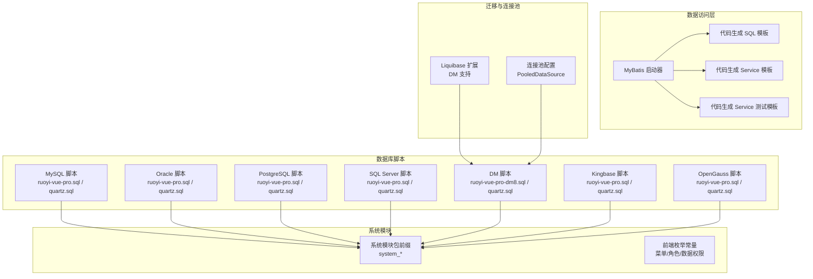
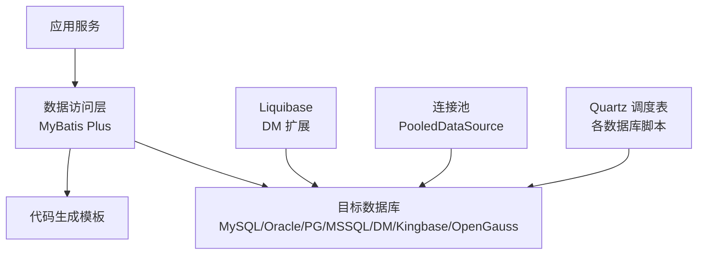
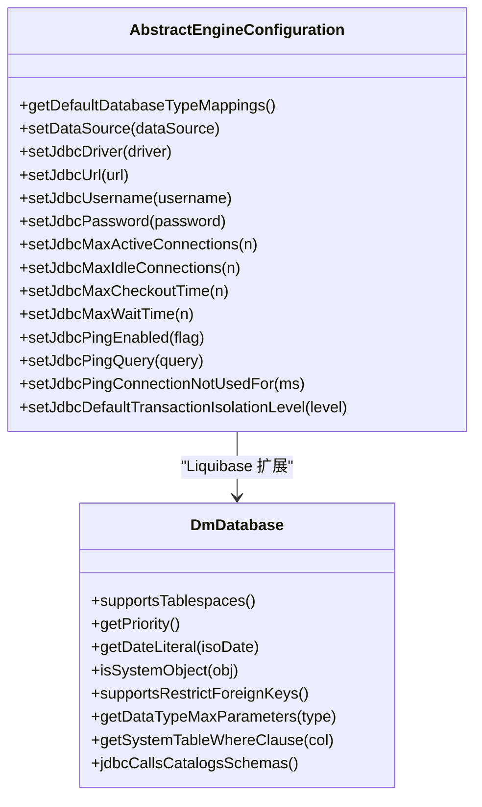
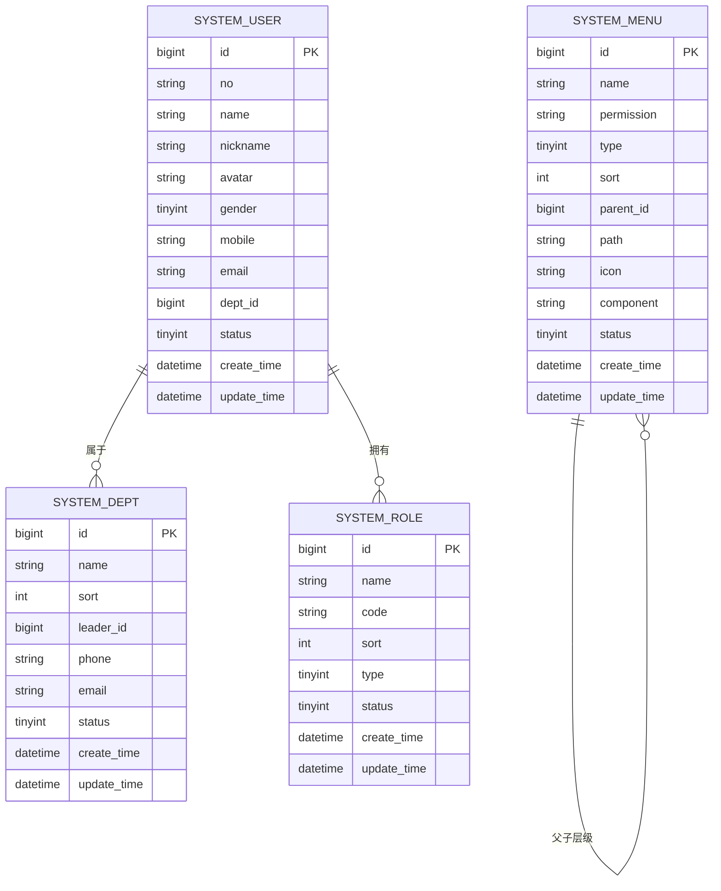
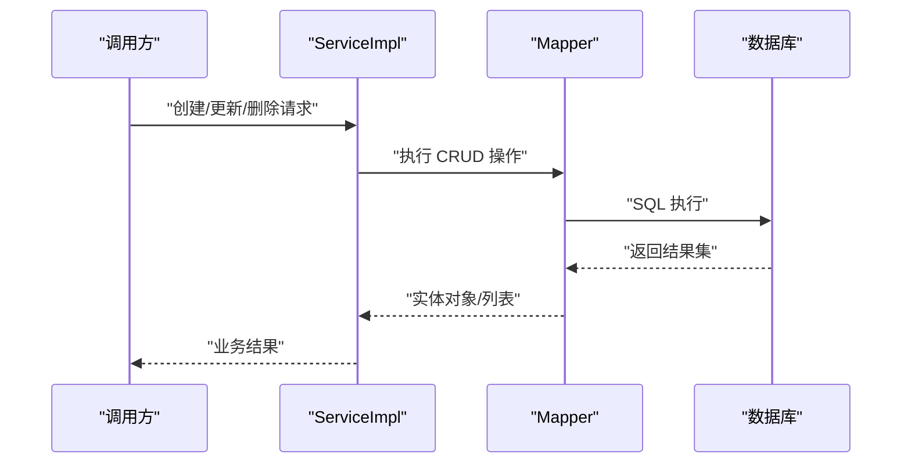
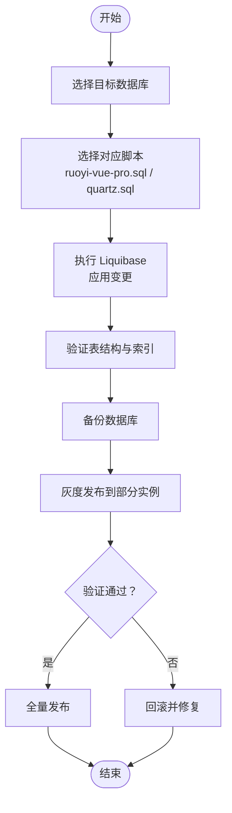
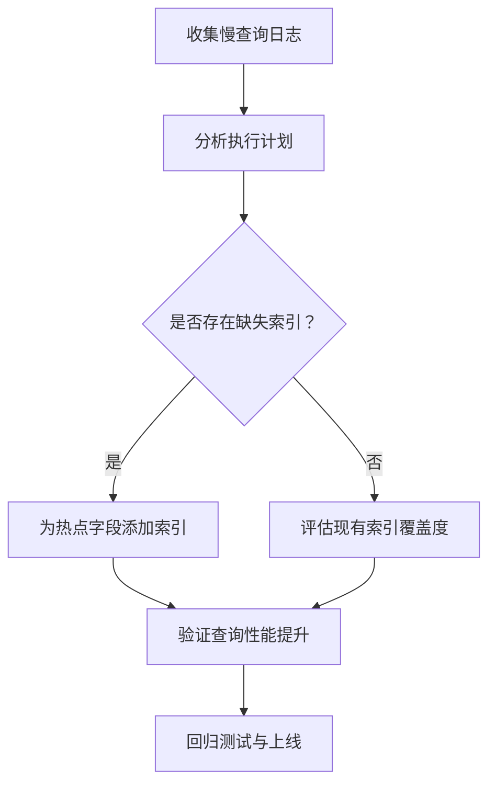
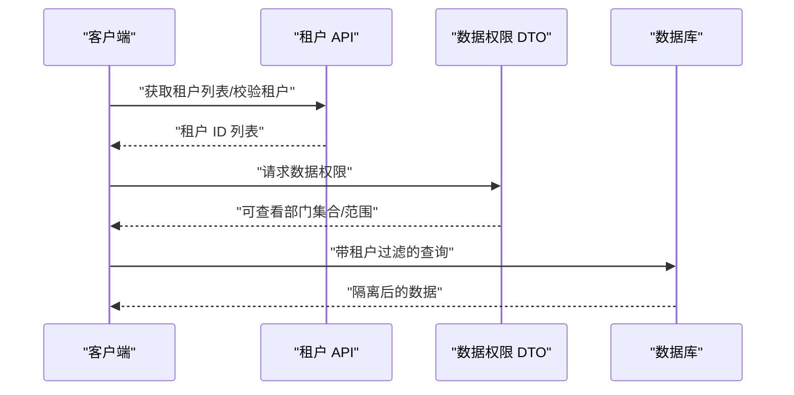
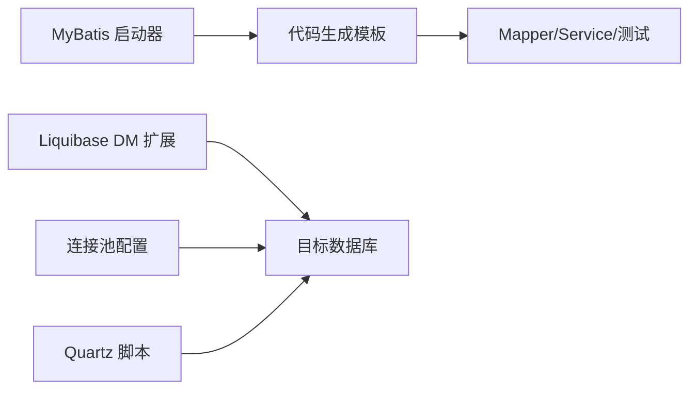

# 数据库设计

<cite>
**本文引用的文件**
- [AbstractEngineConfiguration.java](file://sql/dm/flowable-patch/src/main/java/org/flowable/common/engine/impl/AbstractEngineConfiguration.java)
- [DmDatabase.java](file://sql/dm/flowable-patch/src/main/java/liquibase/database/core/DmDatabase.java)
- [DmDatabase SPI](file://sql/dm/flowable-patch/src/main/resources/META-INF/services/liquibase.database.Database)
- [MySQL Quartz 脚本](file://sql/mysql/quartz.sql)
- [Oracle Quartz 脚本](file://sql/oracle/quartz.sql)
- [PostgreSQL Quartz 脚本](file://sql/postgresql/quartz.sql)
- [SQL Server Quartz 脚本](file://sql/sqlserver/quartz.sql)
- [DM Quartz 脚本](file://sql/dm/quartz.sql)
- [Kingbase Quartz 脚本](file://sql/kingbase/quartz.sql)
- [OpenGauss Quartz 脚本](file://sql/opengauss/quartz.sql)
- [MySQL RuoYi 主库脚本](file://sql/mysql/ruoyi-vue-pro.sql)
- [Oracle RuoYi 主库脚本](file://sql/oracle/ruoyi-vue-pro.sql)
- [PostgreSQL RuoYi 主库脚本](file://sql/postgresql/ruoyi-vue-pro.sql)
- [SQL Server RuoYi 主库脚本](file://sql/sqlserver/ruoyi-vue-pro.sql)
- [DM RuoYi 主库脚本](file://sql/dm/ruoyi-vue-pro-dm8.sql)
- [Kingbase RuoYi 主库脚本](file://sql/kingbase/ruoyi-vue-pro.sql)
- [OpenGauss RuoYi 主库脚本](file://sql/opengauss/ruoyi-vue-pro.sql)
- [系统模块包说明](file://yudao-module-system/src/main/java/cn/iocoder/yudao/module/system/package-info.java)
- [系统模块前端常量](file://yudao-ui/yudao-ui-admin-vue3/src/utils/constants.ts)
- [数据权限响应 DTO](file://yudao-framework/yudao-common/src/main/java/cn/iocoder/yudao/framework/common/biz/system/permission/dto/DeptDataPermissionRespDTO.java)
- [租户 API 接口](file://yudao-framework/yudao-common/src/main/java/cn/iocoder/yudao/framework/common/biz/system/tenant/TenantCommonApi.java)
- [MyBatis 启动器说明](file://yudao-framework/yudao-spring-boot-starter-mybatis/pom.xml)
- [MyBatis 工具测试](file://yudao-framework/yudao-spring-boot-starter-mybatis/src/test/java/cn/iocoder/yudao/framework/mybatis/core/util/MyBatisUtilsTest.java)
- [代码生成 SQL 模板](file://yudao-module-infra/src/main/resources/codegen/sql/sql.vm)
- [代码生成 Service 实现模板](file://yudao-module-infra/src/main/resources/codegen/java/service/serviceImpl.vm)
- [代码生成 Service 测试模板](file://yudao-module-infra/src/main/resources/codegen/java/test/serviceTest.vm)
- [Flowable DM 补丁默认数据库映射](file://sql/dm/flowable-patch/src/main/java/org/flowable/common/engine/impl/AbstractEngineConfiguration.java)
- [Flowable DM 补丁数据库类型优先级与特性](file://sql/dm/flowable-patch/src/main/java/liquibase/database/core/DmDatabase.java)
- [Liquibase DM 扩展服务注册](file://sql/dm/flowable-patch/src/main/resources/META-INF/services/liquibase.database.Database)
- [Oracle 用户创建脚本](file://sql/tools/oracle/1_create_user.sql)
- [Oracle 架构创建脚本](file://sql/tools/oracle/2_create_schema.sh)
- [SQL Server 架构创建脚本](file://sql/tools/sqlserver/create_schema.sh)
- [Flowable DM 补丁连接池配置示例](file://sql/dm/flowable-patch/src/main/java/org/flowable/common/engine/impl/AbstractEngineConfiguration.java)
</cite>

## 目录
1. [简介](#简介)
2. [项目结构](#项目结构)
3. [核心组件](#核心组件)
4. [架构总览](#架构总览)
5. [详细组件分析](#详细组件分析)
6. [依赖关系分析](#依赖关系分析)
7. [性能考虑](#性能考虑)
8. [故障排查指南](#故障排查指南)
9. [结论](#结论)
10. [附录](#附录)

## 简介
本文件面向芋道 ruoyi-vue-pro 的数据库设计与实现，覆盖多数据库支持策略（MySQL、Oracle、PostgreSQL、SQL Server、DM、Kingbase、OpenGauss）、连接池配置、核心表结构设计（用户、角色、菜单、部门等）、数据访问层（MyBatis Plus 使用与通用 CRUD）、数据迁移与版本管理（Liquibase）、索引优化策略、数据安全与备份、数据库监控与维护，以及多租户数据隔离方案。

## 项目结构
- 数据库脚本按数据库类型分目录存放，便于按目标数据库选择对应初始化与 Quartz 脚本。
- 系统模块通过统一包前缀与表前缀标识，便于在不同数据库中区分与迁移。
- 代码生成模板自动生成 Mapper、Service、测试等代码，确保 CRUD 一致性与可维护性。
- Flowable DM 补丁扩展了 Liquibase 对 DM 的支持，并提供了连接池配置能力。

**图表来源**
- [MySQL RuoYi 主库脚本](file://sql/mysql/ruoyi-vue-pro.sql)
- [Oracle RuoYi 主库脚本](file://sql/oracle/ruoyi-vue-pro.sql)
- [PostgreSQL RuoYi 主库脚本](file://sql/postgresql/ruoyi-vue-pro.sql)
- [SQL Server RuoYi 主库脚本](file://sql/sqlserver/ruoyi-vue-pro.sql)
- [DM RuoYi 主库脚本](file://sql/dm/ruoyi-vue-pro-dm8.sql)
- [Kingbase RuoYi 主库脚本](file://sql/kingbase/ruoyi-vue-pro.sql)
- [OpenGauss RuoYi 主库脚本](file://sql/opengauss/ruoyi-vue-pro.sql)
- [系统模块包说明](file://yudao-module-system/src/main/java/cn/iocoder/yudao/module/system/package-info.java)
- [MyBatis 启动器说明](file://yudao-framework/yudao-spring-boot-starter-mybatis/pom.xml)
- [代码生成 SQL 模板](file://yudao-module-infra/src/main/resources/codegen/sql/sql.vm)
- [代码生成 Service 实现模板](file://yudao-module-infra/src/main/resources/codegen/java/service/serviceImpl.vm)
- [代码生成 Service 测试模板](file://yudao-module-infra/src/main/resources/codegen/java/test/serviceTest.vm)
- [DmDatabase.java](file://sql/dm/flowable-patch/src/main/java/liquibase/database/core/DmDatabase.java)
- [DmDatabase SPI](file://sql/dm/flowable-patch/src/main/resources/META-INF/services/liquibase.database.Database)
- [AbstractEngineConfiguration.java](file://sql/dm/flowable-patch/src/main/java/org/flowable/common/engine/impl/AbstractEngineConfiguration.java)

**章节来源**
- [系统模块包说明](file://yudao-module-system/src/main/java/cn/iocoder/yudao/module/system/package-info.java)
- [系统模块前端常量](file://yudao-ui/yudao-ui-admin-vue3/src/utils/constants.ts)

## 核心组件
- 多数据库支持：通过各数据库独立脚本与 Liquibase DM 扩展实现，覆盖 MySQL、Oracle、PostgreSQL、SQL Server、DM、Kingbase、OpenGauss。
- 连接池配置：Flowable DM 补丁提供 PooledDataSource 配置入口，支持最大活跃连接、空闲连接、checkout 超时、等待时间、Ping 检测等。
- 核心表结构：系统模块统一以 system_ 前缀命名，前端枚举定义菜单/角色/数据权限等类型，便于跨数据库一致化。
- 数据访问层：MyBatis Plus 启动器与代码生成模板，自动生成 Mapper、Service、测试，实现通用 CRUD 与复杂查询。
- 迁移与版本管理：Liquibase 扩展 DM 支持，结合各数据库 Quartz 脚本进行调度表初始化。
- 索引优化：Quartz 在 Oracle 等数据库中提供索引示例，指导热点查询字段建立合适索引。
- 数据安全与备份：通过 Oracle/SQL Server 架构创建脚本规范用户与模式，配合数据库备份策略保障安全。
- 监控与维护：建议结合数据库内置监控与慢查询日志进行性能分析与维护。
- 多租户隔离：通过租户 API 接口与数据权限 DTO，实现租户维度的数据隔离与权限控制。

**章节来源**
- [Flowable DM 补丁默认数据库映射](file://sql/dm/flowable-patch/src/main/java/org/flowable/common/engine/impl/AbstractEngineConfiguration.java)
- [Flowable DM 补丁数据库类型优先级与特性](file://sql/dm/flowable-patch/src/main/java/liquibase/database/core/DmDatabase.java)
- [Liquibase DM 扩展服务注册](file://sql/dm/flowable-patch/src/main/resources/META-INF/services/liquibase.database.Database)
- [Flowable DM 补丁连接池配置示例](file://sql/dm/flowable-patch/src/main/java/org/flowable/common/engine/impl/AbstractEngineConfiguration.java)
- [系统模块包说明](file://yudao-module-system/src/main/java/cn/iocoder/yudao/module/system/package-info.java)
- [系统模块前端常量](file://yudao-ui/yudao-ui-admin-vue3/src/utils/constants.ts)
- [MyBatis 启动器说明](file://yudao-framework/yudao-spring-boot-starter-mybatis/pom.xml)
- [代码生成 SQL 模板](file://yudao-module-infra/src/main/resources/codegen/sql/sql.vm)
- [代码生成 Service 实现模板](file://yudao-module-infra/src/main/resources/codegen/java/service/serviceImpl.vm)
- [代码生成 Service 测试模板](file://yudao-module-infra/src/main/resources/codegen/java/test/serviceTest.vm)
- [Oracle 用户创建脚本](file://sql/tools/oracle/1_create_user.sql)
- [Oracle 架构创建脚本](file://sql/tools/oracle/2_create_schema.sh)
- [SQL Server 架构创建脚本](file://sql/tools/sqlserver/create_schema.sh)
- [MySQL Quartz 脚本](file://sql/mysql/quartz.sql)
- [Oracle Quartz 脚本](file://sql/oracle/quartz.sql)
- [PostgreSQL Quartz 脚本](file://sql/postgresql/quartz.sql)
- [SQL Server Quartz 脚本](file://sql/sqlserver/quartz.sql)
- [DM Quartz 脚本](file://sql/dm/quartz.sql)
- [Kingbase Quartz 脚本](file://sql/kingbase/quartz.sql)
- [OpenGauss Quartz 脚本](file://sql/opengauss/quartz.sql)

## 架构总览
整体数据库架构围绕“多数据库脚本 + Liquibase 扩展 + 连接池 + 代码生成 + 核心表结构 + 多租户与数据权限”展开，确保在不同数据库上的一致性与可维护性。

**图表来源**
- [MyBatis 启动器说明](file://yudao-framework/yudao-spring-boot-starter-mybatis/pom.xml)
- [代码生成 SQL 模板](file://yudao-module-infra/src/main/resources/codegen/sql/sql.vm)
- [DmDatabase.java](file://sql/dm/flowable-patch/src/main/java/liquibase/database/core/DmDatabase.java)
- [AbstractEngineConfiguration.java](file://sql/dm/flowable-patch/src/main/java/org/flowable/common/engine/impl/AbstractEngineConfiguration.java)
- [MySQL Quartz 脚本](file://sql/mysql/quartz.sql)
- [Oracle Quartz 脚本](file://sql/oracle/quartz.sql)
- [PostgreSQL Quartz 脚本](file://sql/postgresql/quartz.sql)
- [SQL Server Quartz 脚本](file://sql/sqlserver/quartz.sql)
- [DM Quartz 脚本](file://sql/dm/quartz.sql)
- [Kingbase Quartz 脚本](file://sql/kingbase/quartz.sql)
- [OpenGauss Quartz 脚本](file://sql/opengauss/quartz.sql)

## 详细组件分析

### 多数据库支持与连接池配置
- 数据库类型映射：Flowable DM 补丁提供默认数据库类型映射，将多种数据库驱动识别为统一类型，便于配置与切换。
- Liquibase DM 扩展：通过 SPI 注册 DmDatabase，使 Liquibase 能识别并适配 DM 数据库方言、日期字面量、序列函数等特性。
- 连接池配置：PooledDataSource 支持最大活跃连接、最大空闲连接、checkout 最大时间、等待时间、Ping 检测与事务隔离级别设置，满足高并发场景下的稳定性与性能需求。

**图表来源**
- [AbstractEngineConfiguration.java](file://sql/dm/flowable-patch/src/main/java/org/flowable/common/engine/impl/AbstractEngineConfiguration.java)
- [DmDatabase.java](file://sql/dm/flowable-patch/src/main/java/liquibase/database/core/DmDatabase.java)
- [DmDatabase SPI](file://sql/dm/flowable-patch/src/main/resources/META-INF/services/liquibase.database.Database)

**章节来源**
- [Flowable DM 补丁默认数据库映射](file://sql/dm/flowable-patch/src/main/java/org/flowable/common/engine/impl/AbstractEngineConfiguration.java)
- [Flowable DM 补丁数据库类型优先级与特性](file://sql/dm/flowable-patch/src/main/java/liquibase/database/core/DmDatabase.java)
- [Liquibase DM 扩展服务注册](file://sql/dm/flowable-patch/src/main/resources/META-INF/services/liquibase.database.Database)
- [Flowable DM 补丁连接池配置示例](file://sql/dm/flowable-patch/src/main/java/org/flowable/common/engine/impl/AbstractEngineConfiguration.java)

### 核心表结构设计（用户、角色、菜单、部门）
- 命名规范：系统模块统一使用 system_ 前缀，便于在不同数据库中区分与迁移。
- 类型枚举：前端定义菜单类型（目录/菜单/按钮）、角色类型（内置/自定义）、数据权限范围（全部/部门/本人等），确保业务语义清晰。
- 数据权限：通过数据权限 DTO 返回可查看的部门集合或是否可查看全部/自己的数据，支撑细粒度权限控制。
- 菜单按钮：代码生成模板可自动生成菜单与按钮的初始化 SQL，确保权限与页面元素一致。

**图表来源**
- [系统模块包说明](file://yudao-module-system/src/main/java/cn/iocoder/yudao/module/system/package-info.java)
- [系统模块前端常量](file://yudao-ui/yudao-ui-admin-vue3/src/utils/constants.ts)
- [数据权限响应 DTO](file://yudao-framework/yudao-common/src/main/java/cn/iocoder/yudao/framework/common/biz/system/permission/dto/DeptDataPermissionRespDTO.java)
- [代码生成 SQL 模板](file://yudao-module-infra/src/main/resources/codegen/sql/sql.vm)

**章节来源**
- [系统模块包说明](file://yudao-module-system/src/main/java/cn/iocoder/yudao/module/system/package-info.java)
- [系统模块前端常量](file://yudao-ui/yudao-ui-admin-vue3/src/utils/constants.ts)
- [数据权限响应 DTO](file://yudao-framework/yudao-common/src/main/java/cn/iocoder/yudao/framework/common/biz/system/permission/dto/DeptDataPermissionRespDTO.java)
- [代码生成 SQL 模板](file://yudao-module-infra/src/main/resources/codegen/sql/sql.vm)

### 数据访问层设计（MyBatis Plus、通用 CRUD、复杂查询）
- 通用 CRUD：代码生成模板自动生成 Mapper、Service 实现与测试，覆盖单表增删改查与批量操作，保证一致性与可测试性。
- 复杂查询：通过模板中的条件判断与批量插入逻辑，支持主子表、一对多等复杂关系的处理。
- 测试驱动：Service 测试模板提供插入、更新、断言等流程，确保 CRUD 正确性。

**图表来源**
- [代码生成 Service 实现模板](file://yudao-module-infra/src/main/resources/codegen/java/service/serviceImpl.vm)
- [代码生成 Service 测试模板](file://yudao-module-infra/src/main/resources/codegen/java/test/serviceTest.vm)

**章节来源**
- [MyBatis 启动器说明](file://yudao-framework/yudao-spring-boot-starter-mybatis/pom.xml)
- [MyBatis 工具测试](file://yudao-framework/yudao-spring-boot-starter-mybatis/src/test/java/cn/iocoder/yudao/framework/mybatis/core/util/MyBatisUtilsTest.java)
- [代码生成 Service 实现模板](file://yudao-module-infra/src/main/resources/codegen/java/service/serviceImpl.vm)
- [代码生成 Service 测试模板](file://yudao-module-infra/src/main/resources/codegen/java/test/serviceTest.vm)

### 数据迁移与版本管理（Liquibase、灰度发布）
- Liquibase 扩展：通过 SPI 注册 DmDatabase，使 Liquibase 能识别 DM 方言，支持日期字面量、序列函数、系统表过滤等特性。
- Quartz 初始化：各数据库提供 Quartz 脚本，用于调度表初始化；Oracle 示例包含多个索引定义，指导热点字段建模。
- 灰度发布建议：结合 Liquibase 变更记录与数据库备份，先在小范围环境验证，再逐步扩大。

**图表来源**
- [DmDatabase.java](file://sql/dm/flowable-patch/src/main/java/liquibase/database/core/DmDatabase.java)
- [DmDatabase SPI](file://sql/dm/flowable-patch/src/main/resources/META-INF/services/liquibase.database.Database)
- [MySQL Quartz 脚本](file://sql/mysql/quartz.sql)
- [Oracle Quartz 脚本](file://sql/oracle/quartz.sql)
- [PostgreSQL Quartz 脚本](file://sql/postgresql/quartz.sql)
- [SQL Server Quartz 脚本](file://sql/sqlserver/quartz.sql)
- [DM Quartz 脚本](file://sql/dm/quartz.sql)
- [Kingbase Quartz 脚本](file://sql/kingbase/quartz.sql)
- [OpenGauss Quartz 脚本](file://sql/opengauss/quartz.sql)

**章节来源**
- [Flowable DM 补丁数据库类型优先级与特性](file://sql/dm/flowable-patch/src/main/java/liquibase/database/core/DmDatabase.java)
- [Liquibase DM 扩展服务注册](file://sql/dm/flowable-patch/src/main/resources/META-INF/services/liquibase.database.Database)
- [Oracle Quartz 脚本](file://sql/oracle/quartz.sql)

### 索引优化策略（性能分析、设计原则、查询优化）
- 热点字段建模：参考 Oracle Quartz 脚本中的索引定义，为触发器状态、下次触发时间、作业名称/组等热点字段建立合适索引。
- 设计原则：遵循“最小必要索引”“覆盖索引优先”“避免重复索引”，结合 EXPLAIN 分析查询计划。
- 查询优化：利用代码生成模板的条件拼装与批量操作，减少 N+1 查询与不必要的全表扫描。

**图表来源**
- [Oracle Quartz 脚本](file://sql/oracle/quartz.sql)

**章节来源**
- [Oracle Quartz 脚本](file://sql/oracle/quartz.sql)

### 数据安全与备份策略（加密、访问控制、灾难恢复）
- 访问控制：通过 Oracle/SQL Server 架构创建脚本规范用户与模式，限制权限范围，避免越权访问。
- 加密：敏感字段建议在应用层或数据库层启用透明数据加密（TDE）与传输加密（TLS）。
- 备份：定期全量与增量备份，结合快照与归档日志，制定恢复演练计划。

**章节来源**
- [Oracle 用户创建脚本](file://sql/tools/oracle/1_create_user.sql)
- [Oracle 架构创建脚本](file://sql/tools/oracle/2_create_schema.sh)
- [SQL Server 架构创建脚本](file://sql/tools/sqlserver/create_schema.sh)

### 数据库监控与维护（性能监控、慢查询分析、维护最佳实践）
- 性能监控：开启数据库内置监控指标（连接数、锁等待、缓冲区命中率等）。
- 慢查询分析：结合慢查询日志与执行计划，定位瓶颈并优化索引与 SQL。
- 维护最佳实践：定期统计信息更新、索引重建/重组、分区策略（如适用）、连接池健康检查与 Ping 配置。

**章节来源**
- [Flowable DM 补丁连接池配置示例](file://sql/dm/flowable-patch/src/main/java/org/flowable/common/engine/impl/AbstractEngineConfiguration.java)

### 多租户数据隔离（方案与实现）
- 租户维度隔离：通过租户 API 接口获取租户列表与校验租户合法性，确保数据按租户边界隔离。
- 数据权限控制：结合数据权限 DTO，限定用户可见的部门与数据范围，防止跨租户数据泄露。
- 实施建议：在表设计中增加租户字段，查询时强制加入租户过滤条件，配合连接池与缓存策略降低开销。

**图表来源**
- [租户 API 接口](file://yudao-framework/yudao-common/src/main/java/cn/iocoder/yudao/framework/common/biz/system/tenant/TenantCommonApi.java)
- [数据权限响应 DTO](file://yudao-framework/yudao-common/src/main/java/cn/iocoder/yudao/framework/common/biz/system/permission/dto/DeptDataPermissionRespDTO.java)

**章节来源**
- [租户 API 接口](file://yudao-framework/yudao-common/src/main/java/cn/iocoder/yudao/framework/common/biz/system/tenant/TenantCommonApi.java)
- [数据权限响应 DTO](file://yudao-framework/yudao-common/src/main/java/cn/iocoder/yudao/framework/common/biz/system/permission/dto/DeptDataPermissionRespDTO.java)

## 依赖关系分析
- 数据访问层依赖 MyBatis Plus 启动器与代码生成模板，统一 CRUD 与测试。
- 迁移层依赖 Liquibase DM 扩展与各数据库 Quartz 脚本，确保调度表初始化与方言兼容。
- 连接池依赖 Flowable DM 补丁提供的 PooledDataSource 配置能力，保障高并发稳定性。

**图表来源**
- [MyBatis 启动器说明](file://yudao-framework/yudao-spring-boot-starter-mybatis/pom.xml)
- [代码生成 SQL 模板](file://yudao-module-infra/src/main/resources/codegen/sql/sql.vm)
- [DmDatabase.java](file://sql/dm/flowable-patch/src/main/java/liquibase/database/core/DmDatabase.java)
- [AbstractEngineConfiguration.java](file://sql/dm/flowable-patch/src/main/java/org/flowable/common/engine/impl/AbstractEngineConfiguration.java)
- [MySQL Quartz 脚本](file://sql/mysql/quartz.sql)
- [Oracle Quartz 脚本](file://sql/oracle/quartz.sql)
- [PostgreSQL Quartz 脚本](file://sql/postgresql/quartz.sql)
- [SQL Server Quartz 脚本](file://sql/sqlserver/quartz.sql)
- [DM Quartz 脚本](file://sql/dm/quartz.sql)
- [Kingbase Quartz 脚本](file://sql/kingbase/quartz.sql)
- [OpenGauss Quartz 脚本](file://sql/opengauss/quartz.sql)

**章节来源**
- [MyBatis 启动器说明](file://yudao-framework/yudao-spring-boot-starter-mybatis/pom.xml)
- [代码生成 SQL 模板](file://yudao-module-infra/src/main/resources/codegen/sql/sql.vm)
- [DmDatabase.java](file://sql/dm/flowable-patch/src/main/java/liquibase/database/core/DmDatabase.java)
- [AbstractEngineConfiguration.java](file://sql/dm/flowable-patch/src/main/java/org/flowable/common/engine/impl/AbstractEngineConfiguration.java)
- [MySQL Quartz 脚本](file://sql/mysql/quartz.sql)
- [Oracle Quartz 脚本](file://sql/oracle/quartz.sql)
- [PostgreSQL Quartz 脚本](file://sql/postgresql/quartz.sql)
- [SQL Server Quartz 脚本](file://sql/sqlserver/quartz.sql)
- [DM Quartz 脚本](file://sql/dm/quartz.sql)
- [Kingbase Quartz 脚本](file://sql/kingbase/quartz.sql)
- [OpenGauss Quartz 脚本](file://sql/opengauss/quartz.sql)

## 性能考虑
- 连接池参数：根据业务峰值并发调整最大活跃连接、checkout 超时与等待时间，避免连接饥饿。
- 索引设计：围绕热点查询字段建立复合索引，避免全表扫描；定期评估索引使用率与碎片。
- 查询优化：利用代码生成模板的批量插入与条件拼装，减少往返次数与无效查询。
- 监控与压测：持续监控慢查询与资源占用，结合压测结果优化配置与 SQL。

## 故障排查指南
- 连接问题：检查 JDBC 驱动、URL、用户名密码与连接池参数；确认 Ping 检测与超时设置合理。
- 方言不匹配：确认 Liquibase 使用的数据库方言与目标数据库一致，必要时加载 DM 扩展。
- 权限问题：核对 Oracle/SQL Server 架构创建脚本中的用户与模式权限，确保应用账户具备所需权限。
- 迁移失败：检查 Liquibase 变更日志与脚本执行顺序，必要时回滚并修复后再重试。

**章节来源**
- [Flowable DM 补丁连接池配置示例](file://sql/dm/flowable-patch/src/main/java/org/flowable/common/engine/impl/AbstractEngineConfiguration.java)
- [Liquibase DM 扩展服务注册](file://sql/dm/flowable-patch/src/main/resources/META-INF/services/liquibase.database.Database)
- [Oracle 用户创建脚本](file://sql/tools/oracle/1_create_user.sql)
- [Oracle 架构创建脚本](file://sql/tools/oracle/2_create_schema.sh)
- [SQL Server 架构创建脚本](file://sql/tools/sqlserver/create_schema.sh)

## 结论
本设计文档基于 ruoyi-vue-pro 的实际代码与脚本，构建了覆盖多数据库支持、连接池配置、核心表结构、数据访问层、迁移与版本管理、索引优化、数据安全与备份、监控与维护以及多租户隔离的完整数据库设计方案。通过 Liquibase DM 扩展与代码生成模板，实现了跨数据库的一致性与可维护性；通过连接池与索引优化，保障了高并发场景下的稳定性与性能；通过租户与数据权限控制，实现了多租户数据隔离与细粒度权限管理。

## 附录
- 各数据库初始化脚本路径参考：
  - [MySQL RuoYi 主库脚本](file://sql/mysql/ruoyi-vue-pro.sql)
  - [Oracle RuoYi 主库脚本](file://sql/oracle/ruoyi-vue-pro.sql)
  - [PostgreSQL RuoYi 主库脚本](file://sql/postgresql/ruoyi-vue-pro.sql)
  - [SQL Server RuoYi 主库脚本](file://sql/sqlserver/ruoyi-vue-pro.sql)
  - [DM RuoYi 主库脚本](file://sql/dm/ruoyi-vue-pro-dm8.sql)
  - [Kingbase RuoYi 主库脚本](file://sql/kingbase/ruoyi-vue-pro.sql)
  - [OpenGauss RuoYi 主库脚本](file://sql/opengauss/ruoyi-vue-pro.sql)
- Quartz 调度表脚本路径参考：
  - [MySQL Quartz 脚本](file://sql/mysql/quartz.sql)
  - [Oracle Quartz 脚本](file://sql/oracle/quartz.sql)
  - [PostgreSQL Quartz 脚本](file://sql/postgresql/quartz.sql)
  - [SQL Server Quartz 脚本](file://sql/sqlserver/quartz.sql)
  - [DM Quartz 脚本](file://sql/dm/quartz.sql)
  - [Kingbase Quartz 脚本](file://sql/kingbase/quartz.sql)
  - [OpenGauss Quartz 脚本](file://sql/opengauss/quartz.sql)
- 架构与用户创建脚本：
  - [Oracle 用户创建脚本](file://sql/tools/oracle/1_create_user.sql)
  - [Oracle 架构创建脚本](file://sql/tools/oracle/2_create_schema.sh)
  - [SQL Server 架构创建脚本](file://sql/tools/sqlserver/create_schema.sh)