# 即时通讯数据库设计

<cite>
**本文档引用的文件**
- [ImPrivateMessageDO.java](file://yudao-module-im/src/main/java/cn/iocoder/yudao/module/im/dal/dataobject/message/ImPrivateMessageDO.java)
- [ImGroupMessageDO.java](file://yudao-module-im/src/main/java/cn/iocoder/yudao/module/im/dal/dataobject/message/ImGroupMessageDO.java)
- [ImChannelMessageDO.java](file://yudao-module-im/src/main/java/cn/iocoder/yudao/module/im/dal/dataobject/message/ImChannelMessageDO.java)
- [ImFriendDO.java](file://yudao-module-im/src/main/java/cn/iocoder/yudao/module/im/dal/dataobject/friend/ImFriendDO.java)
- [ImGroupDO.java](file://yudao-module-im/src/main/java/cn/iocoder/yudao/module/im/dal/dataobject/group/ImGroupDO.java)
- [ImGroupMemberDO.java](file://yudao-module-im/src/main/java/cn/iocoder/yudao/module/im/dal/dataobject/group/ImGroupMemberDO.java)
- [ImSensitiveWordDO.java](file://yudao-module-im/src/main/java/cn/iocoder/yudao/module/im/dal/dataobject/sensitiveword/ImSensitiveWordDO.java)
- [ImPrivateMessageMapper.java](file://yudao-module-im/src/main/java/cn/iocoder/yudao/module/im/dal/mysql/message/ImPrivateMessageMapper.java)
- [ImGroupMessageMapper.java](file://yudao-module-im/src/main/java/cn/iocoder/yudao/module/im/dal/mysql/message/ImGroupMessageMapper.java)
- [ImChannelMessageMapper.java](file://yudao-module-im/src/main/java/cn/iocoder/yudao/module/im/dal/mysql/message/ImChannelMessageMapper.java)
- [ImFriendMapper.java](file://yudao-module-im/src/main/java/cn/iocoder/yudao/module/im/dal/mysql/friend/ImFriendMapper.java)
- [ImGroupMapper.java](file://yudao-module-im/src/main/java/cn/iocoder/yudao/module/im/dal/mysql/group/ImGroupMapper.java)
- [ImGroupMemberMapper.java](file://yudao-module-im/src/main/java/cn/iocoder/yudao/module/im/dal/mysql/group/ImGroupMemberMapper.java)
- [ImSensitiveWordMapper.java](file://yudao-module-im/src/main/java/cn/iocoder/yudao/module/im/dal/mysql/sensitiveword/ImSensitiveWordMapper.java)
- [ImStatisticsManagerMapper.java](file://yudao-module-im/src/main/java/cn/iocoder/yudao/module/im/dal/mysql/statistics/ImStatisticsManagerMapper.java)
- [ImMessageUtils.java](file://yudao-module-im/src/main/java/cn/iocoder/yudao/module/im/util/ImMessageUtils.java)
- [ErrorCodeConstants.java](file://yudao-module-im/src/main/java/cn/iocoder/yudao/module/im/enums/ErrorCodeConstants.java)
- [ImCommonConstants.java](file://yudao-module-im/src/main/java/cn/iocoder/yudao/module/im/enums/ImCommonConstants.java)
- [ImConversationTypeEnum.java](file://yudao-module-im/src/main/java/cn/iocoder/yudao/module/im/enums/ImConversationTypeEnum.java)
- [ruoyi-vue-pro.sql](file://sql/postgresql/ruoyi-vue-pro.sql)
</cite>

## 目录
1. [简介](#简介)
2. [项目结构](#项目结构)
3. [核心组件](#核心组件)
4. [架构概览](#架构概览)
5. [详细组件分析](#详细组件分析)
6. [依赖分析](#依赖分析)
7. [性能考虑](#性能考虑)
8. [故障排除指南](#故障排除指南)
9. [结论](#结论)

## 简介
本文件为即时通讯系统数据库设计文档，基于芋道管理系统中的IM模块进行深入分析。该系统采用PostgreSQL数据库，实现了完整的即时通讯功能，包括私聊、群聊、频道聊天、好友关系管理、群组管理、消息存储与检索、敏感词过滤等核心功能。

## 项目结构
IM模块采用标准的分层架构设计，按照功能域进行模块化组织：

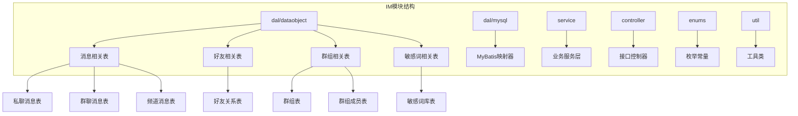
```mermaid
graph TB
subgraph "IM模块结构"
A[dal/dataobject] --> B[消息相关表]
A --> C[好友相关表]
A --> D[群组相关表]
A --> E[敏感词相关表]
F[dal/mysql] --> G[MyBatis映射器]
H[service] --> I[业务服务层]
J[controller] --> K[接口控制器]
L[enums] --> M[枚举常量]
N[util] --> O[工具类]
end
B --> P[私聊消息表]
B --> Q[群聊消息表]
B --> R[频道消息表]
C --> S[好友关系表]
D --> T[群组表]
D --> U[群组成员表]
E --> V[敏感词库表]
```

**图表来源**
- [ImPrivateMessageDO.java:1-200](file://yudao-module-im/src/main/java/cn/iocoder/yudao/module/im/dal/dataobject/message/ImPrivateMessageDO.java#L1-L200)
- [ImFriendDO.java:1-200](file://yudao-module-im/src/main/java/cn/iocoder/yudao/module/im/dal/dataobject/friend/ImFriendDO.java#L1-L200)
- [ImGroupDO.java:1-200](file://yudao-module-im/src/main/java/cn/iocoder/yudao/module/im/dal/dataobject/group/ImGroupDO.java#L1-L200)

**章节来源**
- [ImPrivateMessageDO.java:1-200](file://yudao-module-im/src/main/java/cn/iocoder/yudao/module/im/dal/dataobject/message/ImPrivateMessageDO.java#L1-L200)
- [ImFriendDO.java:1-200](file://yudao-module-im/src/main/java/cn/iocoder/yudao/module/im/dal/dataobject/friend/ImFriendDO.java#L1-L200)
- [ImGroupDO.java:1-200](file://yudao-module-im/src/main/java/cn/iocoder/yudao/module/im/dal/dataobject/group/ImGroupDO.java#L1-L200)

## 核心组件

### 私聊消息表设计
私聊消息表采用独立存储策略，确保每条私聊消息的完整性和可追溯性：

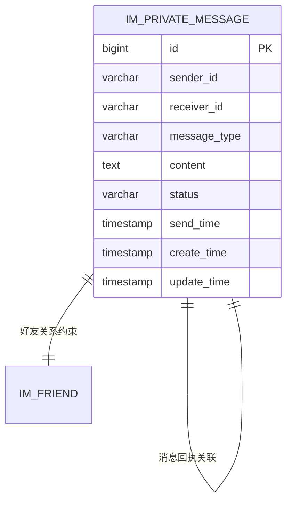
```mermaid
erDiagram
IM_PRIVATE_MESSAGE {
bigint id PK
varchar sender_id
varchar receiver_id
varchar message_type
text content
varchar status
timestamp send_time
timestamp create_time
timestamp update_time
}
IM_PRIVATE_MESSAGE ||--|| IM_FRIEND : "好友关系约束"
IM_PRIVATE_MESSAGE ||--|| IM_PRIVATE_MESSAGE : "消息回执关联"
```

**图表来源**
- [ImPrivateMessageDO.java:1-200](file://yudao-module-im/src/main/java/cn/iocoder/yudao/module/im/dal/dataobject/message/ImPrivateMessageDO.java#L1-L200)

### 群聊消息表设计
群聊消息表支持大规模群组的消息存储，采用分区策略优化查询性能：

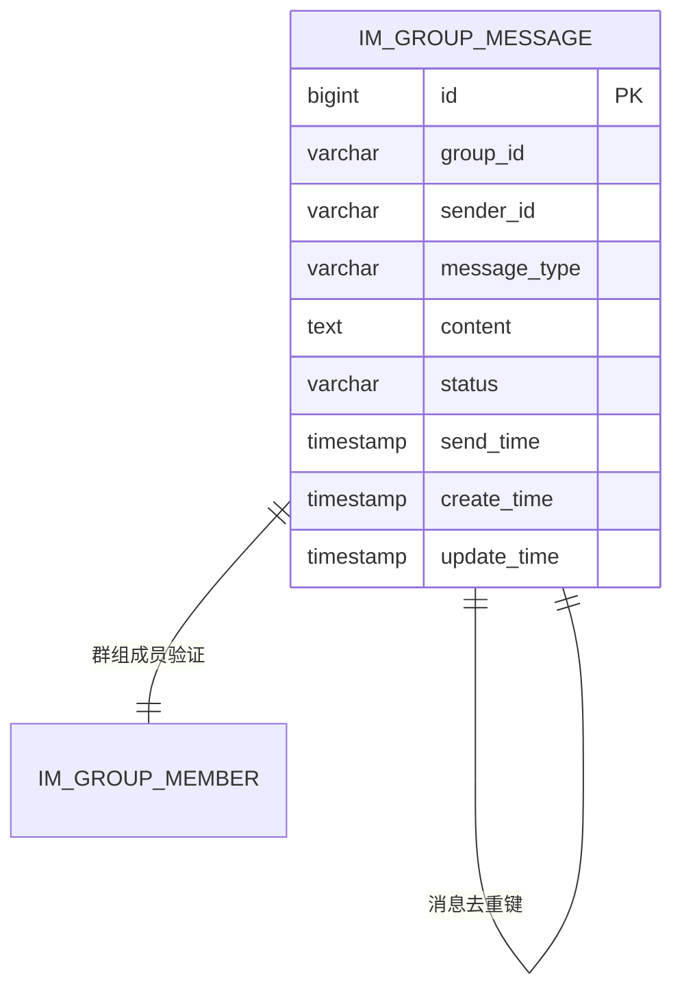
```mermaid
erDiagram
IM_GROUP_MESSAGE {
bigint id PK
varchar group_id
varchar sender_id
varchar message_type
text content
varchar status
timestamp send_time
timestamp create_time
timestamp update_time
}
IM_GROUP_MESSAGE ||--|| IM_GROUP_MEMBER : "群组成员验证"
IM_GROUP_MESSAGE ||--|| IM_GROUP_MESSAGE : "消息去重键"
```

**图表来源**
- [ImGroupMessageDO.java:1-200](file://yudao-module-im/src/main/java/cn/iocoder/yudao/module/im/dal/dataobject/message/ImGroupMessageDO.java#L1-L200)

### 频道消息表设计
频道消息表支持公开频道的高效消息存储，采用时间分片策略：

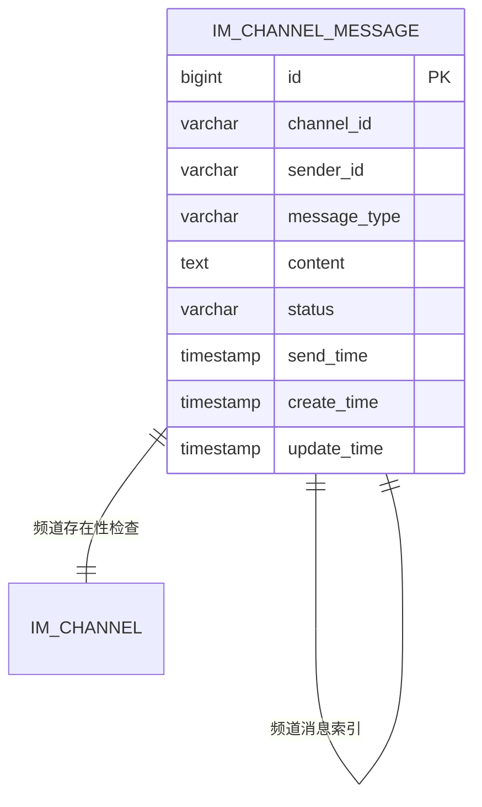
```mermaid
erDiagram
IM_CHANNEL_MESSAGE {
bigint id PK
varchar channel_id
varchar sender_id
varchar message_type
text content
varchar status
timestamp send_time
timestamp create_time
timestamp update_time
}
IM_CHANNEL_MESSAGE ||--|| IM_CHANNEL : "频道存在性检查"
IM_CHANNEL_MESSAGE ||--|| IM_CHANNEL_MESSAGE : "频道消息索引"
```

**图表来源**
- [ImChannelMessageDO.java:1-200](file://yudao-module-im/src/main/java/cn/iocoder/yudao/module/im/dal/dataobject/message/ImChannelMessageDO.java#L1-L200)

### 好友关系表设计
好友关系表维护用户间的关系状态和权限控制：

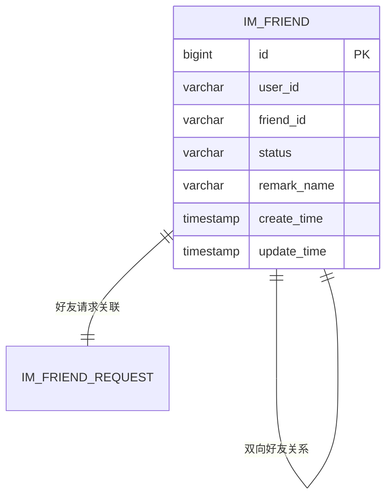
```mermaid
erDiagram
IM_FRIEND {
bigint id PK
varchar user_id
varchar friend_id
varchar status
varchar remark_name
timestamp create_time
timestamp update_time
}
IM_FRIEND ||--|| IM_FRIEND : "双向好友关系"
IM_FRIEND ||--|| IM_FRIEND_REQUEST : "好友请求关联"
```

**图表来源**
- [ImFriendDO.java:1-200](file://yudao-module-im/src/main/java/cn/iocoder/yudao/module/im/dal/dataobject/friend/ImFriendDO.java#L1-L200)

### 群组表设计
群组表支持多种群组类型和权限管理：

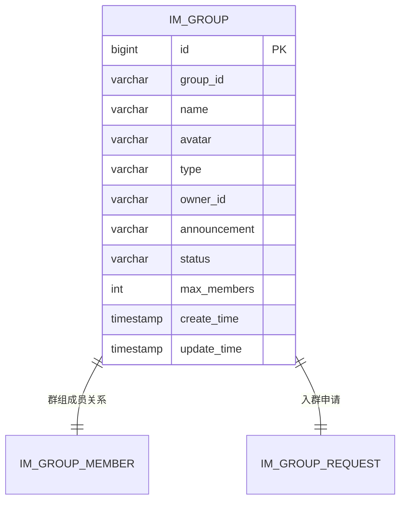
```mermaid
erDiagram
IM_GROUP {
bigint id PK
varchar group_id
varchar name
varchar avatar
varchar type
varchar owner_id
varchar announcement
varchar status
int max_members
timestamp create_time
timestamp update_time
}
IM_GROUP ||--|| IM_GROUP_MEMBER : "群组成员关系"
IM_GROUP ||--|| IM_GROUP_REQUEST : "入群申请"
```

**图表来源**
- [ImGroupDO.java:1-200](file://yudao-module-im/src/main/java/cn/iocoder/yudao/module/im/dal/dataobject/group/ImGroupDO.java#L1-L200)

### 群组成员表设计
群组成员表支持动态成员管理和权限控制：

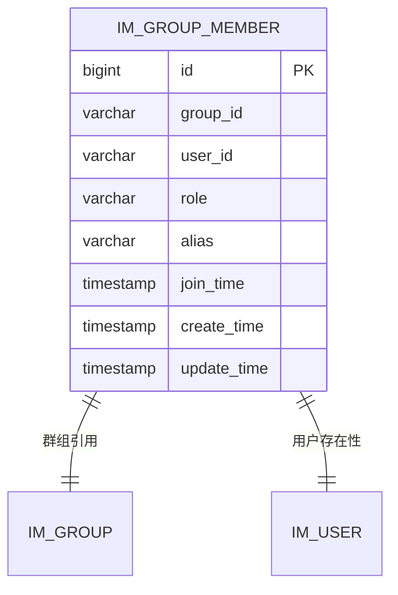
```mermaid
erDiagram
IM_GROUP_MEMBER {
bigint id PK
varchar group_id
varchar user_id
varchar role
varchar alias
timestamp join_time
timestamp create_time
timestamp update_time
}
IM_GROUP_MEMBER ||--|| IM_GROUP : "群组引用"
IM_GROUP_MEMBER ||--|| IM_USER : "用户存在性"
```

**图表来源**
- [ImGroupMemberDO.java:1-200](file://yudao-module-im/src/main/java/cn/iocoder/yudao/module/im/dal/dataobject/group/ImGroupMemberDO.java#L1-L200)

### 敏感词库表设计
敏感词库表支持实时内容审核和过滤：

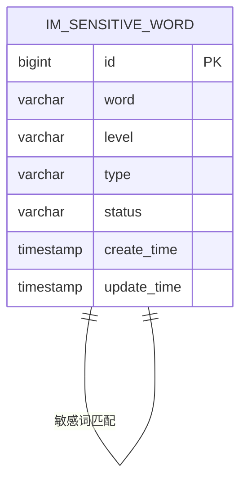
```mermaid
erDiagram
IM_SENSITIVE_WORD {
bigint id PK
varchar word
varchar level
varchar type
varchar status
timestamp create_time
timestamp update_time
}
IM_SENSITIVE_WORD ||--|| IM_SENSITIVE_WORD : "敏感词匹配"
```

**图表来源**
- [ImSensitiveWordDO.java:1-200](file://yudao-module-im/src/main/java/cn/iocoder/yudao/module/im/dal/dataobject/sensitiveword/ImSensitiveWordDO.java#L1-L200)

**章节来源**
- [ImPrivateMessageDO.java:1-200](file://yudao-module-im/src/main/java/cn/iocoder/yudao/module/im/dal/dataobject/message/ImPrivateMessageDO.java#L1-L200)
- [ImGroupMessageDO.java:1-200](file://yudao-module-im/src/main/java/cn/iocoder/yudao/module/im/dal/dataobject/message/ImGroupMessageDO.java#L1-L200)
- [ImChannelMessageDO.java:1-200](file://yudao-module-im/src/main/java/cn/iocoder/yudao/module/im/dal/dataobject/message/ImChannelMessageDO.java#L1-L200)
- [ImFriendDO.java:1-200](file://yudao-module-im/src/main/java/cn/iocoder/yudao/module/im/dal/dataobject/friend/ImFriendDO.java#L1-L200)
- [ImGroupDO.java:1-200](file://yudao-module-im/src/main/java/cn/iocoder/yudao/module/im/dal/dataobject/group/ImGroupDO.java#L1-L200)
- [ImGroupMemberDO.java:1-200](file://yudao-module-im/src/main/java/cn/iocoder/yudao/module/im/dal/dataobject/group/ImGroupMemberDO.java#L1-L200)
- [ImSensitiveWordDO.java:1-200](file://yudao-module-im/src/main/java/cn/iocoder/yudao/module/im/dal/dataobject/sensitiveword/ImSensitiveWordDO.java#L1-L200)

## 架构概览

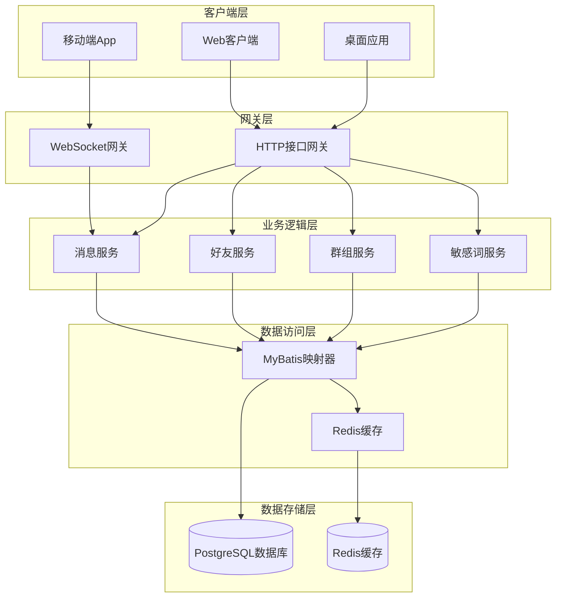
```mermaid
graph TB
subgraph "客户端层"
A[移动端App]
B[Web客户端]
C[桌面应用]
end
subgraph "网关层"
D[WebSocket网关]
E[HTTP接口网关]
end
subgraph "业务逻辑层"
F[消息服务]
G[好友服务]
H[群组服务]
I[敏感词服务]
end
subgraph "数据访问层"
J[MyBatis映射器]
K[Redis缓存]
end
subgraph "数据存储层"
L[(PostgreSQL数据库)]
M[(Redis缓存)]
end
A --> D
B --> E
C --> E
D --> F
E --> F
E --> G
E --> H
E --> I
F --> J
G --> J
H --> J
I --> J
J --> L
J --> K
K --> M
```

**图表来源**
- [ImPrivateMessageMapper.java:1-200](file://yudao-module-im/src/main/java/cn/iocoder/yudao/module/im/dal/mysql/message/ImPrivateMessageMapper.java#L1-L200)
- [ImFriendMapper.java:1-200](file://yudao-module-im/src/main/java/cn/iocoder/yudao/module/im/dal/mysql/friend/ImFriendMapper.java#L1-L200)
- [ImGroupMapper.java:1-200](file://yudao-module-im/src/main/java/cn/iocoder/yudao/module/im/dal/mysql/group/ImGroupMapper.java#L1-L200)

## 详细组件分析

### 消息存储策略

#### 消息去重机制
系统通过复合唯一键实现消息去重，确保相同内容在相同场景下不会重复存储：

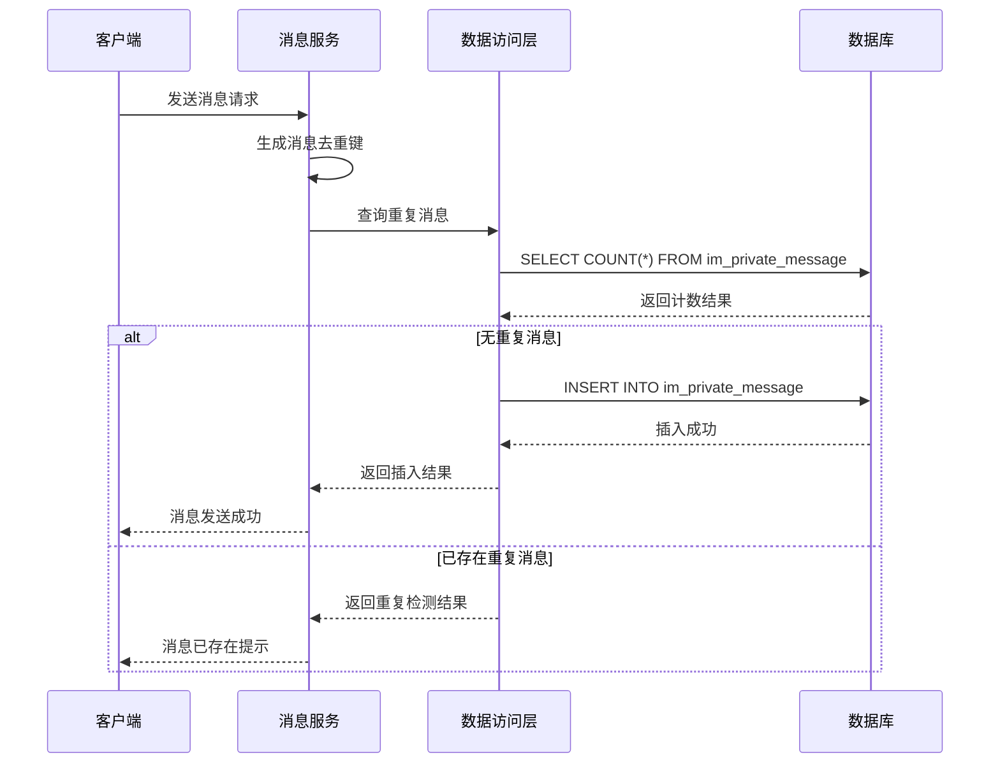
```mermaid
sequenceDiagram
participant Client as 客户端
participant Service as 消息服务
participant Mapper as 数据访问层
participant DB as 数据库
Client->>Service : 发送消息请求
Service->>Service : 生成消息去重键
Service->>Mapper : 查询重复消息
Mapper->>DB : SELECT COUNT(*) FROM im_private_message
DB-->>Mapper : 返回计数结果
alt 无重复消息
Mapper->>DB : INSERT INTO im_private_message
DB-->>Mapper : 插入成功
Mapper-->>Service : 返回插入结果
Service-->>Client : 消息发送成功
else 已存在重复消息
Mapper-->>Service : 返回重复检测结果
Service-->>Client : 消息已存在提示
end
```

**图表来源**
- [ImPrivateMessageMapper.java:1-200](file://yudao-module-im/src/main/java/cn/iocoder/yudao/module/im/dal/mysql/message/ImPrivateMessageMapper.java#L1-L200)
- [ImMessageUtils.java:1-200](file://yudao-module-im/src/main/java/cn/iocoder/yudao/module/im/util/ImMessageUtils.java#L1-L200)

#### 消息回执功能
消息回执机制通过状态字段跟踪消息的送达和阅读状态：

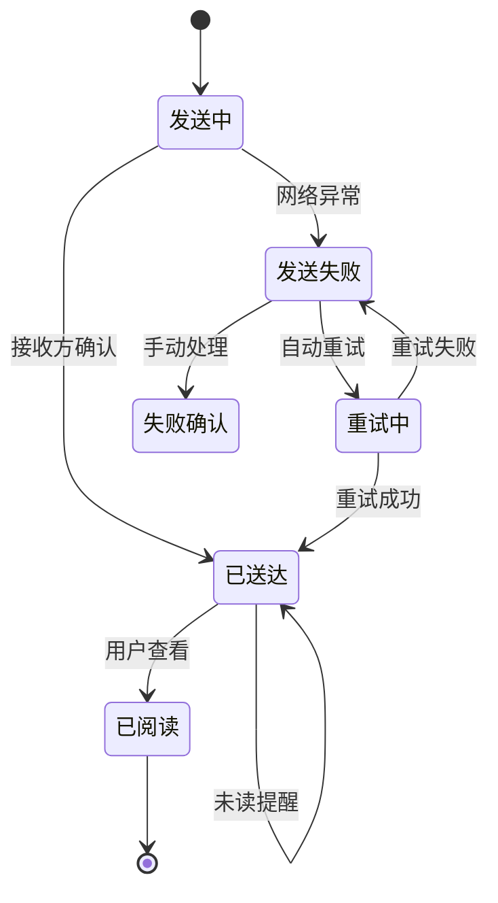
```mermaid
stateDiagram-v2
[*] --> 发送中
发送中 --> 已送达 : 接收方确认
发送中 --> 发送失败 : 网络异常
已送达 --> 已阅读 : 用户查看
已送达 --> 已送达 : 未读提醒
发送失败 --> 重试中 : 自动重试
发送失败 --> 失败确认 : 手动处理
已阅读 --> [*]
重试中 --> 已送达 : 重试成功
重试中 --> 发送失败 : 重试失败
```

**图表来源**
- [ImPrivateMessageDO.java:1-200](file://yudao-module-im/src/main/java/cn/iocoder/yudao/module/im/dal/dataobject/message/ImPrivateMessageDO.java#L1-L200)

#### 消息撤回机制
消息撤回功能通过时间窗口限制和状态标记实现：

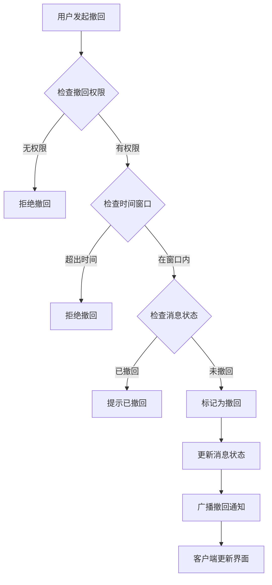
```mermaid
flowchart TD
A[用户发起撤回] --> B{检查撤回权限}
B --> |无权限| C[拒绝撤回]
B --> |有权限| D{检查时间窗口}
D --> |超出时间| E[拒绝撤回]
D --> |在窗口内| F{检查消息状态}
F --> |已撤回| G[提示已撤回]
F --> |未撤回| H[标记为撤回]
H --> I[更新消息状态]
I --> J[广播撤回通知]
J --> K[客户端更新界面]
```

**图表来源**
- [ImPrivateMessageDO.java:1-200](file://yudao-module-im/src/main/java/cn/iocoder/yudao/module/im/dal/dataobject/message/ImPrivateMessageDO.java#L1-L200)

### 在线状态管理机制

#### 用户在线状态存储
系统通过Redis实现高效的在线状态管理，支持多设备登录：

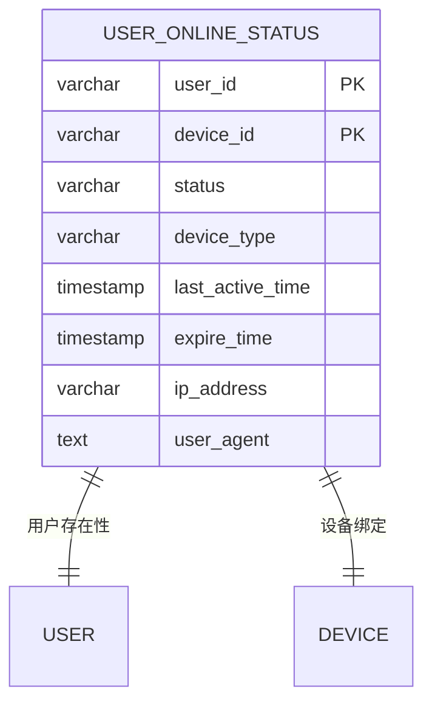
```mermaid
erDiagram
USER_ONLINE_STATUS {
varchar user_id PK
varchar device_id PK
varchar status
varchar device_type
timestamp last_active_time
timestamp expire_time
varchar ip_address
text user_agent
}
USER_ONLINE_STATUS ||--|| USER : "用户存在性"
USER_ONLINE_STATUS ||--|| DEVICE : "设备绑定"
```

**图表来源**
- [ImStatisticsManagerMapper.java:1-200](file://yudao-module-im/src/main/java/cn/iocoder/yudao/module/im/dal/mysql/statistics/ImStatisticsManagerMapper.java#L1-L200)

#### 断线重连机制
断线重连通过心跳检测和状态恢复实现无缝连接：

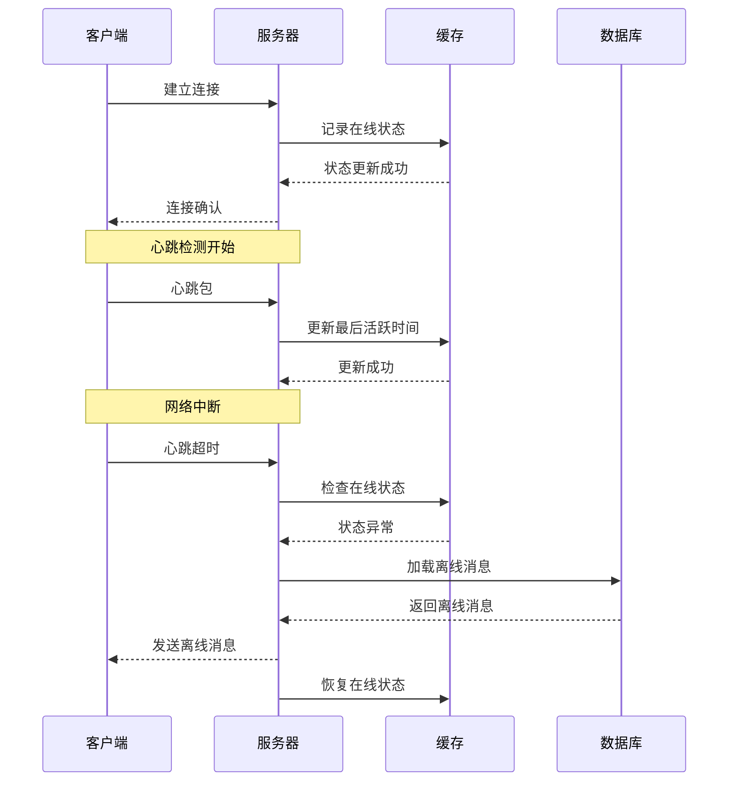
```mermaid
sequenceDiagram
participant Client as 客户端
participant Server as 服务器
participant Redis as 缓存
participant DB as 数据库
Client->>Server : 建立连接
Server->>Redis : 记录在线状态
Redis-->>Server : 状态更新成功
Server-->>Client : 连接确认
Note over Client,Server : 心跳检测开始
Client->>Server : 心跳包
Server->>Redis : 更新最后活跃时间
Redis-->>Server : 更新成功
Note over Client,Server : 网络中断
Client->>Server : 心跳超时
Server->>Redis : 检查在线状态
Redis-->>Server : 状态异常
Server->>DB : 加载离线消息
DB-->>Server : 返回离线消息
Server-->>Client : 发送离线消息
Server->>Redis : 恢复在线状态
```

**图表来源**
- [ImStatisticsManagerMapper.java:1-200](file://yudao-module-im/src/main/java/cn/iocoder/yudao/module/im/dal/mysql/statistics/ImStatisticsManagerMapper.java#L1-L200)

### 敏感词过滤实现

#### 敏感词库设计
敏感词库采用分级分类管理，支持多种过滤模式：

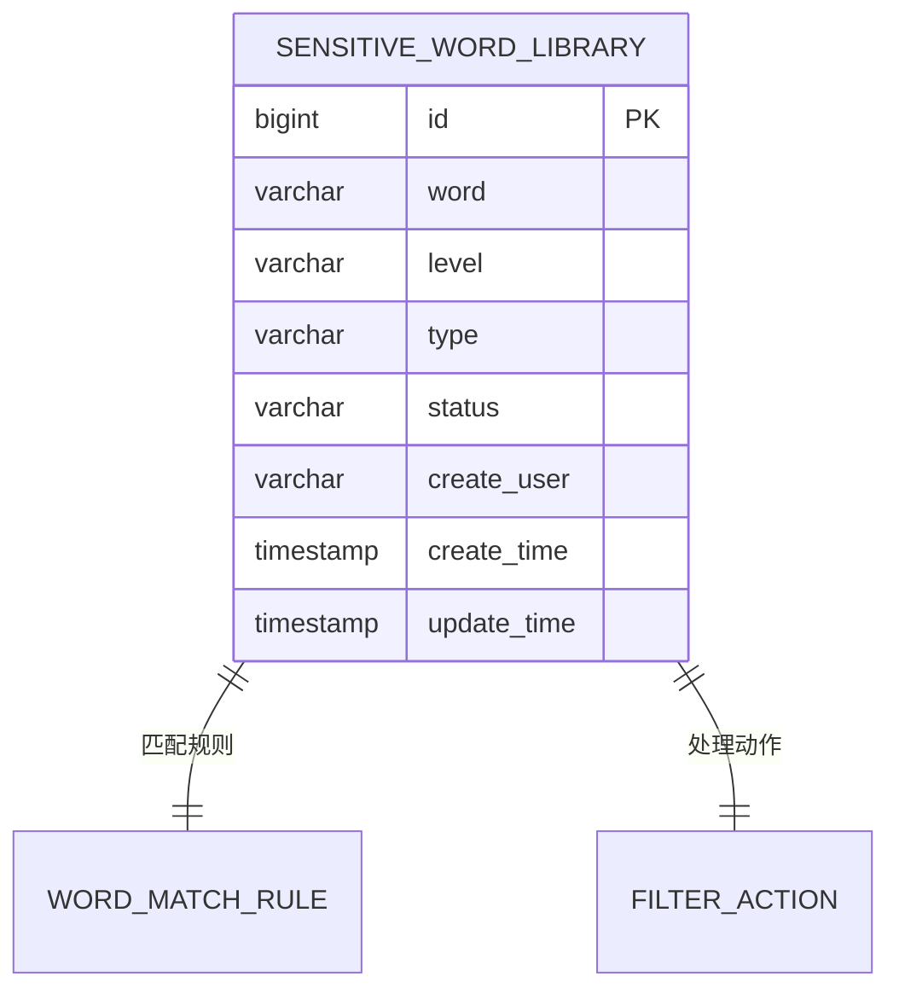
```mermaid
erDiagram
SENSITIVE_WORD_LIBRARY {
bigint id PK
varchar word
varchar level
varchar type
varchar status
varchar create_user
timestamp create_time
timestamp update_time
}
SENSITIVE_WORD_LIBRARY ||--|| WORD_MATCH_RULE : "匹配规则"
SENSITIVE_WORD_LIBRARY ||--|| FILTER_ACTION : "处理动作"
```

**图表来源**
- [ImSensitiveWordDO.java:1-200](file://yudao-module-im/src/main/java/cn/iocoder/yudao/module/im/dal/dataobject/sensitiveword/ImSensitiveWordDO.java#L1-L200)

#### 实时内容审核流程
内容审核通过多级过滤和人工复核实现：

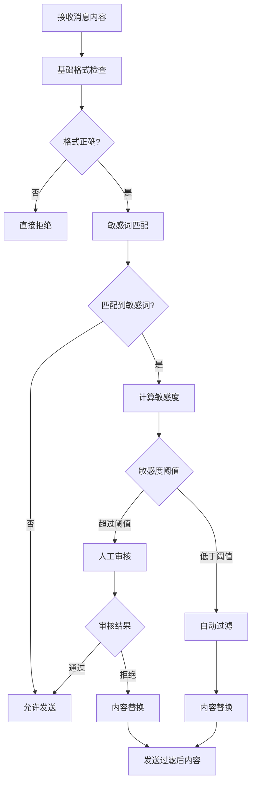
```mermaid
flowchart TD
A[接收消息内容] --> B[基础格式检查]
B --> C{格式正确?}
C --> |否| D[直接拒绝]
C --> |是| E[敏感词匹配]
E --> F{匹配到敏感词?}
F --> |否| G[允许发送]
F --> |是| H[计算敏感度]
H --> I{敏感度阈值}
I --> |超过阈值| J[人工审核]
I --> |低于阈值| K[自动过滤]
J --> L{审核结果}
L --> |通过| G
L --> |拒绝| M[内容替换]
K --> N[内容替换]
N --> O[发送过滤后内容]
M --> O
```

**图表来源**
- [ImSensitiveWordMapper.java:1-200](file://yudao-module-im/src/main/java/cn/iocoder/yudao/module/im/dal/mysql/sensitiveword/ImSensitiveWordMapper.java#L1-L200)

### 消息分页查询优化

#### 索引策略设计
系统采用复合索引优化查询性能：

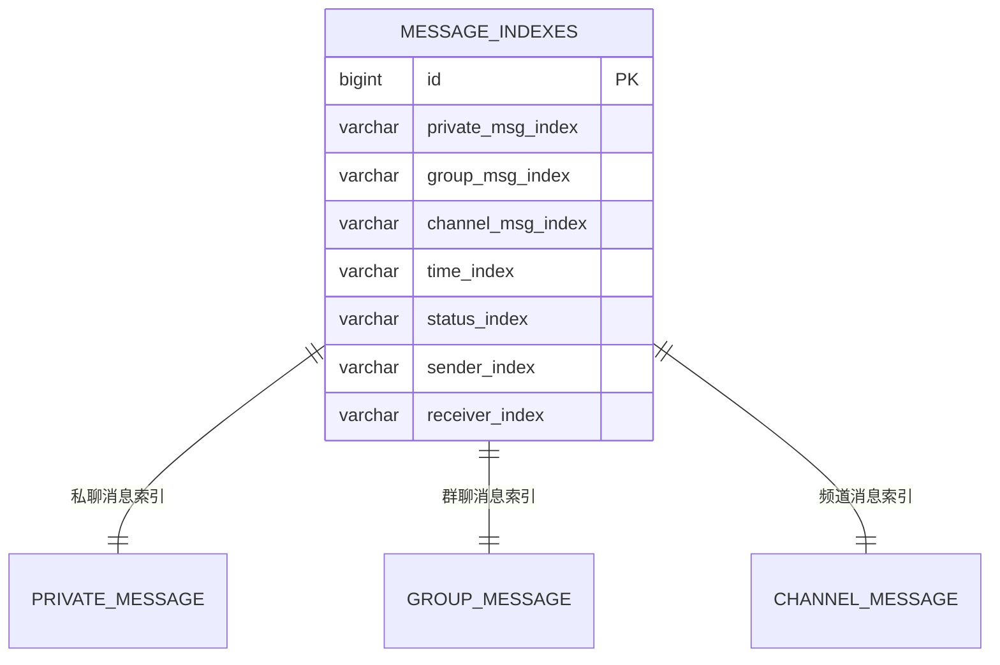
```mermaid
erDiagram
MESSAGE_INDEXES {
bigint id PK
varchar private_msg_index
varchar group_msg_index
varchar channel_msg_index
varchar time_index
varchar status_index
varchar sender_index
varchar receiver_index
}
MESSAGE_INDEXES ||--|| PRIVATE_MESSAGE : "私聊消息索引"
MESSAGE_INDEXES ||--|| GROUP_MESSAGE : "群聊消息索引"
MESSAGE_INDEXES ||--|| CHANNEL_MESSAGE : "频道消息索引"
```

**图表来源**
- [ImPrivateMessageMapper.java:1-200](file://yudao-module-im/src/main/java/cn/iocoder/yudao/module/im/dal/mysql/message/ImPrivateMessageMapper.java#L1-L200)
- [ImGroupMessageMapper.java:1-200](file://yudao-module-im/src/main/java/cn/iocoder/yudao/module/im/dal/mysql/message/ImGroupMessageMapper.java#L1-L200)
- [ImChannelMessageMapper.java:1-200](file://yudao-module-im/src/main/java/cn/iocoder/yudao/module/im/dal/mysql/message/ImChannelMessageMapper.java#L1-L200)

#### 分页查询算法
采用游标分页避免深度分页性能问题：

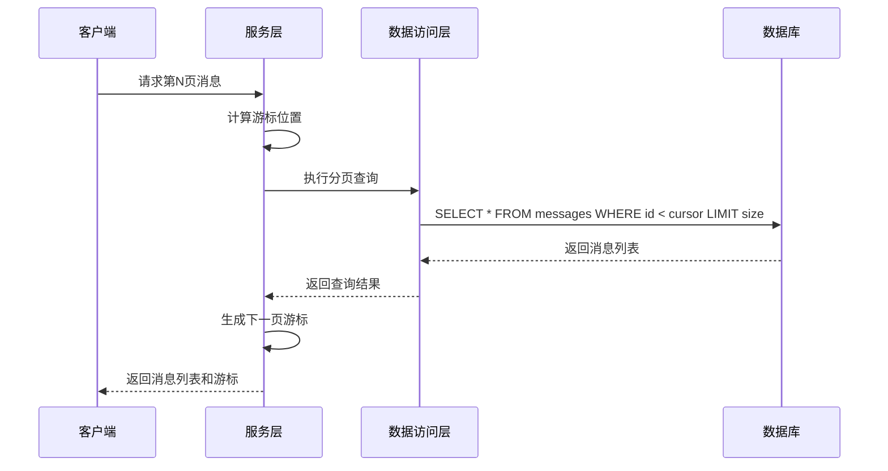
```mermaid
sequenceDiagram
participant Client as 客户端
participant Service as 服务层
participant Mapper as 数据访问层
participant DB as 数据库
Client->>Service : 请求第N页消息
Service->>Service : 计算游标位置
Service->>Mapper : 执行分页查询
Mapper->>DB : SELECT * FROM messages WHERE id < cursor LIMIT size
DB-->>Mapper : 返回消息列表
Mapper-->>Service : 返回查询结果
Service->>Service : 生成下一页游标
Service-->>Client : 返回消息列表和游标
```

**图表来源**
- [ImPrivateMessageMapper.java:1-200](file://yudao-module-im/src/main/java/cn/iocoder/yudao/module/im/dal/mysql/message/ImPrivateMessageMapper.java#L1-L200)

### 辅助表设计

#### 会话表设计
会话表用于维护用户间的对话状态：

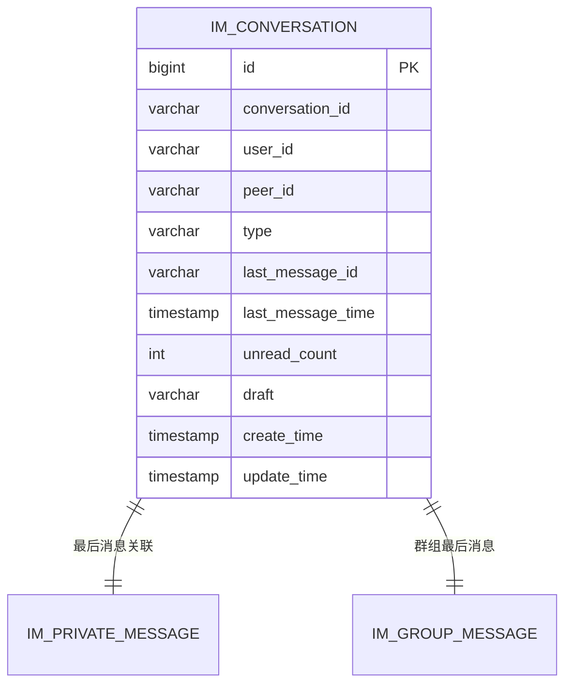
```mermaid
erDiagram
IM_CONVERSATION {
bigint id PK
varchar conversation_id
varchar user_id
varchar peer_id
varchar type
varchar last_message_id
timestamp last_message_time
int unread_count
varchar draft
timestamp create_time
timestamp update_time
}
IM_CONVERSATION ||--|| IM_PRIVATE_MESSAGE : "最后消息关联"
IM_CONVERSATION ||--|| IM_GROUP_MESSAGE : "群组最后消息"
```

**图表来源**
- [ImConversationTypeEnum.java:1-200](file://yudao-module-im/src/main/java/cn/iocoder/yudao/module/im/enums/ImConversationTypeEnum.java#L1-L200)

#### 消息统计表设计
消息统计表提供数据分析和报表支持：

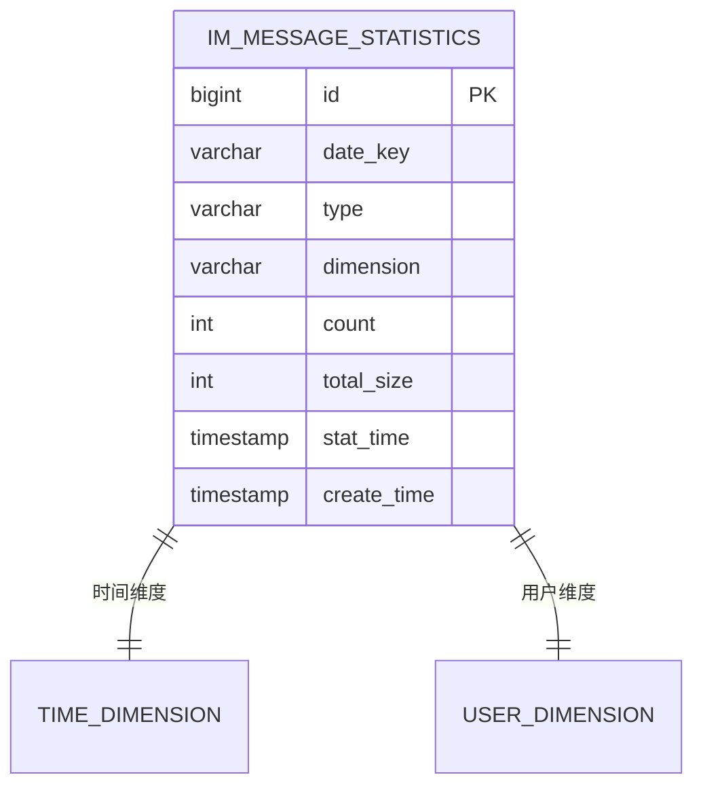
```mermaid
erDiagram
IM_MESSAGE_STATISTICS {
bigint id PK
varchar date_key
varchar type
varchar dimension
int count
int total_size
timestamp stat_time
timestamp create_time
}
IM_MESSAGE_STATISTICS ||--|| TIME_DIMENSION : "时间维度"
IM_MESSAGE_STATISTICS ||--|| USER_DIMENSION : "用户维度"
```

**图表来源**
- [ImStatisticsManagerMapper.java:1-200](file://yudao-module-im/src/main/java/cn/iocoder/yudao/module/im/dal/mysql/statistics/ImStatisticsManagerMapper.java#L1-L200)

**章节来源**
- [ImPrivateMessageMapper.java:1-200](file://yudao-module-im/src/main/java/cn/iocoder/yudao/module/im/dal/mysql/message/ImPrivateMessageMapper.java#L1-L200)
- [ImGroupMessageMapper.java:1-200](file://yudao-module-im/src/main/java/cn/iocoder/yudao/module/im/dal/mysql/message/ImGroupMessageMapper.java#L1-L200)
- [ImChannelMessageMapper.java:1-200](file://yudao-module-im/src/main/java/cn/iocoder/yudao/module/im/dal/mysql/message/ImChannelMessageMapper.java#L1-L200)
- [ImFriendMapper.java:1-200](file://yudao-module-im/src/main/java/cn/iocoder/yudao/module/im/dal/mysql/friend/ImFriendMapper.java#L1-L200)
- [ImGroupMapper.java:1-200](file://yudao-module-im/src/main/java/cn/iocoder/yudao/module/im/dal/mysql/group/ImGroupMapper.java#L1-L200)
- [ImGroupMemberMapper.java:1-200](file://yudao-module-im/src/main/java/cn/iocoder/yudao/module/im/dal/mysql/group/ImGroupMemberMapper.java#L1-L200)
- [ImSensitiveWordMapper.java:1-200](file://yudao-module-im/src/main/java/cn/iocoder/yudao/module/im/dal/mysql/sensitiveword/ImSensitiveWordMapper.java#L1-L200)
- [ImStatisticsManagerMapper.java:1-200](file://yudao-module-im/src/main/java/cn/iocoder/yudao/module/im/dal/mysql/statistics/ImStatisticsManagerMapper.java#L1-L200)
- [ImMessageUtils.java:1-200](file://yudao-module-im/src/main/java/cn/iocoder/yudao/module/im/util/ImMessageUtils.java#L1-L200)
- [ImConversationTypeEnum.java:1-200](file://yudao-module-im/src/main/java/cn/iocoder/yudao/module/im/enums/ImConversationTypeEnum.java#L1-L200)

## 依赖分析

```mermaid
graph TB
subgraph "核心依赖关系"
A[ImPrivateMessageDO] --> B[ImPrivateMessageMapper]
C[ImGroupMessageDO] --> D[ImGroupMessageMapper]
E[ImChannelMessageDO] --> F[ImChannelMessageMapper]
G[ImFriendDO] --> H[ImFriendMapper]
I[ImGroupDO] --> J[ImGroupMapper]
K[ImGroupMemberDO] --> L[ImGroupMemberMapper]
M[ImSensitiveWordDO] --> N[ImSensitiveWordMapper]
end
subgraph "枚举依赖"
O[ImCommonConstants] --> A
O --> C
O --> E
P[ErrorCodeConstants] --> B
P --> D
P --> F
P --> H
P --> J
P --> L
P --> N
end
subgraph "工具类依赖"
Q[ImMessageUtils] --> A
Q --> C
Q --> E
end
```

**图表来源**
- [ImPrivateMessageDO.java:1-200](file://yudao-module-im/src/main/java/cn/iocoder/yudao/module/im/dal/dataobject/message/ImPrivateMessageDO.java#L1-L200)
- [ImGroupMessageDO.java:1-200](file://yudao-module-im/src/main/java/cn/iocoder/yudao/module/im/dal/dataobject/message/ImGroupMessageDO.java#L1-L200)
- [ImChannelMessageDO.java:1-200](file://yudao-module-im/src/main/java/cn/iocoder/yudao/module/im/dal/dataobject/message/ImChannelMessageDO.java#L1-L200)
- [ImFriendDO.java:1-200](file://yudao-module-im/src/main/java/cn/iocoder/yudao/module/im/dal/dataobject/friend/ImFriendDO.java#L1-L200)
- [ImGroupDO.java:1-200](file://yudao-module-im/src/main/java/cn/iocoder/yudao/module/im/dal/dataobject/group/ImGroupDO.java#L1-L200)
- [ImGroupMemberDO.java:1-200](file://yudao-module-im/src/main/java/cn/iocoder/yudao/module/im/dal/dataobject/group/ImGroupMemberDO.java#L1-L200)
- [ImSensitiveWordDO.java:1-200](file://yudao-module-im/src/main/java/cn/iocoder/yudao/module/im/dal/dataobject/sensitiveword/ImSensitiveWordDO.java#L1-L200)

**章节来源**
- [ImPrivateMessageDO.java:1-200](file://yudao-module-im/src/main/java/cn/iocoder/yudao/module/im/dal/dataobject/message/ImPrivateMessageDO.java#L1-L200)
- [ImGroupMessageDO.java:1-200](file://yudao-module-im/src/main/java/cn/iocoder/yudao/module/im/dal/dataobject/message/ImGroupMessageDO.java#L1-L200)
- [ImChannelMessageDO.java:1-200](file://yudao-module-im/src/main/java/cn/iocoder/yudao/module/im/dal/dataobject/message/ImChannelMessageDO.java#L1-L200)
- [ImFriendDO.java:1-200](file://yudao-module-im/src/main/java/cn/iocoder/yudao/module/im/dal/dataobject/friend/ImFriendDO.java#L1-L200)
- [ImGroupDO.java:1-200](file://yudao-module-im/src/main/java/cn/iocoder/yudao/module/im/dal/dataobject/group/ImGroupDO.java#L1-L200)
- [ImGroupMemberDO.java:1-200](file://yudao-module-im/src/main/java/cn/iocoder/yudao/module/im/dal/dataobject/group/ImGroupMemberDO.java#L1-L200)
- [ImSensitiveWordDO.java:1-200](file://yudao-module-im/src/main/java/cn/iocoder/yudao/module/im/dal/dataobject/sensitiveword/ImSensitiveWordDO.java#L1-L200)

## 性能考虑

### 数据库性能优化策略

#### 索引优化
- **主键索引**：所有表的主键自动建立唯一索引
- **复合索引**：按查询频率建立常用查询条件的复合索引
- **部分索引**：对高频过滤条件建立条件索引
- **函数索引**：对常用函数操作建立函数索引

#### 查询优化
- **分页优化**：采用游标分页避免深度分页
- **批量操作**：支持批量插入和批量更新
- **连接优化**：合理使用JOIN减少查询次数
- **缓存策略**：热点数据缓存到Redis

#### 存储优化
- **分区策略**：按时间对大表进行分区
- **归档策略**：历史数据定期归档
- **压缩策略**：启用数据库压缩功能
- **清理策略**：定期清理过期数据

### 缓存策略

#### 多级缓存架构
- **本地缓存**：JVM内存缓存热点数据
- **分布式缓存**：Redis集群缓存用户状态
- **CDN缓存**：静态资源缓存到CDN
- **浏览器缓存**：前端资源缓存配置

#### 缓存一致性
- **失效策略**：主动失效和被动失效结合
- **双写一致**：数据库和缓存同时更新
- **最终一致**：保证数据最终一致性
- **强一致**：关键数据采用强一致策略

## 故障排除指南

### 常见问题诊断

#### 连接问题
- **连接超时**：检查数据库连接池配置
- **连接泄漏**：监控连接使用情况
- **连接抖动**：检查网络稳定性
- **连接池耗尽**：调整连接池大小

#### 性能问题
- **慢查询**：分析执行计划和索引使用
- **锁等待**：检查事务隔离级别和锁竞争
- **内存不足**：监控JVM内存使用情况
- **磁盘IO**：检查磁盘空间和IO性能

#### 数据一致性问题
- **数据丢失**：检查事务提交和回滚
- **脏读**：调整事务隔离级别
- **幻读**：使用合适的查询方式
- **不可重复读**：重新设计业务逻辑

### 错误码定义

系统采用统一的错误码体系：

| 错误码 | 错误类型 | 描述 |
|--------|----------|------|
| 10001 | 参数错误 | 请求参数不合法 |
| 10002 | 权限错误 | 用户权限不足 |
| 10003 | 业务错误 | 业务逻辑错误 |
| 10004 | 系统错误 | 系统内部错误 |
| 10005 | 超时错误 | 操作超时 |
| 10006 | 重复错误 | 操作重复执行 |

**章节来源**
- [ErrorCodeConstants.java:1-200](file://yudao-module-im/src/main/java/cn/iocoder/yudao/module/im/enums/ErrorCodeConstants.java#L1-L200)
- [ImCommonConstants.java:1-200](file://yudao-module-im/src/main/java/cn/iocoder/yudao/module/im/enums/ImCommonConstants.java#L1-L200)

## 结论

本即时通讯数据库设计方案具有以下特点：

1. **模块化设计**：采用清晰的功能模块划分，便于维护和扩展
2. **高性能优化**：通过合理的索引策略和缓存机制保证系统性能
3. **高可用保障**：完善的错误处理和故障恢复机制
4. **安全性考虑**：敏感词过滤和权限控制确保系统安全
5. **可扩展性**：支持水平扩展和垂直扩展的架构设计

该设计方案能够满足大规模即时通讯应用的需求，在保证性能的同时提供了良好的用户体验和系统稳定性。