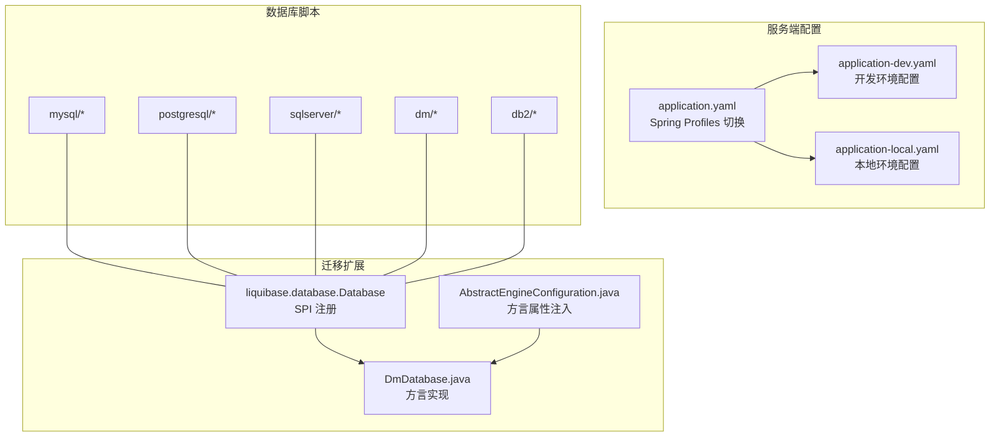
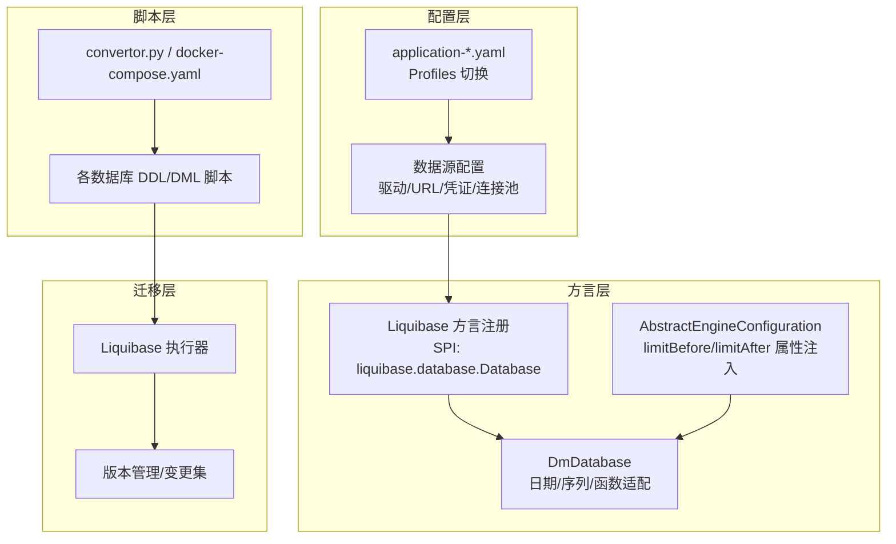
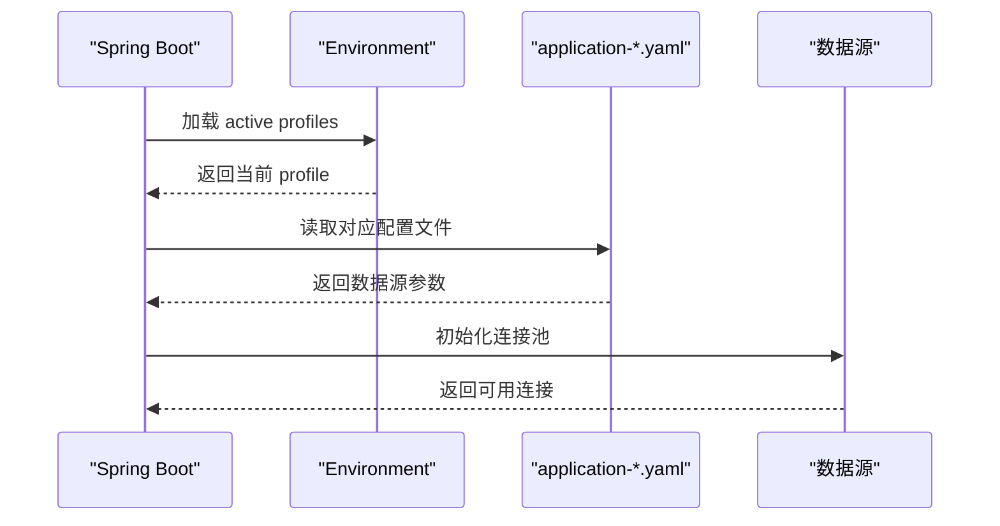
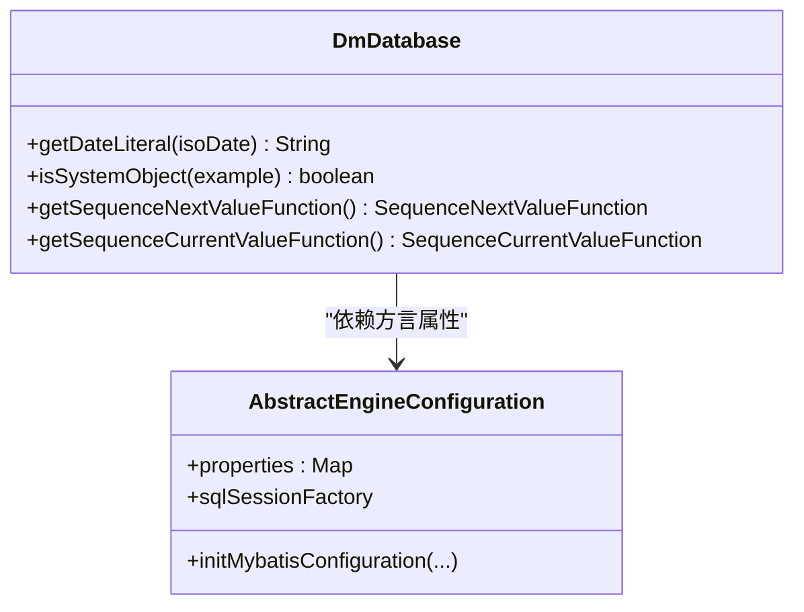
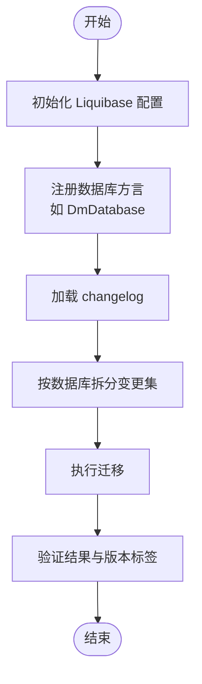
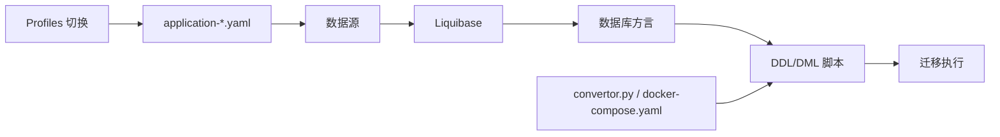

# 多数据库支持设计

<cite>
**本文引用的文件**
- [application.yaml](file://yudao-server/src/main/resources/application.yaml)
- [application-dev.yaml](file://yudao-server/src/main/resources/application-dev.yaml)
- [application-local.yaml](file://yudao-server/src/main/resources/application-local.yaml)
- [AbstractEngineConfiguration.java](file://sql/dm/flowable-patch/src/main/java/org/flowable/common/engine/impl/AbstractEngineConfiguration.java)
- [DmDatabase.java](file://sql/dm/flowable-patch/src/main/java/liquibase/database/core/DmDatabase.java)
- [liquibase.database.Database](file://sql/dm/flowable-patch/src/main/resources/META-INF/services/liquibase.database.Database)
- [README.md](file://sql/db2/README.md)
- [mysql/bpm.sql](file://sql/mysql/bpm.sql)
- [mysql/quartz.sql](file://sql/mysql/quartz.sql)
- [postgresql/bpm.sql](file://sql/postgresql/bpm.sql)
- [postgresql/opshub-step1.sql](file://sql/postgresql/opshub-step1.sql)
- [sqlserver/quartz.sql](file://sql/sqlserver/quartz.sql)
- [dm/quartz.sql](file://sql/dm/quartz.sql)
- [convertor.py](file://sql/tools/convertor.py)
- [docker-compose.yaml](file://sql/tools/docker-compose.yaml)
- [README.md](file://sql/tools/README.md)
</cite>

## 目录
1. [引言](#引言)
2. [项目结构](#项目结构)
3. [核心组件](#核心组件)
4. [架构总览](#架构总览)
5. [详细组件分析](#详细组件分析)
6. [依赖关系分析](#依赖关系分析)
7. [性能考虑](#性能考虑)
8. [故障排查指南](#故障排查指南)
9. [结论](#结论)
10. [附录](#附录)

## 引言
本设计文档聚焦于芋道系统对多数据库引擎的支持策略与落地实践，覆盖 MySQL、PostgreSQL、Oracle、达梦、DB2、SQL Server 等数据库的适配路径。内容包括：
- SQL 语法差异处理：分页查询、序列生成、日期与字符串函数的兼容性实现
- 方言配置机制：MyBatis 方言设置、SQL 映射文件的多数据库适配
- 多环境数据库连接配置：开发、测试、生产环境的差异化配置
- 数据库迁移工具使用：Liquibase 配置、版本管理、迁移脚本编写
- 性能对比与优化：不同数据库在高并发场景下的表现与优化策略

## 项目结构
芋道系统通过“模块化 + 资源隔离”的方式组织多数据库支持：
- 核心运行配置位于服务端资源目录，按 Spring Profiles 切换不同环境数据库
- 数据库脚本与迁移补丁集中存放于 sql 目录，按数据库类型分层
- 达梦等特定数据库的 Liquibase 扩展通过 SPI 注册

图表来源
- [application.yaml:1-200](file://yudao-server/src/main/resources/application.yaml#L1-L200)
- [application-dev.yaml:1-200](file://yudao-server/src/main/resources/application-dev.yaml#L1-L200)
- [application-local.yaml:1-200](file://yudao-server/src/main/resources/application-local.yaml#L1-L200)
- [liquibase.database.Database:1-21](file://sql/dm/flowable-patch/src/main/resources/META-INF/services/liquibase.database.Database#L1-L21)
- [DmDatabase.java:1-289](file://sql/dm/flowable-patch/src/main/java/liquibase/database/core/DmDatabase.java#L1-L289)
- [AbstractEngineConfiguration.java:454-864](file://sql/dm/flowable-patch/src/main/java/org/flowable/common/engine/impl/AbstractEngineConfiguration.java#L454-L864)

章节来源
- [application.yaml:1-200](file://yudao-server/src/main/resources/application.yaml#L1-L200)
- [application-dev.yaml:1-200](file://yudao-server/src/main/resources/application-dev.yaml#L1-L200)
- [application-local.yaml:1-200](file://yudao-server/src/main/resources/application-local.yaml#L1-L200)
- [liquibase.database.Database:1-21](file://sql/dm/flowable-patch/src/main/resources/META-INF/services/liquibase.database.Database#L1-L21)

## 核心组件
- 多环境数据库配置
  - 通过 Spring Profiles 在 application.yaml 中定义 profiles，并在各环境配置文件中覆盖数据源参数（驱动、URL、用户名、密码、连接池参数等）
  - 开发与本地环境分别提供 application-dev.yaml 与 application-local.yaml，便于快速切换
- 达梦数据库方言扩展
  - 通过 SPI 注册 DmDatabase，使 Liquibase 能识别达梦数据库并应用相应方言
  - 达梦方言实现中包含日期字面量转换、序列函数适配等逻辑
- 抽象引擎配置中的方言属性
  - AbstractEngineConfiguration 中为不同数据库注入 limitBefore/limitAfter 等方言属性，支撑分页与查询限制
- 数据库脚本与迁移工具
  - 各数据库独立的 DDL/DML 脚本，配合 Liquibase 进行版本化迁移
  - 提供转换器与容器编排工具，辅助脚本迁移与环境搭建

章节来源
- [application.yaml:1-200](file://yudao-server/src/main/resources/application.yaml#L1-L200)
- [application-dev.yaml:1-200](file://yudao-server/src/main/resources/application-dev.yaml#L1-L200)
- [application-local.yaml:1-200](file://yudao-server/src/main/resources/application-local.yaml#L1-L200)
- [DmDatabase.java:1-289](file://sql/dm/flowable-patch/src/main/java/liquibase/database/core/DmDatabase.java#L1-L289)
- [AbstractEngineConfiguration.java:454-864](file://sql/dm/flowable-patch/src/main/java/org/flowable/common/engine/impl/AbstractEngineConfiguration.java#L454-L864)
- [liquibase.database.Database:1-21](file://sql/dm/flowable-patch/src/main/resources/META-INF/services/liquibase.database.Database#L1-L21)

## 架构总览
多数据库支持由“配置层 + 方言层 + 脚本层 + 迁移层”构成，形成可插拔的适配架构。

图表来源
- [application.yaml:1-200](file://yudao-server/src/main/resources/application.yaml#L1-L200)
- [liquibase.database.Database:1-21](file://sql/dm/flowable-patch/src/main/resources/META-INF/services/liquibase.database.Database#L1-L21)
- [DmDatabase.java:1-289](file://sql/dm/flowable-patch/src/main/java/liquibase/database/core/DmDatabase.java#L1-L289)
- [AbstractEngineConfiguration.java:454-864](file://sql/dm/flowable-patch/src/main/java/org/flowable/common/engine/impl/AbstractEngineConfiguration.java#L454-L864)
- [convertor.py:1-200](file://sql/tools/convertor.py#L1-L200)
- [docker-compose.yaml:1-200](file://sql/tools/docker-compose.yaml#L1-L200)

## 详细组件分析

### 组件一：多环境数据库连接配置
- 配置入口
  - application.yaml 定义 profiles，application-dev.yaml 与 application-local.yaml 分别覆盖开发与本地环境的数据源参数
- 切换机制
  - 通过激活不同的 Spring Profile 实现环境隔离；本地默认 profile 通常为 local
- 连接池与安全
  - 支持连接池最大活跃数、空闲连接、超时、心跳等参数配置
  - 密码字段建议通过外部化配置或密钥管理工具注入

图表来源
- [application.yaml:1-200](file://yudao-server/src/main/resources/application.yaml#L1-L200)
- [application-dev.yaml:1-200](file://yudao-server/src/main/resources/application-dev.yaml#L1-L200)
- [application-local.yaml:1-200](file://yudao-server/src/main/resources/application-local.yaml#L1-L200)

章节来源
- [application.yaml:1-200](file://yudao-server/src/main/resources/application.yaml#L1-L200)
- [application-dev.yaml:1-200](file://yudao-server/src/main/resources/application-dev.yaml#L1-L200)
- [application-local.yaml:1-200](file://yudao-server/src/main/resources/application-local.yaml#L1-L200)

### 组件二：Liquibase 达梦方言适配
- SPI 注册
  - 通过 META-INF/services/liquibase.database.Database 注册 DmDatabase，使 Liquibase 能识别达梦数据库
- 方言特性
  - 日期字面量转换：根据输入格式选择 TO_DATE 或 TO_TIMESTAMP
  - 序列函数：提供序列当前值/下一个值函数的方言表达
  - 系统对象判断：区分用户对象与系统对象，避免误操作
- 抽象引擎配置联动
  - AbstractEngineConfiguration 注入 limitBefore/limitAfter 等方言属性，用于分页与查询限制

图表来源
- [DmDatabase.java:1-289](file://sql/dm/flowable-patch/src/main/java/liquibase/database/core/DmDatabase.java#L1-L289)
- [AbstractEngineConfiguration.java:454-864](file://sql/dm/flowable-patch/src/main/java/org/flowable/common/engine/impl/AbstractEngineConfiguration.java#L454-L864)

章节来源
- [liquibase.database.Database:1-21](file://sql/dm/flowable-patch/src/main/resources/META-INF/services/liquibase.database.Database#L1-L21)
- [DmDatabase.java:1-289](file://sql/dm/flowable-patch/src/main/java/liquibase/database/core/DmDatabase.java#L1-L289)
- [AbstractEngineConfiguration.java:454-864](file://sql/dm/flowable-patch/src/main/java/org/flowable/common/engine/impl/AbstractEngineConfiguration.java#L454-L864)

### 组件三：SQL 映射文件的多数据库适配
- 通用策略
  - 将数据库特定语法封装在 XML 映射文件中，通过条件语句或命名空间区分不同数据库
  - 使用占位符与动态 SQL，按数据库类型拼接方言片段
- 常见适配点
  - 分页：MySQL 使用 LIMIT，PostgreSQL/SQL Server 使用 OFFSET/FETCH，DB2/达梦使用 ROW_NUMBER()/TOP
  - 序列：PostgreSQL 使用 currval/nextval，Oracle 使用 NEXTVAL/CURRVAL，达梦使用 SEQUENCE
  - 日期函数：TO_DATE/TO_TIMESTAMP/转换函数在不同数据库间差异较大
  - 字符串函数：CONCAT/INSTR/SUBSTR/SUBSTRING 等函数名与行为存在差异

章节来源
- [mysql/bpm.sql:1-200](file://sql/mysql/bpm.sql#L1-L200)
- [mysql/quartz.sql:1-200](file://sql/mysql/quartz.sql#L1-L200)
- [postgresql/bpm.sql:1-200](file://sql/postgresql/bpm.sql#L1-L200)
- [postgresql/opshub-step1.sql:1-200](file://sql/postgresql/opshub-step1.sql#L1-L200)
- [sqlserver/quartz.sql:1-200](file://sql/sqlserver/quartz.sql#L1-L200)
- [dm/quartz.sql:1-200](file://sql/dm/quartz.sql#L1-L200)

### 组件四：数据库迁移工具使用指南（Liquibase）
- 配置
  - 在项目中引入 Liquibase 依赖，配置 changelog 文件与数据库连接信息
  - 对达梦数据库，确保已注册 DmDatabase 并启用对应方言
- 版本管理
  - 以变更集（ChangeSet）形式管理 DDL/DML 变更，按数据库类型拆分脚本
  - 使用标签（Tag）标记里程碑版本，便于回滚与发布
- 迁移脚本编写
  - 将数据库特定语法放入对应数据库的变更集中，避免跨库冲突
  - 使用预处理与后处理脚本，完成索引重建、统计更新等维护工作
- 工具链
  - convertor.py：辅助脚本转换与格式统一
  - docker-compose.yaml：一键拉起目标数据库实例，验证迁移脚本

图表来源
- [liquibase.database.Database:1-21](file://sql/dm/flowable-patch/src/main/resources/META-INF/services/liquibase.database.Database#L1-L21)
- [DmDatabase.java:1-289](file://sql/dm/flowable-patch/src/main/java/liquibase/database/core/DmDatabase.java#L1-L289)
- [convertor.py:1-200](file://sql/tools/convertor.py#L1-L200)
- [docker-compose.yaml:1-200](file://sql/tools/docker-compose.yaml#L1-L200)

章节来源
- [liquibase.database.Database:1-21](file://sql/dm/flowable-patch/src/main/resources/META-INF/services/liquibase.database.Database#L1-L21)
- [DmDatabase.java:1-289](file://sql/dm/flowable-patch/src/main/java/liquibase/database/core/DmDatabase.java#L1-L289)
- [convertor.py:1-200](file://sql/tools/convertor.py#L1-L200)
- [docker-compose.yaml:1-200](file://sql/tools/docker-compose.yaml#L1-L200)

### 组件五：DB2 适配说明
- 当前仓库提供了 DB2 的说明文档，建议结合 DB2 官方方言与 JDBC 行为进行适配
- 迁移与脚本方面，遵循与其它数据库一致的变更集管理与版本控制流程

章节来源
- [README.md:1-200](file://sql/db2/README.md#L1-L200)

## 依赖关系分析
- 配置层依赖 Spring Profiles 与外部化配置，实现环境解耦
- 方言层依赖 Liquibase SPI 机制，新增数据库只需实现对应接口并注册
- 脚本层与迁移层相互独立，脚本可复用，迁移流程可标准化
- 工具层提供转换与编排能力，降低跨数据库迁移成本

图表来源
- [application.yaml:1-200](file://yudao-server/src/main/resources/application.yaml#L1-L200)
- [liquibase.database.Database:1-21](file://sql/dm/flowable-patch/src/main/resources/META-INF/services/liquibase.database.Database#L1-L21)
- [convertor.py:1-200](file://sql/tools/convertor.py#L1-L200)
- [docker-compose.yaml:1-200](file://sql/tools/docker-compose.yaml#L1-L200)

章节来源
- [application.yaml:1-200](file://yudao-server/src/main/resources/application.yaml#L1-L200)
- [liquibase.database.Database:1-21](file://sql/dm/flowable-patch/src/main/resources/META-INF/services/liquibase.database.Database#L1-L21)
- [convertor.py:1-200](file://sql/tools/convertor.py#L1-L200)
- [docker-compose.yaml:1-200](file://sql/tools/docker-compose.yaml#L1-L200)

## 性能考虑
- 连接池调优
  - 根据业务并发与数据库规格调整最大活跃连接、空闲连接、超时与心跳参数
- 查询优化
  - 分页查询优先使用数据库原生分页语法，避免全表扫描
  - 合理使用索引，避免在 WHERE 子句中对列进行函数运算
- 迁移窗口
  - 大规模 DDL 变更尽量安排在低峰时段，必要时采用在线迁移策略
- 监控与压测
  - 结合数据库自带监控与 APM 工具，持续评估不同数据库在高并发场景下的表现

## 故障排查指南
- 数据源连接失败
  - 检查 application-*.yaml 中的 JDBC 驱动、URL、用户名与密码
  - 确认网络连通性与防火墙策略
- 方言不匹配
  - 确认 Liquibase 方言已正确注册（如 DmDatabase）
  - 核对日期字面量与序列函数的方言表达
- 迁移执行异常
  - 查看变更集日志，定位具体失败步骤
  - 使用 convertor.py 统一脚本格式，docker-compose.yaml 快速复现环境

章节来源
- [application-dev.yaml:1-200](file://yudao-server/src/main/resources/application-dev.yaml#L1-L200)
- [application-local.yaml:1-200](file://yudao-server/src/main/resources/application-local.yaml#L1-L200)
- [liquibase.database.Database:1-21](file://sql/dm/flowable-patch/src/main/resources/META-INF/services/liquibase.database.Database#L1-L21)
- [DmDatabase.java:1-289](file://sql/dm/flowable-patch/src/main/java/liquibase/database/core/DmDatabase.java#L1-L289)
- [convertor.py:1-200](file://sql/tools/convertor.py#L1-L200)
- [docker-compose.yaml:1-200](file://sql/tools/docker-compose.yaml#L1-L200)

## 结论
芋道系统通过“配置层 + 方言层 + 脚本层 + 迁移层”的多数据库支持架构，实现了对 MySQL、PostgreSQL、Oracle、达梦、DB2、SQL Server 等数据库的灵活适配。借助 Spring Profiles 的环境隔离、Liquibase 的方言扩展与版本化迁移、以及脚本与工具链的标准化流程，系统能够在多数据库环境下保持一致性与可维护性。

## 附录
- 数据库脚本示例路径
  - [mysql/bpm.sql:1-200](file://sql/mysql/bpm.sql#L1-L200)
  - [mysql/quartz.sql:1-200](file://sql/mysql/quartz.sql#L1-L200)
  - [postgresql/bpm.sql:1-200](file://sql/postgresql/bpm.sql#L1-L200)
  - [postgresql/opshub-step1.sql:1-200](file://sql/postgresql/opshub-step1.sql#L1-L200)
  - [sqlserver/quartz.sql:1-200](file://sql/sqlserver/quartz.sql#L1-L200)
  - [dm/quartz.sql:1-200](file://sql/dm/quartz.sql#L1-L200)
- 迁移工具与说明
  - [convertor.py:1-200](file://sql/tools/convertor.py#L1-L200)
  - [docker-compose.yaml:1-200](file://sql/tools/docker-compose.yaml#L1-L200)
  - [README.md:1-200](file://sql/tools/README.md#L1-L200)