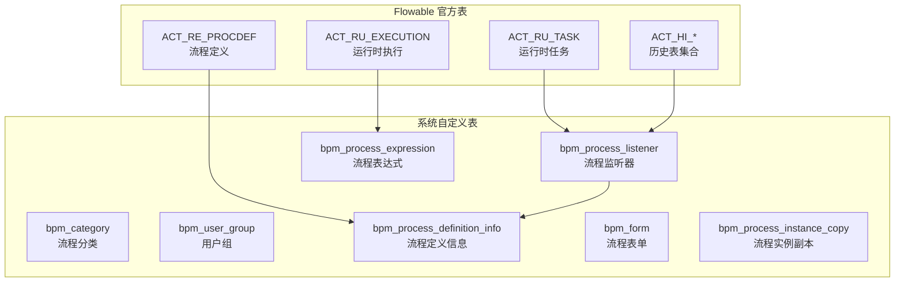
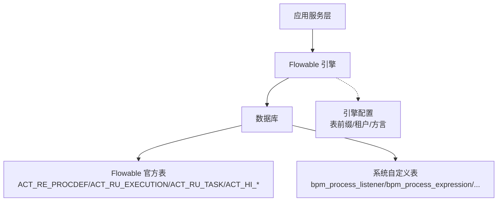
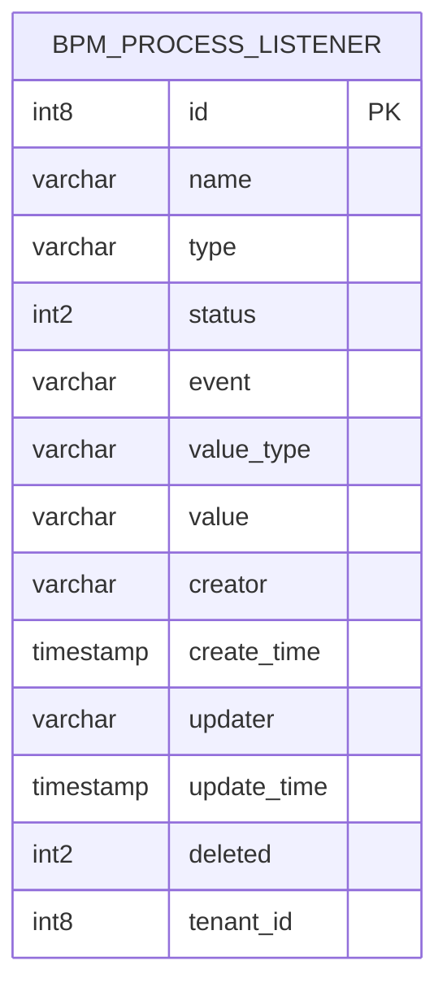
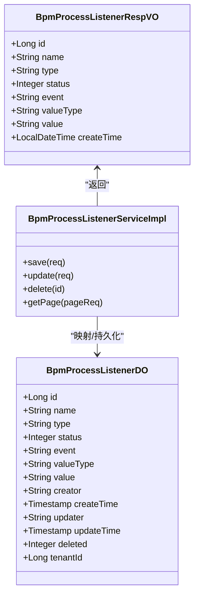
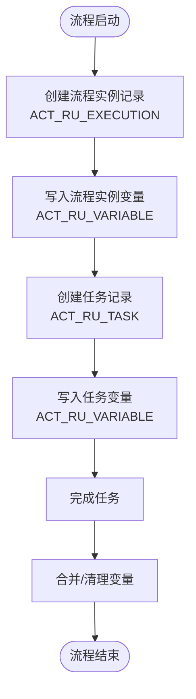
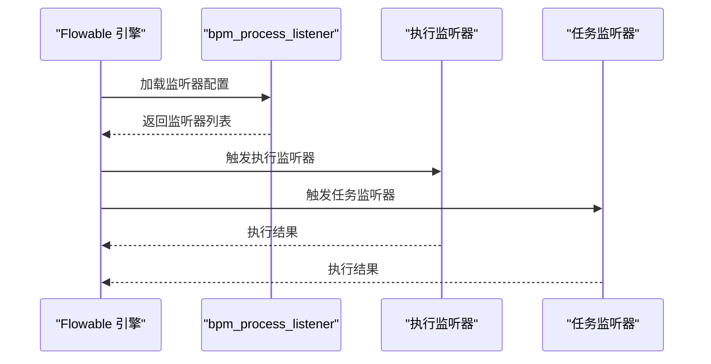
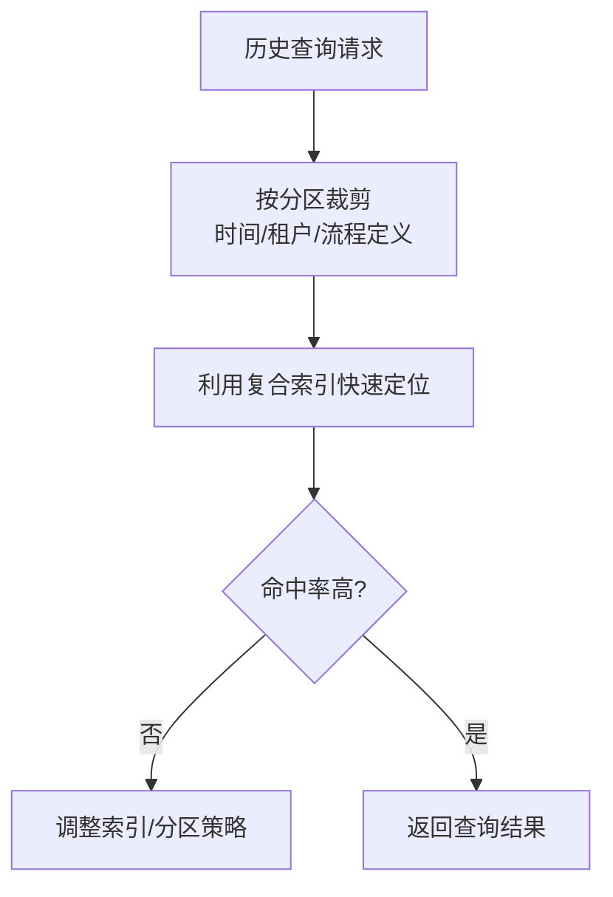
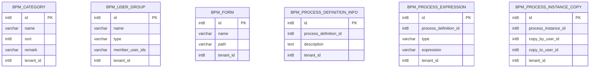
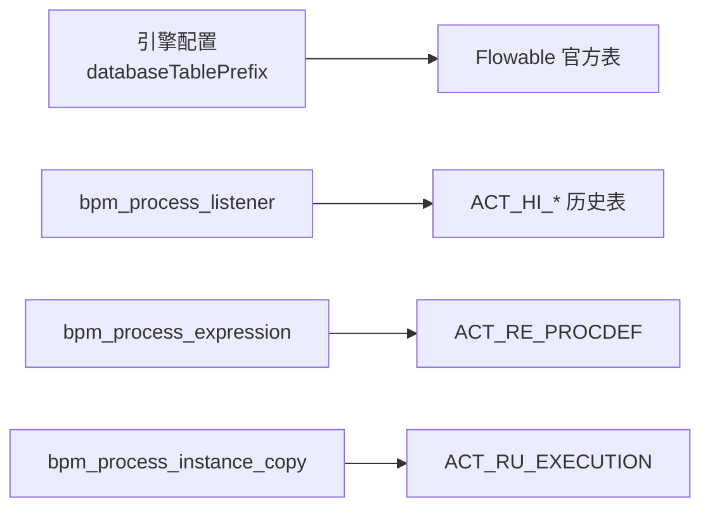

# 工作流数据库设计

<cite>
**本文引用的文件**
- [bpm.sql（PostgreSQL）](file://sql/postgresql/bpm.sql)
- [bpm.sql（MySQL）](file://sql/mysql/bpm.sql)
- [BpmFlowableConfiguration.java](file://yudao-module-bpm/src/main/java/cn/iocoder/yudao/module/bpm/framework/flowable/config/BpmFlowableConfiguration.java)
- [BpmProcessListenerServiceImpl.java](file://yudao-module-bpm/src/main/java/cn/iocoder/yudao/module/bpm/service/definition/BpmProcessListenerServiceImpl.java)
- [BpmProcessListenerDO.java](file://yudao-module-bpm/src/main/java/cn/iocoder/yudao/module/bpm/dal/dataobject/definition/BpmProcessListenerDO.java)
- [BpmProcessListenerRespVO.java](file://yudao-module-bpm/src/main/java/cn/iocoder/yudao/module/bpm/controller/admin/definition/vo/listener/BpmProcessListenerRespVO.java)
- [create_tables_pg.sql](file://yudao-module-bpm/src/test/resources/sql/create_tables_pg.sql)
- [clean.sql](file://yudao-module-bpm/src/test/resources/sql/clean.sql)
- [AbstractEngineConfiguration.java](file://sql/dm/flowable-patch/src/main/java/org/flowable/common/engine/impl/AbstractEngineConfiguration.java)
</cite>

## 目录
1. [简介](#简介)
2. [项目结构](#项目结构)
3. [核心组件](#核心组件)
4. [架构总览](#架构总览)
5. [详细组件分析](#详细组件分析)
6. [依赖关系分析](#依赖关系分析)
7. [性能考虑](#性能考虑)
8. [故障排查指南](#故障排查指南)
9. [结论](#结论)
10. [附录](#附录)

## 简介
本设计文档聚焦于芋道系统中基于 Flowable 的工作流数据库设计，围绕 BPMN 流程在数据库层面的落地进行系统化梳理。内容涵盖：
- 核心流程表：流程定义表、流程实例表、任务表与历史表的设计原则与字段语义
- 变量存储机制：任务变量与流程实例变量的持久化策略
- 候选人与候选组：用户任务分配与组任务处理的表结构设计
- 监听器扩展：流程监听器与任务监听器的数据库支持
- 历史查询优化：历史表分区与索引设计建议
- 辅助表：流程引擎配置表、流程资源表等

## 项目结构
芋道系统的工作流数据库由两部分构成：
- Flowable 官方数据库：通过标准 DDL 初始化 Flowable 的运行时与历史表（如 ACT_RU_EXECUTION、ACT_RU_TASK、ACT_HI_* 等）
- 系统自定义业务表：用于支撑业务扩展，如流程监听器、表达式、分类、用户组等



图表来源
- [bpm.sql（PostgreSQL）:692-731](file://sql/postgresql/bpm.sql#L692-L731)
- [bpm.sql（MySQL）](file://sql/mysql/bpm.sql)
- [create_tables_pg.sql:207-237](file://yudao-module-bpm/src/test/resources/sql/create_tables_pg.sql#L207-L237)

章节来源
- [bpm.sql（PostgreSQL）](file://sql/postgresql/bpm.sql)
- [bpm.sql（MySQL）](file://sql/mysql/bpm.sql)
- [create_tables_pg.sql:207-237](file://yudao-module-bpm/src/test/resources/sql/create_tables_pg.sql#L207-L237)

## 核心组件
- 流程定义表（ACT_RE_PROCDEF）
  - 存储流程模型的版本化定义，包含部署 ID、关键标识、版本号、资源名称、摘要等
  - 支持按租户隔离与最新版本检索策略
- 流程实例表（ACT_RU_EXECUTION）
  - 记录当前正在运行的流程实例与执行分支，包含流程实例 ID、父执行 ID、业务键、活动节点等
  - 作为流程执行上下文的核心载体
- 任务表（ACT_RU_TASK）
  - 记录当前待办任务，包含任务名、执行人、候选人/候选组、优先级、创建时间等
  - 支持任务委派、代理与多实例任务
- 历史表（ACT_HI_* 系列）
  - 包括历史流程实例、历史任务、历史变量、历史活动等，用于审计与报表
  - 建议结合业务维度建立分区与索引以提升查询性能

章节来源
- [bpm.sql（PostgreSQL）](file://sql/postgresql/bpm.sql)
- [bpm.sql（MySQL）](file://sql/mysql/bpm.sql)

## 架构总览
Flowable 在芋道系统中的数据库层采用“官方表 + 自定义表”的混合架构：
- 官方表：由 Flowable 引擎负责维护，承载流程运行时与历史数据
- 自定义表：由业务侧补充，覆盖监听器、表达式、分类、用户组等扩展能力



图表来源
- [AbstractEngineConfiguration.java:278-310](file://sql/dm/flowable-patch/src/main/java/org/flowable/common/engine/impl/AbstractEngineConfiguration.java#L278-L310)
- [BpmFlowableConfiguration.java](file://yudao-module-bpm/src/main/java/cn/iocoder/yudao/module/bpm/framework/flowable/config/BpmFlowableConfiguration.java)

## 详细组件分析

### 流程监听器表（bpm_process_listener）
- 设计要点
  - 字段覆盖监听器名称、类型（执行/任务）、事件、值类型（类/表达式）、值、状态、租户、创建/更新信息
  - 提供序列与主键约束，便于分页与唯一性保证
- 业务价值
  - 将监听器配置持久化，支持在流程定义层面绑定监听器，实现流程启动、结束、任务创建/完成等生命周期事件的扩展
- 关联对象
  - 服务层通过 Mapper 进行增删改查；控制器返回 VO；DO 映射数据库字段



图表来源
- [bpm.sql（PostgreSQL）:692-731](file://sql/postgresql/bpm.sql#L692-L731)
- [create_tables_pg.sql:207-237](file://yudao-module-bpm/src/test/resources/sql/create_tables_pg.sql#L207-L237)



图表来源
- [BpmProcessListenerDO.java](file://yudao-module-bpm/src/main/java/cn/iocoder/yudao/module/bpm/dal/dataobject/definition/BpmProcessListenerDO.java)
- [BpmProcessListenerRespVO.java](file://yudao-module-bpm/src/main/java/cn/iocoder/yudao/module/bpm/controller/admin/definition/vo/listener/BpmProcessListenerRespVO.java)
- [BpmProcessListenerServiceImpl.java:1-31](file://yudao-module-bpm/src/main/java/cn/iocoder/yudao/module/bpm/service/definition/BpmProcessListenerServiceImpl.java#L1-L31)

章节来源
- [bpm.sql（PostgreSQL）:692-731](file://sql/postgresql/bpm.sql#L692-L731)
- [bpm.sql（MySQL）](file://sql/mysql/bpm.sql)
- [create_tables_pg.sql:207-237](file://yudao-module-bpm/src/test/resources/sql/create_tables_pg.sql#L207-L237)
- [BpmProcessListenerServiceImpl.java:1-31](file://yudao-module-bpm/src/main/java/cn/iocoder/yudao/module/bpm/service/definition/BpmProcessListenerServiceImpl.java#L1-L31)
- [BpmProcessListenerDO.java](file://yudao-module-bpm/src/main/java/cn/iocoder/yudao/module/bpm/dal/dataobject/definition/BpmProcessListenerDO.java)
- [BpmProcessListenerRespVO.java](file://yudao-module-bpm/src/main/java/cn/iocoder/yudao/module/bpm/controller/admin/definition/vo/listener/BpmProcessListenerRespVO.java)

### 流程变量存储机制
- 任务变量
  - 通过 ACT_RU_VARIABLE 表存储任务级别的变量，键值对形式，支持不同数据类型
  - 作用域限定为当前任务，随任务生命周期变化
- 流程实例变量
  - 通过 ACT_RU_VARIABLE 表存储流程实例级别的变量，随流程实例生命周期变化
  - 支持跨任务共享与传递，便于业务上下文传递
- 存储策略
  - 使用统一的变量表进行持久化，避免重复建表
  - 通过变量类型与序列化策略兼容不同数据结构



图表来源
- [bpm.sql（PostgreSQL）](file://sql/postgresql/bpm.sql)
- [bpm.sql（MySQL）](file://sql/mysql/bpm.sql)

章节来源
- [bpm.sql（PostgreSQL）](file://sql/postgresql/bpm.sql)
- [bpm.sql（MySQL）](file://sql/mysql/bpm.sql)

### 候选人与候选组管理
- 用户任务分配
  - 候选人/候选组通过 ACT_RU_TASK 中的 assignee、owner、candidate 机制实现
  - 系统可扩展表 bpm_user_group 存储用户组信息，配合表达式策略动态计算候选人
- 组任务处理
  - 候选组通过 ACT_RU_IDENTITYLINK 表关联，支持组任务签收、委托与转办
  - 结合业务策略（部门领导、角色、岗位等）动态生成候选列表

```mermaid
sequenceDiagram
participant Def as "流程定义"
participant Task as "任务表 ACT_RU_TASK"
participant Link as "身份链接 ACT_RU_IDENTITYLINK"
participant Group as "用户组 bpm_user_group"
Def->>Task : 创建用户任务
Task->>Link : 关联候选组/候选人
Task->>Group : 查询候选组成员
Group-->>Task : 返回候选用户列表
Task-->>Task : 任务可被领取/签收
```

图表来源
- [bpm.sql（PostgreSQL）](file://sql/postgresql/bpm.sql)
- [bpm.sql（MySQL）](file://sql/mysql/bpm.sql)
- [create_tables_pg.sql:207-237](file://yudao-module-bpm/src/test/resources/sql/create_tables_pg.sql#L207-L237)

章节来源
- [bpm.sql（PostgreSQL）](file://sql/postgresql/bpm.sql)
- [bpm.sql（MySQL）](file://sql/mysql/bpm.sql)
- [create_tables_pg.sql:207-237](file://yudao-module-bpm/src/test/resources/sql/create_tables_pg.sql#L207-L237)

### 流程监听器与任务监听器的数据库支持
- 监听器类型
  - 执行监听器（execution）：在流程节点开始/结束时触发
  - 任务监听器（task）：在任务创建/删除/完成时触发
- 值类型
  - 类（class）、委托表达式（delegateExpression）、SpEL 表达式（expression）
- 事件
  - start/end 等事件节点，支持流程与任务生命周期
- 数据落库
  - bpm_process_listener 表保存监听器配置，引擎加载后按事件触发执行



图表来源
- [bpm.sql（PostgreSQL）:692-731](file://sql/postgresql/bpm.sql#L692-L731)
- [create_tables_pg.sql:207-237](file://yudao-module-bpm/src/test/resources/sql/create_tables_pg.sql#L207-L237)
- [BpmProcessListenerServiceImpl.java:1-31](file://yudao-module-bpm/src/main/java/cn/iocoder/yudao/module/bpm/service/definition/BpmProcessListenerServiceImpl.java#L1-L31)

章节来源
- [bpm.sql（PostgreSQL）:692-731](file://sql/postgresql/bpm.sql#L692-L731)
- [create_tables_pg.sql:207-237](file://yudao-module-bpm/src/test/resources/sql/create_tables_pg.sql#L207-L237)
- [BpmProcessListenerServiceImpl.java:1-31](file://yudao-module-bpm/src/main/java/cn/iocoder/yudao/module/bpm/service/definition/BpmProcessListenerServiceImpl.java#L1-L31)

### 历史查询优化策略
- 历史表分区
  - 按时间维度（如月/季度）对 ACT_HI_PROCINST、ACT_HI_TASKINST、ACT_HI_VARINST 等进行分区，降低扫描范围
- 索引设计
  - 历史表常用过滤条件建立复合索引：业务键、流程定义 ID、发起人、开始/结束时间、状态等
  - 避免全表扫描，提升审计与报表查询效率
- 清理策略
  - 基于保留期限定期归档或删除历史数据，控制表规模



图表来源
- [bpm.sql（PostgreSQL）](file://sql/postgresql/bpm.sql)
- [bpm.sql（MySQL）](file://sql/mysql/bpm.sql)

章节来源
- [bpm.sql（PostgreSQL）](file://sql/postgresql/bpm.sql)
- [bpm.sql（MySQL）](file://sql/mysql/bpm.sql)

### 辅助表设计说明
- 流程引擎配置表
  - 通过引擎配置项设置表前缀、方言、租户默认值等，确保多租户隔离与命名规范
- 流程资源表
  - bpm_process_definition_info：流程定义的附加信息（如描述、版本说明）
  - bpm_process_expression：流程表达式规则（如候选人表达式）
  - bpm_category：流程分类，便于目录化管理
  - bpm_user_group：用户组定义，支持组任务与动态候选
  - bpm_form：流程表单定义，支持在线表单与数据收集
  - bpm_process_instance_copy：流程实例副本，支持复制/转发场景



图表来源
- [bpm.sql（PostgreSQL）](file://sql/postgresql/bpm.sql)
- [bpm.sql（MySQL）](file://sql/mysql/bpm.sql)
- [create_tables_pg.sql:207-237](file://yudao-module-bpm/src/test/resources/sql/create_tables_pg.sql#L207-L237)
- [clean.sql:1-7](file://yudao-module-bpm/src/test/resources/sql/clean.sql#L1-L7)

章节来源
- [bpm.sql（PostgreSQL）](file://sql/postgresql/bpm.sql)
- [bpm.sql（MySQL）](file://sql/mysql/bpm.sql)
- [create_tables_pg.sql:207-237](file://yudao-module-bpm/src/test/resources/sql/create_tables_pg.sql#L207-L237)
- [clean.sql:1-7](file://yudao-module-bpm/src/test/resources/sql/clean.sql#L1-L7)

## 依赖关系分析
- 引擎配置与表前缀
  - 引擎配置支持设置 databaseTablePrefix 与 tablePrefixIsSchema，确保多租户与多模式下的表识别正确
- 业务表与官方表的耦合
  - bpm_process_listener 与 ACT_HI_* 历史表共同支撑流程审计与扩展
  - bpm_process_expression 与 ACT_RE_PROCDEF 关联，驱动运行时候选计算



图表来源
- [AbstractEngineConfiguration.java:278-310](file://sql/dm/flowable-patch/src/main/java/org/flowable/common/engine/impl/AbstractEngineConfiguration.java#L278-L310)
- [bpm.sql（PostgreSQL）](file://sql/postgresql/bpm.sql)
- [bpm.sql（MySQL）](file://sql/mysql/bpm.sql)

章节来源
- [AbstractEngineConfiguration.java:278-310](file://sql/dm/flowable-patch/src/main/java/org/flowable/common/engine/impl/AbstractEngineConfiguration.java#L278-L310)
- [bpm.sql（PostgreSQL）](file://sql/postgresql/bpm.sql)
- [bpm.sql（MySQL）](file://sql/mysql/bpm.sql)

## 性能考虑
- 表结构层面
  - 为 ACT_HI_* 常用查询字段建立复合索引，减少排序与过滤成本
  - 对大表启用分区，按时间维度拆分，缩短扫描窗口
- 读写分离与缓存
  - 历史查询走只读库或缓存，降低对在线事务的影响
- 清理与归档
  - 制定历史数据保留策略，定期归档冷数据，保持热表规模可控

## 故障排查指南
- 监听器不生效
  - 检查 bpm_process_listener 的状态与事件配置是否正确
  - 确认监听器值类型与目标类/表达式可解析
- 候选人为空
  - 核对 bpm_user_group 成员与表达式计算结果
  - 检查 ACT_RU_IDENTITYLINK 是否正确关联
- 历史查询慢
  - 检查是否命中索引，必要时增加复合索引
  - 评估是否需要分区或查询重写

章节来源
- [bpm.sql（PostgreSQL）:692-731](file://sql/postgresql/bpm.sql#L692-L731)
- [create_tables_pg.sql:207-237](file://yudao-module-bpm/src/test/resources/sql/create_tables_pg.sql#L207-L237)
- [clean.sql:1-7](file://yudao-module-bpm/src/test/resources/sql/clean.sql#L1-L7)

## 结论
芋道系统在 Flowable 基础上，通过“官方表 + 自定义表”的组合实现了完整的流程生命周期管理与业务扩展能力。核心在于：
- 正确理解 Flowable 官方表的作用域与职责
- 借助自定义表补齐业务所需的监听器、表达式、分类、用户组等能力
- 以历史表分区与索引为抓手，持续优化查询性能
- 通过引擎配置实现多租户与命名规范的统一

## 附录
- 引擎配置参考
  - databaseTablePrefix：表前缀，支持多租户隔离
  - tablePrefixIsSchema：表前缀是否为 schema 名称
  - fallbackToDefaultTenant：默认租户回退策略
- 常用查询维度建议
  - 流程实例：流程定义 ID、发起人、开始时间、状态
  - 任务：任务名/类型、申请人/候选组、创建/完成时间
  - 变量：变量名、所属流程实例/任务

章节来源
- [AbstractEngineConfiguration.java:278-310](file://sql/dm/flowable-patch/src/main/java/org/flowable/common/engine/impl/AbstractEngineConfiguration.java#L278-L310)
- [bpm.sql（PostgreSQL）](file://sql/postgresql/bpm.sql)
- [bpm.sql（MySQL）](file://sql/mysql/bpm.sql)