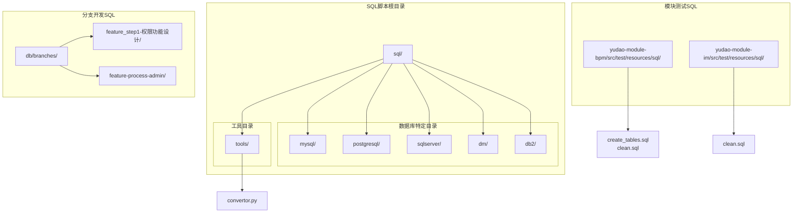
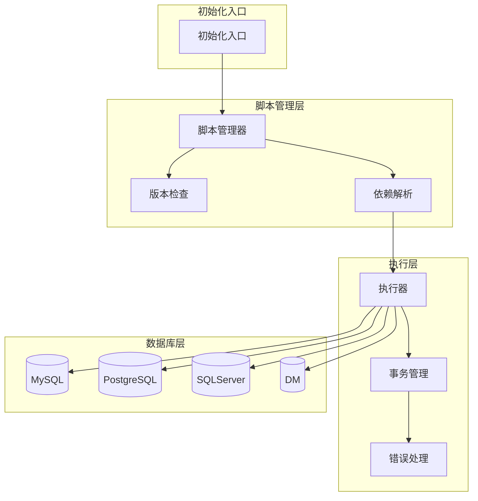
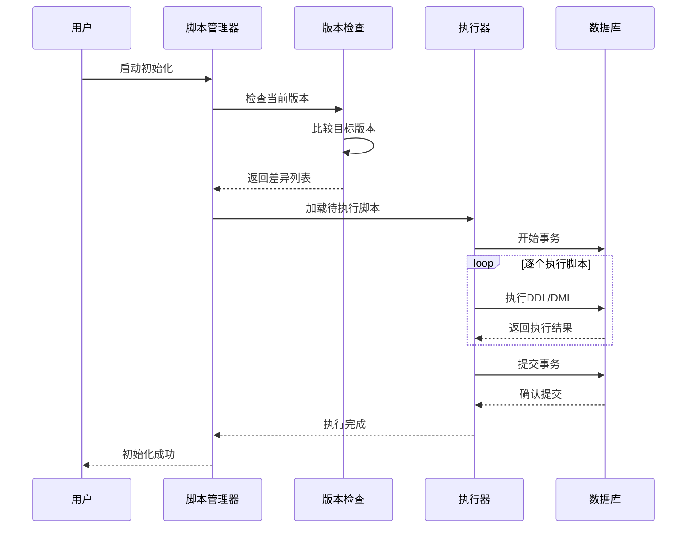
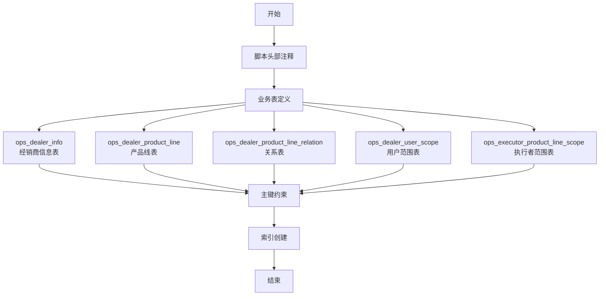
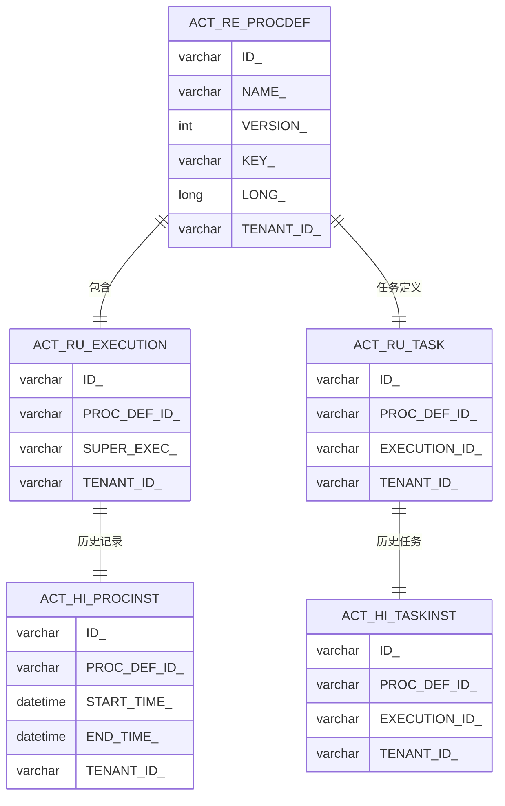
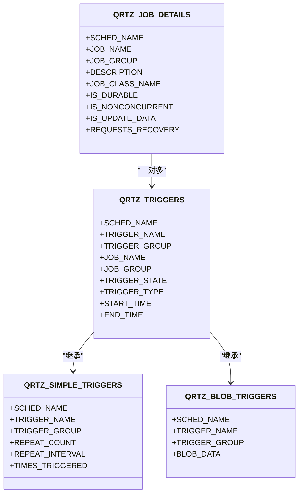
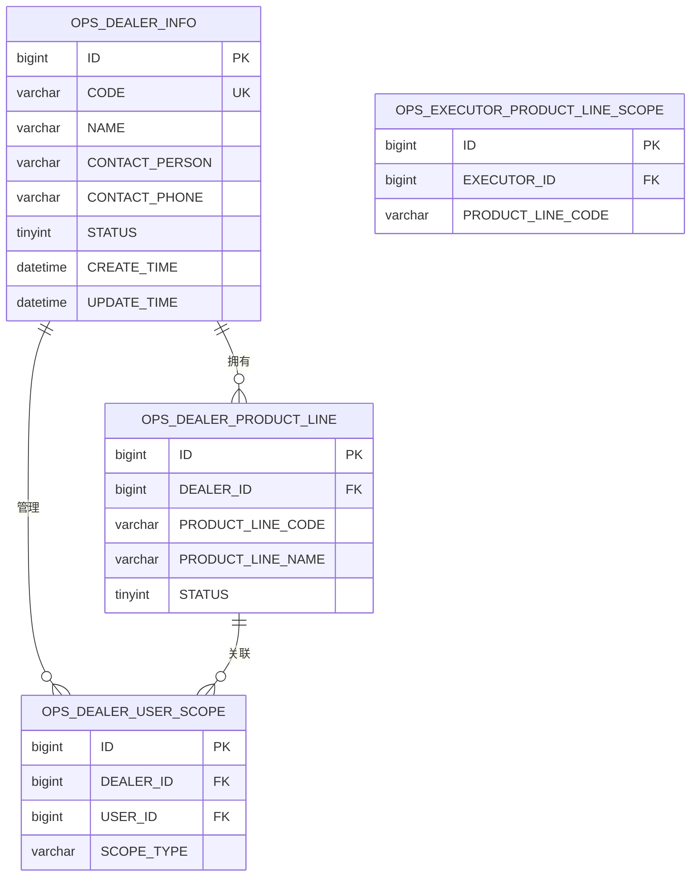
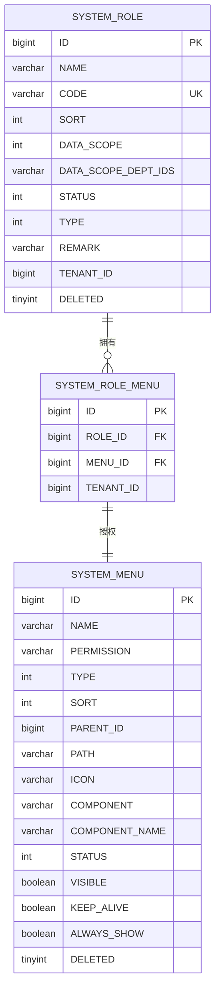
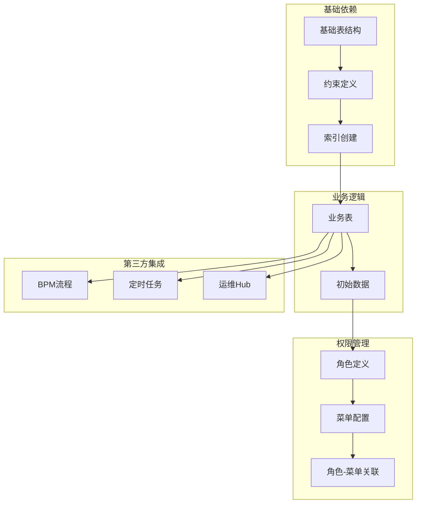
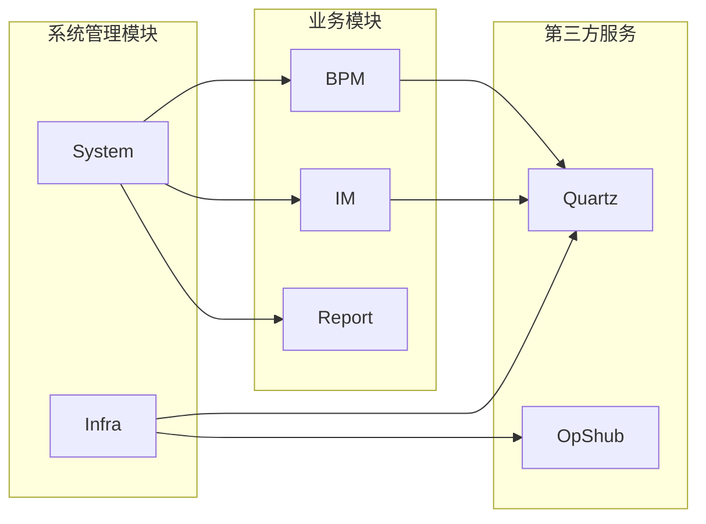

# 数据库初始化脚本

<cite>
**本文引用的文件**
- [feature_process-admin_dml.sql](file://db/branches/feature-process-admin/feature-process-admin_dml.sql)
- [feature_step1-权限功能设计_ddl.sql](file://db/branches/feature_step1-权限功能设计/feature_step1-权限功能设计_ddl.sql)
- [feature_step1-权限功能设计_dml.sql](file://db/branches/feature_step1-权限功能设计/feature_step1-权限功能设计_dml.sql)
- [RoleDO.java](file://yudao-module-system/src/main/java/cn/iocoder/yudao/module/system/dal/dataobject/permission/RoleDO.java)
- [MenuDO.java](file://yudao-module-system/src/main/java/cn/iocoder/yudao/module/system/dal/dataobject/permission/MenuDO.java)
- [RoleMenuDO.java](file://yudao-module-system/src/main/java/cn/iocoder/yudao/module/system/dal/dataobject/permission/RoleMenuDO.java)
- [ruoyi-vue-pro.sql (MySQL)](file://sql/mysql/ruoyi-vue-pro.sql)
- [ruoyi-vue-pro.sql (PostgreSQL)](file://sql/postgresql/ruoyi-vue-pro.sql)
- [ruoyi-vue-pro.sql (SQLServer)](file://sql/sqlserver/ruoyi-vue-pro.sql)
- [bpm.sql (MySQL)](file://sql/mysql/bpm.sql)
- [bpm.sql (PostgreSQL)](file://sql/postgresql/bpm.sql)
- [quartz.sql (MySQL)](file://sql/mysql/quartz.sql)
- [quartz.sql (PostgreSQL)](file://sql/postgresql/quartz.sql)
- [quartz.sql (DM)](file://sql/dm/quartz.sql)
- [opshub-step1.sql (PostgreSQL)](file://sql/postgresql/opshub-step1.sql)
- [convertor.py](file://sql/tools/convertor.py)
- [README.md (SQL工具)](file://sql/tools/README.md)
- [create_tables.sql (BPM测试)](file://yudao-module-bpm/src/test/resources/sql/create_tables.sql)
- [create_tables_pg.sql (BPM测试)](file://yudao-module-bpm/src/test/resources/sql/create_tables_pg.sql)
- [clean.sql (BPM测试)](file://yudao-module-bpm/src/test/resources/sql/clean.sql)
- [clean.sql (IM测试)](file://yudao-module-im/src/test/resources/sql/clean.sql)
</cite>

## 更新摘要
**所做更改**
- 新增PROCESS_ADMIN角色的数据库初始化脚本说明
- 更新权限角色管理章节，包含新的流程管理员角色
- 增加角色-菜单权限配置的详细说明
- 完善角色权限体系的架构分析

## 目录
1. [简介](#简介)
2. [项目结构](#项目结构)
3. [核心组件](#核心组件)
4. [架构概览](#架构概览)
5. [详细组件分析](#详细组件分析)
6. [依赖分析](#依赖分析)
7. [性能考虑](#性能考虑)
8. [故障排除指南](#故障排除指南)
9. [结论](#结论)
10. [附录](#附录)

## 简介

芋道系统是一个基于Spring Boot的企业级应用开发框架，提供了完整的数据库初始化解决方案。本文档详细说明了系统的数据库初始化流程，包括SQL脚本的组织结构、执行顺序、依赖关系等。

系统支持多种数据库类型，包括MySQL、PostgreSQL、SQLServer和达梦数据库(DM)，并为每个模块提供了专门的初始化脚本。通过标准化的脚本组织和版本管理机制，确保了数据库初始化的一致性和可维护性。

**更新** 新增PROCESS_ADMIN角色的数据库初始化脚本，该角色专门用于流程管理和工单转派权限管理。

## 项目结构

### SQL脚本目录结构

**图表来源**
- [ruoyi-vue-pro.sql (MySQL)](file://sql/mysql/ruoyi-vue-pro.sql)
- [ruoyi-vue-pro.sql (PostgreSQL)](file://sql/postgresql/ruoyi-vue-pro.sql)
- [convertor.py](file://sql/tools/convertor.py)
- [feature_step1-权限功能设计_ddl.sql](file://db/branches/feature_step1-权限功能设计/feature_step1-权限功能设计_ddl.sql)
- [feature_process-admin_dml.sql](file://db/branches/feature-process-admin/feature-process-admin_dml.sql)

### 脚本分类体系

系统采用多层次的脚本分类体系：

1. **主数据库脚本**：包含完整的系统初始化脚本
2. **模块化脚本**：按功能模块划分的独立脚本
3. **测试专用脚本**：用于单元测试的数据库设置
4. **分支开发脚本**：功能开发过程中的临时脚本
5. **角色权限脚本**：专门的角色和权限配置脚本

**章节来源**
- [ruoyi-vue-pro.sql (MySQL):1-50](file://sql/mysql/ruoyi-vue-pro.sql#L1-L50)
- [ruoyi-vue-pro.sql (PostgreSQL):1-50](file://sql/postgresql/ruoyi-vue-pro.sql#L1-L50)
- [feature_step1-权限功能设计_ddl.sql:1-150](file://db/branches/feature_step1-权限功能设计/feature_step1-权限功能设计_ddl.sql#L1-L150)
- [feature_process-admin_dml.sql:1-65](file://db/branches/feature-process-admin/feature-process-admin_dml.sql#L1-L65)

## 核心组件

### 主数据库初始化脚本

系统提供了针对不同数据库类型的主初始化脚本，涵盖了所有核心模块的数据库结构。

#### MySQL主脚本特点
- 支持InnoDB存储引擎
- 使用UTF-8字符集
- 包含完整的表结构定义
- 包含必要的索引和约束

#### PostgreSQL主脚本特点  
- 支持PostgreSQL特有数据类型
- 使用标准SQL语法
- 包含序列(sequence)定义
- 支持扩展功能

#### SQLServer主脚本特点
- 使用T-SQL语法
- 支持标识列(identity)
- 包含兼容性设置
- 优化查询性能

**章节来源**
- [ruoyi-vue-pro.sql (MySQL):1-200](file://sql/mysql/ruoyi-vue-pro.sql#L1-L200)
- [ruoyi-vue-pro.sql (PostgreSQL):1-200](file://sql/postgresql/ruoyi-vue-pro.sql#L1-L200)
- [ruoyi-vue-pro.sql (SQLServer):1-200](file://sql/sqlserver/ruoyi-vue-pro.sql#L1-L200)

### 模块化初始化脚本

系统按功能模块提供独立的初始化脚本，便于模块化部署和维护。

#### 工作流模块(BPM)
- 流程定义表
- 任务管理表
- 历史流程表
- 用户组表

#### 定时任务模块(Quartz)
- 作业表
- 触发器表
- 简历表
- 二进制数据表

#### 运维Hub模块(OpShub)
- 经销商信息表
- 产品线表
- 用户范围表
- 执行者范围表

**章节来源**
- [bpm.sql (MySQL):1-100](file://sql/mysql/bpm.sql#L1-L100)
- [bpm.sql (PostgreSQL):1-100](file://sql/postgresql/bpm.sql#L1-L100)
- [quartz.sql (MySQL):1-150](file://sql/mysql/quartz.sql#L1-L150)
- [opshub-step1.sql (PostgreSQL):1-80](file://sql/postgresql/opshub-step1.sql#L1-L80)

## 架构概览

### 数据库初始化架构

**图表来源**
- [convertor.py](file://sql/tools/convertor.py)
- [README.md (SQL工具)](file://sql/tools/README.md)

### 脚本执行流程

**图表来源**
- [feature_step1-权限功能设计_ddl.sql:1-150](file://db/branches/feature_step1-权限功能设计/feature_step1-权限功能设计_ddl.sql#L1-L150)
- [feature_step1-权限功能设计_dml.sql:1-120](file://db/branches/feature_step1-权限功能设计/feature_step1-权限功能设计_dml.sql#L1-L120)
- [feature_process-admin_dml.sql:1-65](file://db/branches/feature-process-admin/feature-process-admin_dml.sql#L1-L65)

## 详细组件分析

### 权限功能设计脚本

该脚本展示了完整的权限功能实现，包含业务表的DDL定义和初始数据的DML插入。

#### DDL脚本结构分析

**图表来源**
- [feature_step1-权限功能设计_ddl.sql:1-150](file://db/branches/feature_step1-权限功能设计/feature_step1-权限功能设计_ddl.sql#L1-L150)

#### DML脚本结构分析

DML脚本负责初始化系统的基础数据，包括角色、菜单和权限配置。

**更新** 新增PROCESS_ADMIN角色的初始化配置，该角色专门用于流程管理和工单转派权限。

**章节来源**
- [feature_step1-权限功能设计_ddl.sql:1-150](file://db/branches/feature_step1-权限功能设计/feature_step1-权限功能设计_ddl.sql#L1-L150)
- [feature_step1-权限功能设计_dml.sql:1-120](file://db/branches/feature_step1-权限功能设计/feature_step1-权限功能设计_dml.sql#L1-L120)
- [feature_process-admin_dml.sql:1-65](file://db/branches/feature-process-admin/feature-process-admin_dml.sql#L1-L65)

### BPM模块初始化脚本

BPM模块的初始化脚本包含了完整的流程管理数据库结构。

#### 表结构设计

**图表来源**
- [bpm.sql (MySQL):1-200](file://sql/mysql/bpm.sql#L1-L200)
- [bpm.sql (PostgreSQL):1-200](file://sql/postgresql/bpm.sql#L1-L200)

**章节来源**
- [bpm.sql (MySQL):1-200](file://sql/mysql/bpm.sql#L1-L200)
- [bpm.sql (PostgreSQL):1-200](file://sql/postgresql/bpm.sql#L1-L200)

### Quartz定时任务脚本

Quartz框架的数据库初始化脚本定义了完整的调度系统表结构。

#### 核心表关系

**图表来源**
- [quartz.sql (MySQL):1-300](file://sql/mysql/quartz.sql#L1-L300)
- [quartz.sql (PostgreSQL):1-300](file://sql/postgresql/quartz.sql#L1-L300)

**章节来源**
- [quartz.sql (MySQL):1-300](file://sql/mysql/quartz.sql#L1-L300)
- [quartz.sql (PostgreSQL):1-300](file://sql/postgresql/quartz.sql#L1-L300)

### OpShub运维Hub脚本

OpShub模块的初始化脚本专注于经销商管理和客服SaaS功能。

#### 数据模型设计

**图表来源**
- [feature_step1-权限功能设计_ddl.sql:11-145](file://db/branches/feature_step1-权限功能设计/feature_step1-权限功能设计_ddl.sql#L11-L145)

**章节来源**
- [feature_step1-权限功能设计_ddl.sql:11-145](file://db/branches/feature_step1-权限功能设计/feature_step1-权限功能设计_ddl.sql#L11-L145)

### 角色权限管理系统

**更新** 新增PROCESS_ADMIN角色的详细分析，该角色是系统权限体系的重要组成部分。

#### 角色数据结构

**图表来源**
- [RoleDO.java:26-78](file://yudao-module-system/src/main/java/cn/iocoder/yudao/module/system/dal/dataobject/permission/RoleDO.java#L26-L78)
- [MenuDO.java:33-107](file://yudao-module-system/src/main/java/cn/iocoder/yudao/module/system/dal/dataobject/permission/MenuDO.java#L33-L107)
- [RoleMenuDO.java:24-33](file://yudao-module-system/src/main/java/cn/iocoder/yudao/module/system/dal/dataobject/permission/RoleMenuDO.java#L24-L33)

#### 角色权限配置

PROCESS_ADMIN角色的权限配置包括：

1. **角色基本信息**
   - 角色ID: 161
   - 角色名称: 流程管理员
   - 角色代码: process_admin
   - 角色类型: 业务角色
   - 角色排序: 50
   - 数据范围: 全部数据

2. **OpsHub模块权限**
   - 聚院通一级目录
   - 客户服务菜单入口
   - 查看工单功能
   - 工单转单功能
   - 工单详情路由

3. **BPM模块权限**
   - 工作流程一级目录
   - 审批中心菜单
   - 流程任务管理员视图
   - 管理员查询权限
   - 任务操作按钮（含转派）

**章节来源**
- [feature_process-admin_dml.sql:14-64](file://db/branches/feature-process-admin/feature-process-admin_dml.sql#L14-L64)
- [RoleDO.java:26-78](file://yudao-module-system/src/main/java/cn/iocoder/yudao/module/system/dal/dataobject/permission/RoleDO.java#L26-L78)
- [MenuDO.java:33-107](file://yudao-module-system/src/main/java/cn/iocoder/yudao/module/system/dal/dataobject/permission/MenuDO.java#L33-L107)
- [RoleMenuDO.java:24-33](file://yudao-module-system/src/main/java/cn/iocoder/yudao/module/system/dal/dataobject/permission/RoleMenuDO.java#L24-L33)

## 依赖分析

### 脚本依赖关系

系统中的SQL脚本存在复杂的依赖关系，需要按照特定顺序执行。

**图表来源**
- [feature_step1-权限功能设计_ddl.sql:1-150](file://db/branches/feature_step1-权限功能设计/feature_step1-权限功能设计_ddl.sql#L1-L150)
- [feature_step1-权限功能设计_dml.sql:1-120](file://db/branches/feature_step1-权限功能设计/feature_step1-权限功能设计_dml.sql#L1-L120)
- [feature_process-admin_dml.sql:1-65](file://db/branches/feature-process-admin/feature-process-admin_dml.sql#L1-L65)

### 模块间依赖关系

**图表来源**
- [ruoyi-vue-pro.sql (MySQL):1-300](file://sql/mysql/ruoyi-vue-pro.sql#L1-L300)
- [bpm.sql (MySQL):1-200](file://sql/mysql/bpm.sql#L1-L200)

**章节来源**
- [ruoyi-vue-pro.sql (MySQL):1-300](file://sql/mysql/ruoyi-vue-pro.sql#L1-L300)
- [bpm.sql (MySQL):1-200](file://sql/mysql/bpm.sql#L1-L200)

## 性能考虑

### 数据库性能优化

1. **索引策略**
   - 为主键和外键自动创建索引
   - 为常用查询字段创建复合索引
   - 避免过度索引影响写入性能

2. **存储引擎选择**
   - InnoDB支持事务和外键约束
   - MyISAM适合只读或大量读取场景
   - 选择合适的行格式(压缩vs非压缩)

3. **字符集和排序规则**
   - 统一使用UTF-8字符集
   - 明确指定排序规则
   - 考虑多语言支持需求

### 批量操作优化

- 使用批量插入替代单条插入
- 合理设置事务大小
- 避免在循环中执行数据库操作

### 角色权限性能优化

**更新** 新增角色权限系统的性能优化建议：

1. **序列管理**
   - 手动指定ID后必须同步序列值
   - 避免主键冲突和重复
   - 确保角色、菜单、角色-菜单关联的序列正确

2. **权限查询优化**
   - 为角色ID和菜单ID创建索引
   - 优化角色权限缓存策略
   - 减少权限检查的数据库查询次数

## 故障排除指南

### 常见问题及解决方案

#### 字符集设置问题
**问题描述**：数据库字符集不匹配导致中文显示异常
**解决方案**：
- 确保数据库创建时指定正确的字符集
- 检查表和字段的字符集设置
- 验证连接字符串中的字符集参数

#### 存储引擎兼容性问题
**问题描述**：某些存储引擎特性在不同数据库中不兼容
**解决方案**：
- 使用标准SQL语法避免引擎特定功能
- 在脚本中明确指定兼容的存储引擎
- 为不同数据库准备专门的脚本

#### 权限配置问题
**问题描述**：执行初始化脚本时权限不足
**解决方案**：
- 确保数据库用户具有CREATE、ALTER、DROP权限
- 检查数据库级别的权限设置
- 验证schema或数据库的所有权

#### 依赖关系冲突
**问题描述**：表依赖关系导致初始化失败
**解决方案**：
- 按照依赖顺序执行脚本
- 使用外键约束前先创建被引用表
- 检查自增字段的正确设置

#### 角色权限冲突
**问题描述**：角色权限配置冲突导致系统异常
**解决方案**：
- 检查角色ID的唯一性
- 验证菜单权限的正确性
- 确保序列值与手动ID一致

**章节来源**
- [convertor.py](file://sql/tools/convertor.py)
- [README.md (SQL工具)](file://sql/tools/README.md)
- [feature_process-admin_dml.sql:63-64](file://db/branches/feature-process-admin/feature-process-admin_dml.sql#L63-L64)

### 错误诊断工具

系统提供了专门的转换器工具来帮助诊断和修复SQL脚本问题。

**章节来源**
- [convertor.py](file://sql/tools/convertor.py)
- [README.md (SQL工具)](file://sql/tools/README.md)

## 结论

芋道系统的数据库初始化方案提供了完整的多数据库支持和模块化设计。通过标准化的脚本组织、严格的依赖管理和完善的错误处理机制，确保了数据库初始化的可靠性和可维护性。

系统的核心优势包括：
- 多数据库类型支持
- 模块化的脚本设计
- 完善的版本管理机制
- 自动化的工具支持
- 详细的错误处理

**更新** 新增PROCESS_ADMIN角色的完整支持，该角色专门用于流程管理和工单转派权限管理，进一步完善了系统的权限管理体系。

建议在实际部署中：
1. 根据目标数据库选择相应的初始化脚本
2. 严格按照依赖顺序执行
3. 预先备份现有数据库
4. 在测试环境验证后再生产部署
5. 特别注意角色权限的正确配置和序列值同步

## 附录

### 脚本命名规范

系统采用统一的脚本命名规范：
- `{模块名}_{功能描述}_{数据库类型}.sql`
- `{模块名}_step{序号}_{功能描述}.sql`
- `{模块名}_test_{描述}.sql`
- `{模块名}_patch_{描述}.sql`

### 版本管理策略

1. **语义化版本控制**：使用主版本.次版本.修订号格式
2. **变更日志**：每次重大修改都记录在案
3. **向后兼容**：尽量保持脚本的向后兼容性
4. **回滚机制**：提供完整的回滚脚本

### 自动化工具使用

#### convertor.py功能说明

该工具主要用于SQL脚本的转换和验证，支持以下功能：
- 脚本格式转换
- 语法检查
- 依赖关系分析
- 错误自动修复

**使用方法**：
1. 准备待转换的SQL文件
2. 运行convertor.py脚本
3. 检查输出结果
4. 应用转换后的脚本

### 角色权限管理最佳实践

**更新** 新增角色权限管理的最佳实践：

1. **角色设计原则**
   - 按业务职责划分角色
   - 遵循最小权限原则
   - 避免角色权限过度集中

2. **权限配置规范**
   - 统一的权限命名规范
   - 完整的权限覆盖检查
   - 定期的权限审计

3. **序列管理规范**
   - 手动指定ID后必须同步序列
   - 确保序列值大于最大ID
   - 避免ID冲突和重复

**章节来源**
- [convertor.py](file://sql/tools/convertor.py)
- [README.md (SQL工具)](file://sql/tools/README.md)
- [feature_process-admin_dml.sql:14-64](file://db/branches/feature-process-admin/feature-process-admin_dml.sql#L14-L64)
- [RoleDO.java:26-78](file://yudao-module-system/src/main/java/cn/iocoder/yudao/module/system/dal/dataobject/permission/RoleDO.java#L26-L78)
- [MenuDO.java:33-107](file://yudao-module-system/src/main/java/cn/iocoder/yudao/module/system/dal/dataobject/permission/MenuDO.java#L33-L107)
- [RoleMenuDO.java:24-33](file://yudao-module-system/src/main/java/cn/iocoder/yudao/module/system/dal/dataobject/permission/RoleMenuDO.java#L24-L33)