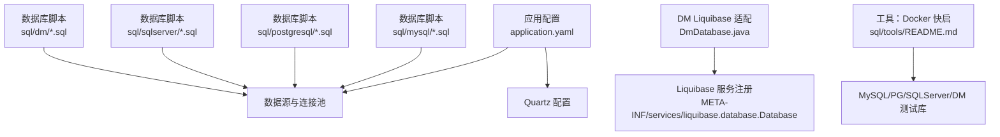
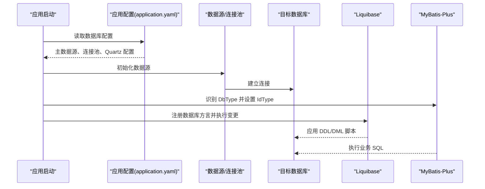
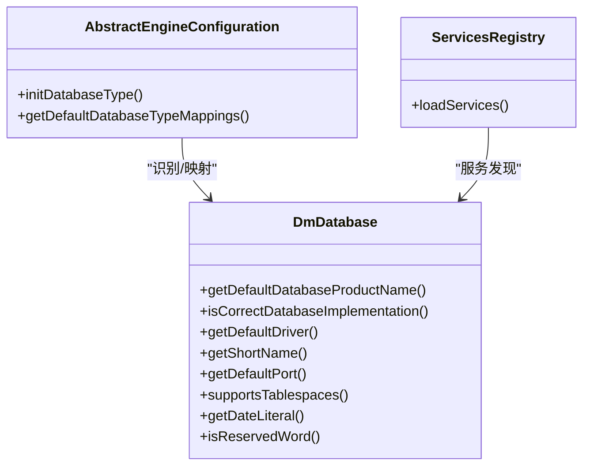
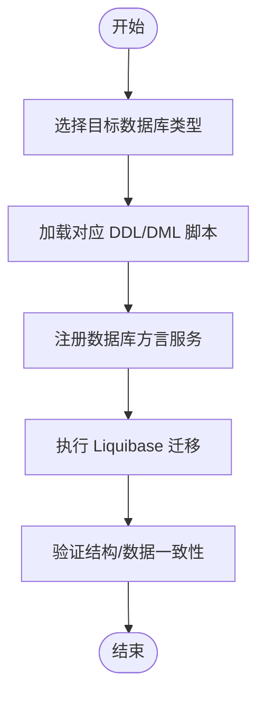
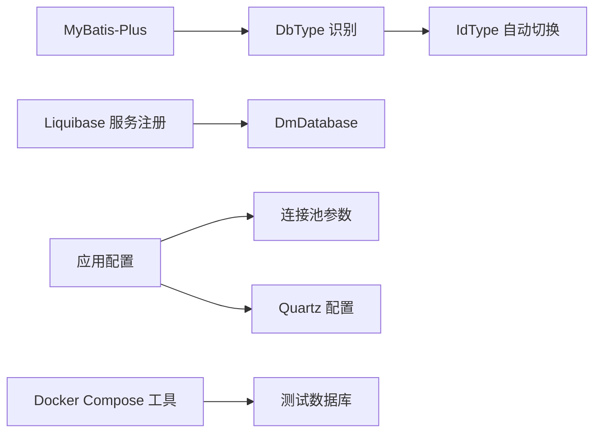

# 数据库架构设计

<cite>
**本文引用的文件**
- [README.md](file://README.md)
- [sql/tools/README.md](file://sql/tools/README.md)
- [yudao-framework/yudao-spring-boot-starter-mybatis/src/main/java/cn/iocoder/yudao/framework/mybatis/config/IdTypeEnvironmentPostProcessor.java](file://yudao-framework/yudao-spring-boot-starter-mybatis/src/main/java/cn/iocoder/yudao/framework/mybatis/config/IdTypeEnvironmentPostProcessor.java)
- [sql/dm/flowable-patch/src/main/java/org/flowable/common/engine/impl/AbstractEngineConfiguration.java](file://sql/dm/flowable-patch/src/main/java/org/flowable/common/engine/impl/AbstractEngineConfiguration.java)
- [sql/dm/flowable-patch/src/main/java/liquibase/database/core/DmDatabase.java](file://sql/dm/flowable-patch/src/main/java/liquibase/database/core/DmDatabase.java)
- [sql/dm/flowable-patch/src/main/resources/META-INF/services/liquibase.database.Database](file://sql/dm/flowable-patch/src/main/resources/META-INF/services/liquibase.database.Database)
- [sql/mysql/ruoyi-vue-pro.sql](file://sql/mysql/ruoyi-vue-pro.sql)
- [sql/postgresql/ruoyi-vue-pro.sql](file://sql/postgresql/ruoyi-vue-pro.sql)
- [sql/sqlserver/ruoyi-vue-pro.sql](file://sql/sqlserver/ruoyi-vue-pro.sql)
- [sql/dm/ruoyi-vue-pro-dm8.sql](file://sql/dm/ruoyi-vue-pro-dm8.sql)
- [yudao-server/src/main/resources/application.yaml](file://yudao-server/src/main/resources/application.yaml)
- [yudao-server/src/main/resources/application-dev.yaml](file://yudao-server/src/main/resources/application-dev.yaml)
- [yudao-server/src/main/resources/application-local.yaml](file://yudao-server/src/main/resources/application-local.yaml)
- [yudao-module-bpm/src/test/resources/application-unit-test.yaml](file://yudao-module-bpm/src/test/resources/application-unit-test.yaml)
- [yudao-module-bpm/src/test/resources/sql/create_tables.sql](file://yudao-module-bpm/src/test/resources/sql/create_tables.sql)
- [yudao-module-bpm/src/test/resources/sql/create_tables_pg.sql](file://yudao-module-bpm/src/test/resources/sql/create_tables_pg.sql)
- [yudao-module-bpm/src/test/resources/sql/clean.sql](file://yudao-module-bpm/src/test/resources/sql/clean.sql)
</cite>

## 目录
1. [引言](#引言)
2. [项目结构](#项目结构)
3. [核心组件](#核心组件)
4. [架构总览](#架构总览)
5. [详细组件分析](#详细组件分析)
6. [依赖关系分析](#依赖关系分析)
7. [性能考虑](#性能考虑)
8. [故障排查指南](#故障排查指南)
9. [结论](#结论)
10. [附录](#附录)

## 引言
本文件面向数据库架构与运维人员，系统化梳理芋道 Ruoyi-Vue-Pro 的数据库整体设计，覆盖多数据库支持策略（MySQL、PostgreSQL、Oracle、达梦等）、连接池与读写分离、分库分表现状与扩展建议、数据库版本管理（Liquibase 迁移）、性能优化与监控运维最佳实践。文档以仓库中实际文件为依据，避免臆测，提供可追溯的来源标注。

## 项目结构
- 数据库脚本按数据库类型分目录存放，便于按需选择与迁移：
  - MySQL、PostgreSQL、SQL Server、DM（达梦）均有独立的 DDL/DML 脚本。
  - DM 目录内包含 Flowable 的 Liquibase 扩展适配类与服务注册文件，用于增强对 DM 的支持。
- 工具层提供 Docker Compose 快速拉起多数据库环境，便于开发与测试。
- 应用配置文件集中定义数据源、连接池、事务与 Quartz 等数据库相关参数。

图示来源
- [application.yaml](file://yudao-server/src/main/resources/application.yaml)
- [README.md](file://README.md)
- [sql/tools/README.md](file://sql/tools/README.md)
- [sql/dm/flowable-patch/src/main/java/liquibase/database/core/DmDatabase.java](file://sql/dm/flowable-patch/src/main/java/liquibase/database/core/DmDatabase.java)
- [sql/dm/flowable-patch/src/main/resources/META-INF/services/liquibase.database.Database](file://sql/dm/flowable-patch/src/main/resources/META-INF/services/liquibase.database.Database)

章节来源
- [sql/tools/README.md](file://sql/tools/README.md)
- [application.yaml](file://yudao-server/src/main/resources/application.yaml)

## 核心组件
- 多数据库支持与适配
  - 通过 MyBatis-Plus 的 DbType 自动识别主数据源数据库类型，并据此调整实体主键策略（如 IdType）与 Quartz JobStore 驱动委托类，确保不同数据库的兼容性。
  - DM（达梦）数据库通过自定义 Liquibase Database 实现与服务注册，提供 DM 专属的日期字面量、序列函数、保留字处理等能力。
- 数据库脚本与版本管理
  - 各数据库独立的 DDL/DML 脚本，配合 Liquibase 服务注册，形成可扩展的数据库方言支持体系。
- 连接池与监控
  - 应用配置中包含连接池参数与监控项，结合前端界面可查看连接池状态与 SQL 性能瓶颈。
- 测试与开发支撑
  - 单元测试配置与测试脚本，覆盖 MySQL 与 PostgreSQL 的建表与清理流程，便于回归验证。

章节来源
- [IdTypeEnvironmentPostProcessor.java](file://yudao-framework/yudao-spring-boot-starter-mybatis/src/main/java/cn/iocoder/yudao/framework/mybatis/config/IdTypeEnvironmentPostProcessor.java)
- [DmDatabase.java](file://sql/dm/flowable-patch/src/main/java/liquibase/database/core/DmDatabase.java)
- [README.md](file://README.md)

## 架构总览
下图展示应用如何通过配置选择数据库、加载脚本、并由 Liquibase/MyBatis-Plus 完成初始化与兼容性处理。

图示来源
- [application.yaml](file://yudao-server/src/main/resources/application.yaml)
- [IdTypeEnvironmentPostProcessor.java](file://yudao-framework/yudao-spring-boot-starter-mybatis/src/main/java/cn/iocoder/yudao/framework/mybatis/config/IdTypeEnvironmentPostProcessor.java)
- [DmDatabase.java](file://sql/dm/flowable-patch/src/main/java/liquibase/database/core/DmDatabase.java)

## 详细组件分析

### 多数据库支持与兼容性处理
- 主数据源 DbType 识别与 Quartz 驱动委托
  - 启动阶段根据主数据源 JDBC 元数据推断数据库类型，设置 Quartz JobStore 对应的驱动委托类，避免跨库差异导致的调度异常。
- 主键策略自动切换
  - 当 IdType 为 NONE 时，针对 Oracle、PostgreSQL、Kingbase、DB2、H2 等数据库采用 INPUT 策略；对 MySQL、DM 等自增数据库采用 AUTO 策略，减少手工配置成本。
- DM（达梦）数据库方言适配
  - 自定义 DmDatabase 类，覆盖默认产品名、驱动名、默认端口、序列函数、日期字面量、保留字支持、Schema/Catalog 行为等，确保 Liquibase 在 DM 上的正确性与一致性。
  - 通过服务注册文件将 DmDatabase 暴露给 Liquibase，使其在扫描时可被识别与实例化。

图示来源
- [AbstractEngineConfiguration.java](file://sql/dm/flowable-patch/src/main/java/org/flowable/common/engine/impl/AbstractEngineConfiguration.java)
- [DmDatabase.java](file://sql/dm/flowable-patch/src/main/java/liquibase/database/core/DmDatabase.java)
- [liquibase.database.Database](file://sql/dm/flowable-patch/src/main/resources/META-INF/services/liquibase.database.Database)

章节来源
- [IdTypeEnvironmentPostProcessor.java](file://yudao-framework/yudao-spring-boot-starter-mybatis/src/main/java/cn/iocoder/yudao/framework/mybatis/config/IdTypeEnvironmentPostProcessor.java)
- [AbstractEngineConfiguration.java](file://sql/dm/flowable-patch/src/main/java/org/flowable/common/engine/impl/AbstractEngineConfiguration.java)
- [DmDatabase.java](file://sql/dm/flowable-patch/src/main/java/liquibase/database/core/DmDatabase.java)
- [liquibase.database.Database](file://sql/dm/flowable-patch/src/main/resources/META-INF/services/liquibase.database.Database)

### 数据库脚本与版本管理
- 脚本组织
  - 按数据库类型分目录存放 DDL/DML，便于按需导入与维护。
- Liquibase 迁移
  - 通过服务注册文件暴露数据库方言，结合脚本完成结构与数据迁移。
- 开发与测试
  - 单元测试配置与测试脚本，覆盖 MySQL 与 PostgreSQL 的建表与清理流程，确保迁移脚本在不同环境下的一致性。

图示来源
- [sql/mysql/ruoyi-vue-pro.sql](file://sql/mysql/ruoyi-vue-pro.sql)
- [sql/postgresql/ruoyi-vue-pro.sql](file://sql/postgresql/ruoyi-vue-pro.sql)
- [sql/sqlserver/ruoyi-vue-pro.sql](file://sql/sqlserver/ruoyi-vue-pro.sql)
- [sql/dm/ruoyi-vue-pro-dm8.sql](file://sql/dm/ruoyi-vue-pro-dm8.sql)
- [liquibase.database.Database](file://sql/dm/flowable-patch/src/main/resources/META-INF/services/liquibase.database.Database)

章节来源
- [yudao-module-bpm/src/test/resources/application-unit-test.yaml](file://yudao-module-bpm/src/test/resources/application-unit-test.yaml)
- [yudao-module-bpm/src/test/resources/sql/create_tables.sql](file://yudao-module-bpm/src/test/resources/sql/create_tables.sql)
- [yudao-module-bpm/src/test/resources/sql/create_tables_pg.sql](file://yudao-module-bpm/src/test/resources/sql/create_tables_pg.sql)
- [yudao-module-bpm/src/test/resources/sql/clean.sql](file://yudao-module-bpm/src/test/resources/sql/clean.sql)

### 连接池配置与读写分离
- 连接池参数
  - 应用配置中包含连接池大小、超时、空闲回收等关键参数，用于控制连接生命周期与并发能力。
- 读写分离
  - 项目未在仓库中显式提供读写分离配置或路由规则，若需启用，建议基于动态数据源方案扩展（例如引入路由键、主从切换策略），并在配置中声明多个数据源与路由规则。

章节来源
- [application.yaml](file://yudao-server/src/main/resources/application.yaml)
- [application-dev.yaml](file://yudao-server/src/main/resources/application-dev.yaml)
- [application-local.yaml](file://yudao-server/src/main/resources/application-local.yaml)

### 分库分表设计
- 现状
  - 仓库未提供分库分表的具体实现与配置，脚本按模块拆分，但未见分片键、路由规则或分表策略。
- 建议
  - 若业务需要水平扩展，可在现有动态数据源基础上增加分片算法与路由规则，结合中间件或自研路由实现。

（本节为概念性建议，不直接分析具体文件）

## 依赖关系分析
- 组件耦合
  - MyBatis-Plus 与数据库类型强相关，IdType 自动切换降低耦合度。
  - DM 方言通过服务注册与 Liquibase 解耦，便于扩展其他数据库方言。
- 外部依赖
  - Quartz 依赖数据库驱动委托类，需与 DbType 保持一致。
  - Docker Compose 提供多数据库测试环境，降低本地搭建成本。

图示来源
- [IdTypeEnvironmentPostProcessor.java](file://yudao-framework/yudao-spring-boot-starter-mybatis/src/main/java/cn/iocoder/yudao/framework/mybatis/config/IdTypeEnvironmentPostProcessor.java)
- [DmDatabase.java](file://sql/dm/flowable-patch/src/main/java/liquibase/database/core/DmDatabase.java)
- [liquibase.database.Database](file://sql/dm/flowable-patch/src/main/resources/META-INF/services/liquibase.database.Database)
- [application.yaml](file://yudao-server/src/main/resources/application.yaml)
- [sql/tools/README.md](file://sql/tools/README.md)

章节来源
- [README.md](file://README.md)

## 性能考虑
- 连接池优化
  - 合理设置最大活跃连接、空闲连接、最大等待时间与连接检测周期，避免资源争用与超时。
- 查询优化
  - 结合前端“MySQL 监控”能力，定位慢查询与热点表，针对性建立索引与拆分查询。
- 缓存策略
  - 与 Redis/本地缓存配合，减少热点数据的数据库访问压力。
- 监控与告警
  - 利用 Actuator、Spring Boot Admin 与链路追踪组件，持续观测数据库连接池与 SQL 执行耗时。

（本节为通用指导，不直接分析具体文件）

## 故障排查指南
- 启动阶段数据库类型识别失败
  - 检查主数据源 JDBC URL 与驱动是否正确，确认 DbType 映射是否覆盖目标数据库。
- Quartz 调度异常
  - 确认 Quartz 的 driverDelegateClass 与 DbType 是否匹配，避免方言不一致导致的调度失败。
- DM 方言问题
  - 确认 DmDatabase 服务已注册，检查日期字面量、序列函数与保留字处理逻辑是否符合预期。
- 迁移失败
  - 核对 Liquibase 脚本与目标数据库版本，必要时补充数据库方言适配或修正脚本语法。

章节来源
- [AbstractEngineConfiguration.java](file://sql/dm/flowable-patch/src/main/java/org/flowable/common/engine/impl/AbstractEngineConfiguration.java)
- [DmDatabase.java](file://sql/dm/flowable-patch/src/main/java/liquibase/database/core/DmDatabase.java)
- [liquibase.database.Database](file://sql/dm/flowable-patch/src/main/resources/META-INF/services/liquibase.database.Database)

## 结论
- 项目通过 DbType 自动识别与 IdType 策略切换，以及 DM 方言的 Liquibase 适配，实现了对主流数据库的良好兼容。
- 脚本按数据库类型分目录管理，配合 Liquibase 服务注册，具备良好的可扩展性。
- 连接池与监控配置为性能优化与运维提供了基础；读写分离与分库分表尚未在仓库中实现，可根据业务演进逐步引入。

## 附录
- 快速启动测试数据库
  - 使用 Docker Compose 启动 MySQL、PostgreSQL、SQL Server、DM 等测试库，便于本地开发与回归测试。
- 数据库监控与运维
  - 前端界面提供“MySQL 监控”，可观察连接池状态与 SQL 性能瓶颈；结合 Actuator、Admin 与链路追踪完善监控体系。

章节来源
- [sql/tools/README.md](file://sql/tools/README.md)
- [README.md](file://README.md)