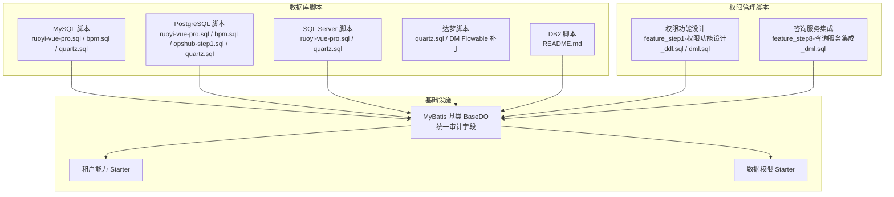
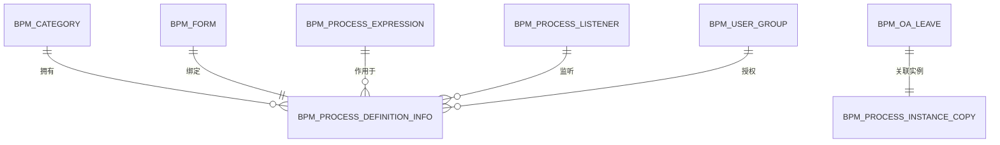
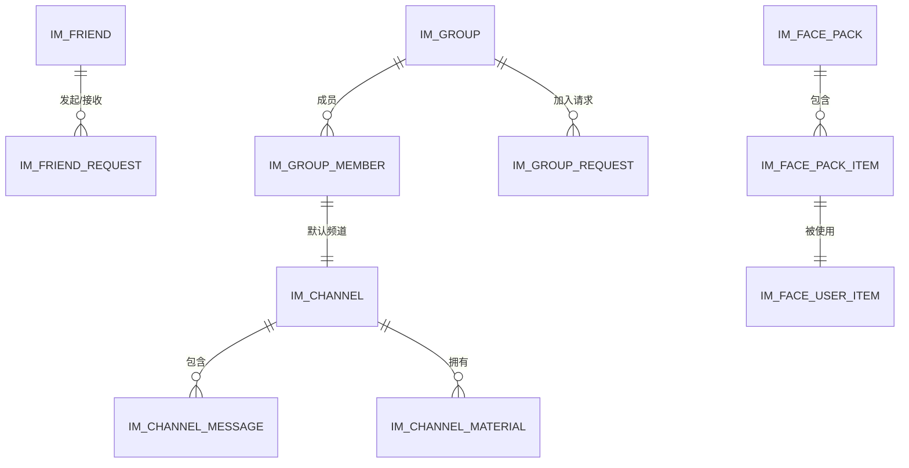
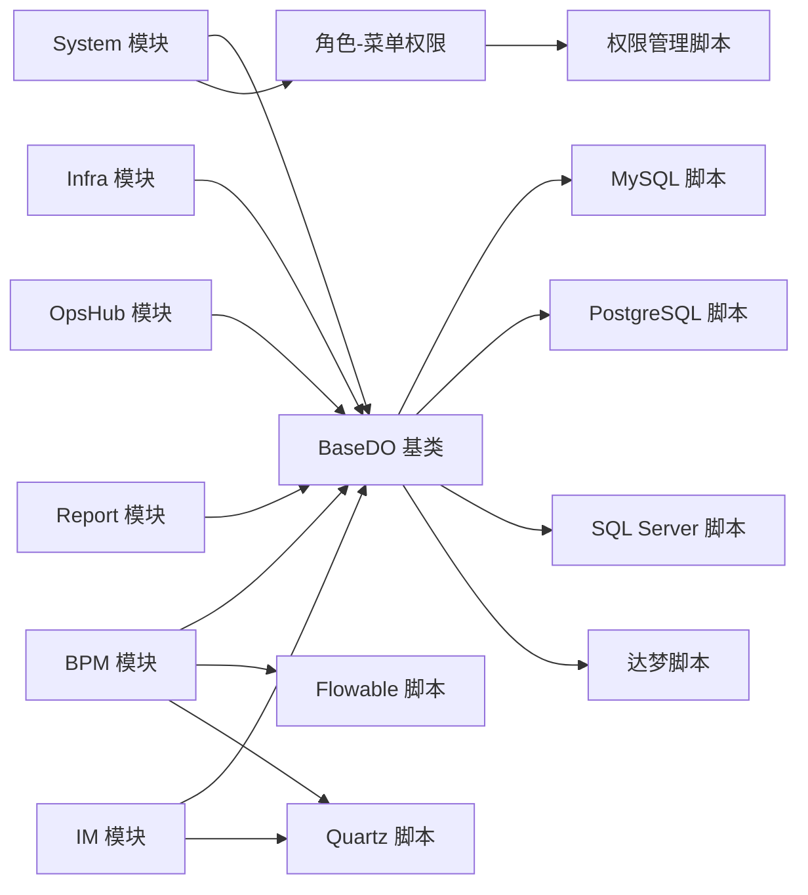

# 数据库设计

<cite>
**本文引用的文件**
- [README.md](file://sql/mysql/README.md)
- [ruoyi-vue-pro.sql](file://sql/mysql/ruoyi-vue-pro.sql)
- [bpm.sql](file://sql/mysql/bpm.sql)
- [quartz.sql](file://sql/mysql/quartz.sql)
- [ruoyi-vue-pro.sql](file://sql/postgresql/ruoyi-vue-pro.sql)
- [bpm.sql](file://sql/postgresql/bpm.sql)
- [opshub-step1.sql](file://sql/postgresql/opshub-step1.sql)
- [quartz.sql](file://sql/postgresql/quartz.sql)
- [ruoyi-vue-pro.sql](file://sql/sqlserver/ruoyi-vue-pro.sql)
- [quartz.sql](file://sql/sqlserver/quartz.sql)
- [quartz.sql](file://sql/dm/quartz.sql)
- [DmDatabase.java](file://sql/dm/flowable-patch/src/main/java/liquibase/database/core/DmDatabase.java)
- [BooleanType.java](file://sql/dm/flowable-patch/src/main/java/liquibase/datatype/core/BooleanType.java)
- [AbstractEngineConfiguration.java](file://sql/dm/flowable-patch/src/main/java/org/flowable/common/engine/impl/AbstractEngineConfiguration.java)
- [clean.sql](file://yudao-module-bpm/src/test/resources/sql/clean.sql)
- [create_tables.sql](file://yudao-module-bpm/src/test/resources/sql/create_tables.sql)
- [create_tables_pg.sql](file://yudao-module-bpm/src/test/resources/sql/create_tables_pg.sql)
- [clean.sql](file://yudao-module-im/src/test/resources/sql/clean.sql)
- [BaseDO.java](file://yudao-framework/yudao-spring-boot-starter-mybatis/src/main/java/cn/iocoder/yudao/framework/mybatis/core/dataobject/BaseDO.java)
- [DeptDO.java](file://yudao-module-system/src/main/java/cn/iocoder/yudao/module/system/dal/dataobject/dept/DeptDO.java)
- [MenuDO.java](file://yudao-module-system/src/main/java/cn/iocoder/yudao/module/system/dal/dataobject/permission/MenuDO.java)
- [RoleDO.java](file://yudao-module-system/src/main/java/cn/iocoder/yudao/module/system/dal/dataobject/permission/RoleDO.java)
- [RoleMenuDO.java](file://yudao-module-system/src/main/java/cn/iocoder/yudao/module/system/dal/dataobject/permission/RoleMenuDO.java)
- [BpmCategoryDO](file://yudao-module-bpm/src/main/java/cn/iocoder/yudao/module/bpm/dal/dataobject/definition/BpmCategoryDO.java)
- [BpmFormDO](file://yudao-module-bpm/src/main/java/cn/iocoder/yudao/module/bpm/dal/dataobject/definition/BpmFormDO.java)
- [BpmProcessDefinitionInfoDO](file://yudao-module-bpm/src/main/java/cn/iocoder/yudao/module/bpm/dal/dataobject/definition/BpmProcessDefinitionInfoDO.java)
- [BpmProcessExpressionDO](file://yudao-module-bpm/src/main/java/cn/iocoder/yudao/module/bpm/dal/dataobject/definition/BpmProcessExpressionDO.java)
- [BpmProcessListenerDO](file://yudao-module-bpm/src/main/java/cn/iocoder/yudao/module/bpm/dal/dataobject/definition/BpmProcessListenerDO.java)
- [BpmUserGroupDO](file://yudao-module-bpm/src/main/java/cn/iocoder/yudao/module/bpm/dal/dataobject/definition/BpmUserGroupDO.java)
- [BpmOALeaveDO](file://yudao-module-bpm/src/main/java/cn/iocoder/yudao/module/bpm/dal/dataobject/oa/BpmOALeaveDO.java)
- [BpmProcessInstanceCopyDO](file://yudao-module-bpm/src/main/java/cn/iocoder/yudao/module/bpm/dal/dataobject/task/BpmProcessInstanceCopyDO.java)
- [ImChannelDO](file://yudao-module-im/src/main/java/cn/iocoder/yudao/module/im/dal/dataobject/channel/ImChannelDO.java)
- [ImChannelMaterialDO](file://yudao-module-im/src/main/java/cn/iocoder/yudao/module/im/dal/dataobject/channel/ImChannelMaterialDO.java)
- [ImFacePackDO](file://yudao-module-im/src/main/java/cn/iocoder/yudao/module/im/dal/dataobject/face/ImFacePackDO.java)
- [ImFacePackItemDO](file://yudao-module-im/src/main/java/cn/iocoder/yudao/module/im/dal/dataobject/face/ImFacePackItemDO.java)
- [ImFaceUserItemDO](file://yudao-module-im/src/main/java/cn/iocoder/yudao/module/im/dal/dataobject/face/ImFaceUserItemDO.java)
- [ImFriendDO](file://yudao-module-im/src/main/java/cn/iocoder/yudao/module/im/dal/dataobject/friend/ImFriendDO.java)
- [ImFriendRequestDO](file://yudao-module-im/src/main/java/cn/iocoder/yudao/module/im/dal/dataobject/friend/ImFriendRequestDO.java)
- [ImGroupDO](file://yudao-module-im/src/main/java/cn/iocoder/yudao/module/im/dal/dataobject/group/ImGroupDO.java)
- [ImGroupMemberDO](file://yudao-module-im/src/main/java/cn/iocoder/yudao/module/im/dal/dataobject/group/ImGroupMemberDO.java)
- [ImGroupRequestDO](file://yudao-module-im/src/main/java/cn/iocoder/yudao/module/im/dal/dataobject/group/ImGroupRequestDO.java)
- [ImChannelMessageDO](file://yudao-module-im/src/main/java/cn/iocoder/yudao/module/im/dal/dataobject/message/ImChannelMessageDO.java)
- [feature_step7-电商客服系统_ddl.sql](file://db/branches/feature_step7-电商客服系统/feature_step7-电商客服系统_ddl.sql)
- [feature_step7-电商客服系统_dml.sql](file://db/branches/feature_step7-电商客服系统/feature_step7-电商客服系统_dml.sql)
- [feature_step8-咨询服务集成_dml.sql](file://db/branches/feature_step8-咨询服务集成/feature_step8-咨询服务集成_dml.sql)
- [feature_step1-权限功能设计_ddl.sql](file://db/branches/feature_step1-权限功能设计/feature_step1-权限功能设计_ddl.sql)
- [feature_step1-权限功能设计_dml.sql](file://db/branches/feature_step1-权限功能设计/feature_step1-权限功能设计_dml.sql)
- [CsSessionDO](file://yudao-module-opshub/src/main/java/cn/iocoder/yudao/module/opshub/dal/dataobject/cs/CsSessionDO.java)
- [CsMessageDO](file://yudao-module-opshub/src/main/java/cn/iocoder/yudao/module/opshub/dal/dataobject/cs/CsMessageDO.java)
- [CsSessionStatusEnum](file://yudao-module-opshub/src/main/java/cn/iocoder/yudao/module/opshub/enums/CsSessionStatusEnum.java)
- [CsMessageTypeEnum](file://yudao-module-opshub/src/main/java/cn/iocoder/yudao/module/opshub/enums/CsMessageTypeEnum.java)
</cite>

## 更新摘要
**所做更改**
- 新增咨询服务集成权限结构的详细说明，包括新增的按钮权限和角色菜单关联
- 更新权限功能设计章节，补充完整的角色-菜单权限体系
- 增强系统模块权限设计的完整性描述
- 完善多租户权限控制的实施细节

## 目录
1. [简介](#简介)
2. [项目结构](#项目结构)
3. [核心组件](#核心组件)
4. [架构总览](#架构总览)
5. [详细组件分析](#详细组件分析)
6. [依赖分析](#依赖分析)
7. [性能考虑](#性能考虑)
8. [故障排查指南](#故障排查指南)
9. [结论](#结论)
10. [附录](#附录)

## 简介
本文件面向芋道Ruoyi-Vue-Pro项目的数据库设计与实现，系统支持多数据库（MySQL、PostgreSQL、SQL Server、达梦），并通过统一的MyBatis基础设施抽象实现跨数据库兼容。本文从数据库架构、核心业务表、工作流引擎、即时通讯模块、多租户数据隔离、初始化脚本、数据字典与枚举、性能优化与索引实践等维度进行系统化梳理，并结合实际代码实体与SQL脚本给出可操作的落地建议。

**更新** 新增咨询服务集成权限结构，完善了系统的权限管理体系，包括新增的按钮权限和角色菜单关联机制。

## 项目结构
- 多数据库脚本位于 sql 目录下，按数据库类型分层：mysql、postgresql、sqlserver、dm（达梦）、db2（占位说明）。
- 各模块的测试脚本用于本地开发验证，位于 yudao-module-*/src/test/resources/sql 下。
- 基础设施通过 yudao-framework 提供通用DO基类与MyBatis支持，确保各模块表结构一致性和扩展性。
- 权限管理脚本位于 db/branches 目录，包含完整的权限功能设计和咨询服务集成两个主要分支。



**图表来源**
- [ruoyi-vue-pro.sql](file://sql/mysql/ruoyi-vue-pro.sql)
- [bpm.sql](file://sql/mysql/bpm.sql)
- [quartz.sql](file://sql/mysql/quartz.sql)
- [ruoyi-vue-pro.sql](file://sql/postgresql/ruoyi-vue-pro.sql)
- [bpm.sql](file://sql/postgresql/bpm.sql)
- [opshub-step1.sql](file://sql/postgresql/opshub-step1.sql)
- [quartz.sql](file://sql/postgresql/quartz.sql)
- [ruoyi-vue-pro.sql](file://sql/sqlserver/ruoyi-vue-pro.sql)
- [quartz.sql](file://sql/sqlserver/quartz.sql)
- [quartz.sql](file://sql/dm/quartz.sql)
- [feature_step1-权限功能设计_ddl.sql](file://db/branches/feature_step1-权限功能设计/feature_step1-权限功能设计_ddl.sql)
- [feature_step1-权限功能设计_dml.sql](file://db/branches/feature_step1-权限功能设计/feature_step1-权限功能设计_dml.sql)
- [feature_step8-咨询服务集成_dml.sql](file://db/branches/feature_step8-咨询服务集成/feature_step8-咨询服务集成_dml.sql)
- [BaseDO.java](file://yudao-framework/yudao-spring-boot-starter-mybatis/src/main/java/cn/iocoder/yudao/framework/mybatis/core/dataobject/BaseDO.java)

**章节来源**
- [README.md](file://sql/mysql/README.md)
- [ruoyi-vue-pro.sql](file://sql/mysql/ruoyi-vue-pro.sql)
- [BaseDO.java](file://yudao-framework/yudao-spring-boot-starter-mybatis/src/main/java/cn/iocoder/yudao/framework/mybatis/core/dataobject/BaseDO.java)
- [feature_step1-权限功能设计_ddl.sql](file://db/branches/feature_step1-权限功能设计/feature_step1-权限功能设计_ddl.sql)
- [feature_step1-权限功能设计_dml.sql](file://db/branches/feature_step1-权限功能设计/feature_step1-权限功能设计_dml.sql)
- [feature_step8-咨询服务集成_dml.sql](file://db/branches/feature_step8-咨询服务集成/feature_step8-咨询服务集成_dml.sql)

## 核心组件
- 多数据库支持策略
  - MySQL：提供完整的 ruoyi-vue-pro.sql、bpm.sql、quartz.sql，覆盖系统主业务、流程与定时任务。
  - PostgreSQL：提供 ruoyi-vue-pro.sql、bpm.sql、opshub-step1.sql、quartz.sql，适配PostgreSQL语法差异。
  - SQL Server：提供 ruoyi-vue-pro.sql、quartz.sql，满足企业级SQL Server部署场景。
  - 达梦（DM）：提供 quartz.sql 与 Flowable 的 Liquibase 扩展（DmDatabase、BooleanType、AbstractEngineConfiguration），以适配达梦数据库方言与布尔类型处理。
  - DB2：目录存在但脚本未提供，需按需补充。
- 统一基类与审计字段
  - BaseDO 提供统一的创建时间、更新时间、逻辑删除等字段，确保所有业务表具备一致的审计能力。
- 权限管理架构
  - **更新** 完整的角色-菜单权限体系，包含系统角色、菜单和角色菜单关联表，支持精细化的权限控制。
  - 新增咨询服务集成权限，补充基础数据模块的「咨询」按钮权限和客服会话的「发起咨询」权限。
- 测试脚本
  - BPM 与 IM 模块均提供 create_tables*.sql 与 clean.sql，便于本地快速搭建与清理环境。

**章节来源**
- [ruoyi-vue-pro.sql](file://sql/mysql/ruoyi-vue-pro.sql)
- [bpm.sql](file://sql/mysql/bpm.sql)
- [quartz.sql](file://sql/mysql/quartz.sql)
- [ruoyi-vue-pro.sql](file://sql/postgresql/ruoyi-vue-pro.sql)
- [bpm.sql](file://sql/postgresql/bpm.sql)
- [opshub-step1.sql](file://sql/postgresql/opshub-step1.sql)
- [quartz.sql](file://sql/postgresql/quartz.sql)
- [ruoyi-vue-pro.sql](file://sql/sqlserver/ruoyi-vue-pro.sql)
- [quartz.sql](file://sql/sqlserver/quartz.sql)
- [quartz.sql](file://sql/dm/quartz.sql)
- [DmDatabase.java](file://sql/dm/flowable-patch/src/main/java/liquibase/database/core/DmDatabase.java)
- [BooleanType.java](file://sql/dm/flowable-patch/src/main/java/liquibase/datatype/core/BooleanType.java)
- [AbstractEngineConfiguration.java](file://sql/dm/flowable-patch/src/main/java/org/flowable/common/engine/impl/AbstractEngineConfiguration.java)
- [BaseDO.java](file://yudao-framework/yudao-spring-boot-starter-mybatis/src/main/java/cn/iocoder/yudao/framework/mybatis/core/dataobject/BaseDO.java)
- [MenuDO.java](file://yudao-module-system/src/main/java/cn/iocoder/yudao/module/system/dal/dataobject/permission/MenuDO.java)
- [RoleDO.java](file://yudao-module-system/src/main/java/cn/iocoder/yudao/module/system/dal/dataobject/permission/RoleDO.java)
- [RoleMenuDO](file://yudao-module-system/src/main/java/cn/iocoder/yudao/module/system/dal/dataobject/permission/RoleMenuDO.java)
- [feature_step1-权限功能设计_dml.sql](file://db/branches/feature_step1-权限功能设计/feature_step1-权限功能设计_dml.sql)
- [feature_step8-咨询服务集成_dml.sql](file://db/branches/feature_step8-咨询服务集成/feature_step8-咨询服务集成_dml.sql)
- [create_tables.sql](file://yudao-module-bpm/src/test/resources/sql/create_tables.sql)
- [create_tables_pg.sql](file://yudao-module-bpm/src/test/resources/sql/create_tables_pg.sql)
- [clean.sql](file://yudao-module-bpm/src/test/resources/sql/clean.sql)
- [clean.sql](file://yudao-module-im/src/test/resources/sql/clean.sql)

## 架构总览
系统采用"多数据库脚本 + 统一基础设施 + 模块化DAO + 权限管理"的架构。模块通过MyBatis DO映射到对应数据库表，Flowable与Quartz分别负责流程与定时任务的持久化，权限管理通过角色-菜单关联实现精细化的访问控制，测试脚本保障本地开发一致性。

```mermaid
graph TB
subgraph "应用层"
SYS["System 模块<br/>用户/角色/菜单/部门<br/>权限管理"]
BPM["BPM 模块<br/>流程定义/监听/表达式/实例/OA"]
IM["IM 模块<br/>频道/群组/好友/消息/表情包"]
INF["Infra 模块<br/>配置/文件/字典/任务"]
OPS["OpsHub 模块<br/>经销商/客服<br/>咨询服务集成"]
REP["Report 模块<br/>报表"]
end
subgraph "权限管理层"
ROLE["system_role<br/>系统角色表"]
MENU["system_menu<br/>菜单表"]
ROLE_MENU["system_role_menu<br/>角色菜单关联表"]
END
subgraph "持久化层"
DAO_SYS["System DAO/DO"]
DAO_BPM["BPM DAO/DO"]
DAO_IM["IM DAO/DO"]
DAO_INF["Infra DAO/DO"]
DAO_OPS["OpsHub DAO/DO"]
DAO_REP["Report DAO/DO"]
end
subgraph "数据库"
MYSQL["MySQL"]
PG["PostgreSQL"]
MSSQL["SQL Server"]
DM["达梦"]
END
SYS --> ROLE
SYS --> MENU
SYS --> ROLE_MENU
SYS --> DAO_SYS
BPM --> DAO_BPM
IM --> DAO_IM
INF --> DAO_INF
OPS --> DAO_OPS
REP --> DAO_REP
DAO_SYS --> MYSQL
DAO_SYS --> PG
DAO_SYS --> MSSQL
DAO_SYS --> DM
DAO_BPM --> MYSQL
DAO_BPM --> PG
DAO_IM --> MYSQL
DAO_IM --> PG
DAO_IM --> MSSQL
DAO_IM --> DM
DAO_INF --> MYSQL
DAO_INF --> PG
DAO_INF --> MSSQL
DAO_INF --> DM
DAO_OPS --> MYSQL
DAO_OPS --> PG
DAO_REP --> MYSQL
DAO_REP --> PG
```

**图表来源**
- [ruoyi-vue-pro.sql](file://sql/mysql/ruoyi-vue-pro.sql)
- [bpm.sql](file://sql/mysql/bpm.sql)
- [quartz.sql](file://sql/mysql/quartz.sql)
- [ruoyi-vue-pro.sql](file://sql/postgresql/ruoyi-vue-pro.sql)
- [bpm.sql](file://sql/postgresql/bpm.sql)
- [opshub-step1.sql](file://sql/postgresql/opshub-step1.sql)
- [quartz.sql](file://sql/postgresql/quartz.sql)
- [ruoyi-vue-pro.sql](file://sql/sqlserver/ruoyi-vue-pro.sql)
- [quartz.sql](file://sql/sqlserver/quartz.sql)
- [quartz.sql](file://sql/dm/quartz.sql)
- [MenuDO.java](file://yudao-module-system/src/main/java/cn/iocoder/yudao/module/system/dal/dataobject/permission/MenuDO.java)
- [RoleDO.java](file://yudao-module-system/src/main/java/cn/iocoder/yudao/module/system/dal/dataobject/permission/RoleDO.java)
- [RoleMenuDO](file://yudao-module-system/src/main/java/cn/iocoder/yudao/module/system/dal/dataobject/permission/RoleMenuDO.java)

## 详细组件分析

### 多数据库兼容与方言适配
- 达梦（DM）适配
  - 通过自定义 DmDatabase、BooleanType 与 Flowable 抽象配置，解决达梦数据库的方言识别与布尔类型映射问题，保证Flowable在DM上正常运行。
- PostgreSQL适配
  - 使用标准SQL语法，针对序列/自增、布尔类型、JSON等进行适配；测试脚本提供PostgreSQL专用建表脚本。
- MySQL/SQL Server
  - 使用标准DDL语法，配合Quartz与Flowable的通用脚本，完成流程与定时任务的初始化。

**章节来源**
- [DmDatabase.java](file://sql/dm/flowable-patch/src/main/java/liquibase/database/core/DmDatabase.java)
- [BooleanType.java](file://sql/dm/flowable-patch/src/main/java/liquibase/datatype/core/BooleanType.java)
- [AbstractEngineConfiguration.java](file://sql/dm/flowable-patch/src/main/java/org/flowable/common/engine/impl/AbstractEngineConfiguration.java)
- [create_tables_pg.sql](file://yudao-module-bpm/src/test/resources/sql/create_tables_pg.sql)

### 核心业务表设计（系统模块）
- 用户、角色、菜单、部门等基础数据表
  - 字段设计遵循统一审计规范（创建时间、更新时间、逻辑删除等），确保数据一致性与可追溯性。
  - 关系映射：用户-角色多对多、用户-部门一对多、菜单-角色多对多、部门树形结构等。
- **更新** 权限管理表结构
  - system_role：系统角色表，包含角色名称、编码、排序、状态、类型等字段
  - system_menu：菜单表，支持目录、菜单、按钮三种类型，包含权限标识、路由信息等
  - system_role_menu：角色菜单关联表，实现角色与菜单的多对多关系
- 实体映射参考
  - 用户/角色/菜单/部门DO类位于 system 模块dal/dataobject目录，继承统一基类，具备标准审计字段。

**章节来源**
- [BaseDO.java](file://yudao-framework/yudao-spring-boot-starter-mybatis/src/main/java/cn/iocoder/yudao/framework/mybatis/core/dataobject/BaseDO.java)
- [DeptDO.java](file://yudao-module-system/src/main/java/cn/iocoder/yudao/module/system/dal/dataobject/dept/DeptDO.java)
- [MenuDO.java](file://yudao-module-system/src/main/java/cn/iocoder/yudao/module/system/dal/dataobject/permission/MenuDO.java)
- [RoleDO.java](file://yudao-module-system/src/main/java/cn/iocoder/yudao/module/system/dal/dataobject/permission/RoleDO.java)
- [RoleMenuDO](file://yudao-module-system/src/main/java/cn/iocoder/yudao/module/system/dal/dataobject/permission/RoleMenuDO.java)

### 权限功能设计（新增）
**更新** 完整的权限功能设计，建立了标准化的角色-菜单权限体系

- 角色管理
  - 四种预定义角色：brand_admin（品牌管理员）、brand_sales（品牌销售员）、service_executor（服务单执行员）、dealer（经销商）
  - 每个角色具有不同的数据范围和权限级别，支持精细化的权限控制
- 菜单结构
  - 一级目录：经销商管理 SaaS（ID: 6000）
  - 二级菜单：经销商管理、产品线管理、签约进度、政策看板、售后模块、订单模块、基础数据、客户服务、授权管理
  - 按钮权限：每个业务模块包含多个具体的操作按钮权限
- 角色-菜单关联
  - 通过 system_role_menu 表实现角色与菜单的多对多关联
  - 支持不同角色拥有不同级别的菜单访问权限
- 权限标识规范
  - 采用 `${业务域}:${模块}:${操作}` 的命名规范
  - 如 dealer:basedata:consult、service:consult:query 等

```mermaid
erDiagram
SYSTEM_ROLE ||--o{ SYSTEM_ROLE_MENU : "拥有"
SYSTEM_MENU ||--o{ SYSTEM_ROLE_MENU : "关联"
SYSTEM_ROLE {
id PK
name
code
sort
data_scope
status
type
remark
}
SYSTEM_MENU {
id PK
name
permission
type
sort
parent_id
path
icon
component
component_name
status
visible
keep_alive
always_show
deleted
}
SYSTEM_ROLE_MENU {
id PK
role_id FK
menu_id FK
tenant_id
}
```

**图表来源**
- [MenuDO.java](file://yudao-module-system/src/main/java/cn/iocoder/yudao/module/system/dal/dataobject/permission/MenuDO.java)
- [RoleDO.java](file://yudao-module-system/src/main/java/cn/iocoder/yudao/module/system/dal/dataobject/permission/RoleDO.java)
- [RoleMenuDO](file://yudao-module-system/src/main/java/cn/iocoder/yudao/module/system/dal/dataobject/permission/RoleMenuDO.java)

**章节来源**
- [feature_step1-权限功能设计_ddl.sql](file://db/branches/feature_step1-权限功能设计/feature_step1-权限功能设计_ddl.sql)
- [feature_step1-权限功能设计_dml.sql](file://db/branches/feature_step1-权限功能设计/feature_step1-权限功能设计_dml.sql)
- [MenuDO.java](file://yudao-module-system/src/main/java/cn/iocoder/yudao/module/system/dal/dataobject/permission/MenuDO.java)
- [RoleDO.java](file://yudao-module-system/src/main/java/cn/iocoder/yudao/module/system/dal/dataobject/permission/RoleDO.java)
- [RoleMenuDO](file://yudao-module-system/src/main/java/cn/iocoder/yudao/module/system/dal/dataobject/permission/RoleMenuDO.java)

### 咨询服务集成权限结构（新增）
**更新** 新增咨询服务集成权限结构，完善了系统的咨询功能权限体系

- 新增按钮权限
  - 基础数据咨询（ID: 6074）：dealer:basedata:consult
  - 发起咨询（ID: 6099）：dealer:cs-consult:create
- 角色菜单关联
  - 6074 → brand_admin (157) / service_executor (159) / dealer (160)
  - 6099 → brand_admin (157) / service_executor (159) / dealer (160)
- 序列同步
  - 自动同步 system_menu_seq 和 system_role_menu_seq 序列值，防止主键冲突

```mermaid
graph TB
subgraph "咨询服务集成权限"
BRAND_ADMIN["品牌管理员<br/>157<br/>拥有全部权限"]
SERVICE_EXECUTOR["服务单执行员<br/>159<br/>部分业务权限"]
DEALER["经销商<br/>160<br/>基础业务权限"]
END
subgraph "新增权限"
BASEDATA_CONSULT["基础数据咨询<br/>6074<br/>dealer:basedata:consult"]
CS_CONSULT_CREATE["发起咨询<br/>6099<br/>dealer:cs-consult:create"]
END
BRAND_ADMIN --> BASEDATA_CONSULT
BRAND_ADMIN --> CS_CONSULT_CREATE
SERVICE_EXECUTOR --> BASEDATA_CONSULT
SERVICE_EXECUTOR --> CS_CONSULT_CREATE
DEALER --> BASEDATA_CONSULT
DEALER --> CS_CONSULT_CREATE
```

**图表来源**
- [feature_step8-咨询服务集成_dml.sql](file://db/branches/feature_step8-咨询服务集成/feature_step8-咨询服务集成_dml.sql)

**章节来源**
- [feature_step8-咨询服务集成_dml.sql](file://db/branches/feature_step8-咨询服务集成/feature_step8-咨询服务集成_dml.sql)

### 工作流引擎数据库表结构
- 流程定义与监听
  - 包含流程分类、表单、流程表达式、流程监听器、用户组等表，支撑流程的可视化设计与运行期控制。
- 任务执行与实例
  - 包含流程实例、任务实例、流程变量、任务代理与抄送等，覆盖流程生命周期关键节点。
- OA审批
  - 提供请假等OA业务示例，展示如何将业务DO与流程实例关联。
- 初始化脚本
  - MySQL与PostgreSQL分别提供bpm.sql，包含流程引擎核心表与索引；测试脚本提供create_tables*.sql与clean.sql，便于本地验证。



**图表来源**
- [bpm.sql](file://sql/mysql/bpm.sql)
- [bpm.sql](file://sql/postgresql/bpm.sql)
- [BpmCategoryDO](file://yudao-module-bpm/src/main/java/cn/iocoder/yudao/module/bpm/dal/dataobject/definition/BpmCategoryDO.java)
- [BpmFormDO](file://yudao-module-bpm/src/main/java/cn/iocoder/yudao/module/bpm/dal/dataobject/definition/BpmFormDO.java)
- [BpmProcessDefinitionInfoDO](file://yudao-module-bpm/src/main/java/cn/iocoder/yudao/module/bpm/dal/dataobject/definition/BpmProcessDefinitionInfoDO.java)
- [BpmProcessExpressionDO](file://yudao-module-bpm/src/main/java/cn/iocoder/yudao/module/bpm/dal/dataobject/definition/BpmProcessExpressionDO.java)
- [BpmProcessListenerDO](file://yudao-module-bpm/src/main/java/cn/iocoder/yudao/module/bpm/dal/dataobject/definition/BpmProcessListenerDO.java)
- [BpmUserGroupDO](file://yudao-module-bpm/src/main/java/cn/iocoder/yudao/module/bpm/dal/dataobject/definition/BpmUserGroupDO.java)
- [BpmOALeaveDO](file://yudao-module-bpm/src/main/java/cn/iocoder/yudao/module/bpm/dal/dataobject/oa/BpmOALeaveDO.java)
- [BpmProcessInstanceCopyDO](file://yudao-module-bpm/src/main/java/cn/iocoder/yudao/module/bpm/dal/dataobject/task/BpmProcessInstanceCopyDO.java)

**章节来源**
- [bpm.sql](file://sql/mysql/bpm.sql)
- [bpm.sql](file://sql/postgresql/bpm.sql)
- [create_tables.sql](file://yudao-module-bpm/src/test/resources/sql/create_tables.sql)
- [create_tables_pg.sql](file://yudao-module-bpm/src/test/resources/sql/create_tables_pg.sql)
- [clean.sql](file://yudao-module-bpm/src/test/resources/sql/clean.sql)

### 即时通讯模块数据库设计
- 频道与素材
  - 频道表与频道素材表，支持消息分发与附件管理。
- 表情包体系
  - 表情包、表情包条目、用户表情项，形成可复用的表情生态。
- 好友与群组
  - 好友关系与请求、群组与成员、群组请求，支撑社交与协作场景。
- 消息表
  - 频道消息表，承载消息内容、发送者、时间戳等。
- 初始化脚本
  - MySQL/PostgreSQL/SQL Server/达梦均提供IM相关脚本；测试脚本包含clean.sql，便于快速回滚。



**图表来源**
- [ruoyi-vue-pro.sql](file://sql/mysql/ruoyi-vue-pro.sql)
- [ruoyi-vue-pro.sql](file://sql/postgresql/ruoyi-vue-pro.sql)
- [ruoyi-vue-pro.sql](file://sql/sqlserver/ruoyi-vue-pro.sql)
- [quartz.sql](file://sql/dm/quartz.sql)
- [ImChannelDO](file://yudao-module-im/src/main/java/cn/iocoder/yudao/module/im/dal/dataobject/channel/ImChannelDO.java)
- [ImChannelMaterialDO](file://yudao-module-im/src/main/java/cn/iocoder/yudao/module/im/dal/dataobject/channel/ImChannelMaterialDO.java)
- [ImFacePackDO](file://yudao-module-im/src/main/java/cn/iocoder/yudao/module/im/dal/dataobject/face/ImFacePackDO.java)
- [ImFacePackItemDO](file://yudao-module-im/src/main/java/cn/iocoder/yudao/module/im/dal/dataobject/face/ImFacePackItemDO.java)
- [ImFaceUserItemDO](file://yudao-module-im/src/main/java/cn/iocoder/yudao/module/im/dal/dataobject/face/ImFaceUserItemDO.java)
- [ImFriendDO](file://yudao-module-im/src/main/java/cn/iocoder/yudao/module/im/dal/dataobject/friend/ImFriendDO.java)
- [ImFriendRequestDO](file://yudao-module-im/src/main/java/cn/iocoder/yudao/module/im/dal/dataobject/friend/ImFriendRequestDO.java)
- [ImGroupDO](file://yudao-module-im/src/main/java/cn/iocoder/yudao/module/im/dal/dataobject/group/ImGroupDO.java)
- [ImGroupMemberDO](file://yudao-module-im/src/main/java/cn/iocoder/yudao/module/im/dal/dataobject/group/ImGroupMemberDO.java)
- [ImGroupRequestDO](file://yudao-module-im/src/main/java/cn/iocoder/yudao/module/im/dal/dataobject/group/ImGroupRequestDO.java)
- [ImChannelMessageDO](file://yudao-module-im/src/main/java/cn/iocoder/yudao/module/im/dal/dataobject/message/ImChannelMessageDO.java)

**章节来源**
- [ruoyi-vue-pro.sql](file://sql/mysql/ruoyi-vue-pro.sql)
- [ruoyi-vue-pro.sql](file://sql/postgresql/ruoyi-vue-pro.sql)
- [ruoyi-vue-pro.sql](file://sql/sqlserver/ruoyi-vue-pro.sql)
- [quartz.sql](file://sql/dm/quartz.sql)
- [clean.sql](file://yudao-module-im/src/test/resources/sql/clean.sql)

### 电商客服系统数据库设计

**更新** 新增电商客服系统的数据库架构设计，包括会话主表和消息记录表的设计说明、索引策略和数据权限配置

- 会话主表 ops_cs_session
  - 设计理念：采用租户维度的数据隔离，通过 dealer_code 和 product_line_code 实现精细化权限控制
  - 核心字段：session_no（会话编号）、consult_type（咨询类型）、status（状态）、context（上下文）、source_module（来源模块）
  - 状态流转：待处理(0) → 处理中(1) → 已完成(2) / 已关闭(3)，支持完整的咨询生命周期管理
  - 关键索引：基于咨询类型、状态、经销商编码、产品线编码、发起人、处理人等维度建立复合索引
- 消息记录表 ops_cs_message
  - 设计理念：与会话表建立强关联，支持文本、附件、链接、系统消息等多种消息类型
  - 核心字段：session_id（关联会话）、sender_id（发送人）、sender_role（发送人角色）、message_type（消息类型）
  - 消息类型：text（文本）、attachment（附件）、system（系统消息）、link（链接）
  - 发送人角色：dealer（经销商）、executor（执行员）、admin（管理员）、system（系统）
- 数据权限配置
  - 通过 tenant_id 字段实现多租户隔离
  - 通过 dealer_code 和 product_line_code 实现基于经销商和产品线的数据权限控制
  - 支持按租户、经销商、产品线维度的查询过滤

```mermaid
erDiagram
OPS_CS_SESSION ||--o{ OPS_CS_MESSAGE : "包含"
OPS_CS_SESSION {
id PK
session_no UK
consult_type
status
dealer_code
product_line_code
initiator_id
assignee_id
last_message_time
}
OPS_CS_MESSAGE {
id PK
session_id FK
session_no
sender_id
sender_role
message_type
content
attachment_ids
link_url
link_title
is_read
create_time
}
```

**图表来源**
- [feature_step7-电商客服系统_ddl.sql](file://db/branches/feature_step7-电商客服系统/feature_step7-电商客服系统_ddl.sql)
- [CsSessionDO](file://yudao-module-opshub/src/main/java/cn/iocoder/yudao/module/opshub/dal/dataobject/cs/CsSessionDO.java)
- [CsMessageDO](file://yudao-module-opshub/src/main/java/cn/iocoder/yudao/module/opshub/dal/dataobject/cs/CsMessageDO.java)

**章节来源**
- [feature_step7-电商客服系统_ddl.sql](file://db/branches/feature_step7-电商客服系统/feature_step7-电商客服系统_ddl.sql)
- [feature_step7-电商客服系统_dml.sql](file://db/branches/feature_step7-电商客服系统/feature_step7-电商客服系统_dml.sql)
- [CsSessionDO](file://yudao-module-opshub/src/main/java/cn/iocoder/yudao/module/opshub/dal/dataobject/cs/CsSessionDO.java)
- [CsMessageDO](file://yudao-module-opshub/src/main/java/cn/iocoder/yudao/module/opshub/dal/dataobject/cs/CsMessageDO.java)
- [CsSessionStatusEnum](file://yudao-module-opshub/src/main/java/cn/iocoder/yudao/module/opshub/enums/CsSessionStatusEnum.java)
- [CsMessageTypeEnum](file://yudao-module-opshub/src/main/java/cn/iocoder/yudao/module/opshub/enums/CsMessageTypeEnum.java)

### 多租户架构下的数据隔离策略
- 租户维度的数据权限
  - 通过 yudao-spring-boot-starter-biz-data-permission 与 yudao-spring-boot-starter-biz-tenant 提供租户与数据权限的基础设施，确保查询/更新时自动注入租户条件，避免跨租户访问。
  - **更新** 权限管理表也支持租户隔离，system_role_menu 表包含 tenant_id 字段。
- 建议
  - 在涉及租户的业务表中增加 tenant_id 字段，并在查询条件中强制带上该条件；同时为 tenant_id 建立必要索引以提升过滤效率。

**章节来源**
- [BaseDO.java](file://yudao-framework/yudao-spring-boot-starter-mybatis/src/main/java/cn/iocoder/yudao/framework/mybatis/core/dataobject/BaseDO.java)
- [RoleMenuDO](file://yudao-module-system/src/main/java/cn/iocoder/yudao/module/system/dal/dataobject/permission/RoleMenuDO.java)

### 数据字典、枚举值与业务规则
- 数据字典
  - 通过系统模块的字典表维护枚举型业务含义（如状态码、类型编码等），并与前端字典标签组件联动。
- 枚举值
  - 后端通过枚举常量与错误码常量集中管理，前端通过字典渲染，保证前后端一致性。
- 业务规则
  - 通过流程引擎监听器与业务DO约束共同实现，例如OA请假流程中的规则校验。
  - **更新** 权限规则通过角色-菜单关联实现，支持动态的权限分配和回收。

**章节来源**
- [MenuDO.java](file://yudao-module-system/src/main/java/cn/iocoder/yudao/module/system/dal/dataobject/permission/MenuDO.java)
- [RoleDO.java](file://yudao-module-system/src/main/java/cn/iocoder/yudao/module/system/dal/dataobject/permission/RoleDO.java)

### 数据库初始化脚本说明
- MySQL
  - ruoyi-vue-pro.sql：系统主业务表
  - bpm.sql：流程引擎表
  - quartz.sql：定时任务表
- PostgreSQL
  - ruoyi-vue-pro.sql：系统主业务表
  - bpm.sql：流程引擎表
  - opshub-step1.sql：OpsHub模块步骤1脚本
  - quartz.sql：定时任务表
- SQL Server
  - ruoyi-vue-pro.sql：系统主业务表
  - quartz.sql：定时任务表
- 达梦
  - quartz.sql：定时任务表
  - DM Flowable补丁：DmDatabase、BooleanType、AbstractEngineConfiguration
- **更新** 权限管理脚本
  - feature_step1-权限功能设计：完整的角色-菜单权限体系
  - feature_step8-咨询服务集成：新增的咨询按钮权限和角色关联
- 测试脚本
  - BPM/IM 模块提供 create_tables*.sql 与 clean.sql，便于本地快速搭建与清理。

**章节来源**
- [ruoyi-vue-pro.sql](file://sql/mysql/ruoyi-vue-pro.sql)
- [bpm.sql](file://sql/mysql/bpm.sql)
- [quartz.sql](file://sql/mysql/quartz.sql)
- [ruoyi-vue-pro.sql](file://sql/postgresql/ruoyi-vue-pro.sql)
- [bpm.sql](file://sql/postgresql/bpm.sql)
- [opshub-step1.sql](file://sql/postgresql/opshub-step1.sql)
- [quartz.sql](file://sql/postgresql/quartz.sql)
- [ruoyi-vue-pro.sql](file://sql/sqlserver/ruoyi-vue-pro.sql)
- [quartz.sql](file://sql/sqlserver/quartz.sql)
- [quartz.sql](file://sql/dm/quartz.sql)
- [DmDatabase.java](file://sql/dm/flowable-patch/src/main/java/liquibase/database/core/DmDatabase.java)
- [BooleanType.java](file://sql/dm/flowable-patch/src/main/java/liquibase/datatype/core/BooleanType.java)
- [AbstractEngineConfiguration.java](file://sql/dm/flowable-patch/src/main/java/org/flowable/common/engine/impl/AbstractEngineConfiguration.java)
- [feature_step1-权限功能设计_dml.sql](file://db/branches/feature_step1-权限功能设计/feature_step1-权限功能设计_dml.sql)
- [feature_step8-咨询服务集成_dml.sql](file://db/branches/feature_step8-咨询服务集成/feature_step8-咨询服务集成_dml.sql)
- [create_tables.sql](file://yudao-module-bpm/src/test/resources/sql/create_tables.sql)
- [create_tables_pg.sql](file://yudao-module-bpm/src/test/resources/sql/create_tables_pg.sql)
- [clean.sql](file://yudao-module-bpm/src/test/resources/sql/clean.sql)
- [clean.sql](file://yudao-module-im/src/test/resources/sql/clean.sql)

## 依赖分析
- 模块与数据库脚本的耦合
  - 各模块通过DAO/DO与数据库表解耦，脚本独立于模块代码，便于多数据库切换。
  - **更新** 权限管理脚本与系统模块紧密耦合，提供完整的权限基础设施。
- Flowable与Quartz
  - 流程引擎与定时任务分别由各自脚本初始化，互不干扰；达梦通过Liquibase扩展增强兼容性。
- 基础设施
  - BaseDO统一审计字段，减少重复DDL；租户与数据权限Starter提供横切能力，降低业务侵入。
  - **更新** 权限管理通过角色-菜单关联实现，支持动态权限分配。



**图表来源**
- [BaseDO.java](file://yudao-framework/yudao-spring-boot-starter-mybatis/src/main/java/cn/iocoder/yudao/framework/mybatis/core/dataobject/BaseDO.java)
- [bpm.sql](file://sql/mysql/bpm.sql)
- [quartz.sql](file://sql/mysql/quartz.sql)
- [ruoyi-vue-pro.sql](file://sql/mysql/ruoyi-vue-pro.sql)
- [feature_step1-权限功能设计_dml.sql](file://db/branches/feature_step1-权限功能设计/feature_step1-权限功能设计_dml.sql)

**章节来源**
- [BaseDO.java](file://yudao-framework/yudao-spring-boot-starter-mybatis/src/main/java/cn/iocoder/yudao/framework/mybatis/core/dataobject/BaseDO.java)
- [bpm.sql](file://sql/mysql/bpm.sql)
- [quartz.sql](file://sql/mysql/quartz.sql)
- [ruoyi-vue-pro.sql](file://sql/mysql/ruoyi-vue-pro.sql)
- [feature_step1-权限功能设计_dml.sql](file://db/branches/feature_step1-权限功能设计/feature_step1-权限功能设计_dml.sql)

## 性能考虑
- 索引设计最佳实践
  - 为常用过滤字段（如 tenant_id、status、creator、dept_id、menu_id 等）建立合适索引，避免全表扫描。
  - 对于高频范围查询（如日期区间）使用复合索引或分区表策略。
  - **更新** 权限相关索引：为 system_role_menu 的 role_id 和 menu_id 建立复合索引，提升权限查询效率。
- 查询优化
  - 使用分页查询与延迟加载，避免一次性拉取大结果集。
  - 将复杂统计查询移至定时任务或异步队列，减轻在线查询压力。
  - **更新** 权限查询优化：通过角色-菜单关联表的索引设计，优化权限检查的性能。
- 写入优化
  - 批量插入与事务合并，减少网络往返与锁竞争。
  - **更新** 权限批量操作：使用UNION ALL和row_number()函数实现批量角色-菜单关联插入。
- 缓存与降级
  - 结合Redis缓存热点数据，设置合理TTL；对非关键路径接口进行限流与熔断。
  - **更新** 权限缓存：缓存用户权限信息，减少数据库查询次数。

## 故障排查指南
- 达梦数据库启动失败
  - 检查 Flowable 方言与布尔类型映射是否正确加载（DmDatabase、BooleanType、AbstractEngineConfiguration）。
- PostgreSQL建表报错
  - 核对序列/自增、布尔类型、JSON字段语法差异，优先使用 create_tables_pg.sql 进行本地验证。
  - **更新** 权限表建表：检查 system_role、system_menu、system_role_menu 表的序列创建和权限标识格式。
- 流程引擎无法启动
  - 确认 bpm.sql 与 quartz.sql 是否完整执行；检查租户与数据权限拦截是否影响流程表访问。
- IM模块消息丢失
  - 核对频道消息表与频道素材表的外键约束与索引；确认消息入库与消费链路无异常。
- 电商客服系统数据权限异常
  - 检查会话表与消息表的 tenant_id、dealer_code、product_line_code 字段是否正确设置
  - 确认数据权限拦截器是否正确注入租户条件
- **更新** 权限管理故障排查
  - 检查角色-菜单关联是否正确插入，确认 role_id 和 menu_id 的对应关系
  - 验证权限标识格式是否符合 `${业务域}:${模块}:${操作}` 规范
  - 确认序列值同步是否正确，避免主键冲突

**章节来源**
- [DmDatabase.java](file://sql/dm/flowable-patch/src/main/java/liquibase/database/core/DmDatabase.java)
- [BooleanType.java](file://sql/dm/flowable-patch/src/main/java/liquibase/datatype/core/BooleanType.java)
- [AbstractEngineConfiguration.java](file://sql/dm/flowable-patch/src/main/java/org/flowable/common/engine/impl/AbstractEngineConfiguration.java)
- [create_tables_pg.sql](file://yudao-module-bpm/src/test/resources/sql/create_tables_pg.sql)
- [bpm.sql](file://sql/mysql/bpm.sql)
- [quartz.sql](file://sql/mysql/quartz.sql)
- [feature_step1-权限功能设计_dml.sql](file://db/branches/feature_step1-权限功能设计/feature_step1-权限功能设计_dml.sql)
- [feature_step8-咨询服务集成_dml.sql](file://db/branches/feature_step8-咨询服务集成/feature_step8-咨询服务集成_dml.sql)

## 结论
本设计通过"多数据库脚本 + 统一基础设施 + 模块化DAO + 权限管理"的方式，在保证跨数据库兼容的同时，实现了系统主业务、流程引擎、定时任务、即时通讯、多租户能力和权限管理的协同。新增的咨询服务集成权限结构进一步完善了系统的权限管理体系，通过标准化的角色-菜单关联机制，支持精细化的权限控制。电商客服系统的引入丰富了系统的业务场景，通过会话主表和消息记录表的精细化设计，支持完整的在线客服生命周期管理。建议在生产环境中结合业务增长趋势持续优化索引与查询计划，并完善监控与告警体系，确保数据库层稳定高效。

## 附录
- 快速初始化步骤（示例）
  - 选择目标数据库（MySQL/PostgreSQL/SQL Server/达梦），执行对应 ruoyi-vue-pro.sql 与 bpm.sql、quartz.sql。
  - 若使用达梦，额外加载 DM Flowable 补丁以启用方言与布尔类型支持。
  - 本地开发可使用 BPM/IM 模块的 create_tables*.sql 与 clean.sql 快速搭建/清理环境。
  - **更新** 权限管理初始化：执行 feature_step1-权限功能设计_dml.sql 创建完整的角色-菜单权限体系。
- 电商客服系统初始化步骤
  - 执行 feature_step7-电商客服系统_ddl.sql 创建会话主表和消息记录表
  - 执行 feature_step7-电商客服系统_dml.sql 插入权限配置、通知模板和测试数据
  - 确认 CsSessionDO 和 CsMessageDO 实体映射正确
- **更新** 咨询服务集成初始化步骤
  - 执行 feature_step8-咨询服务集成_dml.sql 新增咨询按钮权限和角色菜单关联
  - 验证基础数据咨询和发起咨询权限的正确性
  - 确认序列值同步完成，避免主键冲突