# 数据库迁移脚本

<cite>
**本文档引用的文件**
- [feature_step1-权限功能设计_ddl.sql](file://db/branches/feature_step1-权限功能设计/feature_step1-权限功能设计_ddl.sql)
- [feature_step1-权限功能设计_dml.sql](file://db/branches/feature_step1-权限功能设计/feature_step1-权限功能设计_dml.sql)
- [feature_step2-基础数据_ddl.sql](file://db/branches/feature_step2-基础数据/feature_step2-基础数据_ddl.sql)
- [feature_step2-基础数据_dml.sql](file://db/branches/feature_step2-基础数据/feature_step2-基础数据_dml.sql)
- [feature_step3-签约进度_ddl.sql](file://db/branches/feature_step3-签约进度/feature_step3-签约进度_ddl.sql)
- [feature_step3-签约进度_dml.sql](file://db/branches/feature_step3-签约进度/feature_step3-签约进度_dml.sql)
- [feature_step4-订单模块_ddl.sql](file://db/branches/feature_step4-订单模块/feature_step4-订单模块_ddl.sql)
- [feature_step4-订单模块_dml.sql](file://db/branches/feature_step4-订单模块/feature_step4-订单模块_dml.sql)
- [feature_step10-签约附件_dml.sql](file://db/branches/feature_step10-签约附件/feature_step10-签约附件_dml.sql)
- [feature_step11-工单流程优化_ddl.sql](file://db/branches/feature_step11-工单流程优化/feature_step11-工单流程优化_ddl.sql)
- [feature_step13-工单管理增强_dml.sql](file://db/branches/feature_step13-工单管理增强/feature_step13-工单管理增强_dml.sql)
- [PRD-Step2-基础数据模块.md](file://docs/PRD-Step2-基础数据模块.md)
- [PRD-Step10-签约附件.md](file://docs/PRD-Step10-签约附件.md)
- [PRD-Step11-工单流程优化.md](file://docs/PRD-Step11-工单流程优化.md)
- [PRD-Step13-工单管理增强与数据权限修复.md](file://docs/PRD-Step13-工单管理增强与数据权限修复.md)
</cite>

## 目录
1. [项目概述](#项目概述)
2. [迁移脚本架构](#迁移脚本架构)
3. [核心迁移模块分析](#核心迁移模块分析)
4. [数据库对象关系图](#数据库对象关系图)
5. [迁移流程时序图](#迁移流程时序图)
6. [数据权限设计](#数据权限设计)
7. [测试数据管理](#测试数据管理)
8. [部署与执行策略](#部署与执行策略)
9. [故障排除指南](#故障排除指南)
10. [总结](#总结)

## 项目概述

本项目是一个基于Spring Boot的多模块企业级应用，采用分阶段的数据库迁移策略。项目通过db/branches目录下的SQL脚本实现了从基础权限功能到完整业务模块的渐进式数据库演进。

### 迁移脚本组织结构

项目采用Feature Branch模式管理数据库迁移，每个功能特性都有对应的DDL和DML脚本：

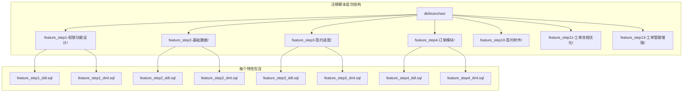

**章节来源**
- [feature_step1-权限功能设计_ddl.sql:1-156](file://db/branches/feature_step1-权限功能设计/feature_step1-权限功能设计_ddl.sql#L1-L156)
- [feature_step2-基础数据_ddl.sql:1-55](file://db/branches/feature_step2-基础数据/feature_step2-基础数据_ddl.sql#L1-L55)

## 迁移脚本架构

### 整体架构设计

项目采用"基础设施层 → 业务模块层"的渐进式架构，每个阶段都有明确的功能边界和数据依赖关系。

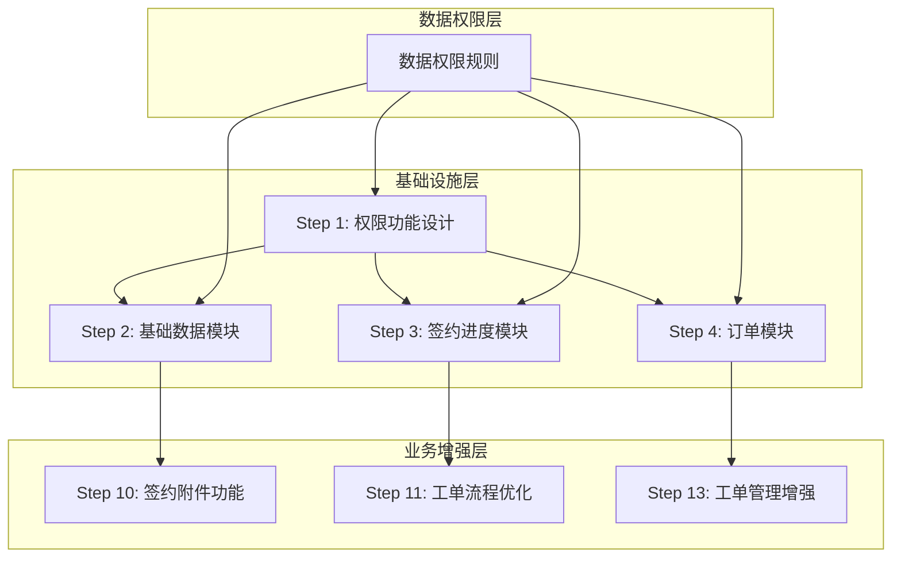

### 数据库设计原则

1. **PostgreSQL兼容性**: 所有DDL脚本均采用PostgreSQL语法
2. **序列化设计**: 每个表都有对应的序列，确保主键唯一性
3. **索引优化**: 关键查询字段建立相应索引
4. **注释规范**: 表和字段都有详细的注释说明

**章节来源**
- [feature_step1-权限功能设计_ddl.sql:11-156](file://db/branches/feature_step1-权限功能设计/feature_step1-权限功能设计_ddl.sql#L11-L156)
- [feature_step2-基础数据_ddl.sql:7-55](file://db/branches/feature_step2-基础数据/feature_step2-基础数据_ddl.sql#L7-L55)

## 核心迁移模块分析

### 权限功能设计模块（Step 1）

这是整个系统的基础设施层，建立了完整的权限管理体系。

#### 核心表结构

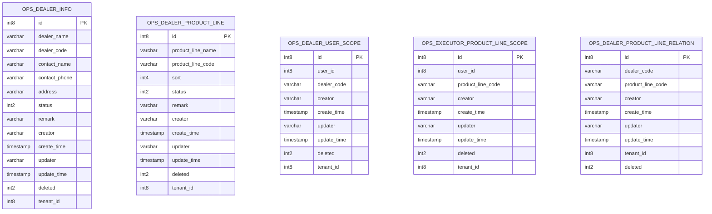

#### 角色权限体系

系统定义了4种核心角色，每种角色都有明确的权限范围：

| 角色名称 | 角色代码 | 权限范围 | 主要职责 |
|---------|---------|---------|---------|
| 品牌管理员 | brand_admin | 全部菜单和按钮 | 系统最高权限管理 |
| 品牌销售员 | brand_sales | 只读权限 | 查看业务数据 |
| 服务单执行员 | service_executor | 业务操作权限 | 执行客户服务任务 |
| 经销商 | dealer | 有限业务权限 | 基础业务操作 |

**章节来源**
- [feature_step1-权限功能设计_ddl.sql:11-156](file://db/branches/feature_step1-权限功能设计/feature_step1-权限功能设计_ddl.sql#L11-L156)
- [feature_step1-权限功能设计_dml.sql:12-170](file://db/branches/feature_step1-权限功能设计/feature_step1-权限功能设计_dml.sql#L12-L170)

### 基础数据模块（Step 2）

建立了完整的文件管理系统，支持4大分类的文件管理。

#### 文件分类体系

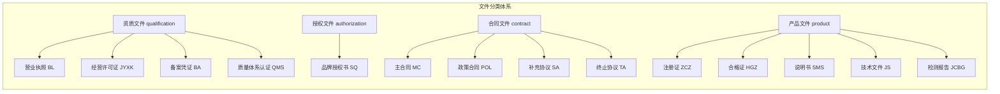

#### 核心表结构

基础数据模块的核心是`ops_basedata_file`表，支持文件的全生命周期管理：

| 字段名 | 类型 | 必填 | 说明 |
|--------|------|:---:|------|
| id | int8 | PK | 主键 |
| dealer_id | int8 | Y | 经销商ID |
| dealer_code | varchar(50) | Y | 经销商编码 |
| category | varchar(30) | Y | 文件分类 |
| file_name | varchar(200) | Y | 文件名称 |
| file_type | varchar(50) | Y | 文件子类型编码 |
| file_no | varchar(30) | N | 文件编号 |
| file_url | varchar(500) | N | 文件地址 |
| file_size | int8 | N | 文件大小（字节） |
| expire_date | date | N | 有效期至 |
| status | int2 | Y | 状态（0=正常, 1=停用） |
| description | varchar(500) | N | 文件描述 |
| remark | varchar(500) | N | 备注 |

**章节来源**
- [feature_step2-基础数据_ddl.sql:7-55](file://db/branches/feature_step2-基础数据/feature_step2-基础数据_ddl.sql#L7-L55)
- [feature_step2-基础数据_dml.sql:21-39](file://db/branches/feature_step2-基础数据/feature_step2-基础数据_dml.sql#L21-L39)

### 签约进度模块（Step 3）

实现了完整的合同生命周期管理，支持多种合同类型。

#### 合同类型体系

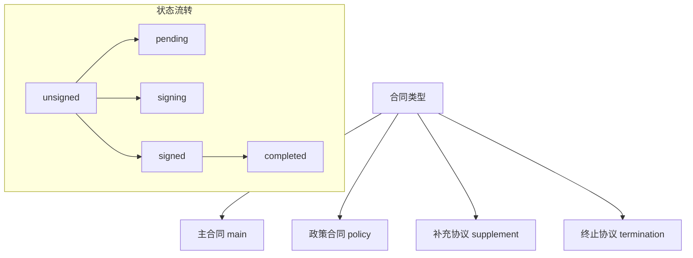

#### 核心表结构

签约进度模块的核心是`ops_signing_contract`表：

| 字段名 | 类型 | 必填 | 说明 |
|--------|------|:---:|------|
| id | BIGINT | PK | 主键 |
| dealer_id | BIGINT | Y | 经销商ID |
| dealer_code | VARCHAR(50) | Y | 经销商编码 |
| product_line_code | VARCHAR(50) | N | 产品线编码 |
| contract_type | VARCHAR(20) | Y | 合同类型 |
| contract_type_name | VARCHAR(50) | Y | 合同类型中文名 |
| contract_code | VARCHAR(30) | Y | 合同编码（唯一） |
| contract_name | VARCHAR(200) | Y | 合同名称 |
| status | VARCHAR(20) | Y | 签署状态（signed/unsigned） |
| sub_status | VARCHAR(20) | N | 子状态（pending/signing） |
| issued_date | DATE | Y | 下发日期 |
| sign_date | DATE | N | 签署日期 |
| summary | TEXT | N | 合同摘要 |
| policy_analysis | TEXT | N | 政策解析（仅policy类型） |
| indicators | TEXT | N | 政策指标JSON数组 |
| file_ids | VARCHAR(500) | N | 关联附件文件ID列表 |
| sign_proof_url | VARCHAR(500) | N | 签署凭证URL |
| remark | VARCHAR(500) | N | 备注 |

**章节来源**
- [feature_step3-签约进度_ddl.sql:7-66](file://db/branches/feature_step3-签约进度/feature_step3-签约进度_ddl.sql#L7-L66)
- [feature_step3-签约进度_dml.sql:42-137](file://db/branches/feature_step3-签约进度/feature_step3-签约进度_dml.sql#L42-L137)

### 订单模块（Step 4）

建立了完整的订单生命周期管理体系，支持复杂的业务流程。

#### 订单状态机

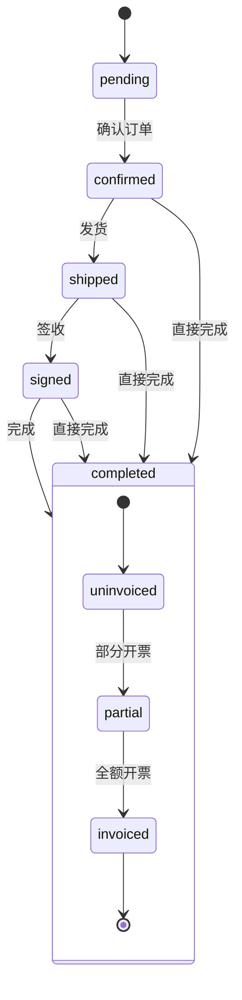

#### 多表关联设计

订单模块采用了典型的"主表 + 明细表 + 扩展表"的设计模式：

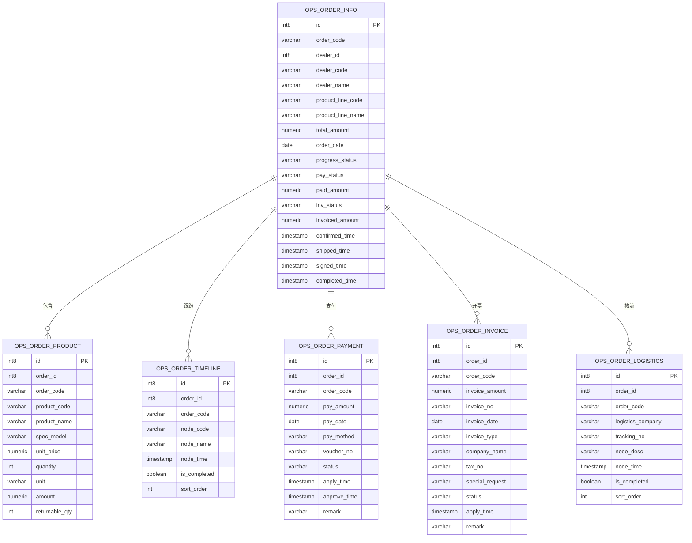

**章节来源**
- [feature_step4-订单模块_ddl.sql:7-267](file://db/branches/feature_step4-订单模块/feature_step4-订单模块_ddl.sql#L7-L267)
- [feature_step4-订单模块_dml.sql:56-192](file://db/branches/feature_step4-订单模块/feature_step4-订单模块_dml.sql#L56-L192)

## 数据库对象关系图

### 完整数据库关系图

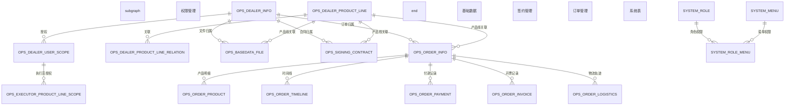

**图表来源**
- [feature_step1-权限功能设计_ddl.sql:11-156](file://db/branches/feature_step1-权限功能设计/feature_step1-权限功能设计_ddl.sql#L11-L156)
- [feature_step2-基础数据_ddl.sql:7-55](file://db/branches/feature_step2-基础数据/feature_step2-基础数据_ddl.sql#L7-L55)
- [feature_step3-签约进度_ddl.sql:7-66](file://db/branches/feature_step3-签约进度/feature_step3-签约进度_ddl.sql#L7-L66)
- [feature_step4-订单模块_ddl.sql:7-267](file://db/branches/feature_step4-订单模块/feature_step4-订单模块_ddl.sql#L7-L267)

## 迁移流程时序图

### 完整迁移执行流程

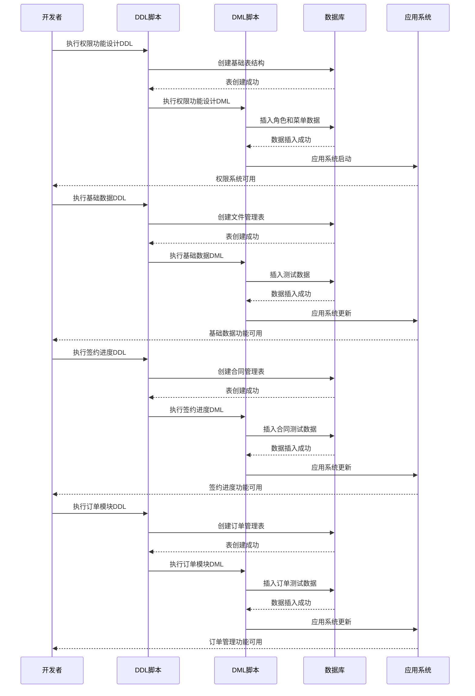

**图表来源**
- [feature_step1-权限功能设计_ddl.sql:1-156](file://db/branches/feature_step1-权限功能设计/feature_step1-权限功能设计_ddl.sql#L1-L156)
- [feature_step2-基础数据_ddl.sql:1-55](file://db/branches/feature_step2-基础数据/feature_step2-基础数据_ddl.sql#L1-L55)
- [feature_step3-签约进度_ddl.sql:1-66](file://db/branches/feature_step3-签约进度/feature_step3-签约进度_ddl.sql#L1-L66)
- [feature_step4-订单模块_ddl.sql:1-267](file://db/branches/feature_step4-订单模块/feature_step4-订单模块_ddl.sql#L1-L267)

## 数据权限设计

### 数据权限规则实现

项目实现了完善的多租户数据权限控制，确保不同角色只能访问授权的数据。

#### 数据权限配置

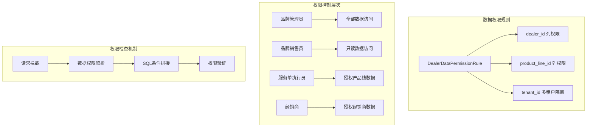

#### 权限控制要点

1. **多租户隔离**: 通过`tenant_id`字段实现租户间数据隔离
2. **经销商维度**: 通过`dealer_code`实现经销商级别的数据权限
3. **产品线维度**: 通过`product_line_code`实现产品线级别的数据权限
4. **执行员权限**: 通过`user_id`实现个人权限控制

**章节来源**
- [PRD-Step2-基础数据模块.md:112-122](file://docs/PRD-Step2-基础数据模块.md#L112-L122)
- [PRD-Step11-工单流程优化.md:116-123](file://docs/PRD-Step11-工单流程优化.md#L116-L123)

## 测试数据管理

### 测试数据策略

项目为每个功能模块都提供了完整的测试数据，确保开发和测试环境的一致性。

#### 测试数据分布

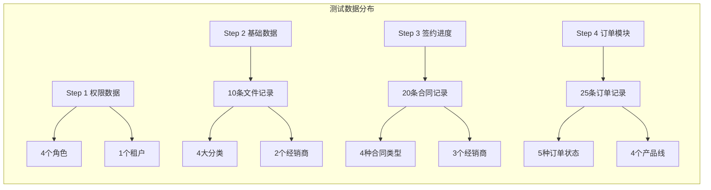

#### 测试数据验证

每个模块的测试数据都包含了典型业务场景，便于功能验证：

| 模块 | 测试数据数量 | 主要验证场景 |
|------|-------------|-------------|
| 权限功能 | 4角色 + 53菜单按钮 | 角色权限分配、菜单权限控制 |
| 基础数据 | 10条文件记录 | 文件分类、有效期管理、下载功能 |
| 签约进度 | 20条合同记录 | 合同类型、状态流转、附件管理 |
| 订单模块 | 25条订单记录 | 订单状态、支付流程、物流跟踪 |

**章节来源**
- [feature_step2-基础数据_dml.sql:21-39](file://db/branches/feature_step2-基础数据/feature_step2-基础数据_dml.sql#L21-L39)
- [feature_step3-签约进度_dml.sql:42-137](file://db/branches/feature_step3-签约进度/feature_step3-签约进度_dml.sql#L42-L137)
- [feature_step4-订单模块_dml.sql:56-192](file://db/branches/feature_step4-订单模块/feature_step4-订单模块_dml.sql#L56-L192)

## 部署与执行策略

### 迁移脚本执行顺序

为了确保数据库结构的正确性和数据完整性，需要按照特定的顺序执行迁移脚本：

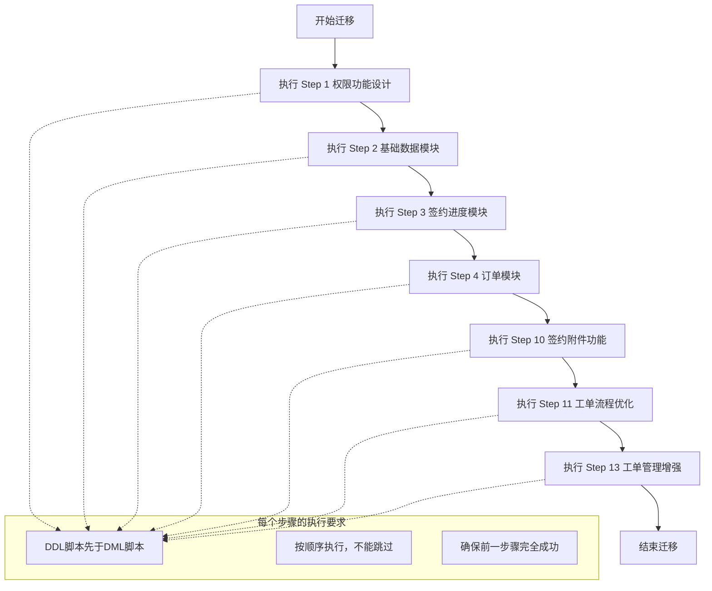

### 执行注意事项

1. **事务管理**: 每个步骤的DDL和DML应该在一个事务中执行
2. **依赖检查**: 确保前置依赖的表和数据已经存在
3. **序列同步**: DML完成后需要同步序列值，避免主键冲突
4. **数据验证**: 执行完成后验证关键数据的完整性和正确性

**章节来源**
- [feature_step1-权限功能设计_dml.sql:177-180](file://db/branches/feature_step1-权限功能设计/feature_step1-权限功能设计_dml.sql#L177-L180)
- [feature_step4-订单模块_dml.sql:329-337](file://db/branches/feature_step4-订单模块/feature_step4-订单模块_dml.sql#L329-L337)

## 故障排除指南

### 常见问题及解决方案

#### 1. 主键冲突问题

**问题描述**: 执行DML时出现主键冲突错误

**解决方案**:
- 检查序列值是否正确同步
- 确认DDL和DML的执行顺序
- 验证测试数据的ID范围是否冲突

#### 2. 数据权限问题

**问题描述**: 用户无法访问预期的数据

**解决方案**:
- 检查用户的角色和授权关系
- 验证数据权限规则配置
- 确认租户ID和经销商编码的正确性

#### 3. 菜单权限问题

**问题描述**: 用户看不到预期的菜单或按钮

**解决方案**:
- 检查角色-菜单关联数据
- 验证菜单的父级关系
- 确认权限字符串的正确性

#### 4. 序列值问题

**问题描述**: 插入数据时报序列值超出范围

**解决方案**:
- 执行序列同步语句
- 检查最大ID值
- 重新设置序列起始值

**章节来源**
- [feature_step1-权限功能设计_dml.sql:177-180](file://db/branches/feature_step1-权限功能设计/feature_step1-权限功能设计_dml.sql#L177-L180)
- [feature_step3-签约进度_dml.sql:144-147](file://db/branches/feature_step3-签约进度/feature_step3-签约进度_dml.sql#L144-L147)

## 总结

本项目的数据库迁移脚本展现了良好的工程实践，具有以下特点：

### 技术亮点

1. **模块化设计**: 采用Feature Branch模式，每个功能特性都有独立的迁移脚本
2. **渐进式演进**: 从基础设施到业务功能的有序发展
3. **完整的测试数据**: 每个模块都提供了丰富的测试数据
4. **完善的数据权限**: 支持多维度的数据权限控制
5. **标准化的命名规范**: 表名、字段名、索引名都有清晰的命名规则

### 最佳实践

1. **DDL优先**: 先创建表结构，再插入数据
2. **序列管理**: 通过序列确保主键的唯一性和连续性
3. **索引优化**: 为核心查询字段建立适当的索引
4. **注释规范**: 为表和字段添加详细的注释说明
5. **测试驱动**: 每个功能都配有相应的测试数据

### 未来展望

随着业务的发展，项目还可以在以下方面进一步完善：
- 增加更多的自动化测试
- 优化复杂查询的性能
- 扩展数据权限的粒度
- 增强数据备份和恢复机制