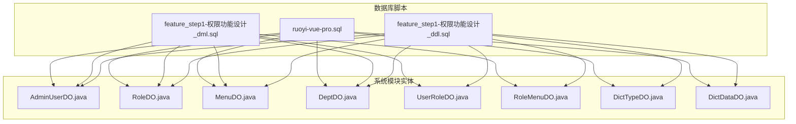
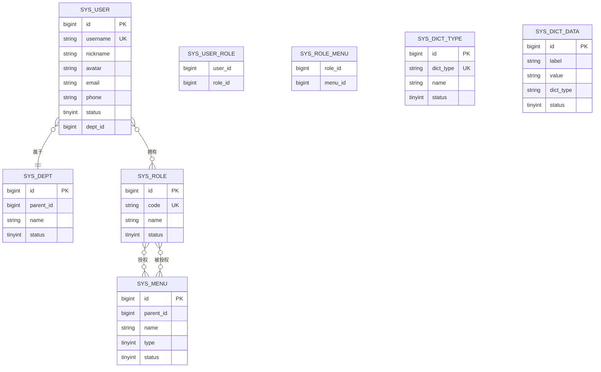
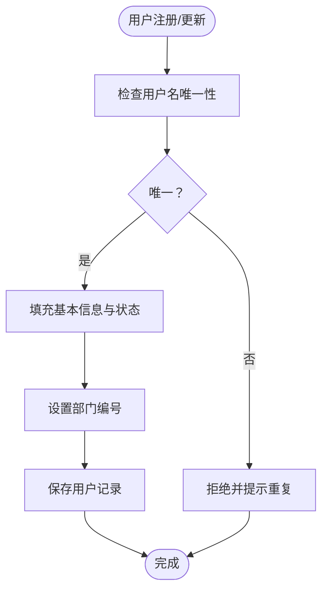
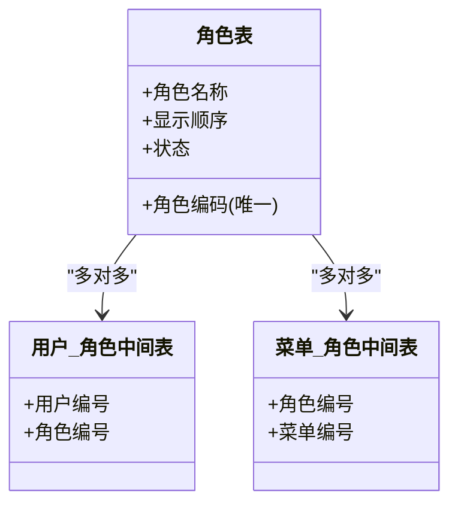
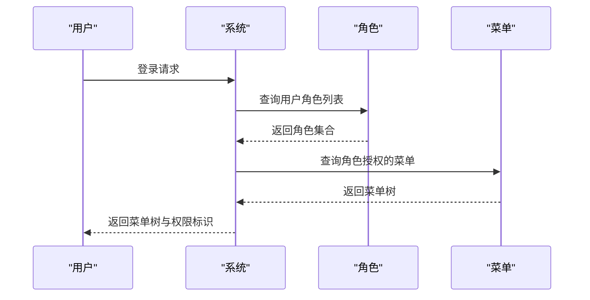
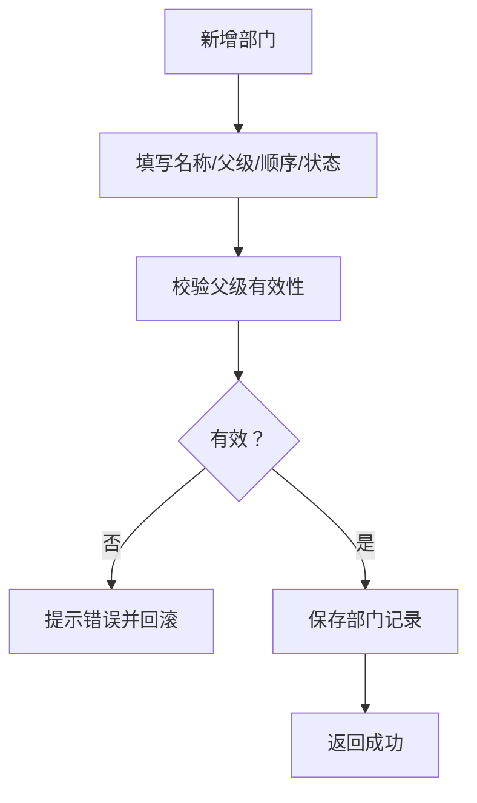
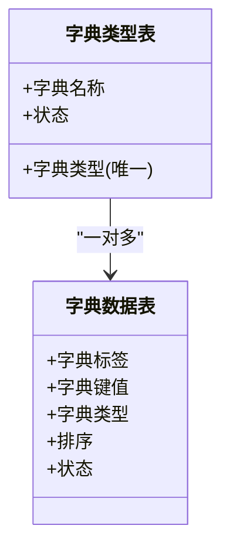
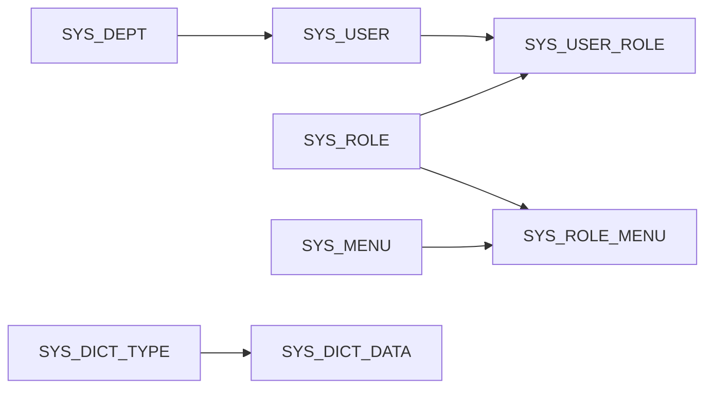

# 核心业务表设计

<cite>
**本文引用的文件**
- [feature_step1-权限功能设计_ddl.sql](file://db/branches/feature_step1-权限功能设计/feature_step1-权限功能设计_ddl.sql)
- [feature_step1-权限功能设计_dml.sql](file://db/branches/feature_step1-权限功能设计/feature_step1-权限功能设计_dml.sql)
- [DeptDO.java](file://yudao-module-system/src/main/java/cn/iocoder/yudao/module/system/dal/dataobject/dept/DeptDO.java)
- [MenuDO.java](file://yudao-module-system/src/main/java/cn/iocoder/yudao/module/system/dal/dataobject/permission/MenuDO.java)
- [RoleDO.java](file://yudao-module-system/src/main/java/cn/iocoder/yudao/module/system/dal/dataobject/permission/RoleDO.java)
- [UserRoleDO.java](file://yudao-module-system/src/main/java/cn/iocoder/yudao/module/system/dal/dataobject/permission/UserRoleDO.java)
- [RoleMenuDO.java](file://yudao-module-system/src/main/java/cn/iocoder/yudao/module/system/dal/dataobject/permission/RoleMenuDO.java)
- [AdminUserDO.java](file://yudao-module-system/src/main/java/cn/iocoder/yudao/module/system/dal/dataobject/user/AdminUserDO.java)
- [DictTypeDO.java](file://yudao-module-system/src/main/java/cn/iocoder/yudao/module/system/dal/dataobject/dict/DictTypeDO.java)
- [DictDataDO.java](file://yudao-module-system/src/main/java/cn/iocoder/yudao/module/system/dal/dataobject/dict/DictDataDO.java)
- [ruoyi-vue-pro.sql](file://sql/postgresql/ruoyi-vue-pro.sql)
</cite>

## 目录
1. [简介](#简介)
2. [项目结构](#项目结构)
3. [核心组件](#核心组件)
4. [架构总览](#架构总览)
5. [详细组件分析](#详细组件分析)
6. [依赖分析](#依赖分析)
7. [性能考虑](#性能考虑)
8. [故障排查指南](#故障排查指南)
9. [结论](#结论)
10. [附录](#附录)

## 简介
本文件聚焦于系统中最核心的基础业务表设计，围绕用户、角色、菜单、部门等基础数据表进行字段定义、数据类型与约束设计说明，并阐述表间关系映射（一对多、多对多）、主键策略（自增与 UUID 的取舍）、索引策略（主键、唯一、复合索引），以及数据字典、配置类辅助表的设计要点。同时给出业务规则约束、数据完整性保障与性能优化建议，帮助读者快速理解并落地数据库层设计。

## 项目结构
本项目的数据库层设计主要分布在以下位置：
- 数据库脚本：位于 db/branches/feature_step1-权限功能设计 下的 DDL/DML 脚本，定义了权限相关的核心表结构与初始数据。
- 实体模型：位于 yudao-module-system 模块的 dal/dataobject 中，对应 sys_user、sys_role、sys_menu、sys_dept 等核心表的 Java 实体类，体现字段语义与约束。
- 基础脚本：sql/postgresql/ruoyi-vue-pro.sql 提供了系统级基础表的完整建模参考。

图表来源
- [feature_step1-权限功能设计_ddl.sql](file://db/branches/feature_step1-权限功能设计/feature_step1-权限功能设计_ddl.sql)
- [feature_step1-权限功能设计_dml.sql](file://db/branches/feature_step1-权限功能设计/feature_step1-权限功能设计_dml.sql)
- [ruoyi-vue-pro.sql](file://sql/postgresql/ruoyi-vue-pro.sql)
- [AdminUserDO.java](file://yudao-module-system/src/main/java/cn/iocoder/yudao/module/system/dal/dataobject/user/AdminUserDO.java)
- [RoleDO.java](file://yudao-module-system/src/main/java/cn/iocoder/yudao/module/system/dal/dataobject/permission/RoleDO.java)
- [MenuDO.java](file://yudao-module-system/src/main/java/cn/iocoder/yudao/module/system/dal/dataobject/permission/MenuDO.java)
- [DeptDO.java](file://yudao-module-system/src/main/java/cn/iocoder/yudao/module/system/dal/dataobject/dept/DeptDO.java)
- [UserRoleDO.java](file://yudao-module-system/src/main/java/cn/iocoder/yudao/module/system/dal/dataobject/permission/UserRoleDO.java)
- [RoleMenuDO.java](file://yudao-module-system/src/main/java/cn/iocoder/yudao/module/system/dal/dataobject/permission/RoleMenuDO.java)
- [DictTypeDO.java](file://yudao-module-system/src/main/java/cn/iocoder/yudao/module/system/dal/dataobject/dict/DictTypeDO.java)
- [DictDataDO.java](file://yudao-module-system/src/main/java/cn/iocoder/yudao/module/system/dal/dataobject/dict/DictDataDO.java)

章节来源
- [feature_step1-权限功能设计_ddl.sql](file://db/branches/feature_step1-权限功能设计/feature_step1-权限功能设计_ddl.sql)
- [feature_step1-权限功能设计_dml.sql](file://db/branches/feature_step1-权限功能设计/feature_step1-权限功能设计_dml.sql)
- [ruoyi-vue-pro.sql](file://sql/postgresql/ruoyi-vue-pro.sql)

## 核心组件
本节从数据库表与实体类两个维度，梳理核心业务表的字段、类型与约束设计思路，并给出主键与索引策略建议。

- 用户表（sys_user）
  - 字段设计要点：登录账号、密码、姓名、性别、头像、状态、部门编号、邮箱/手机号等；需设置唯一性约束（如账号唯一）与非空约束（如姓名、状态）。
  - 主键策略：采用自增主键，便于高并发下的插入性能与排序检索；若存在跨库合并场景，可考虑 UUID。
  - 索引策略：主键索引自动建立；为登录账号建立唯一索引；为部门编号建立普通索引以支持部门查询；为状态建立普通索引以支持状态过滤。
  - 关系映射：一对多关联部门表（dept_id），多对多关联角色表（通过用户-角色中间表）。
  - 参考路径：[AdminUserDO.java](file://yudao-module-system/src/main/java/cn/iocoder/yudao/module/system/dal/dataobject/user/AdminUserDO.java)

- 角色表（sys_role）
  - 字段设计要点：角色编码、角色名称、显示顺序、状态、备注等；角色编码需唯一。
  - 主键策略：自增主键，配合唯一索引（角色编码）。
  - 索引策略：主键索引；唯一索引（角色编码）；为状态建立普通索引。
  - 关系映射：多对多关联用户表与菜单表（通过角色-用户中间表与角色-菜单中间表）。
  - 参考路径：[RoleDO.java](file://yudao-module-system/src/main/java/cn/iocoder/yudao/module/system/dal/dataobject/permission/RoleDO.java)

- 菜单表（sys_menu）
  - 字段设计要点：菜单名称、父级编号、类型（目录/菜单/按钮）、路由地址、权限标识、显示顺序、状态等；父子关系通过 parent_id 维护树形结构。
  - 主键策略：自增主键；为 parent_id 建立普通索引以支持树形查询。
  - 索引策略：主键索引；为 parent_id 建立普通索引；为类型与状态建立复合索引以支持筛选。
  - 关系映射：多对多关联角色表（角色-菜单中间表）。
  - 参考路径：[MenuDO.java](file://yudao-module-system/src/main/java/cn/iocoder/yudao/module/system/dal/dataobject/permission/MenuDO.java)

- 部门表（sys_dept）
  - 字段设计要点：部门名称、父级编号、显示顺序、负责人、电话、邮箱、状态等；父子关系通过 parent_id 维护树形结构。
  - 主键策略：自增主键；为 parent_id 建立普通索引。
  - 索引策略：主键索引；为 parent_id 建立普通索引；为状态建立普通索引。
  - 关系映射：一对多关联用户表（dept_id）。
  - 参考路径：[DeptDO.java](file://yudao-module-system/src/main/java/cn/iocoder/yudao/module/system/dal/dataobject/dept/DeptDO.java)

- 用户-角色中间表（sys_user_role）
  - 字段设计要点：用户编号、角色编号；联合唯一约束避免重复绑定。
  - 主键策略：联合主键（user_id, role_id）或自增主键+联合唯一索引均可。
  - 索引策略：联合主键自动建立；为 user_id 建立普通索引；为 role_id 建立普通索引。
  - 参考路径：[UserRoleDO.java](file://yudao-module-system/src/main/java/cn/iocoder/yudao/module/system/dal/dataobject/permission/UserRoleDO.java)

- 角色-菜单中间表（sys_role_menu）
  - 字段设计要点：角色编号、菜单编号；联合唯一约束。
  - 主键策略：联合主键或自增主键+联合唯一索引。
  - 索引策略：联合主键自动建立；为 role_id 建立普通索引；为 menu_id 建立普通索引。
  - 参考路径：[RoleMenuDO.java](file://yudao-module-system/src/main/java/cn/iocoder/yudao/module/system/dal/dataobject/permission/RoleMenuDO.java)

- 数据字典类型表（sys_dict_type）
  - 字段设计要点：字典名称、字典类型、状态等；字典类型需唯一。
  - 主键策略：自增主键；为 dict_type 建立唯一索引。
  - 索引策略：主键索引；唯一索引（dict_type）。
  - 参考路径：[DictTypeDO.java](file://yudao-module-system/src/main/java/cn/iocoder/yudao/module/system/dal/dataobject/dict/DictTypeDO.java)

- 数据字典数据表（sys_dict_data）
  - 字段设计要点：字典标签、字典键值、字典类型、排序、状态等；同一类型下标签与键值需唯一。
  - 主键策略：自增主键；为 dict_type 建立普通索引；为 label 建立普通索引。
  - 索引策略：主键索引；为 dict_type 建立普通索引；为 label 建立普通索引。
  - 参考路径：[DictDataDO.java](file://yudao-module-system/src/main/java/cn/iocoder/yudao/module/system/dal/dataobject/dict/DictDataDO.java)

章节来源
- [AdminUserDO.java](file://yudao-module-system/src/main/java/cn/iocoder/yudao/module/system/dal/dataobject/user/AdminUserDO.java)
- [RoleDO.java](file://yudao-module-system/src/main/java/cn/iocoder/yudao/module/system/dal/dataobject/permission/RoleDO.java)
- [MenuDO.java](file://yudao-module-system/src/main/java/cn/iocoder/yudao/module/system/dal/dataobject/permission/MenuDO.java)
- [DeptDO.java](file://yudao-module-system/src/main/java/cn/iocoder/yudao/module/system/dal/dataobject/dept/DeptDO.java)
- [UserRoleDO.java](file://yudao-module-system/src/main/java/cn/iocoder/yudao/module/system/dal/dataobject/permission/UserRoleDO.java)
- [RoleMenuDO.java](file://yudao-module-system/src/main/java/cn/iocoder/yudao/module/system/dal/dataobject/permission/RoleMenuDO.java)
- [DictTypeDO.java](file://yudao-module-system/src/main/java/cn/iocoder/yudao/module/system/dal/dataobject/dict/DictTypeDO.java)
- [DictDataDO.java](file://yudao-module-system/src/main/java/cn/iocoder/yudao/module/system/dal/dataobject/dict/DictDataDO.java)

## 架构总览
下图展示了核心业务表之间的关系映射，包括一对多与多对多关系，以及中间表在多对多关系中的作用。

图表来源
- [AdminUserDO.java](file://yudao-module-system/src/main/java/cn/iocoder/yudao/module/system/dal/dataobject/user/AdminUserDO.java)
- [DeptDO.java](file://yudao-module-system/src/main/java/cn/iocoder/yudao/module/system/dal/dataobject/dept/DeptDO.java)
- [RoleDO.java](file://yudao-module-system/src/main/java/cn/iocoder/yudao/module/system/dal/dataobject/permission/RoleDO.java)
- [MenuDO.java](file://yudao-module-system/src/main/java/cn/iocoder/yudao/module/system/dal/dataobject/permission/MenuDO.java)
- [UserRoleDO.java](file://yudao-module-system/src/main/java/cn/iocoder/yudao/module/system/dal/dataobject/permission/UserRoleDO.java)
- [RoleMenuDO.java](file://yudao-module-system/src/main/java/cn/iocoder/yudao/module/system/dal/dataobject/permission/RoleMenuDO.java)
- [DictTypeDO.java](file://yudao-module-system/src/main/java/cn/iocoder/yudao/module/system/dal/dataobject/dict/DictTypeDO.java)
- [DictDataDO.java](file://yudao-module-system/src/main/java/cn/iocoder/yudao/module/system/dal/dataobject/dict/DictDataDO.java)

## 详细组件分析

### 用户表（sys_user）设计
- 字段与类型：用户名、昵称、头像、邮箱、手机、状态、部门编号等；状态建议使用 tinyint 或枚举型整数。
- 约束设计：用户名唯一；姓名、状态必填；部门编号外键指向部门表。
- 主键策略：自增主键；若涉及分布式或跨库合并，可考虑 UUID。
- 索引策略：主键索引；用户名唯一索引；部门编号普通索引；状态普通索引。
- 关系映射：一对多（部门-用户）；多对多（用户-角色）。
- 业务规则：状态为启用才允许登录；手机号/邮箱格式校验；默认头像处理。

图表来源
- [AdminUserDO.java](file://yudao-module-system/src/main/java/cn/iocoder/yudao/module/system/dal/dataobject/user/AdminUserDO.java)

章节来源
- [AdminUserDO.java](file://yudao-module-system/src/main/java/cn/iocoder/yudao/module/system/dal/dataobject/user/AdminUserDO.java)

### 角色表（sys_role）设计
- 字段与类型：角色编码（唯一）、角色名称、显示顺序、状态等。
- 约束设计：角色编码唯一；名称非空；状态必填。
- 主键策略：自增主键；角色编码建立唯一索引。
- 索引策略：主键索引；角色编码唯一索引；状态普通索引。
- 关系映射：多对多（角色-用户、角色-菜单）。
- 业务规则：角色编码用于权限标识与前端展示；状态为停用则不参与授权。

图表来源
- [RoleDO.java](file://yudao-module-system/src/main/java/cn/iocoder/yudao/module/system/dal/dataobject/permission/RoleDO.java)
- [UserRoleDO.java](file://yudao-module-system/src/main/java/cn/iocoder/yudao/module/system/dal/dataobject/permission/UserRoleDO.java)
- [RoleMenuDO.java](file://yudao-module-system/src/main/java/cn/iocoder/yudao/module/system/dal/dataobject/permission/RoleMenuDO.java)

章节来源
- [RoleDO.java](file://yudao-module-system/src/main/java/cn/iocoder/yudao/module/system/dal/dataobject/permission/RoleDO.java)
- [UserRoleDO.java](file://yudao-module-system/src/main/java/cn/iocoder/yudao/module/system/dal/dataobject/permission/UserRoleDO.java)
- [RoleMenuDO.java](file://yudao-module-system/src/main/java/cn/iocoder/yudao/module/system/dal/dataobject/permission/RoleMenuDO.java)

### 菜单表（sys_menu）设计
- 字段与类型：菜单名称、父级编号、类型（目录/菜单/按钮）、路由地址、权限标识、显示顺序、状态等。
- 约束设计：名称非空；类型与状态必填；父子关系通过 parent_id 维护树形。
- 主键策略：自增主键；parent_id 建立普通索引。
- 索引策略：主键索引；parent_id 普通索引；类型+状态复合索引。
- 关系映射：多对多（菜单-角色）。
- 业务规则：类型为按钮时通常无子节点；权限标识用于接口鉴权；状态为停用则不下发。

图表来源
- [MenuDO.java](file://yudao-module-system/src/main/java/cn/iocoder/yudao/module/system/dal/dataobject/permission/MenuDO.java)
- [RoleMenuDO.java](file://yudao-module-system/src/main/java/cn/iocoder/yudao/module/system/dal/dataobject/permission/RoleMenuDO.java)

章节来源
- [MenuDO.java](file://yudao-module-system/src/main/java/cn/iocoder/yudao/module/system/dal/dataobject/permission/MenuDO.java)
- [RoleMenuDO.java](file://yudao-module-system/src/main/java/cn/iocoder/yudao/module/system/dal/dataobject/permission/RoleMenuDO.java)

### 部门表（sys_dept）设计
- 字段与类型：部门名称、父级编号、显示顺序、负责人、电话、邮箱、状态等。
- 约束设计：名称非空；父子关系通过 parent_id 维护树形；状态必填。
- 主键策略：自增主键；parent_id 建立普通索引。
- 索引策略：主键索引；parent_id 普通索引；状态普通索引。
- 关系映射：一对多（部门-用户）。
- 业务规则：根部门 parent_id 为 0；状态为停用则不可分配新成员。

图表来源
- [DeptDO.java](file://yudao-module-system/src/main/java/cn/iocoder/yudao/module/system/dal/dataobject/dept/DeptDO.java)

章节来源
- [DeptDO.java](file://yudao-module-system/src/main/java/cn/iocoder/yudao/module/system/dal/dataobject/dept/DeptDO.java)

### 数据字典表（sys_dict_type/sys_dict_data）设计
- 类型表字段：字典名称、字典类型、状态；字典类型唯一。
- 数据表字段：字典标签、字典键值、字典类型、排序、状态；同一类型下标签与键值唯一。
- 索引策略：类型表为主键+唯一索引；数据表为主键+普通索引（类型、标签）。
- 业务规则：标签用于展示，键值用于存储；状态为停用则不下发。

图表来源
- [DictTypeDO.java](file://yudao-module-system/src/main/java/cn/iocoder/yudao/module/system/dal/dataobject/dict/DictTypeDO.java)
- [DictDataDO.java](file://yudao-module-system/src/main/java/cn/iocoder/yudao/module/system/dal/dataobject/dict/DictDataDO.java)

章节来源
- [DictTypeDO.java](file://yudao-module-system/src/main/java/cn/iocoder/yudao/module/system/dal/dataobject/dict/DictTypeDO.java)
- [DictDataDO.java](file://yudao-module-system/src/main/java/cn/iocoder/yudao/module/system/dal/dataobject/dict/DictDataDO.java)

## 依赖分析
- 表间依赖
  - 用户表依赖部门表（外键 dept_id）。
  - 用户-角色中间表依赖用户表与角色表。
  - 角色-菜单中间表依赖角色表与菜单表。
  - 字典数据表依赖字典类型表（dict_type）。
- 索引依赖
  - 唯一索引确保业务唯一性（用户名、角色编码、字典类型）。
  - 普通索引支撑常见查询（parent_id、status、label）。
- 中间表的作用
  - 将多对多关系拆分为两个一对多关系，降低数据冗余与更新异常风险。

图表来源
- [DeptDO.java](file://yudao-module-system/src/main/java/cn/iocoder/yudao/module/system/dal/dataobject/dept/DeptDO.java)
- [AdminUserDO.java](file://yudao-module-system/src/main/java/cn/iocoder/yudao/module/system/dal/dataobject/user/AdminUserDO.java)
- [UserRoleDO.java](file://yudao-module-system/src/main/java/cn/iocoder/yudao/module/system/dal/dataobject/permission/UserRoleDO.java)
- [RoleDO.java](file://yudao-module-system/src/main/java/cn/iocoder/yudao/module/system/dal/dataobject/permission/RoleDO.java)
- [RoleMenuDO.java](file://yudao-module-system/src/main/java/cn/iocoder/yudao/module/system/dal/dataobject/permission/RoleMenuDO.java)
- [MenuDO.java](file://yudao-module-system/src/main/java/cn/iocoder/yudao/module/system/dal/dataobject/permission/MenuDO.java)
- [DictTypeDO.java](file://yudao-module-system/src/main/java/cn/iocoder/yudao/module/system/dal/dataobject/dict/DictTypeDO.java)
- [DictDataDO.java](file://yudao-module-system/src/main/java/cn/iocoder/yudao/module/system/dal/dataobject/dict/DictDataDO.java)

章节来源
- [feature_step1-权限功能设计_ddl.sql](file://db/branches/feature_step1-权限功能设计/feature_step1-权限功能设计_ddl.sql)

## 性能考虑
- 主键策略
  - 自增主键适合高并发写入场景；UUID 主键可避免序列号热点但会带来索引碎片与随机写放大问题，需谨慎使用。
- 索引策略
  - 为高频查询字段建立合适索引，避免过度索引导致写入性能下降。
  - 复合索引顺序应遵循“最左前缀”原则，优先放置区分度高的列。
- 查询优化
  - 使用分页查询与覆盖索引减少回表。
  - 树形查询（菜单/部门）尽量利用 parent_id 索引与层级限制。
- 写入优化
  - 批量插入与事务合并，减少锁竞争。
  - 合理设置 innodb_flush_log_at_trx_commit 等参数以平衡安全与性能。

## 故障排查指南
- 常见问题
  - 唯一约束冲突：用户名、角色编码、字典类型重复导致插入失败。
  - 外键约束失败：删除/更新被引用记录导致失败。
  - 索引失效：查询未命中索引或索引选择不当导致慢查询。
- 排查步骤
  - 检查唯一索引是否已存在重复值。
  - 使用 EXPLAIN 分析 SQL 执行计划，确认索引使用情况。
  - 校验外键关联数据是否存在。
- 修复建议
  - 删除或修改重复值后重试。
  - 重建或调整索引，确保查询走索引。
  - 在删除前先清理中间表关联或设置级联删除。

章节来源
- [feature_step1-权限功能设计_ddl.sql](file://db/branches/feature_step1-权限功能设计/feature_step1-权限功能设计_ddl.sql)

## 结论
通过对用户、角色、菜单、部门及数据字典等核心表的设计梳理，明确了字段定义、数据类型与约束、主键与索引策略，以及表间关系映射。结合业务规则与性能优化建议，可在保证数据完整性的同时提升系统整体性能与可维护性。实际落地时，建议依据具体数据库方言与业务场景进一步细化索引与分区策略。

## 附录
- 参考脚本
  - 权限功能设计 DDL/DML：[feature_step1-权限功能设计_ddl.sql](file://db/branches/feature_step1-权限功能设计/feature_step1-权限功能设计_ddl.sql)，[feature_step1-权限功能设计_dml.sql](file://db/branches/feature_step1-权限功能设计/feature_step1-权限功能设计_dml.sql)
  - 系统基础脚本（PostgreSQL）：[ruoyi-vue-pro.sql](file://sql/postgresql/ruoyi-vue-pro.sql)