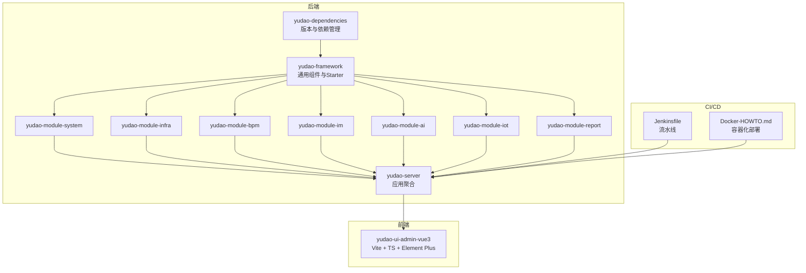
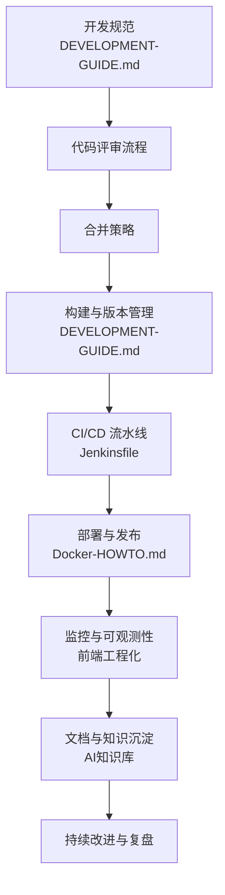
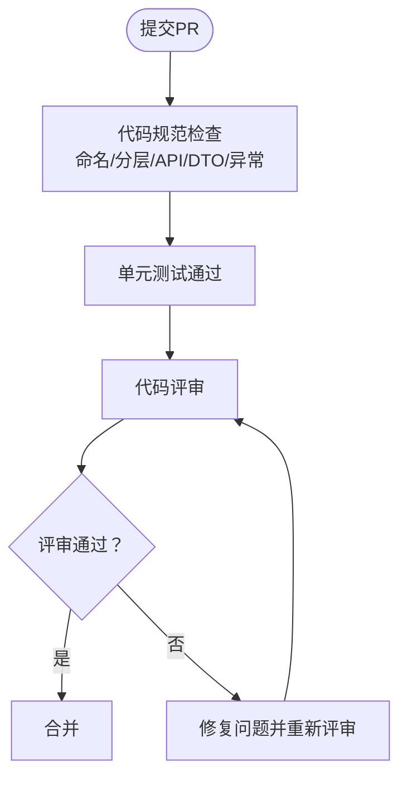
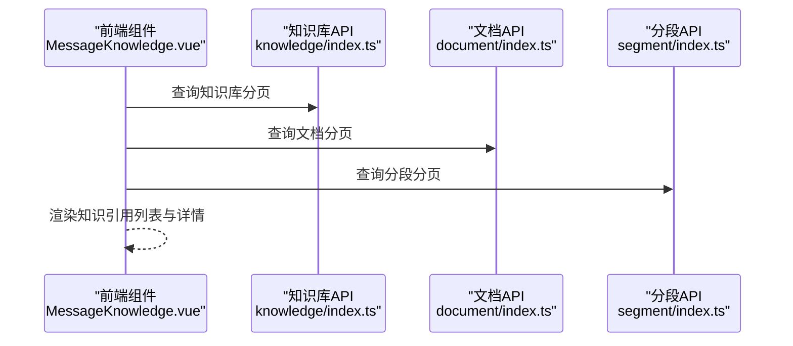
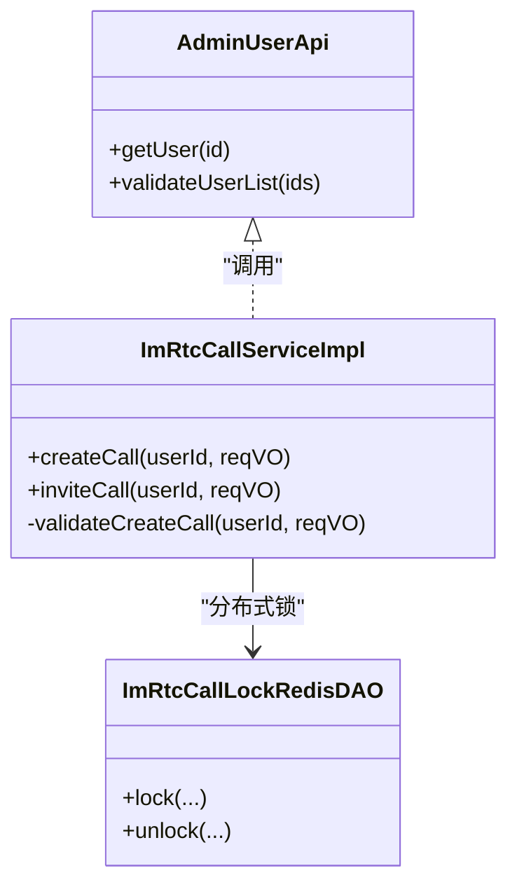
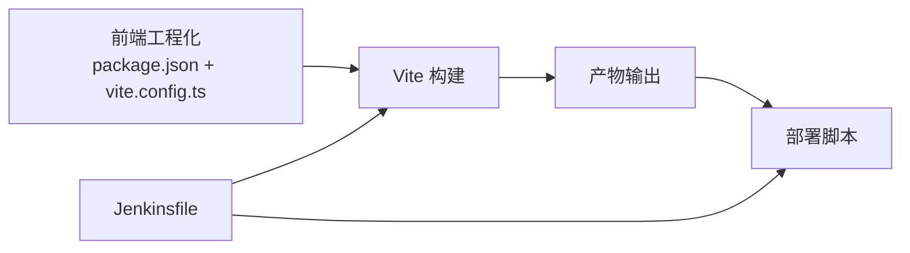

# 团队协作

<cite>
**本文引用的文件**
- [README.md](file://README.md)
- [DEVELOPMENT-GUIDE.md](file://DEVELOPMENT-GUIDE.md)
- [STARTUP.md](file://STARTUP.md)
- [Jenkinsfile](file://script/jenkins/Jenkinsfile)
- [Docker-HOWTO.md](file://script/docker/Docker-HOWTO.md)
- [MessageKnowledge.vue](file://yudao-ui/yudao-ui-admin-vue3/src/views/ai/chat/index/components/message/MessageKnowledge.vue)
- [knowledge/index.ts](file://yudao-ui/yudao-ui-admin-vue3/src/api/ai/knowledge/knowledge/index.ts)
- [document/index.ts](file://yudao-ui/yudao-ui-admin-vue3/src/api/ai/knowledge/document/index.ts)
- [segment/index.ts](file://yudao-ui/yudao-ui-admin-vue3/src/api/ai/knowledge/segment/index.ts)
- [ImRtcCallServiceImpl.java](file://yudao-module-im/src/main/java/cn/iocoder/yudao/module/im/service/rtc/ImRtcCallServiceImpl.java)
- [ImRtcCallLockRedisDAO.java](file://yudao-module-im/src/main/java/cn/iocoder/yudao/module/im/dal/redis/rtc/ImRtcCallLockRedisDAO.java)
- [BpmTaskReturnReqVO.java](file://yudao-module-bpm/src/main/java/cn/iocoder/yudao/module/bpm/controller/admin/task/vo/task/BpmTaskReturnReqVO.java)
- [BpmnVariableConstants.java](file://yudao-module-bpm/src/main/java/cn/iocoder/yudao/module/bpm/framework/flowable/core/enums/BpmnVariableConstants.java)
- [Home/types.ts](file://yudao-ui/yudao-ui-admin-vue3/src/views/Home/types.ts)
- [vite.config.ts](file://yudao-ui/yudao-ui-admin-vue3/vite.config.ts)
- [package.json](file://yudao-ui/yudao-ui-admin-vue3/package.json)
</cite>

## 目录
1. [引言](#引言)
2. [项目结构](#项目结构)
3. [核心组件](#核心组件)
4. [架构总览](#架构总览)
5. [详细组件分析](#详细组件分析)
6. [依赖分析](#依赖分析)
7. [性能考虑](#性能考虑)
8. [故障排查指南](#故障排查指南)
9. [结论](#结论)
10. [附录](#附录)

## 引言
本指南面向“芋道 ruoyi-vue-pro”团队，围绕代码共享实践、知识分享机制、技术交流活动、跨团队协作模式、知识传递方法、文档维护规范、沟通协作工具、冲突解决机制以及远程协作实践，提供一套可落地的团队协作体系。文档以现有仓库中的开发规范、启动指南、CI/CD 脚本、前端工程化配置、AI 知识库与 IM 实时通话能力为依据，结合项目模块化架构与多语言技术栈，给出团队协作的流程、工具与最佳实践。

## 项目结构
- 后端采用多模块 Maven 架构，包含 yudao-dependencies、yudao-framework、各业务模块（system、infra、bpm、im、ai、iot、report 等）与 yudao-server 应用聚合模块。
- 前端为 Vue3 + TypeScript 管理后台，采用 Vite 构建、Pinia 状态管理、UnoCSS、Element Plus 等技术栈。
- CI/CD 通过 Jenkinsfile 实现自动化构建与部署流程。
- 工程化方面，提供 Docker 快速部署说明与前端多环境配置。

**章节来源**
- [README.md: 324-348:324-348](file://README.md#L324-L348)
- [STARTUP.md: 1-157:1-157](file://STARTUP.md#L1-L157)
- [Jenkinsfile: 1-61:1-61](file://script/jenkins/Jenkinsfile#L1-L61)
- [Docker-HOWTO.md: 1-50:1-50](file://script/docker/Docker-HOWTO.md#L1-L50)

## 核心组件
- 开发规范与分层：明确模块层次、包结构、依赖方向、命名规范、API 设计、数据库与 ORM、VO/DTO、异常与错误码、Service 层、测试规范、前端开发规范、构建与版本管理。
- 启动指南：后端数据库初始化、配置文件、编译与启动、前端依赖安装与开发服务器、MinIO 文件存储配置、登录管理后台与常见问题。
- CI/CD：Jenkins 流水线参数化构建、环境变量、阶段化流程（检出、构建、部署）。
- 前端工程化：Vite 多环境配置、插件体系、别名与路径解析、构建优化与代码分割。
- AI 知识库：知识库、文档、分段的 API 与前端展示组件，支撑知识引用与检索。
- IM 实时通话：并发幂等、分布式锁、状态机与推送通道，支撑多人协作场景。

**章节来源**
- [DEVELOPMENT-GUIDE.md: 22-84:22-84](file://DEVELOPMENT-GUIDE.md#L22-L84)
- [STARTUP.md: 17-157:17-157](file://STARTUP.md#L17-L157)
- [Jenkinsfile: 1-61:1-61](file://script/jenkins/Jenkinsfile#L1-L61)
- [vite.config.ts: 15-102:15-102](file://yudao-ui/yudao-ui-admin-vue3/vite.config.ts#L15-L102)
- [MessageKnowledge.vue: 1-76:1-76](file://yudao-ui/yudao-ui-admin-vue3/src/views/ai/chat/index/components/message/MessageKnowledge.vue#L1-L76)
- [ImRtcCallServiceImpl.java: 45-871:45-871](file://yudao-module-im/src/main/java/cn/iocoder/yudao/module/im/service/rtc/ImRtcCallServiceImpl.java#L45-L871)

## 架构总览
团队协作贯穿“开发—测试—构建—部署—运维—知识沉淀”的全链路，建议以“规范先行、工具配套、流程闭环、持续改进”为核心原则。

**图表来源**
- [DEVELOPMENT-GUIDE.md: 780-800:780-800](file://DEVELOPMENT-GUIDE.md#L780-L800)
- [Jenkinsfile: 29-60:29-60](file://script/jenkins/Jenkinsfile#L29-L60)
- [Docker-HOWTO.md: 34-43:34-43](file://script/docker/Docker-HOWTO.md#L34-L43)
- [vite.config.ts: 28-41:28-41](file://yudao-ui/yudao-ui-admin-vue3/vite.config.ts#L28-L41)

**章节来源**
- [DEVELOPMENT-GUIDE.md: 780-800:780-800](file://DEVELOPMENT-GUIDE.md#L780-L800)
- [Jenkinsfile: 29-60:29-60](file://script/jenkins/Jenkinsfile#L29-L60)
- [Docker-HOWTO.md: 34-43:34-43](file://script/docker/Docker-HOWTO.md#L34-L43)
- [vite.config.ts: 28-41:28-41](file://yudao-ui/yudao-ui-admin-vue3/vite.config.ts#L28-L41)

## 详细组件分析

### 代码评审流程
- 规范依据：统一的 API 返回格式、分页约定、权限注解、命名与包结构、VO/DTO 设计、异常与错误码、Service 层实现步骤、测试规范。
- 流程建议：
  - PR 提交前：遵循命名与分层规范，完善单元测试，确保接口文档与错误码一致。
  - 评审要点：依赖方向是否正确、DTO/VO 是否合理、异常抛出与错误码是否规范、缓存策略与跨模块 API 调用是否清晰。
  - 合并标准：无阻塞性问题、测试覆盖达标、文档与注释完整。

**章节来源**
- [DEVELOPMENT-GUIDE.md: 86-140:86-140](file://DEVELOPMENT-GUIDE.md#L86-L140)
- [DEVELOPMENT-GUIDE.md: 143-250:143-250](file://DEVELOPMENT-GUIDE.md#L143-L250)
- [DEVELOPMENT-GUIDE.md: 252-323:252-323](file://DEVELOPMENT-GUIDE.md#L252-L323)
- [DEVELOPMENT-GUIDE.md: 325-412:325-412](file://DEVELOPMENT-GUIDE.md#L325-L412)
- [DEVELOPMENT-GUIDE.md: 414-470:414-470](file://DEVELOPMENT-GUIDE.md#L414-L470)
- [DEVELOPMENT-GUIDE.md: 472-572:472-572](file://DEVELOPMENT-GUIDE.md#L472-L572)
- [DEVELOPMENT-GUIDE.md: 574-650:574-650](file://DEVELOPMENT-GUIDE.md#L574-L650)

### 知识分享机制
- AI 知识库能力：提供知识库、文档、分段的分页查询、详情、创建/更新/删除、状态变更、切片与检索等 API；前端组件支持知识引用列表与详情弹窗。
- 建议机制：
  - 建立“知识库-文档-分段”三层结构，统一命名与权限控制。
  - 将评审结论、技术方案、最佳实践沉淀为知识文档，定期回顾与更新。
  - 使用前端组件展示知识引用，提升知识复用与传播效率。

**图表来源**
- [MessageKnowledge.vue: 1-76:1-76](file://yudao-ui/yudao-ui-admin-vue3/src/views/ai/chat/index/components/message/MessageKnowledge.vue#L1-L76)
- [knowledge/index.ts: 14-44:14-44](file://yudao-ui/yudao-ui-admin-vue3/src/api/ai/knowledge/knowledge/index.ts#L14-L44)
- [document/index.ts: 15-54:15-54](file://yudao-ui/yudao-ui-admin-vue3/src/api/ai/knowledge/document/index.ts#L15-L54)
- [segment/index.ts: 17-75:17-75](file://yudao-ui/yudao-ui-admin-vue3/src/api/ai/knowledge/segment/index.ts#L17-L75)

**章节来源**
- [MessageKnowledge.vue: 1-76:1-76](file://yudao-ui/yudao-ui-admin-vue3/src/views/ai/chat/index/components/message/MessageKnowledge.vue#L1-L76)
- [knowledge/index.ts: 14-44:14-44](file://yudao-ui/yudao-ui-admin-vue3/src/api/ai/knowledge/knowledge/index.ts#L14-L44)
- [document/index.ts: 15-54:15-54](file://yudao-ui/yudao-ui-admin-vue3/src/api/ai/knowledge/document/index.ts#L15-L54)
- [segment/index.ts: 17-75:17-75](file://yudao-ui/yudao-ui-admin-vue3/src/api/ai/knowledge/segment/index.ts#L17-L75)

### 技术交流活动
- 建议形式：双周技术分享、月度架构评审、季度复盘会、专题工作坊（如 BPM 流程设计、IM 实时通话并发模型）。
- 结合项目能力：利用 BPMN 设计器与 SIMPLE 设计器、IM 实时通话、AI 知识库等模块作为案例素材，促进跨模块理解与协作。

**章节来源**
- [README.md: 150-190:150-190](file://README.md#L150-L190)
- [README.md: 311-323:311-323](file://README.md#L311-L323)
- [README.md: 295-302:295-302](file://README.md#L295-L302)

### 跨团队协作模式
- 模块化与依赖方向：严格遵循“Controller → Service → DAL”的依赖方向，避免反向依赖。
- 跨模块 API：在被调用模块的 api/ 包下定义接口，调用方通过 @Resource 注入，确保契约清晰。
- 并发与一致性：IM 实时通话采用分布式锁与状态机，保障并发幂等与一致性，可借鉴到其他高并发场景。

**图表来源**
- [DEVELOPMENT-GUIDE.md: 556-571:556-571](file://DEVELOPMENT-GUIDE.md#L556-L571)
- [ImRtcCallServiceImpl.java: 45-871:45-871](file://yudao-module-im/src/main/java/cn/iocoder/yudao/module/im/service/rtc/ImRtcCallServiceImpl.java#L45-L871)
- [ImRtcCallLockRedisDAO.java: 1-38:1-38](file://yudao-module-im/src/main/java/cn/iocoder/yudao/module/im/dal/redis/rtc/ImRtcCallLockRedisDAO.java#L1-L38)

**章节来源**
- [DEVELOPMENT-GUIDE.md: 64-71:64-71](file://DEVELOPMENT-GUIDE.md#L64-L71)
- [DEVELOPMENT-GUIDE.md: 556-571:556-571](file://DEVELOPMENT-GUIDE.md#L556-L571)
- [ImRtcCallServiceImpl.java: 45-871:45-871](file://yudao-module-im/src/main/java/cn/iocoder/yudao/module/im/service/rtc/ImRtcCallServiceImpl.java#L45-L871)
- [ImRtcCallLockRedisDAO.java: 1-38:1-38](file://yudao-module-im/src/main/java/cn/iocoder/yudao/module/im/dal/redis/rtc/ImRtcCallLockRedisDAO.java#L1-L38)

### 知识传递方法
- 导师制度：结合模块化架构，为新成员指派模块导师，负责分层规范、包结构、依赖方向与跨模块 API 的讲解与实践。
- 技术培训：围绕开发规范、API 设计、数据库与 ORM、Service 层、测试规范、前端开发规范、构建与版本管理开展培训。
- 文档共享：统一文档更新流程、版本控制与访问权限管理，确保知识库与 Wiki 的权威性与可追溯性。
- 经验总结：以季度为周期进行复盘，沉淀流程优化、技术债治理与最佳实践。

**章节来源**
- [DEVELOPMENT-GUIDE.md: 7-20:7-20](file://DEVELOPMENT-GUIDE.md#L7-L20)

### 文档维护规范
- 更新流程：遵循“提出议题—修订草案—评审—发布”的流程，重大变更需在团队会议上讨论。
- 版本控制：采用 Git 管理文档版本，使用分支策略（如 develop/release/hotfix）与标签管理。
- 访问权限：区分公开文档与内部文档，内部文档限制访问范围并记录变更日志。
- 质量检查：文档需通过“术语统一、结构清晰、示例完整、链接有效”的质量检查。

**章节来源**
- [DEVELOPMENT-GUIDE.md: 780-800:780-800](file://DEVELOPMENT-GUIDE.md#L780-L800)

### 沟通协作工具
- 即时通讯：建议使用企业级 IM 工具，配合项目中的 IM 模块能力，统一沟通与协作入口。
- 会议管理：使用日历与会议室预约系统，配合 IM 工具进行会议通知与纪要归档。
- 问题跟踪：基于 Issues 与里程碑管理需求与缺陷，结合 CI/CD 状态进行进度可视化。
- 进度汇报：采用看板（白板/电子看板）展示迭代计划、任务状态与风险项，定期同步。

**章节来源**
- [README.md: 40-42:40-42](file://README.md#L40-L42)

### 冲突解决机制
- 分歧处理：采用“事实陈述—影响评估—方案比较—达成共识”的流程，必要时引入技术评审。
- 决策制定：遵循“少数服从多数/技术负责人裁决”的原则，确保决策可追溯与可执行。
- 责任界定：依据模块职责与依赖方向，明确问题归属与修复责任人。
- 团队建设：定期组织团建与技术活动，增强信任与协作默契。

**章节来源**
- [DEVELOPMENT-GUIDE.md: 64-71:64-71](file://DEVELOPMENT-GUIDE.md#L64-L71)

### 远程协作实践
- 虚拟团队管理：明确角色与职责、工作时间与沟通节奏，使用共享文档与看板进行任务透明化。
- 在线协作工具：结合 IM 实时通话能力，支持远程会议与协作；利用知识库进行文档协同与知识共享。
- 时间协调：采用 UTC/GMT+8 统一时区标注，跨时区会议安排兼顾各方作息。
- 文化融合：通过线上技术分享、结对编程与代码评审，促进团队文化与价值观的融合。

**章节来源**
- [README.md: 311-323:311-323](file://README.md#L311-L323)
- [ImRtcCallServiceImpl.java: 45-871:45-871](file://yudao-module-im/src/main/java/cn/iocoder/yudao/module/im/service/rtc/ImRtcCallServiceImpl.java#L45-L871)

## 依赖分析
- 后端模块依赖：yudao-framework 作为通用层，向上支撑各业务模块；yudao-server 聚合模块，按需启用业务模块。
- 前端依赖：Vite 多环境配置与插件体系，支持开发、测试、预发与生产环境；Element Plus、Pinia、UnoCSS 等生态工具。
- CI/CD 依赖：Jenkins 流水线依赖 DockerHub 凭证、GitHub 凭证与 Kubernetes 配置，实现镜像构建与部署。

**图表来源**
- [package.json: 1-158:1-158](file://yudao-ui/yudao-ui-admin-vue3/package.json#L1-L158)
- [vite.config.ts: 15-102:15-102](file://yudao-ui/yudao-ui-admin-vue3/vite.config.ts#L15-L102)
- [Jenkinsfile: 29-60:29-60](file://script/jenkins/Jenkinsfile#L29-L60)

**章节来源**
- [package.json: 1-158:1-158](file://yudao-ui/yudao-ui-admin-vue3/package.json#L1-L158)
- [vite.config.ts: 15-102:15-102](file://yudao-ui/yudao-ui-admin-vue3/vite.config.ts#L15-L102)
- [Jenkinsfile: 29-60:29-60](file://script/jenkins/Jenkinsfile#L29-L60)

## 性能考虑
- 前端构建优化：Vite 代码分割策略针对大依赖（如 ECharts、FormCreate）单独打包，减少首屏阻塞；生产环境可配置去除调试语句与控制台输出。
- 后端并发与幂等：IM 实时通话采用分布式锁与状态机，保障高并发场景下的唯一性与一致性。
- CI/CD 优化：流水线阶段化与参数化，减少重复构建与部署时间。

**章节来源**
- [vite.config.ts: 76-98:76-98](file://yudao-ui/yudao-ui-admin-vue3/vite.config.ts#L76-L98)
- [ImRtcCallServiceImpl.java: 45-871:45-871](file://yudao-module-im/src/main/java/cn/iocoder/yudao/module/im/service/rtc/ImRtcCallServiceImpl.java#L45-L871)
- [Jenkinsfile: 29-60:29-60](file://script/jenkins/Jenkinsfile#L29-L60)

## 故障排查指南
- 启动问题：检查数据库初始化、配置文件、端口占用与中间件连通性；参考启动指南中的常见问题定位。
- 构建问题：确认模块启用配置（根 pom 与 yudao-server 依赖）是否一致；检查 Maven 与 Node.js 版本。
- CI/CD 问题：核对凭证 ID、镜像仓库与 kubeconfig；查看流水线日志定位阶段失败原因。
- 前端问题：检查环境变量与代理配置，确认 API 地址与跨域设置；使用 TypeScript 检查与 ESLint/Stylelint 规范。

**章节来源**
- [STARTUP.md: 144-157:144-157](file://STARTUP.md#L144-L157)
- [DEVELOPMENT-GUIDE.md: 788-796:788-796](file://DEVELOPMENT-GUIDE.md#L788-L796)
- [Jenkinsfile: 10-27:10-27](file://script/jenkins/Jenkinsfile#L10-L27)
- [vite.config.ts: 28-41:28-41](file://yudao-ui/yudao-ui-admin-vue3/vite.config.ts#L28-L41)

## 结论
通过规范先行、工具配套与流程闭环，结合项目现有的开发规范、启动指南、CI/CD 与前端工程化能力，团队可在代码评审、知识分享、技术交流、跨团队协作、知识传递、文档维护、沟通协作、冲突解决与远程协作等方面形成高效协同机制。建议以季度为周期持续优化流程与工具，推动团队能力与交付质量的持续提升。

## 附录
- 术语与缩写：API、DTO、VO、CI/CD、IM、BPM、AI、IoT、WMS、MES、CRM、ERP、报告与大屏。
- 参考文件：开发规范、启动指南、CI/CD 脚本、前端工程化配置、AI 知识库与 IM 实时通话相关文件。