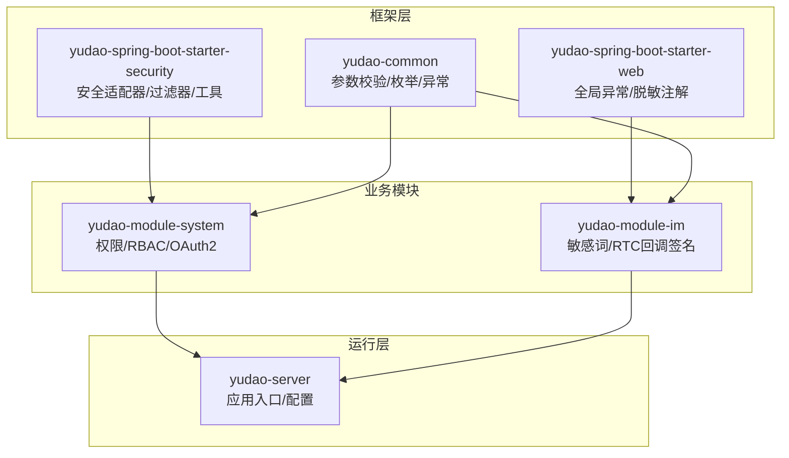
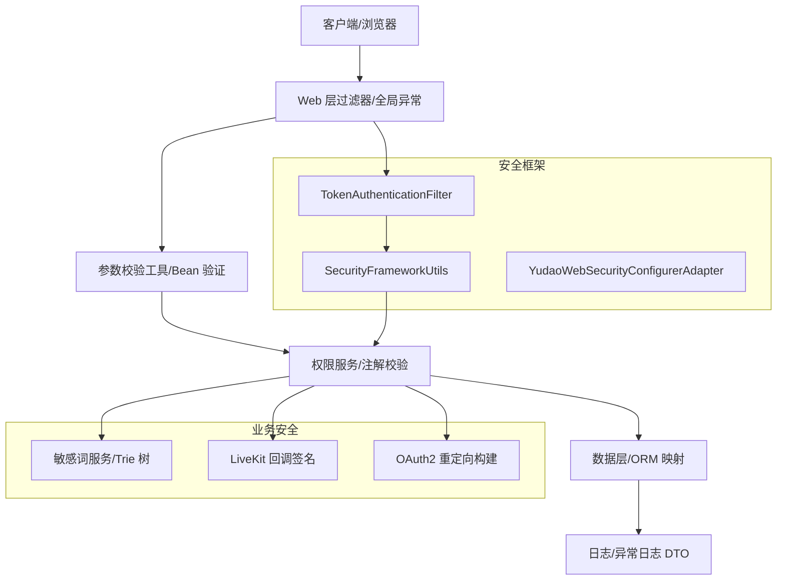
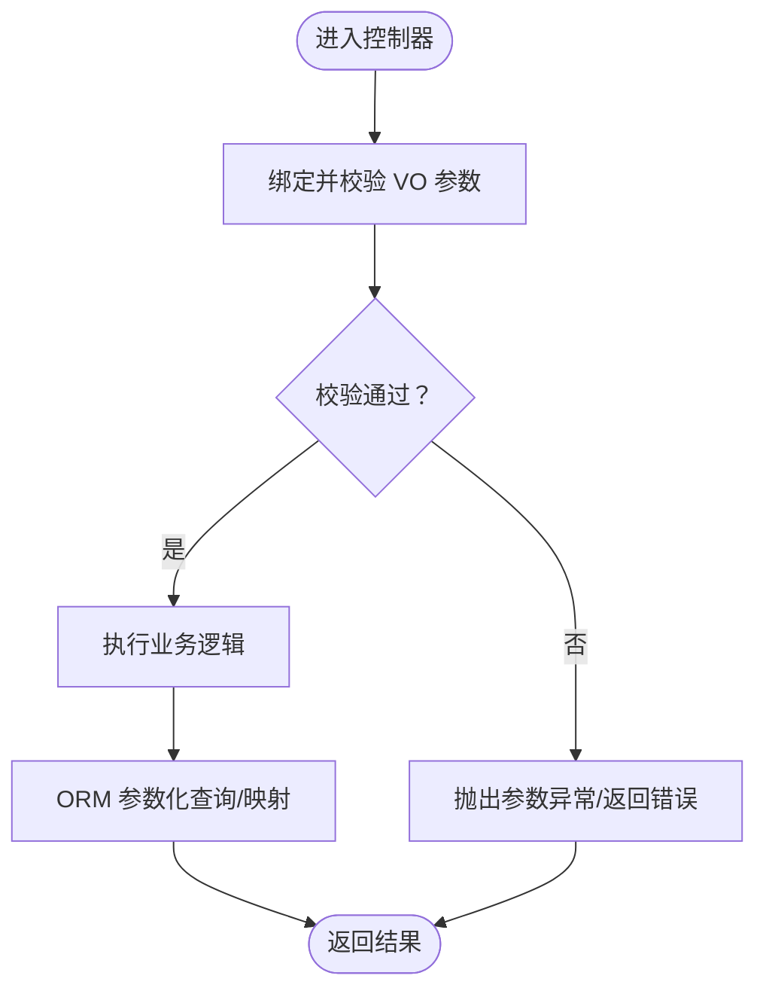
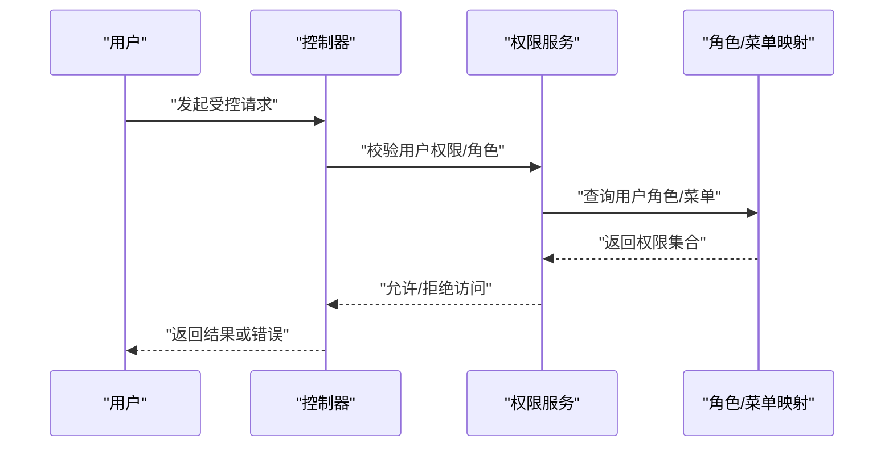
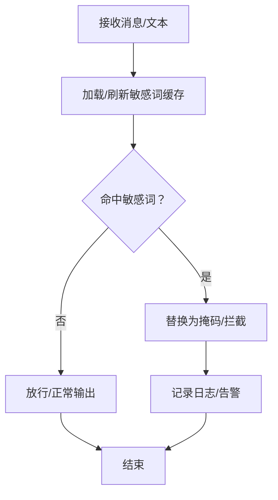
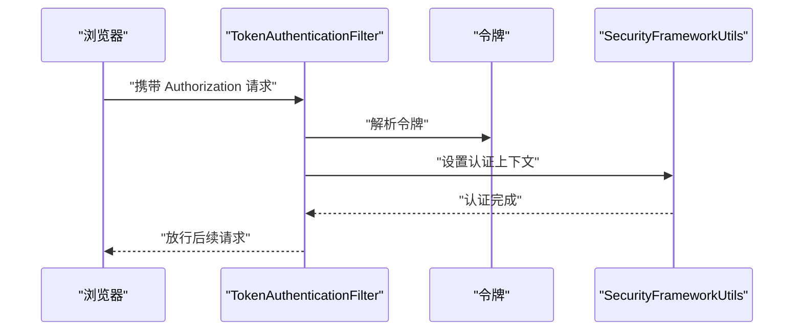
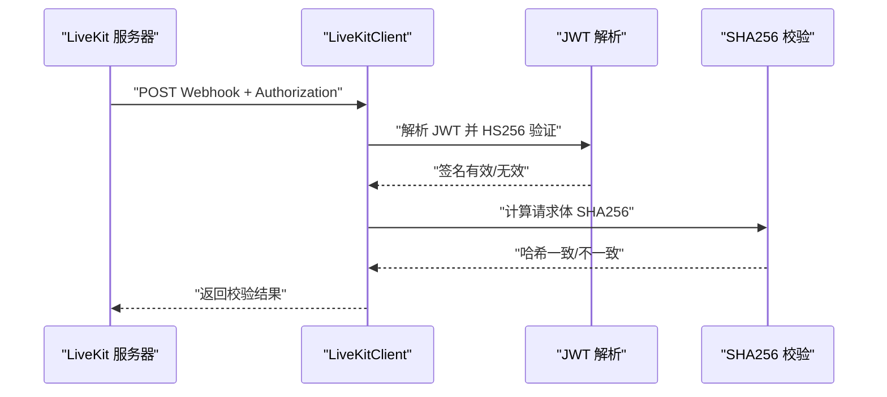
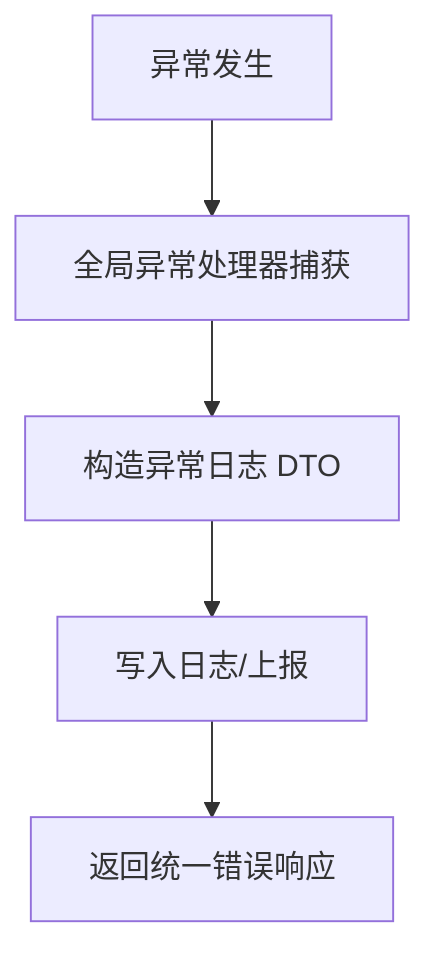
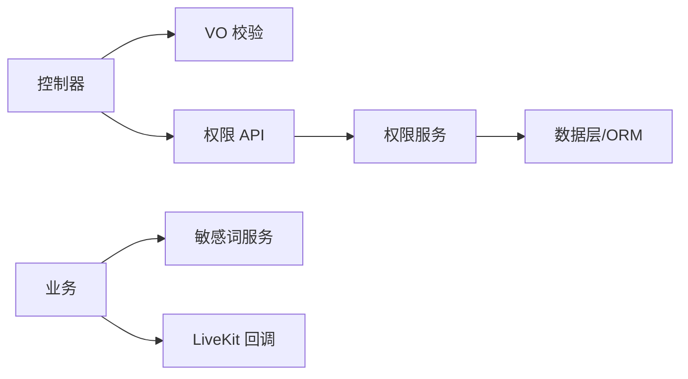

# 安全开发

<cite>
**本文引用的文件**
- [ValidationUtils.java](file://yudao-framework/yudao-common/src/main/java/cn/iocoder/yudao/framework/common/util/validation/ValidationUtils.java)
- [PermissionAssignUserRoleReqVO.java](file://yudao-module-system/src/main/java/cn/iocoder/yudao/module/system/controller/admin/permission/vo/permission/PermissionAssignUserRoleReqVO.java)
- [PermissionAssignRoleMenuReqVO.java](file://yudao-module-system/src/main/java/cn/iocoder/yudao/module/system/controller/admin/permission/vo/permission/PermissionAssignRoleMenuReqVO.java)
- [PermissionApiImpl.java](file://yudao-module-system/src/main/java/cn/iocoder/yudao/module/system/api/permission/PermissionApiImpl.java)
- [PermissionServiceImpl.java](file://yudao-module-system/src/main/java/cn/iocoder/yudao/module/system/service/permission/PermissionServiceImpl.java)
- [ImSensitiveWordServiceImpl.java](file://yudao-module-im/src/main/java/cn/iocoder/yudao/module/im/service/sensitiveword/ImSensitiveWordServiceImpl.java)
- [LiveKitClient.java](file://yudao-module-im/src/main/java/cn/iocoder/yudao/module/im/framework/rtc/core/LiveKitClient.java)
- [YudaoWebSecurityConfigurerAdapter.java](file://yudao-framework/yudao-spring-boot-starter-security/src/main/java/cn/iocoder/yudao/framework/security/config/YudaoWebSecurityConfigurerAdapter.java)
- [SecurityFrameworkUtils.java](file://yudao-framework/yudao-spring-boot-starter-security/src/main/java/cn/iocoder/yudao/framework/security/core/util/SecurityFrameworkUtils.java)
- [TokenAuthenticationFilter.java](file://yudao-framework/yudao-spring-boot-starter-security/src/main/java/cn/iocoder/yudao/framework/security/core/filter/TokenAuthenticationFilter.java)
- [GlobalExceptionHandler.java](file://yudao-framework/yudao-spring-boot-starter-web/src/main/java/cn/iocoder/yudao/framework/web/core/handler/GlobalExceptionHandler.java)
- [ApiErrorLogCreateReqDTO.java](file://yudao-framework/yudao-common/src/main/java/cn/iocoder/yudao/framework/common/biz/infra/logger/dto/ApiErrorLogCreateReqDTO.java)
- [OAuth2Utils.java](file://yudao-module-system/src/main/java/cn/iocoder/yudao/module/system/util/oauth2/OAuth2Utils.java)
- [application.yaml](file://yudao-server/src/main/resources/application.yaml)
</cite>

## 目录
1. [简介](#简介)
2. [项目结构](#项目结构)
3. [核心组件](#核心组件)
4. [架构总览](#架构总览)
5. [详细组件分析](#详细组件分析)
6. [依赖分析](#依赖分析)
7. [性能考虑](#性能考虑)
8. [故障排查指南](#故障排查指南)
9. [结论](#结论)
10. [附录](#附录)

## 简介
本指南面向“芋道 ruoyi-vue-pro”项目的后端与前端安全开发，聚焦以下方面：
- 输入验证与数据校验：参数校验规则、正则表达式、Bean 验证器使用
- SQL 注入防护：ORM 映射、参数化查询、动态数据源隔离
- XSS 攻击防范：前后端输出编码、富文本白名单、敏感词过滤
- CSRF 保护机制：Spring Security 配置、跨站请求校验
- 权限控制设计：RBAC、权限注解、动态权限、权限继承
- 数据脱敏策略：敏感字段标注、滑动脱敏、密码与密钥处理
- 加密与传输安全：HTTPS、安全响应头、会话与令牌安全
- 第三方集成安全：API 密钥管理、签名验证、回调安全、数据同步安全
- 安全审计与监控：操作日志、异常日志、安全事件监控与报告

## 项目结构
本项目采用多模块分层架构，安全相关能力主要分布在如下模块：
- yudao-framework：通用安全框架、Web 处理、脱敏、IP/租户等基础能力
- yudao-module-system：系统管理、权限体系、OAuth2 工具
- yudao-module-im：即时通讯、敏感词过滤、RTC 回调签名
- yudao-server：应用入口与全局配置

图示来源
- [YudaoWebSecurityConfigurerAdapter.java:1-200](file://yudao-framework/yudao-spring-boot-starter-security/src/main/java/cn/iocoder/yudao/framework/security/config/YudaoWebSecurityConfigurerAdapter.java#L1-L200)
- [PermissionApiImpl.java:1-42](file://yudao-module-system/src/main/java/cn/iocoder/yudao/module/system/api/permission/PermissionApiImpl.java#L1-L42)
- [ImSensitiveWordServiceImpl.java:1-207](file://yudao-module-im/src/main/java/cn/iocoder/yudao/module/im/service/sensitiveword/ImSensitiveWordServiceImpl.java#L1-L207)

章节来源
- [YudaoWebSecurityConfigurerAdapter.java:1-200](file://yudao-framework/yudao-spring-boot-starter-security/src/main/java/cn/iocoder/yudao/framework/security/config/YudaoWebSecurityConfigurerAdapter.java#L1-L200)
- [application.yaml:1-200](file://yudao-server/src/main/resources/application.yaml#L1-L200)

## 核心组件
- 输入验证与数据校验
  - 正则校验工具：手机号、URL、XML NCName 等
  - Bean 验证器：在 VO 层使用注解进行必填、格式、范围校验
- 权限控制与 RBAC
  - 用户-角色-菜单三层映射，支持动态权限与数据权限
  - 权限 API 封装对外接口
- 敏感词与脱敏
  - 敏感词 Trie 树匹配与缓存刷新
  - 脱敏注解：手机号、身份证、银行卡、邮箱、中文名等
- 传输与令牌安全
  - Spring Security 适配器、Token 过滤器、安全工具类
  - OAuth2 重定向构建工具
- 第三方集成安全
  - LiveKit Webhook 签名验证与管理 Token 签发
- 安全审计
  - 全局异常处理器与异常日志 DTO 结构

章节来源
- [ValidationUtils.java:1-40](file://yudao-framework/yudao-common/src/main/java/cn/iocoder/yudao/framework/common/util/validation/ValidationUtils.java#L1-L40)
- [PermissionAssignUserRoleReqVO.java:1-21](file://yudao-module-system/src/main/java/cn/iocoder/yudao/module/system/controller/admin/permission/vo/permission/PermissionAssignUserRoleReqVO.java#L1-L21)
- [PermissionAssignRoleMenuReqVO.java:1-21](file://yudao-module-system/src/main/java/cn/iocoder/yudao/module/system/controller/admin/permission/vo/permission/PermissionAssignRoleMenuReqVO.java#L1-L21)
- [PermissionApiImpl.java:1-42](file://yudao-module-system/src/main/java/cn/iocoder/yudao/module/system/api/permission/PermissionApiImpl.java#L1-L42)
- [ImSensitiveWordServiceImpl.java:1-207](file://yudao-module-im/src/main/java/cn/iocoder/yudao/module/im/service/sensitiveword/ImSensitiveWordServiceImpl.java#L1-L207)
- [LiveKitClient.java:169-224](file://yudao-module-im/src/main/java/cn/iocoder/yudao/module/im/framework/rtc/core/LiveKitClient.java#L169-L224)
- [YudaoWebSecurityConfigurerAdapter.java:1-200](file://yudao-framework/yudao-spring-boot-starter-security/src/main/java/cn/iocoder/yudao/framework/security/config/YudaoWebSecurityConfigurerAdapter.java#L1-L200)
- [GlobalExceptionHandler.java:1-200](file://yudao-framework/yudao-spring-boot-starter-web/src/main/java/cn/iocoder/yudao/framework/web/core/handler/GlobalExceptionHandler.java#L1-L200)
- [ApiErrorLogCreateReqDTO.java:60-107](file://yudao-framework/yudao-common/src/main/java/cn/iocoder/yudao/framework/common/biz/infra/logger/dto/ApiErrorLogCreateReqDTO.java#L60-L107)
- [OAuth2Utils.java:1-68](file://yudao-module-system/src/main/java/cn/iocoder/yudao/module/system/util/oauth2/OAuth2Utils.java#L1-L68)

## 架构总览
整体安全架构围绕“输入校验—权限控制—敏感处理—传输加密—审计监控”展开。

图示来源
- [TokenAuthenticationFilter.java:1-200](file://yudao-framework/yudao-spring-boot-starter-security/src/main/java/cn/iocoder/yudao/framework/security/core/filter/TokenAuthenticationFilter.java#L1-L200)
- [SecurityFrameworkUtils.java:1-200](file://yudao-framework/yudao-spring-boot-starter-security/src/main/java/cn/iocoder/yudao/framework/security/core/util/SecurityFrameworkUtils.java#L1-L200)
- [YudaoWebSecurityConfigurerAdapter.java:1-200](file://yudao-framework/yudao-spring-boot-starter-security/src/main/java/cn/iocoder/yudao/framework/security/config/YudaoWebSecurityConfigurerAdapter.java#L1-L200)
- [ImSensitiveWordServiceImpl.java:1-207](file://yudao-module-im/src/main/java/cn/iocoder/yudao/module/im/service/sensitiveword/ImSensitiveWordServiceImpl.java#L1-L207)
- [LiveKitClient.java:169-224](file://yudao-module-im/src/main/java/cn/iocoder/yudao/module/im/framework/rtc/core/LiveKitClient.java#L169-L224)
- [OAuth2Utils.java:1-68](file://yudao-module-system/src/main/java/cn/iocoder/yudao/module/system/util/oauth2/OAuth2Utils.java#L1-L68)

## 详细组件分析

### 输入验证与数据校验
- 正则校验工具
  - 提供手机号、URL、XML NCName 的正则匹配方法，便于统一校验
- Bean 验证器
  - 在 VO 中使用注解约束必填、格式、集合等，结合全局异常处理统一返回错误
- SQL 注入防护
  - 使用 ORM 映射与参数化查询，避免原生 SQL 拼接
  - 动态数据源隔离，降低跨库风险

图示来源
- [ValidationUtils.java:1-40](file://yudao-framework/yudao-common/src/main/java/cn/iocoder/yudao/framework/common/util/validation/ValidationUtils.java#L1-L40)
- [PermissionAssignUserRoleReqVO.java:1-21](file://yudao-module-system/src/main/java/cn/iocoder/yudao/module/system/controller/admin/permission/vo/permission/PermissionAssignUserRoleReqVO.java#L1-L21)
- [PermissionAssignRoleMenuReqVO.java:1-21](file://yudao-module-system/src/main/java/cn/iocoder/yudao/module/system/controller/admin/permission/vo/permission/PermissionAssignRoleMenuReqVO.java#L1-L21)

章节来源
- [ValidationUtils.java:1-40](file://yudao-framework/yudao-common/src/main/java/cn/iocoder/yudao/framework/common/util/validation/ValidationUtils.java#L1-L40)
- [PermissionAssignUserRoleReqVO.java:1-21](file://yudao-module-system/src/main/java/cn/iocoder/yudao/module/system/controller/admin/permission/vo/permission/PermissionAssignUserRoleReqVO.java#L1-L21)
- [PermissionAssignRoleMenuReqVO.java:1-21](file://yudao-module-system/src/main/java/cn/iocoder/yudao/module/system/controller/admin/permission/vo/permission/PermissionAssignRoleMenuReqVO.java#L1-L21)

### 权限控制设计（RBAC）
- 用户-角色-菜单映射与动态权限
  - 通过用户角色与角色菜单关联，支持动态赋权与数据权限
  - 权限 API 封装对外查询接口，如获取用户角色集合、部门数据权限等
- 权限注解与继承
  - 服务层可使用注解声明权限范围，结合上下文判断是否具备某权限或角色
- OAuth2 流程
  - 提供授权码/简化模式重定向 URI 构建工具，确保状态与范围正确传递

图示来源
- [PermissionApiImpl.java:1-42](file://yudao-module-system/src/main/java/cn/iocoder/yudao/module/system/api/permission/PermissionApiImpl.java#L1-L42)
- [PermissionServiceImpl.java:1-25](file://yudao-module-system/src/main/java/cn/iocoder/yudao/module/system/service/permission/PermissionServiceImpl.java#L1-L25)
- [OAuth2Utils.java:1-68](file://yudao-module-system/src/main/java/cn/iocoder/yudao/module/system/util/oauth2/OAuth2Utils.java#L1-L68)

章节来源
- [PermissionApiImpl.java:1-42](file://yudao-module-system/src/main/java/cn/iocoder/yudao/module/system/api/permission/PermissionApiImpl.java#L1-L42)
- [PermissionServiceImpl.java:1-25](file://yudao-module-system/src/main/java/cn/iocoder/yudao/module/system/service/permission/PermissionServiceImpl.java#L1-L25)
- [OAuth2Utils.java:1-68](file://yudao-module-system/src/main/java/cn/iocoder/yudao/module/system/util/oauth2/OAuth2Utils.java#L1-L68)

### 数据脱敏策略
- 敏感词过滤
  - 基于 Trie 树的敏感词匹配，支持缓存与定时刷新，避免频繁重建
  - 提供新增、更新、删除与批量删除接口，变更后立即失效缓存
- 脱敏注解
  - 提供手机号、身份证、银行卡、固定电话、邮箱、中文名、密码等脱敏注解
  - 输出序列化时自动应用脱敏策略，避免敏感信息泄露

图示来源
- [ImSensitiveWordServiceImpl.java:1-207](file://yudao-module-im/src/main/java/cn/iocoder/yudao/module/im/service/sensitiveword/ImSensitiveWordServiceImpl.java#L1-L207)

章节来源
- [ImSensitiveWordServiceImpl.java:1-207](file://yudao-module-im/src/main/java/cn/iocoder/yudao/module/im/service/sensitiveword/ImSensitiveWordServiceImpl.java#L1-L207)

### 传输与令牌安全
- Spring Security 集成
  - 通过适配器配置受保护资源、登录入口、鉴权失败处理
  - Token 过滤器从请求中提取令牌并注入认证上下文
  - 安全工具类提供认证上下文读取、令牌类型常量等
- OAuth2 重定向
  - 构建授权码与简化模式重定向 URI，包含状态、过期时间、作用域与附加信息

图示来源
- [YudaoWebSecurityConfigurerAdapter.java:1-200](file://yudao-framework/yudao-spring-boot-starter-security/src/main/java/cn/iocoder/yudao/framework/security/config/YudaoWebSecurityConfigurerAdapter.java#L1-L200)
- [TokenAuthenticationFilter.java:1-200](file://yudao-framework/yudao-spring-boot-starter-security/src/main/java/cn/iocoder/yudao/framework/security/core/filter/TokenAuthenticationFilter.java#L1-L200)
- [SecurityFrameworkUtils.java:1-200](file://yudao-framework/yudao-spring-boot-starter-security/src/main/java/cn/iocoder/yudao/framework/security/core/util/SecurityFrameworkUtils.java#L1-L200)
- [OAuth2Utils.java:1-68](file://yudao-module-system/src/main/java/cn/iocoder/yudao/module/system/util/oauth2/OAuth2Utils.java#L1-L68)

章节来源
- [YudaoWebSecurityConfigurerAdapter.java:1-200](file://yudao-framework/yudao-spring-boot-starter-security/src/main/java/cn/iocoder/yudao/framework/security/config/YudaoWebSecurityConfigurerAdapter.java#L1-L200)
- [TokenAuthenticationFilter.java:1-200](file://yudao-framework/yudao-spring-boot-starter-security/src/main/java/cn/iocoder/yudao/framework/security/core/filter/TokenAuthenticationFilter.java#L1-L200)
- [SecurityFrameworkUtils.java:1-200](file://yudao-framework/yudao-spring-boot-starter-security/src/main/java/cn/iocoder/yudao/framework/security/core/util/SecurityFrameworkUtils.java#L1-L200)
- [OAuth2Utils.java:1-68](file://yudao-module-system/src/main/java/cn/iocoder/yudao/module/system/util/oauth2/OAuth2Utils.java#L1-L68)

### 第三方集成安全
- LiveKit 回调签名验证
  - 使用 HS256 对 JWT 进行签名验证，并校验请求体 SHA256 一致性
  - 仅在签名与哈希均通过时接受回调，防止伪造与篡改
- 管理 Token 签发
  - 为管理类 API（如删除房间、列出参与者）签发带有效期的管理员令牌

图示来源
- [LiveKitClient.java:169-224](file://yudao-module-im/src/main/java/cn/iocoder/yudao/module/im/framework/rtc/core/LiveKitClient.java#L169-L224)

章节来源
- [LiveKitClient.java:169-224](file://yudao-module-im/src/main/java/cn/iocoder/yudao/module/im/framework/rtc/core/LiveKitClient.java#L169-L224)

### 安全审计与监控
- 全局异常处理
  - 统一捕获业务异常与系统异常，构造标准化错误响应
- 异常日志 DTO
  - 记录异常时间、类名、方法、行号、堆栈、根因等关键信息
- 操作日志
  - 通过操作日志模块记录用户关键操作，便于事后审计与追踪

图示来源
- [GlobalExceptionHandler.java:1-200](file://yudao-framework/yudao-spring-boot-starter-web/src/main/java/cn/iocoder/yudao/framework/web/core/handler/GlobalExceptionHandler.java#L1-L200)
- [ApiErrorLogCreateReqDTO.java:60-107](file://yudao-framework/yudao-common/src/main/java/cn/iocoder/yudao/framework/common/biz/infra/logger/dto/ApiErrorLogCreateReqDTO.java#L60-L107)

章节来源
- [GlobalExceptionHandler.java:1-200](file://yudao-framework/yudao-spring-boot-starter-web/src/main/java/cn/iocoder/yudao/framework/web/core/handler/GlobalExceptionHandler.java#L1-L200)
- [ApiErrorLogCreateReqDTO.java:60-107](file://yudao-framework/yudao-common/src/main/java/cn/iocoder/yudao/framework/common/biz/infra/logger/dto/ApiErrorLogCreateReqDTO.java#L60-L107)

## 依赖分析
- 组件耦合
  - 控制器依赖 VO 校验与权限 API；权限 API 依赖权限服务；权限服务依赖数据层与 Redis 缓存
  - 脱敏服务与敏感词服务相互独立，通过业务调用集成
- 外部依赖
  - Spring Security、MyBatis Plus、Guava Cache、Hutool、JWT 等
- 潜在风险
  - 避免在控制器直接拼接 SQL；确保权限注解覆盖关键接口；严格校验第三方回调签名

图示来源
- [PermissionApiImpl.java:1-42](file://yudao-module-system/src/main/java/cn/iocoder/yudao/module/system/api/permission/PermissionApiImpl.java#L1-L42)
- [PermissionServiceImpl.java:1-25](file://yudao-module-system/src/main/java/cn/iocoder/yudao/module/system/service/permission/PermissionServiceImpl.java#L1-L25)
- [ImSensitiveWordServiceImpl.java:1-207](file://yudao-module-im/src/main/java/cn/iocoder/yudao/module/im/service/sensitiveword/ImSensitiveWordServiceImpl.java#L1-L207)
- [LiveKitClient.java:169-224](file://yudao-module-im/src/main/java/cn/iocoder/yudao/module/im/framework/rtc/core/LiveKitClient.java#L169-L224)

章节来源
- [PermissionApiImpl.java:1-42](file://yudao-module-system/src/main/java/cn/iocoder/yudao/module/system/api/permission/PermissionApiImpl.java#L1-L42)
- [PermissionServiceImpl.java:1-25](file://yudao-module-system/src/main/java/cn/iocoder/yudao/module/system/service/permission/PermissionServiceImpl.java#L1-L25)
- [ImSensitiveWordServiceImpl.java:1-207](file://yudao-module-im/src/main/java/cn/iocoder/yudao/module/im/service/sensitiveword/ImSensitiveWordServiceImpl.java#L1-L207)
- [LiveKitClient.java:169-224](file://yudao-module-im/src/main/java/cn/iocoder/yudao/module/im/framework/rtc/core/LiveKitClient.java#L169-L224)

## 性能考虑
- 缓存与异步刷新
  - 敏感词服务采用本地缓存与异步刷新，减少重复构建开销
- ORM 与参数化
  - 使用 ORM 与参数化查询，避免字符串拼接带来的性能与安全问题
- 过滤器链路
  - 将轻量校验前置，复杂权限校验在必要时进行，降低不必要的计算

## 故障排查指南
- 参数校验失败
  - 检查 VO 注解与正则工具是否匹配；确认全局异常处理器已捕获并返回
- 权限拒绝
  - 核对用户角色与菜单映射；检查权限注解是否生效；确认上下文是否正确注入
- 敏感词误判
  - 查看缓存是否及时失效；核对敏感词库是否最新；检查 Trie 树构建逻辑
- 回调签名失败
  - 确认 Authorization 头是否包含 Bearer；核对 API Secret；检查请求体 SHA256 计算
- 日志缺失
  - 检查异常日志 DTO 字段是否完整；确认日志输出级别与采集通道

章节来源
- [ValidationUtils.java:1-40](file://yudao-framework/yudao-common/src/main/java/cn/iocoder/yudao/framework/common/util/validation/ValidationUtils.java#L1-L40)
- [PermissionApiImpl.java:1-42](file://yudao-module-system/src/main/java/cn/iocoder/yudao/module/system/api/permission/PermissionApiImpl.java#L1-L42)
- [ImSensitiveWordServiceImpl.java:1-207](file://yudao-module-im/src/main/java/cn/iocoder/yudao/module/im/service/sensitiveword/ImSensitiveWordServiceImpl.java#L1-L207)
- [LiveKitClient.java:169-224](file://yudao-module-im/src/main/java/cn/iocoder/yudao/module/im/framework/rtc/core/LiveKitClient.java#L169-L224)
- [ApiErrorLogCreateReqDTO.java:60-107](file://yudao-framework/yudao-common/src/main/java/cn/iocoder/yudao/framework/common/biz/infra/logger/dto/ApiErrorLogCreateReqDTO.java#L60-L107)

## 结论
本指南梳理了 ruoyi-vue-pro 在输入校验、权限控制、敏感处理、传输安全、第三方集成与安全审计方面的实现与最佳实践。建议在实际开发中：
- 严格遵循 VO 注解与正则校验
- 使用 ORM 与参数化查询，避免 SQL 注入
- 以 RBAC 为核心设计权限模型，配合动态权限与数据权限
- 对敏感信息进行脱敏与最小化暴露
- 强化传输安全与回调签名，完善安全审计与监控

## 附录
- HTTPS 与安全头
  - 在应用配置中启用 HTTPS 与安全响应头（如 HSTS、CSP、X-Content-Type-Options、X-Frame-Options 等）
- 会话与令牌
  - 设置安全 Cookie 属性（HttpOnly、Secure、SameSite）、令牌有效期与刷新策略
- CSRF 保护
  - Spring Security 默认启用 CSRF，确保前端正确携带令牌或使用 SameSite 策略

章节来源
- [application.yaml:1-200](file://yudao-server/src/main/resources/application.yaml#L1-L200)