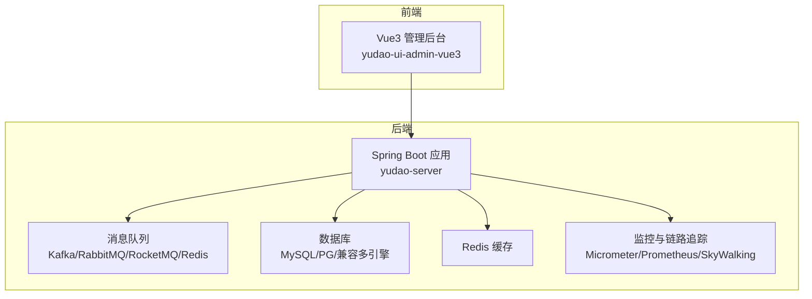
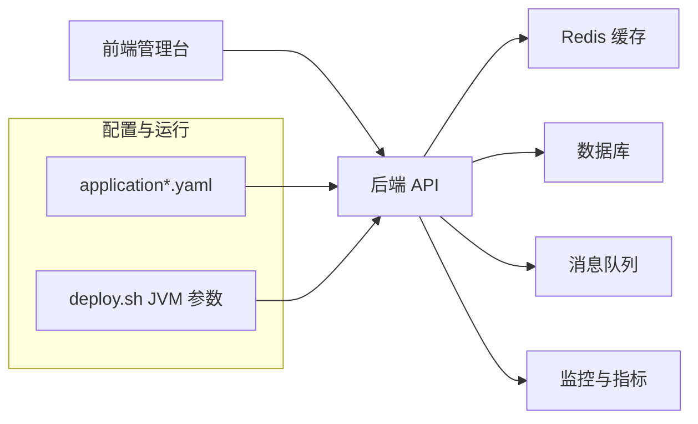
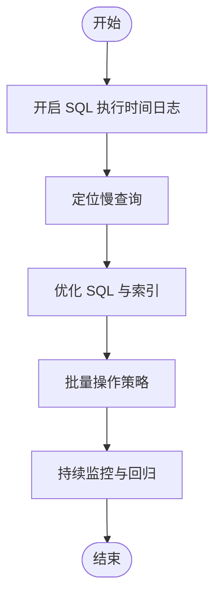
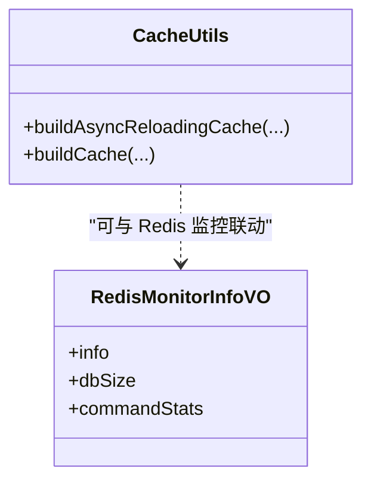
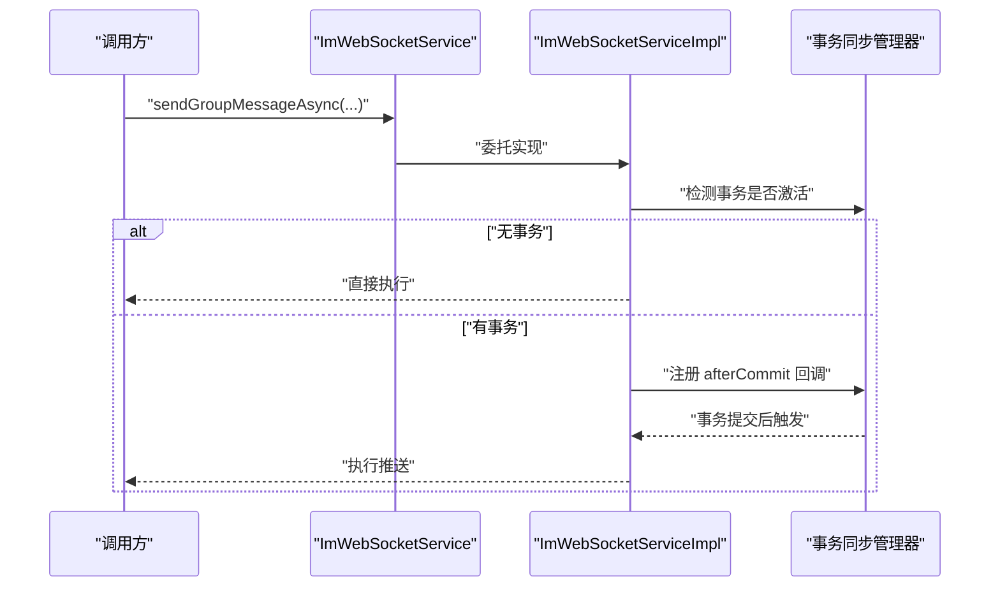
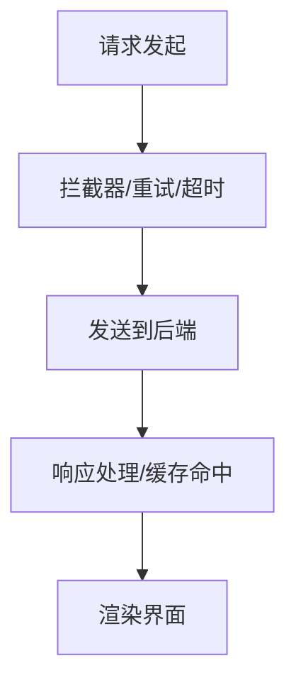
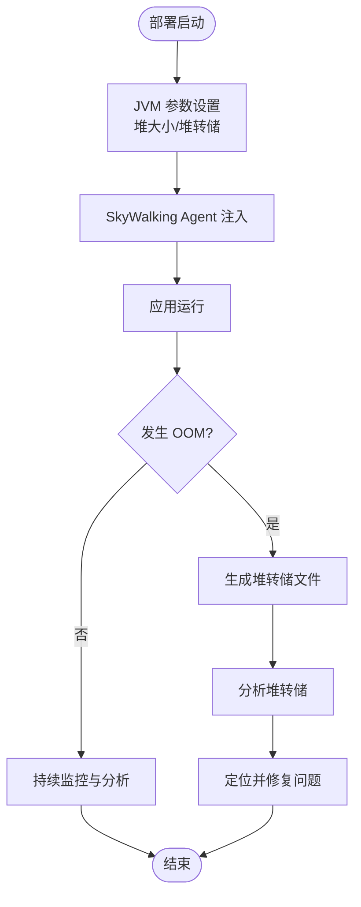
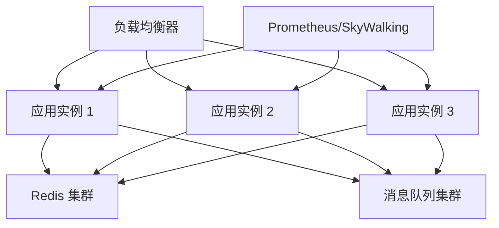
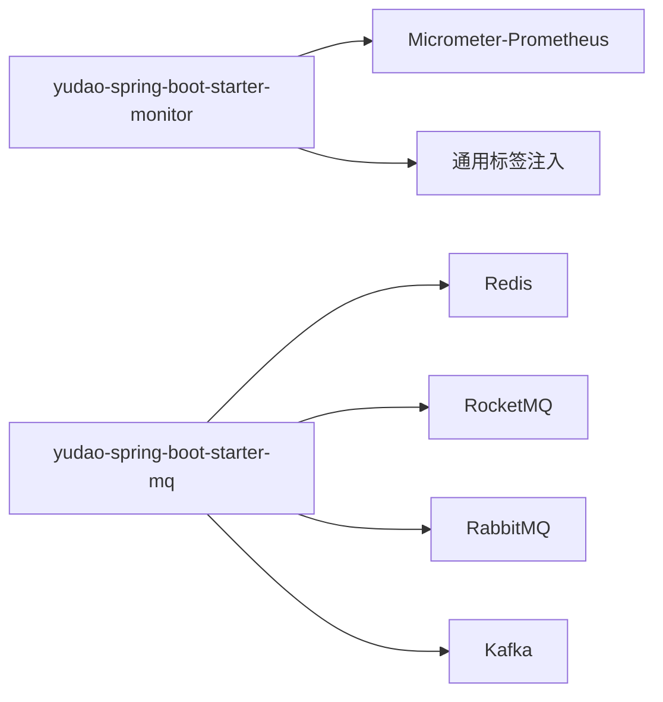

# 性能优化

<cite>
**本文引用的文件**   
- [application.yaml](file://yudao-server/src/main/resources/application.yaml)
- [application-dev.yaml](file://yudao-server/src/main/resources/application-dev.yaml)
- [application-local.yaml](file://yudao-server/src/main/resources/application-local.yaml)
- [deploy.sh](file://script/shell/deploy.sh)
- [YudaoMetricsAutoConfiguration.java](file://yudao-framework/yudao-spring-boot-starter-monitor/src/main/java/cn/iocoder/yudao/framework/tracer/config/YudaoMetricsAutoConfiguration.java)
- [pom.xml（监控模块）](file://yudao-framework/yudao-spring-boot-starter-monitor/pom.xml)
- [CacheUtils.java](file://yudao-framework/yudao-common/src/main/java/cn/iocoder/yudao/framework/common/util/cache/CacheUtils.java)
- [ImWebSocketService.java](file://yudao-module-im/src/main/java/cn/iocoder/yudao/module/im/service/websocket/ImWebSocketService.java)
- [ImWebSocketServiceImpl.java](file://yudao-module-im/src/main/java/cn/iocoder/yudao/module/im/service/websocket/ImWebSocketServiceImpl.java)
- [ImWebSocketServiceImplTest.java](file://yudao-module-im/src/test/java/cn/iocoder/yudao/module/im/service/websocket/ImWebSocketServiceImplTest.java)
- [types.ts（Redis 监控）](file://yudao-ui/yudao-ui-admin-vue3/src/api/infra/redis/types.ts)
- [index.ts（前端 Axios 配置）](file://yudao-ui/yudao-ui-admin-vue3/src/config/axios/index.ts)
- [pom.xml（消息队列 Starter）](file://yudao-framework/yudao-spring-boot-starter-mq/pom.xml)
- [README.md（项目总览）](file://README.md)
- [README.md（前端 README）](file://yudao-ui/yudao-ui-admin-vue3/README.md)
</cite>

## 目录
1. [简介](#简介)
2. [项目结构](#项目结构)
3. [核心组件](#核心组件)
4. [架构总览](#架构总览)
5. [详细组件分析](#详细组件分析)
6. [依赖分析](#依赖分析)
7. [性能考虑](#性能考虑)
8. [故障排查指南](#故障排查指南)
9. [结论](#结论)
10. [附录](#附录)

## 简介
本指南面向芋道 ruoyi-vue-pro 项目的性能优化实践，围绕数据库查询优化、缓存策略设计、异步处理优化、前端性能优化、JVM 性能调优以及负载均衡与高可用设计展开。内容基于仓库现有配置与代码实现，结合最佳实践给出可落地的优化建议与可视化图示。

## 项目结构
ruoyi-vue-pro 采用前后端分离架构，后端由 yudao-server 提供 Spring Boot 服务，前端为 Vue3 管理后台。框架层提供 MyBatis、Redis、消息队列、定时任务、监控等能力，模块按业务域拆分，便于扩展与性能治理。

[本图为概念性结构示意，不直接映射具体源码文件，故不附“图表来源”]

## 核心组件
- 后端配置与运行
  - 应用配置集中于 application.yaml 及其环境配置文件，覆盖 Redis、消息队列、Actuator 等关键开关。
  - 部署脚本 deploy.sh 提供 JVM 参数与堆转储路径配置，便于 OOM 诊断与性能回归。
- 缓存与本地缓存
  - CacheUtils 提供基于 Guava 的 LoadingCache 构建，支持同步/异步刷新与最大容量限制，适合热点数据的本地缓存。
- 异步与事务感知推送
  - IM WebSocket 服务定义了异步推送接口，并在实现中通过事务同步机制确保消息推送发生在事务提交之后，避免脏读。
- 监控与指标
  - YudaoMetricsAutoConfiguration 注入通用标签，pom 中引入 Micrometer Prometheus 适配，便于集成监控体系。
- 前端网络与配置
  - 前端 Axios 配置文件提供统一请求封装，便于后续接入超时、重试、拦截器等优化策略。
- Redis 监控模型
  - 前端 Redis 监控接口定义了 Redis 监控信息的数据结构，可用于前端展示与告警。

**章节来源**
- [application.yaml:90-101](file://yudao-server/src/main/resources/application.yaml#L90-L101)
- [application-dev.yaml:90-130](file://yudao-server/src/main/resources/application-dev.yaml#L90-L130)
- [application-local.yaml:65-90](file://yudao-server/src/main/resources/application-local.yaml#L65-L90)
- [deploy.sh:19-39](file://script/shell/deploy.sh#L19-L39)
- [CacheUtils.java:15-61](file://yudao-framework/yudao-common/src/main/java/cn/iocoder/yudao/framework/common/util/cache/CacheUtils.java#L15-L61)
- [ImWebSocketService.java:39-82](file://yudao-module-im/src/main/java/cn/iocoder/yudao/module/im/service/websocket/ImWebSocketService.java#L39-L82)
- [ImWebSocketServiceImpl.java:119-154](file://yudao-module-im/src/main/java/cn/iocoder/yudao/module/im/service/websocket/ImWebSocketServiceImpl.java#L119-L154)
- [YudaoMetricsAutoConfiguration.java:16-27](file://yudao-framework/yudao-spring-boot-starter-monitor/src/main/java/cn/iocoder/yudao/framework/tracer/config/YudaoMetricsAutoConfiguration.java#L16-L27)
- [pom.xml（监控模块）:65-70](file://yudao-framework/yudao-spring-boot-starter-monitor/pom.xml#L65-L70)
- [types.ts（Redis 监控）:1-176](file://yudao-ui/yudao-ui-admin-vue3/src/api/infra/redis/types.ts#L1-L176)
- [index.ts（前端 Axios 配置）](file://yudao-ui/yudao-ui-admin-vue3/src/config/axios/index.ts)

## 架构总览
后端应用通过统一配置启用 Redis、消息队列与 Actuator 等能力；IM 模块提供事务感知的异步推送；前端通过 Axios 统一发起请求；监控模块注入通用标签并可对接 Prometheus。

**图表来源**
- [application.yaml:90-101](file://yudao-server/src/main/resources/application.yaml#L90-L101)
- [application-dev.yaml:90-130](file://yudao-server/src/main/resources/application-dev.yaml#L90-L130)
- [application-local.yaml:65-90](file://yudao-server/src/main/resources/application-local.yaml#L65-L90)
- [deploy.sh:19-39](file://script/shell/deploy.sh#L19-L39)

**章节来源**
- [application.yaml:90-101](file://yudao-server/src/main/resources/application.yaml#L90-L101)
- [application-dev.yaml:90-130](file://yudao-server/src/main/resources/application-dev.yaml#L90-L130)
- [application-local.yaml:65-90](file://yudao-server/src/main/resources/application-local.yaml#L65-L90)
- [deploy.sh:19-39](file://script/shell/deploy.sh#L19-L39)

## 详细组件分析

### 数据库查询优化
- SQL 执行时间记录
  - 配置项 enableLogSqlExecutionTime 可开启 SQL 执行时间日志记录，便于定位慢查询。
- 连接池与懒加载
  - application-local.yaml 展示了从库的懒加载配置，有助于启动阶段减少不必要的连接初始化。
- 多数据源与读写分离
  - 框架模块提供多数据源与读写分离入门文档，建议在高并发场景下按需启用并配合连接池参数优化。

**图表来源**
- [application-dev.yaml:90-130](file://yudao-server/src/main/resources/application-dev.yaml#L90-L130)

**章节来源**
- [application-dev.yaml:90-130](file://yudao-server/src/main/resources/application-dev.yaml#L90-L130)

### 缓存策略设计
- 本地缓存
  - CacheUtils 提供基于 Guava 的 LoadingCache，支持异步刷新与最大容量限制，适合热点数据的低延迟访问。
- Redis 缓存
  - application-local.yaml 提供 Redis 连接配置示例；前端 types.ts 定义了 Redis 监控信息结构，可用于前端展示与告警。
- 缓存一致性
  - 建议结合分布式锁与版本号/时间戳策略，确保缓存更新与失效顺序一致；对热点键设置合理 TTL 并开启过期主动清理。

**图表来源**
- [CacheUtils.java:15-61](file://yudao-framework/yudao-common/src/main/java/cn/iocoder/yudao/framework/common/util/cache/CacheUtils.java#L15-L61)
- [types.ts（Redis 监控）:1-176](file://yudao-ui/yudao-ui-admin-vue3/src/api/infra/redis/types.ts#L1-L176)

**章节来源**
- [CacheUtils.java:15-61](file://yudao-framework/yudao-common/src/main/java/cn/iocoder/yudao/framework/common/util/cache/CacheUtils.java#L15-L61)
- [application-local.yaml:82-89](file://yudao-server/src/main/resources/application-local.yaml#L82-L89)
- [types.ts（Redis 监控）:1-176](file://yudao-ui/yudao-ui-admin-vue3/src/api/infra/redis/types.ts#L1-L176)

### 异步处理优化
- 异步接口与事务感知
  - ImWebSocketService 定义了异步推送接口；ImWebSocketServiceImpl 在事务提交后执行推送，避免脏读。
- 事务同步回调
  - 通过 TransactionSynchronizationManager 注册 afterCommit 回调，确保消息推送与数据库落盘一致。

**图表来源**
- [ImWebSocketService.java:39-82](file://yudao-module-im/src/main/java/cn/iocoder/yudao/module/im/service/websocket/ImWebSocketService.java#L39-L82)
- [ImWebSocketServiceImpl.java:119-154](file://yudao-module-im/src/main/java/cn/iocoder/yudao/module/im/service/websocket/ImWebSocketServiceImpl.java#L119-L154)

**章节来源**
- [ImWebSocketService.java:39-82](file://yudao-module-im/src/main/java/cn/iocoder/yudao/module/im/service/websocket/ImWebSocketService.java#L39-L82)
- [ImWebSocketServiceImpl.java:119-154](file://yudao-module-im/src/main/java/cn/iocoder/yudao/module/im/service/websocket/ImWebSocketServiceImpl.java#L119-L154)
- [ImWebSocketServiceImplTest.java:67-97](file://yudao-module-im/src/test/java/cn/iocoder/yudao/module/im/service/websocket/ImWebSocketServiceImplTest.java#L67-L97)

### 前端性能优化
- 请求封装与拦截
  - 前端 Axios 配置文件提供统一请求入口，建议在此处增加超时、重试、错误码处理与拦截器，降低无效请求与重复请求。
- 资源与网络
  - 建议结合打包工具的代码分割、按需加载与资源压缩策略，减少首屏体积与请求数量。

**图表来源**
- [index.ts（前端 Axios 配置）](file://yudao-ui/yudao-ui-admin-vue3/src/config/axios/index.ts)

**章节来源**
- [index.ts（前端 Axios 配置）](file://yudao-ui/yudao-ui-admin-vue3/src/config/axios/index.ts)

### JVM 性能调优
- 内存与堆转储
  - deploy.sh 中设置了初始与最大堆大小，并开启 OOM 时堆转储，便于问题定位。
- SkyWalking Agent
  - 部署脚本预留了 SkyWalking Agent 的环境变量配置，可用于链路追踪与性能采样。

**图表来源**
- [deploy.sh:19-39](file://script/shell/deploy.sh#L19-L39)

**章节来源**
- [deploy.sh:19-39](file://script/shell/deploy.sh#L19-L39)

### 负载均衡与高可用设计
- 监控与可观测性
  - application-dev.yaml 开放 Actuator 所有端点，便于健康检查与运维；YudaoMetricsAutoConfiguration 注入通用标签，便于 Prometheus 抓取。
- 消息队列与异步解耦
  - yudao-spring-boot-starter-mq 支持多种消息中间件，建议在高并发场景下通过异步处理削峰填谷。

**图表来源**
- [application-dev.yaml:120-130](file://yudao-server/src/main/resources/application-dev.yaml#L120-L130)
- [YudaoMetricsAutoConfiguration.java:16-27](file://yudao-framework/yudao-spring-boot-starter-monitor/src/main/java/cn/iocoder/yudao/framework/tracer/config/YudaoMetricsAutoConfiguration.java#L16-L27)
- [pom.xml（监控模块）:65-70](file://yudao-framework/yudao-spring-boot-starter-monitor/pom.xml#L65-L70)
- [pom.xml（消息队列 Starter）:18-41](file://yudao-framework/yudao-spring-boot-starter-mq/pom.xml#L18-L41)

**章节来源**
- [application-dev.yaml:120-130](file://yudao-server/src/main/resources/application-dev.yaml#L120-L130)
- [YudaoMetricsAutoConfiguration.java:16-27](file://yudao-framework/yudao-spring-boot-starter-monitor/src/main/java/cn/iocoder/yudao/framework/tracer/config/YudaoMetricsAutoConfiguration.java#L16-L27)
- [pom.xml（监控模块）:65-70](file://yudao-framework/yudao-spring-boot-starter-monitor/pom.xml#L65-L70)
- [pom.xml（消息队列 Starter）:18-41](file://yudao-framework/yudao-spring-boot-starter-mq/pom.xml#L18-L41)

## 依赖分析
- 监控与指标
  - 引入 Micrometer Prometheus 适配，结合通用标签注入，便于统一采集与展示。
- 消息队列
  - Starter 提供对 Redis、RocketMQ、RabbitMQ、Kafka 的可选依赖，按需启用以减少运行时依赖。

**图表来源**
- [pom.xml（监控模块）:65-70](file://yudao-framework/yudao-spring-boot-starter-monitor/pom.xml#L65-L70)
- [pom.xml（消息队列 Starter）:18-41](file://yudao-framework/yudao-spring-boot-starter-mq/pom.xml#L18-L41)

**章节来源**
- [pom.xml（监控模块）:65-70](file://yudao-framework/yudao-spring-boot-starter-monitor/pom.xml#L65-L70)
- [pom.xml（消息队列 Starter）:18-41](file://yudao-framework/yudao-spring-boot-starter-mq/pom.xml#L18-L41)

## 性能考虑
- 数据库
  - 使用 SQL 执行时间日志定位慢查询；为高频查询字段建立合适索引；对批量写入启用批量策略；按需启用读写分离与连接池参数优化。
- 缓存
  - 利用本地缓存降低热点数据的远端访问；结合 Redis 缓存与监控指标，关注命中率与内存占用；对缓存键设置合理 TTL 并主动清理。
- 异步
  - 将耗时操作异步化，结合事务感知推送确保数据一致性；对消息队列进行分区与副本配置，提升吞吐与可靠性。
- 前端
  - 在 Axios 层面增加超时、重试与拦截器；利用代码分割与懒加载减少首屏负担；对静态资源进行压缩与缓存策略优化。
- JVM
  - 合理设置堆大小与 GC 参数；开启堆转储并在 OOM 时快速定位；结合 SkyWalking 进行链路追踪与性能采样。

[本节为通用指导，不直接分析具体文件，故不附“章节来源”]

## 故障排查指南
- Actuator 健康检查
  - application-dev.yaml 开放 Actuator 端点，可通过 /actuator/health 进行健康检查。
- Redis 监控
  - 前端 types.ts 定义了 Redis 监控信息结构，可用于前端展示与告警。
- IM 事务推送
  - 若出现消息提前推送导致脏读，检查事务同步回调逻辑；单元测试验证了事务提交后才推送的行为。

**章节来源**
- [application-dev.yaml:124-130](file://yudao-server/src/main/resources/application-dev.yaml#L124-L130)
- [types.ts（Redis 监控）:1-176](file://yudao-ui/yudao-ui-admin-vue3/src/api/infra/redis/types.ts#L1-L176)
- [ImWebSocketServiceImplTest.java:67-97](file://yudao-module-im/src/test/java/cn/iocoder/yudao/module/im/service/websocket/ImWebSocketServiceImplTest.java#L67-L97)

## 结论
通过在数据库、缓存、异步处理、前端与 JVM 等层面的系统化优化，并结合监控与可观测性建设，可显著提升 ruoyi-vue-pro 的整体性能与稳定性。建议在生产环境中逐步落地上述策略，并持续监控与迭代。

## 附录
- 项目功能概览与监控能力可在 README 中查阅，便于了解系统能力边界与扩展方向。

**章节来源**
- [README.md（项目总览）:203-222](file://README.md#L203-L222)
- [README.md（前端 README）:171-190](file://yudao-ui/yudao-ui-admin-vue3/README.md#L171-L190)