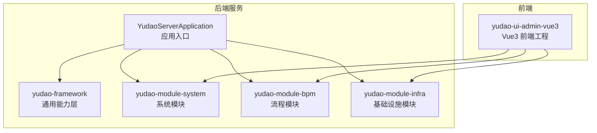
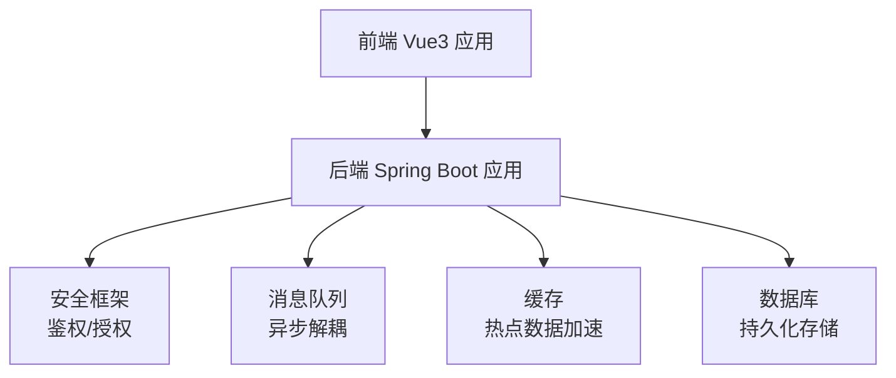
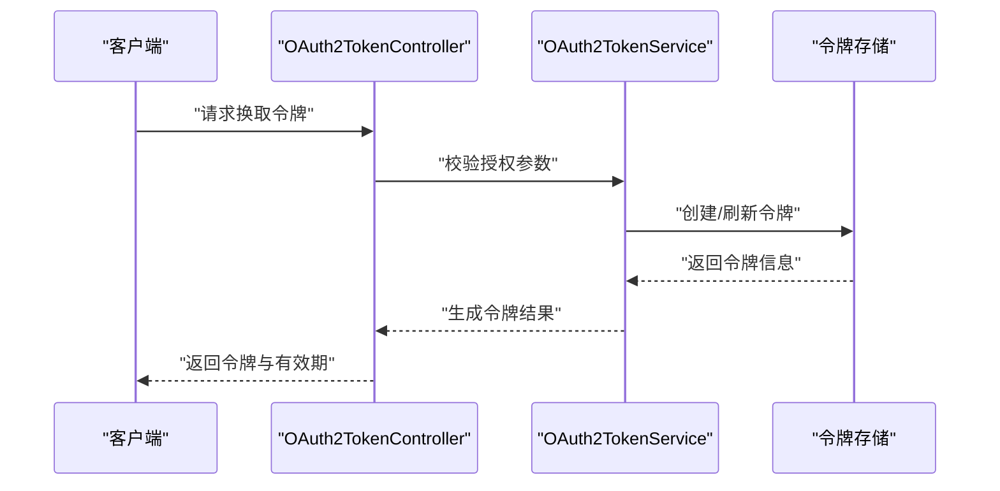
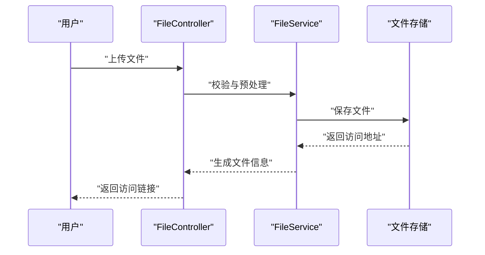
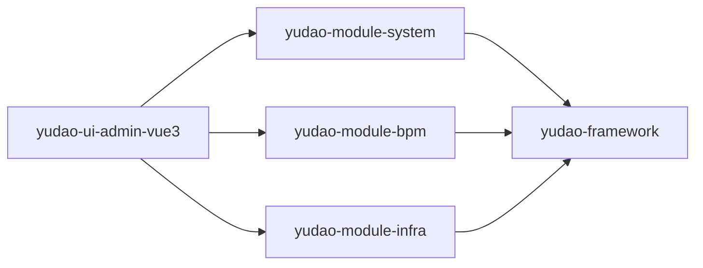

# 最佳实践

<cite>
**本文引用的文件**
- [README.md](file://README.md)
- [yudao-server/src/main/java/cn/iocoder/yudao/server/YudaoServerApplication.java](file://yudao-server/src/main/java/cn/iocoder/yudao/server/YudaoServerApplication.java)
- [yudao-framework/yudao-common/src/main/java/cn/iocoder/yudao/framework/common/util/ValidationUtils.java](file://yudao-framework/yudao-common/src/main/java/cn/iocoder/yudao/framework/common/util/ValidationUtils.java)
- [yudao-framework/yudao-spring-boot-starter-web/src/main/java/cn/iocoder/yudao/framework/web/core/ExceptionHandler.java](file://yudao-framework/yudao-spring-boot-starter-web/src/main/java/cn/iocoder/yudao/framework/web/core/ExceptionHandler.java)
- [yudao-framework/yudao-spring-boot-starter-security/src/main/java/cn/iocoder/yudao/framework/security/core/UserSecurityUtil.java](file://yudao-spring-boot-starter-security/src/main/java/cn/iocoder/yudao/framework/security/core/UserSecurityUtil.java)
- [yudao-framework/yudao-spring-boot-starter-redis/src/main/java/cn/iocoder/yudao/framework/redis/core/RedisClient.java](file://yudao-framework/yudao-spring-boot-starter-redis/src/main/java/cn/iocoder/yudao/framework/redis/core/RedisClient.java)
- [yudao-framework/yudao-spring-boot-starter-mybatis/src/main/java/cn/iocoder/yudao/framework/mybatis/core/util/MyBatisUtils.java](file://yudao-framework/yudao-spring-boot-starter-mybatis/src/main/java/cn/iocoder/yudao/framework/mybatis/core/util/MyBatisUtils.java)
- [yudao-framework/yudao-spring-boot-starter-job/src/main/java/cn/iocoder/yudao/framework/quartz/core/QuartzUtils.java](file://yudao-framework/yudao-spring-boot-starter-job/src/main/java/cn/iocoder/yudao/framework/quartz/core/QuartzUtils.java)
- [yudao-framework/yudao-spring-boot-starter-mq/src/main/java/cn/iocoder/yudao/framework/mq/redis/RedisMQTemplate.java](file://yudao-framework/yudao-spring-boot-starter-mq/src/main/java/cn/iocoder/yudao/framework/mq/redis/RedisMQTemplate.java)
- [yudao-framework/yudao-spring-boot-starter-test/src/main/java/cn/iocoder/yudao/framework/test/core/util/TestUtils.java](file://yudao-framework/yudao-spring-boot-starter-test/src/main/java/cn/iocoder/yudao/framework/test/core/util/TestUtils.java)
- [yudao-ui/yudao-ui-admin-vue3/package.json](file://yudao-ui/yudao-ui-admin-vue3/package.json)
- [yudao-ui/yudao-ui-admin-vue3/vite.config.ts](file://yudao-ui/yudao-ui-admin-vue3/vite.config.ts)
- [yudao-ui/yudao-ui-admin-vue3/eslint.config.mjs](file://yudao-ui/yudao-ui-admin-vue3/eslint.config.mjs)
- [yudao-ui/yudao-ui-admin-vue3/prettier.config.js](file://yudao-ui/yudao-ui-admin-vue3/prettier.config.js)
- [yudao-ui/yudao-ui-admin-vue3/stylelint.config.js](file://yudao-ui/yudao-ui-admin-vue3/stylelint.config.js)
- [script/jenkins/Jenkinsfile](file://script/jenkins/Jenkinsfile)
- [script/shell/deploy.sh](file://script/shell/deploy.sh)
- [sql/mysql/quartz.sql](file://sql/mysql/quartz.sql)
- [yudao-module-system/src/main/java/cn/iocoder/yudao/module/system/api/oauth2/OAuth2TokenApi.java](file://yudao-module-system/src/main/java/cn/iocoder/yudao/module/system/api/oauth2/OAuth2TokenApi.java)
- [yudao-module-system/src/main/java/cn/iocoder/yudao/module/system/controller/admin/oauth2/OAuth2TokenController.java](file://yudao-module-system/src/main/java/cn/iocoder/yudao/module/system/controller/admin/oauth2/OAuth2TokenController.java)
- [yudao-module-system/src/main/java/cn/iocoder/yudao/module/system/service/oauth2/OAuth2TokenService.java](file://yudao-module-system/src/main/java/cn/iocoder/yudao/module/system/service/oauth2/OAuth2TokenService.java)
- [yudao-module-system/src/main/resources/application.yaml](file://yudao-module-system/src/main/resources/application.yaml)
- [yudao-module-bpm/src/main/java/cn/iocoder/yudao/module/bpm/controller/admin/definition/BpmModelController.java](file://yudao-module-bpm/src/main/java/cn/iocoder/yudao/module/bpm/controller/admin/definition/BpmModelController.java)
- [yudao-module-bpm/src/main/java/cn/iocoder/yudao/module/bpm/service/definition/BpmModelService.java](file://yudao-module-bpm/src/main/java/cn/iocoder/yudao/module/bpm/service/definition/BpmModelService.java)
- [yudao-module-infra/src/main/java/cn/iocoder/yudao/module/infra/api/file/FileApi.java](file://yudao-module-infra/src/main/java/cn/iocoder/yudao/module/infra/api/file/FileApi.java)
- [yudao-module-infra/src/main/java/cn/iocoder/yudao/module/infra/controller/admin/file/FileController.java](file://yudao-module-infra/src/main/java/cn/iocoder/yudao/module/infra/controller/admin/file/FileController.java)
- [yudao-module-infra/src/main/java/cn/iocoder/yudao/module/infra/service/file/FileService.java](file://yudao-module-infra/src/main/java/cn/iocoder/yudao/module/infra/service/file/FileService.java)
- [yudao-module-system/src/main/java/cn/iocoder/yudao/module/system/controller/admin/user/AdminUserListController.java](file://yudao-module-system/src/main/java/cn/iocoder/yudao/module/system/controller/admin/user/AdminUserListController.java)
- [yudao-module-system/src/main/java/cn/iocoder/yudao/module/system/service/user/AdminUserService.java](file://yudao-module-system/src/main/java/cn/iocoder/yudao/module/system/service/user/AdminUserService.java)
</cite>

## 目录
1. [引言](#引言)
2. [项目结构](#项目结构)
3. [核心组件](#核心组件)
4. [架构总览](#架构总览)
5. [详细组件分析](#详细组件分析)
6. [依赖关系分析](#依赖关系分析)
7. [性能考虑](#性能考虑)
8. [故障排查指南](#故障排查指南)
9. [结论](#结论)
10. [附录](#附录)

## 引言
本最佳实践指南面向芋道 ruoyi-vue-pro 项目，围绕后端 Java 与前端 Vue 的开发规范、架构设计、性能优化、安全开发、项目管理、团队协作、测试驱动与运维实践等方面，结合仓库现有模块与基础设施，提供可落地的实施建议与参考路径。目标是帮助团队在保持一致性的同时提升交付质量与效率。

## 项目结构
ruoyi-vue-pro 采用多模块 Maven 工程组织，后端以 yudao-server 为启动入口，按业务域拆分为多个模块（如系统、流程、基础设施等），并通过 yudao-framework 提供通用能力（安全、缓存、消息队列、定时任务、监控、参数校验等）。前端采用 Vue3 + Vite 构建，统一通过 ESLint/Prettier/Stylelint 等工具保障代码风格与质量。

图示来源
- [yudao-server/src/main/java/cn/iocoder/yudao/server/YudaoServerApplication.java](file://yudao-server/src/main/java/cn/iocoder/yudao/server/YudaoServerApplication.java)
- [yudao-ui/yudao-ui-admin-vue3/package.json](file://yudao-ui/yudao-ui-admin-vue3/package.json)

章节来源
- [README.md](file://README.md)
- [yudao-server/src/main/java/cn/iocoder/yudao/server/YudaoServerApplication.java](file://yudao-server/src/main/java/cn/iocoder/yudao/server/YudaoServerApplication.java)
- [yudao-ui/yudao-ui-admin-vue3/package.json](file://yudao-ui/yudao-ui-admin-vue3/package.json)

## 核心组件
- 应用入口与配置：后端通过应用入口类启动，系统模块提供全局配置与环境变量；前端通过包管理与构建配置统一管理依赖与构建流程。
- 通用能力：框架层提供安全、缓存、消息队列、定时任务、监控、参数校验等能力，被各业务模块复用。
- 业务模块：系统、流程、基础设施等模块分别承担用户、角色、租户、字典、文件、任务调度、操作日志等核心能力。
- 前端工程：统一的 ESLint/Prettier/Stylelint 配置与 Vite 构建链路，保证代码风格与打包质量。

章节来源
- [yudao-server/src/main/java/cn/iocoder/yudao/server/YudaoServerApplication.java](file://yudao-server/src/main/java/cn/iocoder/yudao/server/YudaoServerApplication.java)
- [yudao-module-system/src/main/resources/application.yaml](file://yudao-module-system/src/main/resources/application.yaml)
- [yudao-ui/yudao-ui-admin-vue3/vite.config.ts](file://yudao-ui/yudao-ui-admin-vue3/vite.config.ts)
- [yudao-ui/yudao-ui-admin-vue3/eslint.config.mjs](file://yudao-ui/yudao-ui-admin-vue3/eslint.config.mjs)
- [yudao-ui/yudao-ui-admin-vue3/prettier.config.js](file://yudao-ui/yudao-ui-admin-vue3/prettier.config.js)
- [yudao-ui/yudao-ui-admin-vue3/stylelint.config.js](file://yudao-ui/yudao-ui-admin-vue3/stylelint.config.js)

## 架构总览
系统采用前后端分离架构，后端以 Spring Boot 为基础，通过模块化拆分实现高内聚低耦合；前端基于 Vue3 生态，配合 Vite 实现快速开发与构建。框架层提供横切能力，业务模块聚焦领域逻辑。

图示来源
- [yudao-framework/yudao-spring-boot-starter-security/pom.xml](file://yudao-framework/yudao-spring-boot-starter-security/pom.xml)
- [yudao-framework/yudao-spring-boot-starter-mq/pom.xml](file://yudao-framework/yudao-spring-boot-starter-mq/pom.xml)
- [yudao-framework/yudao-spring-boot-starter-redis/pom.xml](file://yudao-framework/yudao-spring-boot-starter-redis/pom.xml)
- [yudao-framework/yudao-spring-boot-starter-mybatis/pom.xml](file://yudao-framework/yudao-spring-boot-starter-mybatis/pom.xml)

## 详细组件分析

### 参数校验与输入验证
- 后端通过通用工具封装校验逻辑，确保请求参数在进入业务前得到约束与清理。
- 建议：对所有对外接口入参进行显式校验，结合国际化提示与统一异常处理返回标准错误格式。

章节来源
- [yudao-framework/yudao-common/src/main/java/cn/iocoder/yudao/framework/common/util/ValidationUtils.java](file://yudao-framework/yudao-common/src/main/java/cn/iocoder/yudao/framework/common/util/ValidationUtils.java)

### 统一异常与错误处理
- 通过统一异常处理器捕获业务与非业务异常，输出标准化错误响应，便于前端展示与日志定位。
- 建议：区分业务异常与系统异常，前者携带明确的错误码与文案，后者记录堆栈并返回通用提示。

章节来源
- [yudao-framework/yudao-spring-boot-starter-web/src/main/java/cn/iocoder/yudao/framework/web/core/ExceptionHandler.java](file://yudao-framework/yudao-spring-boot-starter-web/src/main/java/cn/iocoder/yudao/framework/web/core/ExceptionHandler.java)

### 安全与权限控制
- 用户安全工具提供当前登录用户上下文获取与权限判断能力，支撑细粒度权限控制。
- 建议：在控制器与服务层均进行权限校验，避免越权访问；对敏感接口启用鉴权与防重放保护。

章节来源
- [yudao-framework/yudao-spring-boot-starter-security/src/main/java/cn/iocoder/yudao/framework/security/core/UserSecurityUtil.java](file://yudao-spring-boot-starter-security/src/main/java/cn/iocoder/yudao/framework/security/core/UserSecurityUtil.java)

### 缓存与热点数据加速
- Redis 客户端封装常用缓存操作，支持过期策略与序列化配置，降低数据库压力。
- 建议：遵循缓存更新策略（先删后写或写后删），避免脏读；对热点数据设置合理 TTL 并监控命中率。

章节来源
- [yudao-framework/yudao-spring-boot-starter-redis/src/main/java/cn/iocoder/yudao/framework/redis/core/RedisClient.java](file://yudao-framework/yudao-spring-boot-starter-redis/src/main/java/cn/iocoder/yudao/framework/redis/core/RedisClient.java)

### 数据访问与查询优化
- MyBatis 工具提供 SQL 与分页辅助能力，建议结合索引设计与慢查询日志进行优化。
- 建议：避免 N+1 查询，优先使用批量加载与关联查询；对高频查询建立复合索引并定期分析执行计划。

章节来源
- [yudao-framework/yudao-spring-boot-starter-mybatis/src/main/java/cn/iocoder/yudao/framework/mybatis/core/util/MyBatisUtils.java](file://yudao-framework/yudao-spring-boot-starter-mybatis/src/main/java/cn/iocoder/yudao/framework/mybatis/core/util/MyBatisUtils.java)

### 异步处理与并发控制
- Quartz 工具封装定时任务与并发控制，支持任务调度与幂等处理。
- 建议：对耗时操作异步化，使用分布式锁或数据库唯一键防止重复执行；对高频任务设置合理的并发阈值。

章节来源
- [yudao-framework/yudao-spring-boot-starter-job/src/main/java/cn/iocoder/yudao/framework/quartz/core/QuartzUtils.java](file://yudao-framework/yudao-spring-boot-starter-job/src/main/java/cn/iocoder/yudao/framework/quartz/core/QuartzUtils.java)

### 消息队列与异步解耦
- Redis MQ 模板提供发布/订阅与消息投递能力，支撑削峰填谷与最终一致性。
- 建议：对事务性消息采用本地消息表或可靠消息投递；对失败消息进行死信处理与重试上限控制。

章节来源
- [yudao-framework/yudao-spring-boot-starter-mq/src/main/java/cn/iocoder/yudao/framework/mq/redis/RedisMQTemplate.java](file://yudao-framework/yudao-spring-boot-starter-mq/src/main/java/cn/iocoder/yudao/framework/mq/redis/RedisMQTemplate.java)

### OAuth2 令牌管理（示例）
- 系统模块提供 OAuth2 Token 的对外 API、控制器与服务层，体现鉴权与令牌生命周期管理。
- 建议：令牌刷新与撤销流程需幂等；对令牌颁发与校验增加审计日志与风控策略。

图示来源
- [yudao-module-system/src/main/java/cn/iocoder/yudao/module/system/controller/admin/oauth2/OAuth2TokenController.java](file://yudao-module-system/src/main/java/cn/iocoder/yudao/module/system/controller/admin/oauth2/OAuth2TokenController.java)
- [yudao-module-system/src/main/java/cn/iocoder/yudao/module/system/service/oauth2/OAuth2TokenService.java](file://yudao-module-system/src/main/java/cn/iocoder/yudao/module/system/service/oauth2/OAuth2TokenService.java)
- [yudao-module-system/src/main/java/cn/iocoder/yudao/module/system/api/oauth2/OAuth2TokenApi.java](file://yudao-module-system/src/main/java/cn/iocoder/yudao/module/system/api/oauth2/OAuth2TokenApi.java)

章节来源
- [yudao-module-system/src/main/java/cn/iocoder/yudao/module/system/controller/admin/oauth2/OAuth2TokenController.java](file://yudao-module-system/src/main/java/cn/iocoder/yudao/module/system/controller/admin/oauth2/OAuth2TokenController.java)
- [yudao-module-system/src/main/java/cn/iocoder/yudao/module/system/service/oauth2/OAuth2TokenService.java](file://yudao-module-system/src/main/java/cn/iocoder/yudao/module/system/service/oauth2/OAuth2TokenService.java)
- [yudao-module-system/src/main/java/cn/iocoder/yudao/module/system/api/oauth2/OAuth2TokenApi.java](file://yudao-module-system/src/main/java/cn/iocoder/yudao/module/system/api/oauth2/OAuth2TokenApi.java)

### 文件上传与下载（示例）
- 基础设施模块提供文件 API、控制器与服务层，支撑文件的上传、存储与访问。
- 建议：对上传文件进行类型与大小校验，采用对象存储并开启 CDN；对大文件采用分片上传与断点续传。

图示来源
- [yudao-module-infra/src/main/java/cn/iocoder/yudao/module/infra/controller/admin/file/FileController.java](file://yudao-module-infra/src/main/java/cn/iocoder/yudao/module/infra/controller/admin/file/FileController.java)
- [yudao-module-infra/src/main/java/cn/iocoder/yudao/module/infra/service/file/FileService.java](file://yudao-module-infra/src/main/java/cn/iocoder/yudao/module/infra/service/file/FileService.java)
- [yudao-module-infra/src/main/java/cn/iocoder/yudao/module/infra/api/file/FileApi.java](file://yudao-module-infra/src/main/java/cn/iocoder/yudao/module/infra/api/file/FileApi.java)

章节来源
- [yudao-module-infra/src/main/java/cn/iocoder/yudao/module/infra/controller/admin/file/FileController.java](file://yudao-module-infra/src/main/java/cn/iocoder/yudao/module/infra/controller/admin/file/FileController.java)
- [yudao-module-infra/src/main/java/cn/iocoder/yudao/module/infra/service/file/FileService.java](file://yudao-module-infra/src/main/java/cn/iocoder/yudao/module/infra/service/file/FileService.java)
- [yudao-module-infra/src/main/java/cn/iocoder/yudao/module/infra/api/file/FileApi.java](file://yudao-module-infra/src/main/java/cn/iocoder/yudao/module/infra/api/file/FileApi.java)

### 流程模型管理（示例）
- 流程模块提供模型的增删改查与部署能力，支撑业务流程的可视化设计与运行。
- 建议：对流程定义进行版本管理与灰度发布；对流程实例状态进行可观测与告警。

章节来源
- [yudao-module-bpm/src/main/java/cn/iocoder/yudao/module/bpm/controller/admin/definition/BpmModelController.java](file://yudao-module-bpm/src/main/java/cn/iocoder/yudao/module/bpm/controller/admin/definition/BpmModelController.java)
- [yudao-module-bpm/src/main/java/cn/iocoder/yudao/module/bpm/service/definition/BpmModelService.java](file://yudao-module-bpm/src/main/java/cn/iocoder/yudao/module/bpm/service/definition/BpmModelService.java)

### 用户列表管理（示例）
- 系统模块提供用户列表查询与分页能力，体现数据访问与权限控制的结合。
- 建议：对列表查询添加索引与条件裁剪；对敏感字段进行脱敏展示。

章节来源
- [yudao-module-system/src/main/java/cn/iocoder/yudao/module/system/controller/admin/user/AdminUserListController.java](file://yudao-module-system/src/main/java/cn/iocoder/yudao/module/system/controller/admin/user/AdminUserListController.java)
- [yudao-module-system/src/main/java/cn/iocoder/yudao/module/system/service/user/AdminUserService.java](file://yudao-module-system/src/main/java/cn/iocoder/yudao/module/system/service/user/AdminUserService.java)

## 依赖关系分析
- 模块间依赖：后端模块通过 yudao-framework 提供的能力进行横向扩展，业务模块之间尽量保持松耦合。
- 前后端依赖：前端通过 API 文档与契约对接后端接口，构建阶段统一校验代码风格与质量。

图示来源
- [yudao-ui/yudao-ui-admin-vue3/package.json](file://yudao-ui/yudao-ui-admin-vue3/package.json)
- [yudao-module-system/pom.xml](file://yudao-module-system/pom.xml)
- [yudao-module-bpm/pom.xml](file://yudao-module-bpm/pom.xml)
- [yudao-module-infra/pom.xml](file://yudao-module-infra/pom.xml)

章节来源
- [yudao-ui/yudao-ui-admin-vue3/package.json](file://yudao-ui/yudao-ui-admin-vue3/package.json)
- [yudao-module-system/pom.xml](file://yudao-module-system/pom.xml)
- [yudao-module-bpm/pom.xml](file://yudao-module-bpm/pom.xml)
- [yudao-module-infra/pom.xml](file://yudao-module-infra/pom.xml)

## 性能考虑
- 数据库查询优化：使用合适的索引、避免全表扫描；对复杂查询进行分页与投影裁剪；利用慢查询日志与执行计划分析瓶颈。
- 缓存策略：热点数据放入缓存，设置合理过期时间；采用多级缓存（本地缓存+分布式缓存）；关注缓存穿透、击穿与雪崩问题。
- 异步处理：将耗时操作异步化，减少请求延迟；对任务进行限流与重试；对失败任务进行死信处理。
- 并发控制：对关键资源加锁，使用数据库唯一键或分布式锁；对高频接口进行限流与熔断。
- 前端性能：按需加载与懒加载、资源压缩与缓存、骨架屏与渐进增强。

## 故障排查指南
- 统一异常处理：通过统一异常处理器输出标准错误响应，便于前端展示与日志定位。
- 日志管理：对关键链路打点记录，结合链路追踪与日志聚合平台进行问题定位。
- 监控告警：对核心指标（QPS、P95、错误率、线程池、缓存命中率）设置阈值告警。
- 回滚与恢复：对数据库变更采用可回滚脚本；对缓存与消息队列做好隔离与降级预案。

章节来源
- [yudao-framework/yudao-spring-boot-starter-web/src/main/java/cn/iocoder/yudao/framework/web/core/ExceptionHandler.java](file://yudao-framework/yudao-spring-boot-starter-web/src/main/java/cn/iocoder/yudao/framework/web/core/ExceptionHandler.java)

## 结论
本最佳实践以 ruoyi-vue-pro 项目为蓝本，从架构、规范、性能、安全、测试与运维等维度给出可操作的建议。建议团队在日常开发中坚持“先规范、再实现”的原则，逐步完善流程与工具链，持续提升交付质量与效率。

## 附录

### Java 编码规范（建议）
- 命名规范：类名使用名词，方法名使用动词短语；常量全大写并以下划线分隔。
- 结构规范：单文件不超过 1000 行；方法长度控制在 50 行以内；类职责单一。
- 注释规范：公共接口必须有完整注释；复杂逻辑附带注释说明。
- 异常规范：区分受检与非受检异常；业务异常自定义错误码与提示。

### Vue 开发规范（建议）
- 目录结构：按功能域划分目录，组件与样式分离；API 请求集中管理。
- 组件规范：单文件组件职责单一；Props 明确类型与默认值；事件命名使用动词。
- 样式规范：使用 CSS Modules 或 SCSS；避免全局污染。
- 质量工具：ESLint 规则统一；Prettier 自动格式化；Stylelint 校验样式。

### Git 提交规范（建议）
- 提交信息：类型 + 模块 + 描述；描述简洁明了，必要时补充动机与影响。
- 分支策略：主干保护、特性分支、热修复分支；合并前强制代码审查。
- 变更管理：重大变更提前评审；对数据库与配置变更制定回滚方案。

### 代码审查流程（建议）
- 审查清单：需求一致性、边界条件、异常处理、性能与安全性、可测试性。
- 工具辅助：自动化检查（静态分析、单元测试覆盖率）；人工审查与交叉审查。
- 记录归档：审查意见与结论记录到工单系统，沉淀经验。

### 测试驱动开发（建议）
- 测试金字塔：单元测试为主、集成测试为辅、端到端测试少量覆盖。
- TDD 步骤：红—绿—重构；先写失败用例，再实现最小可行代码，最后重构。
- 持续测试：CI 中强制执行测试；覆盖率阈值与失败即阻塞。

### 运维最佳实践（建议）
- 监控配置：关键指标采集、链路追踪、日志聚合与告警。
- 日志管理：结构化日志、日志轮转与保留策略、敏感信息脱敏。
- 备份策略：数据库与配置文件定期备份；异地容灾演练。
- 灾难恢复：RTO/RPO 明确；故障切换与回退流程清晰。