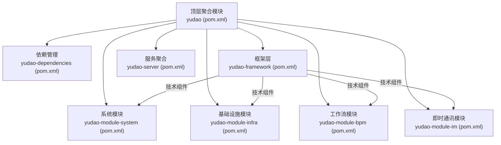
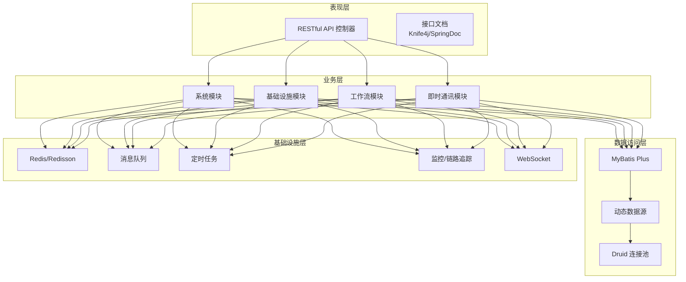
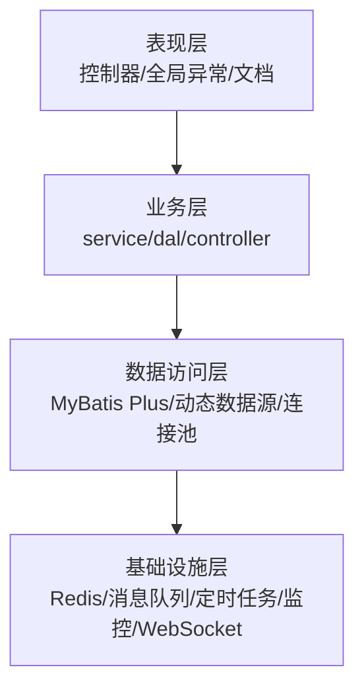
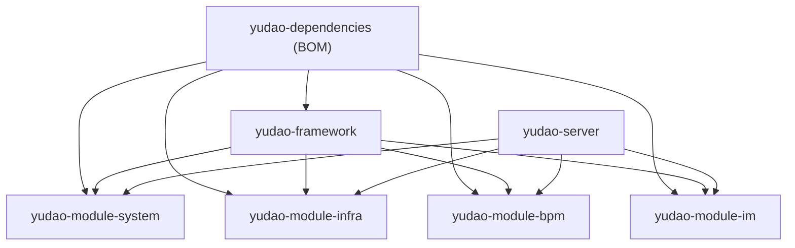

# 架构设计最佳实践

<cite>
**本文引用的文件**
- [pom.xml](file://pom.xml)
- [yudao-server/pom.xml](file://yudao-server/pom.xml)
- [yudao-server/src/main/java/cn/iocoder/yudao/server/YudaoServerApplication.java](file://yudao-server/src/main/java/cn/iocoder/yudao/server/YudaoServerApplication.java)
- [yudao-framework/pom.xml](file://yudao-framework/pom.xml)
- [yudao-dependencies/pom.xml](file://yudao-dependencies/pom.xml)
- [yudao-framework/yudao-common/pom.xml](file://yudao-framework/yudao-common/pom.xml)
- [yudao-framework/yudao-spring-boot-starter-web/pom.xml](file://yudao-framework/yudao-spring-boot-starter-web/pom.xml)
- [yudao-framework/yudao-spring-boot-starter-security/pom.xml](file://yudao-framework/yudao-spring-boot-starter-security/pom.xml)
- [yudao-framework/yudao-spring-boot-starter-mybatis/pom.xml](file://yudao-framework/yudao-spring-boot-starter-mybatis/pom.xml)
- [yudao-framework/yudao-spring-boot-starter-redis/pom.xml](file://yudao-framework/yudao-spring-boot-starter-redis/pom.xml)
- [yudao-module-system/pom.xml](file://yudao-module-system/pom.xml)
- [yudao-module-infra/pom.xml](file://yudao-module-infra/pom.xml)
- [yudao-module-bpm/pom.xml](file://yudao-module-bpm/pom.xml)
- [yudao-module-im/pom.xml](file://yudao-module-im/pom.xml)
- [README.md](file://README.md)
</cite>

## 目录
1. [引言](#引言)
2. [项目结构](#项目结构)
3. [核心组件](#核心组件)
4. [架构总览](#架构总览)
5. [详细组件分析](#详细组件分析)
6. [依赖分析](#依赖分析)
7. [性能考虑](#性能考虑)
8. [故障排查指南](#故障排查指南)
9. [结论](#结论)
10. [附录](#附录)

## 引言
本指南面向“芋道 ruoyi-vue-pro”项目的架构设计与最佳实践，围绕模块划分原则、分层架构、微服务实践、设计模式应用、可扩展性设计以及架构演进策略展开，帮助读者在理解现有结构的基础上，进一步优化系统设计、提升可维护性与可扩展性。

## 项目结构
ruoyi-vue-pro 采用多模块 Maven 工程，整体分为三层：
- 顶层聚合模块：统一版本与插件管理，聚合各子模块。
- 框架层：yudao-framework 提供通用技术组件与业务组件封装。
- 业务模块：yudao-module-* 按领域拆分，如 system、infra、bpm、im 等。
- 服务聚合：yudao-server 作为运行容器，按需装配业务模块。

**图示来源**
- [pom.xml:10-32](file://pom.xml#L10-L32)
- [yudao-framework/pom.xml:12-31](file://yudao-framework/pom.xml#L12-L31)
- [yudao-module-system/pom.xml:20-92](file://yudao-module-system/pom.xml#L20-L92)
- [yudao-module-infra/pom.xml:21-118](file://yudao-module-infra/pom.xml#L21-L118)
- [yudao-module-bpm/pom.xml:23-78](file://yudao-module-bpm/pom.xml#L23-L78)
- [yudao-module-im/pom.xml:20-83](file://yudao-module-im/pom.xml#L20-L83)
- [yudao-server/pom.xml:23-137](file://yudao-server/pom.xml#L23-L137)

**章节来源**
- [pom.xml:10-32](file://pom.xml#L10-L32)
- [yudao-framework/pom.xml:12-31](file://yudao-framework/pom.xml#L12-L31)
- [yudao-module-system/pom.xml:20-92](file://yudao-module-system/pom.xml#L20-L92)
- [yudao-module-infra/pom.xml:21-118](file://yudao-module-infra/pom.xml#L21-L118)
- [yudao-module-bpm/pom.xml:23-78](file://yudao-module-bpm/pom.xml#L23-L78)
- [yudao-module-im/pom.xml:20-83](file://yudao-module-im/pom.xml#L20-L83)
- [yudao-server/pom.xml:23-137](file://yudao-server/pom.xml#L23-L137)

## 核心组件
- 依赖管理：yudao-dependencies 统一管理第三方组件版本，确保一致性与可维护性。
- 框架组件：yudao-framework 提供 web、security、mybatis、redis、job、mq、monitor、protection、excel、test、biz-* 等技术与业务组件，形成“技术组件 + 业务组件”的双轨封装。
- 业务模块：system/infra/bpm/im 等模块复用框架组件，聚焦各自领域的业务能力。
- 服务聚合：yudao-server 通过依赖装配实现“按需启用”，避免不必要的编译与运行时开销。

**章节来源**
- [yudao-dependencies/pom.xml:88-726](file://yudao-dependencies/pom.xml#L88-L726)
- [yudao-framework/pom.xml:12-31](file://yudao-framework/pom.xml#L12-L31)
- [yudao-framework/yudao-common/pom.xml:18-147](file://yudao-framework/yudao-common/pom.xml#L18-L147)
- [yudao-framework/yudao-spring-boot-starter-web/pom.xml:18-79](file://yudao-framework/yudao-spring-boot-starter-web/pom.xml#L18-L79)
- [yudao-framework/yudao-spring-boot-starter-security/pom.xml:21-62](file://yudao-framework/yudao-spring-boot-starter-security/pom.xml#L21-L62)
- [yudao-framework/yudao-spring-boot-starter-mybatis/pom.xml:18-115](file://yudao-framework/yudao-spring-boot-starter-mybatis/pom.xml#L18-L115)
- [yudao-framework/yudao-spring-boot-starter-redis/pom.xml:18-39](file://yudao-framework/yudao-spring-boot-starter-redis/pom.xml#L18-L39)

## 架构总览
系统采用“多模块 + 技术组件 + 业务模块 + 服务聚合”的分层架构：
- 表现层：基于 Spring MVC 的 RESTful API，配合 Knife4j/SpringDoc 提供接口文档。
- 业务层：各 module 聚焦领域职责，通过框架组件提供安全、数据访问、消息队列、作业调度等能力。
- 数据访问层：MyBatis Plus + Druid 连接池 + 多数据源支持，覆盖 MySQL/PG/Oracle/国产数据库等。
- 基础设施层：Redis/Redisson、WebSocket、定时任务、监控与链路追踪、文件存储等。

**图示来源**
- [yudao-framework/yudao-spring-boot-starter-web/pom.xml:18-48](file://yudao-framework/yudao-spring-boot-starter-web/pom.xml#L18-L48)
- [yudao-framework/yudao-spring-boot-starter-mybatis/pom.xml:18-98](file://yudao-framework/yudao-spring-boot-starter-mybatis/pom.xml#L18-L98)
- [yudao-framework/yudao-spring-boot-starter-redis/pom.xml:18-38](file://yudao-framework/yudao-spring-boot-starter-redis/pom.xml#L18-L38)
- [yudao-module-system/pom.xml:20-91](file://yudao-module-system/pom.xml#L20-L91)
- [yudao-module-infra/pom.xml:21-90](file://yudao-module-infra/pom.xml#L21-L90)
- [yudao-module-bpm/pom.xml:23-77](file://yudao-module-bpm/pom.xml#L23-L77)
- [yudao-module-im/pom.xml:20-75](file://yudao-module-im/pom.xml#L20-L75)

## 详细组件分析

### 模块划分原则与边界设计
- 业务边界清晰：system 聚焦用户/角色/菜单/部门/数据字典等通用能力；infra 聚焦运维与研发工具（定时任务、代码生成、接口文档、文件服务、WebSocket、监控等）；bpm 聚焦流程定义与任务处理；im 聚焦即时通讯。
- 模块内聚、模块间低耦合：模块间通过框架组件与公共依赖协作，避免直接交叉引用。
- 可插拔装配：yudao-server 通过依赖装配按需启用模块，便于独立部署与扩展。

**章节来源**
- [yudao-module-system/pom.xml:14-56](file://yudao-module-system/pom.xml#L14-L56)
- [yudao-module-infra/pom.xml:14-43](file://yudao-module-infra/pom.xml#L14-L43)
- [yudao-module-bpm/pom.xml:14-55](file://yudao-module-bpm/pom.xml#L14-L55)
- [yudao-module-im/pom.xml:14-52](file://yudao-module-im/pom.xml#L14-L52)
- [yudao-server/pom.xml:23-137](file://yudao-server/pom.xml#L23-L137)

### 分层架构设计
- 表现层：统一异常处理、全局日志、脱敏、错误码、接口文档，基于 Spring MVC。
- 业务层：各模块内部按 service/dal/controller/convert/enums 等层次组织，复用框架组件。
- 数据访问层：MyBatis Plus + 动态数据源 + Druid，支持联表查询与多数据库。
- 基础设施层：Redis/Redisson、WebSocket、定时任务、监控与链路追踪、文件存储。

**图示来源**
- [yudao-framework/yudao-spring-boot-starter-web/pom.xml:18-48](file://yudao-framework/yudao-spring-boot-starter-web/pom.xml#L18-L48)
- [yudao-framework/yudao-spring-boot-starter-mybatis/pom.xml:18-98](file://yudao-framework/yudao-spring-boot-starter-mybatis/pom.xml#L18-L98)
- [yudao-framework/yudao-spring-boot-starter-redis/pom.xml:18-38](file://yudao-framework/yudao-spring-boot-starter-redis/pom.xml#L18-L38)
- [yudao-module-system/pom.xml:20-91](file://yudao-module-system/pom.xml#L20-L91)

### 微服务架构实践
- 服务拆分策略：当前为单体多模块架构，建议以“业务域 + 读写分离 + 事件解耦”为原则逐步拆分；优先拆分跨域交互频繁、数据边界清晰的模块。
- 服务注册与发现：可引入 Spring Cloud（已在同仓库提供 yudao-cloud 示例），结合 Nacos/Consul/Eureka。
- 配置管理：集中化配置中心（Nacos/Config Server），支持灰度与动态刷新。
- 分布式事务：优先采用最终一致性方案（本地消息表/事件驱动），必要时引入 Saga 或 TCC。

[本节为概念性指导，不直接分析具体文件]

### 设计模式应用指南
- 工厂模式：在多数据源/多存储/多支付渠道等场景，通过工厂抽象创建策略，降低切换成本。
- 观察者模式：事件驱动架构中，利用 Spring 事件或消息中间件实现松耦合通知。
- 策略模式：在权限校验、数据脱敏、日志记录、文件存储等场景，通过策略接口与多实现解耦算法。

[本节为概念性指导，不直接分析具体文件]

### 可扩展性设计
- 插件机制：通过 SPI 或配置开关加载模块能力，实现“即插即用”。
- 钩子函数：在关键流程（鉴权、审计、缓存、日志）预留钩子，便于横向扩展。
- 事件驱动：基于 Spring 事件或消息队列实现跨模块解耦。
- 异步处理：对耗时操作（导入导出、批量处理、通知发送）采用异步与消息队列。

[本节为概念性指导，不直接分析具体文件]

### 架构演进策略
- 技术债务管理：定期评估依赖版本、清理过时组件、统一日志与监控标准。
- 重构时机判断：当模块间耦合度上升、响应变慢、测试成本过高时，优先进行分层与边界优化。
- 架构升级路径：从单体多模块 → 服务网格（Spring Cloud）→ 事件驱动与无状态服务 → 多活与多地域部署。

[本节为概念性指导，不直接分析具体文件]

## 依赖分析
- 依赖管理：yudao-dependencies 以 Bom 形式统一版本，避免冲突。
- 模块依赖：各 module 仅依赖 yudao-framework 与自身业务所需的组件，server 通过依赖装配启用模块。
- 组件内聚：框架组件按“技术组件 + 业务组件”分类，职责清晰，便于替换与扩展。

**图示来源**
- [yudao-dependencies/pom.xml:88-726](file://yudao-dependencies/pom.xml#L88-L726)
- [yudao-framework/pom.xml:12-31](file://yudao-framework/pom.xml#L12-L31)
- [yudao-module-system/pom.xml:20-92](file://yudao-module-system/pom.xml#L20-L92)
- [yudao-module-infra/pom.xml:21-118](file://yudao-module-infra/pom.xml#L21-L118)
- [yudao-module-bpm/pom.xml:23-78](file://yudao-module-bpm/pom.xml#L23-L78)
- [yudao-module-im/pom.xml:20-83](file://yudao-module-im/pom.xml#L20-L83)
- [yudao-server/pom.xml:23-137](file://yudao-server/pom.xml#L23-L137)

**章节来源**
- [yudao-dependencies/pom.xml:88-726](file://yudao-dependencies/pom.xml#L88-L726)
- [yudao-framework/pom.xml:12-31](file://yudao-framework/pom.xml#L12-L31)
- [yudao-module-system/pom.xml:20-92](file://yudao-module-system/pom.xml#L20-L92)
- [yudao-module-infra/pom.xml:21-118](file://yudao-module-infra/pom.xml#L21-L118)
- [yudao-module-bpm/pom.xml:23-78](file://yudao-module-bpm/pom.xml#L23-L78)
- [yudao-module-im/pom.xml:20-83](file://yudao-module-im/pom.xml#L20-L83)
- [yudao-server/pom.xml:23-137](file://yudao-server/pom.xml#L23-L137)

## 性能考虑
- 连接池与 SQL：使用 Druid 连接池与 MyBatis Plus，结合动态数据源与联表查询优化，避免 N+1 与慢查询。
- 缓存策略：Redis/Redisson 提供缓存与分布式锁，合理设置 TTL 与热点数据预热。
- 异步与队列：对耗时操作采用消息队列与异步处理，削峰填谷。
- 监控与追踪：集成 SkyWalking 与 Spring Boot Admin，持续观测性能瓶颈。

[本节为通用指导，不直接分析具体文件]

## 故障排查指南
- 启动问题：检查 yudao-server 的启动类扫描路径与模块装配是否正确。
- 依赖冲突：通过 yudao-dependencies 的 BOM 管理版本，避免第三方组件版本不一致导致的异常。
- 数据库与连接池：确认 Druid 与 MyBatis Plus 配置，核对多数据源与方言设置。
- 安全与日志：核对 Spring Security 与操作日志配置，确保接口访问与审计可用。

**章节来源**
- [yudao-server/src/main/java/cn/iocoder/yudao/server/YudaoServerApplication.java:16-24](file://yudao-server/src/main/java/cn/iocoder/yudao/server/YudaoServerApplication.java#L16-L24)
- [yudao-dependencies/pom.xml:88-726](file://yudao-dependencies/pom.xml#L88-L726)
- [yudao-framework/yudao-spring-boot-starter-mybatis/pom.xml:18-98](file://yudao-framework/yudao-spring-boot-starter-mybatis/pom.xml#L18-L98)
- [yudao-framework/yudao-spring-boot-starter-security/pom.xml:21-62](file://yudao-framework/yudao-spring-boot-starter-security/pom.xml#L21-L62)

## 结论
ruoyi-vue-pro 通过“多模块 + 框架组件 + 业务模块 + 服务聚合”的架构，实现了高内聚、低耦合与良好的可扩展性。建议在此基础上：
- 明确模块边界与依赖契约，持续优化分层与接口设计；
- 以事件驱动与消息队列为核心，逐步推进微服务化；
- 强化监控与可观测性，建立完善的故障排查与性能优化体系；
- 以设计模式与可扩展性设计为抓手，提升系统长期演进能力。

[本节为总结性内容，不直接分析具体文件]

## 附录
- 项目关系与模块概览可参考 README 的架构图与模块说明。

**章节来源**
- [README.md:44-64](file://README.md#L44-L64)
- [README.md:328-347](file://README.md#L328-L347)