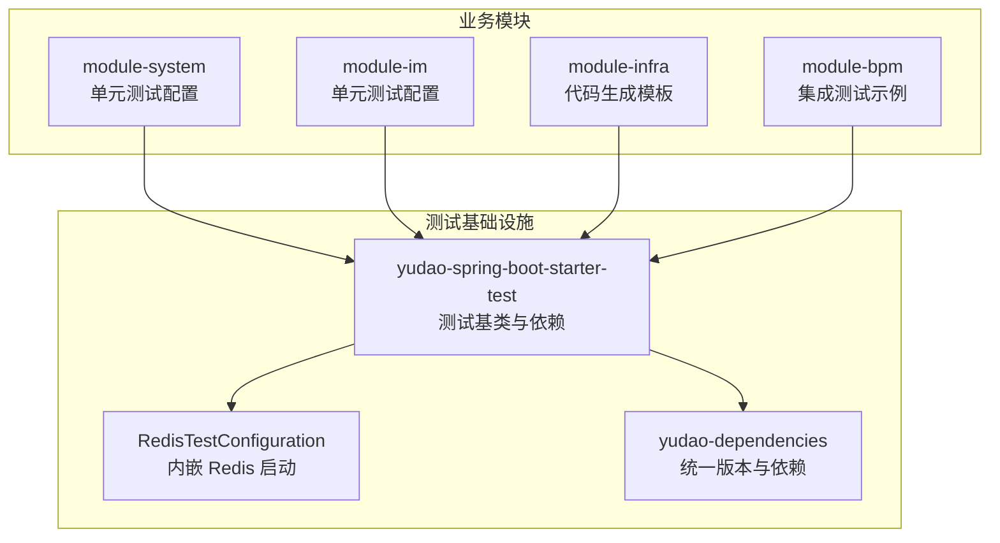
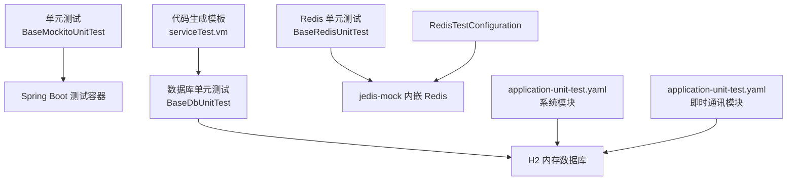
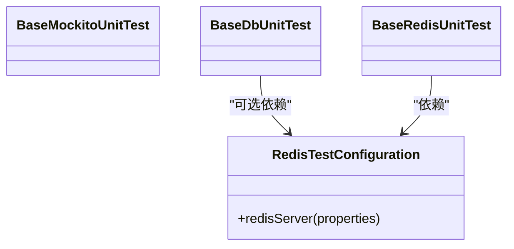
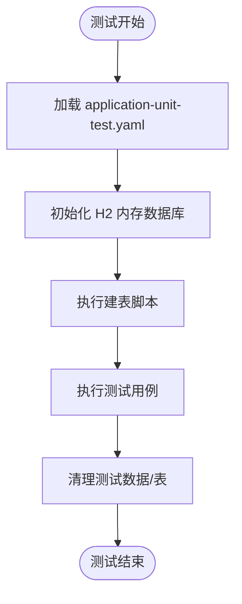
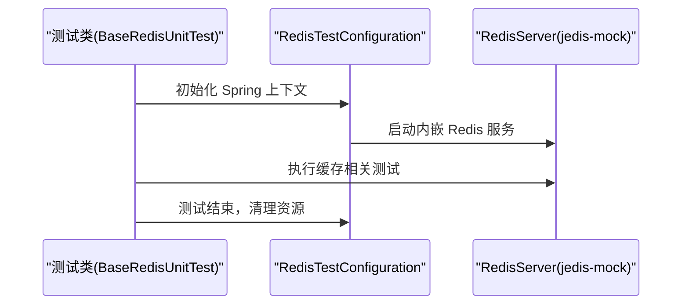
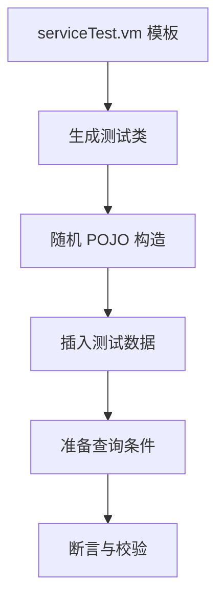
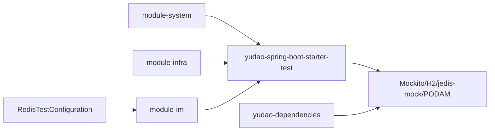

# 测试策略

<cite>
**本文引用的文件**
- [AGENTS.md](file://AGENTS.md)
- [RedisTestConfiguration.java](file://yudao-framework/yudao-spring-boot-starter-test/src/main/java/cn/iocoder/yudao/framework/test/config/RedisTestConfiguration.java)
- [pom.xml（yudao-spring-boot-starter-test）](file://yudao-framework/yudao-spring-boot-starter-test/pom.xml)
- [application-unit-test.yaml（系统模块）](file://yudao-module-system/src/test/resources/application-unit-test.yaml)
- [application-unit-test.yaml（即时通讯模块）](file://yudao-module-im/src/test/resources/application-unit-test.yaml)
- [test/serviceTest.vm](file://yudao-module-infra/src/main/resources/codegen/java/test/serviceTest.vm)
- [pom.xml（yudao-dependencies）](file://yudao-dependencies/pom.xml)
</cite>

## 目录
1. [简介](#简介)
2. [项目结构](#项目结构)
3. [核心组件](#核心组件)
4. [架构总览](#架构总览)
5. [详细组件分析](#详细组件分析)
6. [依赖分析](#依赖分析)
7. [性能考虑](#性能考虑)
8. [故障排查指南](#故障排查指南)
9. [结论](#结论)
10. [附录](#附录)

## 简介
本指南面向芋道 ruoyi-vue-pro 项目，围绕测试驱动开发（TDD）与测试工程化落地，系统阐述测试策略与最佳实践。内容覆盖：
- TDD 方法论：测试先行、红绿灯循环、重构与测试金字塔
- 单元测试：框架使用、Mock 对象、测试数据准备、覆盖率统计
- 集成测试：数据库测试、接口测试、服务集成测试、端到端测试
- 性能测试：压力、负载、并发与基准测试
- 自动化：测试脚本、持续测试集成、测试环境管理与结果分析
- 缺陷管理：分类、优先级、修复验证与回归策略

## 项目结构
ruoyi-vue-pro 采用多模块 Maven 结构，测试基础设施集中在 yudao-spring-boot-starter-test 模块，并在各业务模块中按需使用。测试配置通过 application-unit-test.yaml 在测试 Profile 中加载，数据库采用 H2 内存库，Redis 采用内嵌模拟。

图表来源
- [RedisTestConfiguration.java:1-35](file://yudao-framework/yudao-spring-boot-starter-test/src/main/java/cn/iocoder/yudao/framework/test/config/RedisTestConfiguration.java#L1-L35)
- [pom.xml（yudao-spring-boot-starter-test）:35-60](file://yudao-framework/yudao-spring-boot-starter-test/pom.xml#L35-L60)
- [application-unit-test.yaml（系统模块）:1-48](file://yudao-module-system/src/test/resources/application-unit-test.yaml#L1-L48)
- [application-unit-test.yaml（即时通讯模块）:1-49](file://yudao-module-im/src/test/resources/application-unit-test.yaml#L1-L49)

章节来源
- [AGENTS.md:122-138](file://AGENTS.md#L122-L138)
- [application-unit-test.yaml（系统模块）:1-48](file://yudao-module-system/src/test/resources/application-unit-test.yaml#L1-L48)
- [application-unit-test.yaml（即时通讯模块）:1-49](file://yudao-module-im/src/test/resources/application-unit-test.yaml#L1-L49)

## 核心组件
- 测试基类与约定
  - 提供三种测试基类：纯 Mockito 单元测试、依赖数据库的测试、依赖 Redis 的测试，分别对应 BaseMockitoUnitTest、BaseDbUnitTest、BaseRedisUnitTest。
  - 测试文件位置遵循“src/test/java/”下与主代码包结构一致的组织方式。
  - 测试 Profile 使用 unit-test，加载 application-unit-test 配置文件。
- 测试依赖与工具
  - 单元测试依赖：Mockito、Spring Boot Test、H2 内存数据库、jedis-mock 内嵌 Redis、PODAM 随机对象生成。
  - 依赖版本由 yudao-dependencies 统一管理。

章节来源
- [AGENTS.md:122-138](file://AGENTS.md#L122-L138)
- [pom.xml（yudao-spring-boot-starter-test）:35-60](file://yudao-framework/yudao-spring-boot-starter-test/pom.xml#L35-L60)
- [pom.xml（yudao-dependencies）:407-433](file://yudao-dependencies/pom.xml#L407-L433)

## 架构总览
测试架构以“测试基类 + 配置 + 工具库”为核心，结合各模块的业务测试场景，形成从单元到集成的完整测试层次。

图表来源
- [RedisTestConfiguration.java:1-35](file://yudao-framework/yudao-spring-boot-starter-test/src/main/java/cn/iocoder/yudao/framework/test/config/RedisTestConfiguration.java#L1-L35)
- [application-unit-test.yaml（系统模块）:1-48](file://yudao-module-system/src/test/resources/application-unit-test.yaml#L1-L48)
- [application-unit-test.yaml（即时通讯模块）:1-49](file://yudao-module-im/src/test/resources/application-unit-test.yaml#L1-L49)
- [test/serviceTest.vm:30-68](file://yudao-module-infra/src/main/resources/codegen/java/test/serviceTest.vm#L30-L68)

## 详细组件分析

### 测试基类与运行时环境
- BaseMockitoUnitTest：不启动 Spring 容器，适合纯逻辑与工具类测试，速度快。
- BaseDbUnitTest：使用 H2 内存数据库，自动建表与清理，适合 DAO/Service 层测试。
- BaseRedisUnitTest：使用 jedis-mock 内嵌 Redis，适合缓存相关逻辑测试。
- RedisTestConfiguration：在测试启动时创建并启动内嵌 Redis 服务，避免端口冲突问题。

图表来源
- [RedisTestConfiguration.java:1-35](file://yudao-framework/yudao-spring-boot-starter-test/src/main/java/cn/iocoder/yudao/framework/test/config/RedisTestConfiguration.java#L1-L35)

章节来源
- [AGENTS.md:122-138](file://AGENTS.md#L122-L138)
- [RedisTestConfiguration.java:1-35](file://yudao-framework/yudao-spring-boot-starter-test/src/main/java/cn/iocoder/yudao/framework/test/config/RedisTestConfiguration.java#L1-L35)

### 数据库测试与配置
- H2 内存数据库：通过 application-unit-test.yaml 配置数据源与建表脚本路径，支持 MySQL 模式与小写表名。
- 自动建表与清理：测试前自动执行建表脚本，测试后自动清理，确保测试隔离性。
- 适用范围：DAO/Service 层功能测试，以及需要真实 SQL 行为的场景。

图表来源
- [application-unit-test.yaml（系统模块）:1-48](file://yudao-module-system/src/test/resources/application-unit-test.yaml#L1-L48)
- [application-unit-test.yaml（即时通讯模块）:1-49](file://yudao-module-im/src/test/resources/application-unit-test.yaml#L1-L49)

章节来源
- [application-unit-test.yaml（系统模块）:1-48](file://yudao-module-system/src/test/resources/application-unit-test.yaml#L1-L48)
- [application-unit-test.yaml（即时通讯模块）:1-49](file://yudao-module-im/src/test/resources/application-unit-test.yaml#L1-L49)

### Redis 测试与 Mock
- 内嵌 Redis：通过 RedisTestConfiguration 启动，端口在测试配置中指定。
- jedis-mock：提供内存中的 Redis 行为模拟，满足缓存、分布式锁等场景测试需求。

图表来源
- [RedisTestConfiguration.java:1-35](file://yudao-framework/yudao-spring-boot-starter-test/src/main/java/cn/iocoder/yudao/framework/test/config/RedisTestConfiguration.java#L1-L35)

章节来源
- [RedisTestConfiguration.java:1-35](file://yudao-framework/yudao-spring-boot-starter-test/src/main/java/cn/iocoder/yudao/framework/test/config/RedisTestConfiguration.java#L1-L35)

### 代码生成与测试模板
- 代码生成模板 serviceTest.vm：自动生成 Service 层单元测试骨架，包含随机数据构造、边界条件与分页查询场景的准备逻辑，减少重复劳动，提升测试一致性。

图表来源
- [test/serviceTest.vm:30-68](file://yudao-module-infra/src/main/resources/codegen/java/test/serviceTest.vm#L30-L68)

章节来源
- [test/serviceTest.vm:30-68](file://yudao-module-infra/src/main/resources/codegen/java/test/serviceTest.vm#L30-L68)

### 测试金字塔与 TDD 实践
- 金字塔分层
  - 底层：单元测试（Mockito + H2 + jedis-mock），数量最多，保证快速反馈与高覆盖率。
  - 中层：集成测试（数据库/缓存），验证模块间协作。
  - 顶层：端到端测试（UI/接口），验证完整业务闭环。
- TDD 实践
  - 测试先行：先编写失败的测试，再实现最小功能，最后重构。
  - 红绿灯循环：编写测试 → 运行测试（失败）→ 编写实现 → 运行测试（通过）→ 重构。
  - 重构：保持测试通过的前提下优化代码结构与性能。

章节来源
- [AGENTS.md:122-138](file://AGENTS.md#L122-L138)

## 依赖分析
- 测试框架与工具
  - Mockito、Spring Boot Test、H2、jedis-mock、PODAM 由 yudao-spring-boot-starter-test 与 yudao-dependencies 统一引入与版本管理。
- 模块间耦合
  - 各业务模块通过继承测试基类复用能力，降低重复配置成本。
  - Redis 测试依赖 RedisTestConfiguration，避免端口冲突与资源竞争。

图表来源
- [pom.xml（yudao-spring-boot-starter-test）:35-60](file://yudao-framework/yudao-spring-boot-starter-test/pom.xml#L35-L60)
- [pom.xml（yudao-dependencies）:407-433](file://yudao-dependencies/pom.xml#L407-L433)

章节来源
- [pom.xml（yudao-spring-boot-starter-test）:35-60](file://yudao-framework/yudao-spring-boot-starter-test/pom.xml#L35-L60)
- [pom.xml（yudao-dependencies）:407-433](file://yudao-dependencies/pom.xml#L407-L433)

## 性能考虑
- 单元测试性能
  - 使用 H2 内存数据库与 jedis-mock，避免外部依赖带来的性能损耗。
  - 启用懒加载与延迟初始化，缩短测试启动时间。
- 集成测试性能
  - 控制测试数据规模，使用事务回滚或测试专用 Schema。
  - 并发测试时注意数据库连接池与 Redis 实例的资源上限。
- 基准测试
  - 对热点接口与复杂算法进行基准测试，记录关键指标（QPS、P95/P99 延迟）。
- 压力与负载测试
  - 使用压测工具对网关与核心接口施压，观察数据库与缓存瓶颈。
  - 结合日志与监控指标定位性能退化点。

## 故障排查指南
- Redis 端口占用
  - 现象：内嵌 Redis 启动失败，提示端口被占用。
  - 处理：检查 RedisTestConfiguration 的端口配置，确保测试前清理残留进程或切换端口。
- H2 建表失败
  - 现象：测试启动时报错找不到建表脚本或语法不兼容。
  - 处理：确认 application-unit-test.yaml 中 schema 路径正确，必要时调整 SQL 适配 H2 模式。
- 测试隔离问题
  - 现象：测试间相互影响，数据污染。
  - 处理：确保使用 BaseDbUnitTest 的自动清理机制，避免共享状态。
- Mock 行为异常
  - 现象：Mock 对象未按预期返回值。
  - 处理：核对 Mock 注入方式与调用链，必要时使用 @Spy 或 @InjectMocks。

章节来源
- [RedisTestConfiguration.java:1-35](file://yudao-framework/yudao-spring-boot-starter-test/src/main/java/cn/iocoder/yudao/framework/test/config/RedisTestConfiguration.java#L1-L35)
- [application-unit-test.yaml（系统模块）:1-48](file://yudao-module-system/src/test/resources/application-unit-test.yaml#L1-L48)
- [application-unit-test.yaml（即时通讯模块）:1-49](file://yudao-module-im/src/test/resources/application-unit-test.yaml#L1-L49)

## 结论
ruoyi-vue-pro 的测试体系以“测试基类 + 统一配置 + 工具库”为核心，配合代码生成模板与清晰的模块划分，能够高效支撑 TDD 与测试金字塔落地。建议在现有基础上进一步完善接口与端到端测试，强化性能与稳定性保障，并建立完善的缺陷管理与回归策略，持续提升质量与交付效率。

## 附录
- 测试基类速查
  - BaseMockitoUnitTest：纯逻辑/工具类测试首选
  - BaseDbUnitTest：DAO/Service 层与数据库交互测试
  - BaseRedisUnitTest：缓存与分布式能力测试
- 配置要点
  - 使用 unit-test Profile，加载 application-unit-test.yaml
  - H2 使用 MySQL 模式与小写表名，确保兼容性
  - Redis 端口与数据库连接池参数按需调整