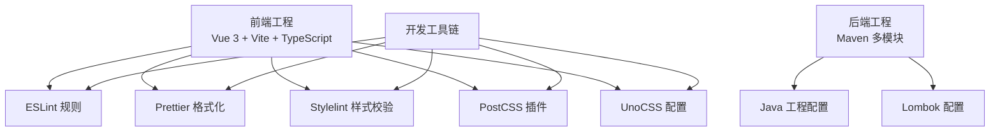
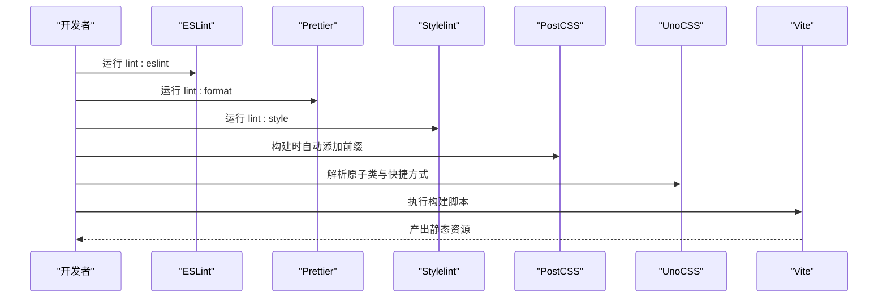
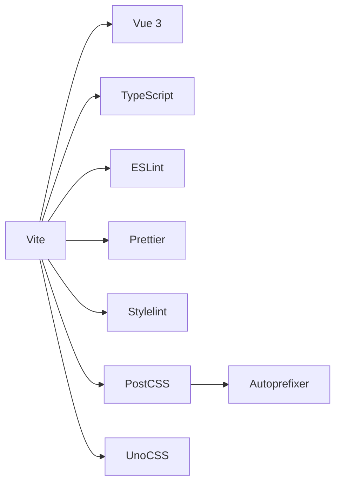

# 编码规范

<cite>
**本文引用的文件**
- [.editorconfig](file://yudao-ui/yudao-ui-admin-vue3/.editorconfig)
- [eslint.config.mjs](file://yudao-ui/yudao-ui-admin-vue3/eslint.config.mjs)
- [prettier.config.js](file://yudao-ui/yudao-ui-admin-vue3/prettier.config.js)
- [stylelint.config.js](file://yudao-ui/yudao-ui-admin-vue3/stylelint.config.js)
- [postcss.config.js](file://yudao-ui/yudao-ui-admin-vue3/postcss.config.js)
- [uno.config.ts](file://yudao-ui/yudao-ui-admin-vue3/uno.config.ts)
- [tsconfig.json](file://yudao-ui/yudao-ui-admin-vue3/tsconfig.json)
- [package.json](file://yudao-ui/yudao-ui-admin-vue3/package.json)
- [vite.config.ts](file://yudao-ui/yudao-ui-admin-vue3/vite.config.ts)
- [README.md](file://README.md)
</cite>

## 目录
1. [简介](#简介)
2. [项目结构](#项目结构)
3. [核心组件](#核心组件)
4. [架构总览](#架构总览)
5. [详细组件分析](#详细组件分析)
6. [依赖分析](#依赖分析)
7. [性能考虑](#性能考虑)
8. [故障排查指南](#故障排查指南)
9. [结论](#结论)
10. [附录](#附录)

## 简介
本指南面向“芋道 ruoyi-vue-pro”项目，系统化地给出 Java 与 Vue 前端的编码规范、Git 提交规范、代码审查清单、IDE 配置建议以及文档注释规范。内容以仓库现有配置为基础，结合通用工程化最佳实践，帮助团队统一风格、提升质量与可维护性。

## 项目结构
- 后端采用多模块 Maven 结构，包含基础框架、业务模块与服务聚合层。
- 前端为 Vue 3 + Vite 工程，使用 TypeScript、Element Plus、Pinia、UnoCSS 等生态。
- 工具链通过脚本与配置实现统一的格式化、校验与构建流程。

图示来源
- [package.json:1-158](file://yudao-ui/yudao-ui-admin-vue3/package.json#L1-L158)
- [eslint.config.mjs:1-116](file://yudao-ui/yudao-ui-admin-vue3/eslint.config.mjs#L1-L116)
- [prettier.config.js:1-23](file://yudao-ui/yudao-ui-admin-vue3/prettier.config.js#L1-L23)
- [stylelint.config.js:1-236](file://yudao-ui/yudao-ui-admin-vue3/stylelint.config.js#L1-L236)
- [postcss.config.js:1-6](file://yudao-ui/yudao-ui-admin-vue3/postcss.config.js#L1-L6)
- [uno.config.ts:1-108](file://yudao-ui/yudao-ui-admin-vue3/uno.config.ts#L1-L108)

章节来源
- [README.md:1-200](file://README.md#L1-L200)

## 核心组件
- 前端工程化工具链：ESLint、Prettier、Stylelint、PostCSS、UnoCSS。
- TypeScript 编译配置与路径别名。
- 构建与脚本命令统一收敛于包管理器脚本。
- 后端多模块结构与公共依赖聚合。

章节来源
- [package.json:1-158](file://yudao-ui/yudao-ui-admin-vue3/package.json#L1-L158)
- [tsconfig.json:1-45](file://yudao-ui/yudao-ui-admin-vue3/tsconfig.json#L1-L45)

## 架构总览
下图展示前端从开发到构建的关键流程，以及与各类工具的交互关系。

图示来源
- [package.json:7-26](file://yudao-ui/yudao-ui-admin-vue3/package.json#L7-L26)
- [postcss.config.js:1-6](file://yudao-ui/yudao-ui-admin-vue3/postcss.config.js#L1-L6)
- [uno.config.ts:1-108](file://yudao-ui/yudao-ui-admin-vue3/uno.config.ts#L1-L108)

## 详细组件分析

### Java 编码规范
- 命名约定
  - 包名：小写，按模块分层，避免缩写。
  - 类名：帕斯卡命名，接口与抽象类语义清晰。
  - 方法名：动词短语，遵循行为导向；常量全大写+下划线。
  - 字段与局部变量：驼峰命名，避免无意义缩写。
- 类设计原则
  - 单一职责、开闭原则、里氏替换、接口隔离、依赖倒置。
  - DTO/VO/BO 分层清晰，避免跨层耦合。
  - 枚举优先替代魔法值，异常类型明确且可定位。
- 方法规范
  - 方法短小、参数精简；必要时使用 Builder/工厂模式。
  - 返回值与异常处理一致，避免空指针与异常吞噬。
- 注释标准
  - 类与接口使用 Javadoc，方法注释描述入参与返回、异常与注意事项。
  - 复杂逻辑处补充行内注释，保持注释与代码同步更新。
- 代码格式化
  - 统一使用 EditorConfig 与 IDE 插件，确保缩进、换行、字符集一致。
  - 重要配置参考：缩进风格为空格、缩进大小为 4、行宽不超过 120、结尾插入换行。

章节来源
- [.editorconfig:1-13](file://yudao-ui/yudao-ui-admin-vue3/.editorconfig#L1-L13)

### Vue 开发规范
- 组件命名
  - 文件名：帕斯卡命名；组件注册：全局或按功能域集中注册。
  - 组件名称：语义化，避免无意义名称；页面级组件建议带领域前缀。
- 模板编写
  - 属性顺序：指令优先，再绑定属性；避免冗余空格与换行。
  - 事件命名：使用中线分隔；自定义事件在子组件显式声明。
- 样式组织
  - 优先使用原子类与 UnoCSS；局部样式尽量作用域化，避免全局污染。
  - SCSS 变量与混入集中管理，命名语义化。
- TypeScript 使用
  - 严格模式开启；为 props、emits、refs 明确定义类型。
  - 在组合式 API 中合理拆分逻辑，保持函数单一职责。
- 响应式设计最佳实践
  - 基于断点与相对单位布局；媒体查询与原子类配合使用。
  - 图标与图片使用响应式容器，避免溢出与变形。

章节来源
- [eslint.config.mjs:57-113](file://yudao-ui/yudao-ui-admin-vue3/eslint.config.mjs#L57-L113)
- [stylelint.config.js:1-236](file://yudao-ui/yudao-ui-admin-vue3/stylelint.config.js#L1-L236)
- [uno.config.ts:1-108](file://yudao-ui/yudao-ui-admin-vue3/uno.config.ts#L1-L108)
- [tsconfig.json:8-23](file://yudao-ui/yudao-ui-admin-vue3/tsconfig.json#L8-L23)

### Git 提交规范
- 提交信息格式
  - 类型(scope): 描述（必填）
  - 类型：feat、fix、docs、style、refactor、perf、test、build、ci、chore
  - scope：模块或功能域，如 ui、server、infra
  - 描述：简洁明确，避免句号结尾；必要时补充动机与影响
- 分支命名规则
  - 功能分支：feature/模块-功能描述
  - 修复分支：fix/模块-问题编号
  - 热修复：hotfix/模块-版本号-描述
- 合并策略
  - 使用 Squash Merge 合并特性分支，保证主干整洁
  - 合并前必须通过 CI 与代码审查
- 版本标签管理
  - 采用语义化版本；发布前生成变更日志，标注破坏性变更与修复

章节来源
- [package.json:90-91](file://yudao-ui/yudao-ui-admin-vue3/package.json#L90-L91)

### 代码审查检查清单
- 代码质量
  - 是否满足单一职责与可测试性
  - 是否存在重复代码与过长函数
  - 是否使用了合适的异常与日志
- 安全性
  - 输入校验与输出转义是否到位
  - 权限控制与敏感信息脱敏
- 性能
  - 组件渲染优化（懒加载、虚拟列表）
  - 样式与资源体积控制（Tree-shaking、按需引入）
- 可维护性
  - 命名一致性与注释完整性
  - 配置与依赖升级策略

章节来源
- [eslint.config.mjs:57-113](file://yudao-ui/yudao-ui-admin-vue3/eslint.config.mjs#L57-L113)
- [stylelint.config.js:1-236](file://yudao-ui/yudao-ui-admin-vue3/stylelint.config.js#L1-L236)

### IDE 配置与代码格式化工具
- IntelliJ IDEA
  - EditorConfig 插件启用；代码风格选择“Project”并应用 EditorConfig
  - 配置“Save Actions”自动格式化与导入整理
  - 使用 SpotBugs/Checkstyle/PMD（如需）增强静态检查
- VS Code
  - 安装 ESLint、Prettier、Stylelint、Vue Language Features 等扩展
  - 设置默认 Formatter 为 Prettier，保存时自动格式化
  - 集成 EditorConfig 与 Settings Sync，统一团队配置
- 工具链集成
  - 通过 pre-commit/lint-staged 在提交前执行格式化与校验

章节来源
- [.editorconfig:1-13](file://yudao-ui/yudao-ui-admin-vue3/.editorconfig#L1-L13)
- [package.json:22-26](file://yudao-ui/yudao-ui-admin-vue3/package.json#L22-L26)

### 文档注释规范
- Javadoc（后端）
  - 类与接口：用途、作者、版本、时间
  - 方法：参数、返回值、异常、线程安全、性能特征
- TypeDoc（前端）
  - 组件：属性、事件、插槽、暴露方法
  - 工具函数：输入、输出、边界条件、错误场景
- Markdown 文档
  - 标题层级清晰；代码块语言标注；表格对齐；链接可用
  - 变更日志按时间倒序，区分 feat/fix/chore

章节来源
- [README.md:1-200](file://README.md#L1-L200)

## 依赖分析
- 前端依赖
  - 运行时：Vue 3、Element Plus、Axios、Pinia、Vue Router
  - 开发时：Vite、TypeScript、ESLint、Prettier、Stylelint、UnoCSS
- 关键依赖关系
  - Vite 作为构建与开发服务器，承载热更新与打包
  - UnoCSS 与 PostCSS 协同实现原子类与浏览器兼容
  - ESLint + Prettier + Stylelint 形成前端三重保障

图示来源
- [package.json:27-88](file://yudao-ui/yudao-ui-admin-vue3/package.json#L27-L88)
- [postcss.config.js:1-6](file://yudao-ui/yudao-ui-admin-vue3/postcss.config.js#L1-L6)
- [uno.config.ts:1-108](file://yudao-ui/yudao-ui-admin-vue3/uno.config.ts#L1-L108)

章节来源
- [package.json:1-158](file://yudao-ui/yudao-ui-admin-vue3/package.json#L1-L158)

## 性能考虑
- 前端
  - 按需加载与路由懒加载；减少第三方包体积，启用 Tree-shaking
  - 原子类优先，避免重复样式；合理使用缓存与持久化状态
- 后端
  - SQL 优化与索引设计；缓存命中率与热点数据治理
  - 并发与限流策略，避免雪崩效应

## 故障排查指南
- ESLint 报错
  - 检查规则覆盖范围与忽略项；确认解析器与 Vue 文件配置
- Prettier 冲突
  - 统一编辑器与 CI 的 Prettier 版本；关闭冲突的格式化插件
- Stylelint 样式问题
  - 校验 UnoCSS 与原子类使用；检查选择器顺序与未知单位
- 构建失败
  - 查看 Vite 日志与 TS 编译错误；清理缓存后重试

章节来源
- [eslint.config.mjs:1-116](file://yudao-ui/yudao-ui-admin-vue3/eslint.config.mjs#L1-L116)
- [prettier.config.js:1-23](file://yudao-ui/yudao-ui-admin-vue3/prettier.config.js#L1-L23)
- [stylelint.config.js:1-236](file://yudao-ui/yudao-ui-admin-vue3/stylelint.config.js#L1-L236)
- [package.json:7-26](file://yudao-ui/yudao-ui-admin-vue3/package.json#L7-L26)

## 结论
本规范以现有工程配置为基线，结合前后端与工具链的最佳实践，形成统一、可落地的编码与协作标准。建议团队在日常开发中严格执行，并根据项目演进持续迭代完善。

## 附录
- 快速命令
  - 开发：运行开发服务器与热更新
  - 格式化：统一执行格式化与样式校验
  - 构建：按环境构建产物并预览
- 配置要点
  - EditorConfig 统一基础格式
  - ESLint/Stylelint/Prettier 三者协同
  - UnoCSS 与 PostCSS 提升样式效率

章节来源
- [package.json:7-26](file://yudao-ui/yudao-ui-admin-vue3/package.json#L7-L26)
- [.editorconfig:1-13](file://yudao-ui/yudao-ui-admin-vue3/.editorconfig#L1-L13)
- [uno.config.ts:1-108](file://yudao-ui/yudao-ui-admin-vue3/uno.config.ts#L1-L108)
- [postcss.config.js:1-6](file://yudao-ui/yudao-ui-admin-vue3/postcss.config.js#L1-L6)