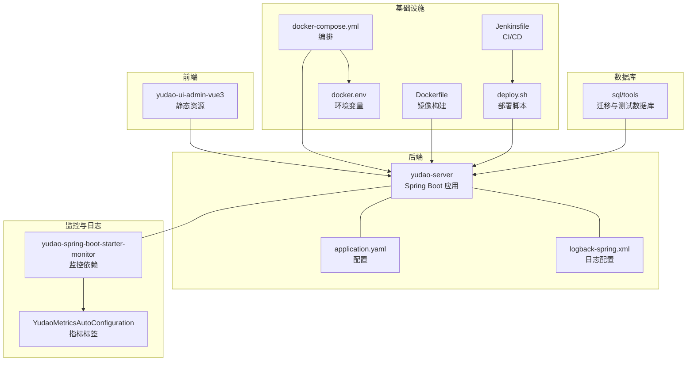
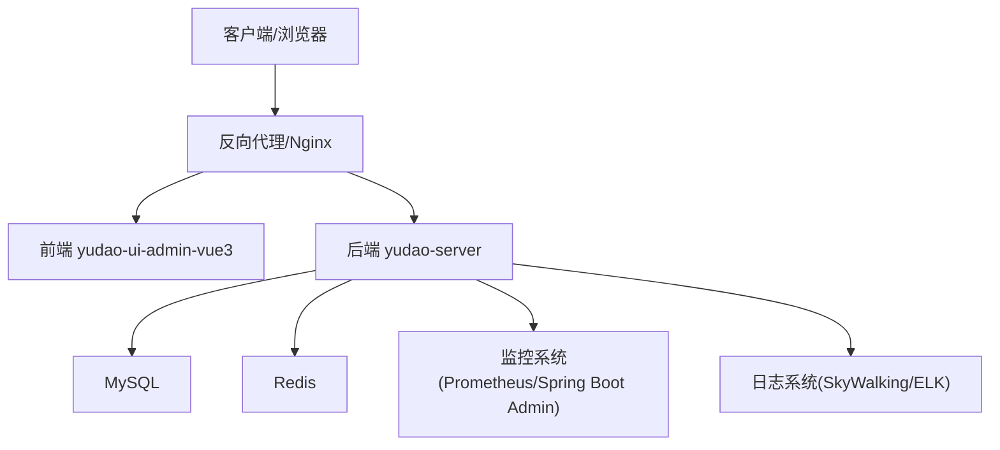
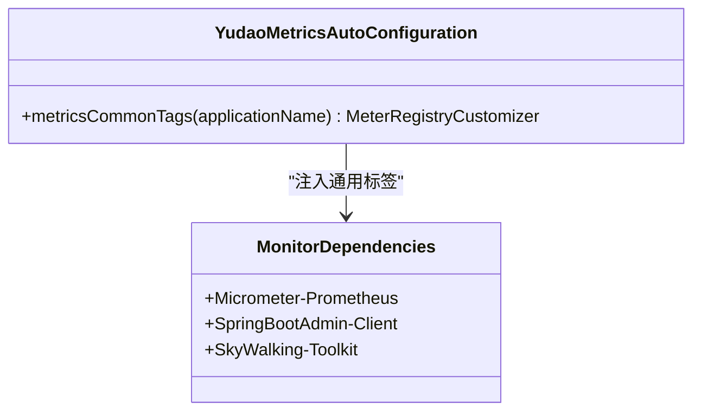
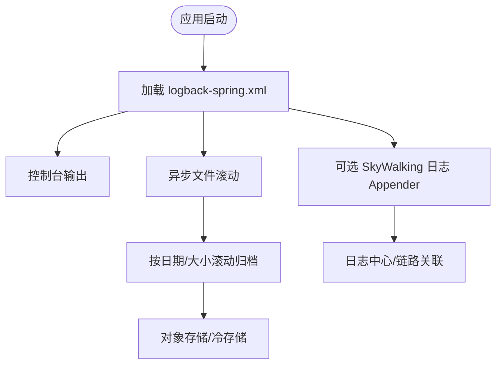
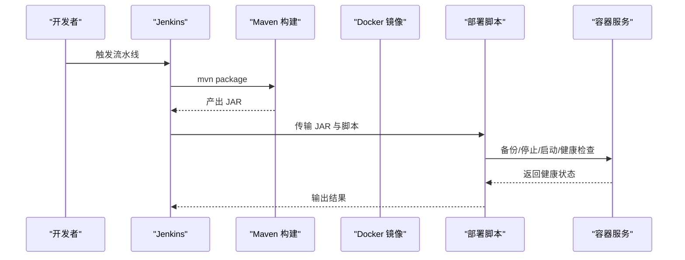
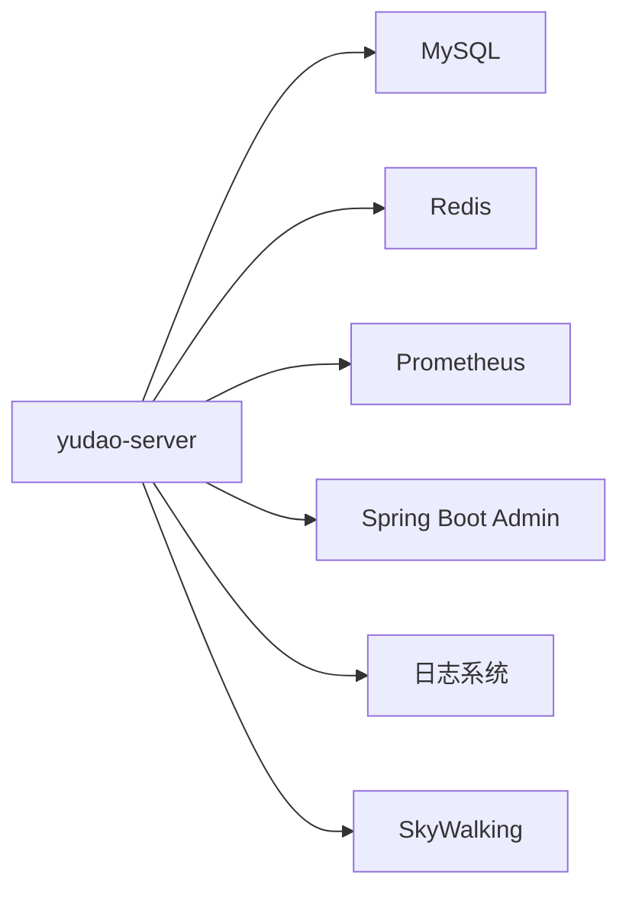

# 运维维护

<cite>
**本文引用的文件**   
- [docker-compose.yml](file://script/docker/docker-compose.yml)
- [docker.env](file://script/docker/docker.env)
- [Dockerfile](file://yudao-server/Dockerfile)
- [deploy.sh](file://script/shell/deploy.sh)
- [Jenkinsfile](file://script/jenkins/Jenkinsfile)
- [application.yaml](file://yudao-server/src/main/resources/application.yaml)
- [logback-spring.xml](file://yudao-server/src/main/resources/logback-spring.xml)
- [yudao-spring-boot-starter-monitor/pom.xml](file://yudao-framework/yudao-spring-boot-starter-monitor/pom.xml)
- [YudaoMetricsAutoConfiguration.java](file://yudao-framework/yudao-spring-boot-starter-monitor/src/main/java/cn/iocoder/yudao/framework/tracer/config/YudaoMetricsAutoConfiguration.java)
- [README.md](file://sql/tools/README.md)
- [convertor.py](file://sql/tools/convertor.py)
</cite>

## 目录
1. [简介](#简介)
2. [项目结构](#项目结构)
3. [核心组件](#核心组件)
4. [架构总览](#架构总览)
5. [详细组件分析](#详细组件分析)
6. [依赖分析](#依赖分析)
7. [性能考虑](#性能考虑)
8. [故障排查指南](#故障排查指南)
9. [结论](#结论)
10. [附录](#附录)

## 简介
本指南面向芋道 ruoyi-vue-pro 的运维与维护团队，围绕监控配置实践、日志管理策略、备份策略设计、容器化部署实践、故障排查方法与运维自动化展开，帮助读者建立一套标准化、可落地的运维体系。

## 项目结构
- 后端服务位于 yudao-server，采用 Spring Boot 构建，提供统一的业务能力与接口。
- 前端 UI 位于 yudao-ui/yudao-ui-admin-vue3，通过 Nginx 或静态服务器对外提供管理界面。
- 脚本与工具集中在 script 目录，包含 Docker 编排、Shell 部署脚本、Jenkins 流水线等。
- 监控与日志能力由 yudao-framework 提供，包含 Micrometer、Prometheus、Spring Boot Admin、SkyWalking 等生态组件。
- 数据库脚本与迁移工具位于 sql 目录，支持多数据库的快速启动与迁移。

**图表来源**
- [docker-compose.yml:1-85](file://script/docker/docker-compose.yml#L1-L85)
- [docker.env:1-26](file://script/docker/docker.env#L1-L26)
- [Dockerfile:1-24](file://yudao-server/Dockerfile#L1-L24)
- [deploy.sh:1-161](file://script/shell/deploy.sh#L1-L161)
- [Jenkinsfile:1-61](file://script/jenkins/Jenkinsfile#L1-L61)
- [application.yaml:1-354](file://yudao-server/src/main/resources/application.yaml#L1-L354)
- [logback-spring.xml:1-57](file://yudao-server/src/main/resources/logback-spring.xml#L1-L57)
- [yudao-spring-boot-starter-monitor/pom.xml:1-80](file://yudao-framework/yudao-spring-boot-starter-monitor/pom.xml#L1-L80)
- [YudaoMetricsAutoConfiguration.java:1-27](file://yudao-framework/yudao-spring-boot-starter-monitor/src/main/java/cn/iocoder/yudao/framework/tracer/config/YudaoMetricsAutoConfiguration.java#L1-L27)
- [README.md:1-131](file://sql/tools/README.md#L1-L131)

**章节来源**
- [docker-compose.yml:1-85](file://script/docker/docker-compose.yml#L1-L85)
- [docker.env:1-26](file://script/docker/docker.env#L1-L26)
- [Dockerfile:1-24](file://yudao-server/Dockerfile#L1-L24)
- [deploy.sh:1-161](file://script/shell/deploy.sh#L1-L161)
- [Jenkinsfile:1-61](file://script/jenkins/Jenkinsfile#L1-L61)
- [application.yaml:1-354](file://yudao-server/src/main/resources/application.yaml#L1-L354)
- [logback-spring.xml:1-57](file://yudao-server/src/main/resources/logback-spring.xml#L1-L57)
- [yudao-spring-boot-starter-monitor/pom.xml:1-80](file://yudao-framework/yudao-spring-boot-starter-monitor/pom.xml#L1-L80)
- [YudaoMetricsAutoConfiguration.java:1-27](file://yudao-framework/yudao-spring-boot-starter-monitor/src/main/java/cn/iocoder/yudao/framework/tracer/config/YudaoMetricsAutoConfiguration.java#L1-L27)
- [README.md:1-131](file://sql/tools/README.md#L1-L131)

## 核心组件
- 容器编排与环境变量：通过 docker-compose.yml 与 docker.env 统一管理 MySQL、Redis、后端服务与前端服务的依赖与参数。
- 镜像构建：Dockerfile 固定基础镜像、时区、JVM 参数与暴露端口，确保镜像一致性。
- 部署与健康检查：deploy.sh 提供备份、优雅停机、启动与健康检查流程，保障变更安全。
- CI/CD：Jenkinsfile 定义检出、构建、打包与部署阶段，便于自动化上线。
- 监控与指标：yudao-spring-boot-starter-monitor 提供 Micrometer、Prometheus、Spring Boot Admin、SkyWalking 等能力；YudaoMetricsAutoConfiguration 注入通用标签。
- 日志：logback-spring.xml 提供控制台、异步文件与可选 SkyWalking GRPC 日志采集。
- 数据库与迁移：sql/tools 提供多数据库快速启动与 SQL 脚本转换工具。

**章节来源**
- [docker-compose.yml:1-85](file://script/docker/docker-compose.yml#L1-L85)
- [docker.env:1-26](file://script/docker/docker.env#L1-L26)
- [Dockerfile:1-24](file://yudao-server/Dockerfile#L1-L24)
- [deploy.sh:1-161](file://script/shell/deploy.sh#L1-L161)
- [Jenkinsfile:1-61](file://script/jenkins/Jenkinsfile#L1-L61)
- [yudao-spring-boot-starter-monitor/pom.xml:1-80](file://yudao-framework/yudao-spring-boot-starter-monitor/pom.xml#L1-L80)
- [YudaoMetricsAutoConfiguration.java:1-27](file://yudao-framework/yudao-spring-boot-starter-monitor/src/main/java/cn/iocoder/yudao/framework/tracer/config/YudaoMetricsAutoConfiguration.java#L1-L27)
- [logback-spring.xml:1-57](file://yudao-server/src/main/resources/logback-spring.xml#L1-L57)
- [README.md:1-131](file://sql/tools/README.md#L1-L131)

## 架构总览
下图展示生产环境典型拓扑：前端通过反向代理或网关对外提供服务，后端服务通过容器编排与环境变量连接 MySQL 与 Redis，日志与指标分别接入集中化日志与监控系统。

[本图为概念性架构示意，不直接映射具体源码文件，故不附“图表来源”]

## 详细组件分析

### 监控配置实践
- 指标与标签
  - 通过 yudao-spring-boot-starter-monitor 引入 Micrometer 与 Prometheus 支持，YudaoMetricsAutoConfiguration 注入通用标签，便于跨实例聚合与筛选。
  - application.yaml 中启用 Actuator 端点，结合 Spring Boot Admin 采集运行时指标。
- 性能监控
  - 使用 SkyWalking Agent 与日志插件，实现链路追踪与日志中心化采集。
  - 建议在生产环境启用 SkyWalking 日志 Appender，并配置忽略路径以降低开销。
- 业务监控
  - 业务关键接口与任务可结合 Micrometer 自定义指标，配合告警规则进行阈值报警。
- 告警规则
  - Prometheus 报警规则建议覆盖：HTTP 错误率、响应时间 P95/P99、线程池饱和度、GC 次数/耗时、数据库连接池可用率、磁盘与内存使用率等。

**图表来源**
- [YudaoMetricsAutoConfiguration.java:1-27](file://yudao-framework/yudao-spring-boot-starter-monitor/src/main/java/cn/iocoder/yudao/framework/tracer/config/YudaoMetricsAutoConfiguration.java#L1-L27)
- [yudao-spring-boot-starter-monitor/pom.xml:1-80](file://yudao-framework/yudao-spring-boot-starter-monitor/pom.xml#L1-L80)

**章节来源**
- [yudao-spring-boot-starter-monitor/pom.xml:1-80](file://yudao-framework/yudao-spring-boot-starter-monitor/pom.xml#L1-L80)
- [YudaoMetricsAutoConfiguration.java:1-27](file://yudao-framework/yudao-spring-boot-starter-monitor/src/main/java/cn/iocoder/yudao/framework/tracer/config/YudaoMetricsAutoConfiguration.java#L1-L27)
- [application.yaml:1-354](file://yudao-server/src/main/resources/application.yaml#L1-L354)

### 日志管理策略
- 日志收集配置
  - logback-spring.xml 提供控制台与异步文件 Appender，支持按日期与大小滚动，建议在生产环境启用 SkyWalking GRPC 日志 Appender，实现链路级日志采集。
- 日志分级管理
  - 根据业务模块与第三方库设置不同级别，避免 INFO 级别刷屏；对异常堆栈与关键路径进行 ERROR/WARN 级别记录。
- 日志分析工具
  - 建议对接 ELK 或 Loki/Grafana，结合 TraceId 进行跨服务检索与聚合分析。
- 日志归档策略
  - 建议按 30 天滚动归档，压缩存储于对象存储或冷存储，定期清理过期日志。

**图表来源**
- [logback-spring.xml:1-57](file://yudao-server/src/main/resources/logback-spring.xml#L1-L57)

**章节来源**
- [logback-spring.xml:1-57](file://yudao-server/src/main/resources/logback-spring.xml#L1-L57)

### 备份策略设计
- 数据备份方案
  - MySQL：建议使用逻辑备份（mysqldump）与物理备份（Percona XtraBackup）相结合，按需进行全量与增量备份。
  - Redis：持久化采用 RDB 快照与 AOF 追加，结合定期快照与复制链路保护。
- 备份频率设置
  - 全量：每日一次；增量：每 5-15 分钟一次；归档：每周保留一周，每月保留一个月。
- 备份验证
  - 定期进行恢复演练，验证备份完整性与可恢复性。
- 灾难恢复测试
  - 每季度进行跨数据中心恢复演练，验证跨地域容灾能力。

[本节为通用运维建议，不直接分析具体源码文件，故不附“章节来源”]

### 容器化部署实践
- Docker 镜像构建
  - Dockerfile 固定 eclipse-temurin:21-jre 基础镜像，设置时区与 JVM 参数，暴露 48080 端口，CMD 启动应用。
- 容器编排配置
  - docker-compose.yml 定义 mysql、redis、server、admin 四个服务，使用环境变量与卷挂载，确保数据持久化与配置隔离。
- 服务发现与负载均衡
  - 在 Kubernetes 环境中，建议通过 Headless Service 与 Deployment 实现服务发现，使用 Ingress/NLB 实现外部流量接入与负载均衡。
- 环境变量与配置
  - docker.env 统一管理数据库、Redis、JVM 与前端参数，便于多环境切换。

**图表来源**
- [Jenkinsfile:1-61](file://script/jenkins/Jenkinsfile#L1-L61)
- [deploy.sh:1-161](file://script/shell/deploy.sh#L1-L161)
- [Dockerfile:1-24](file://yudao-server/Dockerfile#L1-L24)
- [docker-compose.yml:1-85](file://script/docker/docker-compose.yml#L1-L85)
- [docker.env:1-26](file://script/docker/docker.env#L1-L26)

**章节来源**
- [Dockerfile:1-24](file://yudao-server/Dockerfile#L1-L24)
- [docker-compose.yml:1-85](file://script/docker/docker-compose.yml#L1-L85)
- [docker.env:1-26](file://script/docker/docker.env#L1-L26)
- [deploy.sh:1-161](file://script/shell/deploy.sh#L1-L161)
- [Jenkinsfile:1-61](file://script/jenkins/Jenkinsfile#L1-L61)

### 故障排查方法
- 日志分析技巧
  - 使用 TraceId 关联请求链路，结合 SkyWalking 或日志中心进行跨服务检索；关注 ERROR/WARN 级别与慢调用。
- 性能问题定位
  - 通过 Actuator 指标与 Micrometer/Prometheus 抓取 CPU、内存、GC、线程池、数据库连接池等关键指标，定位瓶颈。
- 网络问题诊断
  - 检查容器间网络连通性、DNS 解析与端口映射；在 Kubernetes 中检查 Service、Endpoint、Ingress 与防火墙策略。
- 数据库问题处理
  - 关注慢查询、锁等待、连接数上限与缓冲池命中率；必要时进行索引优化与 SQL 调优。

[本节为通用运维建议，不直接分析具体源码文件，故不附“章节来源”]

### 运维自动化
- 部署脚本编写
  - deploy.sh 已实现备份、优雅停机、启动与健康检查，建议在生产环境增加幂等与回滚策略。
- 监控告警配置
  - 基于 Prometheus 与 Alertmanager 配置告警规则，结合企业微信/钉钉通知。
- 自动扩缩容
  - 在 Kubernetes 中使用 HPA/VPAs 实现基于 CPU/内存与自定义指标的自动扩缩容。
- 运维流程自动化
  - Jenkinsfile 已覆盖检出、构建与部署，建议扩展到镜像构建、推送与集群部署。

**章节来源**
- [deploy.sh:1-161](file://script/shell/deploy.sh#L1-L161)
- [Jenkinsfile:1-61](file://script/jenkins/Jenkinsfile#L1-L61)

## 依赖分析
- 组件耦合
  - 后端服务依赖 MySQL 与 Redis；监控依赖 Prometheus 与 Spring Boot Admin；日志可选 SkyWalking。
- 外部依赖
  - Docker Compose、Jenkins、Prometheus、Grafana、SkyWalking、ELK/Loki 等。
- 潜在风险
  - 环境变量泄露、镜像版本漂移、健康检查超时、日志堆积导致磁盘占满。

**图表来源**
- [docker-compose.yml:1-85](file://script/docker/docker-compose.yml#L1-L85)
- [application.yaml:1-354](file://yudao-server/src/main/resources/application.yaml#L1-L354)
- [yudao-spring-boot-starter-monitor/pom.xml:1-80](file://yudao-framework/yudao-spring-boot-starter-monitor/pom.xml#L1-L80)
- [logback-spring.xml:1-57](file://yudao-server/src/main/resources/logback-spring.xml#L1-L57)

**章节来源**
- [docker-compose.yml:1-85](file://script/docker/docker-compose.yml#L1-L85)
- [application.yaml:1-354](file://yudao-server/src/main/resources/application.yaml#L1-L354)
- [yudao-spring-boot-starter-monitor/pom.xml:1-80](file://yudao-framework/yudao-spring-boot-starter-monitor/pom.xml#L1-L80)
- [logback-spring.xml:1-57](file://yudao-server/src/main/resources/logback-spring.xml#L1-L57)

## 性能考虑
- JVM 参数
  - Dockerfile 与 deploy.sh 均设置了固定堆大小与安全随机源参数，建议根据业务峰值调整并开启 HeapDumpOnOutOfMemoryError。
- 日志性能
  - 使用 Async Appender 与合理队列长度，避免阻塞主线程；按需启用 SkyWalking 日志 Appender。
- 数据库连接
  - 合理配置连接池大小与超时时间，避免连接泄漏；对慢查询进行索引优化。
- 缓存策略
  - Redis TTL 合理设置，避免缓存雪崩；对热点数据进行预热。

**章节来源**
- [Dockerfile:1-24](file://yudao-server/Dockerfile#L1-L24)
- [deploy.sh:1-161](file://script/shell/deploy.sh#L1-L161)
- [logback-spring.xml:1-57](file://yudao-server/src/main/resources/logback-spring.xml#L1-L57)
- [application.yaml:1-354](file://yudao-server/src/main/resources/application.yaml#L1-L354)

## 故障排查指南
- 健康检查失败
  - 检查 Actuator 健康端点与容器日志；确认数据库与 Redis 连通性。
- 启动卡顿
  - 查看 GC 日志与堆转储；评估线程池与数据库连接池占用。
- 日志异常
  - 检查 Async 队列是否积压；确认滚动策略与磁盘空间。
- 数据库异常
  - 关注慢查询日志与锁等待；核对连接数上限与缓冲池配置。

**章节来源**
- [deploy.sh:106-143](file://script/shell/deploy.sh#L106-L143)
- [logback-spring.xml:1-57](file://yudao-server/src/main/resources/logback-spring.xml#L1-L57)
- [application.yaml:1-354](file://yudao-server/src/main/resources/application.yaml#L1-L354)

## 结论
通过标准化的容器化编排、完善的监控与日志体系、严格的备份与灾难恢复流程，以及自动化的 CI/CD 与运维脚本，ruoyi-vue-pro 可以在生产环境中保持稳定、可观测与可演进。建议持续完善告警规则、进行定期演练与容量规划，确保系统在高并发与复杂场景下的可靠性。

## 附录
- 数据库迁移工具
  - sql/tools/README.md 与 convertor.py 提供多数据库脚本转换能力，便于在不同数据库间迁移与测试。
- 快速启动测试数据库
  - 支持 MySQL、Oracle、PostgreSQL、SQL Server、DM 等数据库的快速启动与初始化脚本导入。

**章节来源**
- [README.md:1-131](file://sql/tools/README.md#L1-L131)
- [convertor.py:1-549](file://sql/tools/convertor.py#L1-L549)