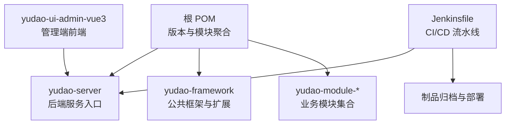
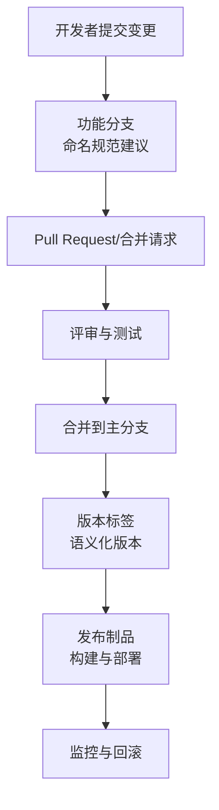
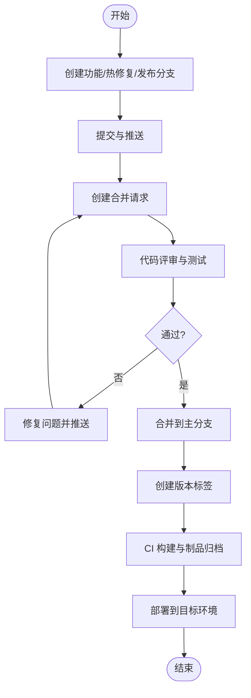
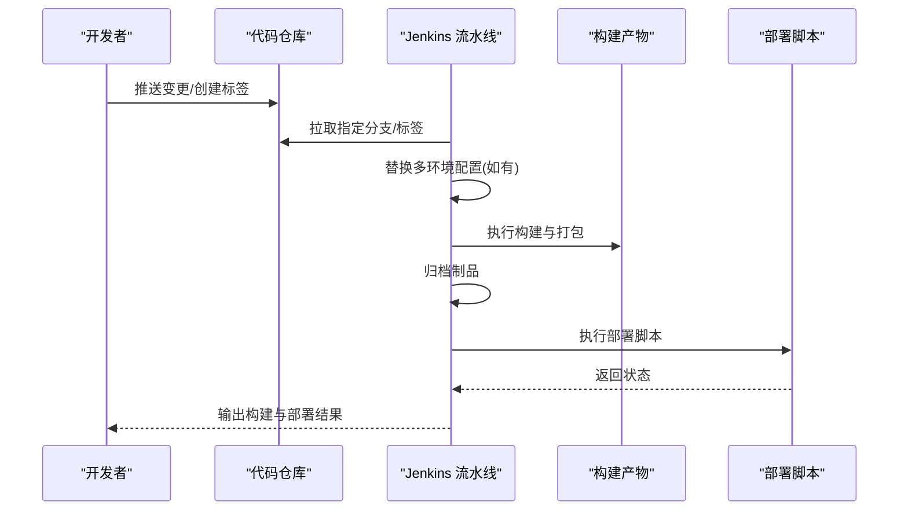
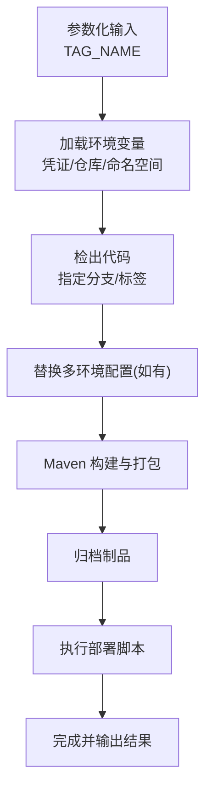
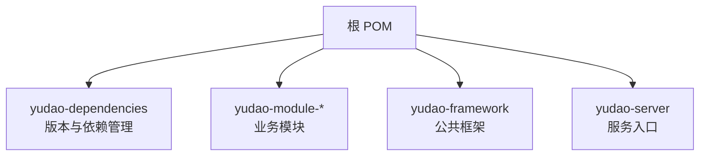

# 项目管理

<cite>
**本文引用的文件**
- [Jenkinsfile](file://script/jenkins/Jenkinsfile)
- [根 POM](file://pom.xml)
- [项目总览](file://README.md)
- [yudao-ui 管理端 README](file://yudao-ui/yudao-ui-admin-vue3/README.md)
</cite>

## 目录
1. [引言](#引言)
2. [项目结构](#项目结构)
3. [核心组件](#核心组件)
4. [架构总览](#架构总览)
5. [详细组件分析](#详细组件分析)
6. [依赖分析](#依赖分析)
7. [性能考虑](#性能考虑)
8. [故障排查指南](#故障排查指南)
9. [结论](#结论)
10. [附录](#附录)

## 引言
本指南面向“芋道 ruoyi-vue-pro”项目的管理与协作，围绕版本控制策略、分支与标签管理、发布流程、变更管理、CI/CD（Jenkins）、以及项目文档管理等方面，提供可落地的实践建议与可视化说明。目标是帮助团队建立稳定、可追溯、可扩展的项目管理体系。

## 项目结构
- 后端采用多模块 Maven 结构，顶层 POM 管理模块与版本，便于统一升级与构建。
- 前端为独立的 Vue3 管理端工程，配合后端服务提供完整的业务能力。
- CI/CD 通过 Jenkins 流水线实现，覆盖检出、构建、打包、归档与部署。
- 项目文档以 README 为主，辅以各模块的学习指南与功能说明。

**图示来源**
- [根 POM:10-32](file://pom.xml#L10-L32)
- [Jenkinsfile:29-59](file://script/jenkins/Jenkinsfile#L29-L59)

**章节来源**
- [根 POM:10-32](file://pom.xml#L10-L32)
- [项目总览:324-348](file://README.md#L324-L348)

## 核心组件
- 版本与构建
  - 顶层 POM 使用可展开的 revision 作为版本占位符，并通过 flatten-maven-plugin 在构建时固化版本，确保多模块一致性。
  - Maven 仓库使用国内镜像加速依赖下载。
- 前后端协同
  - 前端管理端与后端服务通过 API 协同，前端 README 提供功能清单与进度说明，便于对齐需求与验收。
- CI/CD
  - Jenkinsfile 定义了参数化构建（支持传入 TAG_NAME）、环境变量（凭证、镜像仓库、部署目录等）、检出、构建、打包与部署阶段。

**章节来源**
- [根 POM:38-52](file://pom.xml#L38-L52)
- [根 POM:121-147](file://pom.xml#L121-L147)
- [根 POM:151-163](file://pom.xml#L151-L163)
- [项目总览:324-348](file://README.md#L324-L348)
- [yudao-ui 管理端 README:132-157](file://yudao-ui/yudao-ui-admin-vue3/README.md#L132-L157)
- [Jenkinsfile:6-27](file://script/jenkins/Jenkinsfile#L6-L27)
- [Jenkinsfile:29-59](file://script/jenkins/Jenkinsfile#L29-L59)

## 架构总览
下图展示版本控制、分支策略、标签管理与发布流程的关系，以及 CI/CD 在其中的位置。

[本图为概念性示意，不直接映射具体文件，故无“图示来源”]

## 详细组件分析

### 版本控制策略与分支管理规范
- 主分支保护
  - master/main 作为受保护的稳定基线，禁止直接推送；所有改动必须通过 MR/PR 并通过 CI 与评审。
- 功能分支命名
  - 建议采用 feature/前缀，例如 feature/模块-功能点，便于追踪与合并。
- 热修复分支
  - hotfix/前缀，从最近标签或主分支切出，修复后同时合并回主分支与发布分支。
- 发布分支
  - release/前缀，用于发布前的最终验证与小修，完成后合并回主分支并打标签。
- 标签管理
  - 使用语义化版本（MAJOR.MINOR.PATCH），发布前在 CI 中传入 TAG_NAME 参数，流水线负责构建与推送镜像/制品。

[本图为概念性流程，不直接映射具体文件，故无“图示来源”]

**章节来源**
- [Jenkinsfile:6-8](file://script/jenkins/Jenkinsfile#L6-L8)

### 发布流程管理
- 版本号规则
  - 采用语义化版本（MAJOR.MINOR.PATCH）。在 CI 中通过参数化输入 TAG_NAME，确保发布版本与制品一致。
- 发布计划
  - 在里程碑或发布分支中明确版本计划与验收标准，确保前后端对齐。
- 构建与部署
  - Jenkinsfile 定义了检出、构建、打包、归档与部署步骤，支持多环境配置替换与制品分发。

**图示来源**
- [Jenkinsfile:29-59](file://script/jenkins/Jenkinsfile#L29-L59)

**章节来源**
- [Jenkinsfile:6-8](file://script/jenkins/Jenkinsfile#L6-L8)
- [Jenkinsfile:29-59](file://script/jenkins/Jenkinsfile#L29-L59)

### 变更管理方法
- 需求变更控制
  - 通过 Issue/需求文档记录变更，MR/PR 明确变更范围与影响面。
- 技术债务管理
  - 在评审阶段识别技术债，纳入迭代计划并设定偿还优先级。
- 影响评估
  - 通过单元测试与集成测试评估变更影响；必要时在预发布环境验证。
- 回滚策略
  - 以标签与制品为依据，回滚到上一个稳定版本；结合监控指标确认回滚有效性。

[本节为通用实践说明，不直接分析具体文件，故无“章节来源”]

### 持续集成与持续部署（CI/CD）
- Jenkins 配置要点
  - 参数化构建：支持传入 TAG_NAME，便于精准发布。
  - 环境变量：集中管理凭证、镜像仓库、部署路径等。
  - 多环境配置替换：在构建前将本地资源覆盖到对应环境配置。
- 自动化测试
  - Maven Surefire 插件用于运行单元测试，建议在 CI 中强制执行。
- 构建流水线
  - 清理、编译、打包、归档制品，确保产物可追溯。
- 部署策略
  - 通过部署脚本将制品分发到目标目录并执行部署，支持回滚与状态检查。

**图示来源**
- [Jenkinsfile:6-27](file://script/jenkins/Jenkinsfile#L6-L27)
- [Jenkinsfile:29-59](file://script/jenkins/Jenkinsfile#L29-L59)

**章节来源**
- [Jenkinsfile:6-27](file://script/jenkins/Jenkinsfile#L6-L27)
- [Jenkinsfile:29-59](file://script/jenkins/Jenkinsfile#L29-L59)
- [根 POM:69-75](file://pom.xml#L69-L75)

### 项目文档管理
- 技术文档维护
  - 以 README 为核心，结合各模块学习指南与功能说明，形成“总览—模块—细节”的文档体系。
- API 文档更新
  - 基于 SpringDoc/Swagger 自动生成接口文档，随版本发布同步更新。
- 用户手册编写
  - 前端 README 提供功能清单与演示地址，便于用户理解与使用。
- 知识库建设
  - 建议沉淀常见问题、最佳实践与迁移指南，形成可检索的知识库。

**章节来源**
- [项目总览:324-348](file://README.md#L324-L348)
- [yudao-ui 管理端 README:132-157](file://yudao-ui/yudao-ui-admin-vue3/README.md#L132-L157)

## 依赖分析
- 版本与模块耦合
  - 顶层 POM 通过 dependencyManagement 导入 yudao-dependencies，统一版本与依赖范围，降低模块间版本漂移风险。
  - flatten-maven-plugin 在构建期固化版本，避免多模块版本不一致问题。
- 外部依赖与镜像
  - 使用华为云与阿里云 Maven 镜像，提升依赖下载稳定性与速度。

**图示来源**
- [根 POM:54-64](file://pom.xml#L54-L64)
- [根 POM:10-32](file://pom.xml#L10-L32)

**章节来源**
- [根 POM:54-64](file://pom.xml#L54-L64)
- [根 POM:10-32](file://pom.xml#L10-L32)
- [根 POM:151-163](file://pom.xml#L151-L163)

## 性能考虑
- 构建性能
  - 使用国内镜像源与并行构建，缩短依赖下载与编译时间。
  - 在 CI 中启用增量构建与缓存策略（如 Maven 本地仓库缓存）。
- 部署性能
  - 通过参数化标签与制品归档，减少重复构建；部署脚本尽量幂等与可回滚。

[本节提供通用指导，不直接分析具体文件，故无“章节来源”]

## 故障排查指南
- 构建失败
  - 检查 Maven 插件版本与 Java 版本是否匹配；确认镜像源可用。
- 部署失败
  - 核对 Jenkins 环境变量与凭证；检查部署脚本权限与目标路径。
- 回滚策略
  - 以标签与制品为依据，回滚到上一个稳定版本；结合监控指标确认恢复。

**章节来源**
- [Jenkinsfile:6-27](file://script/jenkins/Jenkinsfile#L6-L27)
- [Jenkinsfile:50-59](file://script/jenkins/Jenkinsfile#L50-L59)

## 结论
通过规范的版本控制与分支策略、清晰的发布流程、完善的 CI/CD 与文档管理，能够有效提升“芋道 ruoyi-vue-pro”项目的交付质量与协作效率。建议团队在实践中持续优化流程与工具链，确保版本一致性、可追溯性与可回滚性。

## 附录
- 建议补充
  - 在仓库中增加分支保护规则与 PR 模plate，统一评审与合并标准。
  - 在 CI 中增加静态扫描与安全扫描，提升代码质量与安全性。
  - 建立发布日志与变更记录，便于审计与复盘。

[本节为建议性内容，不直接分析具体文件，故无“章节来源”]