# CRM客户关系管理模块

<cite>
**本文档引用的文件**
- [yudao-module-crm/pom.xml](file://yudao-module-crm/pom.xml)
- [CrmCustomerController.java](file://yudao-module-crm/src/main/java/cn/iocoder/yudao/module/crm/controller/admin/customer/CrmCustomerController.java)
- [CrmCustomerServiceImpl.java](file://yudao-module-crm/src/main/java/cn/iocoder/yudao/module/crm/service/customer/CrmCustomerServiceImpl.java)
- [CrmCustomerDO.java](file://yudao-module-crm/src/main/java/cn/iocoder/yudao/module/crm/dal/dataobject/customer/CrmCustomerDO.java)
- [CrmClueController.java](file://yudao-module-crm/src/main/java/cn/iocoder/yudao/module/crm/controller/admin/clue/CrmClueController.java)
- [CrmClueServiceImpl.java](file://yudao-module-crm/src/main/java/cn/iocoder/yudao/module/crm/service/clue/CrmClueServiceImpl.java)
- [CrmBusinessController.java](file://yudao-module-crm/src/main/java/cn/iocoder/yudao/module/crm/controller/admin/business/CrmBusinessController.java)
- [CrmBusinessServiceImpl.java](file://yudao-module-crm/src/main/java/cn/iocoder/yudao/module/crm/service/business/CrmBusinessServiceImpl.java)
- [CrmCustomerMapper.java](file://yudao-module-crm/src/main/java/cn/iocoder/yudao/module/crm/dal/mysql/customer/CrmCustomerMapper.java)
- [CrmCustomerLevelEnum.java](file://yudao-module-crm/src/main/java/cn/iocoder/yudao/module/crm/enums/customer/CrmCustomerLevelEnum.java)
- [CrmBizTypeEnum.java](file://yudao-module-crm/src/main/java/cn/iocoder/yudao/module/crm/enums/common/CrmBizTypeEnum.java)
</cite>

## 目录
1. [简介](#简介)
2. [项目结构](#项目结构)
3. [核心组件](#核心组件)
4. [架构概览](#架构概览)
5. [详细组件分析](#详细组件分析)
6. [依赖关系分析](#依赖关系分析)
7. [性能考虑](#性能考虑)
8. [故障排除指南](#故障排除指南)
9. [结论](#结论)

## 简介

CRM客户关系管理模块是基于ruoyi-vue-pro项目的完整客户关系管理系统，提供全面的企业级客户管理解决方案。该模块实现了现代CRM系统的核心功能，包括客户管理、线索跟踪、商机管理、联系人管理、合同管理和回款管理等业务场景。

本模块采用分层架构设计，通过清晰的职责分离实现了高内聚、低耦合的系统结构。系统支持多租户、数据权限控制、操作日志记录、Excel导入导出等企业级特性，为企业提供完整的客户关系管理能力。

## 项目结构

CRM模块采用标准的Maven多模块架构，按照业务领域进行模块划分：

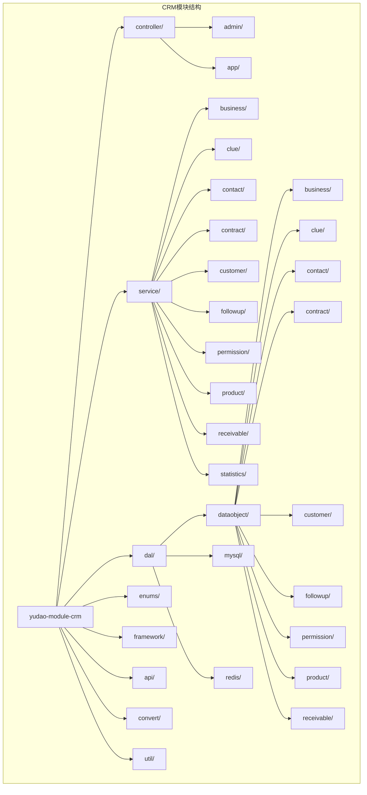

**图表来源**
- [yudao-module-crm/pom.xml:1-77](file://yudao-module-crm/pom.xml#L1-L77)

**章节来源**
- [yudao-module-crm/pom.xml:1-77](file://yudao-module-crm/pom.xml#L1-L77)

## 核心组件

### 客户管理核心组件

CRM模块的核心是客户管理功能，提供了完整的客户生命周期管理能力：

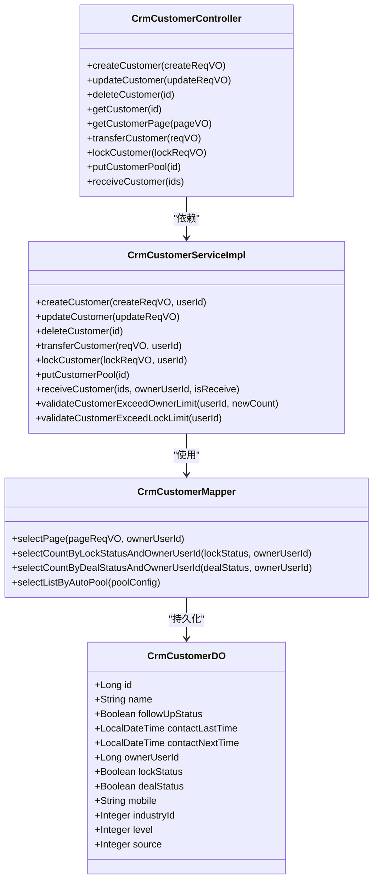

**图表来源**
- [CrmCustomerController.java:53-317](file://yudao-module-crm/src/main/java/cn/iocoder/yudao/module/crm/controller/admin/customer/CrmCustomerController.java#L53-L317)
- [CrmCustomerServiceImpl.java:65-658](file://yudao-module-crm/src/main/java/cn/iocoder/yudao/module/crm/service/customer/CrmCustomerServiceImpl.java#L65-L658)
- [CrmCustomerDO.java:25-128](file://yudao-module-crm/src/main/java/cn/iocoder/yudao/module/crm/dal/dataobject/customer/CrmCustomerDO.java#L25-L128)
- [CrmCustomerMapper.java:31-184](file://yudao-module-crm/src/main/java/cn/iocoder/yudao/module/crm/dal/mysql/customer/CrmCustomerMapper.java#L31-L184)

### 线索管理组件

线索管理提供了从潜在客户到正式客户的转化流程：

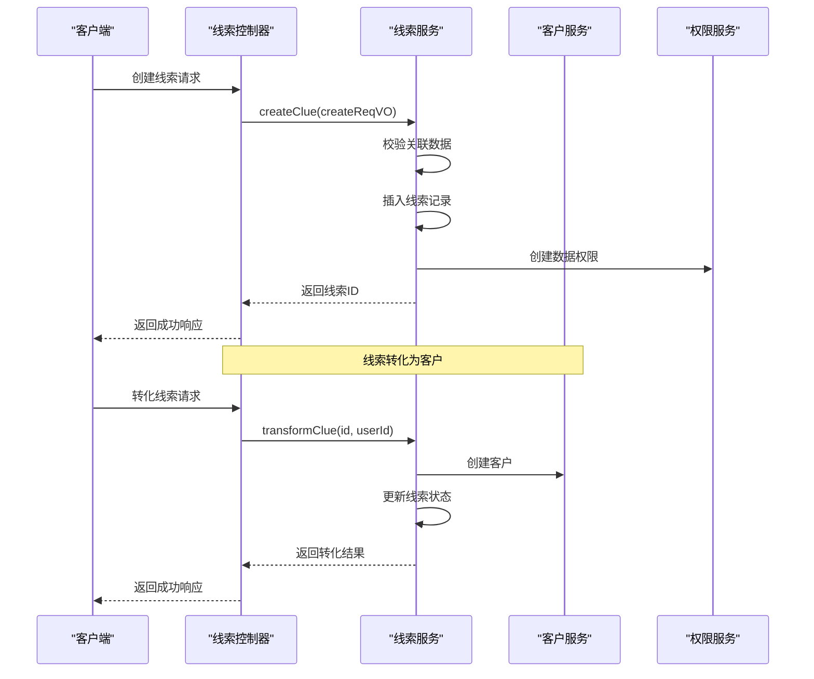

**图表来源**
- [CrmClueController.java:64-174](file://yudao-module-crm/src/main/java/cn/iocoder/yudao/module/crm/controller/admin/clue/CrmClueController.java#L64-L174)
- [CrmClueServiceImpl.java:71-206](file://yudao-module-crm/src/main/java/cn/iocoder/yudao/module/crm/service/clue/CrmClueServiceImpl.java#L71-L206)

### 商机管理组件

商机管理提供了销售机会的全生命周期管理：

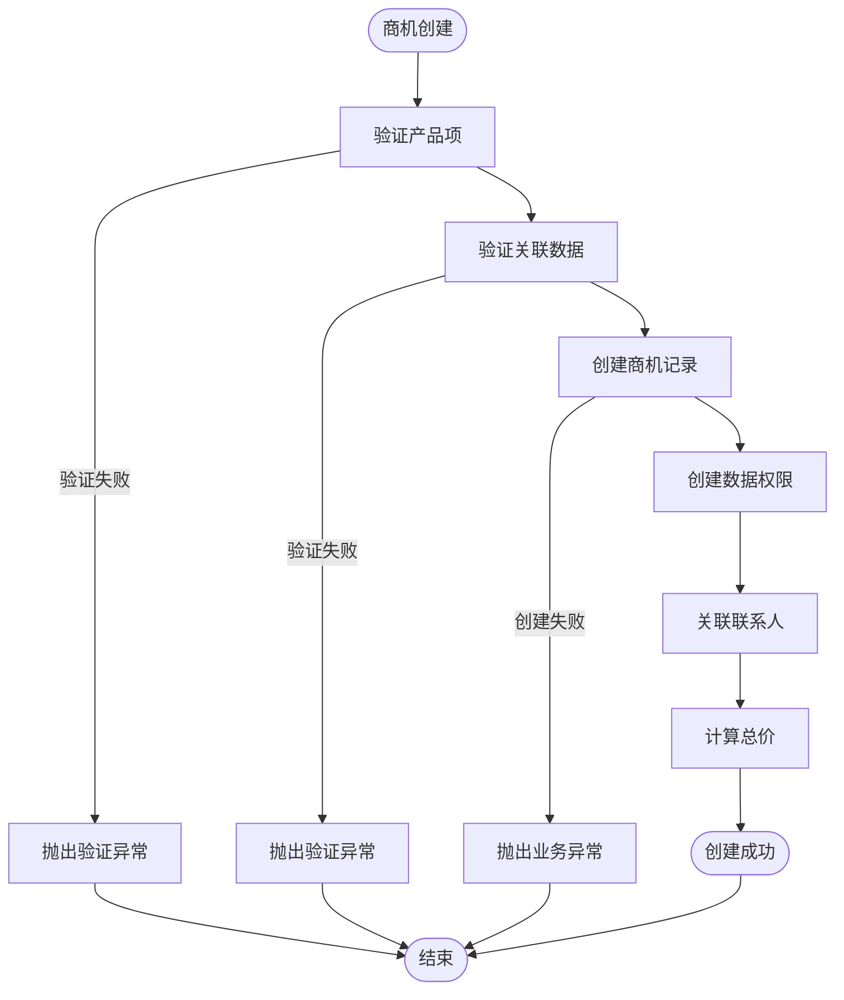

**图表来源**
- [CrmBusinessServiceImpl.java:90-121](file://yudao-module-crm/src/main/java/cn/iocoder/yudao/module/crm/service/business/CrmBusinessServiceImpl.java#L90-L121)

**章节来源**
- [CrmCustomerController.java:1-317](file://yudao-module-crm/src/main/java/cn/iocoder/yudao/module/crm/controller/admin/customer/CrmCustomerController.java#L1-L317)
- [CrmCustomerServiceImpl.java:1-658](file://yudao-module-crm/src/main/java/cn/iocoder/yudao/module/crm/service/customer/CrmCustomerServiceImpl.java#L1-L658)
- [CrmClueController.java:1-174](file://yudao-module-crm/src/main/java/cn/iocoder/yudao/module/crm/controller/admin/clue/CrmClueController.java#L1-L174)
- [CrmClueServiceImpl.java:1-233](file://yudao-module-crm/src/main/java/cn/iocoder/yudao/module/crm/service/clue/CrmClueServiceImpl.java#L1-L233)
- [CrmBusinessController.java:1-223](file://yudao-module-crm/src/main/java/cn/iocoder/yudao/module/crm/controller/admin/business/CrmBusinessController.java#L1-L223)
- [CrmBusinessServiceImpl.java:1-386](file://yudao-module-crm/src/main/java/cn/iocoder/yudao/module/crm/service/business/CrmBusinessServiceImpl.java#L1-L386)

## 架构概览

CRM模块采用经典的三层架构设计，结合了领域驱动设计和企业级应用的最佳实践：

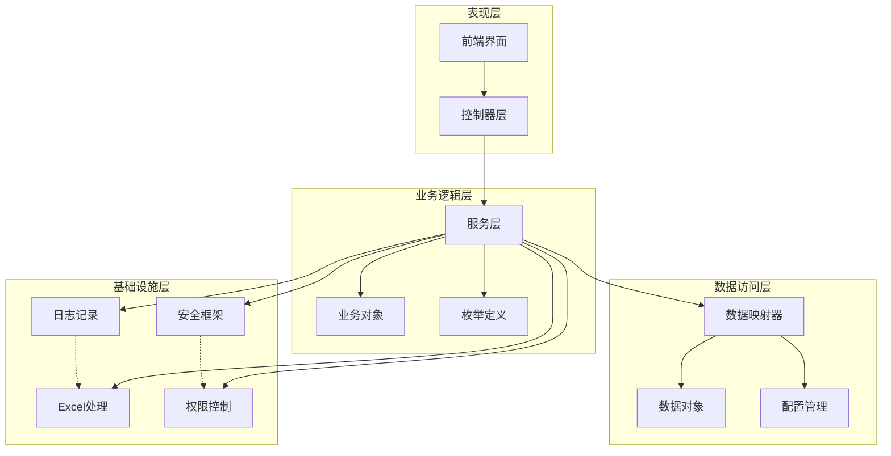

**图表来源**
- [yudao-module-crm/pom.xml:20-75](file://yudao-module-crm/pom.xml#L20-L75)

### 数据模型设计

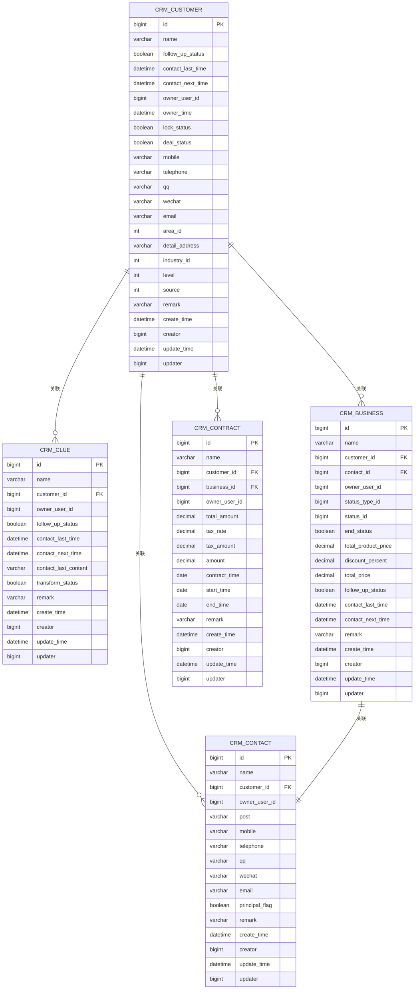

**图表来源**
- [CrmCustomerDO.java:25-128](file://yudao-module-crm/src/main/java/cn/iocoder/yudao/module/crm/dal/dataobject/customer/CrmCustomerDO.java#L25-L128)

## 详细组件分析

### 客户管理模块

客户管理是CRM系统的核心功能，提供了完整的客户生命周期管理：

#### 客户状态管理

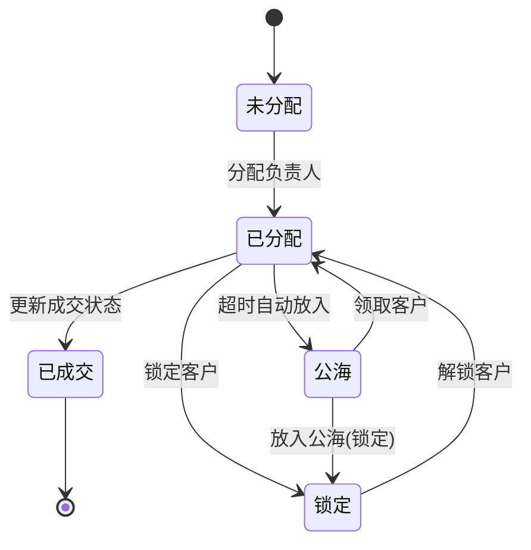

#### 客户权限控制

系统实现了细粒度的数据权限控制，支持多种权限级别：

| 权限级别 | 描述 | 允许操作 |
|---------|------|----------|
| OWNER | 负责人 | 完整权限，包括删除和转移 |
| WRITE | 写权限 | 读写权限，但不能转移或删除 |
| READ | 读权限 | 仅查看权限 |

**章节来源**
- [CrmCustomerServiceImpl.java:206-250](file://yudao-module-crm/src/main/java/cn/iocoder/yudao/module/crm/service/customer/CrmCustomerServiceImpl.java#L206-L250)
- [CrmBizTypeEnum.java:18-28](file://yudao-module-crm/src/main/java/cn/iocoder/yudao/module/crm/enums/common/CrmBizTypeEnum.java#L18-L28)

### 线索管理模块

线索管理实现了从潜在客户到正式客户的完整转化流程：

#### 线索转化流程

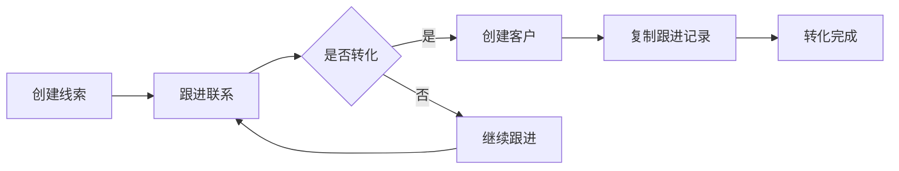

#### 线索状态跟踪

系统支持线索的完整生命周期跟踪，包括创建、跟进、转化和关闭等状态。

**章节来源**
- [CrmClueServiceImpl.java:183-206](file://yudao-module-crm/src/main/java/cn/iocoder/yudao/module/crm/service/clue/CrmClueServiceImpl.java#L183-L206)

### 商机管理模块

商机管理提供了销售机会的全生命周期管理：

#### 商机状态管理

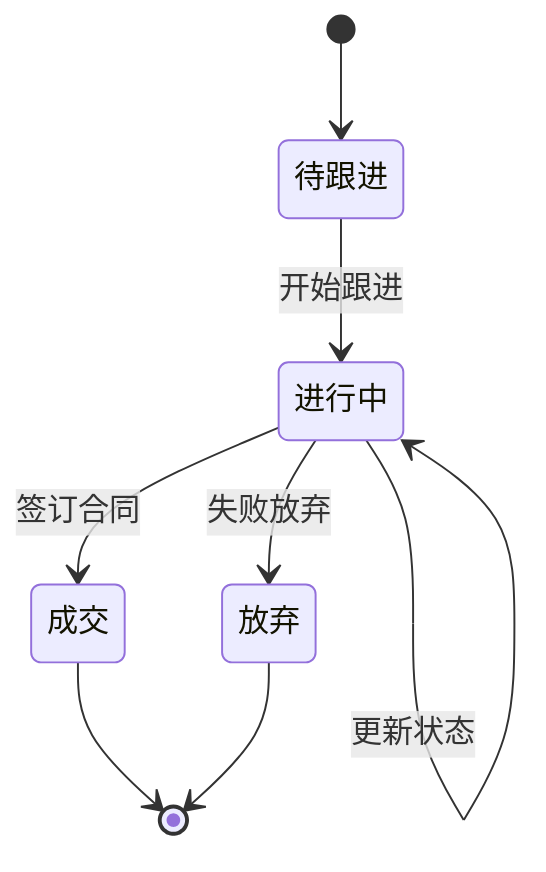

#### 商机产品管理

系统支持商机与多个产品的关联管理，自动计算产品总价和折扣金额。

**章节来源**
- [CrmBusinessServiceImpl.java:225-252](file://yudao-module-crm/src/main/java/cn/iocoder/yudao/module/crm/service/business/CrmBusinessServiceImpl.java#L225-L252)

### 数据权限管理

系统实现了基于用户的多层级数据权限控制：

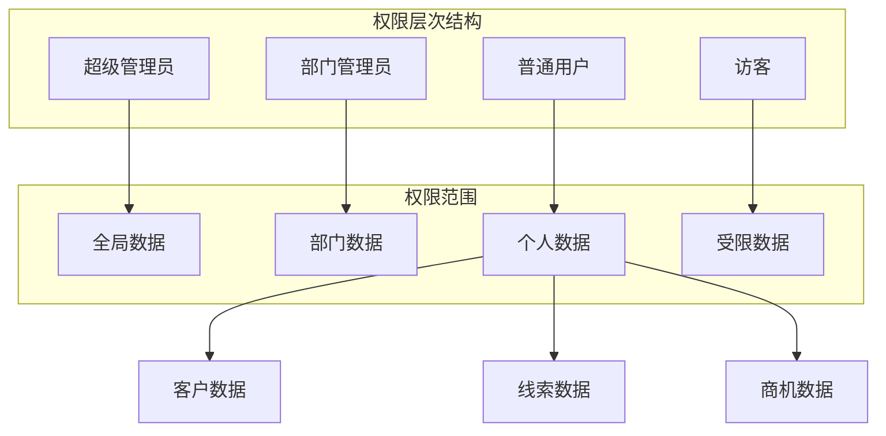

**图表来源**
- [CrmCustomerServiceImpl.java:104-105](file://yudao-module-crm/src/main/java/cn/iocoder/yudao/module/crm/service/customer/CrmCustomerServiceImpl.java#L104-L105)

## 依赖关系分析

### 外部依赖

CRM模块依赖于多个核心框架和工具库：

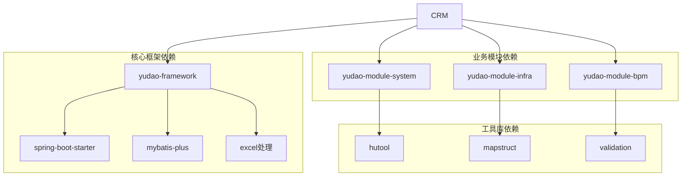

**图表来源**
- [yudao-module-crm/pom.xml:20-75](file://yudao-module-crm/pom.xml#L20-L75)

### 内部模块依赖

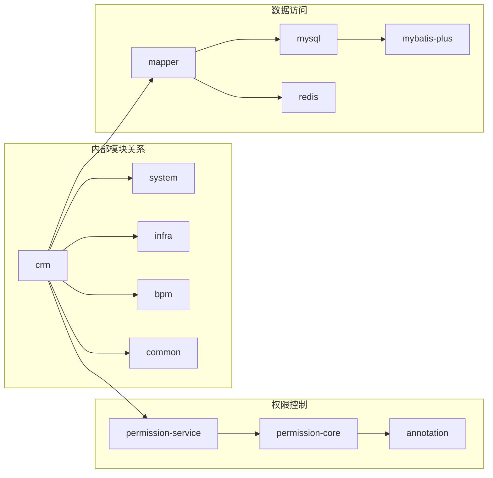

**图表来源**
- [yudao-module-crm/pom.xml:20-35](file://yudao-module-crm/pom.xml#L20-L35)

**章节来源**
- [yudao-module-crm/pom.xml:1-77](file://yudao-module-crm/pom.xml#L1-L77)

## 性能考虑

### 查询优化策略

系统采用了多种查询优化策略来提升性能：

1. **分页查询优化**：所有列表查询都支持分页，避免大数据量查询导致的性能问题
2. **权限过滤优化**：通过数据权限插件实现高效的权限过滤
3. **批量操作优化**：支持批量更新和批量删除操作
4. **缓存策略**：合理使用Redis缓存热点数据

### 数据库设计优化

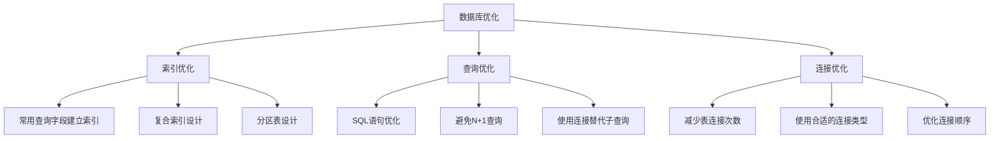

### 缓存策略

系统实现了多层次的缓存策略：

1. **Redis缓存**：缓存热点数据和配置信息
2. **本地缓存**：Spring Cache实现本地缓存
3. **数据库连接池**：优化数据库连接管理

## 故障排除指南

### 常见问题及解决方案

#### 客户权限相关问题

| 问题类型 | 症状描述 | 解决方案 |
|---------|----------|----------|
| 权限不足 | 无法查看/编辑客户数据 | 检查用户权限配置，确认数据权限范围 |
| 权限冲突 | 多个用户同时操作同一客户 | 使用乐观锁机制，避免并发冲突 |
| 权限继承 | 子用户无法访问父用户数据 | 检查组织架构和权限继承规则 |

#### 数据一致性问题

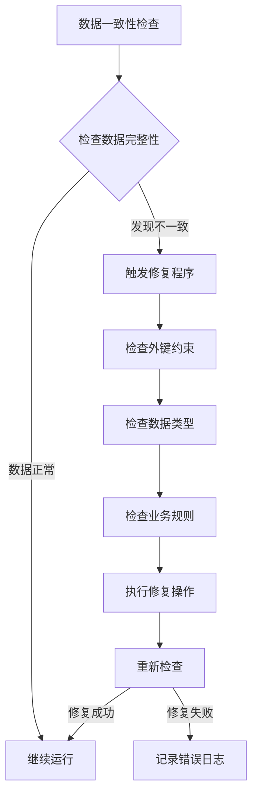

#### 性能问题诊断

1. **慢查询分析**：使用数据库慢查询日志分析慢查询
2. **内存使用监控**：监控应用内存使用情况
3. **并发问题排查**：检查线程池配置和锁使用情况

**章节来源**
- [CrmCustomerServiceImpl.java:568-593](file://yudao-module-crm/src/main/java/cn/iocoder/yudao/module/crm/service/customer/CrmCustomerServiceImpl.java#L568-L593)

### 日志记录和监控

系统实现了完善的日志记录和监控机制：

1. **操作日志**：记录所有重要操作的详细信息
2. **性能监控**：监控关键指标如响应时间、吞吐量等
3. **错误监控**：实时监控系统错误和异常情况

## 结论

CRM客户关系管理模块是一个功能完整、架构清晰、性能优秀的现代化企业级应用。通过采用分层架构设计、数据权限控制、操作日志记录等企业级特性，为企业提供了完整的客户关系管理解决方案。

模块的主要优势包括：

1. **功能完整性**：涵盖了CRM系统的核心业务功能
2. **架构合理性**：采用分层架构，职责分离明确
3. **扩展性强**：支持灵活的功能扩展和定制
4. **性能优秀**：通过多种优化策略确保系统性能
5. **安全性高**：实现了完善的数据权限控制和安全机制

该模块为企业的客户关系管理提供了坚实的技术基础，能够有效提升客户服务质量，优化销售流程，提高企业竞争力。