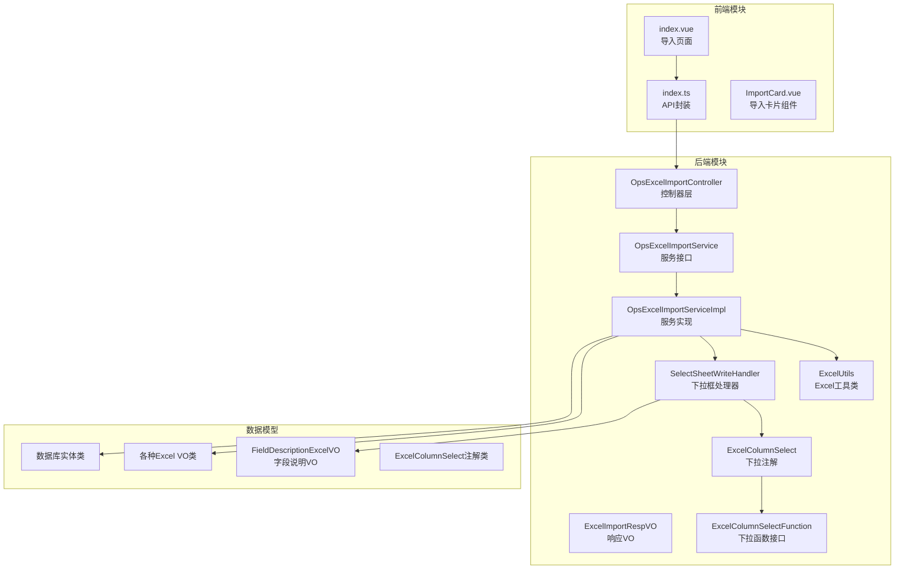
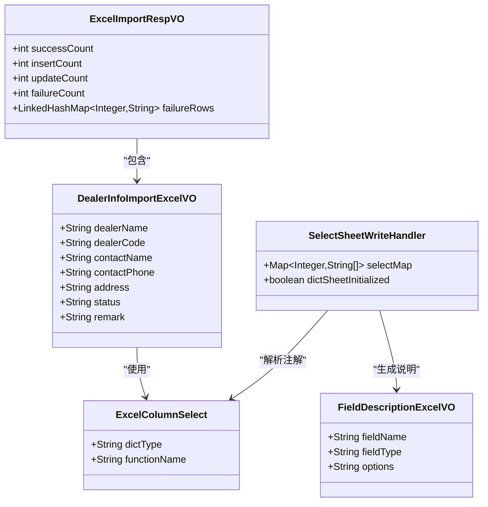
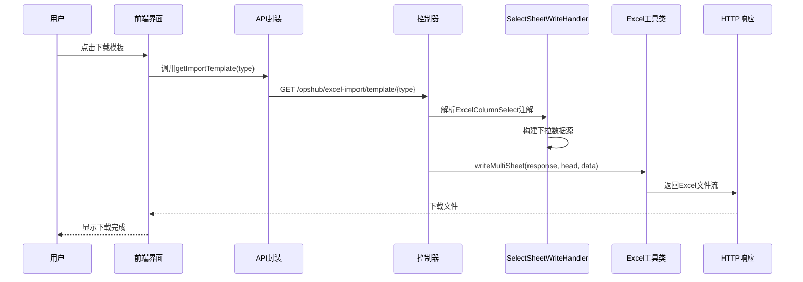
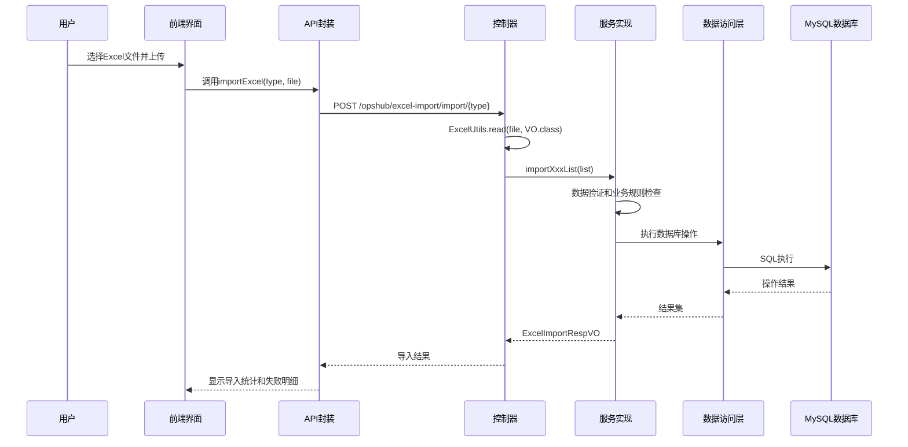
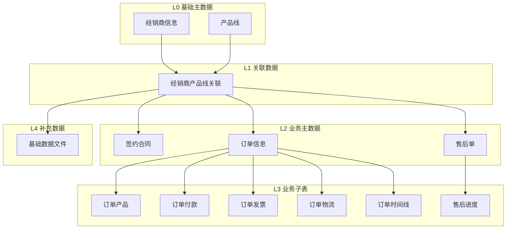
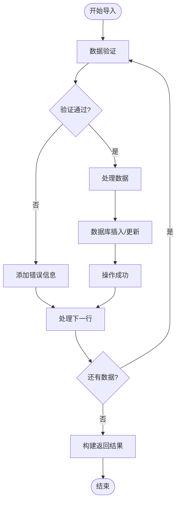
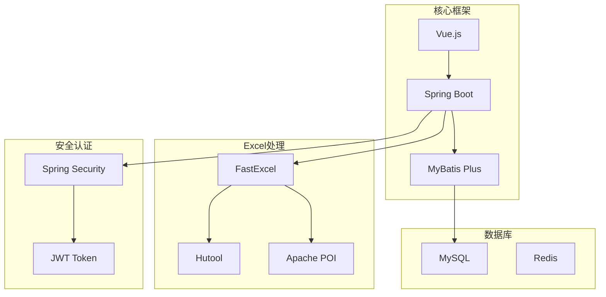
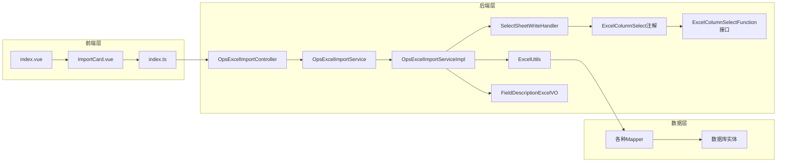
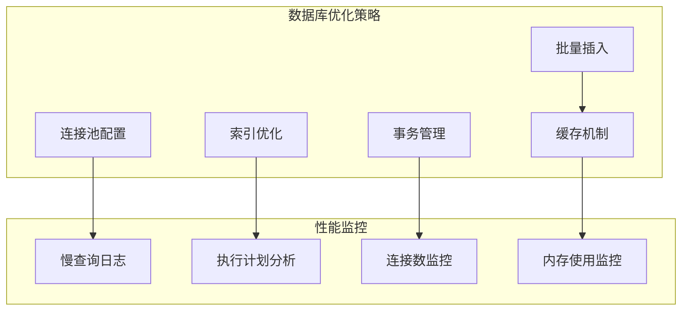

# Excel批量导入功能

<cite>
**本文档引用的文件**
- [OpsExcelImportController.java](file://yudao-module-opshub/src/main/java/cn/iocoder/yudao/module/opshub/controller/admin/excel/OpsExcelImportController.java)
- [OpsExcelImportService.java](file://yudao-module-opshub/src/main/java/cn/iocoder/yudao/module/opshub/service/excel/OpsExcelImportService.java)
- [OpsExcelImportServiceImpl.java](file://yudao-module-opshub/src/main/java/cn/iocoder/yudao/module/opshub/service/excel/OpsExcelImportServiceImpl.java)
- [ExcelUtils.java](file://yudao-framework/yudao-spring-boot-starter-excel/src/main/java/cn/iocoder/yudao/framework/excel/core/util/ExcelUtils.java)
- [ExcelImportRespVO.java](file://yudao-module-opshub/src/main/java/cn/iocoder/yudao/module/opshub/controller/admin/excel/vo/ExcelImportRespVO.java)
- [index.vue](file://yudao-ui/yudao-ui-admin-vue3/src/views/opshub/excelImport/index.vue)
- [index.ts](file://yudao-ui/yudao-ui-admin-vue3/src/api/opshub/excelImport/index.ts)
- [DealerInfoImportExcelVO.java](file://yudao-module-opshub/src/main/java/cn/iocoder/yudao/module/opshub/controller/admin/excel/vo/DealerInfoImportExcelVO.java)
- [FieldDescriptionExcelVO.java](file://yudao-module-opshub/src/main/java/cn/iocoder/yudao/module/opshub/controller/admin/excel/vo/FieldDescriptionExcelVO.java)
- [ExcelColumnSelect.java](file://yudao-framework/yudao-spring-boot-starter-excel/src/main/java/cn/iocoder/yudao/framework/excel/core/annotations/ExcelColumnSelect.java)
- [ExcelColumnSelectFunction.java](file://yudao-framework/yudao-spring-boot-starter-excel/src/main/java/cn/iocoder/yudao/framework/excel/core/function/ExcelColumnSelectFunction.java)
- [SelectSheetWriteHandler.java](file://yudao-framework/yudao-spring-boot-starter-excel/src/main/java/cn/iocoder/yudao/framework/excel/core/handler/SelectSheetWriteHandler.java)
</cite>

## 更新摘要
**变更内容**
- 新增Excel批量导入框架的完整功能介绍
- 更新支持的业务实体数量从13个调整为12个
- 新增下拉框选项和枚举验证功能的技术实现
- 完善模板生成和字段说明功能的详细说明
- 增强前端导入页面的业务层级展示

## 目录
1. [简介](#简介)
2. [项目结构](#项目结构)
3. [核心组件](#核心组件)
4. [架构概览](#架构概览)
5. [详细组件分析](#详细组件分析)
6. [新增功能特性](#新增功能特性)
7. [依赖关系分析](#依赖关系分析)
8. [性能考虑](#性能考虑)
9. [故障排除指南](#故障排除指南)
10. [结论](#结论)

## 简介

Excel批量导入功能是RuoYi-Vue-Pro管理系统中的重要特性，允许用户通过Excel模板批量导入各类业务数据。该功能支持12种不同的数据类型，按照业务依赖层级进行组织，从基础主数据到业务子表，再到补充数据。

该功能采用前后端分离架构，后端使用Spring Boot提供REST API接口，前端使用Vue.js构建用户界面，通过Excel模板驱动的方式实现数据的批量导入和验证。系统新增了强大的下拉框选项和枚举验证功能，通过自定义注解和处理器实现智能的数据输入约束。

## 项目结构

Excel批量导入功能主要分布在以下模块中：



**图表来源**
- [OpsExcelImportController.java:1-460](file://yudao-module-opshub/src/main/java/cn/iocoder/yudao/module/opshub/controller/admin/excel/OpsExcelImportController.java#L1-L460)
- [OpsExcelImportServiceImpl.java:1-689](file://yudao-module-opshub/src/main/java/cn/iocoder/yudao/module/opshub/service/excel/OpsExcelImportServiceImpl.java#L1-L689)

**章节来源**
- [OpsExcelImportController.java:1-460](file://yudao-module-opshub/src/main/java/cn/iocoder/yudao/module/opshub/controller/admin/excel/OpsExcelImportController.java#L1-L460)
- [index.vue:1-240](file://yudao-ui/yudao-ui-admin-vue3/src/views/opshub/excelImport/index.vue#L1-L240)

## 核心组件

### 后端核心组件

#### 控制器层 (OpsExcelImportController)
负责处理HTTP请求，提供Excel模板下载和数据导入功能。支持12种不同的导入类型，每种类型对应特定的业务数据模型。新增了多Sheet模板生成功能，包含数据Sheet和字段说明Sheet。

#### 服务层接口 (OpsExcelImportService)
定义了12个导入方法的接口规范，包括基础主数据、关联数据、业务主数据、业务子表和补充数据的导入操作。

#### 服务层实现 (OpsExcelImportServiceImpl)
实现了具体的导入逻辑，包含数据验证、业务规则检查、数据库操作和事务管理。每个导入方法都实现了幂等性处理和错误行定位功能。

#### Excel工具类 (ExcelUtils)
提供了Excel文件读写的核心功能，基于FastExcel框架实现高性能的Excel处理。新增了多Sheet写入和字段说明生成功能。

### 前端核心组件

#### 导入页面 (index.vue)
构建了用户友好的导入界面，按照业务层级组织12个导入卡片，提供模板下载和数据导入功能。每个卡片展示了字段数量、必填字段和枚举值信息。

#### API封装 (index.ts)
封装了与后端交互的API调用，包括模板下载和数据导入的HTTP请求。

**章节来源**
- [OpsExcelImportService.java:1-38](file://yudao-module-opshub/src/main/java/cn/iocoder/yudao/module/opshub/service/excel/OpsExcelImportService.java#L1-L38)
- [ExcelUtils.java:1-57](file://yudao-framework/yudao-spring-boot-starter-excel/src/main/java/cn/iocoder/yudao/framework/excel/core/util/ExcelUtils.java#L1-L57)
- [index.vue:1-240](file://yudao-ui/yudao-ui-admin-vue3/src/views/opshub/excelImport/index.vue#L1-L240)

## 架构概览

Excel批量导入功能采用分层架构设计，确保了良好的可维护性和扩展性：

```mermaid
graph TD
subgraph "用户界面层"
UI[Vue.js前端界面]
ICard[ImportCard组件]
end
subgraph "控制层"
CTRL[OpsExcelImportController]
API[API封装层]
end
subgraph "业务逻辑层"
SVC[OpsExcelImportService]
IMPL[OpsExcelImportServiceImpl]
end
subgraph "数据访问层"
DAO[各种Mapper接口]
DB[(MySQL数据库)]
end
subgraph "Excel处理层"
UTIL[ExcelUtils工具类]
HANDLER[SelectSheetWriteHandler<br/>下拉框处理器]
ANNO[ExcelColumnSelect注解]
FUNC[ExcelColumnSelectFunction接口]
END
subgraph "字段说明层"
DESC[FieldDescriptionExcelVO]
ENUM[枚举验证]
end
UI --> ICard
ICard --> API
API --> CTRL
CTRL --> SVC
SVC --> IMPL
IMPL --> DAO
DAO --> DB
IMPL --> UTIL
UTIL --> HANDLER
HANDLER --> ANNO
ANNO --> FUNC
IMPL --> DESC
IMPL --> ENUM
```

**图表来源**
- [OpsExcelImportController.java:47-57](file://yudao-module-opshub/src/main/java/cn/iocoder/yudao/module/opshub/controller/admin/excel/OpsExcelImportController.java#L47-L57)
- [OpsExcelImportServiceImpl.java:34-49](file://yudao-module-opshub/src/main/java/cn/iocoder/yudao/module/opshub/service/excel/OpsExcelImportServiceImpl.java#L34-L49)

该架构具有以下特点：
- **清晰的职责分离**：各层职责明确，便于维护和测试
- **可扩展性**：支持新的导入类型和业务规则
- **事务一致性**：每个导入操作都在事务中执行，确保数据完整性
- **错误处理**：提供详细的错误信息和失败行定位
- **智能验证**：通过下拉框和枚举验证确保数据质量

## 详细组件分析

### 数据模型设计

系统支持12种不同的Excel导入类型，每种类型都有对应的VO类和数据库实体：



**图表来源**
- [ExcelImportRespVO.java:17-33](file://yudao-module-opshub/src/main/java/cn/iocoder/yudao/module/opshub/controller/admin/excel/vo/ExcelImportRespVO.java#L17-L33)
- [DealerInfoImportExcelVO.java:15-25](file://yudao-module-opshub/src/main/java/cn/iocoder/yudao/module/opshub/controller/admin/excel/vo/DealerInfoImportExcelVO.java#L15-L25)
- [FieldDescriptionExcelVO.java:14-26](file://yudao-module-opshub/src/main/java/cn/iocoder/yudao/module/opshub/controller/admin/excel/vo/FieldDescriptionExcelVO.java#L14-L26)

### 导入流程分析

#### 模板下载流程



**图表来源**
- [OpsExcelImportController.java:61-114](file://yudao-module-opshub/src/main/java/cn/iocoder/yudao/module/opshub/controller/admin/excel/OpsExcelImportController.java#L61-L114)
- [index.ts:4-6](file://yudao-ui/yudao-ui-admin-vue3/src/api/opshub/excelImport/index.ts#L4-L6)

#### 数据导入流程



**图表来源**
- [OpsExcelImportController.java:239-301](file://yudao-module-opshub/src/main/java/cn/iocoder/yudao/module/opshub/controller/admin/excel/OpsExcelImportController.java#L239-L301)
- [OpsExcelImportServiceImpl.java:53-91](file://yudao-module-opshub/src/main/java/cn/iocoder/yudao/module/opshub/service/excel/OpsExcelImportServiceImpl.java#L53-L91)

### 业务层级设计

系统按照业务依赖关系将12种导入类型分为5个层级：



**图表来源**
- [index.vue:24-92](file://yudao-ui/yudao-ui-admin-vue3/src/views/opshub/excelImport/index.vue#L24-L92)

### 错误处理机制

系统实现了完善的错误处理机制：



**图表来源**
- [OpsExcelImportServiceImpl.java:55-91](file://yudao-module-opshub/src/main/java/cn/iocoder/yudao/module/opshub/service/excel/OpsExcelImportServiceImpl.java#L55-L91)

**章节来源**
- [OpsExcelImportController.java:1-460](file://yudao-module-opshub/src/main/java/cn/iocoder/yudao/module/opshub/controller/admin/excel/OpsExcelImportController.java#L1-L460)
- [OpsExcelImportServiceImpl.java:1-689](file://yudao-module-opshub/src/main/java/cn/iocoder/yudao/module/opshub/service/excel/OpsExcelImportServiceImpl.java#L1-L689)

## 新增功能特性

### 下拉框选项功能

系统新增了强大的下拉框选项功能，通过自定义注解和处理器实现智能的数据输入约束：

#### ExcelColumnSelect注解
```java
@Target(ElementType.FIELD)
@Retention(RetentionPolicy.RUNTIME)
public @interface ExcelColumnSelect {
    String dictType() default "";
    String functionName() default "";
}
```

#### SelectSheetWriteHandler处理器
- 自动解析VO类上的`@ExcelColumnSelect`注解
- 支持字典类型和函数两种数据源获取方式
- 动态生成Excel下拉框数据源
- 在单独的字典Sheet中存储下拉选项

#### ExcelColumnSelectFunction接口
```java
public interface ExcelColumnSelectFunction {
    String getName();
    List<String> getOptions();
}
```

**章节来源**
- [ExcelColumnSelect.java:15-27](file://yudao-framework/yudao-spring-boot-starter-excel/src/main/java/cn/iocoder/yudao/framework/excel/core/annotations/ExcelColumnSelect.java#L15-L27)
- [SelectSheetWriteHandler.java:39-198](file://yudao-framework/yudao-spring-boot-starter-excel/src/main/java/cn/iocoder/yudao/framework/excel/core/handler/SelectSheetWriteHandler.java#L39-L198)
- [ExcelColumnSelectFunction.java:12-28](file://yudao-framework/yudao-spring-boot-starter-excel/src/main/java/cn/iocoder/yudao/framework/excel/core/function/ExcelColumnSelectFunction.java#L12-L28)

### 模板生成和字段说明

#### 多Sheet模板生成功能
- Sheet1：包含示例数据和下拉框约束
- Sheet2：字段说明，包含字段名称、类型和可选值
- 自动解析VO类的注解信息生成字段说明

#### 字段说明生成机制
```java
private List<FieldDescriptionExcelVO> buildFieldDescriptions(Class<?> head) {
    Map<String, List<String>> functionMap = getFunctionMap();
    List<FieldDescriptionExcelVO> descriptions = new ArrayList<>();
    for (Field field : head.getDeclaredFields()) {
        // 解析ExcelProperty注解获取字段名称
        // 检查ExcelColumnSelect注解获取枚举选项
        // 生成字段类型和可选值说明
    }
    return descriptions;
}
```

**章节来源**
- [OpsExcelImportController.java:198-235](file://yudao-module-opshub/src/main/java/cn/iocoder/yudao/module/opshub/controller/admin/excel/OpsExcelImportController.java#L198-L235)
- [FieldDescriptionExcelVO.java:14-26](file://yudao-module-opshub/src/main/java/cn/iocoder/yudao/module/opshub/controller/admin/excel/vo/FieldDescriptionExcelVO.java#L14-L26)

### 枚举验证功能

#### 枚举转换器
系统集成了通用的状态枚举转换器，支持字符串到整数的转换：
```java
private Integer parseInteger(String value) {
    if (StrUtil.isBlank(value)) return null;
    try {
        return Integer.parseInt(value);
    } catch (NumberFormatException e) {
        return null;
    }
}
```

#### 布尔值验证
```java
private Boolean parseBoolean(String value) {
    if (StrUtil.isBlank(value)) return false;
    return "true".equalsIgnoreCase(value);
}
```

**章节来源**
- [OpsExcelImportServiceImpl.java:675-687](file://yudao-module-opshub/src/main/java/cn/iocoder/yudao/module/opshub/service/excel/OpsExcelImportServiceImpl.java#L675-L687)

## 依赖关系分析

### 技术栈依赖



**图表来源**
- [ExcelUtils.java:3-5](file://yudao-framework/yudao-spring-boot-starter-excel/src/main/java/cn/iocoder/yudao/framework/excel/core/util/ExcelUtils.java#L3-L5)
- [index.vue:98-104](file://yudao-ui/yudao-ui-admin-vue3/src/views/opshub/excelImport/index.vue#L98-L104)

### 组件间依赖关系



**图表来源**
- [OpsExcelImportController.java:44-49](file://yudao-module-opshub/src/main/java/cn/iocoder/yudao/module/opshub/controller/admin/excel/OpsExcelImportController.java#L44-L49)
- [OpsExcelImportServiceImpl.java:36-49](file://yudao-module-opshub/src/main/java/cn/iocoder/yudao/module/opshub/service/excel/OpsExcelImportServiceImpl.java#L36-L49)

**章节来源**
- [ExcelUtils.java:1-57](file://yudao-framework/yudao-spring-boot-starter-excel/src/main/java/cn/iocoder/yudao/framework/excel/core/util/ExcelUtils.java#L1-L57)
- [OpsExcelImportService.java:1-38](file://yudao-module-opshub/src/main/java/cn/iocoder/yudao/module/opshub/service/excel/OpsExcelImportService.java#L1-L38)

## 性能考虑

### Excel处理性能

系统采用FastExcel框架进行Excel文件处理，具有以下性能优势：

1. **内存效率**：使用流式读取，避免大文件占用过多内存
2. **并发处理**：支持多线程并发处理多个Excel文件
3. **缓存策略**：对常用数据进行缓存，减少数据库查询次数
4. **多Sheet优化**：批量写入多个Sheet时避免重复创建字典数据

### 数据库优化



**图表来源**
- [OpsExcelImportServiceImpl.java:285-337](file://yudao-module-opshub/src/main/java/cn/iocoder/yudao/module/opshub/service/excel/OpsExcelImportServiceImpl.java#L285-L337)

### 前端性能优化

前端界面采用了懒加载和虚拟滚动技术，确保大量数据展示的流畅性。导入卡片组件按需渲染，减少DOM节点数量。

## 故障排除指南

### 常见问题及解决方案

#### Excel文件格式问题
- **问题**：上传的文件不是Excel格式
- **解决方案**：前端会自动验证文件扩展名，只接受.xlsx和.xls格式

#### 数据验证失败
- **问题**：Excel中的数据不符合业务规则
- **解决方案**：系统会在导入完成后显示详细的错误行号和错误原因

#### 权限不足
- **问题**：用户没有导入权限
- **解决方案**：需要具备`opshub:excel-import:import`权限才能使用导入功能

#### 数据库连接异常
- **问题**：导入过程中数据库连接中断
- **解决方案**：系统会自动回滚事务，确保数据一致性

#### 下拉框数据缺失
- **问题**：Excel模板中的下拉框选项不完整
- **解决方案**：检查`ExcelColumnSelectFunction`实现类是否正确注册，或字典数据是否配置正确

**章节来源**
- [OpsExcelImportController.java:67-68](file://yudao-module-opshub/src/main/java/cn/iocoder/yudao/module/opshub/controller/admin/excel/OpsExcelImportController.java#L67-L68)
- [index.vue:109-121](file://yudao-ui/yudao-ui-admin-vue3/src/views/opshub/excelImport/index.vue#L109-L121)

## 结论

Excel批量导入功能通过精心设计的架构和完善的错误处理机制，为用户提供了高效、可靠的批量数据导入体验。该功能的主要优势包括：

1. **完整的业务覆盖**：支持12种不同类型的业务数据导入
2. **智能的下拉验证**：通过注解和处理器实现自动化的数据输入约束
3. **清晰的层级管理**：按照业务依赖关系组织导入流程
4. **强大的错误处理**：提供详细的错误信息和失败行定位
5. **良好的用户体验**：直观的界面设计和实时的导入反馈
6. **高可靠性**：事务管理和数据一致性保障
7. **灵活的扩展性**：支持新的导入类型和业务规则的快速添加

该功能为RuoYi-Vue-Pro管理系统提供了重要的数据管理能力，大大提高了用户的操作效率和数据处理能力。新增的下拉框选项和枚举验证功能进一步提升了数据质量和用户体验。