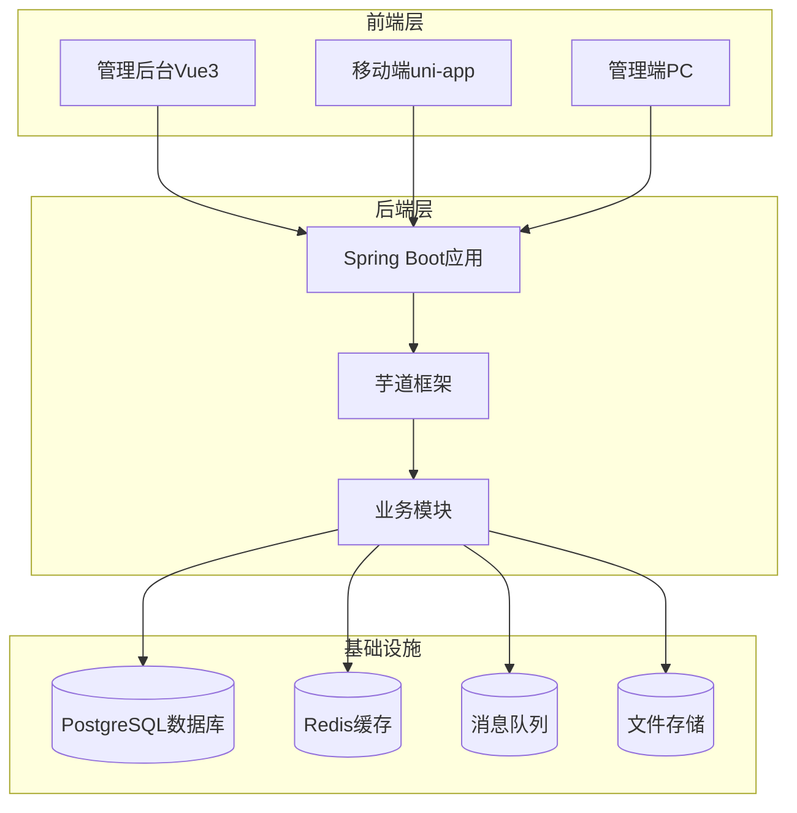
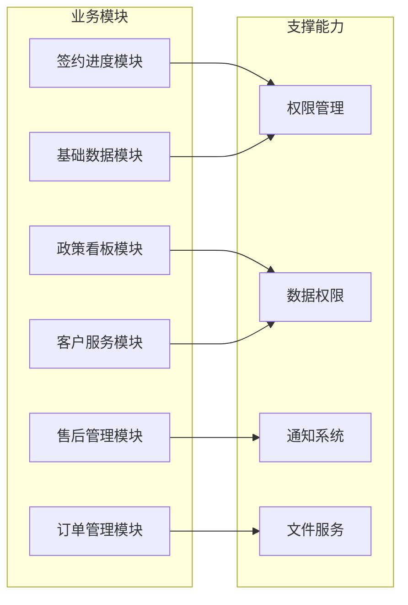
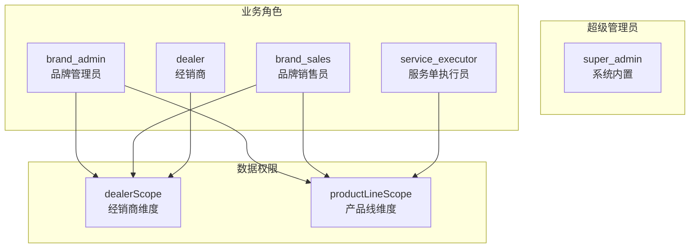
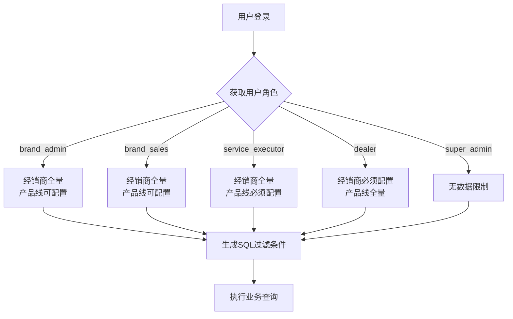
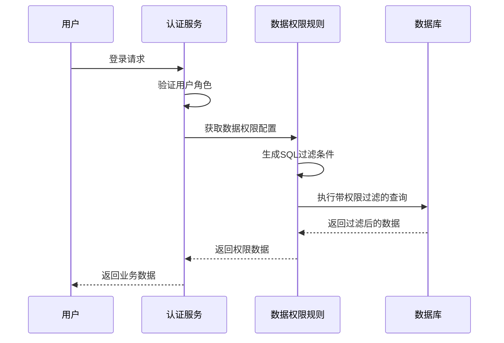
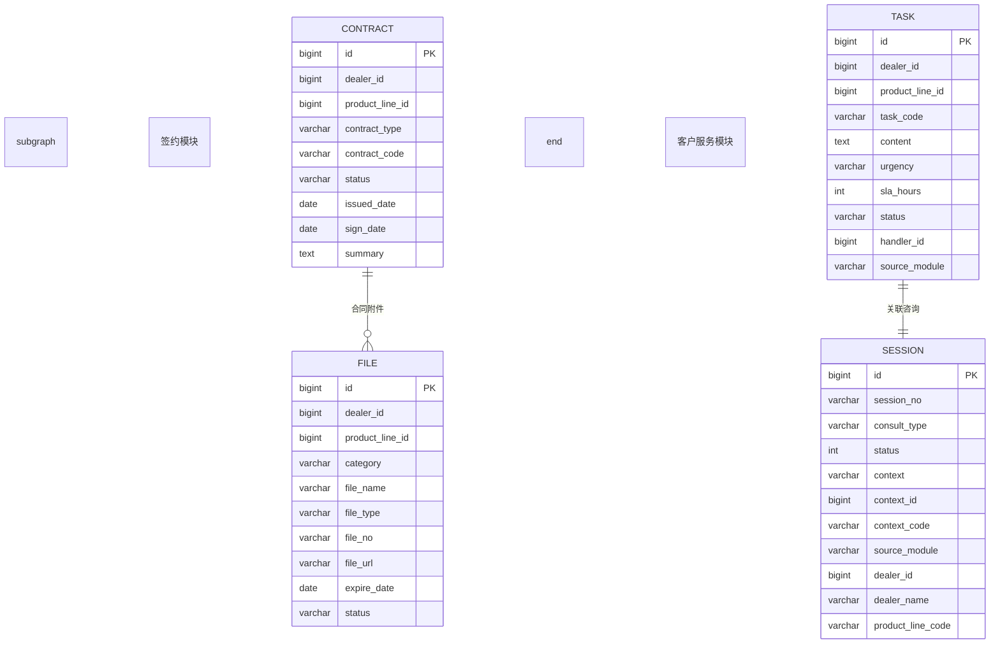
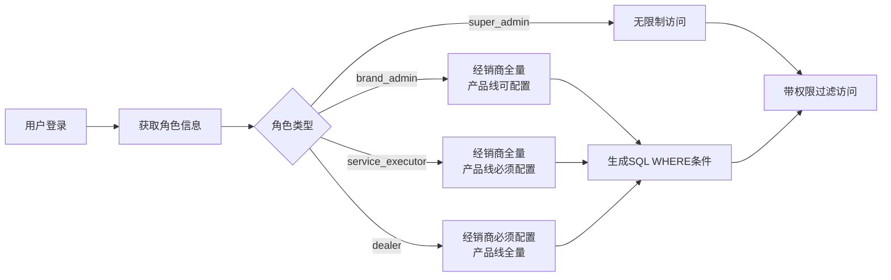
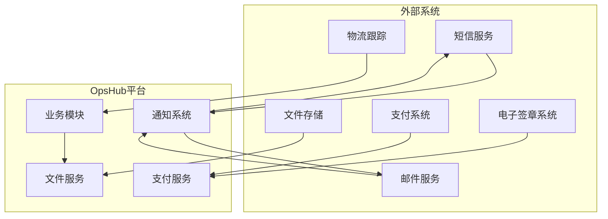
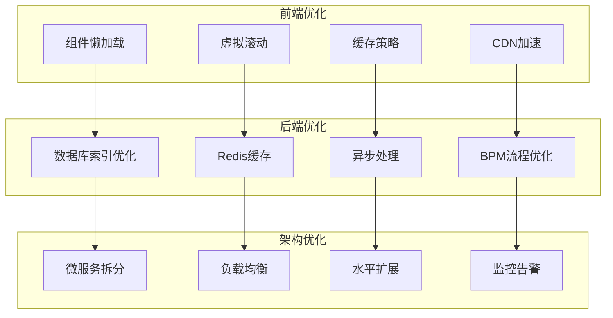
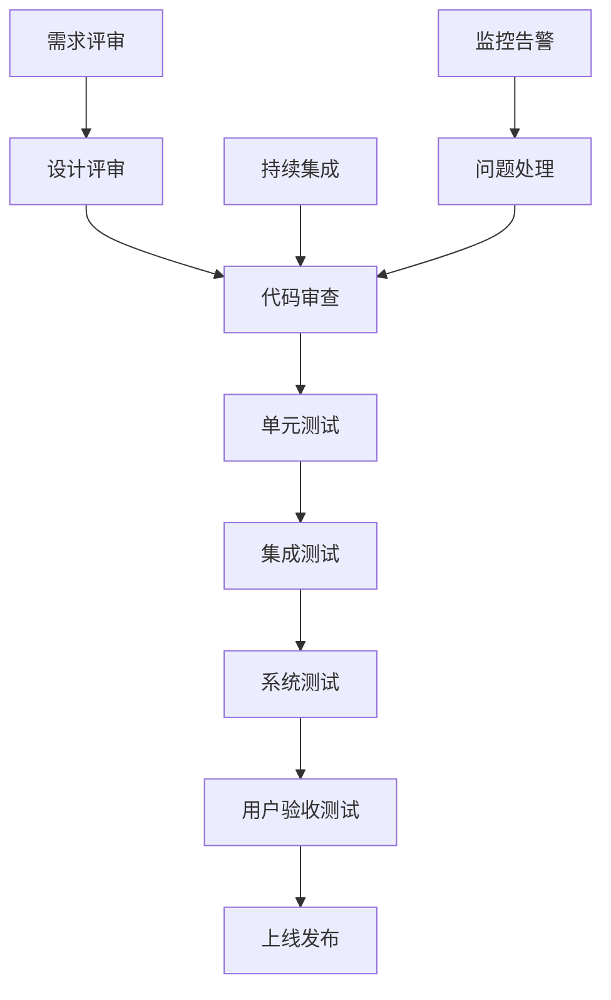

# OpsHub PRD文档

<cite>
**本文档引用的文件**
- [README.md](file://README.md)
- [STARTUP.md](file://STARTUP.md)
- [PRD-经销商管理客服SaaS.md](file://docs/PRD-经销商管理客服SaaS.md)
- [PRD-用户权限设计.md](file://docs/PRD-用户权限设计.md)
- [PRD-Step2-基础数据模块.md](file://docs/PRD-Step2-基础数据模块.md)
- [PRD-Step5-售后模块.md](file://docs/PRD-Step5-售后模块.md)
- [PRD-Step6-工单操作服务模块.md](file://docs/PRD-Step6-工单操作服务模块.md)
- [PRD-Step7-电商客服系统.md](file://docs/PRD-Step7-电商客服系统.md)
- [PRD-Step10-签约附件.md](file://docs/PRD-Step10-签约附件.md)
- [PRD-Step11-工单流程优化.md](file://docs/PRD-Step11-工单流程优化.md)
- [PRD-Step13-工单管理增强与数据权限修复.md](file://docs/PRD-Step13-工单管理增强与数据权限修复.md)
- [PRD-Step17-订单操作列调整.md](file://docs/PRD-Step17-订单操作列调整.md)
- [PRD-Step18-工单跨产品线可见性修复.md](file://docs/PRD-Step18-工单跨产品线可见性修复.md)
</cite>

## 更新摘要
**变更内容**
- 新增工单跨产品线可见性修复的PRD文档，详细描述了assignee绕过机制的技术规格和SQL示例
- 解决了跨产品线分配场景下的数据可见性Bug，增加了处理人旁路机制
- 修复了执行员待办/已办status赋值不正确的问题，新增"已交付"标签页
- 更新了相关权限配置和前端组件实现
- 进行了标签优化，提升了用户体验

## 目录
1. [项目概述](#项目概述)
2. [产品定位与目标](#产品定位与目标)
3. [核心模块架构](#核心模块架构)
4. [用户权限体系](#用户权限体系)
5. [分阶段实施计划](#分阶段实施计划)
6. [关键技术特性](#关键技术特性)
7. [数据模型设计](#数据模型设计)
8. [系统集成方案](#系统集成方案)
9. [性能与扩展性](#性能与扩展性)
10. [风险管控与质量保证](#风险管控与质量保证)

## 项目概述

OpsHub是基于芋道ruoyi-vue-pro框架开发的经销商管理客服SaaS平台，面向医疗器械品牌商提供全生命周期的数字化管理解决方案。该项目采用前后端分离架构，后端基于Spring Boot 3.4.5 + JDK 17，前端采用Vue3 + Element Plus技术栈。

### 技术架构



**图表来源**
- [README.md:44-58](file://README.md#L44-L58)
- [STARTUP.md:1-157](file://STARTUP.md#L1-L157)

**章节来源**
- [README.md:36-61](file://README.md#L36-L61)
- [README.md:324-347](file://README.md#L324-L347)

## 产品定位与目标

### 产品定位

OpsHub致力于成为医疗器械品牌商的数字化合作伙伴，提供从合同签约到售后服务的全链条管理解决方案。平台采用SaaS模式，支持多租户架构，可为不同品牌商提供独立的业务空间。

### 核心目标

| 目标类别 | 具体目标 | 衡量指标 |
|---------|---------|---------|
| **数字化转型** | 合同/订单/售后全流程线上化 | 线上化率≥90% |
| **智能化服务** | AI客服自动响应 + 人工客服兜底 | 满意度≥4.5星 |
| **多角色协同** | 管理员/经销商/执行员三级权限体系 | 权限准确率100% |
| **数据可视化** | 8大KPI指标按季度追踪达成率 | 报表准确率100% |

**章节来源**
- [PRD-经销商管理客服SaaS.md:15-23](file://docs/PRD-经销商管理客服SaaS.md#L15-L23)

## 核心模块架构

### 六大业务模块

平台包含六大核心业务模块，每个模块都有完整的数据模型和业务流程：



**图表来源**
- [PRD-经销商管理客服SaaS.md:54-444](file://docs/PRD-经销商管理客服SaaS.md#L54-L444)

### 模块功能矩阵

| 模块名称 | 核心功能 | 关键特性 | 业务价值 |
|---------|---------|---------|---------|
| **签约进度** | 合同管理、签署流程、附件管理 | 4种合同类型、状态跟踪、AI解读 | 提升签约效率，降低人工成本 |
| **政策看板** | KPI指标监控、数据分析、报表展示 | 8大指标、季度追踪、三级钻取 | 量化政策执行效果 |
| **售后管理** | 退货/换货/退款全流程 | 5节点进度跟踪、状态流转 | 提升客户满意度 |
| **订单管理** | 采购订单全生命周期 | 5节点进度、付款开票分离 | 优化供应链管理 |
| **基础数据** | 文件管理、AI解读、盖章申请 | 4大分类、有效期监控 | 确保合规运营 |
| **客户服务** | 工单管理、AI客服、咨询队列 | 实时通讯、SLA管理 | 提升服务效率 |

**章节来源**
- [PRD-经销商管理客服SaaS.md:58-443](file://docs/PRD-经销商管理客服SaaS.md#L58-L443)

## 用户权限体系

### 角色模型设计

平台采用五角色权限模型，每个角色都有明确的数据范围和操作权限：



**图表来源**
- [PRD-用户权限设计.md:70-128](file://docs/PRD-用户权限设计.md#L70-L128)

### 权限矩阵

| 功能模块 | 品牌管理员 | 品牌销售员 | 服务单执行员 | 经销商 |
|---------|-----------|-----------|-------------|-------|
| **签约进度** | 读写 | 只读 | 读写(咨询回复) | 读写(发起签署/盖章) |
| **政策看板** | 读写 | 只读 | 读写(咨询回复) | 只读 |
| **售后模块** | 读写 | 只读 | 读写(咨询回复) | 读写(发起退货) |
| **订单模块** | 读写 | 只读 | 读写(操作请求) | 读写(申请付款/开票/退货) |
| **基础数据** | 读写 | 只读 | 读写(盖章处理) | 读写(申请盖章) |
| **客户服务** | 读写(催办/创建任务) | **不可见** | 读写(接单/回复/提交) | 读写(发起咨询/验收) |

**章节来源**
- [PRD-用户权限设计.md:129-188](file://docs/PRD-用户权限设计.md#L129-L188)

### 数据权限模型

采用"经销商维度 × 产品线维度"的交叉授权模型：



**图表来源**
- [PRD-用户权限设计.md:194-260](file://docs/PRD-用户权限设计.md#L194-L260)

**章节来源**
- [PRD-用户权限设计.md:227-260](file://docs/PRD-用户权限设计.md#L227-L260)

## 分阶段实施计划

### 第一阶段：核心权限与基础业务

**实施目标**：建立完整的权限体系和核心业务模块

| 阶段 | 功能模块 | 优先级 | 关键里程碑 |
|------|---------|-------|-----------|
| **Step 1** | 角色定义与权限设计 | P0 | 完成用户权限PRD澄清 |
| **Step 2** | 基础数据模块 | P0 | 文件管理、AI解读骨架 |
| **Step 3** | 签约进度模块 | P0 | 合同录入、状态跟踪 |
| **Step 4** | 订单模块 | P0 | 订单生命周期管理 |
| **Step 5** | 售后模块 | P0 | 退货/换货/退款流程 |

### 第二阶段：高级功能与体验优化

**实施目标**：完善高级功能和用户体验

| 阶段 | 功能模块 | 优先级 | 关键里程碑 |
|------|---------|-------|-----------|
| **Step 6** | 客户服务模块 | P0 | 工单+操作请求+通用附件 |
| **Step 7** | 电商客服系统 | P0 | 在线咨询聊天 |
| **Step 8** | 政策看板 | P1 | KPI仪表盘+三级钻取 |
| **Step 9** | SLA监控 | P2 | 超时预警+催办通知 |

### 第三阶段：集成与优化

**实施目标**：系统集成和性能优化

| 阶段 | 功能模块 | 优先级 | 关键里程碑 |
|------|---------|-------|-----------|
| **Step 10** | 签约附件增强 | P0 | 附件列表与下载 |
| **Step 11** | 工单流程优化 | P0 | BPM状态机重构 |
| **Step 13** | 工单管理增强 | P0 | 处理人同步+数据权限修复 |
| **Step 17** | 订单操作列调整 | P0 | UI优化，精简操作项 |
| **Step 18** | 工单跨产品线可见性修复 | P0 | 处理人旁路机制+标签优化 |

**更新** 新增工单跨产品线可见性修复阶段，专注于解决跨产品线分配场景下的数据可见性问题

**章节来源**
- [PRD-经销商管理客服SaaS.md:491-556](file://docs/PRD-经销商管理客服SaaS.md#L491-L556)

## 关键技术特性

### 数据权限实现

平台采用动态数据权限规则，支持复杂的交叉过滤：



**图表来源**
- [PRD-用户权限设计.md:314-360](file://docs/PRD-用户权限设计.md#L314-L360)

### 实时通讯架构

客服模块采用WebSocket实现实时消息推送：

```mermaid
graph TB
subgraph "客户端"
A[经销商客户端]
B[执行员客户端]
C[管理员客户端]
end
subgraph "服务端"
D[WebSocket服务]
E[消息队列]
F[通知服务]
end
subgraph "数据库"
G[会话表]
H[消息表]
end
A < --> D
B < --> D
C < --> D
D --> E
D --> F
E --> G
E --> H
F --> A
F --> B
F --> C
```

**图表来源**
- [PRD-Step7-电商客服系统.md:347-376](file://docs/PRD-Step7-电商客服系统.md#L347-L376)

### 工单跨产品线可见性修复

**更新** 新增工单跨产品线可见性修复的关键技术特性

平台实现了"处理人旁路"（Assignee Bypass）机制，解决跨产品线分配场景下的数据可见性问题：

```mermaid
flowchart TD
A[工单跨产品线分配] --> B{执行员查询工单}
B --> C{数据权限过滤}
C --> D[原始条件：<br/>product_line_code IN ('GK') OR product_line_code IS NULL]
C --> E{执行员是否被分配}
E --> |是| F[旁路条件：<br/>OR assignee_id = currentUserId]
E --> |否| G[无旁路，按产品线过滤]
F --> H[最终条件：<br/>(原始条件) OR (assignee_id = currentUserId)]
G --> I[最终条件：<br/>原始条件]
H --> J[执行查询]
I --> J
```

**修复前SQL示例**：
```sql
WHERE assignee_id = A AND status IN (0,1,4)
AND (product_line_code IN ('GK') OR product_line_code IS NULL)
-- product_line_code='FK' 的工单被过滤掉 → 不可见
```

**修复后SQL示例**：
```sql
WHERE assignee_id = A AND status IN (0,1,4)
AND ((product_line_code IN ('GK') OR product_line_code IS NULL) OR assignee_id = A)
-- assignee_id=A 的工单始终可见
```

**关键设计点**：
- 旁路仅在表注册了 `addAssigneeBypass` 时生效，不影响签约/订单/售后等其他表
- `super_admin` 角色返回 null（不过滤），旁路不生效，管理员查询不受影响
- 旁路条件使用 `Parenthesis` 包裹，避免与外层 AND 产生 SQL 优先级问题
- 即使产品线/经销商权限为空（`__NO_ACCESS__` 永假条件），旁路仍生效

**章节来源**
- [PRD-Step7-电商客服系统.md:378-494](file://docs/PRD-Step7-电商客服系统.md#L378-L494)

### 执行员待办已办状态修正

**更新** 新增执行员待办已办状态修正的技术特性

修复了执行员标签状态的语义混乱问题，重新定义了各标签的状态含义：

| 标签 | 修正前状态 | 修正后状态 | 说明 |
|------|------------|------------|------|
| 可领取 claimable | status=0 且 assignee IS NULL | status=0 且 assignee IS NULL | 未分配工单 |
| 待办 pending | status IN (0,1,4) | status IN (1,4) | 执行员正在处理 + 退回待重处理 |
| 已办 done | status IN (2,3) | status=3 | 工单已关闭 |
| **新增** | **无** | **status=2** | **已提交审批，等待经销商验收** |

**前端标签配置更新**：
```typescript
handler: [
  { value: 'claimable', label: '可领取' },
  { value: 'pending', label: '待办' },
  { value: 'delivered', label: '已交付' },  // 新增
  { value: 'done', label: '已办' }
]
```

**后端状态过滤逻辑更新**：
- `applyTabFilter` 方法中移除了 PENDING(0) 和 DELIVERED(2) 的错误状态
- 新增 `delivered` 标签的专门状态过滤
- `selectCountByTab` 方法同步更新状态过滤逻辑

**章节来源**
- [PRD-Step18-工单跨产品线可见性修复.md:74-156](file://docs/PRD-Step18-工单跨产品线可见性修复.md#L74-L156)

## 数据模型设计

### 核心业务表结构

平台采用统一的租户数据模型，所有业务表都继承租户基类：



**图表来源**
- [PRD-Step2-基础数据模块.md:28-48](file://docs/PRD-Step2-基础数据模块.md#L28-L48)
- [PRD-Step5-售后模块.md:33-66](file://docs/PRD-Step5-售后模块.md#L33-L66)
- [PRD-Step6-工单操作服务模块.md:30-66](file://docs/PRD-Step6-工单操作服务模块.md#L30-L66)

### 数据权限配置



**图表来源**
- [PRD-用户权限设计.md:217-244](file://docs/PRD-用户权限设计.md#L217-L244)

**章节来源**
- [PRD-Step2-基础数据模块.md:225-284](file://docs/PRD-Step2-基础数据模块.md#L225-L284)

## 系统集成方案

### 外部系统集成

平台支持与多种外部系统集成：



**图表来源**
- [README.md:57-60](file://README.md#L57-L60)

### API接口设计

平台提供统一的RESTful API接口：

| 模块 | 接口类型 | 数量 | 说明 |
|------|---------|------|------|
| **签约模块** | GET/POST/PUT | 15+ | 合同管理、附件操作 |
| **客户服务** | GET/POST/DELETE | 20+ | 工单、咨询、操作请求 |
| **基础数据** | GET/POST/PUT | 12+ | 文件管理、AI解读 |
| **售后模块** | GET/POST/PUT | 18+ | 售后流程管理 |
| **订单模块** | GET/POST/PUT | 16+ | 订单生命周期管理 |
| **政策看板** | GET/POST | 8+ | KPI指标查询 |

**章节来源**
- [PRD-Step2-基础数据模块.md:103-111](file://docs/PRD-Step2-基础数据模块.md#L103-L111)
- [PRD-Step6-工单操作服务模块.md:190-200](file://docs/PRD-Step6-工单操作服务模块.md#L190-L200)

## 性能与扩展性

### 性能优化策略

平台采用多层次的性能优化方案：



**图表来源**
- [README.md:97-122](file://README.md#L97-L122)

### 扩展性设计

平台具备良好的扩展性，支持业务快速增长：

- **模块化设计**：各业务模块相对独立，便于单独扩展
- **插件机制**：支持第三方插件集成
- **配置化管理**：通过配置文件管理业务规则
- **API网关**：统一的API入口和流量控制

**章节来源**
- [README.md:107-123](file://README.md#L107-L123)

## 风险管控与质量保证

### 质量保证体系



**图表来源**
- [README.md:122-123](file://README.md#L122-L123)

### 风险管控措施

| 风险类型 | 风险描述 | 缓解措施 | 监控指标 |
|---------|---------|---------|---------|
| **技术风险** | 新技术栈不成熟 | 采用渐进式技术升级 | 技术债务比率 |
| **业务风险** | 需求变更频繁 | 敏捷开发+迭代管理 | 需求变更频率 |
| **安全风险** | 数据泄露风险 | 多层安全防护+审计日志 | 安全事件数量 |
| **性能风险** | 系统响应缓慢 | 性能监控+容量规划 | QPS/响应时间 |
| **运维风险** | 系统故障 | 多活部署+灾备方案 | MTTR/可用性 |

**章节来源**
- [PRD-用户权限设计.md:744-755](file://docs/PRD-用户权限设计.md#L744-L755)

### 测试策略

平台采用多层次的测试策略：

- **单元测试**：覆盖率≥80%
- **集成测试**：接口测试+数据库测试
- **性能测试**：压力测试+并发测试
- **安全测试**：渗透测试+漏洞扫描
- **用户验收测试**：业务场景测试

**章节来源**
- [README.md:122-123](file://README.md#L122-L123)

### 工单跨产品线可见性修复测试策略

**更新** 新增工单跨产品线可见性修复的测试策略

针对工单跨产品线可见性修复，需要特别关注以下测试要点：

- **旁路机制测试**：验证执行员查询已分配给自己的跨产品线工单时的可见性
- **权限边界测试**：确保执行员无法查看非分配给自己的跨产品线工单
- **空权限场景测试**：验证执行员无产品线配置时的旁路行为
- **角色隔离测试**：确保经销商角色不受旁路机制影响
- **管理员权限测试**：验证超管不受旁路机制影响
- **标签状态测试**：验证各标签状态过滤的准确性
- **SQL优先级测试**：确保旁路条件的括号包裹正确处理SQL优先级

**章节来源**
- [PRD-Step18-工单跨产品线可见性修复.md:165-171](file://docs/PRD-Step18-工单跨产品线可见性修复.md#L165-L171)

### 订单操作列调整的UI优化

**更新** 新增订单操作列调整的UI优化测试策略

针对订单操作列的UI优化，需要特别关注以下测试要点：

- **交互测试**：验证按钮点击的响应速度和准确性
- **权限测试**：确保不同角色看到的操作按钮符合预期
- **兼容性测试**：在不同浏览器和设备上的显示效果
- **无障碍测试**：键盘导航和屏幕阅读器支持
- **性能测试**：按钮渲染和事件绑定的性能表现

**章节来源**
- [PRD-Step17-订单操作列调整.md:126-132](file://docs/PRD-Step17-订单操作列调整.md#L126-L132)

---

**文档总结**

OpsHub项目是一个完整的SaaS平台解决方案，通过分阶段实施的方式，逐步构建起从权限管理到业务功能的完整体系。项目采用先进的技术架构，具备良好的扩展性和稳定性，能够满足医疗器械品牌商的多样化需求。

**更新** 最新的工单跨产品线可见性修复显著提升了系统的数据完整性，通过引入处理人旁路机制，解决了跨产品线分配场景下的数据可见性问题。同时，执行员待办/已办状态的语义优化使得工作流更加清晰，用户体验得到显著改善。这些优化体现了以用户为中心的设计理念，为后续的功能迭代奠定了良好的基础。

通过严格的质量管控和风险管理体系，确保项目的成功交付和长期稳定运行。