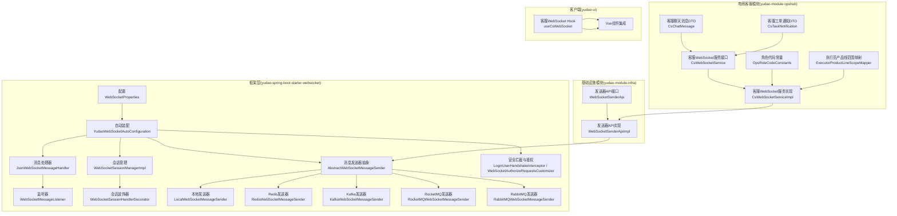
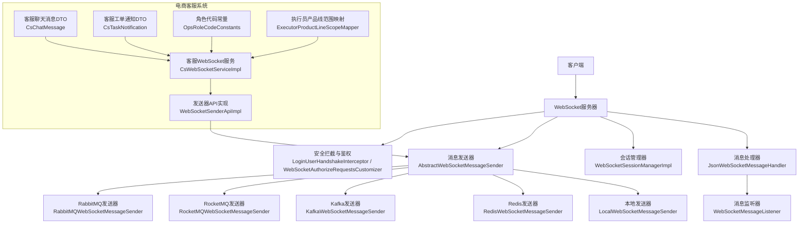
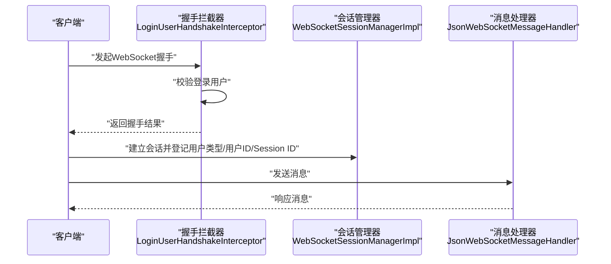
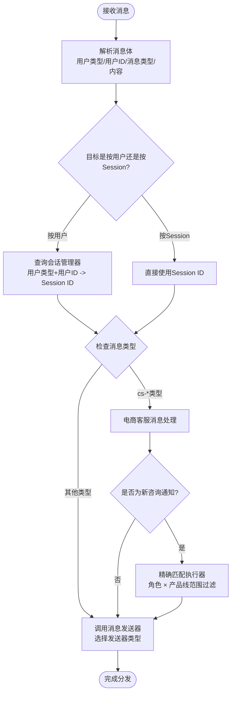
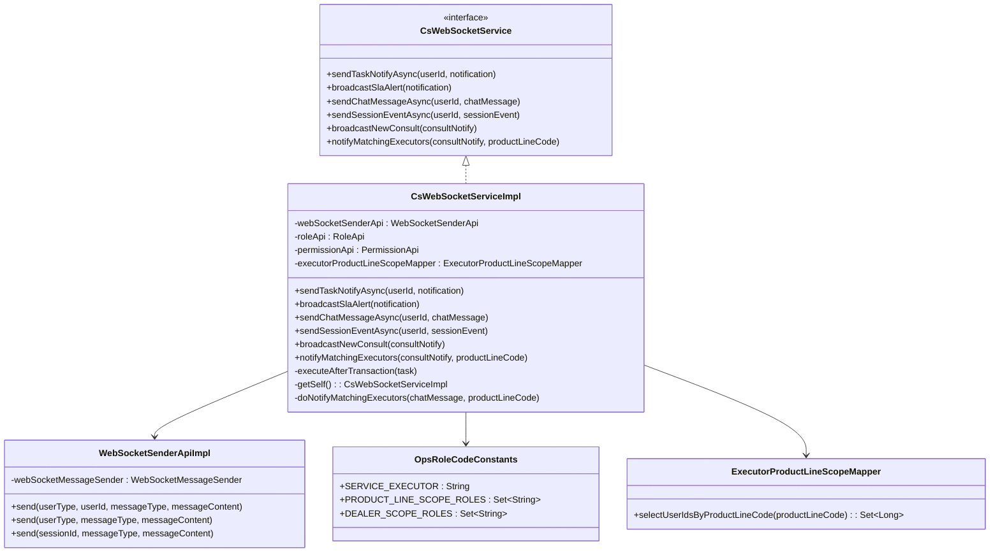
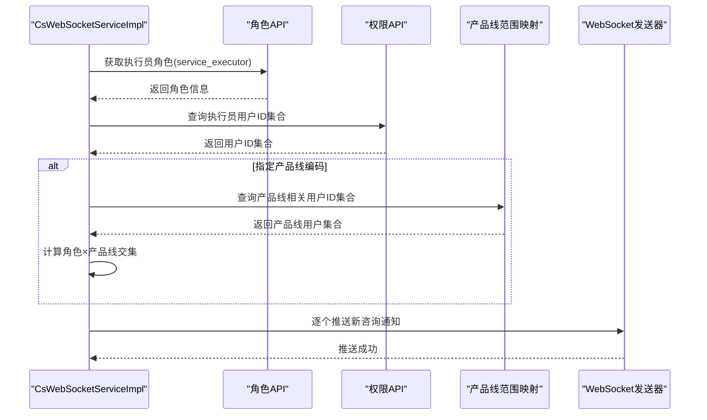
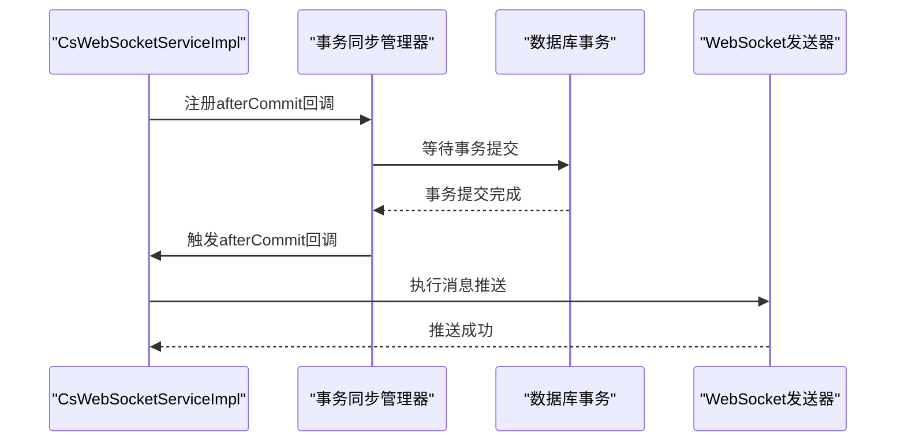
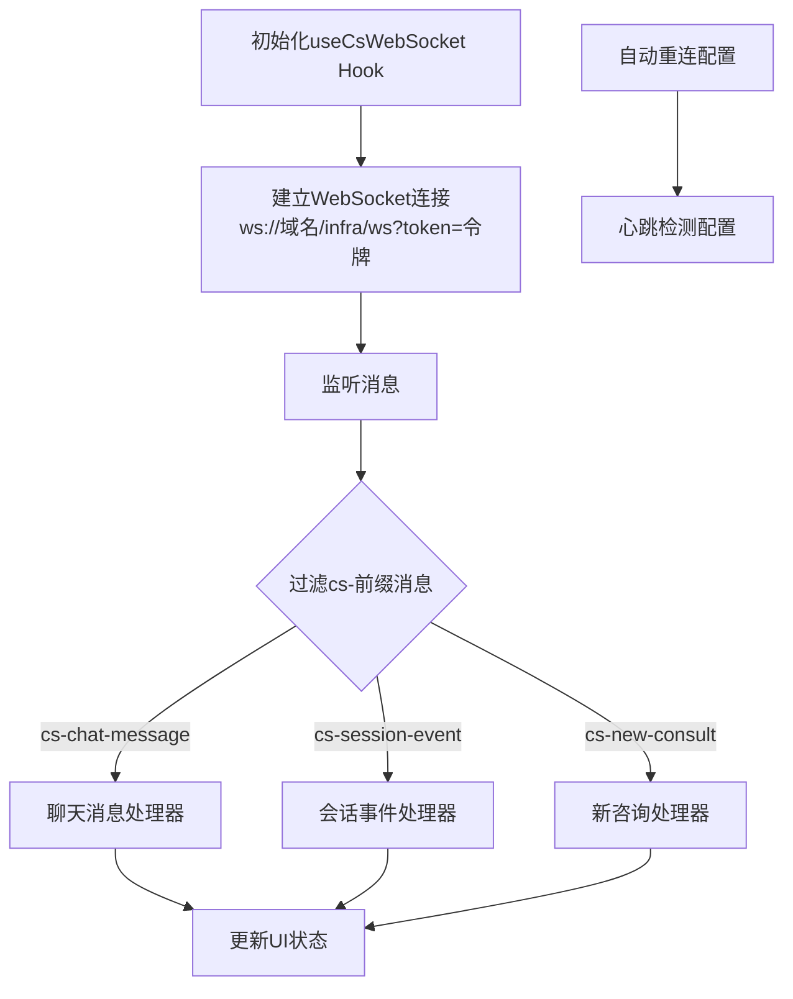
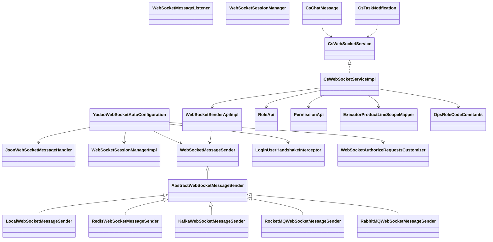

# WebSocket实时通信服务

<cite>
**本文档引用的文件**
- [WebSocketProperties.java](file://yudao-framework/yudao-spring-boot-starter-websocket/src/main/java/cn/iocoder/yudao/framework/websocket/config/WebSocketProperties.java)
- [YudaoWebSocketAutoConfiguration.java](file://yudao-framework/yudao-spring-boot-starter-websocket/src/main/java/cn/iocoder/yudao/framework/websocket/config/YudaoWebSocketAutoConfiguration.java)
- [JsonWebSocketMessageHandler.java](file://yudao-framework/yudao-spring-boot-starter-websocket/src/main/java/cn/iocoder/yudao/framework/websocket/core/handler/JsonWebSocketMessageHandler.java)
- [WebSocketMessageListener.java](file://yudao-framework/yudao-spring-boot-starter-websocket/src/main/java/cn/iocoder/yudao/framework/websocket/core/listener/WebSocketMessageListener.java)
- [JsonWebSocketMessage.java](file://yudao-framework/yudao-spring-boot-starter-websocket/src/main/java/cn/iocoder/yudao/framework/websocket/core/message/JsonWebSocketMessage.java)
- [WebSocketSessionManager.java](file://yudao-framework/yudao-spring-boot-starter-websocket/src/main/java/cn/iocoder/yudao/framework/websocket/core/session/WebSocketSessionManager.java)
- [WebSocketSessionManagerImpl.java](file://yudao-framework/yudao-spring-boot-starter-websocket/src/main/java/cn/iocoder/yudao/framework/websocket/core/session/WebSocketSessionManagerImpl.java)
- [WebSocketSessionHandlerDecorator.java](file://yudao-framework/yudao-spring-boot-starter-websocket/src/main/java/cn/iocoder/yudao/framework/websocket/core/session/WebSocketSessionHandlerDecorator.java)
- [WebSocketAuthorizeRequestsCustomizer.java](file://yudao-framework/yudao-spring-boot-starter-websocket/src/main/java/cn/iocoder/yudao/framework/websocket/core/security/WebSocketAuthorizeRequestsCustomizer.java)
- [LoginUserHandshakeInterceptor.java](file://yudao-framework/yudao-spring-boot-starter-websocket/src/main/java/cn/iocoder/yudao/framework/websocket/core/security/LoginUserHandshakeInterceptor.java)
- [WebSocketMessageSender.java](file://yudao-framework/yudao-spring-boot-starter-websocket/src/main/java/cn/iocoder/yudao/framework/websocket/core/sender/WebSocketMessageSender.java)
- [AbstractWebSocketMessageSender.java](file://yudao-framework/yudao-spring-boot-starter-websocket/src/main/java/cn/iocoder/yudao/framework/websocket/core/sender/AbstractWebSocketMessageSender.java)
- [LocalWebSocketMessageSender.java](file://yudao-framework/yudao-spring-boot-starter-websocket/src/main/java/cn/iocoder/yudao/framework/websocket/core/sender/local/LocalWebSocketMessageSender.java)
- [RedisWebSocketMessage.java](file://yudao-framework/yudao-spring-boot-starter-websocket/src/main/java/cn/iocoder/yudao/framework/websocket/core/sender/redis/RedisWebSocketMessage.java)
- [RedisWebSocketMessageConsumer.java](file://yudao-framework/yudao-spring-boot-starter-websocket/src/main/java/cn/iocoder/yudao/framework/websocket/core/sender/redis/RedisWebSocketMessageConsumer.java)
- [RedisWebSocketMessageSender.java](file://yudao-framework/yudao-spring-boot-starter-websocket/src/main/java/cn/iocoder/yudao/framework/websocket/core/sender/redis/RedisWebSocketMessageSender.java)
- [KafkaWebSocketMessage.java](file://yudao-framework/yudao-spring-boot-starter-websocket/src/main/java/cn/iocoder/yudao/framework/websocket/core/sender/kafka/KafkaWebSocketMessage.java)
- [KafkaWebSocketMessageConsumer.java](file://yudao-framework/yudao-spring-boot-starter-websocket/src/main/java/cn/iocoder/yudao/framework/websocket/core/sender/kafka/KafkaWebSocketMessageConsumer.java)
- [KafkaWebSocketMessageSender.java](file://yudao-framework/yudao-spring-boot-starter-websocket/src/main/java/cn/iocoder/yudao/framework/websocket/core/sender/kafka/KafkaWebSocketMessageSender.java)
- [RocketMQWebSocketMessage.java](file://yudao-framework/yudao-spring-boot-starter-websocket/src/main/java/cn/iocoder/yudao/framework/websocket/core/sender/rocketmq/RocketMQWebSocketMessage.java)
- [RocketMQWebSocketMessageConsumer.java](file://yudao-framework/yudao-spring-boot-starter-websocket/src/main/java/cn/iocoder/yudao/framework/websocket/core/sender/rocketmq/RocketMQWebSocketMessageConsumer.java)
- [RocketMQWebSocketMessageSender.java](file://yudao-framework/yudao-spring-boot-starter-websocket/src/main/java/cn/iocoder/yudao/framework/websocket/core/sender/rocketmq/RocketMQWebSocketMessageSender.java)
- [RabbitMQWebSocketMessage.java](file://yudao-framework/yudao-spring-boot-starter-websocket/src/main/java/cn/iocoder/yudao/framework/websocket/core/sender/rabbitmq/RabbitMQWebSocketMessage.java)
- [RabbitMQWebSocketMessageConsumer.java](file://yudao-framework/yudao-spring-boot-starter-websocket/src/main/java/cn/iocoder/yudao/framework/websocket/core/sender/rabbitmq/RabbitMQWebSocketMessageConsumer.java)
- [RabbitMQWebSocketMessageSender.java](file://yudao-framework/yudao-spring-boot-starter-websocket/src/main/java/cn/iocoder/yudao/framework/websocket/core/sender/rabbitmq/RabbitMQWebSocketMessageSender.java)
- [WebSocketSenderApi.java](file://yudao-module-infra/src/main/java/cn/iocoder/yudao/module/infra/api/websocket/WebSocketSenderApi.java)
- [WebSocketSenderApiImpl.java](file://yudao-module-infra/src/main/java/cn/iocoder/yudao/module/infra/api/websocket/WebSocketSenderApiImpl.java)
- [CsWebSocketService.java](file://yudao-module-opshub/src/main/java/cn/iocoder/yudao/module/opshub/service/cs/websocket/CsWebSocketService.java)
- [CsWebSocketServiceImpl.java](file://yudao-module-opshub/src/main/java/cn/iocoder/yudao/module/opshub/service/cs/websocket/impl/CsWebSocketServiceImpl.java)
- [CsChatMessage.java](file://yudao-module-opshub/src/main/java/cn/iocoder/yudao/module/opshub/service/cs/websocket/dto/CsChatMessage.java)
- [CsTaskNotification.java](file://yudao-module-opshub/src/main/java/cn/iocoder/yudao/module/opshub/service/cs/websocket/dto/CsTaskNotification.java)
- [OpsRoleCodeConstants.java](file://yudao-module-opshub/src/main/java/cn/iocoder/yudao/module/opshub/enums/OpsRoleCodeConstants.java)
- [ExecutorProductLineScopeMapper.java](file://yudao-module-opshub/src/main/java/cn/iocoder/yudao/module/opshub/dal/mysql/dealer/ExecutorProductLineScopeMapper.java)
- [useCsWebSocket.ts](file://yudao-ui/yudao-ui-admin-vue3/src/hooks/useCsWebSocket.ts)
</cite>

## 更新摘要
**所做更改**
- 更新电商客服系统WebSocket集成章节，反映通知系统的重构：从broadcastNewConsult广播机制改为notifyMatchingExecutors精确匹配执行器的通知系统
- 新增角色和产品线范围过滤机制的详细说明
- 更新消息路由算法，增加精确匹配执行器的消息分发策略
- 更新客户端WebSocket Hook实现，支持新的通知类型处理
- 增强权限控制和安全防护措施

## 目录
1. [引言](#引言)
2. [项目结构](#项目结构)
3. [核心组件](#核心组件)
4. [架构总览](#架构总览)
5. [详细组件分析](#详细组件分析)
6. [电商客服系统集成](#电商客服系统集成)
7. [客户端WebSocket实现](#客户端websocket实现)
8. [依赖关系分析](#依赖关系分析)
9. [性能考虑](#性能考虑)
10. [故障排查指南](#故障排查指南)
11. [结论](#结论)
12. [附录](#附录)

## 引言
本文件面向WebSocket实时通信服务的技术文档，系统性阐述连接管理机制（连接建立、心跳检测、断线重连、连接池管理）、消息路由算法（用户标识、会话管理、消息分发策略）、配置参数（超时、缓冲区、并发限制）、连接状态监控与异常处理、性能优化策略（连接复用、消息压缩、批量处理），以及安全防护（认证、消息加密、访问控制）。文档基于仓库中的实际实现进行分析，确保读者能够准确理解系统的架构与运行机制。

**更新** 本次更新特别反映了电商客服系统WebSocket通知系统的重大重构：从传统的广播机制（broadcastNewConsult）转变为精确匹配执行器的通知系统（notifyMatchingExecutors），支持基于角色和产品线范围的精细化权限控制，为电商客服系统提供更加精准和高效的通知解决方案。

## 项目结构
WebSocket相关能力主要集中在框架模块、基础设施模块和电商客服模块中：
- 框架层提供WebSocket自动装配、消息编解码、会话管理、消息发送器抽象与多后端实现（本地、Redis、Kafka、RocketMQ、RabbitMQ）、安全拦截与鉴权定制等。
- 基础设施模块提供对外的发送器API接口与实现，便于业务模块调用。
- 电商客服模块提供专门的WebSocket服务接口和实现，支持客服消息的实时推送和精确匹配执行器通知。

**图表来源**
- [YudaoWebSocketAutoConfiguration.java](file://yudao-framework/yudao-spring-boot-starter-websocket/src/main/java/cn/iocoder/yudao/framework/websocket/config/YudaoWebSocketAutoConfiguration.java)
- [WebSocketSenderApiImpl.java](file://yudao-module-infra/src/main/java/cn/iocoder/yudao/module/infra/api/websocket/WebSocketSenderApiImpl.java)
- [CsWebSocketServiceImpl.java](file://yudao-module-opshub/src/main/java/cn/iocoder/yudao/module/opshub/service/cs/websocket/impl/CsWebSocketServiceImpl.java)
- [useCsWebSocket.ts](file://yudao-ui/yudao-ui-admin-vue3/src/hooks/useCsWebSocket.ts)

**章节来源**
- [YudaoWebSocketAutoConfiguration.java](file://yudao-framework/yudao-spring-boot-starter-websocket/src/main/java/cn/iocoder/yudao/framework/websocket/config/YudaoWebSocketAutoConfiguration.java)
- [WebSocketProperties.java](file://yudao-framework/yudao-spring-boot-starter-websocket/src/main/java/cn/iocoder/yudao/framework/websocket/config/WebSocketProperties.java)
- [CsWebSocketService.java](file://yudao-module-opshub/src/main/java/cn/iocoder/yudao/module/opshub/service/cs/websocket/CsWebSocketService.java)
- [CsWebSocketServiceImpl.java](file://yudao-module-opshub/src/main/java/cn/iocoder/yudao/module/opshub/service/cs/websocket/impl/CsWebSocketServiceImpl.java)

## 核心组件
- 配置中心：定义WebSocket连接路径与消息发送器类型等配置项。
- 自动装配：负责注册消息处理器、会话管理器、消息发送器、安全拦截与鉴权定制等。
- 消息编解码：以JSON格式的消息体进行收发，支持类型与内容分离。
- 会话管理：维护用户类型、用户ID、Session ID之间的映射关系，支持按用户或按Session分发。
- 消息发送器：抽象统一的发送接口，提供本地与多种中间件（Redis、Kafka、RocketMQ、RabbitMQ）实现。
- 安全控制：握手阶段进行登录用户绑定与请求授权定制。
- **新增** 电商客服服务：提供专门的客服消息推送接口，支持事务感知、异步处理和精确匹配执行器通知。

**章节来源**
- [WebSocketProperties.java](file://yudao-framework/yudao-spring-boot-starter-websocket/src/main/java/cn/iocoder/yudao/framework/websocket/config/WebSocketProperties.java)
- [YudaoWebSocketAutoConfiguration.java](file://yudao-framework/yudao-spring-boot-starter-websocket/src/main/java/cn/iocoder/yudao/framework/websocket/config/YudaoWebSocketAutoConfiguration.java)
- [JsonWebSocketMessageHandler.java](file://yudao-framework/yudao-spring-boot-starter-websocket/src/main/java/cn/iocoder/yudao/framework/websocket/core/handler/JsonWebSocketMessageHandler.java)
- [JsonWebSocketMessage.java](file://yudao-framework/yudao-spring-boot-starter-websocket/src/main/java/cn/iocoder/yudao/framework/websocket/core/message/JsonWebSocketMessage.java)
- [WebSocketSessionManager.java](file://yudao-framework/yudao-spring-boot-starter-websocket/src/main/java/cn/iocoder/yudao/framework/websocket/core/session/WebSocketSessionManager.java)
- [WebSocketSessionManagerImpl.java](file://yudao-framework/yudao-spring-boot-starter-websocket/src/main/java/cn/iocoder/yudao/framework/websocket/core/session/WebSocketSessionManagerImpl.java)
- [WebSocketMessageSender.java](file://yudao-framework/yudao-spring-boot-starter-websocket/src/main/java/cn/iocoder/yudao/framework/websocket/core/sender/WebSocketMessageSender.java)
- [AbstractWebSocketMessageSender.java](file://yudao-framework/yudao-spring-boot-starter-websocket/src/main/java/cn/iocoder/yudao/framework/websocket/core/sender/AbstractWebSocketMessageSender.java)
- [WebSocketAuthorizeRequestsCustomizer.java](file://yudao-framework/yudao-spring-boot-starter-websocket/src/main/java/cn/iocoder/yudao/framework/websocket/core/security/WebSocketAuthorizeRequestsCustomizer.java)
- [LoginUserHandshakeInterceptor.java](file://yudao-framework/yudao-spring-boot-starter-websocket/src/main/java/cn/iocoder/yudao/framework/websocket/core/security/LoginUserHandshakeInterceptor.java)
- [CsWebSocketService.java](file://yudao-module-opshub/src/main/java/cn/iocoder/yudao/module/opshub/service/cs/websocket/CsWebSocketService.java)

## 架构总览
WebSocket整体架构围绕"自动装配—消息编解码—会话管理—消息发送—安全控制"展开，支持本地直发与分布式广播两种模式，并通过配置项选择发送器类型。新增的电商客服系统通过专门的服务接口实现消息的事务感知、异步推送和精确匹配执行器通知，支持基于角色和产品线范围的精细化权限控制。

**图表来源**
- [YudaoWebSocketAutoConfiguration.java](file://yudao-framework/yudao-spring-boot-starter-websocket/src/main/java/cn/iocoder/yudao/framework/websocket/config/YudaoWebSocketAutoConfiguration.java)
- [JsonWebSocketMessageHandler.java](file://yudao-framework/yudao-spring-boot-starter-websocket/src/main/java/cn/iocoder/yudao/framework/websocket/core/handler/JsonWebSocketMessageHandler.java)
- [WebSocketMessageListener.java](file://yudao-framework/yudao-spring-boot-starter-websocket/src/main/java/cn/iocoder/yudao/framework/websocket/core/listener/WebSocketMessageListener.java)
- [WebSocketSessionManagerImpl.java](file://yudao-framework/yudao-spring-boot-starter-websocket/src/main/java/cn/iocoder/yudao/framework/websocket/core/session/WebSocketSessionManagerImpl.java)
- [AbstractWebSocketMessageSender.java](file://yudao-framework/yudao-spring-boot-starter-websocket/src/main/java/cn/iocoder/yudao/framework/websocket/core/sender/AbstractWebSocketMessageSender.java)
- [LocalWebSocketMessageSender.java](file://yudao-framework/yudao-spring-boot-starter-websocket/src/main/java/cn/iocoder/yudao/framework/websocket/core/sender/local/LocalWebSocketMessageSender.java)
- [RedisWebSocketMessageSender.java](file://yudao-framework/yudao-spring-boot-starter-websocket/src/main/java/cn/iocoder/yudao/framework/websocket/core/sender/redis/RedisWebSocketMessageSender.java)
- [KafkaWebSocketMessageSender.java](file://yudao-framework/yudao-spring-boot-starter-websocket/src/main/java/cn/iocoder/yudao/framework/websocket/core/sender/kafka/KafkaWebSocketMessageSender.java)
- [RocketMQWebSocketMessageSender.java](file://yudao-framework/yudao-spring-boot-starter-websocket/src/main/java/cn/iocoder/yudao/framework/websocket/core/sender/rocketmq/RocketMQWebSocketMessageSender.java)
- [RabbitMQWebSocketMessageSender.java](file://yudao-framework/yudao-spring-boot-starter-websocket/src/main/java/cn/iocoder/yudao/framework/websocket/core/sender/rabbitmq/RabbitMQWebSocketMessageSender.java)
- [WebSocketSenderApiImpl.java](file://yudao-module-infra/src/main/java/cn/iocoder/yudao/module/infra/api/websocket/WebSocketSenderApiImpl.java)
- [CsWebSocketServiceImpl.java](file://yudao-module-opshub/src/main/java/cn/iocoder/yudao/module/opshub/service/cs/websocket/impl/CsWebSocketServiceImpl.java)

## 详细组件分析

### 连接管理机制
- 连接建立：通过自动装配注册的WebSocket处理器与会话管理器完成握手与会话初始化，登录用户信息在握手阶段注入。
- 心跳检测：当前仓库未直接暴露心跳配置与实现细节；建议结合Spring WebSocket的SockJS与STOMP配置补充心跳参数（例如超时、缓冲区、并发限制）。
- 断线重连：当前仓库未提供断线重连的具体实现；可在客户端侧实现指数退避与最大重试次数策略，并在服务端侧保留会话上下文以便恢复。
- 连接池管理：当前仓库未提供连接池实现；可结合Netty或Tomcat的WebSocket容器参数进行连接数与并发限制配置。

**图表来源**
- [LoginUserHandshakeInterceptor.java](file://yudao-framework/yudao-spring-boot-starter-websocket/src/main/java/cn/iocoder/yudao/framework/websocket/core/security/LoginUserHandshakeInterceptor.java)
- [WebSocketSessionManagerImpl.java](file://yudao-framework/yudao-spring-boot-starter-websocket/src/main/java/cn/iocoder/yudao/framework/websocket/core/session/WebSocketSessionManagerImpl.java)
- [JsonWebSocketMessageHandler.java](file://yudao-framework/yudao-spring-boot-starter-websocket/src/main/java/cn/iocoder/yudao/framework/websocket/core/handler/JsonWebSocketMessageHandler.java)

**章节来源**
- [YudaoWebSocketAutoConfiguration.java](file://yudao-framework/yudao-spring-boot-starter-websocket/src/main/java/cn/iocoder/yudao/framework/websocket/config/YudaoWebSocketAutoConfiguration.java)
- [LoginUserHandshakeInterceptor.java](file://yudao-framework/yudao-spring-boot-starter-websocket/src/main/java/cn/iocoder/yudao/framework/websocket/core/security/LoginUserHandshakeInterceptor.java)
- [WebSocketSessionManagerImpl.java](file://yudao-framework/yudao-spring-boot-starter-websocket/src/main/java/cn/iocoder/yudao/framework/websocket/core/session/WebSocketSessionManagerImpl.java)

### 消息路由算法
- 用户标识：消息体包含用户类型与用户ID，用于按用户维度路由。
- 会话管理：会话管理器维护用户类型/用户ID到Session ID的映射，支持按用户或按Session分发。
- 消息分发策略：根据配置选择发送器类型，本地直发或通过中间件广播至其他节点。
- **新增** 精确匹配执行器通知：支持基于角色和产品线范围的精确匹配，将新咨询通知推送给符合条件的执行员集合。

**图表来源**
- [JsonWebSocketMessage.java](file://yudao-framework/yudao-spring-boot-starter-websocket/src/main/java/cn/iocoder/yudao/framework/websocket/core/message/JsonWebSocketMessage.java)
- [WebSocketSessionManagerImpl.java](file://yudao-framework/yudao-spring-boot-starter-websocket/src/main/java/cn/iocoder/yudao/framework/websocket/core/session/WebSocketSessionManagerImpl.java)
- [WebSocketMessageSender.java](file://yudao-framework/yudao-spring-boot-starter-websocket/src/main/java/cn/iocoder/yudao/framework/websocket/core/sender/WebSocketMessageSender.java)
- [CsChatMessage.java](file://yudao-module-opshub/src/main/java/cn/iocoder/yudao/module/opshub/service/cs/websocket/dto/CsChatMessage.java)
- [OpsRoleCodeConstants.java](file://yudao-module-opshub/src/main/java/cn/iocoder/yudao/module/opshub/enums/OpsRoleCodeConstants.java)
- [ExecutorProductLineScopeMapper.java](file://yudao-module-opshub/src/main/java/cn/iocoder/yudao/module/opshub/dal/mysql/dealer/ExecutorProductLineScopeMapper.java)

**章节来源**
- [JsonWebSocketMessage.java](file://yudao-framework/yudao-spring-boot-starter-websocket/src/main/java/cn/iocoder/yudao/framework/websocket/core/message/JsonWebSocketMessage.java)
- [WebSocketSessionManager.java](file://yudao-framework/yudao-spring-boot-starter-websocket/src/main/java/cn/iocoder/yudao/framework/websocket/core/session/WebSocketSessionManager.java)
- [WebSocketSessionManagerImpl.java](file://yudao-framework/yudao-spring-boot-starter-websocket/src/main/java/cn/iocoder/yudao/framework/websocket/core/session/WebSocketSessionManagerImpl.java)
- [WebSocketMessageSender.java](file://yudao-framework/yudao-spring-boot-starter-websocket/src/main/java/cn/iocoder/yudao/framework/websocket/core/sender/WebSocketMessageSender.java)
- [CsChatMessage.java](file://yudao-module-opshub/src/main/java/cn/iocoder/yudao/module/opshub/service/cs/websocket/dto/CsChatMessage.java)
- [OpsRoleCodeConstants.java](file://yudao-module-opshub/src/main/java/cn/iocoder/yudao/module/opshub/enums/OpsRoleCodeConstants.java)
- [ExecutorProductLineScopeMapper.java](file://yudao-module-opshub/src/main/java/cn/iocoder/yudao/module/opshub/dal/mysql/dealer/ExecutorProductLineScopeMapper.java)

### 配置参数
- 连接路径：可通过配置项设置WebSocket连接路径，默认为/ws。
- 发送器类型：可选local、redis、rocketmq、kafka、rabbitmq，用于决定消息分发方式。
- **新增** 电商客服配置：支持客服消息的专门配置和路由规则，包括精确匹配执行器的通知配置。

**章节来源**
- [WebSocketProperties.java](file://yudao-framework/yudao-spring-boot-starter-websocket/src/main/java/cn/iocoder/yudao/framework/websocket/config/WebSocketProperties.java)

### 连接状态监控与异常处理
- 监控：当前仓库未提供专门的连接状态监控实现；建议结合Actuator与自定义指标收集连接数、消息吞吐量、错误率等。
- 异常处理：当前仓库未提供专门的异常处理实现；建议在消息处理器与发送器中增加try-catch与降级策略，记录异常日志并返回友好提示。
- **新增** 电商客服异常处理：客服消息推送包含事务感知和异常日志记录，确保消息推送的可靠性。精确匹配执行器通知包含角色查找、权限验证和产品线范围过滤的异常处理。

**章节来源**
- [CsWebSocketServiceImpl.java](file://yudao-module-opshub/src/main/java/cn/iocoder/yudao/module/opshub/service/cs/websocket/impl/CsWebSocketServiceImpl.java)

### 性能优化策略
- 连接复用：建议客户端使用长连接与连接池，减少握手开销。
- 消息压缩：对大消息采用压缩传输，降低带宽占用。
- 批量处理：聚合多条小消息为批次发送，提升吞吐量。
- 发送器选择：在单机场景使用local，在集群场景使用Redis/Kafka/RocketMQ/RabbitMQ广播，平衡延迟与一致性。
- **新增** 事务感知推送：客服消息推送采用事务感知机制，确保数据库变更可见性后再推送消息，避免脏读问题。
- **新增** 精确匹配优化：执行员角色和产品线范围的查询采用缓存和索引优化，减少权限验证的性能开销。

**章节来源**
- [CsWebSocketServiceImpl.java](file://yudao-module-opshub/src/main/java/cn/iocoder/yudao/module/opshub/service/cs/websocket/impl/CsWebSocketServiceImpl.java)

### 安全防护措施
- 连接认证：握手阶段绑定登录用户，拒绝未认证请求。
- 访问控制：通过鉴权定制器限制特定URL或用户角色的访问。
- 消息加密：建议在应用层对敏感消息进行加解密处理（当前仓库未提供具体实现）。
- **新增** 精确权限控制：执行员角色验证和产品线范围过滤确保只有符合条件的用户才能接收新咨询通知。
- **新增** 客服消息过滤：客户端仅处理以cs-前缀的消息类型，确保只接收电商客服相关的实时消息。

**章节来源**
- [LoginUserHandshakeInterceptor.java](file://yudao-framework/yudao-spring-boot-starter-websocket/src/main/java/cn/iocoder/yudao/framework/websocket/core/security/LoginUserHandshakeInterceptor.java)
- [WebSocketAuthorizeRequestsCustomizer.java](file://yudao-framework/yudao-spring-boot-starter-websocket/src/main/java/cn/iocoder/yudao/framework/websocket/core/security/WebSocketAuthorizeRequestsCustomizer.java)
- [useCsWebSocket.ts](file://yudao-ui/yudao-ui-admin-vue3/src/hooks/useCsWebSocket.ts)

## 电商客服系统集成

### 客服WebSocket服务接口
电商客服系统提供了专门的WebSocket服务接口，支持客服消息的实时推送和精确匹配执行器通知。该接口包含以下核心方法：

- `sendChatMessageAsync`: 推送聊天消息给指定用户（事务感知 + 异步）
- `sendSessionEventAsync`: 推送会话事件给指定用户（接单/完成/关闭）（事务感知 + 异步）
- `broadcastNewConsult`: 广播新咨询通知给所有管理端用户（事务感知 + 异步）
- **新增** `notifyMatchingExecutors`: 精确推送新咨询通知给匹配的执行员（按角色 + 产品线交集，事务感知 + 异步）

**图表来源**
- [CsWebSocketService.java](file://yudao-module-opshub/src/main/java/cn/iocoder/yudao/module/opshub/service/cs/websocket/CsWebSocketService.java)
- [CsWebSocketServiceImpl.java](file://yudao-module-opshub/src/main/java/cn/iocoder/yudao/module/opshub/service/cs/websocket/impl/CsWebSocketServiceImpl.java)
- [WebSocketSenderApiImpl.java](file://yudao-module-infra/src/main/java/cn/iocoder/yudao/module/infra/api/websocket/WebSocketSenderApiImpl.java)
- [OpsRoleCodeConstants.java](file://yudao-module-opshub/src/main/java/cn/iocoder/yudao/module/opshub/enums/OpsRoleCodeConstants.java)
- [ExecutorProductLineScopeMapper.java](file://yudao-module-opshub/src/main/java/cn/iocoder/yudao/module/opshub/dal/mysql/dealer/ExecutorProductLineScopeMapper.java)

**章节来源**
- [CsWebSocketService.java](file://yudao-module-opshub/src/main/java/cn/iocoder/yudao/module/opshub/service/cs/websocket/CsWebSocketService.java)
- [CsWebSocketServiceImpl.java](file://yudao-module-opshub/src/main/java/cn/iocoder/yudao/module/opshub/service/cs/websocket/impl/CsWebSocketServiceImpl.java)

### 精确匹配执行器通知系统
**更新** 电商客服系统的核心变更是从传统的广播机制（broadcastNewConsult）转变为精确匹配执行器的通知系统（notifyMatchingExecutors），支持基于角色和产品线范围的精细化权限控制。

#### 通知系统架构
精确匹配执行器通知系统包含以下关键组件：

1. **角色验证**：通过RoleApi获取执行员角色（service_executor）并验证存在性
2. **权限查询**：通过PermissionApi获取具有执行员角色的所有用户ID集合
3. **产品线过滤**：可选的产品线范围过滤，通过ExecutorProductLineScopeMapper获取产品线相关的用户集合
4. **精确推送**：对筛选后的用户集合逐一推送新咨询通知

**图表来源**
- [CsWebSocketServiceImpl.java](file://yudao-module-opshub/src/main/java/cn/iocoder/yudao/module/opshub/service/cs/websocket/impl/CsWebSocketServiceImpl.java)
- [OpsRoleCodeConstants.java](file://yudao-module-opshub/src/main/java/cn/iocoder/yudao/module/opshub/enums/OpsRoleCodeConstants.java)
- [ExecutorProductLineScopeMapper.java](file://yudao-module-opshub/src/main/java/cn/iocoder/yudao/module/opshub/dal/mysql/dealer/ExecutorProductLineScopeMapper.java)

#### 权限控制机制
系统支持基于角色和产品线范围的双重权限控制：

- **角色维度**：通过`OpsRoleCodeConstants.SERVICE_EXECUTOR`标识执行员角色
- **产品线维度**：通过`ExecutorProductLineScopeMapper`实现产品线范围过滤
- **权限组合**：执行员角色与产品线范围的交集作为最终通知目标

**章节来源**
- [CsWebSocketServiceImpl.java](file://yudao-module-opshub/src/main/java/cn/iocoder/yudao/module/opshub/service/cs/websocket/impl/CsWebSocketServiceImpl.java)
- [OpsRoleCodeConstants.java](file://yudao-module-opshub/src/main/java/cn/iocoder/yudao/module/opshub/enums/OpsRoleCodeConstants.java)
- [ExecutorProductLineScopeMapper.java](file://yudao-module-opshub/src/main/java/cn/iocoder/yudao/module/opshub/dal/mysql/dealer/ExecutorProductLineScopeMapper.java)

### 客服消息类型定义
电商客服系统定义了三种主要的消息类型，每种类型都有对应的DTO和常量定义：

#### 聊天消息类型（cs-chat-message）
用于推送客服聊天中的新消息，包含消息ID、会话ID、发送人信息、消息内容等。

#### 会话事件类型（cs-session-event）
用于推送会话状态变化事件，包括接单（accepted）、完成（completed）、关闭（closed）等状态。

#### 新咨询通知类型（cs-new-consult）
用于广播新的咨询请求给所有管理端用户，支持客服团队协作。

**章节来源**
- [CsChatMessage.java](file://yudao-module-opshub/src/main/java/cn/iocoder/yudao/module/opshub/service/cs/websocket/dto/CsChatMessage.java)

### 事务感知推送机制
客服WebSocket服务实现了事务感知的推送机制，确保在数据库事务提交后再推送消息，避免客户端收到消息时数据库变更尚未可见的问题。

**图表来源**
- [CsWebSocketServiceImpl.java](file://yudao-module-opshub/src/main/java/cn/iocoder/yudao/module/opshub/service/cs/websocket/impl/CsWebSocketServiceImpl.java)

**章节来源**
- [CsWebSocketServiceImpl.java](file://yudao-module-opshub/src/main/java/cn/iocoder/yudao/module/opshub/service/cs/websocket/impl/CsWebSocketServiceImpl.java)

## 客户端WebSocket实现

### Vueuse WebSocket Hook
客户端通过Vueuse提供的useWebSocket Hook实现WebSocket连接管理，支持自动重连和心跳检测功能。

**图表来源**
- [useCsWebSocket.ts](file://yudao-ui/yudao-ui-admin-vue3/src/hooks/useCsWebSocket.ts)

### 消息处理流程
客户端Hook实现了完整的消息处理流程，包括连接建立、消息解析、类型判断和UI更新。

**章节来源**
- [useCsWebSocket.ts](file://yudao-ui/yudao-ui-admin-vue3/src/hooks/useCsWebSocket.ts)

## 依赖关系分析
- 自动装配依赖于消息处理器、会话管理器、消息发送器与安全组件。
- 消息发送器依赖于会话管理器进行用户到会话的映射。
- 不同发送器实现共享抽象基类，保证统一接口与扩展性。
- 发送器API实现依赖于消息发送器，供业务模块调用。
- **新增** 电商客服服务依赖于发送器API实现、角色API、权限API和产品线范围映射器，实现客服消息的专门推送和精确匹配执行器通知。

**图表来源**
- [YudaoWebSocketAutoConfiguration.java](file://yudao-framework/yudao-spring-boot-starter-websocket/src/main/java/cn/iocoder/yudao/framework/websocket/config/YudaoWebSocketAutoConfiguration.java)
- [JsonWebSocketMessageHandler.java](file://yudao-framework/yudao-spring-boot-starter-websocket/src/main/java/cn/iocoder/yudao/framework/websocket/core/handler/JsonWebSocketMessageHandler.java)
- [WebSocketMessageListener.java](file://yudao-framework/yudao-spring-boot-starter-websocket/src/main/java/cn/iocoder/yudao/framework/websocket/core/listener/WebSocketMessageListener.java)
- [WebSocketSessionManager.java](file://yudao-framework/yudao-spring-boot-starter-websocket/src/main/java/cn/iocoder/yudao/framework/websocket/core/session/WebSocketSessionManager.java)
- [WebSocketSessionManagerImpl.java](file://yudao-framework/yudao-spring-boot-starter-websocket/src/main/java/cn/iocoder/yudao/framework/websocket/core/session/WebSocketSessionManagerImpl.java)
- [WebSocketMessageSender.java](file://yudao-framework/yudao-spring-boot-starter-websocket/src/main/java/cn/iocoder/yudao/framework/websocket/core/sender/WebSocketMessageSender.java)
- [AbstractWebSocketMessageSender.java](file://yudao-framework/yudao-spring-boot-starter-websocket/src/main/java/cn/iocoder/yudao/framework/websocket/core/sender/AbstractWebSocketMessageSender.java)
- [LocalWebSocketMessageSender.java](file://yudao-framework/yudao-spring-boot-starter-websocket/src/main/java/cn/iocoder/yudao/framework/websocket/core/sender/local/LocalWebSocketMessageSender.java)
- [RedisWebSocketMessageSender.java](file://yudao-framework/yudao-spring-boot-starter-websocket/src/main/java/cn/iocoder/yudao/framework/websocket/core/sender/redis/RedisWebSocketMessageSender.java)
- [KafkaWebSocketMessageSender.java](file://yudao-framework/yudao-spring-boot-starter-websocket/src/main/java/cn/iocoder/yudao/framework/websocket/core/sender/kafka/KafkaWebSocketMessageSender.java)
- [RocketMQWebSocketMessageSender.java](file://yudao-framework/yudao-spring-boot-starter-websocket/src/main/java/cn/iocoder/yudao/framework/websocket/core/sender/rocketmq/RocketMQWebSocketMessageSender.java)
- [RabbitMQWebSocketMessageSender.java](file://yudao-framework/yudao-spring-boot-starter-websocket/src/main/java/cn/iocoder/yudao/framework/websocket/core/sender/rabbitmq/RabbitMQWebSocketMessageSender.java)
- [WebSocketSenderApiImpl.java](file://yudao-module-infra/src/main/java/cn/iocoder/yudao/module/infra/api/websocket/WebSocketSenderApiImpl.java)
- [CsWebSocketService.java](file://yudao-module-opshub/src/main/java/cn/iocoder/yudao/module/opshub/service/cs/websocket/CsWebSocketService.java)
- [CsWebSocketServiceImpl.java](file://yudao-module-opshub/src/main/java/cn/iocoder/yudao/module/opshub/service/cs/websocket/impl/CsWebSocketServiceImpl.java)
- [CsChatMessage.java](file://yudao-module-opshub/src/main/java/cn/iocoder/yudao/module/opshub/service/cs/websocket/dto/CsChatMessage.java)
- [CsTaskNotification.java](file://yudao-module-opshub/src/main/java/cn/iocoder/yudao/module/opshub/service/cs/websocket/dto/CsTaskNotification.java)
- [RoleApi.java](file://yudao-module-opshub/src/main/java/cn/iocoder/yudao/module/system/api/permission/RoleApi.java)
- [PermissionApi.java](file://yudao-module-opshub/src/main/java/cn/iocoder/yudao/module/system/api/permission/PermissionApi.java)
- [ExecutorProductLineScopeMapper.java](file://yudao-module-opshub/src/main/java/cn/iocoder/yudao/module/opshub/dal/mysql/dealer/ExecutorProductLineScopeMapper.java)
- [OpsRoleCodeConstants.java](file://yudao-module-opshub/src/main/java/cn/iocoder/yudao/module/opshub/enums/OpsRoleCodeConstants.java)

**章节来源**
- [YudaoWebSocketAutoConfiguration.java](file://yudao-framework/yudao-spring-boot-starter-websocket/src/main/java/cn/iocoder/yudao/framework/websocket/config/YudaoWebSocketAutoConfiguration.java)
- [WebSocketMessageSender.java](file://yudao-framework/yudao-spring-boot-starter-websocket/src/main/java/cn/iocoder/yudao/framework/websocket/core/sender/WebSocketMessageSender.java)
- [AbstractWebSocketMessageSender.java](file://yudao-framework/yudao-spring-boot-starter-websocket/src/main/java/cn/iocoder/yudao/framework/websocket/core/sender/AbstractWebSocketMessageSender.java)
- [CsWebSocketServiceImpl.java](file://yudao-module-opshub/src/main/java/cn/iocoder/yudao/module/opshub/service/cs/websocket/impl/CsWebSocketServiceImpl.java)

## 性能考虑
- 发送器类型选择：单机使用local，集群使用分布式广播，权衡延迟与一致性。
- 消息体设计：采用紧凑的JSON结构，避免冗余字段。
- 批量与压缩：对高频小消息进行批量与压缩，减少网络开销。
- 并发与限流：结合容器参数与业务限流策略，防止过载。
- **新增** 事务感知优化：客服消息推送采用事务感知机制，避免重复推送和脏读问题。
- **新增** 客户端优化：Vueuse Hook提供自动重连和心跳检测，提升客户端稳定性。
- **新增** 精确匹配优化：执行员角色和产品线范围的查询采用缓存和索引优化，减少权限验证的性能开销。

## 故障排查指南
- 握手失败：检查登录拦截器是否正确绑定用户，确认鉴权定制器规则。
- 消息未送达：核对会话管理器中是否存在对应用户/会话映射，检查发送器类型与中间件配置。
- 分布式广播异常：检查Redis/Kafka/RocketMQ/RabbitMQ的连接与订阅通道。
- **新增** 精确匹配执行器通知异常：检查角色API是否能正确获取执行员角色，权限API是否能查询到执行员用户集合，产品线范围映射是否正确。
- **新增** 客户端连接问题：检查useCsWebSocket Hook的自动重连配置，验证心跳检测功能。
- **新增** 权限控制问题：确认执行员角色代码（service_executor）配置正确，产品线范围过滤逻辑是否按预期工作。

**章节来源**
- [LoginUserHandshakeInterceptor.java](file://yudao-framework/yudao-spring-boot-starter-websocket/src/main/java/cn/iocoder/yudao/framework/websocket/core/security/LoginUserHandshakeInterceptor.java)
- [WebSocketSessionManagerImpl.java](file://yudao-framework/yudao-spring-boot-starter-websocket/src/main/java/cn/iocoder/yudao/framework/websocket/core/session/WebSocketSessionManagerImpl.java)
- [RedisWebSocketMessageConsumer.java](file://yudao-framework/yudao-spring-boot-starter-websocket/src/main/java/cn/iocoder/yudao/framework/websocket/core/sender/redis/RedisWebSocketMessageConsumer.java)
- [KafkaWebSocketMessageConsumer.java](file://yudao-framework/yudao-spring-boot-starter-websocket/src/main/java/cn/iocoder/yudao/framework/websocket/core/sender/kafka/KafkaWebSocketMessageConsumer.java)
- [RocketMQWebSocketMessageConsumer.java](file://yudao-framework/yudao-spring-boot-starter-websocket/src/main/java/cn/iocoder/yudao/framework/websocket/core/sender/rocketmq/RocketMQWebSocketMessageConsumer.java)
- [RabbitMQWebSocketMessageConsumer.java](file://yudao-framework/yudao-spring-boot-starter-websocket/src/main/java/cn/iocoder/yudao/framework/websocket/core/sender/rabbitmq/RabbitMQWebSocketMessageConsumer.java)
- [CsWebSocketServiceImpl.java](file://yudao-module-opshub/src/main/java/cn/iocoder/yudao/module/opshub/service/cs/websocket/impl/CsWebSocketServiceImpl.java)
- [useCsWebSocket.ts](file://yudao-ui/yudao-ui-admin-vue3/src/hooks/useCsWebSocket.ts)

## 结论
该WebSocket服务通过自动装配与清晰的职责划分，提供了从连接建立、消息编解码、会话管理到消息分发与安全控制的完整链路。结合配置项可灵活切换发送器类型以适配不同部署环境。

**更新** 新增的电商客服系统集成为WebSocket服务带来了重要的扩展价值，通过专门的客服消息类型（cs-chat-message、cs-session-event、cs-new-consult）和事务感知推送机制，为电商客服系统提供了可靠的实时通信解决方案。

**更新** 最重要的变更体现在通知系统的重构：从传统的广播机制（broadcastNewConsult）转变为精确匹配执行器的通知系统（notifyMatchingExecutors），支持基于角色（service_executor）和产品线范围的双重权限控制。这一重构显著提升了通知系统的精准性和安全性，确保只有符合条件的执行员才能接收新咨询通知，同时保持了事务感知和异步推送的可靠性。

建议后续补充心跳、断线重连、连接池、监控与异常处理等能力，并在应用层完善消息加密与访问控制策略，以满足生产级需求。

## 附录
- 发送器API接口与实现：为业务模块提供统一的发送入口，支持对象序列化为JSON格式的消息内容。
- **新增** 电商客服消息DTO：提供客服聊天消息和工单通知的标准化数据传输对象。
- **新增** 客户端WebSocket Hook：为Vue应用提供便捷的WebSocket连接和消息处理能力。
- **新增** 角色和产品线范围过滤：提供基于角色和服务产品线的精确权限控制机制。

**章节来源**
- [WebSocketSenderApi.java](file://yudao-module-infra/src/main/java/cn/iocoder/yudao/module/infra/api/websocket/WebSocketSenderApi.java)
- [WebSocketSenderApiImpl.java](file://yudao-module-infra/src/main/java/cn/iocoder/yudao/module/infra/api/websocket/WebSocketSenderApiImpl.java)
- [CsChatMessage.java](file://yudao-module-opshub/src/main/java/cn/iocoder/yudao/module/opshub/service/cs/websocket/dto/CsChatMessage.java)
- [CsTaskNotification.java](file://yudao-module-opshub/src/main/java/cn/iocoder/yudao/module/opshub/service/cs/websocket/dto/CsTaskNotification.java)
- [useCsWebSocket.ts](file://yudao-ui/yudao-ui-admin-vue3/src/hooks/useCsWebSocket.ts)
- [OpsRoleCodeConstants.java](file://yudao-module-opshub/src/main/java/cn/iocoder/yudao/module/opshub/enums/OpsRoleCodeConstants.java)
- [ExecutorProductLineScopeMapper.java](file://yudao-module-opshub/src/main/java/cn/iocoder/yudao/module/opshub/dal/mysql/dealer/ExecutorProductLineScopeMapper.java)