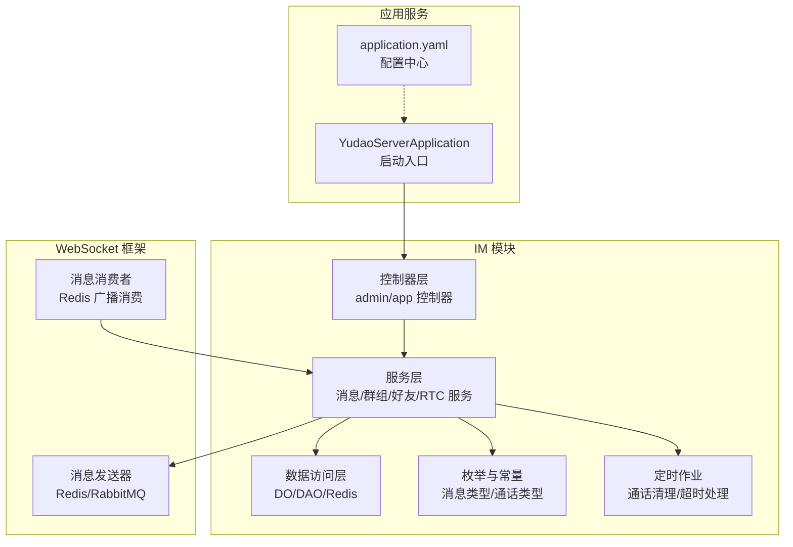
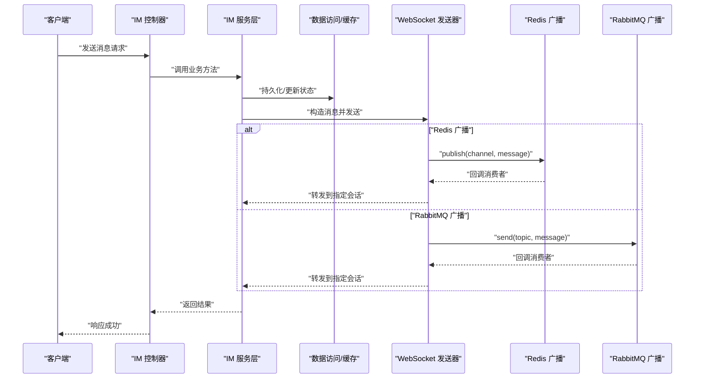
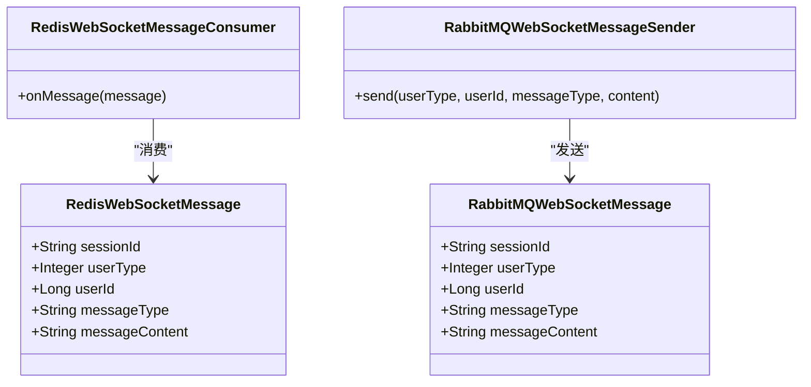
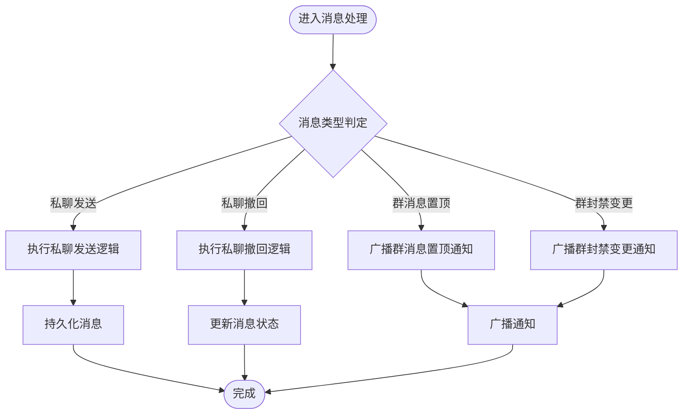
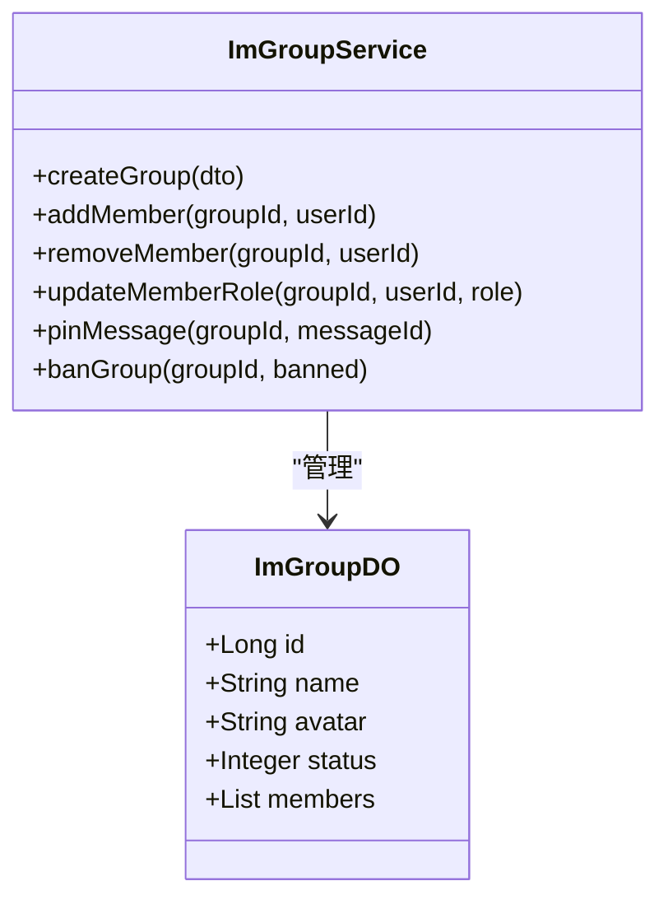
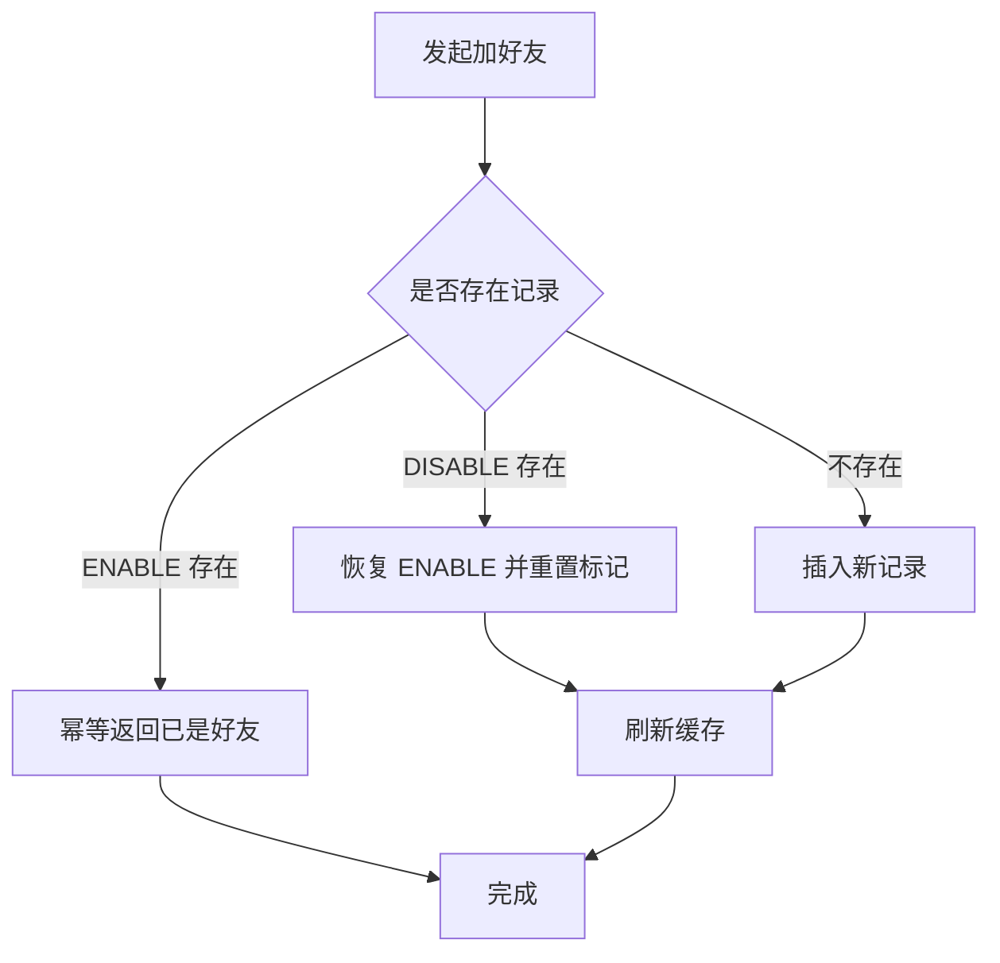
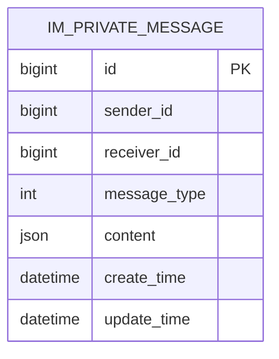
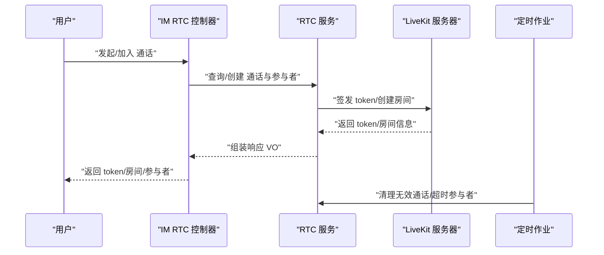
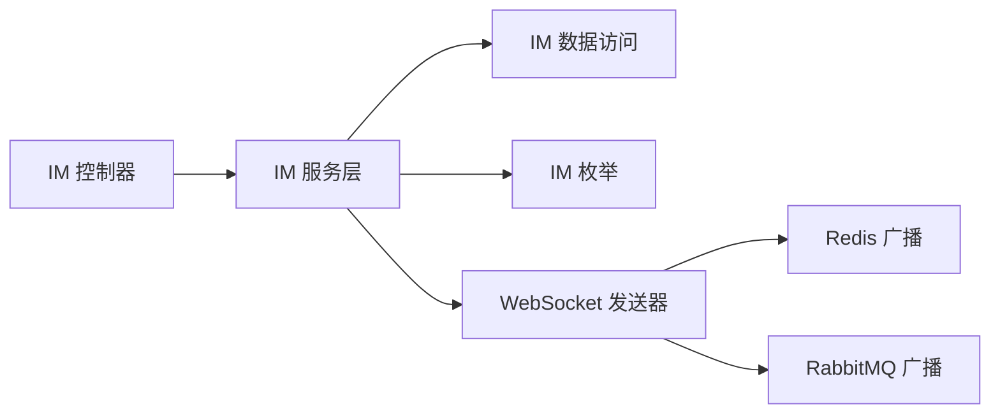

# 即时通讯模块

<cite>
**本文引用的文件**
- [ImPrivateMessageDO.java](file://yudao-module-im/src/main/java/cn/iocoder/yudao/module/im/dal/dataobject/message/ImPrivateMessageDO.java)
- [ImGroupDO.java](file://yudao-module-im/src/main/java/cn/iocoder/yudao/module/im/dal/dataobject/group/ImGroupDO.java)
- [ImFriendDO.java](file://yudao-module-im/src/main/java/cn/iocoder/yudao/module/im/dal/dataobject/friend/ImFriendDO.java)
- [ImPrivateMessageService.java](file://yudao-module-im/src/main/java/cn/iocoder/yudao/module/im/service/message/ImPrivateMessageService.java)
- [ImPrivateMessageServiceImpl.java](file://yudao-module-im/src/main/java/cn/iocoder/yudao/module/im/service/message/ImPrivateMessageServiceImpl.java)
- [ImGroupService.java](file://yudao-module-im/src/main/java/cn/iocoder/yudao/module/im/service/group/ImGroupService.java)
- [ImGroupServiceImpl.java](file://yudao-module-im/src/main/java/cn/iocoder/yudao/module/im/service/group/ImGroupServiceImpl.java)
- [ImFriendService.java](file://yudao-module-im/src/main/java/cn/iocoder/yudao/module/im/service/friend/ImFriendService.java)
- [ImFriendServiceImpl.java](file://yudao-module-im/src/main/java/cn/iocoder/yudao/module/im/service/friend/ImFriendServiceImpl.java)
- [ImRtcCallMediaTypeEnum.java](file://yudao-module-im/src/main/java/cn/iocoder/yudao/module/im/enums/rtc/ImRtcCallMediaTypeEnum.java)
- [ImRtcCallController.java](file://yudao-module-im/src/main/java/cn/iocoder/yudao/module/im/controller/admin/rtc/ImRtcCallController.java)
- [ImRtcCallCleanupJob.java](file://yudao-module-im/src/main/java/cn/iocoder/yudao/module/im/job/rtc/ImRtcCallCleanupJob.java)
- [ImRtcParticipantTimeoutJob.java](file://yudao-module-im/src/main/java/cn/iocoder/yudao/module/im/job/rtc/ImRtcParticipantTimeoutJob.java)
- [ImMessageTypeEnum.java](file://yudao-module-im/src/main/java/cn/iocoder/yudao/module/im/enums/message/ImMessageTypeEnum.java)
- [ImPrivateMessageDTO.java](file://yudao-module-im/src/main/java/cn/iocoder/yudao/module/im/service/websocket/dto/ImPrivateMessageDTO.java)
- [YudaoServerApplication.java](file://yudao-server/src/main/java/cn/iocoder/yudao/server/YudaoServerApplication.java)
- [application.yaml](file://yudao-server/src/main/resources/application.yaml)
- [RabbitMQWebSocketMessage.java](file://yudao-framework/yudao-spring-boot-starter-websocket/src/main/java/cn/iocoder/yudao/framework/websocket/core/sender/rabbitmq/RabbitMQWebSocketMessage.java)
- [RedisWebSocketMessage.java](file://yudao-framework/yudao-spring-boot-starter-websocket/src/main/java/cn/iocoder/yudao/framework/websocket/core/sender/redis/RedisWebSocketMessage.java)
- [RedisWebSocketMessageConsumer.java](file://yudao-framework/yudao-spring-boot-starter-websocket/src/main/java/cn/iocoder/yudao/framework/websocket/core/sender/redis/RedisWebSocketMessageConsumer.java)
- [RabbitMQWebSocketMessageSender.java](file://yudao-framework/yudao-spring-boot-starter-websocket/src/main/java/cn/iocoder/yudao/framework/websocket/core/sender/rabbitmq/RabbitMQWebSocketMessageSender.java)
- [DemoSendMessage.java](file://yudao-module-infra/src/main/java/cn/iocoder/yudao/module/infra/websocket/message/DemoSendMessage.java)
</cite>

## 目录
1. [简介](#简介)
2. [项目结构](#项目结构)
3. [核心组件](#核心组件)
4. [架构总览](#架构总览)
5. [详细组件分析](#详细组件分析)
6. [依赖分析](#依赖分析)
7. [性能考虑](#性能考虑)
8. [故障排查指南](#故障排查指南)
9. [结论](#结论)
10. [附录](#附录)

## 简介
本文件面向即时通讯模块（IM）的全面技术文档，围绕以下主题展开：WebSocket 实时通信架构（连接管理、消息路由、断线重连）、消息系统（私聊、群组、系统通知）、群组管理（创建、成员与权限）、好友系统（添加、验证、黑名单）、消息持久化策略（存储、检索、历史）、RTC 音视频通话（信令与媒体）、以及性能优化、扩展性与安全防护。文档以仓库现有实现为依据，结合架构图与流程图帮助读者快速理解与落地。

## 项目结构
IM 模块位于 yudao-module-im，采用“领域服务 + 数据访问 + 枚举 + 控制器 + 作业任务”的分层组织方式；WebSocket 能力由 yudao-spring-boot-starter-websocket 提供，支持 Redis 与 RabbitMQ 两种消息广播通道；RTC 能力集成 LiveKit，通过作业任务清理无效通话与超时参与者。

图表来源
- [YudaoServerApplication.java:1-200](file://yudao-server/src/main/java/cn/iocoder/yudao/server/YudaoServerApplication.java#L1-L200)
- [application.yaml:1-200](file://yudao-server/src/main/resources/application.yaml#L1-L200)
- [ImPrivateMessageService.java:1-200](file://yudao-module-im/src/main/java/cn/iocoder/yudao/module/im/service/message/ImPrivateMessageService.java#L1-L200)
- [RedisWebSocketMessageConsumer.java:1-23](file://yudao-framework/yudao-spring-boot-starter-websocket/src/main/java/cn/iocoder/yudao/framework/websocket/core/sender/redis/RedisWebSocketMessageConsumer.java#L1-L23)
- [RabbitMQWebSocketMessageSender.java:1-120](file://yudao-framework/yudao-spring-boot-starter-websocket/src/main/java/cn/iocoder/yudao/framework/websocket/core/sender/rabbitmq/RabbitMQWebSocketMessageSender.java#L1-L120)

章节来源
- [YudaoServerApplication.java:1-200](file://yudao-server/src/main/java/cn/iocoder/yudao/server/YudaoServerApplication.java#L1-L200)
- [application.yaml:1-200](file://yudao-server/src/main/resources/application.yaml#L1-L200)

## 核心组件
- WebSocket 实时通信：基于 Redis 与 RabbitMQ 的广播消息通道，支持跨实例消息投递与多端同步。
- 消息系统：私聊消息、群组消息、系统通知，统一通过消息类型枚举与 DTO 抽象。
- 群组管理：创建、成员管理、权限控制、群消息置顶与封禁通知。
- 好友系统：双向关系建立、验证流程、黑名单与静音/置顶标记。
- RTC 音视频：基于 LiveKit 的信令与媒体传输，配合定时作业清理无效状态。
- 持久化策略：消息与关系数据的落库与查询，支持增量拉取与已读标记。

章节来源
- [ImPrivateMessageService.java:1-200](file://yudao-module-im/src/main/java/cn/iocoder/yudao/module/im/service/message/ImPrivateMessageService.java#L1-L200)
- [ImGroupService.java:1-200](file://yudao-module-im/src/main/java/cn/iocoder/yudao/module/im/service/group/ImGroupService.java#L1-L200)
- [ImFriendService.java:1-200](file://yudao-module-im/src/main/java/cn/iocoder/yudao/module/im/service/friend/ImFriendService.java#L1-L200)
- [ImRtcCallMediaTypeEnum.java:1-120](file://yudao-module-im/src/main/java/cn/iocoder/yudao/module/im/enums/rtc/ImRtcCallMediaTypeEnum.java#L1-L120)

## 架构总览
IM 的整体架构围绕“控制器 -> 服务 -> 数据访问/缓存 -> WebSocket 广播 -> 客户端”展开。消息在服务层完成业务处理后，通过 Redis 或 RabbitMQ 广播到各节点，最终由 WebSocket 会话管理器投递给目标用户或房间。

图表来源
- [RabbitMQWebSocketMessageSender.java:1-120](file://yudao-framework/yudao-spring-boot-starter-websocket/src/main/java/cn/iocoder/yudao/framework/websocket/core/sender/rabbitmq/RabbitMQWebSocketMessageSender.java#L1-L120)
- [RedisWebSocketMessageConsumer.java:1-23](file://yudao-framework/yudao-spring-boot-starter-websocket/src/main/java/cn/iocoder/yudao/framework/websocket/core/sender/redis/RedisWebSocketMessageConsumer.java#L1-L23)
- [RabbitMQWebSocketMessage.java:1-120](file://yudao-framework/yudao-spring-boot-starter-websocket/src/main/java/cn/iocoder/yudao/framework/websocket/core/sender/rabbitmq/RabbitMQWebSocketMessage.java#L1-L120)
- [RedisWebSocketMessage.java:1-120](file://yudao-framework/yudao-spring-boot-starter-websocket/src/main/java/cn/iocoder/yudao/framework/websocket/core/sender/redis/RedisWebSocketMessage.java#L1-L120)

## 详细组件分析

### WebSocket 实时通信与消息路由
- 消息载体：Redis 与 RabbitMQ 的消息体包含 sessionId、userType、userId、messageType、messageContent 等字段，用于精准投递。
- 消费与投递：Redis 广播消费者接收消息后，委托 RedisWebSocketMessageSender 将消息投递给指定会话；RabbitMQ 路由由发送器负责。
- 会话管理：WebSocket 会话管理器负责维护用户与会话映射，确保跨实例的一致性。

图表来源
- [RedisWebSocketMessage.java:1-120](file://yudao-framework/yudao-spring-boot-starter-websocket/src/main/java/cn/iocoder/yudao/framework/websocket/core/sender/redis/RedisWebSocketMessage.java#L1-L120)
- [RabbitMQWebSocketMessage.java:1-120](file://yudao-framework/yudao-spring-boot-starter-websocket/src/main/java/cn/iocoder/yudao/framework/websocket/core/sender/rabbitmq/RabbitMQWebSocketMessage.java#L1-L120)
- [RedisWebSocketMessageConsumer.java:1-23](file://yudao-framework/yudao-spring-boot-starter-websocket/src/main/java/cn/iocoder/yudao/framework/websocket/core/sender/redis/RedisWebSocketMessageConsumer.java#L1-L23)
- [RabbitMQWebSocketMessageSender.java:1-120](file://yudao-framework/yudao-spring-boot-starter-websocket/src/main/java/cn/iocoder/yudao/framework/websocket/core/sender/rabbitmq/RabbitMQWebSocketMessageSender.java#L1-L120)

章节来源
- [RedisWebSocketMessageConsumer.java:1-23](file://yudao-framework/yudao-spring-boot-starter-websocket/src/main/java/cn/iocoder/yudao/framework/websocket/core/sender/redis/RedisWebSocketMessageConsumer.java#L1-L23)
- [RabbitMQWebSocketMessageSender.java:1-120](file://yudao-framework/yudao-spring-boot-starter-websocket/src/main/java/cn/iocoder/yudao/framework/websocket/core/sender/rabbitmq/RabbitMQWebSocketMessageSender.java#L1-L120)

### 消息系统：私聊、群组与系统通知
- 私聊消息：提供发送、撤回、增量拉取、已读标记等能力；消息类型通过枚举区分不同语义。
- 群组消息：支持群消息置顶/取消置顶、群封禁变更等扩展通知。
- 系统通知：统一通过消息类型枚举与 DTO 抽象，便于前端识别与渲染。

图表来源
- [ImPrivateMessageService.java:1-200](file://yudao-module-im/src/main/java/cn/iocoder/yudao/module/im/service/message/ImPrivateMessageService.java#L1-L200)
- [ImMessageTypeEnum.java:1-400](file://yudao-module-im/src/main/java/cn/iocoder/yudao/module/im/enums/message/ImMessageTypeEnum.java#L1-L400)
- [ImPrivateMessageDTO.java:1-120](file://yudao-module-im/src/main/java/cn/iocoder/yudao/module/im/service/websocket/dto/ImPrivateMessageDTO.java#L1-L120)

章节来源
- [ImPrivateMessageService.java:1-200](file://yudao-module-im/src/main/java/cn/iocoder/yudao/module/im/service/message/ImPrivateMessageService.java#L1-L200)
- [ImMessageTypeEnum.java:1-400](file://yudao-module-im/src/main/java/cn/iocoder/yudao/module/im/enums/message/ImMessageTypeEnum.java#L1-L400)
- [ImPrivateMessageDTO.java:1-120](file://yudao-module-im/src/main/java/cn/iocoder/yudao/module/im/service/websocket/dto/ImPrivateMessageDTO.java#L1-L120)

### 群组管理：创建、成员与权限
- 创建与成员：群组实体包含基本信息与成员集合；服务层提供成员增删、角色变更、权限控制等操作。
- 权限控制：通过群成员角色与群组状态控制发言、置顶、封禁等行为。
- 通知广播：群消息置顶、封禁变更等事件通过统一消息类型广播至成员。

图表来源
- [ImGroupDO.java:1-200](file://yudao-module-im/src/main/java/cn/iocoder/yudao/module/im/dal/dataobject/group/ImGroupDO.java#L1-L200)
- [ImGroupService.java:1-200](file://yudao-module-im/src/main/java/cn/iocoder/yudao/module/im/service/group/ImGroupService.java#L1-L200)

章节来源
- [ImGroupDO.java:1-200](file://yudao-module-im/src/main/java/cn/iocoder/yudao/module/im/dal/dataobject/group/ImGroupDO.java#L1-L200)
- [ImGroupService.java:1-200](file://yudao-module-im/src/main/java/cn/iocoder/yudao/module/im/service/group/ImGroupService.java#L1-L200)

### 好友系统：添加、验证与黑名单
- 关系建立：提供成为好友、静默重加等内部方法，保证幂等与一致性；支持显示名、来源等信息。
- 黑名单与静音：通过状态与标记字段控制消息提醒与可见性；支持解除拉黑与恢复默认设置。
- 并发安全：使用唯一键约束与异常处理保障极端并发下的数据一致性。

图表来源
- [ImFriendServiceImpl.java:1-400](file://yudao-module-im/src/main/java/cn/iocoder/yudao/module/im/service/friend/ImFriendServiceImpl.java#L1-L400)

章节来源
- [ImFriendServiceImpl.java:1-400](file://yudao-module-im/src/main/java/cn/iocoder/yudao/module/im/service/friend/ImFriendServiceImpl.java#L1-L400)

### 消息持久化策略：存储、检索与历史
- 存储模型：消息实体包含发送者、接收者、类型、内容、时间戳等字段；支持 POJO 内容序列化与反序列化。
- 增量拉取：提供最小 ID 与大小参数的增量拉取接口，避免全量扫描。
- 已读标记：支持将对方发给当前用户且小于等于指定 ID 的消息批量标记为已读，减少竞态。

图表来源
- [ImPrivateMessageDO.java:1-200](file://yudao-module-im/src/main/java/cn/iocoder/yudao/module/im/dal/dataobject/message/ImPrivateMessageDO.java#L1-L200)

章节来源
- [ImPrivateMessageDO.java:1-200](file://yudao-module-im/src/main/java/cn/iocoder/yudao/module/im/dal/dataobject/message/ImPrivateMessageDO.java#L1-L200)
- [ImPrivateMessageService.java:1-200](file://yudao-module-im/src/main/java/cn/iocoder/yudao/module/im/service/message/ImPrivateMessageService.java#L1-L200)

### RTC 音视频通话：信令与媒体
- 媒体类型：支持语音与视频两类通话媒体类型。
- 信令响应：控制器拼装邀请/加入/接受/刷新令牌等响应，包含房间号、LiveKit 地址、token、参与者列表等。
- 清理与超时：通过定时作业清理已结束通话与超时未加入的参与者，降低资源占用。

图表来源
- [ImRtcCallMediaTypeEnum.java:1-120](file://yudao-module-im/src/main/java/cn/iocoder/yudao/module/im/enums/rtc/ImRtcCallMediaTypeEnum.java#L1-L120)
- [ImRtcCallController.java:1-200](file://yudao-module-im/src/main/java/cn/iocoder/yudao/module/im/controller/admin/rtc/ImRtcCallController.java#L1-L200)
- [ImRtcCallCleanupJob.java:1-200](file://yudao-module-im/src/main/java/cn/iocoder/yudao/module/im/job/rtc/ImRtcCallCleanupJob.java#L1-L200)
- [ImRtcParticipantTimeoutJob.java:1-200](file://yudao-module-im/src/main/java/cn/iocoder/yudao/module/im/job/rtc/ImRtcParticipantTimeoutJob.java#L1-L200)

章节来源
- [ImRtcCallController.java:1-200](file://yudao-module-im/src/main/java/cn/iocoder/yudao/module/im/controller/admin/rtc/ImRtcCallController.java#L1-L200)
- [ImRtcCallCleanupJob.java:1-200](file://yudao-module-im/src/main/java/cn/iocoder/yudao/module/im/job/rtc/ImRtcCallCleanupJob.java#L1-L200)
- [ImRtcParticipantTimeoutJob.java:1-200](file://yudao-module-im/src/main/java/cn/iocoder/yudao/module/im/job/rtc/ImRtcParticipantTimeoutJob.java#L1-L200)

## 依赖分析
- 模块间耦合：IM 服务层依赖数据访问与枚举，控制器依赖服务层；WebSocket 框架作为基础设施被服务层复用。
- 外部依赖：Redis 与 RabbitMQ 用于广播；LiveKit 用于 RTC；Spring Boot 应用通过 application.yaml 配置启用相关功能。
- 循环依赖：未见明显循环依赖；服务层与控制器职责清晰分离。

图表来源
- [ImPrivateMessageService.java:1-200](file://yudao-module-im/src/main/java/cn/iocoder/yudao/module/im/service/message/ImPrivateMessageService.java#L1-L200)
- [RedisWebSocketMessageConsumer.java:1-23](file://yudao-framework/yudao-spring-boot-starter-websocket/src/main/java/cn/iocoder/yudao/framework/websocket/core/sender/redis/RedisWebSocketMessageConsumer.java#L1-L23)
- [RabbitMQWebSocketMessageSender.java:1-120](file://yudao-framework/yudao-spring-boot-starter-websocket/src/main/java/cn/iocoder/yudao/framework/websocket/core/sender/rabbitmq/RabbitMQWebSocketMessageSender.java#L1-L120)

章节来源
- [application.yaml:1-200](file://yudao-server/src/main/resources/application.yaml#L1-L200)

## 性能考虑
- 广播选择：Redis 适合轻量广播与跨实例同步；RabbitMQ 适合强一致与复杂路由场景。根据业务吞吐与一致性需求选择。
- 增量拉取：私聊消息提供增量拉取接口，避免全量扫描，建议前端按需分页与缓存。
- 已读标记：服务端一次性翻转已读，避免“先查后改”的竞态，提升一致性与性能。
- RTC 清理：通过定时作业清理无效通话与超时参与者，防止资源泄漏与内存膨胀。
- 连接管理：WebSocket 会话管理器负责用户与会话映射，建议结合心跳与断线重连策略提升稳定性。

## 故障排查指南
- 消息未达：检查 Redis/RabbitMQ 广播通道是否正常；确认消息体字段完整与消费者监听正确。
- 私聊已读异常：确认已读开关配置与调用参数；核对“已读位置”是否为前端会话内的最大消息 ID。
- 群组通知不生效：核对消息类型枚举与 DTO 结构；检查广播通道与前端订阅。
- 好友关系异常：关注唯一键冲突与幂等逻辑；确认状态与标记字段未被意外重置。
- RTC 无法加入：核对 LiveKit 地址与 token 签发；检查房间状态与参与者列表；查看定时作业清理日志。

章节来源
- [RedisWebSocketMessageConsumer.java:1-23](file://yudao-framework/yudao-spring-boot-starter-websocket/src/main/java/cn/iocoder/yudao/framework/websocket/core/sender/redis/RedisWebSocketMessageConsumer.java#L1-L23)
- [ImPrivateMessageService.java:1-200](file://yudao-module-im/src/main/java/cn/iocoder/yudao/module/im/service/message/ImPrivateMessageService.java#L1-L200)
- [ImRtcCallController.java:1-200](file://yudao-module-im/src/main/java/cn/iocoder/yudao/module/im/controller/admin/rtc/ImRtcCallController.java#L1-L200)

## 结论
本模块以清晰的分层与可扩展的架构实现了完整的 IM 能力：实时通信、消息系统、群组与好友管理、消息持久化、以及 RTC 通话。通过 Redis/RabbitMQ 广播与定时作业，兼顾了性能与可靠性。建议在生产环境中结合业务流量与一致性需求选择广播通道，并完善心跳与断线重连策略，持续监控 RTC 清理作业与消息投递链路。

## 附录
- 示例消息体参考：客户端向服务端发送消息的数据结构示例。
  
章节来源
- [DemoSendMessage.java:1-120](file://yudao-module-infra/src/main/java/cn/iocoder/yudao/module/infra/websocket/message/DemoSendMessage.java#L1-L120)