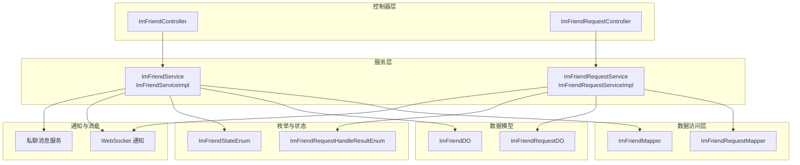
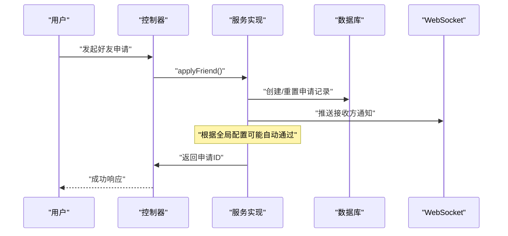
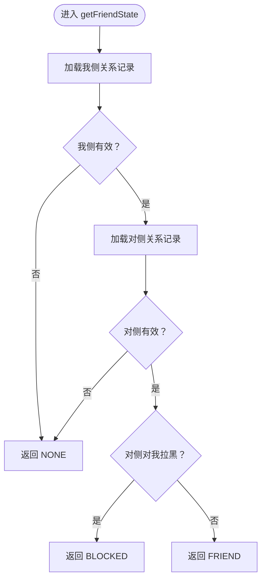
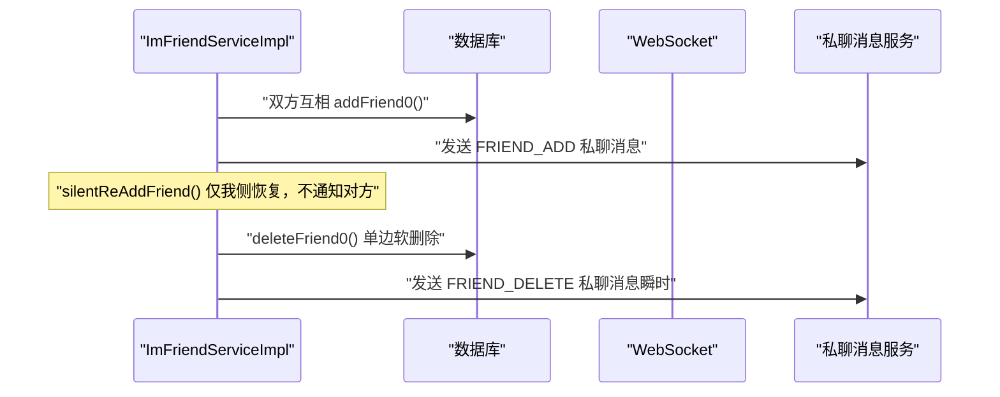
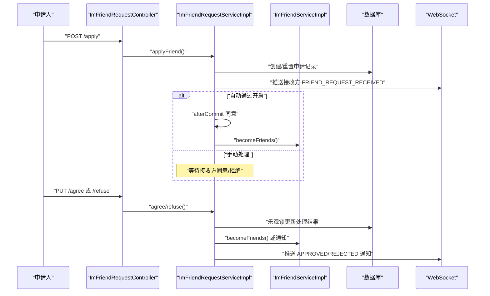
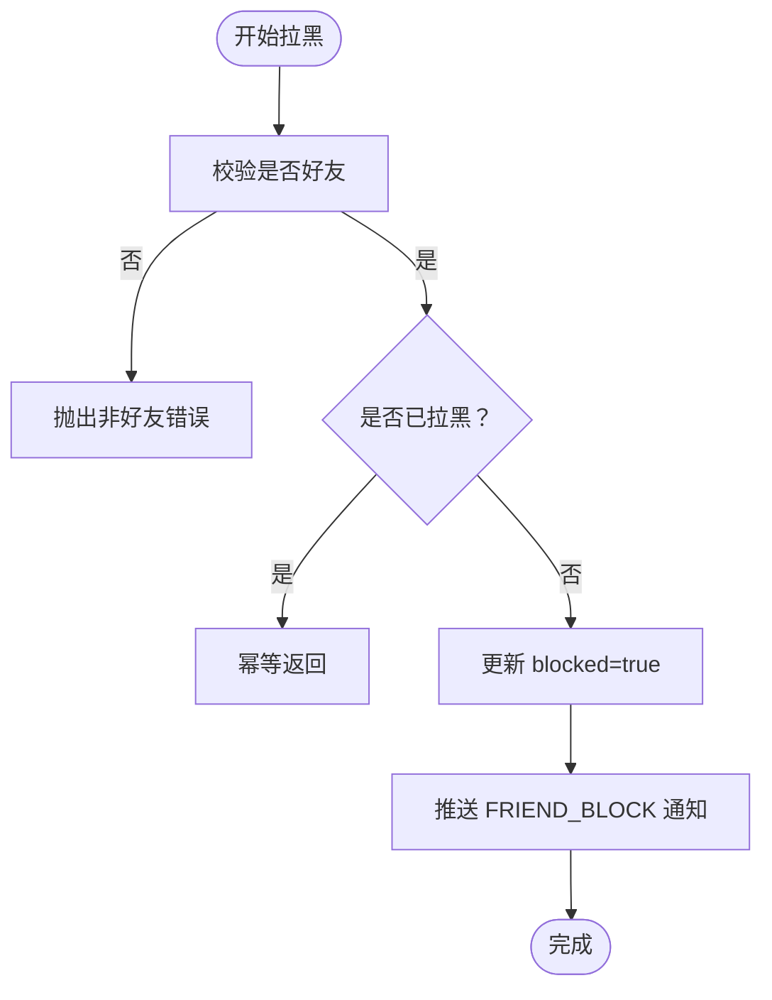
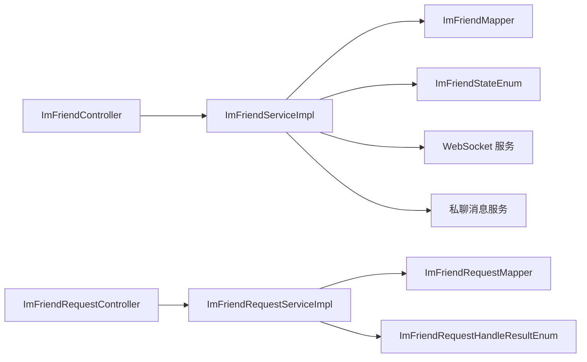
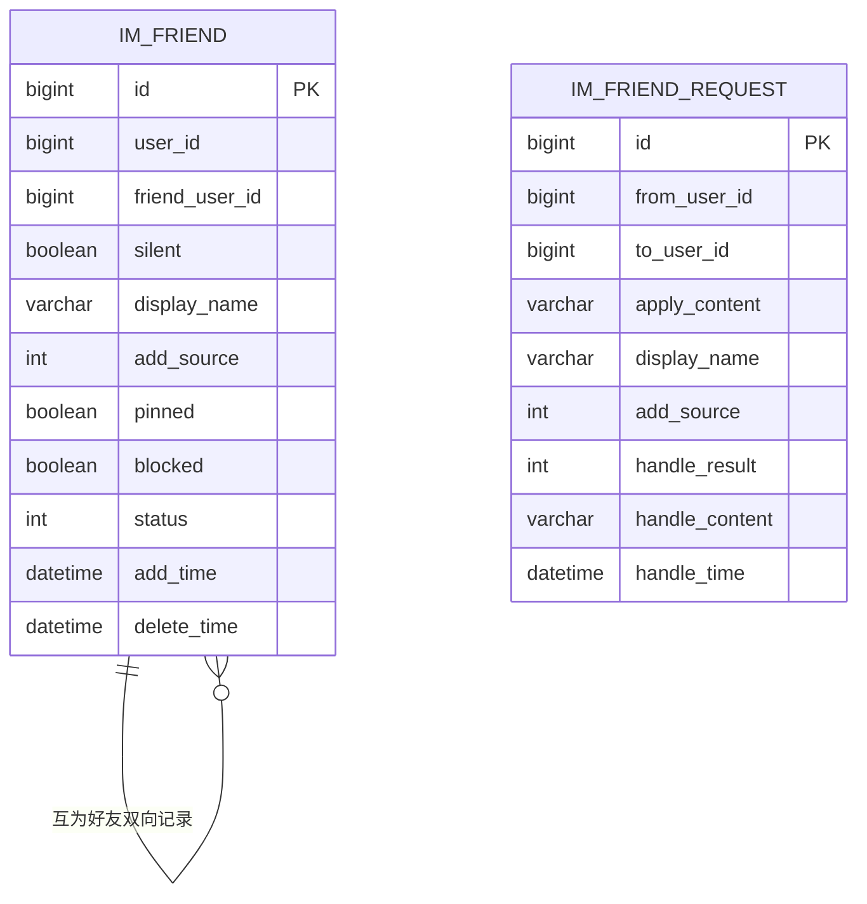

# 好友关系系统

<cite>
**本文引用的文件**
- [ImFriendService.java](file://yudao-module-im/src/main/java/cn/iocoder/yudao/module/im/service/friend/ImFriendService.java)
- [ImFriendServiceImpl.java](file://yudao-module-im/src/main/java/cn/iocoder/yudao/module/im/service/friend/ImFriendServiceImpl.java)
- [ImFriendRequestService.java](file://yudao-module-im/src/main/java/cn/iocoder/yudao/module/im/service/friend/ImFriendRequestService.java)
- [ImFriendRequestServiceImpl.java](file://yudao-module-im/src/main/java/cn/iocoder/yudao/module/im/service/friend/ImFriendRequestServiceImpl.java)
- [ImFriendDO.java](file://yudao-module-im/src/main/java/cn/iocoder/yudao/module/im/dal/dataobject/friend/ImFriendDO.java)
- [ImFriendRequestDO.java](file://yudao-module-im/src/main/java/cn/iocoder/yudao/module/im/dal/dataobject/friend/ImFriendRequestDO.java)
- [ImFriendStateEnum.java](file://yudao-module-im/src/main/java/cn/iocoder/yudao/module/im/enums/friend/ImFriendStateEnum.java)
- [ImFriendRequestHandleResultEnum.java](file://yudao-module-im/src/main/java/cn/iocoder/yudao/module/im/enums/friend/ImFriendRequestHandleResultEnum.java)
- [ImFriendController.java](file://yudao-module-im/src/main/java/cn/iocoder/yudao/module/im/controller/admin/friend/ImFriendController.java)
- [ImFriendRequestController.java](file://yudao-module-im/src/main/java/cn/iocoder/yudao/module/im/controller/admin/friend/ImFriendRequestController.java)
</cite>

## 目录
1. [简介](#简介)
2. [项目结构](#项目结构)
3. [核心组件](#核心组件)
4. [架构总览](#架构总览)
5. [详细组件分析](#详细组件分析)
6. [依赖分析](#依赖分析)
7. [性能考量](#性能考量)
8. [故障排查指南](#故障排查指南)
9. [结论](#结论)
10. [附录](#附录)

## 简介
本文件面向“好友关系系统”的全面技术文档，围绕以下目标展开：  
- 好友添加流程：搜索用户、发送申请、接收通知与处理请求的完整机制  
- 好友状态管理：关系建立、状态变更与关系解除  
- 好友请求处理：申请列表、审批流程与通知机制  
- 好友分组与标签：好友分类管理与快速查找  
- 黑名单管理：拉黑设置、屏蔽范围与解封流程  
- 好友统计信息：好友数量、活跃度与互动记录  
- 隐私设置：好友可见性与动态分享权限  
- 好友安全机制：骚扰防护与举报处理  

系统采用“申请-审批”模式，确保双方关系建立的可控性与一致性；通过 WebSocket 实时推送与数据库持久化相结合，保障用户体验与数据一致性。

## 项目结构
IM 模块中，好友关系系统主要由以下层次构成：
- 控制器层：对外暴露 REST 接口，负责参数校验与响应封装  
- 服务层：实现业务逻辑，包括好友关系维护、申请处理、状态计算与通知推送  
- 数据访问层：基于 MyBatis Plus 的 Mapper，提供数据持久化能力  
- 数据模型：定义好友关系与申请记录的数据结构  
- 枚举与状态：定义好友状态、申请处理结果等常量与判断逻辑  
- 通知模型：通过 WebSocket 推送各类好友相关通知

图表来源
- [ImFriendController.java:34-127](file://yudao-module-im/src/main/java/cn/iocoder/yudao/module/im/controller/admin/friend/ImFriendController.java#L34-L127)
- [ImFriendRequestController.java:37-125](file://yudao-module-im/src/main/java/cn/iocoder/yudao/module/im/controller/admin/friend/ImFriendRequestController.java#L37-L125)
- [ImFriendService.java:13-124](file://yudao-module-im/src/main/java/cn/iocoder/yudao/module/im/service/friend/ImFriendService.java#L13-L124)
- [ImFriendServiceImpl.java:44-333](file://yudao-module-im/src/main/java/cn/iocoder/yudao/module/im/service/friend/ImFriendServiceImpl.java#L44-L333)
- [ImFriendRequestService.java:10-65](file://yudao-module-im/src/main/java/cn/iocoder/yudao/module/im/service/friend/ImFriendRequestService.java#L10-L65)
- [ImFriendRequestServiceImpl.java:42-267](file://yudao-module-im/src/main/java/cn/iocoder/yudao/module/im/service/friend/ImFriendRequestServiceImpl.java#L42-L267)
- [ImFriendDO.java:12-90](file://yudao-module-im/src/main/java/cn/iocoder/yudao/module/im/dal/dataobject/friend/ImFriendDO.java#L12-L90)
- [ImFriendRequestDO.java:13-85](file://yudao-module-im/src/main/java/cn/iocoder/yudao/module/im/dal/dataobject/friend/ImFriendRequestDO.java#L13-L85)
- [ImFriendStateEnum.java:10-55](file://yudao-module-im/src/main/java/cn/iocoder/yudao/module/im/enums/friend/ImFriendStateEnum.java#L10-L55)
- [ImFriendRequestHandleResultEnum.java:10-46](file://yudao-module-im/src/main/java/cn/iocoder/yudao/module/im/enums/friend/ImFriendRequestHandleResultEnum.java#L10-L46)

章节来源
- [ImFriendController.java:34-127](file://yudao-module-im/src/main/java/cn/iocoder/yudao/module/im/controller/admin/friend/ImFriendController.java#L34-L127)
- [ImFriendRequestController.java:37-125](file://yudao-module-im/src/main/java/cn/iocoder/yudao/module/im/controller/admin/friend/ImFriendRequestController.java#L37-L125)

## 核心组件
- 好友关系服务接口与实现：负责状态查询、关系建立/解除、属性更新、黑名单管理与后台分页查询  
- 好友申请服务接口与实现：负责申请发起、同意/拒绝、申请列表查询与自动通过策略  
- 数据模型：ImFriendDO 描述单边好友关系记录；ImFriendRequestDO 描述申请记录  
- 状态与枚举：ImFriendStateEnum 合并“是否好友/是否拉黑”；申请处理结果枚举定义三种状态  
- 控制器：提供 REST 接口，封装响应与参数校验

章节来源
- [ImFriendService.java:13-124](file://yudao-module-im/src/main/java/cn/iocoder/yudao/module/im/service/friend/ImFriendService.java#L13-L124)
- [ImFriendServiceImpl.java:44-333](file://yudao-module-im/src/main/java/cn/iocoder/yudao/module/im/service/friend/ImFriendServiceImpl.java#L44-L333)
- [ImFriendRequestService.java:10-65](file://yudao-module-im/src/main/java/cn/iocoder/yudao/module/im/service/friend/ImFriendRequestService.java#L10-L65)
- [ImFriendRequestServiceImpl.java:42-267](file://yudao-module-im/src/main/java/cn/iocoder/yudao/module/im/service/friend/ImFriendRequestServiceImpl.java#L42-L267)
- [ImFriendDO.java:12-90](file://yudao-module-im/src/main/java/cn/iocoder/yudao/module/im/dal/dataobject/friend/ImFriendDO.java#L12-L90)
- [ImFriendRequestDO.java:13-85](file://yudao-module-im/src/main/java/cn/iocoder/yudao/module/im/dal/dataobject/friend/ImFriendRequestDO.java#L13-L85)
- [ImFriendStateEnum.java:10-55](file://yudao-module-im/src/main/java/cn/iocoder/yudao/module/im/enums/friend/ImFriendStateEnum.java#L10-L55)
- [ImFriendRequestHandleResultEnum.java:10-46](file://yudao-module-im/src/main/java/cn/iocoder/yudao/module/im/enums/friend/ImFriendRequestHandleResultEnum.java#L10-L46)

## 架构总览
系统采用“控制器-服务-数据访问-模型-通知”的分层架构，结合 Redis 缓存与数据库双写策略，保证高频状态查询的性能与一致性。

图表来源
- [ImFriendRequestController.java:54-59](file://yudao-module-im/src/main/java/cn/iocoder/yudao/module/im/controller/admin/friend/ImFriendRequestController.java#L54-L59)
- [ImFriendRequestServiceImpl.java:67-130](file://yudao-module-im/src/main/java/cn/iocoder/yudao/module/im/service/friend/ImFriendRequestServiceImpl.java#L67-L130)

## 详细组件分析

### 好友关系状态管理
- 状态定义：通过合并“是否好友”和“是否被拉黑”，形成 NONE/FRIEND/BLOCKED 三种状态，用于私聊发送等热点路径的快速判定  
- 状态查询：以用户视角计算双向关系，若任一侧关系无效或被拉黑，则状态降级  
- 缓存策略：使用 FRIEND_STATE 缓存键，避免重复查询；在关系变更时统一失效

图表来源
- [ImFriendServiceImpl.java:63-78](file://yudao-module-im/src/main/java/cn/iocoder/yudao/module/im/service/friend/ImFriendServiceImpl.java#L63-L78)
- [ImFriendStateEnum.java:21-55](file://yudao-module-im/src/main/java/cn/iocoder/yudao/module/im/enums/friend/ImFriendStateEnum.java#L21-L55)

章节来源
- [ImFriendServiceImpl.java:63-90](file://yudao-module-im/src/main/java/cn/iocoder/yudao/module/im/service/friend/ImFriendServiceImpl.java#L63-L90)
- [ImFriendStateEnum.java:10-55](file://yudao-module-im/src/main/java/cn/iocoder/yudao/module/im/enums/friend/ImFriendStateEnum.java#L10-L55)

### 好友关系建立与解除
- 建立关系：双方互相写入单边记录，A 侧携带申请备注与来源，B 侧备注为空；同时生成“成为好友”会话气泡  
- 静默重建：在“我已删除 + 对方仍把我当好友”的场景下，仅我侧恢复关系，不通知对方，保持“对方一直把我当好友”的错觉  
- 解除关系：单向软删除，仅将我侧状态置为 DISABLE；对端不受影响；支持级联清理本端相关数据（如私聊会话）

图表来源
- [ImFriendServiceImpl.java:162-224](file://yudao-module-im/src/main/java/cn/iocoder/yudao/module/im/service/friend/ImFriendServiceImpl.java#L162-L224)
- [ImFriendServiceImpl.java:289-324](file://yudao-module-im/src/main/java/cn/iocoder/yudao/module/im/service/friend/ImFriendServiceImpl.java#L289-L324)

章节来源
- [ImFriendServiceImpl.java:162-224](file://yudao-module-im/src/main/java/cn/iocoder/yudao/module/im/service/friend/ImFriendServiceImpl.java#L162-L224)
- [ImFriendServiceImpl.java:289-324](file://yudao-module-im/src/main/java/cn/iocoder/yudao/module/im/service/friend/ImFriendServiceImpl.java#L289-L324)

### 好友申请处理与通知
- 申请发起：校验双方用户有效性、状态冲突（已是好友/被拉黑）、单向好友场景下的静默重建；创建或重置申请记录；推送接收方“收到申请”通知  
- 自动通过：可配置全局自动通过策略，在事务提交后异步执行同意流程  
- 同意/拒绝：使用乐观锁更新处理结果；同意后双向建立关系并推送“已同意”通知；拒绝则推送“已拒绝”通知  
- 申请列表：支持游标分页，按更新时间与 ID 倒序返回

图表来源
- [ImFriendRequestController.java:54-78](file://yudao-module-im/src/main/java/cn/iocoder/yudao/module/im/controller/admin/friend/ImFriendRequestController.java#L54-L78)
- [ImFriendRequestServiceImpl.java:67-130](file://yudao-module-im/src/main/java/cn/iocoder/yudao/module/im/service/friend/ImFriendRequestServiceImpl.java#L67-L130)
- [ImFriendRequestServiceImpl.java:170-222](file://yudao-module-im/src/main/java/cn/iocoder/yudao/module/im/service/friend/ImFriendRequestServiceImpl.java#L170-L222)

章节来源
- [ImFriendRequestController.java:54-103](file://yudao-module-im/src/main/java/cn/iocoder/yudao/module/im/controller/admin/friend/ImFriendRequestController.java#L54-L103)
- [ImFriendRequestServiceImpl.java:67-130](file://yudao-module-im/src/main/java/cn/iocoder/yudao/module/im/service/friend/ImFriendRequestServiceImpl.java#L67-L130)
- [ImFriendRequestServiceImpl.java:170-222](file://yudao-module-im/src/main/java/cn/iocoder/yudao/module/im/service/friend/ImFriendRequestServiceImpl.java#L170-L222)

### 黑名单管理
- 拉黑：必须先为好友，单边更新 blocked 标志；推送“拉黑”通知  
- 解封：必须先处于拉黑状态，单边更新 blocked 为 false；推送“取消拉黑”通知  
- 屏蔽范围：拉黑状态下，接收方无法向我发送私聊消息；不影响其他功能

图表来源
- [ImFriendServiceImpl.java:231-250](file://yudao-module-im/src/main/java/cn/iocoder/yudao/module/im/service/friend/ImFriendServiceImpl.java#L231-L250)

章节来源
- [ImFriendServiceImpl.java:231-276](file://yudao-module-im/src/main/java/cn/iocoder/yudao/module/im/service/friend/ImFriendServiceImpl.java#L231-L276)

### 好友分组与标签（快速查找）
- 备注与拼音：服务端在组装响应时，计算备注与昵称的拼音，便于前端进行字母分桶与拼音检索  
- 分组建议：可在前端按拼音首字母分组，或结合“置顶/免打扰”等单边属性进行排序与筛选

章节来源
- [ImFriendController.java:102-125](file://yudao-module-im/src/main/java/cn/iocoder/yudao/module/im/controller/admin/friend/ImFriendController.java#L102-L125)

### 隐私设置与安全机制
- 隐私校验：在私聊发送与 RTC 邀请等场景，统一校验好友与黑名单状态，非好友或被拉黑将被拒绝  
- 安全策略：申请发起时禁止“加自己”；对“单向好友”场景提供静默重建，避免对方感知我曾删除  
- 举报处理：当前代码未体现举报流程，建议在申请/消息/行为层面增加举报入口与风控策略（扩展建议）

章节来源
- [ImFriendServiceImpl.java:80-90](file://yudao-module-im/src/main/java/cn/iocoder/yudao/module/im/service/friend/ImFriendServiceImpl.java#L80-L90)
- [ImFriendRequestServiceImpl.java:70-95](file://yudao-module-im/src/main/java/cn/iocoder/yudao/module/im/service/friend/ImFriendRequestServiceImpl.java#L70-L95)

## 依赖分析
- 控制器依赖服务：控制器仅负责参数与响应封装，业务逻辑集中在服务层  
- 服务层依赖数据访问：服务层通过 Mapper 与数据库交互，必要时跨服务调用（如用户校验、消息推送）  
- 通知与消息：通过 WebSocket 与私聊消息服务实现实时通知与会话气泡  
- 缓存与事务：状态缓存与事务同步，确保一致性与性能

图表来源
- [ImFriendController.java:34-127](file://yudao-module-im/src/main/java/cn/iocoder/yudao/module/im/controller/admin/friend/ImFriendController.java#L34-L127)
- [ImFriendRequestController.java:37-125](file://yudao-module-im/src/main/java/cn/iocoder/yudao/module/im/controller/admin/friend/ImFriendRequestController.java#L37-L125)
- [ImFriendServiceImpl.java:44-333](file://yudao-module-im/src/main/java/cn/iocoder/yudao/module/im/service/friend/ImFriendServiceImpl.java#L44-L333)
- [ImFriendRequestServiceImpl.java:42-267](file://yudao-module-im/src/main/java/cn/iocoder/yudao/module/im/service/friend/ImFriendRequestServiceImpl.java#L42-L267)

章节来源
- [ImFriendController.java:34-127](file://yudao-module-im/src/main/java/cn/iocoder/yudao/module/im/controller/admin/friend/ImFriendController.java#L34-L127)
- [ImFriendRequestController.java:37-125](file://yudao-module-im/src/main/java/cn/iocoder/yudao/module/im/controller/admin/friend/ImFriendRequestController.java#L37-L125)
- [ImFriendServiceImpl.java:44-333](file://yudao-module-im/src/main/java/cn/iocoder/yudao/module/im/service/friend/ImFriendServiceImpl.java#L44-L333)
- [ImFriendRequestServiceImpl.java:42-267](file://yudao-module-im/src/main/java/cn/iocoder/yudao/module/im/service/friend/ImFriendRequestServiceImpl.java#L42-L267)

## 性能考量
- 状态缓存：FRIEND_STATE 缓存显著降低高频状态查询成本，配合事务后置失效保证一致性  
- 批量用户信息：在构建好友列表时批量拉取用户昵称/头像，减少 N+1 查询  
- 乐观锁：申请处理使用乐观锁，避免并发冲突导致的数据不一致  
- 事务同步：自动通过场景通过 afterCommit 注册回调，确保通知与业务解耦

章节来源
- [ImFriendServiceImpl.java:63-78](file://yudao-module-im/src/main/java/cn/iocoder/yudao/module/im/service/friend/ImFriendServiceImpl.java#L63-L78)
- [ImFriendController.java:102-118](file://yudao-module-im/src/main/java/cn/iocoder/yudao/module/im/controller/admin/friend/ImFriendController.java#L102-L118)
- [ImFriendRequestServiceImpl.java:111-128](file://yudao-module-im/src/main/java/cn/iocoder/yudao/module/im/service/friend/ImFriendRequestServiceImpl.java#L111-L128)

## 故障排查指南
- “已是好友/被拉黑”错误：申请时若状态为好友或被拉黑，将直接拒绝；检查双方关系与黑名单状态  
- “申请已被处理”：同意/拒绝时若申请已被他人处理，乐观锁更新失败；需刷新列表后重试  
- “非好友”错误：私聊发送或邀请时若状态为 NONE，需先发起申请并通过  
- “未登录或越权”：申请详情查询时若非申请人或接收人，返回空；确认当前登录用户身份  
- “自动通过异常”：自动通过回调内异常会被静默吞掉；查看日志定位具体原因

章节来源
- [ImFriendRequestServiceImpl.java:78-95](file://yudao-module-im/src/main/java/cn/iocoder/yudao/module/im/service/friend/ImFriendRequestServiceImpl.java#L78-L95)
- [ImFriendRequestServiceImpl.java:173-186](file://yudao-module-im/src/main/java/cn/iocoder/yudao/module/im/service/friend/ImFriendRequestServiceImpl.java#L173-L186)
- [ImFriendRequestServiceImpl.java:202-213](file://yudao-module-im/src/main/java/cn/iocoder/yudao/module/im/service/friend/ImFriendRequestServiceImpl.java#L202-L213)
- [ImFriendServiceImpl.java:80-90](file://yudao-module-im/src/main/java/cn/iocoder/yudao/module/im/service/friend/ImFriendServiceImpl.java#L80-L90)
- [ImFriendRequestController.java:94-103](file://yudao-module-im/src/main/java/cn/iocoder/yudao/module/im/controller/admin/friend/ImFriendRequestController.java#L94-L103)

## 结论
本系统以“申请-审批”为核心，结合状态缓存、乐观锁与 WebSocket 通知，实现了高性能、可扩展的好友关系管理能力。通过清晰的单边属性（备注、置顶、免打扰）与黑名单机制，满足多样化的隐私与安全需求。建议后续补充举报与风控流程，进一步完善安全体系。

## 附录
- 数据模型概览

图表来源
- [ImFriendDO.java:12-90](file://yudao-module-im/src/main/java/cn/iocoder/yudao/module/im/dal/dataobject/friend/ImFriendDO.java#L12-L90)
- [ImFriendRequestDO.java:13-85](file://yudao-module-im/src/main/java/cn/iocoder/yudao/module/im/dal/dataobject/friend/ImFriendRequestDO.java#L13-L85)