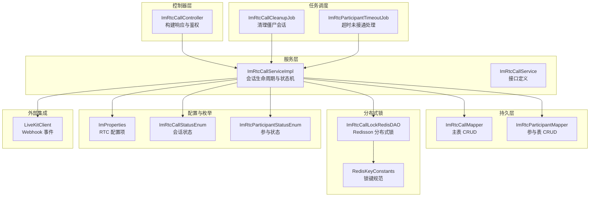
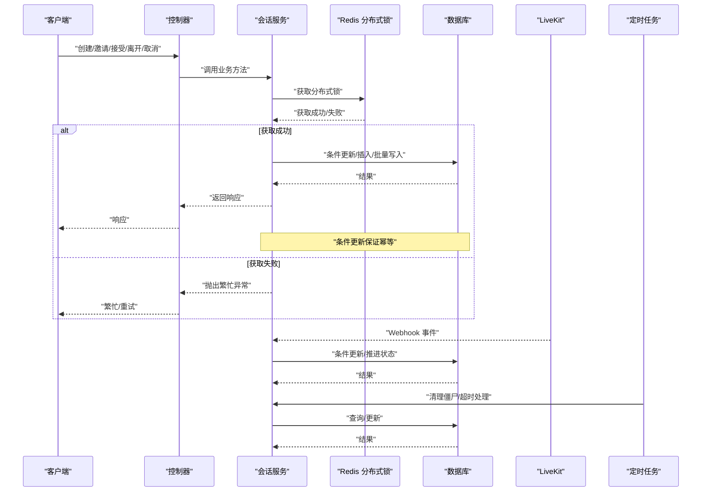
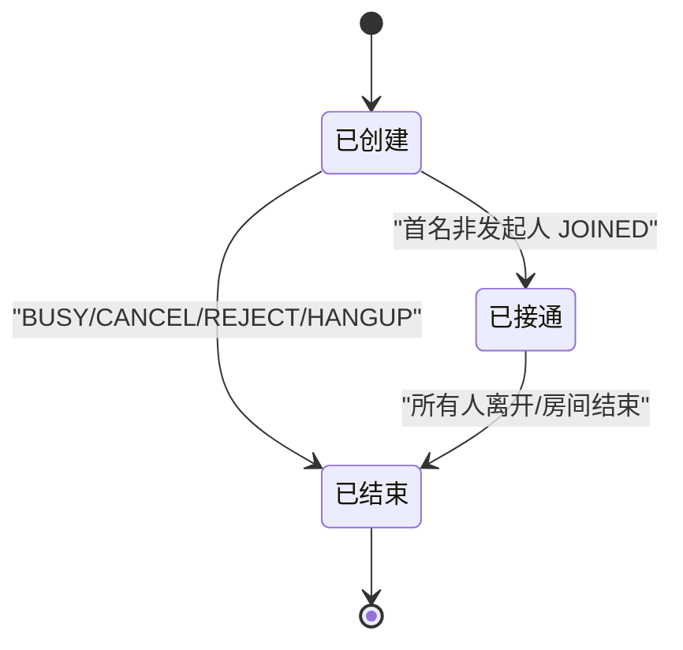
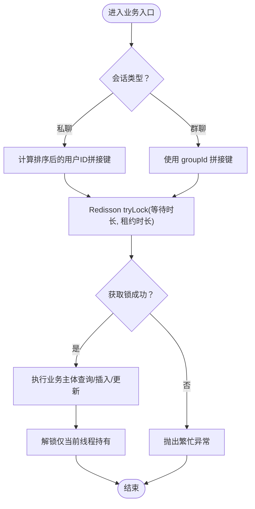
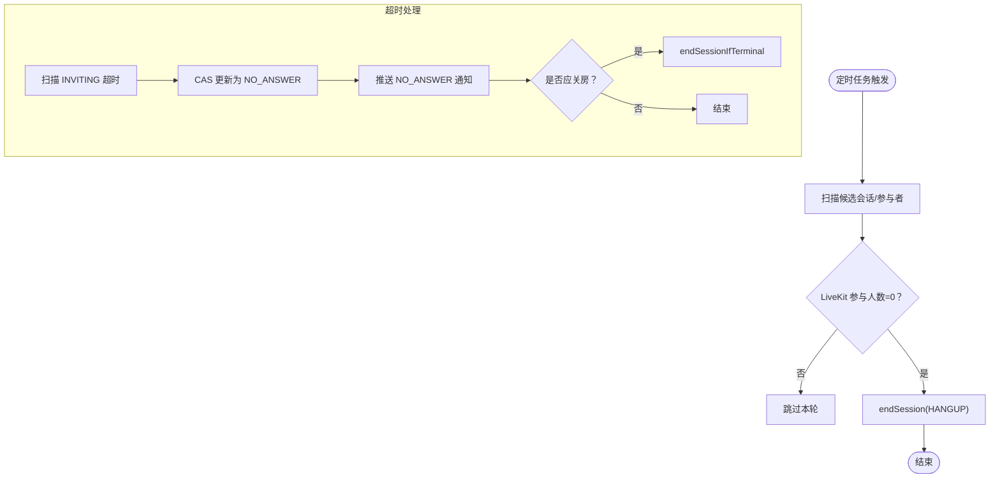
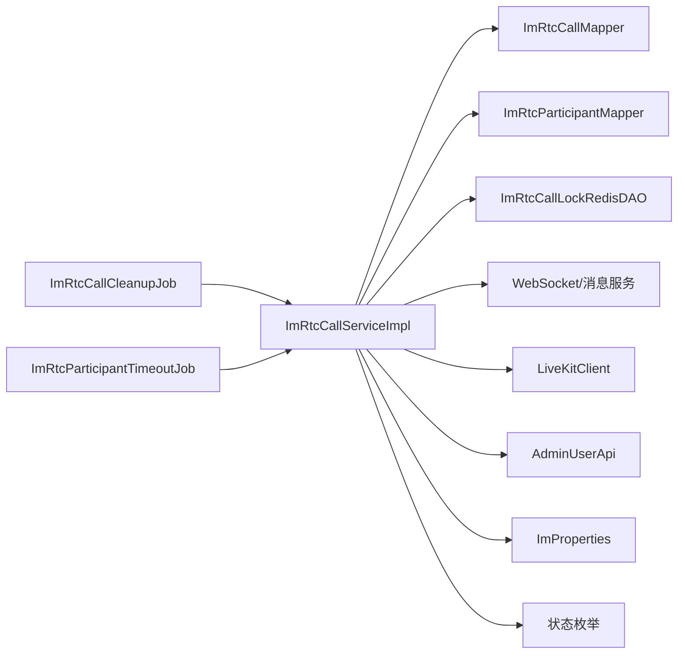

# 会话管理

<cite>
**本文引用的文件**
- [ImRtcCallServiceImpl.java](file://yudao-module-im/src/main/java/cn/iocoder/yudao/module/im/service/rtc/ImRtcCallServiceImpl.java)
- [ImRtcCallService.java](file://yudao-module-im/src/main/java/cn/iocoder/yudao/module/im/service/rtc/ImRtcCallService.java)
- [ImRtcCallLockRedisDAO.java](file://yudao-module-im/src/main/java/cn/iocoder/yudao/module/im/dal/redis/rtc/ImRtcCallLockRedisDAO.java)
- [RedisKeyConstants.java](file://yudao-module-im/src/main/java/cn/iocoder/yudao/module/im/dal/redis/RedisKeyConstants.java)
- [ImRtcCallController.java](file://yudao-module-im/src/main/java/cn/iocoder/yudao/module/im/controller/admin/rtc/ImRtcCallController.java)
- [ImRtcCallDO.java](file://yudao-module-im/src/main/java/cn/iocoder/yudao/module/im/dal/dataobject/rtc/ImRtcCallDO.java)
- [ImRtcParticipantDO.java](file://yudao-module-im/src/main/java/cn/iocoder/yudao/module/im/dal/dataobject/rtc/ImRtcParticipantDO.java)
- [ImRtcCallStatusEnum.java](file://yudao-module-im/src/main/java/cn/iocoder/yudao/module/im/enums/rtc/ImRtcCallStatusEnum.java)
- [ImRtcParticipantStatusEnum.java](file://yudao-module-im/src/main/java/cn/iocoder/yudao/module/im/enums/rtc/ImRtcParticipantStatusEnum.java)
- [ImRtcCallCleanupJob.java](file://yudao-module-im/src/main/java/cn/iocoder/yudao/module/im/job/rtc/ImRtcCallCleanupJob.java)
- [ImRtcParticipantTimeoutJob.java](file://yudao-module-im/src/main/java/cn/iocoder/yudao/module/im/job/rtc/ImRtcParticipantTimeoutJob.java)
- [ImProperties.java](file://yudao-module-im/src/main/java/cn/iocoder/yudao/module/im/framework/config/ImProperties.java)
</cite>

## 目录
1. [引言](#引言)
2. [项目结构](#项目结构)
3. [核心组件](#核心组件)
4. [架构总览](#架构总览)
5. [详细组件分析](#详细组件分析)
6. [依赖分析](#依赖分析)
7. [性能考虑](#性能考虑)
8. [故障排查指南](#故障排查指南)
9. [结论](#结论)
10. [附录](#附录)

## 引言
本技术文档围绕实时音视频会话管理展开，系统性阐述会话生命周期（创建、维护、销毁）、分布式锁与并发控制、会话清理与超时处理、数据持久化与查询优化、监控与统计、安全控制以及配置参数与调优建议。目标是帮助开发者与运维人员快速理解并高效落地会话管理能力。

## 项目结构
IM 模块中的实时通话（RTC）相关代码集中在 service/rtc、dal/redis/rtc、job/rtc、controller/admin/rtc、enums/rtc、framework/config 等包中，采用“服务层 + 持久层 + Redis 分布式锁 + 任务调度 + 控制器”的分层组织方式，确保高并发下的强一致性与可观测性。

图表来源
- [ImRtcCallServiceImpl.java:1-120](file://yudao-module-im/src/main/java/cn/iocoder/yudao/module/im/service/rtc/ImRtcCallServiceImpl.java#L1-L120)
- [ImRtcCallService.java:1-131](file://yudao-module-im/src/main/java/cn/iocoder/yudao/module/im/service/rtc/ImRtcCallService.java#L1-L131)
- [ImRtcCallLockRedisDAO.java:1-80](file://yudao-module-im/src/main/java/cn/iocoder/yudao/module/im/dal/redis/rtc/ImRtcCallLockRedisDAO.java#L1-L80)
- [RedisKeyConstants.java:51-62](file://yudao-module-im/src/main/java/cn/iocoder/yudao/module/im/dal/redis/RedisKeyConstants.java#L51-L62)
- [ImRtcCallCleanupJob.java:1-41](file://yudao-module-im/src/main/java/cn/iocoder/yudao/module/im/job/rtc/ImRtcCallCleanupJob.java#L1-L41)
- [ImRtcParticipantTimeoutJob.java](file://yudao-module-im/src/main/java/cn/iocoder/yudao/module/im/job/rtc/ImRtcParticipantTimeoutJob.java)
- [ImProperties.java](file://yudao-module-im/src/main/java/cn/iocoder/yudao/module/im/framework/config/ImProperties.java)

章节来源
- [ImRtcCallServiceImpl.java:1-120](file://yudao-module-im/src/main/java/cn/iocoder/yudao/module/im/service/rtc/ImRtcCallServiceImpl.java#L1-L120)
- [ImRtcCallService.java:1-131](file://yudao-module-im/src/main/java/cn/iocoder/yudao/module/im/service/rtc/ImRtcCallService.java#L1-L131)

## 核心组件
- 会话服务实现：负责会话创建、邀请、接受、拒绝、取消、离开、状态推进、LiveKit 事件处理、清理与超时处理等完整生命周期。
- 分布式锁：基于 Redisson 的可重入公平锁，保障同好友对/同群组的并发唯一性与幂等。
- 任务调度：定时清理僵尸会话、处理超时未接通参与者。
- 数据对象：会话主表与参与表，配合状态枚举与查询接口实现强一致的数据操作。
- 配置与常量：RTC 开关、最大参与人数、邀请超时、清理阈值等参数集中管理。

章节来源
- [ImRtcCallServiceImpl.java:103-117](file://yudao-module-im/src/main/java/cn/iocoder/yudao/module/im/service/rtc/ImRtcCallServiceImpl.java#L103-L117)
- [ImRtcCallLockRedisDAO.java:40-78](file://yudao-module-im/src/main/java/cn/iocoder/yudao/module/im/dal/redis/rtc/ImRtcCallLockRedisDAO.java#L40-L78)
- [ImRtcCallDO.java](file://yudao-module-im/src/main/java/cn/iocoder/yudao/module/im/dal/dataobject/rtc/ImRtcCallDO.java)
- [ImRtcParticipantDO.java](file://yudao-module-im/src/main/java/cn/iocoder/yudao/module/im/dal/dataobject/rtc/ImRtcParticipantDO.java)
- [ImRtcCallStatusEnum.java](file://yudao-module-im/src/main/java/cn/iocoder/yudao/module/im/enums/rtc/ImRtcCallStatusEnum.java)
- [ImRtcParticipantStatusEnum.java](file://yudao-module-im/src/main/java/cn/iocoder/yudao/module/im/enums/rtc/ImRtcParticipantStatusEnum.java)
- [ImRtcCallCleanupJob.java:1-41](file://yudao-module-im/src/main/java/cn/iocoder/yudao/module/im/job/rtc/ImRtcCallCleanupJob.java#L1-L41)
- [ImProperties.java](file://yudao-module-im/src/main/java/cn/iocoder/yudao/module/im/framework/config/ImProperties.java)

## 架构总览
系统通过服务层编排业务流程，持久层保证数据一致性，Redis 分布式锁消除竞态，定时任务兜底异常场景，外部 LiveKit 提供媒体事件回调，形成“业务状态机 + 分布式锁 + 任务兜底”的闭环。

图表来源
- [ImRtcCallServiceImpl.java:103-117](file://yudao-module-im/src/main/java/cn/iocoder/yudao/module/im/service/rtc/ImRtcCallServiceImpl.java#L103-L117)
- [ImRtcCallLockRedisDAO.java:62-78](file://yudao-module-im/src/main/java/cn/iocoder/yudao/module/im/dal/redis/rtc/ImRtcCallLockRedisDAO.java#L62-L78)
- [ImRtcCallCleanupJob.java:34-41](file://yudao-module-im/src/main/java/cn/iocoder/yudao/module/im/job/rtc/ImRtcCallCleanupJob.java#L34-L41)

## 详细组件分析

### 会话生命周期与状态机
- 生命周期阶段：CREATED（已创建）、RUNNING（已接通）、ENDED（已结束）；参与状态：INVITING（已邀请）、JOINED（已入会）、LEFT（已离开）、REJECTED（已拒绝）、NO_ANSWER（无人接听）。
- 关键流程：
  - 创建：生成房间号，插入主表与参与表，推送 INVITE 通知，写入 RTC_CALL_START。
  - 邀请：仅群组支持，校验参与者与成员有效性，批量插入 INVITING 并推送通知。
  - 接受：仅 INVITING 可转 JOINED，首次非发起人 JOINED 将主表推进至 RUNNING。
  - 拒绝/取消/离开：按场景推进状态并推送相应通知，必要时触发关房判定。
  - 结束：endSession 使用条件更新保证幂等，残留 INVITING 批量改为 NO_ANSWER，推送 RTC_CALL_END。

图表来源
- [ImRtcCallStatusEnum.java](file://yudao-module-im/src/main/java/cn/iocoder/yudao/module/im/enums/rtc/ImRtcCallStatusEnum.java)
- [ImRtcParticipantStatusEnum.java](file://yudao-module-im/src/main/java/cn/iocoder/yudao/module/im/enums/rtc/ImRtcParticipantStatusEnum.java)
- [ImRtcCallServiceImpl.java:908-931](file://yudao-module-im/src/main/java/cn/iocoder/yudao/module/im/service/rtc/ImRtcCallServiceImpl.java#L908-L931)
- [ImRtcCallServiceImpl.java:940-953](file://yudao-module-im/src/main/java/cn/iocoder/yudao/module/im/service/rtc/ImRtcCallServiceImpl.java#L940-L953)

章节来源
- [ImRtcCallServiceImpl.java:103-270](file://yudao-module-im/src/main/java/cn/iocoder/yudao/module/im/service/rtc/ImRtcCallServiceImpl.java#L103-L270)
- [ImRtcCallServiceImpl.java:313-417](file://yudao-module-im/src/main/java/cn/iocoder/yudao/module/im/service/rtc/ImRtcCallServiceImpl.java#L313-L417)
- [ImRtcCallServiceImpl.java:497-598](file://yudao-module-im/src/main/java/cn/iocoder/yudao/module/im/service/rtc/ImRtcCallServiceImpl.java#L497-L598)
- [ImRtcCallServiceImpl.java:908-953](file://yudao-module-im/src/main/java/cn/iocoder/yudao/module/im/service/rtc/ImRtcCallServiceImpl.java#L908-L953)

### 分布式锁与并发控制
- 锁键规范：按会话类型区分，私聊使用排序后的用户 ID 拼接，群聊使用 groupId；键格式见常量定义。
- 锁策略：tryLock(等待时长, 租约时长)，业务完成后在当前线程持有时解锁；超过租约时自动释放，避免死锁。
- 并发保护范围：创建/邀请/追加邀请等关键入口，确保同好友对/同群组的活跃唯一性，避免竞态导致的重复会话。

图表来源
- [ImRtcCallLockRedisDAO.java:40-78](file://yudao-module-im/src/main/java/cn/iocoder/yudao/module/im/dal/redis/rtc/ImRtcCallLockRedisDAO.java#L40-L78)
- [RedisKeyConstants.java:51-62](file://yudao-module-im/src/main/java/cn/iocoder/yudao/module/im/dal/redis/RedisKeyConstants.java#L51-L62)

章节来源
- [ImRtcCallLockRedisDAO.java:1-80](file://yudao-module-im/src/main/java/cn/iocoder/yudao/module/im/dal/redis/rtc/ImRtcCallLockRedisDAO.java#L1-L80)
- [RedisKeyConstants.java:51-62](file://yudao-module-im/src/main/java/cn/iocoder/yudao/module/im/dal/redis/RedisKeyConstants.java#L51-L62)

### 会话清理与超时处理
- 僵尸会话清理：扫描 ACTIVE 状态且超过阈值分钟数的候选，调用 LiveKit 查询真实参与人数，为 0 则 endSession(HANGUP)。
- 超时未接通：对 INVITING 状态按阈值扫描，CAS 将其置为 NO_ANSWER，并按群/私聊场景推送通知与关房判定。
- 任务调度：清理与超时处理分别由定时任务触发，参数可从配置读取或任务入参覆盖。

图表来源
- [ImRtcCallServiceImpl.java:600-629](file://yudao-module-im/src/main/java/cn/iocoder/yudao/module/im/service/rtc/ImRtcCallServiceImpl.java#L600-L629)
- [ImRtcCallServiceImpl.java:631-654](file://yudao-module-im/src/main/java/cn/iocoder/yudao/module/im/service/rtc/ImRtcCallServiceImpl.java#L631-L654)
- [ImRtcCallServiceImpl.java:687-719](file://yudao-module-im/src/main/java/cn/iocoder/yudao/module/im/service/rtc/ImRtcCallServiceImpl.java#L687-L719)
- [ImRtcCallCleanupJob.java:34-41](file://yudao-module-im/src/main/java/cn/iocoder/yudao/module/im/job/rtc/ImRtcCallCleanupJob.java#L34-L41)
- [ImRtcParticipantTimeoutJob.java](file://yudao-module-im/src/main/java/cn/iocoder/yudao/module/im/job/rtc/ImRtcParticipantTimeoutJob.java)

章节来源
- [ImRtcCallServiceImpl.java:600-654](file://yudao-module-im/src/main/java/cn/iocoder/yudao/module/im/service/rtc/ImRtcCallServiceImpl.java#L600-L654)
- [ImRtcCallServiceImpl.java:687-719](file://yudao-module-im/src/main/java/cn/iocoder/yudao/module/im/service/rtc/ImRtcCallServiceImpl.java#L687-L719)
- [ImRtcCallCleanupJob.java:1-41](file://yudao-module-im/src/main/java/cn/iocoder/yudao/module/im/job/rtc/ImRtcCallCleanupJob.java#L1-L41)

### 会话数据持久化与查询优化
- 存储模型：主表（ImRtcCallDO）+ 参与表（ImRtcParticipantDO），状态枚举统一管理。
- 幂等更新：大量使用“按主键 + 状态”条件更新，避免并发重复修改。
- 查询优化：批量化用户信息查询（getUserMap），同房间多次查询复用 call 对象缓存，减少 N+1。

章节来源
- [ImRtcCallServiceImpl.java:662-719](file://yudao-module-im/src/main/java/cn/iocoder/yudao/module/im/service/rtc/ImRtcCallServiceImpl.java#L662-L719)
- [ImRtcCallServiceImpl.java:729-772](file://yudao-module-im/src/main/java/cn/iocoder/yudao/module/im/service/rtc/ImRtcCallServiceImpl.java#L729-L772)
- [ImRtcCallDO.java](file://yudao-module-im/src/main/java/cn/iocoder/yudao/module/im/dal/dataobject/rtc/ImRtcCallDO.java)
- [ImRtcParticipantDO.java](file://yudao-module-im/src/main/java/cn/iocoder/yudao/module/im/dal/dataobject/rtc/ImRtcParticipantDO.java)

### 会话监控与统计
- 活跃会话数：可通过查询 ACTIVE 状态的会话数量进行统计。
- 事件与通知：通过 WebSocket 推送 INVITE/ACCEPT/REJECT/NO_ANSWER/START/END 等通知，便于前端统计与展示。
- 日志与告警：清理与超时处理均记录日志，便于问题定位与容量评估。

章节来源
- [ImRtcCallServiceImpl.java:600-629](file://yudao-module-im/src/main/java/cn/iocoder/yudao/module/im/service/rtc/ImRtcCallServiceImpl.java#L600-L629)
- [ImRtcCallServiceImpl.java:631-654](file://yudao-module-im/src/main/java/cn/iocoder/yudao/module/im/service/rtc/ImRtcCallServiceImpl.java#L631-L654)
- [ImRtcCallController.java:112-137](file://yudao-module-im/src/main/java/cn/iocoder/yudao/module/im/controller/admin/rtc/ImRtcCallController.java#L112-L137)

### 会话安全控制
- 权限验证：加入群组通话前校验成员有效性；刷新 Token 前校验参与者与状态。
- 鉴权与越权防护：仅参与者可触发 leave/noAnswer 等操作；私聊 Token 仅在非 ENDED 场景签发。
- 防重放与幂等：条件更新 + Redis 分布式锁 + Webhook 幂等处理，确保异常场景不重复推进状态。

章节来源
- [ImRtcCallServiceImpl.java:258-261](file://yudao-module-im/src/main/java/cn/iocoder/yudao/module/im/service/rtc/ImRtcCallServiceImpl.java#L258-L261)
- [ImRtcCallServiceImpl.java:487-495](file://yudao-module-im/src/main/java/cn/iocoder/yudao/module/im/service/rtc/ImRtcCallServiceImpl.java#L487-L495)
- [ImRtcCallController.java:112-137](file://yudao-module-im/src/main/java/cn/iocoder/yudao/module/im/controller/admin/rtc/ImRtcCallController.java#L112-L137)

### 配置参数与调优建议
- RTC 开关与参数：启用/禁用 RTC、群组最大参与人数、邀请超时分钟数、僵尸会话清理阈值等。
- 调优建议：
  - 锁等待与租约：根据业务峰值与 RTT 调整等待时长与租约时长，平衡吞吐与安全性。
  - 批量与缓存：复用用户信息与 call 对象缓存，降低数据库压力。
  - 任务频率：结合业务高峰与异常比例调整清理与超时任务的扫描频率与阈值。

章节来源
- [ImProperties.java](file://yudao-module-im/src/main/java/cn/iocoder/yudao/module/im/framework/config/ImProperties.java)
- [ImRtcCallServiceImpl.java:600-629](file://yudao-module-im/src/main/java/cn/iocoder/yudao/module/im/service/rtc/ImRtcCallServiceImpl.java#L600-L629)
- [ImRtcCallServiceImpl.java:631-654](file://yudao-module-im/src/main/java/cn/iocoder/yudao/module/im/service/rtc/ImRtcCallServiceImpl.java#L631-L654)

## 依赖分析
- 服务层依赖：会话服务实现依赖持久层、分布式锁、WebSocket/消息服务、LiveKit 客户端、用户 API、配置与枚举。
- 任务层依赖：清理与超时任务依赖会话服务接口，实现对会话状态的兜底修正。
- 外部依赖：LiveKit 提供 Webhook 事件，Redisson 提供分布式锁。

图表来源
- [ImRtcCallServiceImpl.java:74-99](file://yudao-module-im/src/main/java/cn/iocoder/yudao/module/im/service/rtc/ImRtcCallServiceImpl.java#L74-L99)
- [ImRtcCallCleanupJob.java:18-26](file://yudao-module-im/src/main/java/cn/iocoder/yudao/module/im/job/rtc/ImRtcCallCleanupJob.java#L18-L26)
- [ImRtcParticipantTimeoutJob.java](file://yudao-module-im/src/main/java/cn/iocoder/yudao/module/im/job/rtc/ImRtcParticipantTimeoutJob.java)

章节来源
- [ImRtcCallServiceImpl.java:74-99](file://yudao-module-im/src/main/java/cn/iocoder/yudao/module/im/service/rtc/ImRtcCallServiceImpl.java#L74-L99)
- [ImRtcCallService.java:1-131](file://yudao-module-im/src/main/java/cn/iocoder/yudao/module/im/service/rtc/ImRtcCallService.java#L1-L131)

## 性能考虑
- 并发控制：Redis 分布式锁将热点入口串行化，避免重复创建；锁粒度按会话类型划分，兼顾性能与一致性。
- 条件更新：广泛使用“按主键 + 状态”条件更新，减少不必要的写放大。
- 批量化与缓存：批量查询用户信息、同房间 call 对象复用，降低数据库与网络开销。
- 任务兜底：定时任务扫描与清理，缓解异常场景对在线路径的压力。

## 故障排查指南
- 常见异常与定位：
  - 会话不存在/已结束：校验房间与状态，确认是否已被 endSession。
  - 非参与者操作：校验参与者身份，避免越权。
  - 忙线冲突：检查是否存在其他活跃会话，避免并发抢占。
  - 分布式锁繁忙：查看等待与租约配置，确认是否存在长时间阻塞。
  - Webhook 未触发：核对 LiveKit 回调地址与事件类型，确认幂等处理逻辑。
- 日志与指标：
  - 清理与超时处理日志：关注清理数量与失败重试。
  - 会话状态推进日志：关注 RUNNING 推进与关房判定。

章节来源
- [ImRtcCallServiceImpl.java:723-772](file://yudao-module-im/src/main/java/cn/iocoder/yudao/module/im/service/rtc/ImRtcCallServiceImpl.java#L723-L772)
- [ImRtcCallServiceImpl.java:600-629](file://yudao-module-im/src/main/java/cn/iocoder/yudao/module/im/service/rtc/ImRtcCallServiceImpl.java#L600-L629)
- [ImRtcCallServiceImpl.java:631-654](file://yudao-module-im/src/main/java/cn/iocoder/yudao/module/im/service/rtc/ImRtcCallServiceImpl.java#L631-L654)

## 结论
本方案通过“Redis 分布式锁 + 条件更新 + 任务兜底 + LiveKit 事件”的组合，实现了高并发下的会话一致性与可靠性。配合完善的监控与配置体系，可在复杂业务场景中稳定运行并持续优化。

## 附录
- 关键接口与职责：
  - 创建/邀请/接受/拒绝/取消/离开：统一在服务实现中完成，确保状态机正确推进。
  - LiveKit 事件处理：对异常退出场景进行幂等兜底。
  - 清理与超时：定时任务扫描并修正异常状态，保障资源回收。

章节来源
- [ImRtcCallService.java:19-131](file://yudao-module-im/src/main/java/cn/iocoder/yudao/module/im/service/rtc/ImRtcCallService.java#L19-L131)
- [ImRtcCallServiceImpl.java:497-598](file://yudao-module-im/src/main/java/cn/iocoder/yudao/module/im/service/rtc/ImRtcCallServiceImpl.java#L497-L598)
- [ImRtcCallServiceImpl.java:600-654](file://yudao-module-im/src/main/java/cn/iocoder/yudao/module/im/service/rtc/ImRtcCallServiceImpl.java#L600-L654)