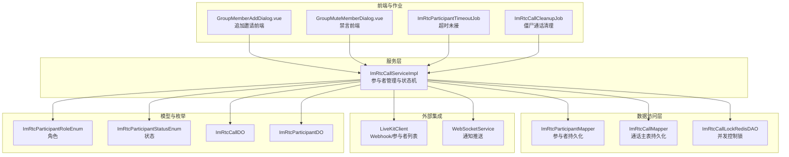
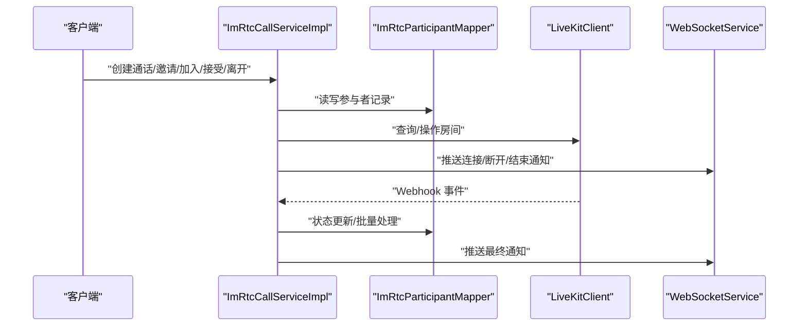
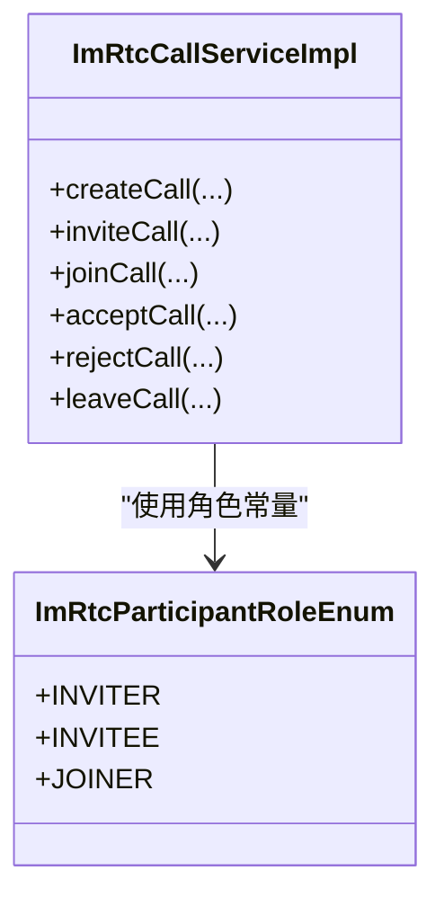
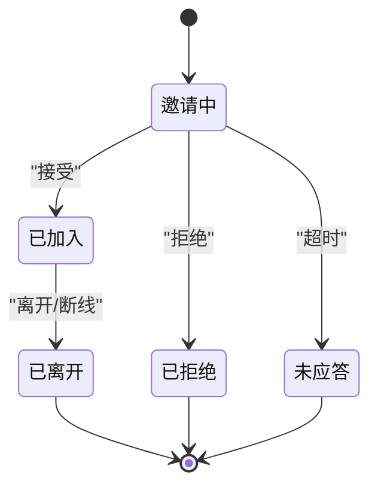
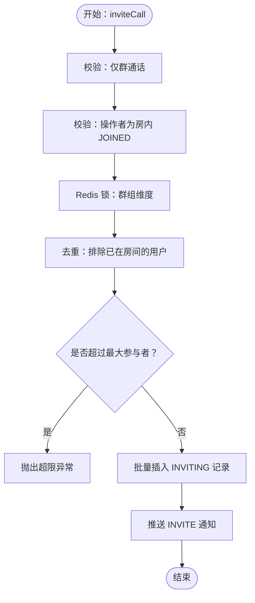
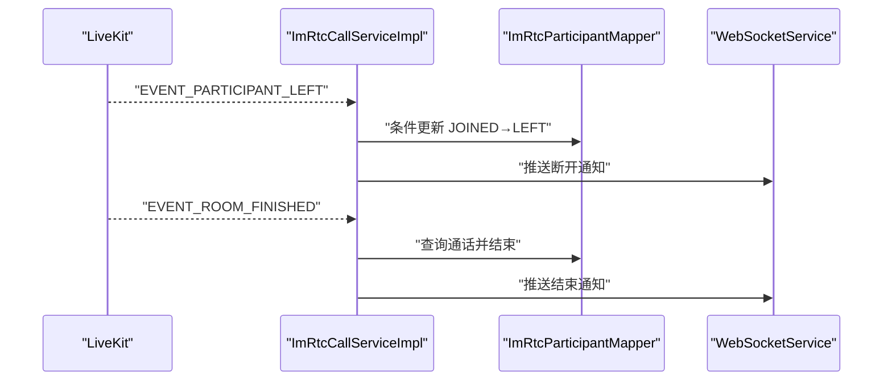
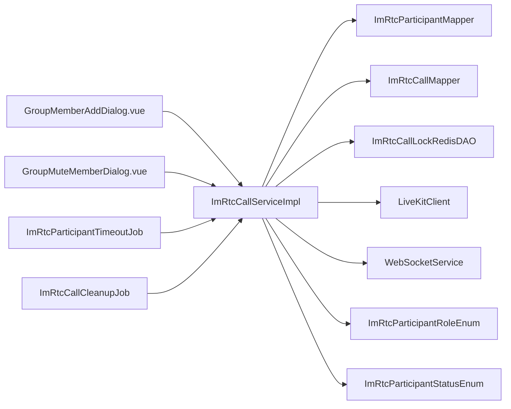

# 参与者管理

<cite>
**本文引用的文件**
- [ImRtcParticipantRoleEnum.java](file://yudao-module-im/src/main/java/cn/iocoder/yudao/module/im/enums/rtc/ImRtcParticipantRoleEnum.java)
- [ImRtcParticipantStatusEnum.java](file://yudao-module-im/src/main/java/cn/iocoder/yudao/module/im/enums/rtc/ImRtcParticipantStatusEnum.java)
- [ImRtcCallServiceImpl.java](file://yudao-module-im/src/main/java/cn/iocoder/yudao/module/im/service/rtc/ImRtcCallServiceImpl.java)
- [ImRtcParticipantDO.java](file://yudao-module-im/src/main/java/cn/iocoder/yudao/module/im/dal/dataobject/rtc/ImRtcParticipantDO.java)
- [ImRtcParticipantMapper.java](file://yudao-module-im/src/main/java/cn/iocoder/yudao/module/im/dal/mysql/rtc/ImRtcParticipantMapper.java)
- [ImRtcCallDO.java](file://yudao-module-im/src/main/java/cn/iocoder/yudao/module/im/dal/dataobject/rtc/ImRtcCallDO.java)
- [ImRtcCallMapper.java](file://yudao-module-im/src/main/java/cn/iocoder/yudao/module/im/dal/mysql/rtc/ImRtcCallMapper.java)
- [ImRtcCallLockRedisDAO.java](file://yudao-module-im/src/main/java/cn/iocoder/yudao/module/im/dal/redis/rtc/ImRtcCallLockRedisDAO.java)
- [ImRtcCallStatusEnum.java](file://yudao-module-im/src/main/java/cn/iocoder/yudao/module/im/enums/rtc/ImRtcCallStatusEnum.java)
- [ImRtcCallMediaTypeEnum.java](file://yudao-module-im/src/main/java/cn/iocoder/yudao/module/im/enums/rtc/ImRtcCallMediaTypeEnum.java)
- [ImRtcCallEndReasonEnum.java](file://yudao-module-im/src/main/java/cn/iocoder/yudao/module/im/enums/rtc/ImRtcCallEndReasonEnum.java)
- [ImRtcParticipantConnectedNotification.java](file://yudao-module-im/src/main/java/cn/iocoder/yudao/module/im/service/websocket/dto/notification/rtc/ImRtcParticipantConnectedNotification.java)
- [ImRtcParticipantDisconnectedNotification.java](file://yudao-module-im/src/main/java/cn/iocoder/yudao/module/im/service/websocket/dto/notification/rtc/ImRtcParticipantDisconnectedNotification.java)
- [ImRtcCallNotification.java](file://yudao-module-im/src/main/java/cn/iocoder/yudao/module/im/service/websocket/dto/notification/rtc/ImRtcCallNotification.java)
- [ImRtcCallStartNotification.java](file://yudao-module-im/src/main/java/cn/iocoder/yudao/module/im/service/websocket/dto/notification/rtc/ImRtcCallStartNotification.java)
- [ImRtcCallEndNotification.java](file://yudao-module-im/src/main/java/cn/iocoder/yudao/module/im/service/websocket/dto/notification/rtc/ImRtcCallEndNotification.java)
- [ImRtcParticipantTimeoutJob.java](file://yudao-module-im/src/main/java/cn/iocoder/yudao/module/im/job/rtc/ImRtcParticipantTimeoutJob.java)
- [ImRtcCallCleanupJob.java](file://yudao-module-im/src/main/java/cn/iocoder/yudao/module/im/job/rtc/ImRtcCallCleanupJob.java)
- [ImRtcCallServiceImplTest.java](file://yudao-module-im/src/test/java/cn/iocoder/yudao/module/im/service/rtc/ImRtcCallServiceImplTest.java)
- [GroupMemberAddDialog.vue](file://yudao-ui/yudao-ui-admin-vue3/src/views/im/home/components/group/GroupMemberAddDialog.vue)
- [GroupMuteMemberDialog.vue](file://yudao-ui/yudao-ui-admin-vue3/src/views/im/home/components/group/GroupMuteMemberDialog.vue)
- [useMuteOverlay.ts](file://yudao-ui/yudao-ui-admin-vue3/src/views/im/home/composables/useMuteOverlay.ts)
- [ImGroupMuteMemberReqVO.java](file://yudao-module-im/src/main/java/cn/iocoder/yudao/module/im/controller/admin/group/vo/ImGroupMuteMemberReqVO.java)
- [ImGroupCancelMuteMemberReqVO.java](file://yudao-module-im/src/main/java/cn/iocoder/yudao/module/im/controller/admin/group/vo/ImGroupCancelMuteMemberReqVO.java)
</cite>

## 目录
1. [引言](#引言)
2. [项目结构](#项目结构)
3. [核心组件](#核心组件)
4. [架构总览](#架构总览)
5. [详细组件分析](#详细组件分析)
6. [依赖关系分析](#依赖关系分析)
7. [性能考量](#性能考量)
8. [故障排查指南](#故障排查指南)
9. [结论](#结论)
10. [附录](#附录)

## 引言
本文件面向实时音视频通话（IM RTC）系统中的“参与者管理”，围绕以下目标展开：参与者角色设计与权限边界、状态模型与转换规则、群通话追加邀请的去重与并发控制、参与者验证与权限校验、多方通话的最大参与者限制与并发控制、主持人权限与静音/踢出机制、离线与异常退出的兜底处理策略，以及最佳实践与常见问题。

## 项目结构
参与者管理涉及服务层、数据访问层、枚举与通知模型、定时任务与前端交互组件。核心位于 IM 模块的服务实现类中，配合 Redis 锁、LiveKit Webhook、WebSocket 通知与定时清理作业完成闭环。

图表来源
- [ImRtcCallServiceImpl.java:69-1189](file://yudao-module-im/src/main/java/cn/iocoder/yudao/module/im/service/rtc/ImRtcCallServiceImpl.java#L69-L1189)
- [ImRtcParticipantMapper.java](file://yudao-module-im/src/main/java/cn/iocoder/yudao/module/im/dal/mysql/rtc/ImRtcParticipantMapper.java)
- [ImRtcCallMapper.java](file://yudao-module-im/src/main/java/cn/iocoder/yudao/module/im/dal/mysql/rtc/ImRtcCallMapper.java)
- [ImRtcCallLockRedisDAO.java](file://yudao-module-im/src/main/java/cn/iocoder/yudao/module/im/dal/redis/rtc/ImRtcCallLockRedisDAO.java)
- [ImRtcParticipantRoleEnum.java:14-38](file://yudao-module-im/src/main/java/cn/iocoder/yudao/module/im/enums/rtc/ImRtcParticipantRoleEnum.java#L14-L38)
- [ImRtcParticipantStatusEnum.java:23-63](file://yudao-module-im/src/main/java/cn/iocoder/yudao/module/im/enums/rtc/ImRtcParticipantStatusEnum.java#L23-L63)
- [ImRtcParticipantTimeoutJob.java](file://yudao-module-im/src/main/java/cn/iocoder/yudao/module/im/job/rtc/ImRtcParticipantTimeoutJob.java)
- [ImRtcCallCleanupJob.java](file://yudao-module-im/src/main/java/cn/iocoder/yudao/module/im/job/rtc/ImRtcCallCleanupJob.java)
- [GroupMemberAddDialog.vue:95-128](file://yudao-ui/yudao-ui-admin-vue3/src/views/im/home/components/group/GroupMemberAddDialog.vue#L95-L128)
- [GroupMuteMemberDialog.vue:40-97](file://yudao-ui/yudao-ui-admin-vue3/src/views/im/home/components/group/GroupMuteMemberDialog.vue#L40-L97)

章节来源
- [ImRtcCallServiceImpl.java:69-1189](file://yudao-module-im/src/main/java/cn/iocoder/yudao/module/im/service/rtc/ImRtcCallServiceImpl.java#L69-L1189)

## 核心组件
- 参与者角色枚举：定义 INVITER（发起人）、INVITEE（被邀请者）、JOINER（主动加入者）三类角色，用于区分不同参与者的初始身份与权限边界。
- 参与者状态枚举：定义 INVITING（邀请中）、JOINED（已加入）、REJECTED（已拒绝）、NO_ANSWER（未应答）、LEFT（已离开）五种状态，明确活跃状态集合与终态闭包。
- 服务实现：ImRtcCallServiceImpl 提供创建、邀请、接受、拒绝、加入、离开、签发令牌、Webhook 处理、超时与清理等完整流程。
- 数据模型：ImRtcCallDO 与 ImRtcParticipantDO 描述通话与参与者记录，配合 Mapper 实现持久化。
- 并发控制：通过 Redis 锁在群组维度串行化并发操作，避免竞态。
- 通知与集成：通过 WebSocket 推送连接/断开/结束等通知，对接 LiveKit Webhook 与参与者列表。

章节来源
- [ImRtcParticipantRoleEnum.java:14-38](file://yudao-module-im/src/main/java/cn/iocoder/yudao/module/im/enums/rtc/ImRtcParticipantRoleEnum.java#L14-L38)
- [ImRtcParticipantStatusEnum.java:23-63](file://yudao-module-im/src/main/java/cn/iocoder/yudao/module/im/enums/rtc/ImRtcParticipantStatusEnum.java#L23-L63)
- [ImRtcCallServiceImpl.java:69-1189](file://yudao-module-im/src/main/java/cn/iocoder/yudao/module/im/service/rtc/ImRtcCallServiceImpl.java#L69-L1189)
- [ImRtcParticipantDO.java](file://yudao-module-im/src/main/java/cn/iocoder/yudao/module/im/dal/dataobject/rtc/ImRtcParticipantDO.java)
- [ImRtcCallDO.java](file://yudao-module-im/src/main/java/cn/iocoder/yudao/module/im/dal/dataobject/rtc/ImRtcCallDO.java)

## 架构总览
参与者管理贯穿“创建—邀请—接入—通话—结束”的全生命周期，结合 LiveKit Webhook 与定时任务形成强一致与兜底能力。

图表来源
- [ImRtcCallServiceImpl.java:497-598](file://yudao-module-im/src/main/java/cn/iocoder/yudao/module/im/service/rtc/ImRtcCallServiceImpl.java#L497-L598)
- [ImRtcParticipantMapper.java](file://yudao-module-im/src/main/java/cn/iocoder/yudao/module/im/dal/mysql/rtc/ImRtcParticipantMapper.java)
- [ImRtcCallServiceImpl.java:600-629](file://yudao-module-im/src/main/java/cn/iocoder/yudao/module/im/service/rtc/ImRtcCallServiceImpl.java#L600-L629)

## 详细组件分析

### 参与者角色设计与权限边界
- INVITER：创建通话时即时 JOINED，拥有取消 CREATED 状态通话的权限。
- INVITEE：被邀请者，初始状态为 INVITING，仅能接受或拒绝邀请。
- JOINER：仅群通话场景，旁观者通过“加入”成为 JOINER，进入房间即视为 JOINED。

图表来源
- [ImRtcParticipantRoleEnum.java:14-38](file://yudao-module-im/src/main/java/cn/iocoder/yudao/module/im/enums/rtc/ImRtcParticipantRoleEnum.java#L14-L38)
- [ImRtcCallServiceImpl.java:180-201](file://yudao-module-im/src/main/java/cn/iocoder/yudao/module/im/service/rtc/ImRtcCallServiceImpl.java#L180-L201)

章节来源
- [ImRtcParticipantRoleEnum.java:14-38](file://yudao-module-im/src/main/java/cn/iocoder/yudao/module/im/enums/rtc/ImRtcParticipantRoleEnum.java#L14-L38)
- [ImRtcCallServiceImpl.java:180-201](file://yudao-module-im/src/main/java/cn/iocoder/yudao/module/im/service/rtc/ImRtcCallServiceImpl.java#L180-L201)

### 参与者状态管理与转换规则
- 状态枚举与活跃集合：ACTIVE_STATUSES 包含 INVITING 与 JOINED。
- 私聊流程：INVITING → 接受/拒绝/超时；结束时终态为 LEFT/REJECTED/NO_ANSWER。
- 群聊流程：INVITING → JOINED → LEFT；当无人在房或仅剩独守时可关房；超时批量改为 NO_ANSWER。

图表来源
- [ImRtcParticipantStatusEnum.java:23-63](file://yudao-module-im/src/main/java/cn/iocoder/yudao/module/im/enums/rtc/ImRtcParticipantStatusEnum.java#L23-L63)
- [ImRtcCallServiceImpl.java:431-442](file://yudao-module-im/src/main/java/cn/iocoder/yudao/module/im/service/rtc/ImRtcCallServiceImpl.java#L431-L442)

章节来源
- [ImRtcParticipantStatusEnum.java:23-63](file://yudao-module-im/src/main/java/cn/iocoder/yudao/module/im/enums/rtc/ImRtcParticipantStatusEnum.java#L23-L63)
- [ImRtcCallServiceImpl.java:431-442](file://yudao-module-im/src/main/java/cn/iocoder/yudao/module/im/service/rtc/ImRtcCallServiceImpl.java#L431-L442)

### 参与者添加机制：群通话追加邀请与去重策略
- 校验：仅群通话支持追加邀请；操作者需为房内 JOINED 参与者。
- 去重：基于房间现有参与者集合排除已在通话池的用户。
- 并发：使用 Redis 锁保护群组维度的追加邀请，避免竞态。
- 限额：新邀请数与活跃参与者总数不超过配置上限，否则抛出超限异常。
- 批量插入与通知：批量写入 INVITING 记录并推送 INVITE 通知。

图表来源
- [ImRtcCallServiceImpl.java:180-201](file://yudao-module-im/src/main/java/cn/iocoder/yudao/module/im/service/rtc/ImRtcCallServiceImpl.java#L180-L201)
- [ImRtcCallServiceImpl.java:272-311](file://yudao-module-im/src/main/java/cn/iocoder/yudao/module/im/service/rtc/ImRtcCallServiceImpl.java#L272-L311)
- [ImRtcCallLockRedisDAO.java](file://yudao-module-im/src/main/java/cn/iocoder/yudao/module/im/dal/redis/rtc/ImRtcCallLockRedisDAO.java)

章节来源
- [ImRtcCallServiceImpl.java:180-201](file://yudao-module-im/src/main/java/cn/iocoder/yudao/module/im/service/rtc/ImRtcCallServiceImpl.java#L180-L201)
- [ImRtcCallServiceImpl.java:272-311](file://yudao-module-im/src/main/java/cn/iocoder/yudao/module/im/service/rtc/ImRtcCallServiceImpl.java#L272-L311)

### 参与者验证机制：validateParticipant 权限检查与状态校验
- 校验对象：必须是当前活跃通话的参与者。
- 私聊 accept/reject/leave：均需 validateParticipant 校验，确保仅 INVITING 或 JOINED 可接受/离开，REJECTED/LEFT/NO_ANSWER 等不可逆状态禁止变更。
- 签发令牌：仅 JOINED 参与者可获取 LiveKit Token。

章节来源
- [ImRtcCallServiceImpl.java:313-341](file://yudao-module-im/src/main/java/cn/iocoder/yudao/module/im/service/rtc/ImRtcCallServiceImpl.java#L313-L341)
- [ImRtcCallServiceImpl.java:343-371](file://yudao-module-im/src/main/java/cn/iocoder/yudao/module/im/service/rtc/ImRtcCallServiceImpl.java#L343-L371)
- [ImRtcCallServiceImpl.java:392-417](file://yudao-module-im/src/main/java/cn/iocoder/yudao/module/im/service/rtc/ImRtcCallServiceImpl.java#L392-L417)
- [ImRtcCallServiceImpl.java:486-495](file://yudao-module-im/src/main/java/cn/iocoder/yudao/module/im/service/rtc/ImRtcCallServiceImpl.java#L486-L495)

### 多方通话的参与者管理：最大参与者数量与并发控制
- 最大参与者：通过配置项 groupMaxParticipants 控制群通话上限；追加邀请时累加活跃计数进行校验。
- 并发控制：Redis 锁在群组维度串行化创建/邀请/清理等关键路径，避免竞态导致的重复邀请或超限。
- 关房判定：当房间内 JOINED=0 或 JOINED=1 且 INVITING=0 时，判定为无人可用继续通话，触发 endSession 流程。

章节来源
- [ImRtcCallServiceImpl.java:293-295](file://yudao-module-im/src/main/java/cn/iocoder/yudao/module/im/service/rtc/ImRtcCallServiceImpl.java#L293-L295)
- [ImRtcCallServiceImpl.java:431-442](file://yudao-module-im/src/main/java/cn/iocoder/yudao/module/im/service/rtc/ImRtcCallServiceImpl.java#L431-L442)
- [ImRtcCallLockRedisDAO.java](file://yudao-module-im/src/main/java/cn/iocoder/yudao/module/im/dal/redis/rtc/ImRtcCallLockRedisDAO.java)

### 参与者权限控制：主持人权限、静音与踢出
- 主持人权限：仅发起人（INVITER）可在 CREATED 状态取消通话；其余状态不可取消。
- 静音控制：前端提供禁言对话框，支持设置时长（秒，0 表示永久），后端 VO 校验最小值为 0。
- 踢出机制：当前实现未提供显式“踢人”接口；可通过 LiveKit 侧踢人或结束会话后引导用户重新邀请。

章节来源
- [ImRtcCallServiceImpl.java:373-390](file://yudao-module-im/src/main/java/cn/iocoder/yudao/module/im/service/rtc/ImRtcCallServiceImpl.java#L373-L390)
- [ImGroupMuteMemberReqVO.java:1-25](file://yudao-module-im/src/main/java/cn/iocoder/yudao/module/im/controller/admin/group/vo/ImGroupMuteMemberReqVO.java#L1-L25)
- [ImGroupCancelMuteMemberReqVO.java:1-19](file://yudao-module-im/src/main/java/cn/iocoder/yudao/module/im/controller/admin/group/vo/ImGroupCancelMuteMemberReqVO.java#L1-L19)
- [GroupMuteMemberDialog.vue:40-97](file://yudao-ui/yudao-ui-admin-vue3/src/views/im/home/components/group/GroupMuteMemberDialog.vue#L40-L97)

### 参与者离线处理：网络断开与异常退出
- Webhook 兜底：监听 LiveKit EVENT_PARTICIPANT_LEFT，若参与者状态仍为 JOINED，则条件更新为 LEFT 并推送断开通知。
- 房间结束兜底：监听 EVENT_ROOM_FINISHED，将通话推进 ENDED。
- 僵尸通话清理：定时扫描长时间活跃但 LiveKit 房间无人的通话，强制 endSession(HANGUP)。

图表来源
- [ImRtcCallServiceImpl.java:508-598](file://yudao-module-im/src/main/java/cn/iocoder/yudao/module/im/service/rtc/ImRtcCallServiceImpl.java#L508-L598)
- [ImRtcCallCleanupJob.java](file://yudao-module-im/src/main/java/cn/iocoder/yudao/module/im/job/rtc/ImRtcCallCleanupJob.java)

章节来源
- [ImRtcCallServiceImpl.java:508-598](file://yudao-module-im/src/main/java/cn/iocoder/yudao/module/im/service/rtc/ImRtcCallServiceImpl.java#L508-L598)
- [ImRtcCallServiceImpl.java:600-629](file://yudao-module-im/src/main/java/cn/iocoder/yudao/module/im/service/rtc/ImRtcCallServiceImpl.java#L600-L629)

### 通知模型与前端展示
- 连接/断开通知：ImRtcParticipantConnectedNotification、ImRtcParticipantDisconnectedNotification。
- 通话通知：ImRtcCallStartNotification、ImRtcCallNotification、ImRtcCallEndNotification。
- 前端禁言遮罩：useMuteOverlay.ts 基于成员 muteEndTime 渲染禁言提示。

章节来源
- [ImRtcParticipantConnectedNotification.java](file://yudao-module-im/src/main/java/cn/iocoder/yudao/module/im/service/websocket/dto/notification/rtc/ImRtcParticipantConnectedNotification.java)
- [ImRtcParticipantDisconnectedNotification.java](file://yudao-module-im/src/main/java/cn/iocoder/yudao/module/im/service/websocket/dto/notification/rtc/ImRtcParticipantDisconnectedNotification.java)
- [ImRtcCallStartNotification.java](file://yudao-module-im/src/main/java/cn/iocoder/yudao/module/im/service/websocket/dto/notification/rtc/ImRtcCallStartNotification.java)
- [ImRtcCallNotification.java](file://yudao-module-im/src/main/java/cn/iocoder/yudao/module/im/service/websocket/dto/notification/rtc/ImRtcCallNotification.java)
- [ImRtcCallEndNotification.java](file://yudao-module-im/src/main/java/cn/iocoder/yudao/module/im/service/websocket/dto/notification/rtc/ImRtcCallEndNotification.java)
- [useMuteOverlay.ts:80-96](file://yudao-ui/yudao-ui-admin-vue3/src/views/im/home/composables/useMuteOverlay.ts#L80-L96)

## 依赖关系分析
- 服务层依赖：ImRtcCallServiceImpl 依赖 Mapper、Redis 锁、LiveKit 客户端与 WebSocket 服务。
- 枚举与模型：角色与状态枚举贯穿业务判断；DO 作为持久化载体。
- 前端与作业：前端负责触发邀请/禁言等动作；定时作业负责超时与清理。

图表来源
- [ImRtcCallServiceImpl.java:69-1189](file://yudao-module-im/src/main/java/cn/iocoder/yudao/module/im/service/rtc/ImRtcCallServiceImpl.java#L69-L1189)
- [ImRtcParticipantMapper.java](file://yudao-module-im/src/main/java/cn/iocoder/yudao/module/im/dal/mysql/rtc/ImRtcParticipantMapper.java)
- [ImRtcCallMapper.java](file://yudao-module-im/src/main/java/cn/iocoder/yudao/module/im/dal/mysql/rtc/ImRtcCallMapper.java)
- [ImRtcCallLockRedisDAO.java](file://yudao-module-im/src/main/java/cn/iocoder/yudao/module/im/dal/redis/rtc/ImRtcCallLockRedisDAO.java)
- [ImRtcParticipantRoleEnum.java:14-38](file://yudao-module-im/src/main/java/cn/iocoder/yudao/module/im/enums/rtc/ImRtcParticipantRoleEnum.java#L14-L38)
- [ImRtcParticipantStatusEnum.java:23-63](file://yudao-module-im/src/main/java/cn/iocoder/yudao/module/im/enums/rtc/ImRtcParticipantStatusEnum.java#L23-L63)
- [GroupMemberAddDialog.vue:95-128](file://yudao-ui/yudao-ui-admin-vue3/src/views/im/home/components/group/GroupMemberAddDialog.vue#L95-L128)
- [GroupMuteMemberDialog.vue:40-97](file://yudao-ui/yudao-ui-admin-vue3/src/views/im/home/components/group/GroupMuteMemberDialog.vue#L40-L97)
- [ImRtcParticipantTimeoutJob.java](file://yudao-module-im/src/main/java/cn/iocoder/yudao/module/im/job/rtc/ImRtcParticipantTimeoutJob.java)
- [ImRtcCallCleanupJob.java](file://yudao-module-im/src/main/java/cn/iocoder/yudao/module/im/job/rtc/ImRtcCallCleanupJob.java)

## 性能考量
- 批量处理：批量插入与批量通知减少数据库往返与消息推送次数。
- 预查用户：noAnswerCallCheck0 中对候选用户进行一次性 getUserMap 预查，避免 N+1。
- 条件更新：多处使用“按状态条件更新”，确保并发安全与幂等。
- Redis 锁：在高并发场景下串行化关键路径，降低竞争带来的重复邀请与超限风险。

章节来源
- [ImRtcCallServiceImpl.java:662-676](file://yudao-module-im/src/main/java/cn/iocoder/yudao/module/im/service/rtc/ImRtcCallServiceImpl.java#L662-L676)
- [ImRtcCallServiceImpl.java:298-303](file://yudao-module-im/src/main/java/cn/iocoder/yudao/module/im/service/rtc/ImRtcCallServiceImpl.java#L298-L303)

## 故障排查指南
- 无法加入：确认房间存在且活跃；群通话需为群有效成员；用户不得同时处于其他活跃通话。
- 无法接受/离开：仅 INVITING 或 JOINED 可接受/离开；REJECTED/LEFT/NO_ANSWER 状态不可变更。
- 未应答超时：检查定时任务阈值配置；确认 LiveKit Webhook 正常；查看日志中“由 LiveKit Webhook 兜底”的记录。
- 僵尸通话：确认清理作业运行；检查 LiveKit 房间实际参与者数；必要时手动结束会话。
- 追加邀请失败：检查是否已在房间；是否超过最大参与者；是否被 Redis 锁阻塞。

章节来源
- [ImRtcCallServiceImpl.java:248-270](file://yudao-module-im/src/main/java/cn/iocoder/yudao/module/im/service/rtc/ImRtcCallServiceImpl.java#L248-L270)
- [ImRtcCallServiceImpl.java:313-341](file://yudao-module-im/src/main/java/cn/iocoder/yudao/module/im/service/rtc/ImRtcCallServiceImpl.java#L313-L341)
- [ImRtcCallServiceImpl.java:392-417](file://yudao-module-im/src/main/java/cn/iocoder/yudao/module/im/service/rtc/ImRtcCallServiceImpl.java#L392-L417)
- [ImRtcCallServiceImpl.java:631-638](file://yudao-module-im/src/main/java/cn/iocoder/yudao/module/im/service/rtc/ImRtcCallServiceImpl.java#L631-L638)
- [ImRtcCallServiceImpl.java:600-629](file://yudao-module-im/src/main/java/cn/iocoder/yudao/module/im/service/rtc/ImRtcCallServiceImpl.java#L600-L629)
- [ImRtcCallServiceImplTest.java:123-140](file://yudao-module-im/src/test/java/cn/iocoder/yudao/module/im/service/rtc/ImRtcCallServiceImplTest.java#L123-L140)

## 结论
本参与者管理体系以清晰的角色与状态模型为基础，结合 Redis 锁与 LiveKit Webhook 实现高可靠并发控制与兜底处理；通过批量处理与条件更新保障性能与一致性；前端提供禁言与加入等能力，形成完整的多方通话参与者管理闭环。

## 附录
- 最佳实践
  - 在群通话中使用 Redis 锁保护追加邀请与清理路径。
  - 使用条件更新与批量操作提升吞吐。
  - 严格校验用户状态与房间活跃性，避免越权与状态倒退。
  - 定期运行超时与清理作业，保持系统健康。
- 常见问题
  - 超时未接：调整阈值配置，确认 Webhook 正常。
  - 重复邀请：依赖去重与锁，避免前端多次提交。
  - 踢人需求：当前未提供显式接口，建议通过 LiveKit 侧或结束会话后重新邀请。