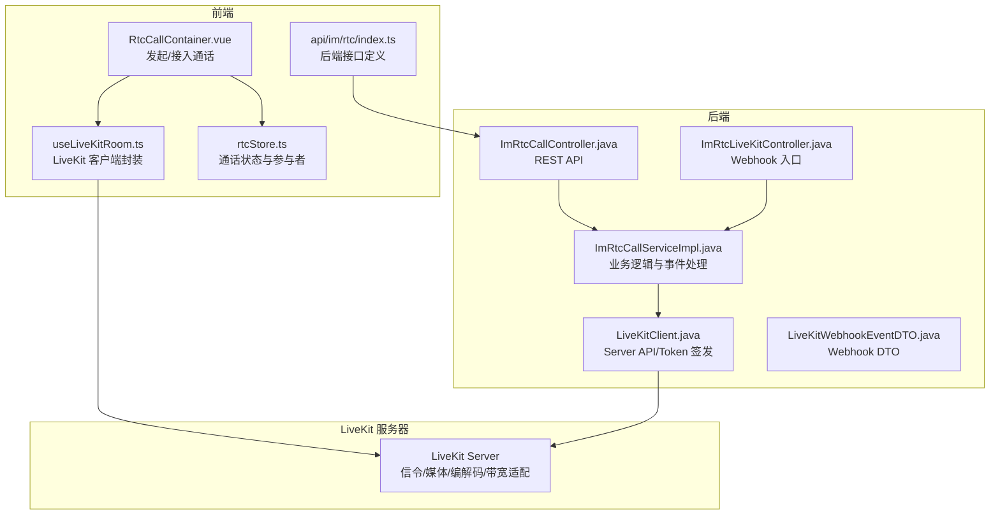
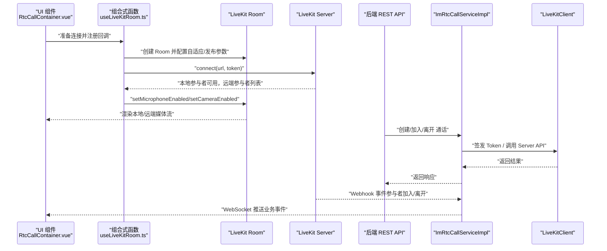
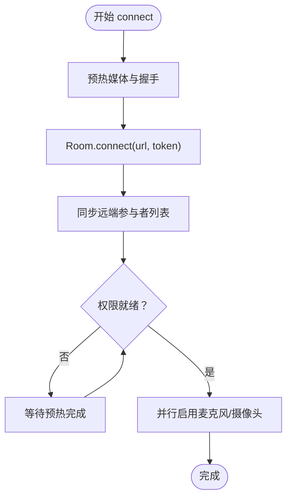
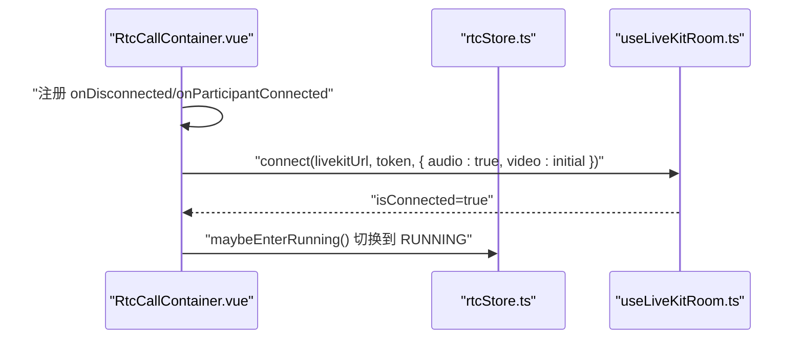
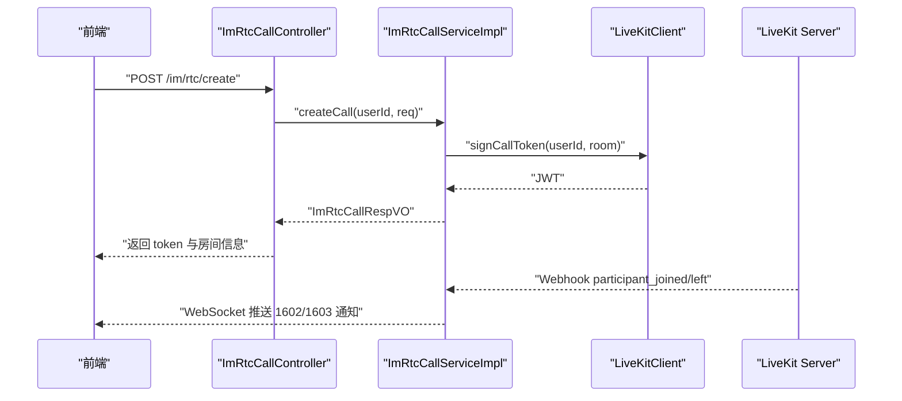
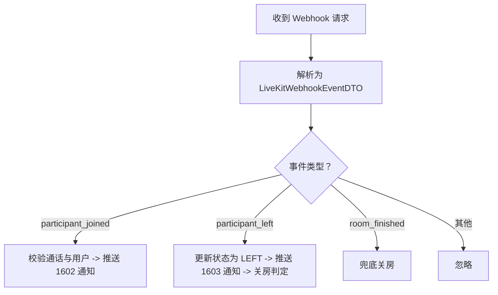
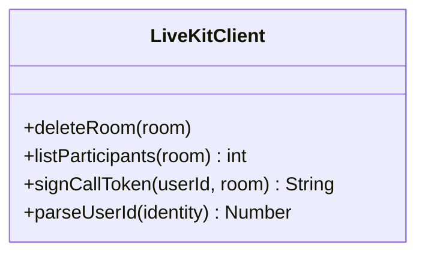
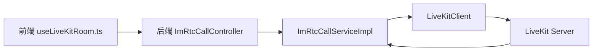

# 媒体处理机制

<cite>
**本文引用的文件**
- [useLiveKitRoom.ts](file://yudao-ui/yudao-ui-admin-vue3/src/views/im/home/composables/useLiveKitRoom.ts)
- [RtcCallContainer.vue](file://yudao-ui/yudao-ui-admin-vue3/src/views/im/home/components/rtc/RtcCallContainer.vue)
- [rtcStore.ts](file://yudao-ui/yudao-ui-admin-vue3/src/views/im/home/store/rtcStore.ts)
- [index.ts](file://yudao-ui/yudao-ui-admin-vue3/src/api/im/rtc/index.ts)
- [LiveKitClient.java](file://yudao-module-im/src/main/java/cn/iocoder/yudao/module/im/framework/rtc/core/LiveKitClient.java)
- [ImRtcConfiguration.java](file://yudao-module-im/src/main/java/cn/iocoder/yudao/module/im/framework/rtc/config/ImRtcConfiguration.java)
- [LiveKitWebhookEventDTO.java](file://yudao-module-im/src/main/java/cn/iocoder/yudao/module/im/framework/rtc/core/LiveKitWebhookEventDTO.java)
- [ImRtcCallController.java](file://yudao-module-im/src/main/java/cn/iocoder/yudao/module/im/controller/admin/rtc/ImRtcCallController.java)
- [ImRtcCallServiceImpl.java](file://yudao-module-im/src/main/java/cn/iocoder/yudao/module/im/service/rtc/ImRtcCallServiceImpl.java)
- [ImRtcLiveKitController.java](file://yudao-module-im/src/main/java/cn/iocoder/yudao/module/im/controller/admin/rtc/ImRtcLiveKitController.java)
- [README.md](file://script/livekit-poc/README.md)
- [livekit.yaml](file://script/livekit-poc/livekit.yaml)
- [docker-compose.yml](file://script/livekit-poc/docker-compose.yml)
</cite>

## 目录
1. [简介](#简介)
2. [项目结构](#项目结构)
3. [核心组件](#核心组件)
4. [架构总览](#架构总览)
5. [详细组件分析](#详细组件分析)
6. [依赖关系分析](#依赖关系分析)
7. [性能考虑](#性能考虑)
8. [故障排查指南](#故障排查指南)
9. [结论](#结论)
10. [附录](#附录)

## 简介
本技术文档围绕实时音视频媒体处理机制展开，聚焦于 LiveKit 客户端在前端与后端的集成方式，涵盖以下主题：
- LiveKit 客户端初始化、配置与使用流程
- 媒体类型支持：音频通话、视频通话与音视频混合模式的配置与切换
- 媒体协商过程：SDP 交换、编解码器选择与带宽适配策略
- 媒体流处理：音频与视频轨的传输与同步机制
- 媒体质量控制：自动增益、噪声抑制与视频分辨率自适应
- 媒体事件处理：Webhook 事件（如参与者加入/离开、轨道发布）的响应
- 媒体安全机制：DTLS 加密与 SRTP 保护
- 性能优化建议与常见问题排查

## 项目结构
本项目的实时音视频能力由前端 Vue3 组合式函数与组件、后端 Java 服务以及 LiveKit 服务器三部分协同实现：
- 前端负责媒体采集、发布、订阅、渲染与 UI 交互
- 后端负责通话生命周期管理、LiveKit Token 签发、Webhook 事件处理与业务状态同步
- LiveKit 服务器负责信令与媒体转发、编解码与带宽适配

图表来源
- [RtcCallContainer.vue:230-259](file://yudao-ui/yudao-ui-admin-vue3/src/views/im/home/components/rtc/RtcCallContainer.vue#L230-L259)
- [useLiveKitRoom.ts:52-158](file://yudao-ui/yudao-ui-admin-vue3/src/views/im/home/composables/useLiveKitRoom.ts#L52-L158)
- [rtcStore.ts](file://yudao-ui/yudao-ui-admin-vue3/src/views/im/home/store/rtcStore.ts)
- [index.ts:1-45](file://yudao-ui/yudao-ui-admin-vue3/src/api/im/rtc/index.ts#L1-L45)
- [ImRtcCallController.java:30-112](file://yudao-module-im/src/main/java/cn/iocoder/yudao/module/im/controller/admin/rtc/ImRtcCallController.java#L30-L112)
- [ImRtcCallServiceImpl.java:497-516](file://yudao-module-im/src/main/java/cn/iocoder/yudao/module/im/service/rtc/ImRtcCallServiceImpl.java#L497-L516)
- [LiveKitClient.java:1-133](file://yudao-module-im/src/main/java/cn/iocoder/yudao/module/im/framework/rtc/core/LiveKitClient.java#L1-L133)
- [LiveKitWebhookEventDTO.java:1-83](file://yudao-module-im/src/main/java/cn/iocoder/yudao/module/im/framework/rtc/core/LiveKitWebhookEventDTO.java#L1-L83)
- [ImRtcLiveKitController.java:65-76](file://yudao-module-im/src/main/java/cn/iocoder/yudao/module/im/controller/admin/rtc/ImRtcLiveKitController.java#L65-L76)

章节来源
- [RtcCallContainer.vue:230-259](file://yudao-ui/yudao-ui-admin-vue3/src/views/im/home/components/rtc/RtcCallContainer.vue#L230-L259)
- [useLiveKitRoom.ts:52-158](file://yudao-ui/yudao-ui-admin-vue3/src/views/im/home/composables/useLiveKitRoom.ts#L52-L158)
- [ImRtcCallController.java:30-112](file://yudao-module-im/src/main/java/cn/iocoder/yudao/module/im/controller/admin/rtc/ImRtcCallController.java#L30-L112)

## 核心组件
- 前端 LiveKit 客户端封装：负责房间连接、媒体发布/订阅、自适应流控与订阅流缓存
- 前端通话容器与状态：负责 UI 流程编排、事件回调注册与通话阶段推进
- 后端通话控制器与服务：负责通话生命周期、Token 签发、Webhook 事件处理
- LiveKit 客户端工具：负责调用 LiveKit Server API（删除房间、列出参与者）与 Token 签发
- Webhook DTO：定义 LiveKit 事件载荷结构，便于后端解析与处理

章节来源
- [useLiveKitRoom.ts:52-158](file://yudao-ui/yudao-ui-admin-vue3/src/views/im/home/composables/useLiveKitRoom.ts#L52-L158)
- [RtcCallContainer.vue:230-259](file://yudao-ui/yudao-ui-admin-vue3/src/views/im/home/components/rtc/RtcCallContainer.vue#L230-L259)
- [LiveKitClient.java:1-133](file://yudao-module-im/src/main/java/cn/iocoder/yudao/module/im/framework/rtc/core/LiveKitClient.java#L1-L133)
- [LiveKitWebhookEventDTO.java:1-83](file://yudao-module-im/src/main/java/cn/iocoder/yudao/module/im/framework/rtc/core/LiveKitWebhookEventDTO.java#L1-L83)

## 架构总览
下图展示了从前端发起通话到媒体建立、事件流转与后端处理的完整链路。

图表来源
- [RtcCallContainer.vue:230-259](file://yudao-ui/yudao-ui-admin-vue3/src/views/im/home/components/rtc/RtcCallContainer.vue#L230-L259)
- [useLiveKitRoom.ts:52-158](file://yudao-ui/yudao-ui-admin-vue3/src/views/im/home/composables/useLiveKitRoom.ts#L52-L158)
- [ImRtcCallController.java:30-112](file://yudao-module-im/src/main/java/cn/iocoder/yudao/module/im/controller/admin/rtc/ImRtcCallController.java#L30-L112)
- [ImRtcCallServiceImpl.java:497-516](file://yudao-module-im/src/main/java/cn/iocoder/yudao/module/im/service/rtc/ImRtcCallServiceImpl.java#L497-L516)
- [LiveKitClient.java:1-133](file://yudao-module-im/src/main/java/cn/iocoder/yudao/module/im/framework/rtc/core/LiveKitClient.java#L1-L133)

## 详细组件分析

### 前端 LiveKit 客户端封装（useLiveKitRoom.ts）
- 初始化与配置
  - 自适应流控：开启自适应流控与动态停发，降低上行带宽占用
  - 发布默认参数：设置视频编码最大码率、帧率与优先级；屏幕共享单独编码上限
  - 采集默认参数：设定采集分辨率为 720p，兼顾清晰度与性能
- 连接流程
  - 预热媒体与 WebSocket 握手并行，缩短首次建立时间
  - 连接成功后同步远端参与者列表，确保首屏不漏人
  - 权限就绪后并行启用麦克风与摄像头发布
- 媒体流处理
  - 订阅流缓存：以参与者 SID 与轨道来源为键缓存 MediaStream，避免重复挂载导致解码管线重建
  - 轨道静音处理：当轨道被静音时返回空，促使视频元素解绑而非卡帧

图表来源
- [useLiveKitRoom.ts:52-158](file://yudao-ui/yudao-ui-admin-vue3/src/views/im/home/composables/useLiveKitRoom.ts#L52-L158)

章节来源
- [useLiveKitRoom.ts:52-158](file://yudao-ui/yudao-ui-admin-vue3/src/views/im/home/composables/useLiveKitRoom.ts#L52-L158)

### 前端通话容器与状态（RtcCallContainer.vue）
- 连接入口：先注册断开、参与者加入/离开回调，再执行连接，确保事件不丢失
- 阶段推进：当处于“邀请中”阶段且检测到远端参与者加入时，推进到“通话中”
- 初始摄像头状态：根据初始参数决定是否开启摄像头

图表来源
- [RtcCallContainer.vue:230-259](file://yudao-ui/yudao-ui-admin-vue3/src/views/im/home/components/rtc/RtcCallContainer.vue#L230-L259)
- [rtcStore.ts](file://yudao-ui/yudao-ui-admin-vue3/src/views/im/home/store/rtcStore.ts)

章节来源
- [RtcCallContainer.vue:230-259](file://yudao-ui/yudao-ui-admin-vue3/src/views/im/home/components/rtc/RtcCallContainer.vue#L230-L259)

### 后端通话控制器与服务（ImRtcCallController.java / ImRtcCallServiceImpl.java）
- REST API：提供创建、邀请、加入、离开、查询活跃通话等接口
- 业务逻辑：
  - 事件处理：根据 Webhook 事件类型分别处理参与者加入/离开、房间销毁
  - 通知推送：向参与方推送参与者连接/断开通知
  - 关房判定：私聊任一方离开即关房；群聊在无人在房且无人响铃时关房
- Token 签发：为用户生成进入房间的 JWT，包含显示名称等信息

图表来源
- [ImRtcCallController.java:30-112](file://yudao-module-im/src/main/java/cn/iocoder/yudao/module/im/controller/admin/rtc/ImRtcCallController.java#L30-L112)
- [ImRtcCallServiceImpl.java:497-516](file://yudao-module-im/src/main/java/cn/iocoder/yudao/module/im/service/rtc/ImRtcCallServiceImpl.java#L497-L516)
- [LiveKitClient.java:1-133](file://yudao-module-im/src/main/java/cn/iocoder/yudao/module/im/framework/rtc/core/LiveKitClient.java#L1-L133)

章节来源
- [ImRtcCallController.java:30-112](file://yudao-module-im/src/main/java/cn/iocoder/yudao/module/im/controller/admin/rtc/ImRtcCallController.java#L30-L112)
- [ImRtcCallServiceImpl.java:497-516](file://yudao-module-im/src/main/java/cn/iocoder/yudao/module/im/service/rtc/ImRtcCallServiceImpl.java#L497-L516)

### Webhook 事件处理（LiveKitWebhookEventDTO.java / ImRtcLiveKitController.java）
- DTO 定义：限定反序列化的事件类型与参与者/房间元信息
- 控制器入口：接收 Webhook 请求，调用服务处理并记录日志
- 服务处理：
  - 参与者加入：校验通话存在且活跃，解析用户 ID，推送连接通知
  - 参与者离开：更新参与者状态为离线，推送断开通知，并触发关房判定
  - 房间销毁：用于兜底关房

图表来源
- [LiveKitWebhookEventDTO.java:1-83](file://yudao-module-im/src/main/java/cn/iocoder/yudao/module/im/framework/rtc/core/LiveKitWebhookEventDTO.java#L1-L83)
- [ImRtcLiveKitController.java:65-76](file://yudao-module-im/src/main/java/cn/iocoder/yudao/module/im/controller/admin/rtc/ImRtcLiveKitController.java#L65-L76)
- [ImRtcCallServiceImpl.java:497-516](file://yudao-module-im/src/main/java/cn/iocoder/yudao/module/im/service/rtc/ImRtcCallServiceImpl.java#L497-L516)

章节来源
- [LiveKitWebhookEventDTO.java:1-83](file://yudao-module-im/src/main/java/cn/iocoder/yudao/module/im/framework/rtc/core/LiveKitWebhookEventDTO.java#L1-L83)
- [ImRtcLiveKitController.java:65-76](file://yudao-module-im/src/main/java/cn/iocoder/yudao/module/im/controller/admin/rtc/ImRtcLiveKitController.java#L65-L76)
- [ImRtcCallServiceImpl.java:497-516](file://yudao-module-im/src/main/java/cn/iocoder/yudao/module/im/service/rtc/ImRtcCallServiceImpl.java#L497-L516)

### LiveKit 客户端工具（LiveKitClient.java）
- 功能职责：
  - Server API 调用：删除房间、列出房间内参与者
  - Token 签发：基于配置与 JWT 规范生成进入房间的令牌
  - 身份解析：从 JWT 中解析用户 ID，支持多端拼接格式
- 配置注入：通过 Spring 配置类注册为 Bean，供服务层使用

图表来源
- [LiveKitClient.java:1-133](file://yudao-module-im/src/main/java/cn/iocoder/yudao/module/im/framework/rtc/core/LiveKitClient.java#L1-L133)
- [ImRtcConfiguration.java:1-24](file://yudao-module-im/src/main/java/cn/iocoder/yudao/module/im/framework/rtc/config/ImRtcConfiguration.java#L1-L24)

章节来源
- [LiveKitClient.java:1-133](file://yudao-module-im/src/main/java/cn/iocoder/yudao/module/im/framework/rtc/core/LiveKitClient.java#L1-L133)
- [ImRtcConfiguration.java:1-24](file://yudao-module-im/src/main/java/cn/iocoder/yudao/module/im/framework/rtc/config/ImRtcConfiguration.java#L1-L24)

## 依赖关系分析
- 前端依赖后端提供的接口与 Token，后端依赖 LiveKit Server 提供的信令与媒体转发
- 后端通过 LiveKitClient 封装调用 LiveKit Server API，实现房间管理与 Token 签发
- Webhook 事件由 LiveKit Server 推送到后端，后端进行幂等处理并推送业务通知

图表来源
- [useLiveKitRoom.ts:52-158](file://yudao-ui/yudao-ui-admin-vue3/src/views/im/home/composables/useLiveKitRoom.ts#L52-L158)
- [ImRtcCallController.java:30-112](file://yudao-module-im/src/main/java/cn/iocoder/yudao/module/im/controller/admin/rtc/ImRtcCallController.java#L30-L112)
- [ImRtcCallServiceImpl.java:497-516](file://yudao-module-im/src/main/java/cn/iocoder/yudao/module/im/service/rtc/ImRtcCallServiceImpl.java#L497-L516)
- [LiveKitClient.java:1-133](file://yudao-module-im/src/main/java/cn/iocoder/yudao/module/im/framework/rtc/core/LiveKitClient.java#L1-L133)

章节来源
- [ImRtcCallController.java:30-112](file://yudao-module-im/src/main/java/cn/iocoder/yudao/module/im/controller/admin/rtc/ImRtcCallController.java#L30-L112)
- [ImRtcCallServiceImpl.java:497-516](file://yudao-module-im/src/main/java/cn/iocoder/yudao/module/im/service/rtc/ImRtcCallServiceImpl.java#L497-L516)

## 性能考虑
- 自适应流控与动态停发：减少未订阅层级的上行流量，提升网络效率
- 发布编码上限：限制最大码率与帧率，结合优先级策略保障稳定性
- 采集分辨率：720p 在清晰度与带宽之间取得平衡
- 预热媒体：与握手并行，缩短首帧时间
- 订阅流缓存：避免重复挂载导致解码管线重建，减少画面闪烁与抖动
- 并行启用麦克风与摄像头：缩短发布准备时间

章节来源
- [useLiveKitRoom.ts:52-158](file://yudao-ui/yudao-ui-admin-vue3/src/views/im/home/composables/useLiveKitRoom.ts#L52-L158)

## 故障排查指南
- 无法连接 LiveKit
  - 检查后端返回的 token 是否有效，确认签发逻辑与 LiveKit 配置一致
  - 核对前端 connect 参数与后端接口返回的 URL/Token
- 媒体流不显示或卡顿
  - 查看订阅流缓存是否命中，确认轨道未被静音
  - 检查发布编码上限与网络状况，必要时降低码率或帧率
- 事件未推送
  - 确认 Webhook 地址与鉴权配置正确
  - 检查后端日志，确认事件已被接收并处理
- 房间未关闭
  - 检查参与者状态更新逻辑与关房判定条件
  - 使用后端 Server API 手动删除房间进行兜底

章节来源
- [ImRtcCallServiceImpl.java:497-516](file://yudao-module-im/src/main/java/cn/iocoder/yudao/module/im/service/rtc/ImRtcCallServiceImpl.java#L497-L516)
- [LiveKitClient.java:105-133](file://yudao-module-im/src/main/java/cn/iocoder/yudao/module/im/framework/rtc/core/LiveKitClient.java#L105-L133)

## 结论
本方案通过前后端协作与 LiveKit 服务器的配合，实现了稳定高效的实时音视频通话能力。前端侧重媒体采集、发布与订阅体验优化，后端负责通话生命周期管理与事件编排。通过自适应流控、带宽上限与预热机制，系统在不同网络环境下均能保持良好的用户体验。Webhook 事件处理进一步增强了业务态的可观测性与可靠性。

## 附录
- LiveKit POC 环境
  - 参考脚本与配置文件，快速搭建本地 LiveKit 环境进行验证与调试
- LiveKit 配置要点
  - 服务器地址、鉴权与 Webhook 回调地址需与后端一致
  - 编解码器与带宽策略可根据实际网络环境调整

章节来源
- [README.md](file://script/livekit-poc/README.md)
- [livekit.yaml](file://script/livekit-poc/livekit.yaml)
- [docker-compose.yml](file://script/livekit-poc/docker-compose.yml)