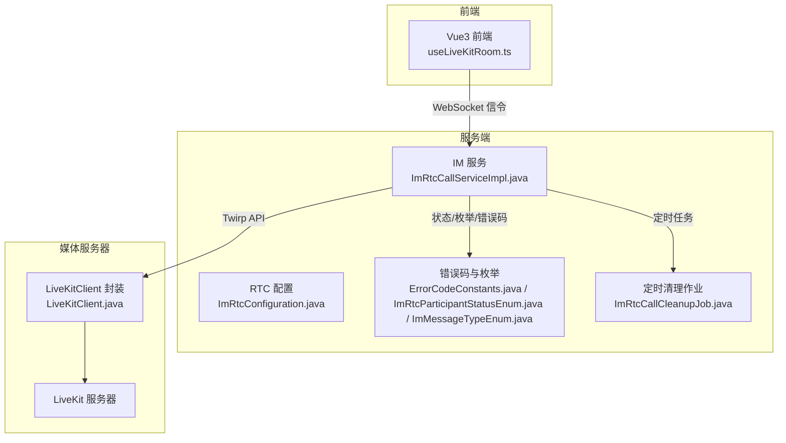
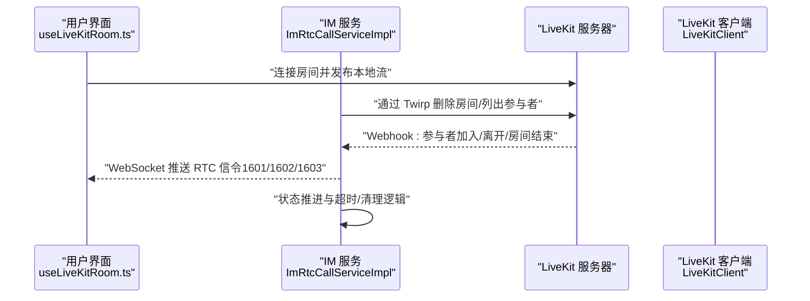
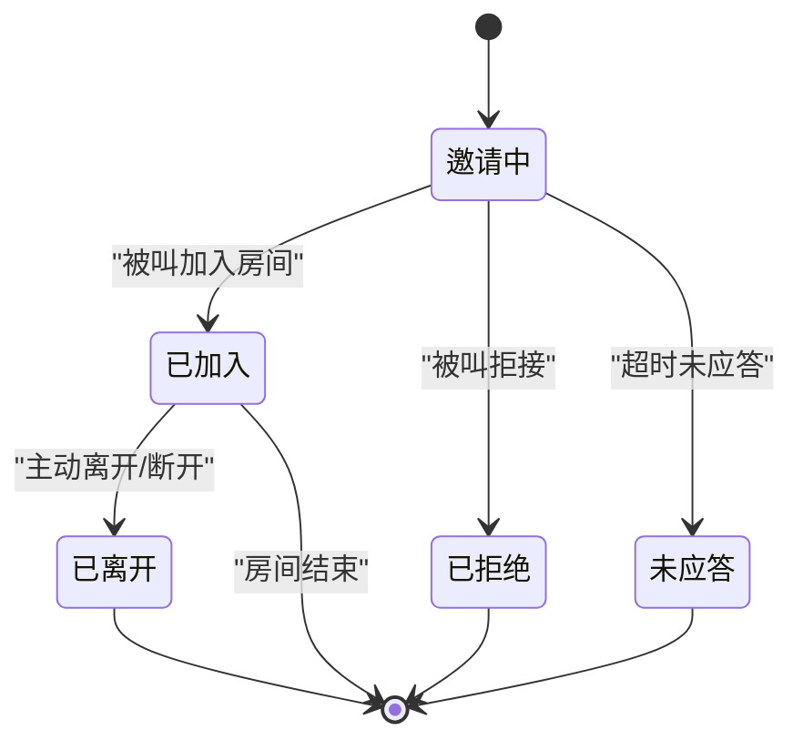
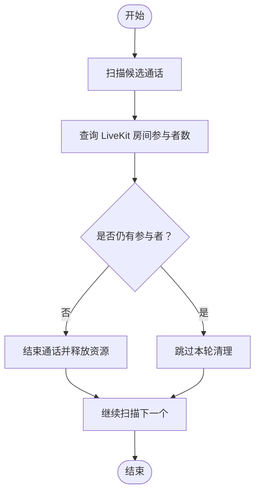
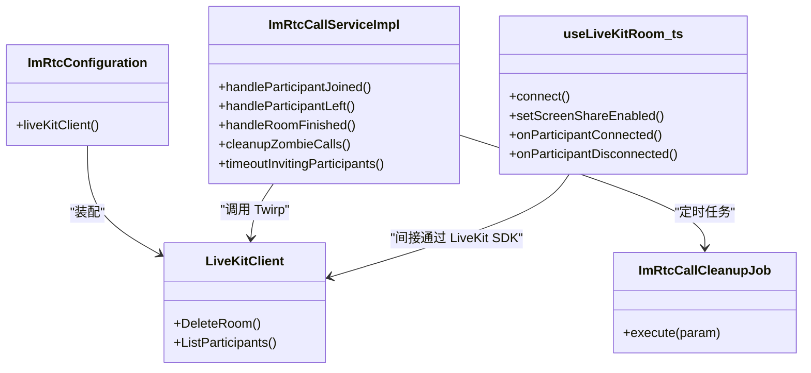

# 实时音视频通话

<cite>
**本文引用的文件**
- [LiveKitClient.java](file://yudao-module-im/src/main/java/cn/iocoder/yudao/module/im/framework/rtc/core/LiveKitClient.java)
- [ImRtcConfiguration.java](file://yudao-module-im/src/main/java/cn/iocoder/yudao/module/im/framework/rtc/config/ImRtcConfiguration.java)
- [ImRtcCallServiceImpl.java](file://yudao-module-im/src/main/java/cn/iocoder/yudao/module/im/service/rtc/ImRtcCallServiceImpl.java)
- [ImRtcCallCleanupJob.java](file://yudao-module-im/src/main/java/cn/iocoder/yudao/module/im/job/rtc/ImRtcCallCleanupJob.java)
- [useLiveKitRoom.ts](file://yudao-ui/yudao-ui-admin-vue3/src/views/im/home/composables/useLiveKitRoom.ts)
- [ImMessageTypeEnum.java](file://yudao-module-im/src/main/java/cn/iocoder/yudao/module/im/enums/message/ImMessageTypeEnum.java)
- [ImRtcParticipantStatusEnum.java](file://yudao-module-im/src/main/java/cn/iocoder/yudao/module/im/enums/rtc/ImRtcParticipantStatusEnum.java)
- [ErrorCodeConstants.java](file://yudao-module-im/src/main/java/cn/iocoder/yudao/module/im/enums/ErrorCodeConstants.java)
</cite>

## 目录
1. [简介](#简介)
2. [项目结构](#项目结构)
3. [核心组件](#核心组件)
4. [架构总览](#架构总览)
5. [详细组件分析](#详细组件分析)
6. [依赖关系分析](#依赖关系分析)
7. [性能考虑](#性能考虑)
8. [故障排查指南](#故障排查指南)
9. [结论](#结论)
10. [附录](#附录)

## 简介
本文件面向实时音视频通话系统，基于现有仓库中的 IM 模块与前端组合式函数，系统化梳理通话架构、信令与媒体协作机制、通话建立流程、媒体传输策略、状态管理、参与者治理、质量监控、安全机制、清理与统计等关键主题。文档以“可落地”的方式呈现，既适合技术读者深入理解实现细节，也便于非技术读者把握整体运作。

## 项目结构
本项目采用多模块分层组织，实时通话能力主要分布在 IM 模块（服务端）与前端 UI（Vue3），并通过 LiveKit 作为媒体服务器与信令网关。关键位置如下：
- 服务端 IM 模块：提供通话生命周期管理、WebSocket 信令推送、定时清理作业、状态枚举与错误码定义。
- 前端 UI：提供与 LiveKit SDK 的交互封装（组合式函数），负责房间连接、发布/订阅、屏幕共享、事件回调等。
- 媒体服务器：通过 LiveKitClient 封装对 LiveKit 的 Twirp API 调用，完成房间管理与参与者查询。

图示来源
- [ImRtcConfiguration.java:1-24](file://yudao-module-im/src/main/java/cn/iocoder/yudao/module/im/framework/rtc/config/ImRtcConfiguration.java#L1-L24)
- [LiveKitClient.java:1-43](file://yudao-module-im/src/main/java/cn/iocoder/yudao/module/im/framework/rtc/core/LiveKitClient.java#L1-L43)
- [ImRtcCallServiceImpl.java:566-638](file://yudao-module-im/src/main/java/cn/iocoder/yudao/module/im/service/rtc/ImRtcCallServiceImpl.java#L566-L638)
- [ImRtcCallCleanupJob.java:1-58](file://yudao-module-im/src/main/java/cn/iocoder/yudao/module/im/job/rtc/ImRtcCallCleanupJob.java#L1-L58)
- [useLiveKitRoom.ts:38-81](file://yudao-ui/yudao-ui-admin-vue3/src/views/im/home/composables/useLiveKitRoom.ts#L38-L81)

章节来源
- [ImRtcConfiguration.java:1-24](file://yudao-module-im/src/main/java/cn/iocoder/yudao/module/im/framework/rtc/config/ImRtcConfiguration.java#L1-L24)
- [LiveKitClient.java:1-43](file://yudao-module-im/src/main/java/cn/iocoder/yudao/module/im/framework/rtc/core/LiveKitClient.java#L1-L43)
- [ImRtcCallServiceImpl.java:566-638](file://yudao-module-im/src/main/java/cn/iocoder/yudao/module/im/service/rtc/ImRtcCallServiceImpl.java#L566-L638)
- [ImRtcCallCleanupJob.java:1-58](file://yudao-module-im/src/main/java/cn/iocoder/yudao/module/im/job/rtc/ImRtcCallCleanupJob.java#L1-L58)
- [useLiveKitRoom.ts:38-81](file://yudao-ui/yudao-ui-admin-vue3/src/views/im/home/composables/useLiveKitRoom.ts#L38-L81)

## 核心组件
- LiveKit 客户端封装：提供 Twirp 端点常量、Token 签发与 Server API 调用（删除房间、列出参与者等），屏蔽厂商差异。
- 通话服务实现：负责通话生命周期、参与者状态推进、WebSocket 信令推送、Webhook 兜底处理、定时清理与超时处理。
- 前端组合式函数：封装 LiveKit SDK 使用，包括房间连接、发布参数、订阅控制、屏幕共享、事件回调注册等。
- 配置与枚举：定义 RTC 相关状态、消息类型、错误码，支撑前后端一致的状态机与错误语义。
- 定时清理作业：兜底清理僵尸通话、超时未接听等异常场景。

章节来源
- [LiveKitClient.java:1-43](file://yudao-module-im/src/main/java/cn/iocoder/yudao/module/im/framework/rtc/core/LiveKitClient.java#L1-L43)
- [ImRtcCallServiceImpl.java:566-638](file://yudao-module-im/src/main/java/cn/iocoder/yudao/module/im/service/rtc/ImRtcCallServiceImpl.java#L566-L638)
- [useLiveKitRoom.ts:38-81](file://yudao-ui/yudao-ui-admin-vue3/src/views/im/home/composables/useLiveKitRoom.ts#L38-L81)
- [ImRtcParticipantStatusEnum.java:1-34](file://yudao-module-im/src/main/java/cn/iocoder/yudao/module/im/enums/rtc/ImRtcParticipantStatusEnum.java#L1-L34)
- [ImMessageTypeEnum.java:92-114](file://yudao-module-im/src/main/java/cn/iocoder/yudao/module/im/enums/message/ImMessageTypeEnum.java#L92-L114)
- [ErrorCodeConstants.java:94-108](file://yudao-module-im/src/main/java/cn/iocoder/yudao/module/im/enums/ErrorCodeConstants.java#L94-L108)

## 架构总览
系统采用“前端 SDK + 服务端信令 + 媒体服务器”的三段式协作：
- 前端通过 LiveKit SDK 连接媒体服务器，建立房间并发布本地音视频。
- 服务端通过 WebSocket 推送通话信令（邀请、加入、离开等），并与 LiveKit Webhook 对齐，确保状态一致性。
- 服务端通过定时任务与 Webhook 双通道兜底，保障异常场景下的通话清理与状态收敛。

图示来源
- [useLiveKitRoom.ts:38-81](file://yudao-ui/yudao-ui-admin-vue3/src/views/im/home/composables/useLiveKitRoom.ts#L38-L81)
- [ImRtcCallServiceImpl.java:566-638](file://yudao-module-im/src/main/java/cn/iocoder/yudao/module/im/service/rtc/ImRtcCallServiceImpl.java#L566-L638)
- [LiveKitClient.java:1-43](file://yudao-module-im/src/main/java/cn/iocoder/yudao/module/im/framework/rtc/core/LiveKitClient.java#L1-L43)

## 详细组件分析

### 1) 信令服务器与消息模型
- 通话信令统一入口：消息类型 1601，承载邀请、应答、挂断等状态变化，不落库，仅通过 WebSocket 推送给参与方。
- 参与者事件：1602（加入）、1603（离开），范围依据会话类型（单聊/群聊）确定。
- 服务端负责根据会话类型计算受众集合，批量推送，确保消息一致性与最小化广播范围。

章节来源
- [ImMessageTypeEnum.java:92-114](file://yudao-module-im/src/main/java/cn/iocoder/yudao/module/im/enums/message/ImMessageTypeEnum.java#L92-L114)
- [ImRtcCallServiceImpl.java:1055-1081](file://yudao-module-im/src/main/java/cn/iocoder/yudao/module/im/service/rtc/ImRtcCallServiceImpl.java#L1055-L1081)

### 2) 媒体服务器与客户端 SDK 协作
- 前端封装：提供房间连接、发布参数（分辨率、码率、帧率、Simulcast 层）、订阅控制、屏幕共享、事件回调注册等。
- 发布策略：默认采集 720p，发布上限 1.5Mbps/30fps，保留三层 Simulcast；屏幕共享单独上限 3Mbps/15fps。
- 动态适配：启用自适应流与 Dynacast，未订阅层动态停发，降低上行带宽占用。

章节来源
- [useLiveKitRoom.ts:38-81](file://yudao-ui/yudao-ui-admin-vue3/src/views/im/home/composables/useLiveKitRoom.ts#L38-L81)
- [useLiveKitRoom.ts:200-233](file://yudao-ui/yudao-ui-admin-vue3/src/views/im/home/composables/useLiveKitRoom.ts#L200-L233)

### 3) 通话建立流程（发起、邀请、应答）
- 状态机：参与者状态包括“邀请中”“已加入”“已拒绝”“未应答”“已离开”，终态闭合于通话结束。
- 建立路径：前端发起邀请（WebSocket 1601），服务端记录 INVITING；被叫加入房间触发 JOINED；若超时未应答则转 NO_ANSWER；任何一方离开触发 LEFT。
- Webhook 兜底：LiveKit 的 participant_joined/left/room_finished 事件驱动服务端状态推进与最终关房。

图示来源
- [ImRtcParticipantStatusEnum.java:1-34](file://yudao-module-im/src/main/java/cn/iocoder/yudao/module/im/enums/rtc/ImRtcParticipantStatusEnum.java#L1-L34)
- [ImRtcCallServiceImpl.java:566-638](file://yudao-module-im/src/main/java/cn/iocoder/yudao/module/im/service/rtc/ImRtcCallServiceImpl.java#L566-L638)

章节来源
- [ImRtcParticipantStatusEnum.java:1-34](file://yudao-module-im/src/main/java/cn/iocoder/yudao/module/im/enums/rtc/ImRtcParticipantStatusEnum.java#L1-L34)
- [ImRtcCallServiceImpl.java:566-638](file://yudao-module-im/src/main/java/cn/iocoder/yudao/module/im/service/rtc/ImRtcCallServiceImpl.java#L566-L638)

### 4) 媒体传输机制（编码、适配与网络优化）
- 编码与发布：前端设置采集分辨率与发布上限，保留三层 Simulcast，支持自适应流与 Dynacast。
- 屏幕共享：独立编码参数，兼顾清晰度与带宽占用。
- 订阅与层选择：SDK 按格子尺寸自动选择 Simulcast 层，避免不必要的上行浪费。

章节来源
- [useLiveKitRoom.ts:38-81](file://yudao-ui/yudao-ui-admin-vue3/src/views/im/home/composables/useLiveKitRoom.ts#L38-L81)
- [useLiveKitRoom.ts:200-233](file://yudao-ui/yudao-ui-admin-vue3/src/views/im/home/composables/useLiveKitRoom.ts#L200-L233)

### 5) 通话状态管理（通话中、忙线、空闲）
- 服务端状态：通过参与者明细表维护每个用户的当前状态，结合会话主表状态推进。
- 错误语义：提供“对方/我方正忙”“会话不存在”“不在通话中”等错误码，指导前端提示与交互限制。
- Webhook 与定时任务：双通道保证状态收敛，避免因网络或客户端异常导致的不一致。

章节来源
- [ErrorCodeConstants.java:94-108](file://yudao-module-im/src/main/java/cn/iocoder/yudao/module/im/enums/ErrorCodeConstants.java#L94-L108)
- [ImRtcCallServiceImpl.java:566-638](file://yudao-module-im/src/main/java/cn/iocoder/yudao/module/im/service/rtc/ImRtcCallServiceImpl.java#L566-L638)

### 6) 参与者管理（多方通话、主持人权限、静音控制）
- 多方通话：通过 LiveKit 房间容纳多个参与者，服务端按会话类型广播 1602/1603 事件。
- 主持人权限：当前实现未暴露主持人角色字段，建议在房间属性或参与者元数据中扩展。
- 静音控制：前端可通过 SDK 提供的静音接口控制本地/远端音频，具体调用参考 LiveKit 文档与前端封装。

章节来源
- [ImMessageTypeEnum.java:92-114](file://yudao-module-im/src/main/java/cn/iocoder/yudao/module/im/enums/message/ImMessageTypeEnum.java#L92-L114)
- [useLiveKitRoom.ts:38-81](file://yudao-ui/yudao-ui-admin-vue3/src/views/im/home/composables/useLiveKitRoom.ts#L38-L81)

### 7) 通话质量监控（延迟、丢包、自动调节）
- 当前实现未见专门的质量指标采集与上报逻辑，建议在前端 SDK 层收集统计信息（如 RTT、丢包率、抖动、解码失败次数等），并在服务端聚合与可视化。
- 自动调节：前端已启用自适应流与 Dynacast，可根据网络状况动态调整发布层与订阅层。

章节来源
- [useLiveKitRoom.ts:38-81](file://yudao-ui/yudao-ui-admin-vue3/src/views/im/home/composables/useLiveKitRoom.ts#L38-L81)

### 8) 通话安全机制（身份验证、加密传输、防窃听）
- Token 签发：LiveKitClient 封装了 Token 签发与 Twirp API 调用，用于 join 与 admin 权限场景。
- 加密传输：LiveKit 通常使用 TLS 与 WebRTC SRTP，需确保部署链路安全。
- 防窃听：建议在应用层对敏感操作（如删除房间、踢人）增加鉴权与审计日志。

章节来源
- [LiveKitClient.java:1-43](file://yudao-module-im/src/main/java/cn/iocoder/yudao/module/im/framework/rtc/core/LiveKitClient.java#L1-L43)

### 9) 通话清理机制（超时处理、资源回收）
- 僵尸通话清理：定时任务扫描长时间“活跃但无人”的通话，调用 LiveKit 查询真实参与者数量，确认后强制结束并释放资源。
- 超时未接：对 INVITING 状态超过阈值的参与者批量标记为“未应答”，并推送相应通知。
- Webhook 兜底：房间结束事件驱动服务端将通话推进至 ENDED，确保状态收敛。

图示来源
- [ImRtcCallServiceImpl.java:600-629](file://yudao-module-im/src/main/java/cn/iocoder/yudao/module/im/service/rtc/ImRtcCallServiceImpl.java#L600-L629)
- [ImRtcCallCleanupJob.java:28-56](file://yudao-module-im/src/main/java/cn/iocoder/yudao/module/im/job/rtc/ImRtcCallCleanupJob.java#L28-L56)

章节来源
- [ImRtcCallServiceImpl.java:600-629](file://yudao-module-im/src/main/java/cn/iocoder/yudao/module/im/service/rtc/ImRtcCallServiceImpl.java#L600-L629)
- [ImRtcCallCleanupJob.java:28-56](file://yudao-module-im/src/main/java/cn/iocoder/yudao/module/im/job/rtc/ImRtcCallCleanupJob.java#L28-L56)

### 10) 通话统计与分析
- 当前仓库未发现专门的统计报表或埋点采集模块，建议在服务端记录通话时长、参与人数、成功率、平均等待时间等指标，并在前端展示。
- 可结合定时任务与消息推送，生成周期性报告或告警。

## 依赖关系分析
- 组件耦合：ImRtcConfiguration 将 LiveKitClient 注册为 Bean，服务端通过它调用 LiveKit 的 Twirp API；前端通过 useLiveKitRoom.ts 与 LiveKit SDK 交互。
- 直接依赖：ImRtcCallServiceImpl 依赖消息类型枚举、参与者状态枚举、错误码以及定时清理作业。
- 外部依赖：LiveKit 服务器与 WebSocket 信令通道。

图示来源
- [ImRtcConfiguration.java:1-24](file://yudao-module-im/src/main/java/cn/iocoder/yudao/module/im/framework/rtc/config/ImRtcConfiguration.java#L1-L24)
- [LiveKitClient.java:1-43](file://yudao-module-im/src/main/java/cn/iocoder/yudao/module/im/framework/rtc/core/LiveKitClient.java#L1-L43)
- [ImRtcCallServiceImpl.java:566-638](file://yudao-module-im/src/main/java/cn/iocoder/yudao/module/im/service/rtc/ImRtcCallServiceImpl.java#L566-L638)
- [ImRtcCallCleanupJob.java:1-58](file://yudao-module-im/src/main/java/cn/iocoder/yudao/module/im/job/rtc/ImRtcCallCleanupJob.java#L1-L58)
- [useLiveKitRoom.ts:38-81](file://yudao-ui/yudao-ui-admin-vue3/src/views/im/home/composables/useLiveKitRoom.ts#L38-L81)

章节来源
- [ImRtcConfiguration.java:1-24](file://yudao-module-im/src/main/java/cn/iocoder/yudao/module/im/framework/rtc/config/ImRtcConfiguration.java#L1-L24)
- [LiveKitClient.java:1-43](file://yudao-module-im/src/main/java/cn/iocoder/yudao/module/im/framework/rtc/core/LiveKitClient.java#L1-L43)
- [ImRtcCallServiceImpl.java:566-638](file://yudao-module-im/src/main/java/cn/iocoder/yudao/module/im/service/rtc/ImRtcCallServiceImpl.java#L566-L638)
- [ImRtcCallCleanupJob.java:1-58](file://yudao-module-im/src/main/java/cn/iocoder/yudao/module/im/job/rtc/ImRtcCallCleanupJob.java#L1-L58)
- [useLiveKitRoom.ts:38-81](file://yudao-ui/yudao-ui-admin-vue3/src/views/im/home/composables/useLiveKitRoom.ts#L38-L81)

## 性能考虑
- 上行带宽控制：前端发布上限与 Simulcast 层配合 Dynacast，减少无效上行；建议根据网络探测动态调整。
- 下行订阅优化：按远端设备与网络状况选择合适层，避免过度解码压力。
- 事件推送最小化：仅向有效受众推送 1602/1603，避免广播风暴。
- 清理策略：合理设置僵尸通话阈值，避免误杀新通话；对查询失败的房间进行重试与降级处理。

## 故障排查指南
- 无法加入房间：检查 Token 签发与权限、LiveKit 服务连通性、房间是否存在。
- 无声音/画面：确认前端发布参数、麦克风/摄像头授权、网络状况；查看 Simulcast 层是否被正确选择。
- 通话未结束：关注 Webhook 是否到达、定时清理是否执行、是否存在异常客户端未调用 leave。
- 错误码定位：参考错误码定义，快速识别“忙线”“会话不存在”“不在通话中”等问题类别。

章节来源
- [ErrorCodeConstants.java:94-108](file://yudao-module-im/src/main/java/cn/iocoder/yudao/module/im/enums/ErrorCodeConstants.java#L94-L108)
- [ImRtcCallServiceImpl.java:580-598](file://yudao-module-im/src/main/java/cn/iocoder/yudao/module/im/service/rtc/ImRtcCallServiceImpl.java#L580-L598)
- [ImRtcCallCleanupJob.java:28-56](file://yudao-module-im/src/main/java/cn/iocoder/yudao/module/im/job/rtc/ImRtcCallCleanupJob.java#L28-L56)

## 结论
本系统以 LiveKit 为核心媒体与信令平台，结合服务端 WebSocket 信令与定时清理作业，实现了较为完整的实时通话闭环。前端通过组合式函数封装 SDK 使用，具备良好的可维护性与扩展性。后续可在质量监控、主持人权限、统计分析等方面进一步完善，以满足更复杂的业务场景。

## 附录
- 术语
  - 信令：用于控制通话建立、维持与结束的消息，如邀请、加入、离开。
  - 媒体：实际的音视频数据流，由 LiveKit 负责转发与编解码。
  - Webhook：LiveKit 主动推送的房间/参与者事件，用于服务端状态同步。
  - Simulcast：同一画面的多层编码，按网络状况选择不同层传输。
  - Dynacast：未订阅的层动态停发，节省上行带宽。