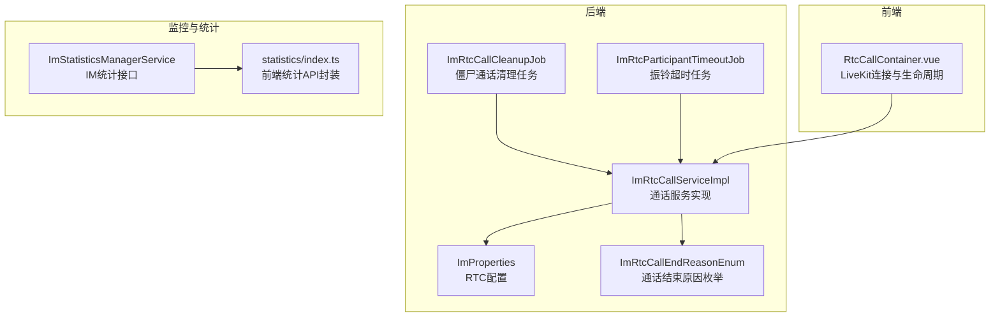
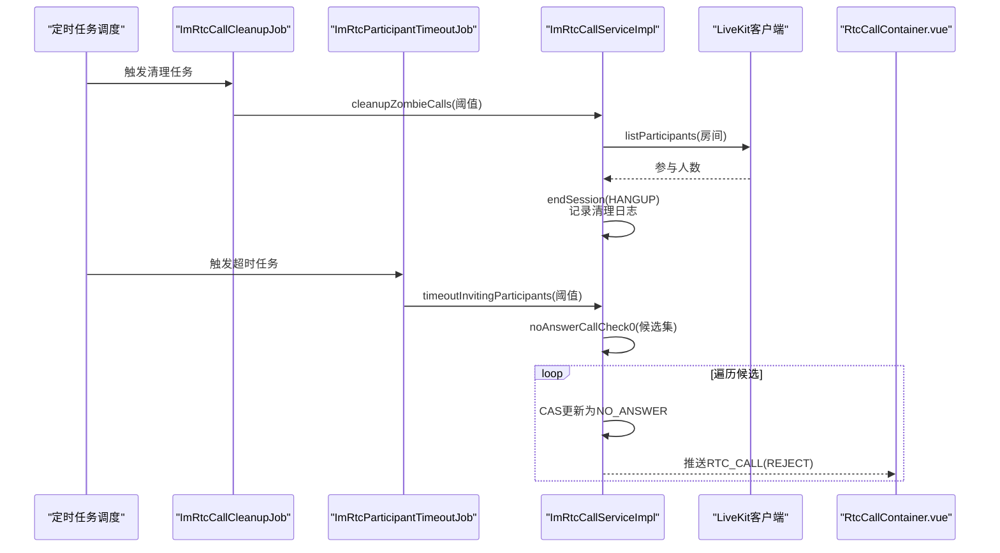
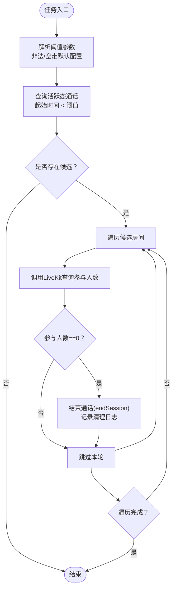
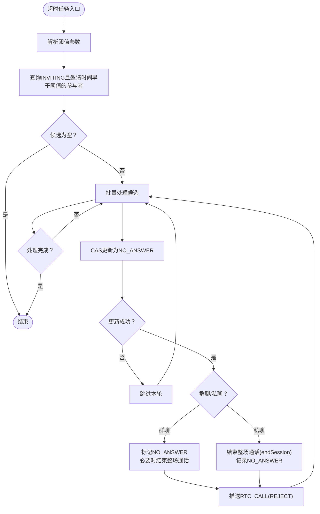
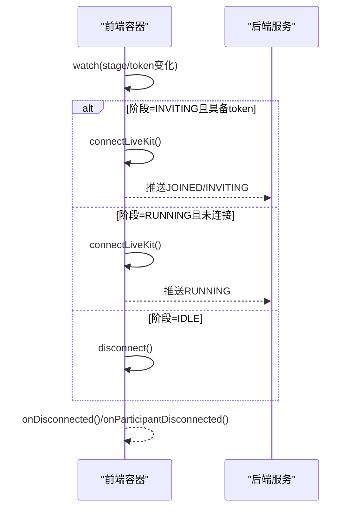
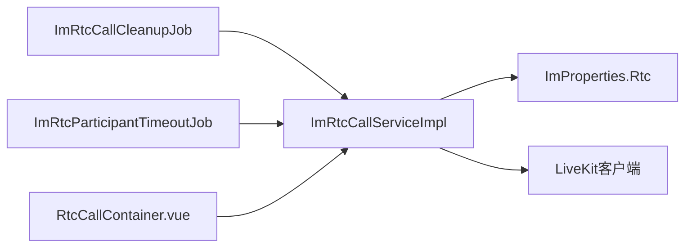

# 清理与监控

<cite>
**本文引用的文件**
- [ImRtcCallCleanupJob.java](file://yudao-module-im/src/main/java/cn/iocoder/yudao/module/im/job/rtc/ImRtcCallCleanupJob.java)
- [ImRtcParticipantTimeoutJob.java](file://yudao-module-im/src/main/java/cn/iocoder/yudao/module/im/job/rtc/ImRtcParticipantTimeoutJob.java)
- [ImRtcCallServiceImpl.java](file://yudao-module-im/src/main/java/cn/iocoder/yudao/module/im/service/rtc/ImRtcCallServiceImpl.java)
- [ImProperties.java](file://yudao-module-im/src/main/java/cn/iocoder/yudao/module/im/framework/config/ImProperties.java)
- [ImRtcCallEndReasonEnum.java](file://yudao-module-im/src/main/java/cn/iocoder/yudao/module/im/enums/rtc/ImRtcCallEndReasonEnum.java)
- [RtcCallContainer.vue](file://yudao-ui/yudao-ui-admin-vue3/src/views/im/home/components/rtc/RtcCallContainer.vue)
- [index.ts](file://yudao-ui/yudao-ui-admin-vue3/src/api/im/manager/statistics/index.ts)
- [ImStatisticsManagerService.java](file://yudao-module-im/src/main/java/cn/iocoder/yudao/module/im/service/statistics/ImStatisticsManagerService.java)
- [deploy.sh](file://script/shell/deploy.sh)
- [ApiAccessLogCreateReqDTO.java](file://yudao-framework/yudao-common/src/main/java/cn/iocoder/yudao/framework/common/biz/infra/logger/dto/ApiAccessLogCreateReqDTO.java)
- [OperateLogCreateReqDTO.java](file://yudao-framework/yudao-common/src/main/java/cn/iocoder/yudao/framework/common/biz/system/logger/dto/OperateLogCreateReqDTO.java)
- [OperateLogCommonApi.java](file://yudao-framework/yudao-common/src/main/java/cn/iocoder/yudao/framework/common/biz/system/logger/OperateLogCommonApi.java)
</cite>

## 目录
1. [简介](#简介)
2. [项目结构](#项目结构)
3. [核心组件](#核心组件)
4. [架构总览](#架构总览)
5. [详细组件分析](#详细组件分析)
6. [依赖关系分析](#依赖关系分析)
7. [性能考量](#性能考量)
8. [故障排查指南](#故障排查指南)
9. [结论](#结论)
10. [附录](#附录)

## 简介
本技术文档聚焦于实时音视频通话的“清理与监控”能力，围绕以下主题展开：
- 僵尸通话清理机制：基于定时任务扫描与LiveKit房间真实参与人数联动，兜底异常场景。
- 超时处理机制：振铃超时检测与NO_ANSWER状态处理，确保通话状态一致性。
- 监控指标设计：通话时长统计、参与人数分析、成功率计算等。
- 健康检查机制：LiveKit连接状态监控与会话完整性验证。
- 告警与自动恢复：异常通知与自动恢复策略建议。
- 性能监控：CPU、内存、网络延迟等指标建议。
- 日志记录策略：关键操作日志与审计追踪。
- 监控仪表板设计与最佳实践。

## 项目结构
IM模块中的清理与监控涉及后端定时任务、通话服务、前端连接容器、配置与统计接口等组件。下图给出与本文相关的核心文件与职责映射：

图表来源
- [ImRtcCallCleanupJob.java:1-58](file://yudao-module-im/src/main/java/cn/iocoder/yudao/module/im/job/rtc/ImRtcCallCleanupJob.java#L1-L58)
- [ImRtcParticipantTimeoutJob.java:1-58](file://yudao-module-im/src/main/java/cn/iocoder/yudao/module/im/job/rtc/ImRtcParticipantTimeoutJob.java#L1-L58)
- [ImRtcCallServiceImpl.java:600-700](file://yudao-module-im/src/main/java/cn/iocoder/yudao/module/im/service/rtc/ImRtcCallServiceImpl.java#L600-L700)
- [ImProperties.java:140-152](file://yudao-module-im/src/main/java/cn/iocoder/yudao/module/im/framework/config/ImProperties.java#L140-L152)
- [ImRtcCallEndReasonEnum.java:1-41](file://yudao-module-im/src/main/java/cn/iocoder/yudao/module/im/enums/rtc/ImRtcCallEndReasonEnum.java#L1-L41)
- [RtcCallContainer.vue:230-309](file://yudao-ui/yudao-ui-admin-vue3/src/views/im/home/components/rtc/RtcCallContainer.vue#L230-L309)
- [ImStatisticsManagerService.java:1-53](file://yudao-module-im/src/main/java/cn/iocoder/yudao/module/im/service/statistics/ImStatisticsManagerService.java#L1-L53)
- [index.ts:1-70](file://yudao-ui/yudao-ui-admin-vue3/src/api/im/manager/statistics/index.ts#L1-L70)

章节来源
- [ImRtcCallCleanupJob.java:1-58](file://yudao-module-im/src/main/java/cn/iocoder/yudao/module/im/job/rtc/ImRtcCallCleanupJob.java#L1-L58)
- [ImRtcParticipantTimeoutJob.java:1-58](file://yudao-module-im/src/main/java/cn/iocoder/yudao/module/im/job/rtc/ImRtcParticipantTimeoutJob.java#L1-L58)
- [ImRtcCallServiceImpl.java:600-700](file://yudao-module-im/src/main/java/cn/iocoder/yudao/module/im/service/rtc/ImRtcCallServiceImpl.java#L600-L700)
- [ImProperties.java:140-152](file://yudao-module-im/src/main/java/cn/iocoder/yudao/module/im/framework/config/ImProperties.java#L140-L152)
- [ImRtcCallEndReasonEnum.java:1-41](file://yudao-module-im/src/main/java/cn/iocoder/yudao/module/im/enums/rtc/ImRtcCallEndReasonEnum.java#L1-L41)
- [RtcCallContainer.vue:230-309](file://yudao-ui/yudao-ui-admin-vue3/src/views/im/home/components/rtc/RtcCallContainer.vue#L230-L309)
- [ImStatisticsManagerService.java:1-53](file://yudao-module-im/src/main/java/cn/iocoder/yudao/module/im/service/statistics/ImStatisticsManagerService.java#L1-L53)
- [index.ts:1-70](file://yudao-ui/yudao-ui-admin-vue3/src/api/im/manager/statistics/index.ts#L1-L70)

## 核心组件
- 僵尸通话清理任务：周期性扫描处于活跃态但长时间未有LiveKit参与者的房间，强制结束通话，防止资源泄漏。
- 振铃超时任务：扫描处于INVITING态且超过阈值的参与者，标记为NO_ANSWER并推动通话状态更新。
- 通话服务实现：提供清理、超时处理、结束会话、NO_ANSWER批量处理等核心逻辑。
- RTC配置：集中管理清理阈值、振铃超时阈值等运行参数。
- 通话结束原因枚举：统一落地历史消息文案与状态语义。
- 前端连接容器：负责LiveKit连接、断开、阶段切换与异常回滚。
- 统计接口：提供IM维度的KPI概览与趋势数据，支撑仪表板。

章节来源
- [ImRtcCallCleanupJob.java:1-58](file://yudao-module-im/src/main/java/cn/iocoder/yudao/module/im/job/rtc/ImRtcCallCleanupJob.java#L1-L58)
- [ImRtcParticipantTimeoutJob.java:1-58](file://yudao-module-im/src/main/java/cn/iocoder/yudao/module/im/job/rtc/ImRtcParticipantTimeoutJob.java#L1-L58)
- [ImRtcCallServiceImpl.java:600-700](file://yudao-module-im/src/main/java/cn/iocoder/yudao/module/im/service/rtc/ImRtcCallServiceImpl.java#L600-L700)
- [ImProperties.java:140-152](file://yudao-module-im/src/main/java/cn/iocoder/yudao/module/im/framework/config/ImProperties.java#L140-L152)
- [ImRtcCallEndReasonEnum.java:1-41](file://yudao-module-im/src/main/java/cn/iocoder/yudao/module/im/enums/rtc/ImRtcCallEndReasonEnum.java#L1-L41)
- [RtcCallContainer.vue:230-309](file://yudao-ui/yudao-ui-admin-vue3/src/views/im/home/components/rtc/RtcCallContainer.vue#L230-L309)
- [ImStatisticsManagerService.java:1-53](file://yudao-module-im/src/main/java/cn/iocoder/yudao/module/im/service/statistics/ImStatisticsManagerService.java#L1-L53)

## 架构总览
下图展示“清理与监控”的整体交互：定时任务驱动服务层清理/超时处理，服务层与LiveKit客户端协作，前端容器负责连接与阶段推进，统计接口为仪表板提供数据。

图表来源
- [ImRtcCallCleanupJob.java:34-41](file://yudao-module-im/src/main/java/cn/iocoder/yudao/module/im/job/rtc/ImRtcCallCleanupJob.java#L34-L41)
- [ImRtcParticipantTimeoutJob.java:34-41](file://yudao-module-im/src/main/java/cn/iocoder/yudao/module/im/job/rtc/ImRtcParticipantTimeoutJob.java#L34-L41)
- [ImRtcCallServiceImpl.java:600-700](file://yudao-module-im/src/main/java/cn/iocoder/yudao/module/im/service/rtc/ImRtcCallServiceImpl.java#L600-L700)
- [RtcCallContainer.vue:230-309](file://yudao-ui/yudao-ui-admin-vue3/src/views/im/home/components/rtc/RtcCallContainer.vue#L230-L309)

## 详细组件分析

### 僵尸通话清理机制
- 触发方式：定时任务周期扫描，支持传入自定义阈值或使用配置默认值。
- 扫描策略：筛选活跃态且起始时间早于阈值的通话，逐一查询LiveKit房间真实参与人数。
- 清理条件：当房间参与人数为0时，结束通话并记录清理日志。
- 阈值设置：通过配置项控制清理阈值（分钟），避免误杀刚发起的零人态通话。

图表来源
- [ImRtcCallCleanupJob.java:34-56](file://yudao-module-im/src/main/java/cn/iocoder/yudao/module/im/job/rtc/ImRtcCallCleanupJob.java#L34-L56)
- [ImRtcCallServiceImpl.java:600-629](file://yudao-module-im/src/main/java/cn/iocoder/yudao/module/im/service/rtc/ImRtcCallServiceImpl.java#L600-L629)
- [ImProperties.java:140-152](file://yudao-module-im/src/main/java/cn/iocoder/yudao/module/im/framework/config/ImProperties.java#L140-L152)

章节来源
- [ImRtcCallCleanupJob.java:1-58](file://yudao-module-im/src/main/java/cn/iocoder/yudao/module/im/job/rtc/ImRtcCallCleanupJob.java#L1-L58)
- [ImRtcCallServiceImpl.java:600-629](file://yudao-module-im/src/main/java/cn/iocoder/yudao/module/im/service/rtc/ImRtcCallServiceImpl.java#L600-L629)
- [ImProperties.java:140-152](file://yudao-module-im/src/main/java/cn/iocoder/yudao/module/im/framework/config/ImProperties.java#L140-L152)

### 超时处理机制：振铃超时与NO_ANSWER状态
- 触发方式：定时任务扫描INVITING态且邀请时间早于阈值的参与者。
- 单人粒度处理：采用CAS将INVITING原子更新为NO_ANSWER，避免并发冲突。
- 群/私聊差异：
  - 群聊：更新为NO_ANSWER后，进一步判定是否需要结束整场通话。
  - 私聊：被叫超时即整通话结束，调用结束会话并记录结束原因。
- 前端联动：服务端推送RTC_CALL(REJECT)，前端收敛对应banner。

图表来源
- [ImRtcParticipantTimeoutJob.java:34-56](file://yudao-module-im/src/main/java/cn/iocoder/yudao/module/im/job/rtc/ImRtcParticipantTimeoutJob.java#L34-L56)
- [ImRtcCallServiceImpl.java:632-700](file://yudao-module-im/src/main/java/cn/iocoder/yudao/module/im/service/rtc/ImRtcCallServiceImpl.java#L632-L700)
- [ImRtcCallEndReasonEnum.java:16-23](file://yudao-module-im/src/main/java/cn/iocoder/yudao/module/im/enums/rtc/ImRtcCallEndReasonEnum.java#L16-L23)

章节来源
- [ImRtcParticipantTimeoutJob.java:1-58](file://yudao-module-im/src/main/java/cn/iocoder/yudao/module/im/job/rtc/ImRtcParticipantTimeoutJob.java#L1-L58)
- [ImRtcCallServiceImpl.java:632-700](file://yudao-module-im/src/main/java/cn/iocoder/yudao/module/im/service/rtc/ImRtcCallServiceImpl.java#L632-L700)
- [ImRtcCallEndReasonEnum.java:1-41](file://yudao-module-im/src/main/java/cn/iocoder/yudao/module/im/enums/rtc/ImRtcCallEndReasonEnum.java#L1-L41)

### 监控指标设计
- 通话时长统计：基于通话起止时间计算，支持按日/周/月趋势分析。
- 参与人数分析：区分私聊与群聊，统计房间平均/峰值参与人数。
- 成功率计算：总发起数与成功接通数的比率，结合NO_ANSWER、BUSY、ERROR等分类细化。
- 活跃用户与群组：新增用户/群组、日活/周活等基础KPI，用于宏观评估。

章节来源
- [ImStatisticsManagerService.java:1-53](file://yudao-module-im/src/main/java/cn/iocoder/yudao/module/im/service/statistics/ImStatisticsManagerService.java#L1-L53)
- [index.ts:1-70](file://yudao-ui/yudao-ui-admin-vue3/src/api/im/manager/statistics/index.ts#L1-L70)

### 健康检查机制
- LiveKit连接状态监控：前端容器在不同阶段（INVITING/RUNNING/IDLE）触发连接/断开，异常时回滚并重置。
- 会话完整性验证：后端通过清理任务与超时任务双重兜底，确保异常退出场景下的会话一致性。

图表来源
- [RtcCallContainer.vue:230-309](file://yudao-ui/yudao-ui-admin-vue3/src/views/im/home/components/rtc/RtcCallContainer.vue#L230-L309)

章节来源
- [RtcCallContainer.vue:230-309](file://yudao-ui/yudao-ui-admin-vue3/src/views/im/home/components/rtc/RtcCallContainer.vue#L230-L309)

### 告警机制与自动恢复
- 异常通知：对清理/超时任务执行失败、LiveKit查询异常、连接失败等场景记录日志并触发告警。
- 自动恢复：前端连接失败时主动leave回滚，后端通过清理任务兜底；超时任务定期扫描修正状态。

章节来源
- [ImRtcCallServiceImpl.java:614-626](file://yudao-module-im/src/main/java/cn/iocoder/yudao/module/im/service/rtc/ImRtcCallServiceImpl.java#L614-L626)
- [RtcCallContainer.vue:294-304](file://yudao-ui/yudao-ui-admin-vue3/src/views/im/home/components/rtc/RtcCallContainer.vue#L294-L304)

### 性能监控建议
- CPU与内存：结合Spring Boot Admin与JVM指标，关注定时任务与WebSocket线程池负载。
- 网络延迟：LiveKit连接耗时、listParticipants调用耗时、WebSocket消息往返时间。
- 数据库与缓存：清理/超时扫描的SQL执行计划优化，Redis键空间与命令统计。

章节来源
- [deploy.sh:106-125](file://script/shell/deploy.sh#L106-L125)

### 日志记录策略
- 关键操作日志：清理/超时任务执行、结束会话、NO_ANSWER标记、LiveKit连接/断开等。
- 审计追踪：操作日志DTO包含开始/结束时间、耗时、结果码与消息，便于问题定位与合规审计。

章节来源
- [ApiAccessLogCreateReqDTO.java:78-103](file://yudao-framework/yudao-common/src/main/java/cn/iocoder/yudao/framework/common/biz/infra/logger/dto/ApiAccessLogCreateReqDTO.java#L78-L103)
- [OperateLogCreateReqDTO.java:1-61](file://yudao-framework/yudao-common/src/main/java/cn/iocoder/yudao/framework/common/biz/system/logger/dto/OperateLogCreateReqDTO.java#L1-L61)
- [OperateLogCommonApi.java:1-31](file://yudao-framework/yudao-common/src/main/java/cn/iocoder/yudao/framework/common/biz/system/logger/OperateLogCommonApi.java#L1-L31)

### 监控仪表板设计与最佳实践
- 仪表板要素：通话成功率、平均时长、参与人数分布、超时率、清理量趋势、LiveKit连接健康度。
- 最佳实践：分维度（日/周/月）展示趋势；对异常波动设置阈值告警；结合用户/群组KPI进行交叉分析。

章节来源
- [ImStatisticsManagerService.java:1-53](file://yudao-module-im/src/main/java/cn/iocoder/yudao/module/im/service/statistics/ImStatisticsManagerService.java#L1-L53)
- [index.ts:1-70](file://yudao-ui/yudao-ui-admin-vue3/src/api/im/manager/statistics/index.ts#L1-L70)

## 依赖关系分析
- 任务到服务：清理与超时任务均依赖通话服务实现具体逻辑。
- 服务到配置：服务层读取RTC配置决定清理/超时阈值。
- 服务到LiveKit：清理时查询参与人数，超时时更新参与者状态。
- 前端到服务：前端容器根据阶段变化触发连接/断开，并接收服务端推送的信令。

图表来源
- [ImRtcCallCleanupJob.java:20-27](file://yudao-module-im/src/main/java/cn/iocoder/yudao/module/im/job/rtc/ImRtcCallCleanupJob.java#L20-L27)
- [ImRtcParticipantTimeoutJob.java:20-27](file://yudao-module-im/src/main/java/cn/iocoder/yudao/module/im/job/rtc/ImRtcParticipantTimeoutJob.java#L20-L27)
- [ImRtcCallServiceImpl.java:600-700](file://yudao-module-im/src/main/java/cn/iocoder/yudao/module/im/service/rtc/ImRtcCallServiceImpl.java#L600-L700)
- [ImProperties.java:140-152](file://yudao-module-im/src/main/java/cn/iocoder/yudao/module/im/framework/config/ImProperties.java#L140-L152)
- [RtcCallContainer.vue:230-309](file://yudao-ui/yudao-ui-admin-vue3/src/views/im/home/components/rtc/RtcCallContainer.vue#L230-L309)

章节来源
- [ImRtcCallCleanupJob.java:1-58](file://yudao-module-im/src/main/java/cn/iocoder/yudao/module/im/job/rtc/ImRtcCallCleanupJob.java#L1-L58)
- [ImRtcParticipantTimeoutJob.java:1-58](file://yudao-module-im/src/main/java/cn/iocoder/yudao/module/im/job/rtc/ImRtcParticipantTimeoutJob.java#L1-L58)
- [ImRtcCallServiceImpl.java:600-700](file://yudao-module-im/src/main/java/cn/iocoder/yudao/module/im/service/rtc/ImRtcCallServiceImpl.java#L600-L700)
- [ImProperties.java:140-152](file://yudao-module-im/src/main/java/cn/iocoder/yudao/module/im/framework/config/ImProperties.java#L140-L152)
- [RtcCallContainer.vue:230-309](file://yudao-ui/yudao-ui-admin-vue3/src/views/im/home/components/rtc/RtcCallContainer.vue#L230-L309)

## 性能考量
- 批量处理与预查：超时处理阶段对用户与通话对象进行批量预查，减少N+1查询。
- 原子更新：使用CAS更新参与者状态，降低并发冲突带来的重复处理。
- 超时阈值：清理与超时阈值均大于1分钟，避免误杀刚发起的合理状态。
- 外部依赖容错：LiveKit查询异常时记录告警并跳过，保证任务稳定性。

章节来源
- [ImRtcCallServiceImpl.java:662-700](file://yudao-module-im/src/main/java/cn/iocoder/yudao/module/im/service/rtc/ImRtcCallServiceImpl.java#L662-L700)
- [ImRtcCallCleanupJob.java:49-56](file://yudao-module-im/src/main/java/cn/iocoder/yudao/module/im/job/rtc/ImRtcCallCleanupJob.java#L49-L56)
- [ImRtcParticipantTimeoutJob.java:49-56](file://yudao-module-im/src/main/java/cn/iocoder/yudao/module/im/job/rtc/ImRtcParticipantTimeoutJob.java#L49-L56)

## 故障排查指南
- 清理任务无效果
  - 检查阈值参数是否合法，确认默认配置是否生效。
  - 核对活跃态通话筛选条件与起始时间比较逻辑。
  - 关注LiveKit查询异常日志，确认房间参与人数统计准确性。
- 超时任务未触发NO_ANSWER
  - 确认INVITING态参与者筛选条件与邀请时间阈值。
  - 检查CAS更新是否成功，避免并发导致的状态变更失败。
  - 核对前端是否收到RTC_CALL(REJECT)推送。
- 前端连接失败
  - 查看connect异常日志，确认URL与Token有效性。
  - 连接失败时应主动leave回滚，避免后端残留忙线状态。

章节来源
- [ImRtcCallCleanupJob.java:34-56](file://yudao-module-im/src/main/java/cn/iocoder/yudao/module/im/job/rtc/ImRtcCallCleanupJob.java#L34-L56)
- [ImRtcParticipantTimeoutJob.java:34-56](file://yudao-module-im/src/main/java/cn/iocoder/yudao/module/im/job/rtc/ImRtcParticipantTimeoutJob.java#L34-L56)
- [ImRtcCallServiceImpl.java:614-626](file://yudao-module-im/src/main/java/cn/iocoder/yudao/module/im/service/rtc/ImRtcCallServiceImpl.java#L614-L626)
- [RtcCallContainer.vue:294-304](file://yudao-ui/yudao-ui-admin-vue3/src/views/im/home/components/rtc/RtcCallContainer.vue#L294-L304)

## 结论
通过“清理与监控”体系，系统实现了对僵尸通话与振铃超时的自动化治理，配合前端连接状态监控与统计指标，形成闭环的可观测性与可恢复性能力。建议持续优化阈值参数、完善告警策略，并结合仪表板进行多维数据分析，以提升通话质量与用户体验。

## 附录
- 配置项参考
  - 清理阈值：用于ImRtcCallCleanupJob的阈值解析与默认值选择。
  - 振铃超时：用于ImRtcParticipantTimeoutJob的阈值解析与默认值选择。
- 通话结束原因
  - NO_ANSWER：由超时任务触发，用于历史消息与统计口径统一。

章节来源
- [ImProperties.java:140-152](file://yudao-module-im/src/main/java/cn/iocoder/yudao/module/im/framework/config/ImProperties.java#L140-L152)
- [ImRtcCallEndReasonEnum.java:16-23](file://yudao-module-im/src/main/java/cn/iocoder/yudao/module/im/enums/rtc/ImRtcCallEndReasonEnum.java#L16-L23)